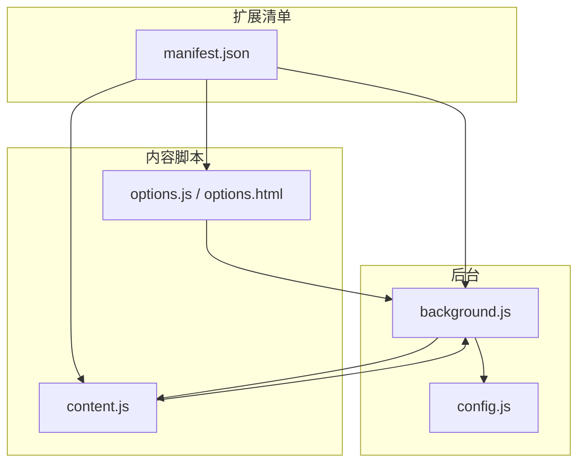
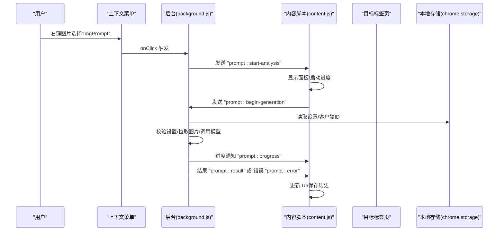
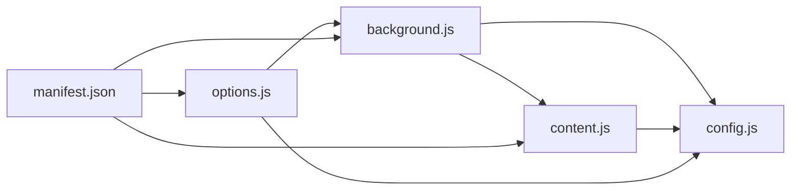

# API 参考

<cite>
**本文档引用的文件**
- [manifest.json](file://manifest.json)
- [background.js](file://background.js)
- [content.js](file://content.js)
- [config.js](file://config.js)
- [options.js](file://options.js)
- [options.html](file://options.html)
</cite>

## 目录
1. [简介](#简介)
2. [项目结构](#项目结构)
3. [核心组件](#核心组件)
4. [架构总览](#架构总览)
5. [详细组件分析](#详细组件分析)
6. [依赖关系分析](#依赖关系分析)
7. [性能考量](#性能考量)
8. [故障排查指南](#故障排查指南)
9. [结论](#结论)
10. [附录](#附录)

## 简介
本参考文档面向开发者，系统梳理 Img2Prompt Chrome 扩展的 API 使用与内部消息协议，覆盖以下方面：
- Chrome Extension API：runtime、storage、contextMenus、sidePanel、commands、tabs、activeTab、host_permissions 等
- 内部消息传递协议：请求/响应格式、错误处理机制、进度通知
- 配置管理接口：设置项定义、数据验证规则、i18n 支持
- 数据存储接口：本地存储的数据结构与访问模式
- 实际使用场景与集成建议

## 项目结构
该扩展采用 Manifest V3 架构，包含后台脚本、内容脚本、选项页面与共享配置模块。核心文件如下：
- manifest.json：声明权限、背景脚本、侧边栏、命令等
- background.js：后台服务工作线程，负责消息路由、生成流程、存储与分析事件
- content.js：内容脚本，负责 UI 面板、悬浮按钮、与后台通信
- config.js：共享配置（默认设置、提示词预设、UI 文案、错误码、分析配置）
- options.js / options.html：设置页面与逻辑，负责设置持久化、历史记录展示与操作
- 其他：图标资源、多语言消息文件（_locales）

图表来源
- [manifest.json:1-45](file://manifest.json#L1-L45)
- [background.js:1-12](file://background.js#L1-L12)
- [content.js:1-4](file://content.js#L1-L4)
- [config.js:1-12](file://config.js#L1-L12)
- [options.js:1-6](file://options.js#L1-L6)

章节来源
- [manifest.json:1-45](file://manifest.json#L1-L45)
- [background.js:1-12](file://background.js#L1-L12)
- [content.js:1-4](file://content.js#L1-L4)
- [config.js:1-12](file://config.js#L1-L12)
- [options.js:1-6](file://options.js#L1-L6)

## 核心组件
- 后台服务（background.js）
  - 注册上下文菜单、快捷键、安装/更新事件
  - 处理生成流程、进度通知、错误分类与用户提示
  - 读写本地存储、历史记录、分析事件上报
- 内容脚本（content.js）
  - 创建悬浮按钮与主面板，处理用户交互
  - 与后台通信，接收进度、结果、错误消息
  - 本地状态管理与 UI 更新
- 配置模块（config.js）
  - 默认设置、提示词预设、UI 文案、错误码映射、分析配置
- 设置页面（options.js / options.html）
  - 设置表单、预设模板、历史记录列表、自动保存与 i18n
- 清单文件（manifest.json）
  - 权限声明、后台脚本、侧边栏、命令、图标等

章节来源
- [background.js:19-57](file://background.js#L19-L57)
- [content.js:30-54](file://content.js#L30-L54)
- [config.js:4-253](file://config.js#L4-L253)
- [options.js:182-213](file://options.js#L182-L213)
- [manifest.json:8-44](file://manifest.json#L8-L44)

## 架构总览
扩展采用“后台服务 + 内容脚本 + 选项页面”的分层架构。后台负责业务编排与外部 API 交互；内容脚本负责用户界面与即时反馈；选项页面负责设置持久化与历史记录管理。

图表来源
- [background.js:59-72](file://background.js#L59-L72)
- [content.js:209-247](file://content.js#L209-L247)
- [background.js:212-320](file://background.js#L212-L320)

## 详细组件分析

### Chrome Extension API 使用

#### runtime API
- onInstalled：安装/更新事件监听，初始化客户端 ID、上下文菜单、侧边栏行为、默认设置
- onMessage：统一消息入口，处理分析事件、打开侧边栏、取消生成、设置更新广播、历史记录查询/删除/清空、开始生成
- sendMessage：向内容脚本发送消息（进度、结果、错误、历史加载）

使用要点
- 在后台注册消息监听器，返回 true 以支持异步响应
- 对于需要立即生效的设置变更，通过广播 "settings:updated" 通知所有标签页

章节来源
- [background.js:19-57](file://background.js#L19-L57)
- [background.js:94-184](file://background.js#L94-L184)
- [content.js:209-247](file://content.js#L209-L247)

#### storage API
- chrome.storage.local：存储设置、客户端 ID、历史记录、自定义模板
- 读写键名
  - 客户端 ID：clientId
  - 历史记录：promptHistory
  - 设置：DEFAULT_SETTINGS 中的所有键
  - 自定义模板：customTemplates
- 订阅变更：chrome.storage.onChanged，用于实时更新 UI

数据结构
- 客户端 ID：字符串（UUID）
- 历史记录：数组，每项包含 id、timestamp、prompts、srcUrl、imageDataUrl、pageUrl、model、trigger
- 设置：对象，包含 apiEndpoint、apiKey、model、requestFormat、anthropicVersion、hoverButtonEnabled、snippingShortcutEnabled、uiLanguage、maxImageEdge、apiTimeout、systemPrompt、userPrompt、temperature
- 自定义模板：对象，键为模板 ID，值含 title、prompt

章节来源
- [background.js:330-341](file://background.js#L330-L341)
- [background.js:412-463](file://background.js#L412-L463)
- [options.js:182-187](file://options.js#L182-L187)
- [content.js:113-141](file://content.js#L113-L141)

#### contextMenus API
- 创建菜单项：ImgPrompt（上下文为 image）
- 点击回调：构造请求 ID，向对应标签页发送 "prompt:start-analysis"

章节来源
- [background.js:21-25](file://background.js#L21-L25)
- [background.js:59-72](file://background.js#L59-L72)

#### sidePanel API
- setPanelBehavior：首次安装时设置点击动作打开侧边栏
- open：通过 "prompt:open-options" 请求打开侧边栏，若浏览器不支持则抛出错误

章节来源
- [background.js:27-31](file://background.js#L27-L31)
- [background.js:110-120](file://background.js#L110-L120)
- [background.js:186-210](file://background.js#L186-L210)

#### commands API
- 注册命令 capture_screenshot
- 快捷键触发：捕获当前窗口可见区域 PNG，向内容脚本发送 "prompt:start-snipping"

章节来源
- [manifest.json:13-21](file://manifest.json#L13-L21)
- [background.js:74-92](file://background.js#L74-L92)

#### tabs API
- query：查找活动标签页
- sendMessage：向内容脚本发送消息（进度、结果、错误、历史加载）

章节来源
- [background.js:80-81](file://background.js#L80-L81)
- [content.js:337-346](file://content.js#L337-L346)

#### activeTab、host_permissions
- activeTab：用于获取当前标签页信息
- host_permissions：通配符域名权限，允许对任意页面执行截图与内容脚本注入

章节来源
- [manifest.json:29](file://manifest.json#L29)
- [manifest.json:38](file://manifest.json#L38)

### 内部消息传递协议

消息类型与用途
- prompt:start-analysis：后台通知内容脚本开始分析（携带请求 ID、图片 URL、页面 URL、触发来源）
- prompt:start-snipping：后台通知内容脚本开始截图选取（携带 PNG 数据 URL）
- prompt:begin-generation：内容脚本请求后台开始生成（携带请求 ID、图片数据/URL、页面上下文、触发来源）
- prompt:progress：后台向内容脚本推送进度（携带请求 ID、百分比、阶段文本、阶段标识）
- prompt:result：后台返回最终结果（携带请求 ID、提示词、源信息）
- prompt:error：后台返回错误（携带请求 ID、错误码、用户友好消息）
- prompt:canceled：后台返回取消（携带请求 ID、错误码）
- prompt:cancel-generation：内容脚本请求取消（携带请求 ID）
- prompt:open-options：内容脚本请求打开侧边栏（携带发送者信息）
- settings:updated：设置更新广播（通知所有标签页刷新 UI）
- history:get / history:delete / history:clear：历史记录查询/删除/清空
- analytics:track：分析事件上报（携带事件名与属性）

请求/响应格式
- 请求：对象，包含 type 字段与必要参数
- 响应：对象，包含 ok 字段与成功/失败信息
  - 成功：{ ok: true, ... }
  - 失败：{ ok: false, error: string }

错误处理机制
- 后台对异常进行分类（NETWORK_ERROR、IMAGE_FETCH_FAILED、IMAGE_PROCESSING_FAILED、API_AUTH_FAILED、API_RATE_LIMITED、API_TIMEOUT、API_INVALID_RESPONSE、JSON_PARSE_FAILED、MISSING_FIELDS、CANCELED、UNKNOWN）
- 将错误码映射为用户可读消息，并通过 "prompt:error" 或 "prompt:canceled" 通知前端
- 对于扩展上下文失效（Receiving end does not exist）等可忽略错误，后台进行静默处理

章节来源
- [background.js:94-184](file://background.js#L94-L184)
- [background.js:875-894](file://background.js#L875-L894)
- [background.js:896-963](file://background.js#L896-L963)
- [content.js:209-247](file://content.js#L209-L247)

### 配置管理接口

默认设置（DEFAULT_SETTINGS）
- apiEndpoint：API 接口地址（默认 OpenAI 兼容接口）
- apiKey：API 密钥
- model：模型名称
- requestFormat：请求格式（auto/openai/anthropic）
- anthropicVersion：Anthropic API 版本
- hoverButtonEnabled：悬浮按钮开关
- snippingShortcutEnabled：截图快捷键开关
- uiLanguage：界面语言（zh/en）
- maxImageEdge：最大图像边长
- apiTimeout：API 超时（毫秒）
- systemPrompt：系统提示词
- userPrompt：用户提示词
- temperature：温度参数

i18n 与预设
- UI_STRINGS：中文/英文 UI 文案
- USER_PROMPT_PRESETS：多种场景的用户提示词预设
- SETTINGS_I18N：设置页面的多语言文案

验证规则
- validateSettings：校验 apiEndpoint、apiKey、model 是否存在
- requestViaOpenAICompatible：对 DeepSeek 等不支持的模型给出明确提示
- requestViaAnthropic：要求 base64 图像数据

章节来源
- [config.js:5-21](file://config.js#L5-L21)
- [config.js:33-114](file://config.js#L33-L114)
- [config.js:207-248](file://config.js#L207-L248)
- [background.js:465-476](file://background.js#L465-L476)
- [background.js:517-524](file://background.js#L517-L524)
- [background.js:606-614](file://background.js#L606-L614)

### 数据存储接口

本地存储键
- clientId：客户端唯一标识
- promptHistory：历史记录数组
- DEFAULT_SETTINGS：用户设置（与默认设置合并）
- customTemplates：自定义模板集合

读写策略
- 初始化：首次安装时写入默认设置
- 更新：自动保存（延迟 220ms），并广播 settings:updated
- 历史记录：最多保留 50 条，按时间倒序
- 自定义模板：持久化到 chrome.storage.local

章节来源
- [background.js:33-42](file://background.js#L33-L42)
- [background.js:412-463](file://background.js#L412-L463)
- [background.js:412-430](file://background.js#L412-L430)
- [options.js:384-402](file://options.js#L384-L402)

### 使用场景与示例路径

- 通过上下文菜单触发分析
  - 触发：右键图片 -> ImgPrompt
  - 后台：chrome.contextMenus.onClicked
  - 通知：sendTabMessage(tabId, { type: "prompt:start-analysis", ... })
  - 示例路径：[background.js:59-72](file://background.js#L59-L72)

- 通过快捷键截图分析
  - 触发：Alt/Option + S
  - 后台：chrome.commands.onCommand
  - 通知：sendTabMessage(tabId, { type: "prompt:start-snipping", dataUrl })
  - 示例路径：[background.js:74-92](file://background.js#L74-L92)

- 打开侧边栏设置
  - 触发：内容脚本发送 "prompt:open-options"
  - 后台：openSidePanelForSender
  - 示例路径：[background.js:110-120](file://background.js#L110-L120)、[background.js:186-210](file://background.js#L186-L210)

- 设置自动保存与广播
  - 触发：表单输入/变更
  - 后台：chrome.storage.local.set + chrome.runtime.sendMessage({ type: "settings:updated" })
  - 示例路径：[options.js:384-402](file://options.js#L384-L402)

- 历史记录管理
  - 查询：chrome.runtime.sendMessage({ type: "history:get" })
  - 删除/清空：chrome.runtime.sendMessage({ type: "history:delete"/":clear", id })
  - 示例路径：[options.js:215-245](file://options.js#L215-L245)、[options.js:359-364](file://options.js#L359-L364)

- 生成流程与进度
  - 开始：content.js 发送 "prompt:begin-generation"
  - 进度：后台发送 "prompt:progress"
  - 结果/错误：后台发送 "prompt:result"/"prompt:error"
  - 示例路径：[content.js:289-326](file://content.js#L289-L326)、[background.js:212-320](file://background.js#L212-L320)

## 依赖关系分析

图表来源
- [background.js:1-12](file://background.js#L1-L12)
- [content.js:1-4](file://content.js#L1-L4)
- [config.js:1-12](file://config.js#L1-L12)
- [options.js:1-6](file://options.js#L1-L6)
- [manifest.json:1-45](file://manifest.json#L1-L45)

章节来源
- [background.js:1-12](file://background.js#L1-L12)
- [content.js:1-4](file://content.js#L1-L4)
- [config.js:1-12](file://config.js#L1-L12)
- [options.js:1-6](file://options.js#L1-L6)
- [manifest.json:1-45](file://manifest.json#L1-L45)

## 性能考量
- 图像压缩：在后台统一进行图像获取与压缩，避免重复传输大体积数据
- 超时控制：结合 AbortSignal 与独立超时控制器，防止长时间阻塞
- 进度分段：将生成过程拆分为多个阶段，提升用户体验
- 存储上限：历史记录最多 50 条，避免无限增长

## 故障排查指南
常见问题与定位
- 无法获取图片/生成失败
  - 检查 apiEndpoint、apiKey、model 是否正确设置
  - 查看错误码映射与用户提示消息
  - 参考：[background.js:465-476](file://background.js#L465-L476)、[background.js:896-963](file://background.js#L896-L963)
- 截图快捷键无效
  - 确认快捷键已在 chrome://extensions/shortcuts 中启用
  - 检查 snippingShortcutEnabled 设置
  - 参考：[manifest.json:13-21](file://manifest.json#L13-L21)、[background.js:74-92](file://background.js#L74-L92)
- 侧边栏无法打开
  - 浏览器可能不支持 sidePanel API
  - 参考：[background.js:186-210](file://background.js#L186-L210)
- 设置未生效
  - 确认已触发自动保存并广播 settings:updated
  - 参考：[options.js:384-402](file://options.js#L384-L402)

章节来源
- [background.js:465-476](file://background.js#L465-L476)
- [background.js:896-963](file://background.js#L896-L963)
- [manifest.json:13-21](file://manifest.json#L13-L21)
- [background.js:74-92](file://background.js#L74-L92)
- [background.js:186-210](file://background.js#L186-L210)
- [options.js:384-402](file://options.js#L384-L402)

## 结论
本扩展通过清晰的后台-内容脚本分工与严格的内部消息协议，实现了从图片到提示词的完整链路。配置模块与本地存储提供了灵活的可定制能力，同时内置完善的错误分类与用户提示机制，便于集成与扩展。

## 附录

### API 一览表（按模块）

- runtime
  - onInstalled：初始化与事件上报
  - onMessage：消息路由与处理
  - sendMessage：向内容脚本发送消息
  - 参考：[background.js:19-57](file://background.js#L19-L57)、[background.js:94-184](file://background.js#L94-L184)

- storage
  - local.get/set/remove：设置、历史记录、模板、客户端 ID
  - onChanged：监听设置变化
  - 参考：[background.js:33-42](file://background.js#L33-L42)、[background.js:412-463](file://background.js#L412-L463)、[content.js:113-141](file://content.js#L113-L141)

- contextMenus
  - create：创建上下文菜单
  - onClicked：菜单点击回调
  - 参考：[background.js:21-25](file://background.js#L21-L25)、[background.js:59-72](file://background.js#L59-L72)

- sidePanel
  - setPanelBehavior：安装时设置行为
  - open：打开侧边栏
  - 参考：[background.js:27-31](file://background.js#L27-L31)、[background.js:186-210](file://background.js#L186-L210)

- commands
  - onCommand：快捷键监听
  - 参考：[manifest.json:13-21](file://manifest.json#L13-L21)、[background.js:74-92](file://background.js#L74-L92)

- tabs
  - query：查找活动标签页
  - sendMessage：向内容脚本发送消息
  - 参考：[background.js:80-81](file://background.js#L80-L81)、[content.js:337-346](file://content.js#L337-L346)

- activeTab、host_permissions
  - activeTab：获取当前标签页
  - host_permissions：通配符域名权限
  - 参考：[manifest.json:29](file://manifest.json#L29)、[manifest.json:38](file://manifest.json#L38)

### 消息协议字段规范

- 通用字段
  - type：消息类型（必填）
  - requestId：请求唯一标识（可选）
  - ok/error：响应状态与错误信息（可选）

- prompt:start-analysis
  - srcUrl/pageUrl/trigger：来源信息
  - 示例路径：[background.js:64-71](file://background.js#L64-L71)

- prompt:start-snipping
  - dataUrl：PNG 数据 URL
  - 示例路径：[background.js:84-88](file://background.js#L84-L88)

- prompt:begin-generation
  - srcUrl/imageDataUrl/pageContext/trigger：生成参数
  - 示例路径：[content.js:289-301](file://content.js#L289-L301)

- prompt:progress
  - progress/text/stage：进度百分比、阶段文本、阶段标识
  - 示例路径：[background.js:875-883](file://background.js#L875-L883)

- prompt:result
  - prompts/source：提示词与来源
  - 示例路径：[background.js:256-264](file://background.js#L256-L264)

- prompt:error/prompt:canceled
  - errorCode/message：错误码与用户提示
  - 示例路径：[background.js:300-305](file://background.js#L300-L305)、[background.js:282-286](file://background.js#L282-L286)

- prompt:cancel-generation
  - requestId：请求标识
  - 示例路径：[content.js:1354-1357](file://content.js#L1354-L1357)

- prompt:open-options
  - 示例路径：[background.js:110-120](file://background.js#L110-L120)

- settings:updated
  - 示例路径：[background.js:134-147](file://background.js#L134-L147)

- history:get/delete/clear
  - 示例路径：[options.js:215-245](file://options.js#L215-L245)、[options.js:359-364](file://options.js#L359-L364)

- analytics:track
  - 示例路径：[options.js:468-482](file://options.js#L468-L482)