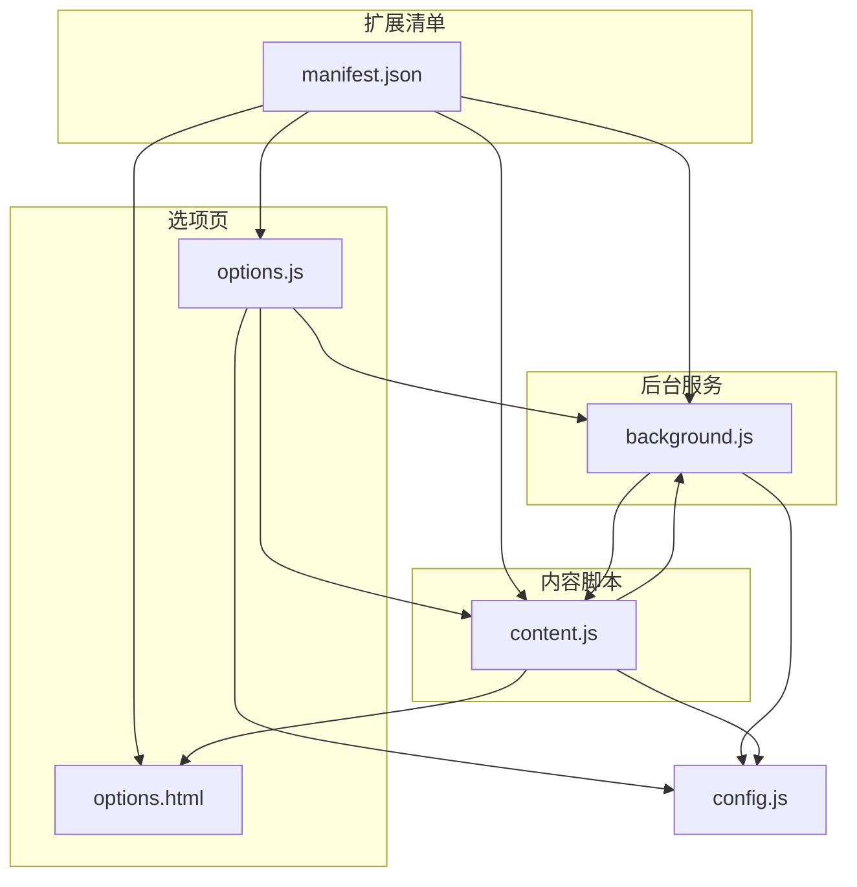
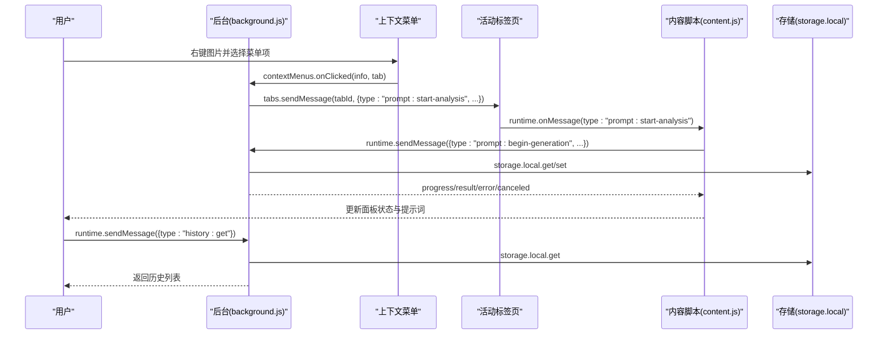
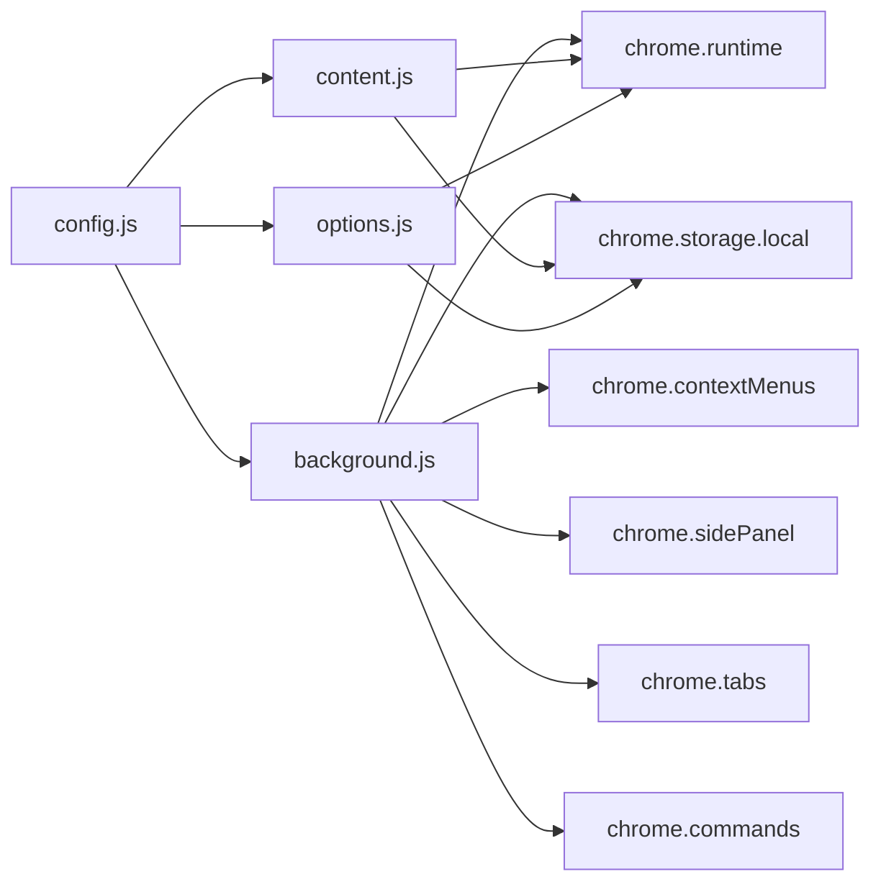

# Chrome 扩展 API

<cite>
**本文引用的文件**
- [manifest.json](file://manifest.json)
- [background.js](file://background.js)
- [content.js](file://content.js)
- [options.js](file://options.js)
- [config.js](file://config.js)
- [options.html](file://options.html)
</cite>

## 目录
1. [简介](#简介)
2. [项目结构](#项目结构)
3. [核心组件](#核心组件)
4. [架构总览](#架构总览)
5. [详细组件分析](#详细组件分析)
6. [依赖关系分析](#依赖关系分析)
7. [性能考量](#性能考量)
8. [故障排查指南](#故障排查指南)
9. [结论](#结论)
10. [附录](#附录)

## 简介
本文件为 Img2Prompt Chrome 扩展的 Chrome Extension API 参考文档，聚焦以下核心 API 的使用与实现：
- runtime API：消息传递（chrome.runtime.sendMessage、chrome.runtime.onMessage）、命令触发（chrome.commands.onCommand）
- storage API：chrome.storage.local 的读写、持久化策略与异步处理模式
- contextMenus API：右键菜单创建与点击事件处理
- sidePanel API：默认侧边栏页面配置与程序化控制

文档以“概念—实现—最佳实践”的方式组织，结合项目源码路径与实际使用场景，帮助开发者快速理解与复用。

## 项目结构
该项目采用 Manifest V3 架构，包含后台脚本、内容脚本、选项页与共享配置。关键文件职责如下：
- manifest.json：声明权限、背景脚本、侧边栏默认路径、快捷键等
- background.js：扩展生命周期、消息路由、上下文菜单、命令监听、存储初始化与历史管理
- content.js：页面注入脚本，负责 UI 面板、悬浮按钮、消息收发、设置变更同步
- options.js + options.html：设置页与历史记录管理，通过 runtime API 与后台通信
- config.js：全局配置常量、默认设置、提示词预设、UI 文案与错误码

图表来源
- [manifest.json:1-45](file://manifest.json#L1-L45)
- [background.js:1-945](file://background.js#L1-L945)
- [content.js:1-1578](file://content.js#L1-L1578)
- [options.js:1-489](file://options.js#L1-L489)
- [options.html:1-584](file://options.html#L1-L584)
- [config.js:1-253](file://config.js#L1-L253)

章节来源
- [manifest.json:1-45](file://manifest.json#L1-L45)

## 核心组件
- 运行时消息通道：后台与内容脚本之间通过 chrome.runtime.onMessage/onMessageListener 实现双向通信；选项页通过 chrome.runtime.sendMessage 访问后台能力（如历史查询、设置更新通知）
- 存储系统：使用 chrome.storage.local 保存设置、历史记录、客户端 ID 等，提供异步读写与 onChanged 监听
- 上下文菜单：注册右键菜单项，监听点击事件并转发给内容脚本
- 侧边栏控制：在安装时设置默认侧边栏路径；根据需要程序化打开侧边栏

章节来源
- [background.js:19-57](file://background.js#L19-L57)
- [content.js:209-247](file://content.js#L209-L247)
- [options.js:215-245](file://options.js#L215-L245)

## 架构总览
下图展示了消息流与模块交互关系，涵盖 runtime、storage、contextMenus、sidePanel 的关键调用链。

图表来源
- [background.js:59-72](file://background.js#L59-L72)
- [background.js:134-147](file://background.js#L134-L147)
- [content.js:209-247](file://content.js#L209-L247)
- [content.js:289-326](file://content.js#L289-L326)
- [options.js:215-220](file://options.js#L215-L220)

## 详细组件分析

### runtime API：消息传递与命令
- extension.sendMessage 与 tabs.sendMessage
  - 后台向内容脚本发送消息：后台在上下文菜单点击或快捷键触发后，使用 tabs.sendMessage 将“开始分析/截屏”指令推送到对应标签页
  - 内容脚本向后台发起请求：内容脚本在用户操作后，通过 runtime.sendMessage 发送“开始生成”、“取消生成”、“统计事件”等请求，后台统一处理并回传响应
  - 选项页与后台通信：选项页通过 runtime.sendMessage 查询/清理历史记录，或通知设置更新

- 异步与响应模式
  - 后台 onMessage 回调中，对不同 type 分派处理；部分请求采用 Promise 异步处理并在回调中 sendResponse 返回结果
  - 内容脚本封装了 safeSendRuntimeMessage，捕获扩展上下文失效等异常，避免因端点不存在导致崩溃

- 最佳实践
  - 使用唯一 type 字段区分消息类型，便于维护与扩展
  - 对可能失败的跨端消息调用，建议在调用方做兜底处理（如 safeSendRuntimeMessage 的错误分支）
  - 对长耗时任务，分阶段发送 progress 消息，提升用户体验

章节来源
- [background.js:59-72](file://background.js#L59-L72)
- [background.js:134-147](file://background.js#L134-L147)
- [background.js:94-184](file://background.js#L94-L184)
- [content.js:289-326](file://content.js#L289-L326)
- [content.js:65-75](file://content.js#L65-L75)
- [options.js:215-220](file://options.js#L215-L220)

### storage API：本地存储与持久化
- 读写操作
  - 初始化默认设置：扩展安装时，后台读取 DEFAULT_SETTINGS，若某键未存在则写入默认值
  - 设置项持久化：选项页自动保存用户设置，使用 chrome.storage.local.set；内容脚本通过 chrome.storage.local.get 获取 UI 相关偏好
  - 历史记录：后台提供历史增删查清接口，均基于 chrome.storage.local 进行读写

- 数据持久化策略
  - 客户端 ID：首次安装生成 UUID 并持久化，作为匿名统计标识
  - 历史上限：最多保留固定数量的历史条目，超出则截断
  - 设置变更广播：当设置更新时，后台遍历所有标签页，向每个活跃标签页发送 settings:updated 消息，确保 UI 即时同步

- 异步处理模式
  - 所有读写均为 Promise 风格异步；错误统一捕获并返回字符串化错误信息，便于前端展示

- 最佳实践
  - 使用对象键集合批量读取/写入，减少多次往返
  - 对大对象（如历史列表）注意大小限制，必要时做分页或压缩
  - 在 UI 层监听 storage.onChanged，及时刷新界面状态

章节来源
- [background.js:33-42](file://background.js#L33-L42)
- [background.js:412-463](file://background.js#L412-L463)
- [background.js:432-463](file://background.js#L432-L463)
- [content.js:102-141](file://content.js#L102-L141)
- [options.js:384-402](file://options.js#L384-L402)

### contextMenus API：右键菜单与动态交互
- 创建菜单
  - 扩展安装时，后台调用 chrome.contextMenus.create 注册一个针对图片的右键菜单项，ID 为固定常量

- 事件处理
  - 监听 contextMenus.onClicked，当用户点击该菜单项时，生成唯一 requestId，随后通过 tabs.sendMessage 将“开始分析”消息发送至对应标签页

- 最佳实践
  - 菜单项 ID 建议使用稳定字符串，避免重复创建
  - 在回调中优先校验 tab.id 与菜单项 ID，确保只处理目标上下文
  - 结合页面上下文（如 srcUrl/pageUrl）传递给内容脚本，提升分析准确性

章节来源
- [background.js:19-25](file://background.js#L19-L25)
- [background.js:59-72](file://background.js#L59-L72)

### sidePanel API：默认侧边栏与程序化控制
- 默认侧边栏页面
  - 清单中通过 side_panel.default_path 指定默认侧边栏页面为 options.html

- 程序化控制
  - 安装时设置 openPanelOnActionClick 行为，使点击扩展图标自动打开侧边栏
  - 当收到“打开设置页”请求时，后台根据发送者 tab 的 windowId 程序化打开侧边栏

- 最佳实践
  - 在调用 open/setPanelBehavior 前检查浏览器支持情况，避免在不支持的环境中报错
  - 打开侧边栏前确保存在可用窗口，否则给出明确错误提示

章节来源
- [manifest.json:39-41](file://manifest.json#L39-L41)
- [background.js:27-31](file://background.js#L27-L31)
- [background.js:186-210](file://background.js#L186-L210)

## 依赖关系分析
- 模块耦合
  - background.js 与 content.js 通过 runtime/tabs API 强耦合，形成消息中继枢纽
  - options.js 与 background.js 通过 runtime API 间接耦合，实现设置页与后台的数据同步
  - config.js 为全局配置中心，被 background/content/options 共享

- 外部依赖
  - 浏览器原生 API：chrome.runtime、chrome.storage、chrome.contextMenus、chrome.sidePanel、chrome.tabs、chrome.commands
  - 第三方统计：PostHog（通过 fetch 调用）

图表来源
- [background.js:19-57](file://background.js#L19-L57)
- [content.js:1-50](file://content.js#L1-L50)
- [options.js:1-25](file://options.js#L1-L25)
- [config.js:4-253](file://config.js#L4-L253)

章节来源
- [background.js:19-57](file://background.js#L19-L57)
- [content.js:1-50](file://content.js#L1-L50)
- [options.js:1-25](file://options.js#L1-L25)

## 性能考量
- 消息分层与节流
  - 对高频 UI 事件（如指针移动）使用节流函数，降低事件处理频率
  - 进度更新采用定时器轮询，但仅在生成过程中运行，结束后及时清理

- 存储优化
  - 批量读取/写入设置，减少往返次数
  - 历史记录截断，避免无限增长

- 网络与模型调用
  - 图像压缩与尺寸限制，降低请求体大小
  - 超时与取消机制，避免长时间阻塞

[本节为通用指导，无需列出具体文件来源]

## 故障排查指南
- “扩展上下文失效”类错误
  - 现象：调用 runtime.sendMessage 抛出“扩展上下文无效/接收端不存在”等错误
  - 处理：使用 safeSendRuntimeMessage 包裹调用，捕获此类错误并优雅降级
  - 参考路径：[content.js:56-75](file://content.js#L56-L75)

- 侧边栏打开失败
  - 现象：调用 open 时提示“当前浏览器不支持侧边栏 API”
  - 处理：在调用前检查 chrome.sidePanel 是否存在；若不存在，提示用户升级浏览器版本
  - 参考路径：[background.js:186-189](file://background.js#L186-L189)

- 历史记录为空或读取失败
  - 现象：历史查询返回空数组或报错
  - 处理：确认 storage.local.get 成功；检查键名一致；在 UI 层打印日志辅助定位
  - 参考路径：[background.js:432-440](file://background.js#L432-L440)，[options.js:215-220](file://options.js#L215-L220)

- 设置更新未生效
  - 现象：更改设置后 UI 未即时更新
  - 处理：确认后台已广播 settings:updated；内容脚本已监听 storage.onChanged 并刷新 UI
  - 参考路径：[background.js:134-147](file://background.js#L134-L147)，[content.js:113-141](file://content.js#L113-L141)

章节来源
- [content.js:56-75](file://content.js#L56-L75)
- [background.js:186-189](file://background.js#L186-L189)
- [background.js:432-440](file://background.js#L432-L440)
- [options.js:215-220](file://options.js#L215-L220)
- [background.js:134-147](file://background.js#L134-L147)
- [content.js:113-141](file://content.js#L113-L141)

## 结论
本项目以 Manifest V3 为基础，围绕 runtime、storage、contextMenus、sidePanel 四大 API 构建了完整的消息中继、设置持久化、右键入口与侧边栏控制体系。通过清晰的消息类型划分、完善的错误处理与异步模式，实现了稳定的跨端通信与良好的用户体验。建议在后续迭代中：
- 对关键 API 调用增加更细粒度的错误分类与上报
- 优化存储结构，考虑分表或分段存储历史记录
- 增强侧边栏行为的可配置性（如是否自动打开、打开时机）

[本节为总结性内容，无需列出具体文件来源]

## 附录

### API 使用要点速查
- runtime.sendMessage
  - 用途：内容脚本向后台发送请求（如开始生成、取消生成、统计事件）
  - 参考路径：[content.js:289-326](file://content.js#L289-L326)，[content.js:1354-1362](file://content.js#L1354-L1362)，[content.js:1570-1577](file://content.js#L1570-L1577)

- tabs.sendMessage
  - 用途：后台向指定标签页推送分析/截屏指令
  - 参考路径：[background.js:65-71](file://background.js#L65-L71)，[background.js:85-88](file://background.js#L85-L88)

- chrome.storage.local
  - 用途：读写设置、历史、客户端 ID；监听变更
  - 参考路径：[background.js:33-42](file://background.js#L33-L42)，[background.js:412-463](file://background.js#L412-L463)，[content.js:102-141](file://content.js#L102-L141)

- chrome.contextMenus
  - 用途：注册右键菜单；处理点击事件
  - 参考路径：[background.js:19-25](file://background.js#L19-L25)，[background.js:59-72](file://background.js#L59-L72)

- chrome.sidePanel
  - 用途：设置默认侧边栏路径；程序化打开侧边栏
  - 参考路径：[manifest.json:39-41](file://manifest.json#L39-L41)，[background.js:27-31](file://background.js#L27-L31)，[background.js:186-210](file://background.js#L186-L210)

### 在 Img2Prompt 中的应用场景与最佳实践
- 右键菜单入口
  - 场景：用户在任意图片上右键，选择“ImgPrompt”后立即开始分析
  - 最佳实践：携带 srcUrl/pageUrl 触发来源，便于内容脚本预览与统计

- 快捷键截屏
  - 场景：按下 Alt/Option+S，对当前可视区域截图并分析
  - 最佳实践：在选项页中允许禁用快捷键；对截图失败进行降级处理

- 设置页与后台联动
  - 场景：选项页保存设置后，立即通知所有标签页刷新 UI
  - 最佳实践：使用 settings:updated 广播；内容脚本监听 storage.onChanged 与 runtime.onMessage 双通道

- 历史记录管理
  - 场景：在设置页查看/删除/清空历史
  - 最佳实践：使用 runtime.sendMessage 查询历史；后台统一截断长度，避免膨胀

章节来源
- [background.js:59-72](file://background.js#L59-L72)
- [background.js:74-92](file://background.js#L74-L92)
- [content.js:289-326](file://content.js#L289-L326)
- [options.js:384-402](file://options.js#L384-L402)
- [options.js:215-245](file://options.js#L215-L245)