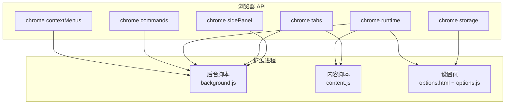
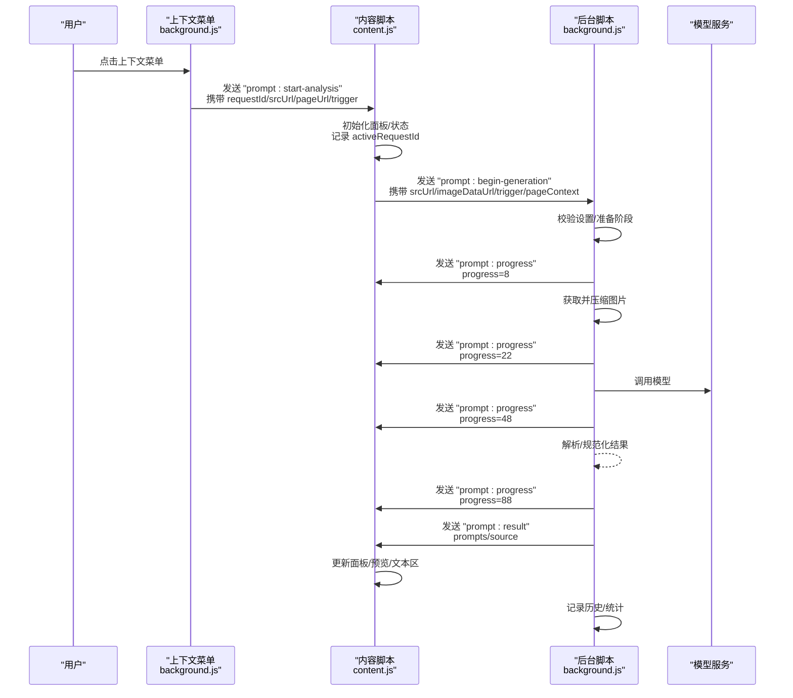
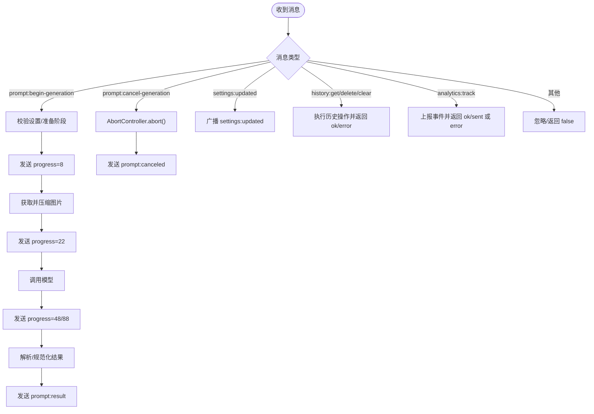
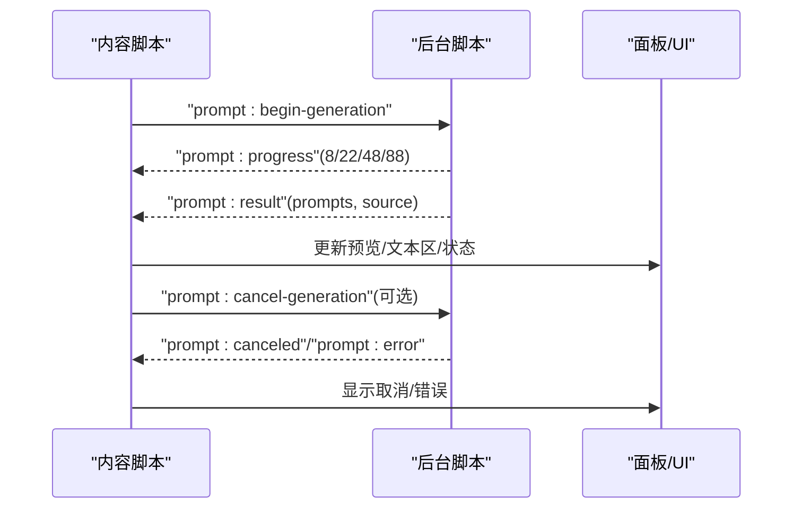
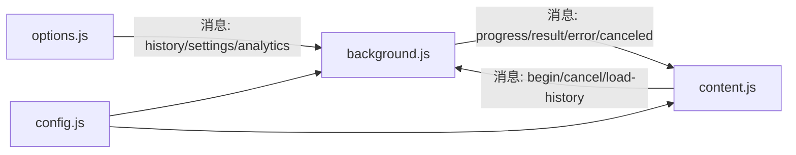

# 消息传递协议

<cite>
**本文引用的文件列表**
- [background.js](file://background.js)
- [content.js](file://content.js)
- [config.js](file://config.js)
- [manifest.json](file://manifest.json)
- [options.html](file://options.html)
- [options.js](file://options.js)
- [_locales/en/messages.json](file://_locales/en/messages.json)
- [_locales/zh_CN/messages.json](file://_locales/zh_CN/messages.json)
</cite>

## 目录
1. [简介](#简介)
2. [项目结构与消息边界](#项目结构与消息边界)
3. [核心消息类型与格式规范](#核心消息类型与格式规范)
4. [架构总览](#架构总览)
5. [详细组件与消息流分析](#详细组件与消息流分析)
6. [依赖关系与耦合分析](#依赖关系与耦合分析)
7. [性能与可靠性考量](#性能与可靠性考量)
8. [故障排查与调试指南](#故障排查与调试指南)
9. [结论](#结论)

## 简介
本文件系统化梳理 Img2Prompt 扩展内部的消息传递协议，覆盖后台脚本与内容脚本之间的通信规范、消息类型定义、参数与返回值结构、异步处理与错误传播机制，并通过序列图与流程图展示从用户触发到结果呈现的完整消息流转过程。同时给出超时与重试建议、错误恢复策略及调试技巧，帮助开发者与使用者快速定位与解决问题。

## 项目结构与消息边界
- 扩展采用 Manifest V3，包含：
  - 后台服务工作线程：负责上下文菜单、命令触发、与模型服务交互、进度与结果分发。
  - 内容脚本：注入页面，负责 UI 面板渲染、用户交互、与后台通信。
  - 设置页：独立页面，负责配置持久化与历史记录管理。
- 消息边界：
  - 后台 ↔ 内容脚本：通过 chrome.runtime.sendMessage/chrome.runtime.onMessage 与 chrome.tabs.sendMessage/chrome.tabs.onMessage 实现双向通信。
  - 设置页 ↔ 后台：通过 chrome.runtime.sendMessage 实现配置同步与历史查询。
  - 内容脚本 ↔ 页面：通过 DOM 事件与 Shadow DOM 交互实现 UI 行为。



图表来源
- [manifest.json:10-26](file://manifest.json#L10-L26)
- [background.js:59-92](file://background.js#L59-L92)
- [content.js:209-247](file://content.js#L209-L247)
- [options.js:215-245](file://options.js#L215-L245)

章节来源
- [manifest.json:10-26](file://manifest.json#L10-L26)
- [background.js:59-92](file://background.js#L59-L92)
- [content.js:209-247](file://content.js#L209-L247)
- [options.js:215-245](file://options.js#L215-L245)

## 核心消息类型与格式规范
以下消息类型均以标准 Chrome Extension 消息对象形式传输，包含 type 字段与业务参数字段。返回值遵循“响应对象”约定：包含 ok 字段与具体数据或错误信息。

- 用户触发类
  - prompt:start-analysis
    - 触发方：后台（上下文菜单）
    - 参数
      - requestId: string
      - srcUrl: string
      - pageUrl: string
      - trigger: "context_menu"
    - 用途：通知内容脚本开始分析流程
  - prompt:start-snipping
    - 触发方：后台（截图命令）
    - 参数
      - dataUrl: string
    - 用途：通知内容脚本进入截图选取流程
  - prompt:begin-generation
    - 触发方：内容脚本
    - 参数
      - requestId: string
      - srcUrl: string
      - imageDataUrl: string
      - trigger: string
      - pageContext: { altText: string, title: string, pageUrl: string }
    - 用途：请求后台执行生成流程
  - prompt:cancel-generation
    - 触发方：内容脚本
    - 参数
      - requestId: string
    - 用途：取消正在进行的生成请求
  - prompt:load-history-item
    - 触发方：设置页
    - 参数
      - data: { prompts: { zh: string, en: string }, srcUrl: string, imageDataUrl: string }
    - 用途：将历史项直接展示在内容面板

- 后台到内容脚本的反馈类
  - prompt:progress
    - 参数
      - requestId: string
      - progress: number
      - text: string
    - 用途：更新 UI 进度条与状态文本
  - prompt:result
    - 参数
      - requestId: string
      - progress: number
      - prompts: { zh: string, en: string }
      - source: { srcUrl: string }
    - 用途：返回最终提示词结果
  - prompt:canceled
    - 参数
      - requestId: string
      - errorCode: string
    - 用途：取消成功通知
  - prompt:error
    - 参数
      - requestId: string
      - errorCode: string
      - message: string
    - 用途：错误通知（含用户友好提示）

- 后台到设置页/内容脚本的管理类
  - settings:updated
    - 参数：无
    - 用途：广播设置变更，使各页面即时更新
  - history:get
    - 触发方：设置页
    - 返回
      - ok: boolean
      - history: Array
  - history:delete
    - 触发方：设置页
    - 参数
      - id: string
    - 返回
      - ok: boolean
  - history:clear
    - 触发方：设置页
    - 返回
      - ok: boolean
  - analytics:track
    - 触发方：内容脚本/设置页
    - 参数
      - event: string
      - properties: object
    - 返回
      - ok: boolean
      - sent?: boolean
      - error?: string

章节来源
- [background.js:64-71](file://background.js#L64-L71)
- [background.js:84-88](file://background.js#L84-L88)
- [content.js:289-301](file://content.js#L289-L301)
- [content.js:1353-1357](file://content.js#L1353-L1357)
- [content.js:220-239](file://content.js#L220-L239)
- [background.js:255-264](file://background.js#L255-L264)
- [background.js:281-286](file://background.js#L281-L286)
- [background.js:299-305](file://background.js#L299-L305)
- [background.js:134-146](file://background.js#L134-L146)
- [options.js:215-245](file://options.js#L215-L245)
- [options.js:318-322](file://options.js#L318-L322)
- [options.js:359-364](file://options.js#L359-L364)
- [content.js:1569-1577](file://content.js#L1569-L1577)
- [options.js:466-480](file://options.js#L466-L480)

## 架构总览
消息通道分为两类：
- 单向通知：后台向内容脚本推送进度与结果；后台向设置页推送历史数据。
- 双向请求/响应：内容脚本向后台发起生成请求；设置页向后台发起历史与设置操作；双方均可发送分析事件上报。



图表来源
- [background.js:59-72](file://background.js#L59-L72)
- [content.js:249-326](file://content.js#L249-L326)
- [background.js:226-271](file://background.js#L226-L271)

章节来源
- [background.js:59-72](file://background.js#L59-L72)
- [content.js:249-326](file://content.js#L249-L326)
- [background.js:226-271](file://background.js#L226-L271)

## 详细组件与消息流分析

### 组件一：后台脚本（background.js）
职责
- 处理上下文菜单与快捷键触发
- 校验设置、拉取/压缩图片、调用模型、解析结果
- 分发进度、结果、错误与取消信号
- 管理活动请求与取消控制
- 与存储、分析服务集成

关键消息处理
- 上下文菜单触发：发送 "prompt:start-analysis"
- 截图命令触发：发送 "prompt:start-snipping"
- 接收 "prompt:begin-generation"：执行生成流程并分发进度/结果/错误
- 接收 "prompt:cancel-generation"：通过 AbortController 中断请求
- 接收 "settings:updated"：广播设置更新
- 接收 "history:*"：提供历史查询/删除/清空
- 接收 "analytics:track"：上报分析事件



图表来源
- [background.js:94-184](file://background.js#L94-L184)
- [background.js:212-320](file://background.js#L212-L320)
- [background.js:134-168](file://background.js#L134-L168)
- [background.js:94-108](file://background.js#L94-L108)

章节来源
- [background.js:94-184](file://background.js#L94-L184)
- [background.js:212-320](file://background.js#L212-L320)
- [background.js:134-168](file://background.js#L134-L168)
- [background.js:94-108](file://background.js#L94-L108)

### 组件二：内容脚本（content.js）
职责
- 注入 UI 面板与悬浮按钮
- 响应后台进度/结果/错误消息
- 处理用户交互（复制、停止、语言切换、拖拽）
- 发起生成请求、取消请求、加载历史项
- 发送分析事件

关键消息处理
- 接收 "prompt:start-analysis"/"prompt:start-snipping"：初始化面板与状态
- 接收 "prompt:progress"：更新进度条与状态文本
- 接收 "prompt:result"：填充文本区与预览
- 接收 "prompt:canceled"/"prompt:error"：显示取消/错误状态
- 发送 "prompt:begin-generation"：启动生成
- 发送 "prompt:cancel-generation"：取消生成
- 发送 "prompt:load-history-item"：加载历史项
- 发送 "analytics:track"：上报事件



图表来源
- [content.js:209-247](file://content.js#L209-L247)
- [content.js:289-301](file://content.js#L289-L301)
- [content.js:1353-1357](file://content.js#L1353-L1357)
- [background.js:255-264](file://background.js#L255-L264)
- [background.js:281-305](file://background.js#L281-L305)

章节来源
- [content.js:209-247](file://content.js#L209-L247)
- [content.js:289-301](file://content.js#L289-L301)
- [content.js:1353-1357](file://content.js#L1353-L1357)
- [background.js:255-264](file://background.js#L255-L264)
- [background.js:281-305](file://background.js#L281-L305)

### 组件三：设置页（options.html + options.js）
职责
- 管理配置持久化与预设模板
- 展示历史记录并支持复制/删除/清空
- 与后台通信进行历史查询与操作
- 发送分析事件

关键消息处理
- 发送 "history:get"：获取历史列表
- 发送 "history:delete"/"history:clear"：删除/清空历史
- 发送 "settings:updated"：广播设置更新
- 发送 "analytics:track"：上报事件

```mermaid
sequenceDiagram
participant Opt as "设置页"
participant BG as "后台脚本"
Opt->>BG : "history : get"
BG-->>Opt : { ok, history }
Opt->>BG : "history : delete"(id)
BG-->>Opt : { ok }
Opt->>BG : "history : clear"
BG-->>Opt : { ok }
Opt->>BG : "settings : updated"
Opt->>BG : "analytics : track"(event, properties)
```

图表来源
- [options.js:215-245](file://options.js#L215-L245)
- [options.js:318-322](file://options.js#L318-L322)
- [options.js:359-364](file://options.js#L359-L364)
- [options.js:380-401](file://options.js#L380-L401)
- [options.js:466-480](file://options.js#L466-L480)

章节来源
- [options.js:215-245](file://options.js#L215-L245)
- [options.js:318-322](file://options.js#L318-L322)
- [options.js:359-364](file://options.js#L359-L364)
- [options.js:380-401](file://options.js#L380-L401)
- [options.js:466-480](file://options.js#L466-L480)

## 依赖关系与耦合分析
- 模块耦合
  - background.js 与 content.js 通过消息协议强耦合，但通过 requestId 解耦不同并发请求。
  - options.js 与 background.js 通过配置与历史消息耦合，但不直接依赖 UI。
- 数据一致性
  - settings:updated 广播确保多页面一致；activeRequests Map 保证取消与进度分发的正确性。
- 错误传播
  - 后台抛出异常时统一转化为 prompt:error；取消通过 AbortController 与 prompt:canceled 通知前端。
- 外部依赖
  - 模型服务调用依赖配置项（apiEndpoint、apiKey、model），错误分类映射至 ERROR_CODES 与 ERROR_MESSAGES。



图表来源
- [background.js:94-184](file://background.js#L94-L184)
- [content.js:209-247](file://content.js#L209-L247)
- [options.js:215-245](file://options.js#L215-L245)
- [config.js:4-253](file://config.js#L4-L253)

章节来源
- [background.js:94-184](file://background.js#L94-L184)
- [content.js:209-247](file://content.js#L209-L247)
- [options.js:215-245](file://options.js#L215-L245)
- [config.js:4-253](file://config.js#L4-L253)

## 性能与可靠性考量
- 异步与并发
  - 使用 AbortController 管理并发请求生命周期，避免竞态与资源浪费。
  - 使用 Map 存储 activeRequests，按 requestId 精准匹配进度与结果。
- 网络与模型调用
  - 在后台统一进行图片获取与压缩，减少前端重复计算。
  - 对模型响应进行内容提取与 JSON 规范化，增强健壮性。
- 错误分类与用户提示
  - 将网络、鉴权、速率限制、超时、无效响应、JSON 解析失败、缺失字段、取消、未知错误等分类，分别映射到用户可理解的提示语。
- 存储与历史
  - 历史记录上限控制，避免无限增长；提供清空能力。

章节来源
- [background.js:17-17](file://background.js#L17-L17)
- [background.js:218-220](file://background.js#L218-L220)
- [background.js:465-476](file://background.js#L465-L476)
- [background.js:412-463](file://background.js#L412-L463)

## 故障排查与调试指南
- 常见问题与定位
  - “扩展上下文失效/端口关闭”：内容脚本发送消息时捕获此类错误并降级处理，避免阻塞 UI。
  - “模型返回空内容/非 JSON”：后台进行内容提取与 JSON 规范化，若仍失败则返回明确错误码与提示。
  - “取消无效”：确认 activeRequestId 与消息中的 requestId 匹配，后台通过 AbortController 中断。
- 调试技巧
  - 使用浏览器开发者工具的“扩展”面板查看后台日志与消息队列。
  - 在设置页中查看历史记录，确认历史读写是否正常。
  - 切换 UI 语言与分辨率设置，观察面板文案与图片压缩效果。
- 建议的超时与重试策略
  - 当前实现未内置自动重试；可在调用模型前增加超时控制与指数退避重试（建议在 fetch 层封装）。
  - 对于网络错误，建议在 UI 提示后允许用户重试或调整分辨率。

章节来源
- [content.js:56-75](file://content.js#L56-L75)
- [background.js:695-726](file://background.js#L695-L726)
- [background.js:562-592](file://background.js#L562-L592)
- [background.js:635-666](file://background.js#L635-L666)

## 结论
本协议以清晰的消息类型与严格的参数/返回值结构，实现了后台与内容脚本之间的高可靠异步通信。通过 requestId 管理并发、AbortController 控制取消、错误分类与用户提示、以及设置广播与历史管理，整体流程具备良好的可维护性与用户体验。建议后续在模型调用层引入超时与重试机制，进一步提升稳定性。