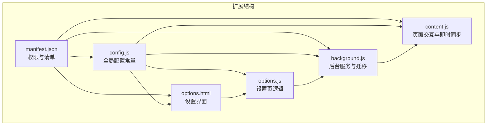
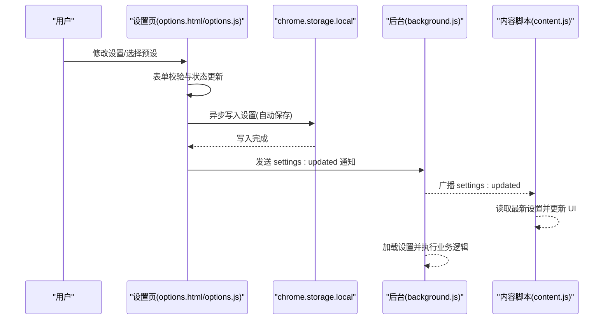
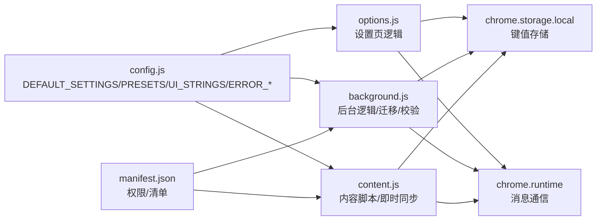

# 配置管理接口

<cite>
**本文档引用的文件**
- [config.js](file://config.js)
- [options.js](file://options.js)
- [options.html](file://options.html)
- [background.js](file://background.js)
- [content.js](file://content.js)
- [manifest.json](file://manifest.json)
</cite>

## 目录
1. [简介](#简介)
2. [项目结构](#项目结构)
3. [核心组件](#核心组件)
4. [架构总览](#架构总览)
5. [详细组件分析](#详细组件分析)
6. [依赖关系分析](#依赖关系分析)
7. [性能考量](#性能考量)
8. [故障排查指南](#故障排查指南)
9. [结论](#结论)
10. [附录](#附录)

## 简介
本文件面向 Img2Prompt 扩展的配置管理接口，提供从配置项定义、默认值、数据结构与验证规则，到读取与更新流程、chrome.storage 使用模式、异步处理、迁移与版本兼容、UI 表单验证与实时反馈、以及备份/导入导出的技术实现说明。文档同时给出各配置项的使用示例与最佳实践建议，帮助开发者与用户正确配置与维护扩展。

## 项目结构
该扩展采用 Manifest V3 架构，配置共享通过全局对象注入，选项页负责用户交互与持久化，后台脚本负责业务逻辑与存储迁移，内容脚本负责页面交互与即时同步。

图表来源
- [manifest.json:1-45](file://manifest.json#L1-L45)
- [config.js:1-253](file://config.js#L1-L253)
- [options.html:1-687](file://options.html#L1-L687)
- [options.js:1-551](file://options.js#L1-L551)
- [background.js:1-945](file://background.js#L1-L945)
- [content.js:1-1578](file://content.js#L1-L1578)

章节来源
- [manifest.json:1-45](file://manifest.json#L1-L45)
- [config.js:1-253](file://config.js#L1-L253)

## 核心组件
- 全局配置常量：集中定义默认设置、提示词预设、UI 文案、错误码与消息、分析配置键等。
- 设置页（options.html + options.js）：提供表单、预设选择、自定义模板、自动保存、语言切换、历史记录展示与清理。
- 后台（background.js）：负责安装时的默认值迁移、设置校验、请求模型、错误分类与用户提示、历史记录持久化。
- 内容脚本（content.js）：监听设置变化、更新悬浮按钮与面板语言、响应生成进度与结果。
- 存储层：基于 chrome.storage.local 进行键值持久化，支持设置、历史记录、客户端 ID、分析开关等。

章节来源
- [config.js:4-253](file://config.js#L4-L253)
- [options.js:1-551](file://options.js#L1-L551)
- [background.js:19-57](file://background.js#L19-L57)
- [content.js:101-141](file://content.js#L101-L141)

## 架构总览
配置管理贯穿“设置页 -> 存储 -> 后台/内容脚本”的链路，形成“用户输入 -> 自动保存 -> 即时生效 -> 业务使用”的闭环。

图表来源
- [options.js:387-405](file://options.js#L387-L405)
- [options.js:377-385](file://options.js#L377-L385)
- [background.js:134-147](file://background.js#L134-L147)
- [content.js:143-163](file://content.js#L143-L163)

## 详细组件分析

### 配置项定义与默认值
- 默认设置键集合：apiEndpoint、apiKey、model、requestFormat、anthropicVersion、hoverButtonEnabled、snippingShortcutEnabled、uiLanguage、maxImageEdge、systemPrompt、userPrompt、temperature。
- 关键默认值：
  - apiEndpoint：默认指向 OpenAI 兼容接口路径。
  - model：默认为 gpt-5-mini。
  - temperature：默认为 1。
  - maxImageEdge：默认 1024。
  - uiLanguage：默认 zh。
  - requestFormat：默认 auto（根据模型名自动识别 Anthropic/OpenAI）。
  - anthropicVersion：默认 2023-06-01。
  - hoverButtonEnabled/snippingShortcutEnabled：默认启用。
  - systemPrompt/userPrompt：内置默认提示词模板。
- 提示词预设：提供通用、摄影、CG、平面设计、UI、3D 资产、电商产品等场景预设，支持用户自定义模板并持久化存储。

章节来源
- [config.js:5-20](file://config.js#L5-L20)
- [config.js:22-30](file://config.js#L22-L30)

### 数据结构与验证规则
- 数据结构
  - 设置对象：包含上述键值，部分键为布尔或数值类型。
  - 历史记录对象：包含 prompts、srcUrl、imageDataUrl、pageUrl、model、trigger、timestamp、id 等。
- 必填字段
  - apiEndpoint、apiKey、model 在后台执行前必须存在，否则抛出明确错误。
- 类型与范围
  - maxImageEdge：整数，常用值 512/768/1024/1280。
  - temperature：数值，默认 1。
  - requestFormat：字符串，可选 auto、openai、anthropic。
  - anthropicVersion：字符串，HTTP 头部使用。
  - uiLanguage：字符串，zh/en。
- 错误码与消息
  - 定义了 NETWORK_ERROR、IMAGE_FETCH_FAILED、IMAGE_PROCESSING_FAILED、API_AUTH_FAILED、API_RATE_LIMITED、API_TIMEOUT、API_INVALID_RESPONSE、JSON_PARSE_FAILED、MISSING_FIELDS、CANCELED、UNKNOWN 等错误码及对应多语言提示。

章节来源
- [background.js:465-476](file://background.js#L465-L476)
- [config.js:206-247](file://config.js#L206-L247)

### 读取与更新接口
- 读取
  - 后台：启动时与每次使用前从 chrome.storage.local 获取默认设置并合并，确保缺失键补齐。
  - 内容脚本：初始化时读取 hoverButtonEnabled、uiLanguage、maxImageEdge、preferredPromptLanguage 等键。
- 更新
  - 设置页：表单变更触发防抖自动保存，构建 payload 后写入 chrome.storage.local；同时发送 settings:updated 通知。
  - 后台：监听 settings:updated，向所有标签页广播以确保 UI 即时更新。
  - 内容脚本：监听 settings:updated，重新读取设置并更新面板语言与交互行为。

章节来源
- [background.js:322-328](file://background.js#L322-L328)
- [background.js:134-147](file://background.js#L134-L147)
- [content.js:101-141](file://content.js#L101-L141)
- [options.js:387-405](file://options.js#L387-L405)

### chrome.storage 使用模式与异步处理
- 使用模式
  - 读取：chrome.storage.local.get(keys) 返回 Promise，支持批量键读取。
  - 写入：chrome.storage.local.set(obj) 返回 Promise，支持批量键写入。
  - 监听：chrome.storage.onChanged.addListener 回调，监听本地存储变化。
- 异步处理
  - 所有读写均采用 await，避免竞态。
  - 自动保存采用防抖（约 220ms），减少频繁写入。
  - 设置更新通过 runtime.sendMessage 广播，确保跨脚本一致性。

章节来源
- [options.js:182-196](file://options.js#L182-L196)
- [options.js:387-405](file://options.js#L387-L405)
- [background.js:322-328](file://background.js#L322-L328)
- [content.js:113-141](file://content.js#L113-L141)

### 配置迁移与版本兼容
- 安装时迁移
  - 扩展安装或更新时，后台遍历 DEFAULT_SETTINGS，若本地不存在对应键则写入默认值，保证新旧版本字段补齐。
- 版本信息
  - 设置页显示扩展版本号，便于用户核对。
- 兼容性设置
  - requestFormat 支持显式指定 openai/anthropic/auto；当模型名以 claude 开头时自动识别 Anthropic。
  - Anthropic 请求端点自动转换兼容 /v1/messages。

章节来源
- [background.js:19-57](file://background.js#L19-L57)
- [background.js:505-515](file://background.js#L505-L515)
- [background.js:668-676](file://background.js#L668-L676)
- [options.js:197-202](file://options.js#L197-L202)

### 用户界面中的配置表单验证与实时反馈
- 表单验证
  - HTML 层：必填字段使用 required 属性。
  - JS 层：输入事件与变更事件触发 handleAutoSave；自定义模板保存前校验文本非空。
- 实时反馈
  - 状态栏显示“已保存”、“已恢复默认值”等提示，定时清除。
  - 预设芯片高亮当前选中项；自定义模板编辑时显示删除按钮。
  - 语言切换即时应用到 UI 文案与面板文本。

章节来源
- [options.html:500-517](file://options.html#L500-L517)
- [options.js:119-137](file://options.js#L119-L137)
- [options.js:369-375](file://options.js#L369-L375)
- [options.js:485-491](file://options.js#L485-L491)
- [options.js:424-454](file://options.js#L424-L454)

### 配置备份、导入导出与历史记录
- 备份/导入
  - 当前代码库未提供显式的“导出/导入配置”功能。可通过读取 chrome.storage.local 中的设置键进行备份，再在新环境写回。
- 历史记录
  - 历史记录存储于 chrome.storage.local 的 promptHistory 键下，最多保留 50 条。
  - 支持清空全部、按条目删除、点击历史项在主面板展示或复制到剪贴板。
  - 历史项包含 prompts、srcUrl、imageDataUrl、pageUrl、model、trigger、timestamp、id。

章节来源
- [background.js:412-463](file://background.js#L412-L463)
- [options.js:218-367](file://options.js#L218-L367)

### 配置项使用示例与最佳实践
- apiEndpoint
  - 示例：OpenAI 兼容接口 /v1/chat/completions。
  - 最佳实践：优先使用官方或受信任的代理接口；确保 HTTPS。
- apiKey
  - 示例：以 Bearer 方式鉴权。
  - 最佳实践：妥善保管，避免泄露；定期轮换。
- model
  - 示例：gpt-5-mini、gemini-2.5-pro、claude-3.5-sonnet。
  - 最佳实践：根据接口兼容性选择；注意不同模型的图像输入格式差异。
- temperature
  - 示例：0.7~1.0 之间通常更稳定。
  - 最佳实践：创意类任务可适度提高，稳定性优先任务保持默认。
- maxImageEdge
  - 示例：1024（默认）、768、512。
  - 最佳实践：网络不稳定或接口限制严格时降低分辨率。
- requestFormat
  - 示例：auto（根据模型名自动）、openai、anthropic。
  - 最佳实践：Anthropic 模型需 base64 图像数据，OpenAI 兼容接口可直传 URL。
- uiLanguage
  - 示例：zh、en。
  - 最佳实践：与系统语言一致，便于理解错误提示。
- hoverButtonEnabled/snippingShortcutEnabled
  - 示例：默认启用。
  - 最佳实践：在复杂页面或需要减少干扰时可关闭悬浮按钮。
- systemPrompt/userPrompt
  - 示例：使用内置预设或自定义模板。
  - 最佳实践：确保 systemPrompt 输出严格 JSON，userPrompt 明确任务边界。

章节来源
- [config.js:5-20](file://config.js#L5-L20)
- [config.js:22-30](file://config.js#L22-L30)
- [background.js:505-515](file://background.js#L505-L515)
- [background.js:517-592](file://background.js#L517-L592)
- [background.js:594-666](file://background.js#L594-L666)

## 依赖关系分析

图表来源
- [config.js:1-253](file://config.js#L1-L253)
- [options.js:1-551](file://options.js#L1-L551)
- [background.js:1-945](file://background.js#L1-L945)
- [content.js:1-1578](file://content.js#L1-L1578)
- [manifest.json:1-45](file://manifest.json#L1-L45)

章节来源
- [config.js:1-253](file://config.js#L1-L253)
- [options.js:1-551](file://options.js#L1-L551)
- [background.js:1-945](file://background.js#L1-L945)
- [content.js:1-1578](file://content.js#L1-L1578)
- [manifest.json:1-45](file://manifest.json#L1-L45)

## 性能考量
- 自动保存防抖：约 220ms，减少频繁写入与渲染压力。
- 存储键粒度：仅写入必要键，避免冗余数据膨胀。
- 历史记录上限：最多 50 条，避免无限增长导致性能问题。
- 图像压缩：默认最大边 1024，可在设置中进一步降低以提升请求成功率与速度。

[本节为通用指导，无需特定文件来源]

## 故障排查指南
- 常见错误与定位
  - 认证失败（401/403）：检查 apiEndpoint、apiKey 是否正确；确认接口权限。
  - 调用次数超限（429）：降低温度、减少并发、升级配额。
  - 请求超时（408/5xx）：降低 maxImageEdge、检查网络、更换接口。
  - JSON 解析失败：检查 systemPrompt 是否强制输出严格 JSON。
  - 缺少 zh/en 字段：调整 systemPrompt，确保输出包含两个键。
- 诊断步骤
  - 查看设置页状态栏提示与后台错误分类。
  - 在设置页恢复默认值，逐步调整参数复现问题。
  - 检查 chrome.storage.local 中的设置与历史记录是否异常。

章节来源
- [background.js:872-944](file://background.js#L872-L944)
- [background.js:465-476](file://background.js#L465-L476)
- [background.js:695-726](file://background.js#L695-L726)

## 结论
本配置管理接口通过统一的默认设置、严格的验证规则、完善的存储与消息机制，实现了从设置页到后台/内容脚本的一致性与可靠性。建议在生产环境中持续关注接口兼容性与错误分类策略，结合用户反馈优化默认值与提示文案，以提升整体使用体验。

[本节为总结性内容，无需特定文件来源]

## 附录

### 配置项一览与默认值
- apiEndpoint：默认 OpenAI 兼容接口路径
- apiKey：默认空字符串
- model：默认 gpt-5-mini
- requestFormat：默认 auto
- anthropicVersion：默认 2023-06-01
- hoverButtonEnabled：默认 true
- snippingShortcutEnabled：默认 true
- uiLanguage：默认 zh
- maxImageEdge：默认 1024
- systemPrompt：内置默认提示词模板
- userPrompt：内置默认提示词模板
- temperature：默认 1

章节来源
- [config.js:5-20](file://config.js#L5-L20)

### 设置页表单字段与验证
- 连接设置：apiEndpoint（必填）、model（必填）、apiKey（必填）
- 提示词设置：userPrompt（必填，支持预设与自定义）
- 使用体验：uiLanguage（单选）、hoverButtonEnabled（开关）、snippingShortcutEnabled（开关）
- 兼容性设置：maxImageEdge（下拉选择）

章节来源
- [options.html:484-655](file://options.html#L484-L655)
- [options.js:407-422](file://options.js#L407-L422)