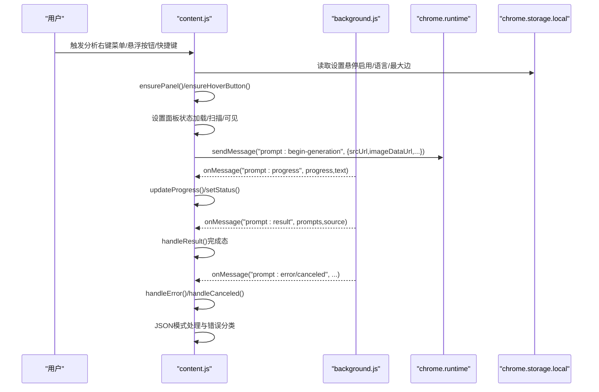
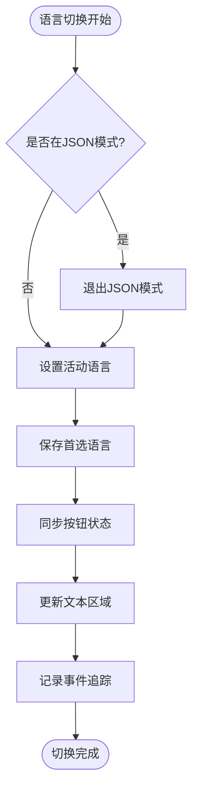
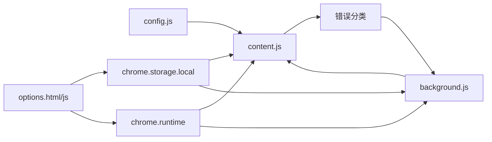

# 内容脚本用户界面

<cite>
**本文引用的文件**
- [content.js](file://content.js)
- [config.js](file://config.js)
- [background.js](file://background.js)
- [manifest.json](file://manifest.json)
- [options.html](file://options.html)
- [options.js](file://options.js)
</cite>

## 更新摘要
**变更内容**
- 重新设计了语言切换机制：简化了按钮排序逻辑，增强了JSON模式行为
- 改进了错误处理：新增了更精细的错误分类和用户友好提示
- 增强了可访问性功能：添加了aria-label属性和键盘导航支持
- 优化了JSON模式：移除了negative和parameters字段，专注于视觉分析

## 目录
1. [简介](#简介)
2. [项目结构](#项目结构)
3. [核心组件](#核心组件)
4. [架构总览](#架构总览)
5. [详细组件分析](#详细组件分析)
6. [依赖关系分析](#依赖关系分析)
7. [性能考量](#性能考量)
8. [故障排查指南](#故障排查指南)
9. [结论](#结论)
10. [附录](#附录)

## 简介
本指南面向 Img2Prompt 的内容脚本用户界面开发，聚焦 content.js 中的 UI 架构与实现细节，包括：
- 主面板（Panel）的创建、挂载与管理
- 悬浮按钮（Hover Button）的交互与定位策略
- 截图工具（Snipping Tool）的实现与图像裁剪流程
- UI 状态管理（加载、生成、错误）的切换逻辑
- Shadow DOM 使用模式、样式隔离与主题适配
- 新 UI 组件扩展方法、事件处理与响应式布局
- 性能优化建议（防抖、DOM 操作、内存泄漏防护）
- 重新设计的语言切换机制与JSON模式增强
- 改进的错误处理和可访问性功能

## 项目结构
该扩展采用"内容脚本 + 后台服务"双端协作模式：
- content.js：注入页面，负责 UI 展示、用户交互、与后台通信
- background.js：服务工作线程，负责与模型 API 交互、进度与结果分发
- config.js：共享配置与多语言文案
- options.html/js：设置页，负责用户偏好持久化与全局状态同步
- manifest.json：声明内容脚本注入时机与权限

```mermaid
graph TB
subgraph "页面上下文"
CS["content.js<br/>内容脚本"]
SH["Shadow DOM<br/>隔离样式"]
UI["主面板 Panel<br/>悬浮按钮 Hover Button"]
JSON["JSON模式<br/>语言切换机制"]
ERR["错误处理<br/>可访问性支持"]
end
subgraph "扩展运行时"
BG["background.js<br/>服务工作线程"]
ST["chrome.storage.local<br/>本地存储"]
RT["chrome.runtime<br/>消息通道"]
END["错误分类<br/>用户友好提示"]
end
subgraph "设置页"
OPT["options.html/js<br/>设置面板"]
end
CS --> SH
CS --> UI
CS --> JSON
CS --> ERR
CS <- --> RT
CS <- --> ST
BG <- --> RT
BG <- --> ST
BG --> END
OPT <- --> ST
OPT <- --> RT
```

**图表来源**
- [content.js:1-1807](file://content.js#L1-L1807)
- [background.js:1-1160](file://background.js#L1-L1160)
- [config.js:1-307](file://config.js#L1-L307)
- [options.html:1-687](file://options.html#L1-L687)
- [options.js:1-551](file://options.js#L1-L551)
- [manifest.json:1-45](file://manifest.json#L1-L45)

**章节来源**
- [manifest.json:22-26](file://manifest.json#L22-L26)
- [config.js:4-307](file://config.js#L4-L307)

## 核心组件
- 主面板（Panel）
  - 通过 Shadow DOM 承载，避免与宿主页面样式冲突
  - 包含预览区、扫描动画、进度条、状态文本、语言切换、复制按钮、停止按钮等
  - 支持拖拽移动、内容显隐、扫描动画开关、复制状态反馈
  - **新增**：JSON模式支持，简化了按钮排序逻辑
- 悬浮按钮（Hover Button）
  - 在图片上悬停时显示，点击触发分析
  - 支持遮挡检测、可见性判断、位置更新与关闭
  - **增强**：添加了aria-label属性提升可访问性
- 截图工具（Snipping Tool）
  - 全屏覆盖层，使用洞穿效果（box-shadow）实现选区
  - 基于设备像素比绘制 Canvas 裁剪，生成 base64 数据交由分析流程
- **新增**：JSON模式与语言切换机制
  - 重新设计的语言切换逻辑，简化按钮排序
  - 增强的JSON模式行为，专注于视觉分析字段
  - **改进**：移除了negative和parameters字段，提升安全性

**章节来源**
- [content.js:596-620](file://content.js#L596-L620)
- [content.js:622-725](file://content.js#L622-L725)
- [content.js:489-594](file://content.js#L489-L594)
- [content.js:1415-1461](file://content.js#L1415-L1461)
- [content.js:1552-1566](file://content.js#L1552-L1566)

## 架构总览
content.js 作为 UI 与业务协调中心，负责：
- 初始化与监听：设置项变更、窗口尺寸变化、滚动与指针事件
- 生命周期管理：面板创建/销毁、悬浮按钮显示/隐藏
- 状态机：加载中、生成中、完成、错误、取消
- 与后台通信：发起生成、接收进度、结果、错误与取消通知
- 用户交互：语言切换、复制、停止、拖拽、键盘取消
- **新增**：JSON模式管理与错误处理增强
- **改进**：可访问性支持，添加aria-label属性



**图表来源**
- [content.js:209-247](file://content.js#L209-L247)
- [content.js:249-326](file://content.js#L249-L326)
- [content.js:347-487](file://content.js#L347-L487)
- [background.js:94-184](file://background.js#L94-L184)

## 详细组件分析

### 主面板（Panel）实现
- 创建与挂载
  - 通过 ensurePanel() 创建根节点并 attachShadow({ mode: "open" })，注入构建好的 HTML 与内联样式
  - 绑定面板事件：关闭、拖拽、语言切换、复制、停止
- 状态管理
  - 加载状态：显示扫描动画、禁用输入、进度条推进
  - 生成状态：实时进度与状态文本更新
  - 完成状态：显示预览、内容区域展开、复制按钮复位
  - 错误状态：停止生成、显示错误信息、关闭扫描
  - 取消状态：停止生成、显示"已停止"状态
- 预览与内容
  - 预览图懒加载，成功后显示阴影与加载提示消失
  - 文本域支持编辑，语言切换时同步内容
- 复制与停止
  - 复制按钮具备"完成态"反馈，自动复原
  - 停止按钮在生成中启用，发送取消消息给后台
- **新增**：JSON模式支持
  - 通过syncLanguageButtons()统一管理按钮状态
  - setTextareaValue()根据isJsonMode决定显示格式

**章节来源**
- [content.js:596-620](file://content.js#L596-L620)
- [content.js:1273-1346](file://content.js#L1273-L1346)
- [content.js:1373-1433](file://content.js#L1373-L1433)
- [content.js:347-487](file://content.js#L347-L487)
- [content.js:1552-1566](file://content.js#L1552-L1566)

### 悬浮按钮（Hover Button）实现
- 显示条件
  - 开启设置、未手动关闭、图片尺寸足够、未被遮挡
- 定位策略
  - 计算图片右上角坐标，避免导航栏等元素遮挡
  - 限制在视窗内，避免溢出
- 交互行为
  - 进入/离开悬停状态，控制可见性
  - 点击触发 startAnalysisForImage(image)，进入分析流程
  - 关闭按钮支持手动隐藏并清除 hoverImage
- **增强**：可访问性支持
  - 添加aria-label属性，提供屏幕阅读器支持
  - 支持键盘导航和焦点管理

**章节来源**
- [content.js:1158-1190](file://content.js#L1158-L1190)
- [content.js:1192-1263](file://content.js#L1192-L1263)
- [content.js:1265-1271](file://content.js#L1265-L1271)
- [content.js:328-345](file://content.js#L328-L345)

### 截图工具（Snipping Tool）实现
- 覆盖层与选区
  - 创建全屏 overlay，使用 box-shadow 实现洞穿效果
  - mousedown/mousemove/mouseup 实现拖拽绘制矩形选区
- 裁剪与分析
  - 读取 dataUrl 对应的 Image，按设备像素比绘制 Canvas
  - 裁剪后生成 JPEG base64，交由 handleStartAnalysis() 触发分析
- 取消与清理
  - ESC 键取消；失败时清理 overlay，避免残留

**章节来源**
- [content.js:489-594](file://content.js#L489-L594)
- [background.js:74-92](file://background.js#L74-L92)

### 重新设计的语言切换机制
- **简化按钮排序逻辑**
  - 固定HTML结构：中文 → English → JSON
  - 无需动态改变CSS order，提升性能
  - 通过syncLanguageButtons()统一管理按钮状态
- **增强JSON模式行为**
  - JSON按钮为单向切换：一旦进入JSON模式，只能通过语言按钮退出
  - 移除negative和parameters字段，专注于视觉分析
  - setTextareaValue()根据isJsonMode构建合适的显示内容
- **改进的按钮状态管理**
  - syncLanguageButtons()统一设置data-active属性
  - activeLanguage与preferredPromptLanguage分离管理
  - 支持即时语言切换和状态同步



**图表来源**
- [content.js:1415-1461](file://content.js#L1415-L1461)
- [content.js:1552-1566](file://content.js#L1552-L1566)

**章节来源**
- [content.js:1415-1461](file://content.js#L1415-L1461)
- [content.js:1552-1566](file://content.js#L1552-L1566)

### 改进的错误处理与可访问性
- **增强的错误分类**
  - 网络错误：failed to fetch, networkerror
  - 图片获取错误：fetch image, 404
  - 图片处理错误：base64, image processing, bitmap
  - API认证错误：401, 403, authentication
  - 速率限制：429, rate limit
  - 超时：timeout, timed out, 408
  - JSON解析错误：json, parse, invalid json
  - 缺失字段：zh/en, missing, field
  - API错误：4xx, 5xx
- **用户友好提示**
  - config.js中提供中英文错误消息映射
  - background.js中提供错误分类函数
  - content.js中提供showGenerationError和handleError函数
- **可访问性增强**
  - 添加aria-label属性到所有交互按钮
  - 支持键盘导航和焦点管理
  - 提供屏幕阅读器友好的状态文本

**章节来源**
- [content.js:90-97](file://content.js#L90-L97)
- [content.js:495-530](file://content.js#L495-L530)
- [config.js:251-292](file://config.js#L251-L292)
- [background.js:1047-1114](file://background.js#L1047-L1114)

### UI 状态管理与切换逻辑
- 状态机
  - 准备中 -> 正在获取图片 -> 调用模型 -> 整理提示词 -> 完成/错误/取消
- 切换要点
  - 进度定时器：每 100ms 更新状态文本（带耗时）
  - 扫描动画：生成阶段开启，完成/错误/取消关闭
  - 面板可见性：完成态显示内容，错误/取消态显示错误信息
  - 复制按钮：完成态自动复原，失败态提示用户检查剪贴板权限
  - **新增**：JSON模式状态管理，统一按钮状态同步
- 语言与文案
  - UI_STRINGS 提供中英文文案，面板语言变更时批量更新静态文本
  - **改进**：支持动态语言切换和状态文本翻译

**章节来源**
- [content.js:1373-1433](file://content.js#L1373-L1433)
- [content.js:1418-1429](file://content.js#L1418-L1429)
- [content.js:1473-1499](file://content.js#L1473-L1499)
- [content.js:165-207](file://content.js#L165-L207)

### Shadow DOM 使用模式与样式隔离
- 模式与作用域
  - Shadow DOM 以 open 模式挂载，内部样式与宿主页面隔离
  - 通过 :host 重置 all，避免继承外部样式影响
- 主题适配
  - 使用 CSS 变量与渐变色，配合暗色主题背景
  - 预览图与遮罩层组合营造视觉层次
- 事件穿透
  - 通过 data- 属性与 CSS 选择器控制可见性与过渡，避免事件冒泡干扰

**章节来源**
- [content.js:610-615](file://content.js#L610-L615)
- [content.js:727-1156](file://content.js#L727-L1156)

### 新 UI 组件扩展指南
- 建议步骤
  - 在 buildPanelMarkup() 中追加组件 HTML 结构与必要的 data-* 属性
  - 在 bindPanelEvents() 中绑定事件监听器
  - 编写对应的状态更新函数（如 setXxxState），统一调用以保证一致性
  - 在 updatePanelLanguage() 中同步文案
  - **新增**：在syncLanguageButtons()中管理新按钮状态
- 示例路径
  - [新增面板组件结构:727-1156](file://content.js#L727-L1156)
  - [绑定面板事件:1273-1346](file://content.js#L1273-L1346)
  - [语言更新逻辑:165-207](file://content.js#L165-L207)
  - [JSON模式处理:1415-1461](file://content.js#L1415-L1461)

**章节来源**
- [content.js:727-1156](file://content.js#L727-L1156)
- [content.js:1273-1346](file://content.js#L1273-L1346)
- [content.js:165-207](file://content.js#L165-L207)
- [content.js:1415-1461](file://content.js#L1415-L1461)

### 响应式布局与交互细节
- 响应式
  - 面板宽度随视口变化，最大宽度限制
  - 文本域支持纵向拉伸，滚动条自定义
- 交互细节
  - 拖拽：仅在非交互元素区域生效，避免误触
  - 复制：完成态自动复原，失败态提示
  - 停止：在生成中启用，发送取消消息
  - **新增**：JSON模式下的交互行为，支持结构化编辑

**章节来源**
- [content.js:734-735](file://content.js#L734-L735)
- [content.js:1032-1066](file://content.js#L1032-L1066)
- [content.js:1501-1567](file://content.js#L1501-L1567)
- [content.js:1454-1471](file://content.js#L1454-L1471)
- [content.js:1485-1492](file://content.js#L1485-L1492)

## 依赖关系分析
- content.js 依赖
  - config.js：共享配置与 UI 文案，包含错误消息映射
  - background.js：生成流程、进度与结果分发，包含错误分类
  - chrome.storage.local：设置持久化与跨标签同步
  - chrome.runtime：消息通道与命令触发
- 事件链路
  - 悬浮按钮与截图工具触发分析
  - 分析流程由后台统一调度，content.js 负责 UI 呈现与状态更新
  - **新增**：JSON模式状态同步和错误处理增强



**图表来源**
- [content.js:1-50](file://content.js#L1-L50)
- [background.js:1-12](file://background.js#L1-L12)
- [options.js:1-10](file://options.js#L1-L10)

**章节来源**
- [content.js:1-50](file://content.js#L1-L50)
- [background.js:1-12](file://background.js#L1-L12)
- [options.js:1-10](file://options.js#L1-L10)

## 性能考量
- 防抖与节流
  - throttle(fn, wait)：对 pointermove 与 scroll 等高频事件进行节流，减少重绘与布局压力
  - 建议：对 resize、input 等事件使用防抖（debounce）以避免频繁写入
- DOM 操作优化
  - 尽量批量更新属性（如 data- 属性），减少回流
  - 使用 CSS 动画替代 JS 动画，利用 GPU 加速
- 内存泄漏防护
  - 事件监听器在组件销毁时移除（面板关闭时隐藏）
  - 定时器及时清理：startProgressTimer()/stopProgressTimer()
  - 避免闭包持有大对象引用，必要时显式释放
- 图像处理
  - 截图工具按设备像素比绘制，避免低质量缩放
  - 合理设置压缩质量与最大边长，平衡体积与清晰度
- **新增**：JSON模式性能优化
  - 固定按钮排序逻辑，避免动态CSS计算
  - 简化的状态管理，减少DOM操作

**章节来源**
- [content.js:5-28](file://content.js#L5-L28)
- [content.js:99-101](file://content.js#L99-L101)
- [content.js:1396-1416](file://content.js#L1396-L1416)
- [content.js:546-567](file://content.js#L546-L567)

## 故障排查指南
- 常见问题与定位
  - 无法显示面板：检查 content.js 是否成功 attachShadow，面板是否 hidden
  - 悬浮按钮不出现：确认 hoverButtonEnabled、尺寸阈值、遮挡检测
  - 截图失败：检查 dataUrl 是否有效、Canvas 绘制是否异常
  - 生成错误：查看 background.js 的错误分类与用户友好提示
  - **新增**：JSON模式问题：检查isJsonMode状态和按钮同步
- 日志与调试
  - 使用 safeSendRuntimeMessage() 包装消息发送，捕获扩展上下文失效错误
  - 在 handleStartAnalysis() 中打印关键参数与状态
  - **新增**：使用trackEvent()记录用户交互事件
- 设置同步
  - options 页面修改设置后通过 settings:updated 通知 content.js，立即刷新 UI
- **新增**：可访问性问题排查
  - 检查aria-label属性是否正确设置
  - 验证键盘导航是否正常工作

**章节来源**
- [content.js:56-75](file://content.js#L56-L75)
- [content.js:144-163](file://content.js#L144-L163)
- [background.js:280-317](file://background.js#L280-L317)

## 结论
content.js 通过 Shadow DOM 实现 UI 隔离与主题适配，结合面板状态机与后台消息驱动，提供了稳定、可扩展的用户界面。本次重大改进包括重新设计的语言切换机制、增强的JSON模式行为、改进的错误处理和可访问性功能，进一步提升了用户体验和系统的可靠性。遵循本文的扩展与优化建议，可在不破坏现有样式的前提下快速迭代新功能，并保持良好的性能与可维护性。

## 附录
- 关键实现路径参考
  - [主面板构建与事件绑定:727-1156](file://content.js#L727-L1156)
  - [面板状态更新函数集:1373-1499](file://content.js#L1373-L1499)
  - [悬浮按钮显示/隐藏逻辑:1158-1271](file://content.js#L1158-L1271)
  - [截图工具裁剪流程:489-594](file://content.js#L489-L594)
  - [后台生成流程与错误分类:212-320](file://background.js#L212-L320)
  - [共享配置与多语言文案:4-307](file://config.js#L4-L307)
  - [设置页与存储同步:1-687](file://options.html#L1-L687), [options.js:1-551](file://options.js#L1-L551)
  - [内容脚本注入配置:22-26](file://manifest.json#L22-L26)
  - [JSON模式与语言切换:1415-1461](file://content.js#L1415-L1461)
  - [错误处理与可访问性:90-97](file://content.js#L90-L97)
- **更新** 重大改进参考
  - [重新设计的语言切换机制:1415-1461](file://content.js#L1415-L1461)
  - [增强的JSON模式行为:1552-1566](file://content.js#L1552-L1566)
  - [改进的错误处理:495-530](file://content.js#L495-L530)
  - [可访问性增强:214-216](file://content.js#L214-L216)