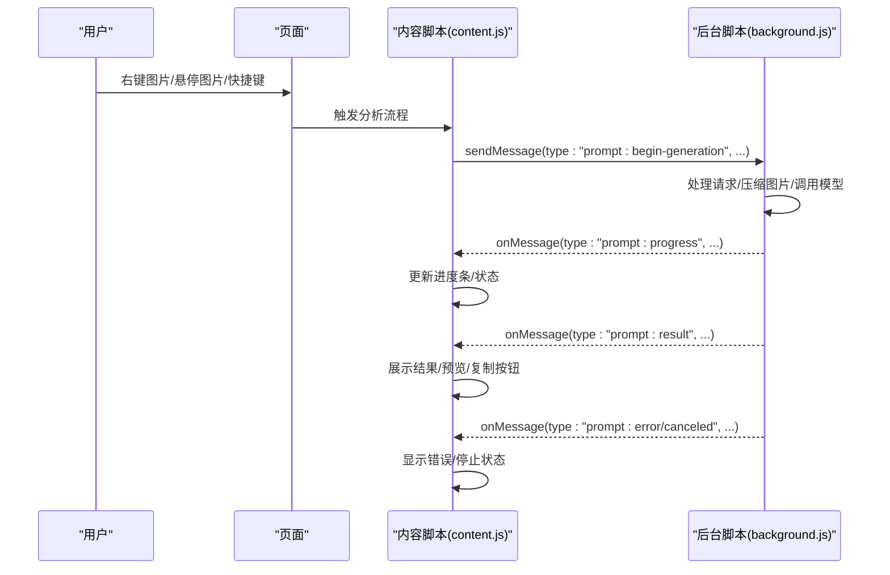
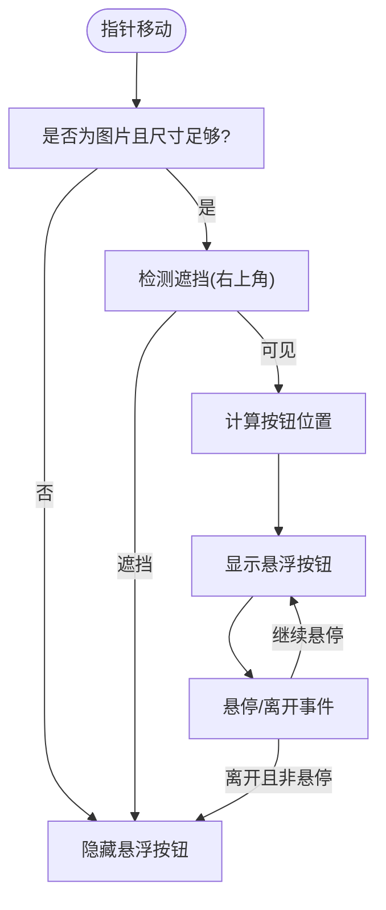
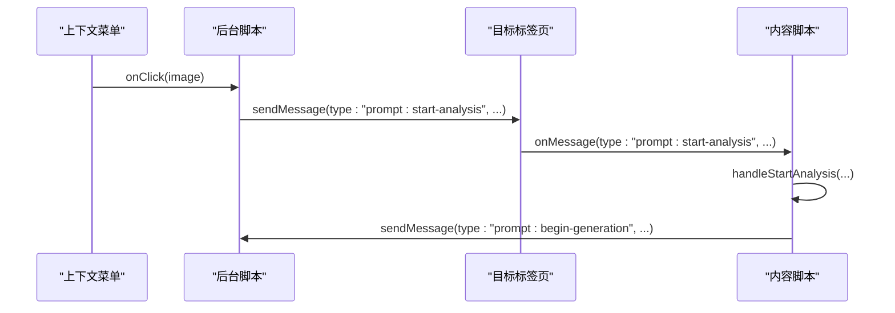
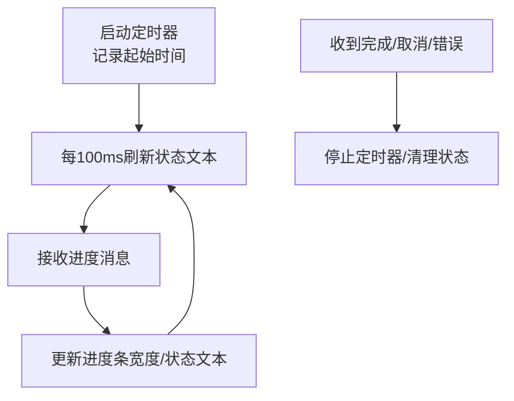
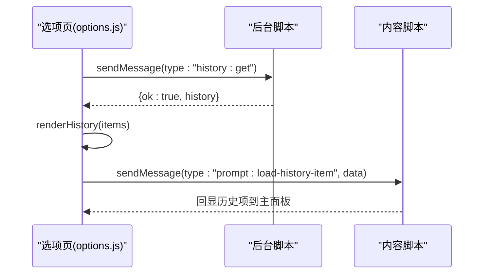
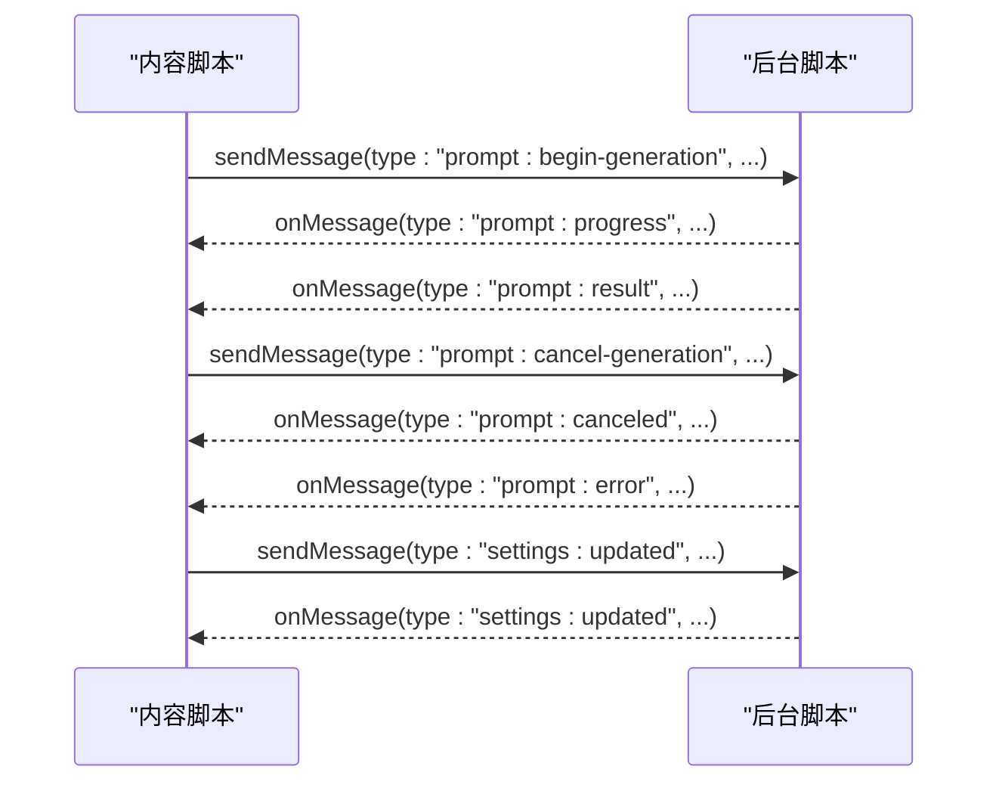
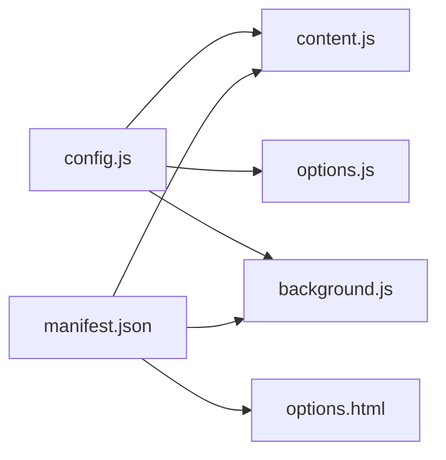

# 前端界面开发

<cite>
**本文引用的文件**
- [content.js](file://content.js)
- [options.html](file://options.html)
- [options.js](file://options.js)
- [config.js](file://config.js)
- [manifest.json](file://manifest.json)
- [background.js](file://background.js)
</cite>

## 目录
1. [简介](#简介)
2. [项目结构](#项目结构)
3. [核心组件](#核心组件)
4. [架构总览](#架构总览)
5. [详细组件分析](#详细组件分析)
6. [依赖关系分析](#依赖关系分析)
7. [性能考量](#性能考量)
8. [故障排查指南](#故障排查指南)
9. [结论](#结论)
10. [附录](#附录)

## 简介
本指南面向 Img2Prompt 前端界面开发，聚焦于 content.js 中的用户界面交互实现（悬浮按钮、图片分析触发、进度条与状态显示）、options.html 与 options.js 中设置页面的开发模式（表单验证、实时配置更新、历史记录管理）。文档提供开发示例、响应式布局适配方法、用户交互事件处理策略，并深入解释与后台脚本的消息通信机制（含 sendTabMessage 的使用、消息类型定义、数据传递模式），最后给出用户体验优化建议（加载状态、错误提示、无障碍支持）。

## 项目结构
- 扩展清单声明了内容脚本注入时机、命令快捷键、侧边栏路径以及权限。
- 配置文件集中定义默认设置、多语言文案、错误码与消息映射，供各模块共享。
- 内容脚本负责页面内 UI 与交互，选项页负责设置与历史记录管理，后台脚本负责与模型服务通信、进度分发与历史持久化。

```mermaid
graph TB
subgraph "扩展"
Manifest["manifest.json"]
Config["config.js"]
Content["content.js"]
OptionsHTML["options.html"]
OptionsJS["options.js"]
Background["background.js"]
end
Manifest --> Content
Manifest --> Background
Manifest --> OptionsHTML
OptionsHTML --> OptionsJS
Config --> Content
Config --> OptionsJS
Config --> Background
Content <- --> Background
OptionsJS <- --> Background
```

图表来源
- [manifest.json:22-26](file://manifest.json#L22-L26)
- [config.js:4-252](file://config.js#L4-L252)
- [content.js:1-50](file://content.js#L1-L50)
- [options.html:1-687](file://options.html#L1-L687)
- [options.js:1-551](file://options.js#L1-L551)
- [background.js:1-120](file://background.js#L1-L120)

章节来源
- [manifest.json:1-45](file://manifest.json#L1-L45)
- [config.js:1-253](file://config.js#L1-L253)

## 核心组件
- 内容脚本（content.js）
  - 悬浮按钮：在图片上悬停时显示“快速分析”入口，支持点击触发分析。
  - 主面板：包含预览图、扫描动画、进度条、状态文本、语言切换、复制按钮、停止按钮等。
  - 进度与状态：通过定时器刷新状态文本并更新进度条宽度；根据消息类型更新 UI。
  - 截屏工具：基于全屏覆盖层实现框选截图，裁剪后触发分析。
  - 与后台通信：通过 runtime sendMessage 发送分析请求、取消请求、接收进度与结果。
- 设置页面（options.html + options.js）
  - 表单验证：必填字段校验、自动保存防抖、语言切换即时生效。
  - 实时配置更新：变更即写入存储并通过 runtime 通知其他标签页同步。
  - 历史记录管理：拉取历史、渲染列表、复制/删除、清空确认。
- 配置中心（config.js）
  - 默认设置、用户提示词预设、UI 文案、错误码与消息映射、分析上报配置。

章节来源
- [content.js:1-1578](file://content.js#L1-L1578)
- [options.html:1-687](file://options.html#L1-L687)
- [options.js:1-551](file://options.js#L1-L551)
- [config.js:1-253](file://config.js#L1-L253)

## 架构总览
扩展采用“内容脚本 + 选项页 + 后台脚本”的三段式架构：
- 用户在页面内通过悬浮按钮或上下文菜单/快捷键触发分析。
- 内容脚本向后台发送“开始分析/取消”等消息，并监听进度与结果消息。
- 后台脚本负责与外部模型服务通信、进度分发、历史持久化与跨标签页同步。



图表来源
- [content.js:209-247](file://content.js#L209-L247)
- [background.js:94-184](file://background.js#L94-L184)

## 详细组件分析

### 悬浮按钮与主面板（content.js）
- 悬浮按钮
  - 创建宿主节点与 Shadow DOM，注入样式与按钮结构。
  - 监听指针移动，定位图片并计算按钮位置，避免遮挡。
  - 支持关闭按钮、悬停状态、可见性切换。
- 主面板
  - 预览图、扫描动画、进度条、状态文本、语言切换、复制按钮、停止按钮。
  - 支持拖拽卡片移动、复制文本、停止生成、错误提示。
- 进度与状态
  - 定时器每 100ms 刷新状态文本，显示耗时。
  - 根据消息类型更新进度百分比与状态文案。
- 截屏工具
  - 全屏覆盖层实现框选，绘制洞穿效果，鼠标抬起后裁剪并触发分析。



图表来源
- [content.js:1158-1263](file://content.js#L1158-L1263)

章节来源
- [content.js:622-725](file://content.js#L622-L725)
- [content.js:1158-1263](file://content.js#L1158-L1263)
- [content.js:1273-1346](file://content.js#L1273-L1346)
- [content.js:1373-1429](file://content.js#L1373-L1429)
- [content.js:489-594](file://content.js#L489-L594)

### 图片分析触发机制（content.js）
- 上下文菜单触发：后台脚本注册图片上下文菜单，点击后向当前标签页发送“开始分析”消息。
- 快捷键触发：后台脚本监听命令，捕获可见区域截图后发送“截屏分析”消息。
- 悬浮按钮触发：悬停图片时显示按钮，点击后构造请求 ID 并发送“开始分析”。



图表来源
- [background.js:59-72](file://background.js#L59-L72)
- [background.js:74-92](file://background.js#L74-L92)
- [content.js:249-326](file://content.js#L249-L326)

章节来源
- [background.js:59-92](file://background.js#L59-L92)
- [content.js:249-326](file://content.js#L249-L326)

### 进度条显示逻辑（content.js）
- 初始化：启动定时器，记录起始时间，持续刷新状态文本。
- 更新：根据消息中的进度百分比与文本更新 UI。
- 结束：收到完成/取消/错误消息后停止定时器，清理状态。



图表来源
- [content.js:1396-1416](file://content.js#L1396-L1416)
- [content.js:1373-1380](file://content.js#L1373-L1380)
- [content.js:220-247](file://content.js#L220-L247)

章节来源
- [content.js:1373-1429](file://content.js#L1373-L1429)

### 设置页面开发模式（options.html + options.js）
- 表单验证与实时更新
  - 自动保存：输入/变更事件触发防抖保存，写入本地存储并通知其他标签页。
  - 语言切换：即时更新页面文案与 UI。
  - 必填项校验：保存自定义模板前检查内容。
- 历史记录管理
  - 拉取历史：通过 runtime 发送“history:get”消息。
  - 渲染列表：支持复制、删除、清空确认。
  - 加载历史项：向内容脚本发送“prompt:load-history-item”以在主面板展示。



图表来源
- [options.js:218-248](file://options.js#L218-L248)
- [options.js:336-360](file://options.js#L336-L360)
- [content.js:378-431](file://content.js#L378-L431)

章节来源
- [options.html:1-687](file://options.html#L1-L687)
- [options.js:1-551](file://options.js#L1-L551)

### 消息通信机制（content.js 与 background.js）
- 内容脚本
  - 监听后台消息：进度、结果、取消、错误、设置更新。
  - 发送消息：开始生成、取消生成、复制统计、分析统计。
- 后台脚本
  - 注册上下文菜单与快捷键，向内容脚本发送“开始分析/截屏分析”。
  - 处理生成流程：压缩图片、调用模型、分发进度、持久化历史、错误分类与用户提示。



图表来源
- [content.js:209-247](file://content.js#L209-L247)
- [background.js:94-184](file://background.js#L94-L184)

章节来源
- [content.js:65-75](file://content.js#L65-L75)
- [content.js:1569-1577](file://content.js#L1569-L1577)
- [background.js:134-147](file://background.js#L134-L147)

## 依赖关系分析
- 内容脚本依赖配置中心提供的 UI 文案、默认设置与错误映射。
- 选项页依赖配置中心的 I18N 与默认设置，同时与后台脚本交互以获取/删除/清空历史。
- 后台脚本依赖配置中心的默认设置、错误码与分析上报配置，负责与外部模型服务通信。



图表来源
- [config.js:4-252](file://config.js#L4-L252)
- [manifest.json:22-26](file://manifest.json#L22-L26)

章节来源
- [config.js:1-253](file://config.js#L1-L253)
- [manifest.json:1-45](file://manifest.json#L1-L45)

## 性能考量
- 指针事件节流：对 pointermove 使用节流函数，减少频繁计算与重绘。
- 进度定时器：按需启动/停止，避免无意义轮询。
- 图像压缩：在后台统一处理，避免重复计算。
- 存储更新：自动保存使用防抖，降低写入频率。
- 响应式布局：媒体查询与网格布局适配移动端与桌面端。

章节来源
- [content.js:5-28](file://content.js#L5-L28)
- [content.js:1396-1416](file://content.js#L1396-L1416)
- [options.js:387-405](file://options.js#L387-L405)
- [options.html:461-471](file://options.html#L461-L471)

## 故障排查指南
- 常见错误类型与提示
  - 网络错误、图片获取失败、图片处理失败、认证失败、速率限制、超时、无效响应、JSON 解析失败、缺失字段、已取消、未知错误。
- 用户体验优化
  - 错误提示：在状态区显示用户友好消息，必要时提供具体错误码。
  - 加载状态：扫描动画与进度条明确告知处理阶段。
  - 无障碍：为按钮提供 aria-label，确保键盘可达与屏幕阅读器友好。
  - 复制反馈：复制成功/失败的状态变化与短暂提示。

章节来源
- [config.js:206-247](file://config.js#L206-L247)
- [content.js:452-487](file://content.js#L452-L487)
- [options.js:302-320](file://options.js#L302-L320)

## 结论
本指南系统梳理了 Img2Prompt 前端界面的实现要点，涵盖悬浮按钮与主面板交互、图片分析触发链路、进度与状态管理、设置页面的实时更新与历史记录管理，以及与后台脚本的消息通信机制。通过节流、防抖、统一图像处理与合理的 UI 状态机，实现了稳定、流畅且可维护的前端体验。建议在后续迭代中进一步完善无障碍与国际化细节，持续优化性能与错误提示策略。

## 附录

### 开发示例：在 content.js 中添加新的 UI 组件
- 步骤
  - 在构建面板的模板字符串中添加新元素（如按钮、输入框、图标）。
  - 在 bindPanelEvents 中绑定事件监听器，处理用户交互。
  - 编写对应的更新函数（如 setXxxState、setTextXxxValue）以驱动 UI。
  - 在 handleStartAnalysis/handleResult/handleCanceled/handleError 中调用相应函数更新 UI。
- 注意事项
  - 使用 Shadow DOM 保证样式隔离。
  - 为新增元素提供 aria-label 与可访问性属性。
  - 对高频事件使用节流/防抖。

章节来源
- [content.js:727-1156](file://content.js#L727-L1156)
- [content.js:1273-1346](file://content.js#L1273-L1346)

### 开发示例：实现响应式布局适配
- 方法
  - 使用 CSS Grid/Flexbox 与媒体查询适配不同屏幕尺寸。
  - 控制面板宽度与最大宽度，确保在窄屏设备上可滚动。
  - 针对触摸设备优化按钮尺寸与间距。
- 示例参考
  - 设置页面在窄屏下将两列网格改为单列，按钮居中显示。

章节来源
- [options.html:461-471](file://options.html#L461-L471)

### 开发示例：处理用户交互事件
- 悬浮按钮
  - 监听 pointerenter/leave 与 click，结合可见性与遮挡检测。
- 主面板
  - 拖拽卡片：pointerdown 记录偏移，pointermove 更新位置，pointerup 停止拖拽。
  - 复制按钮：点击后写入剪贴板，切换按钮状态并短暂提示。
  - 停止按钮：发送取消消息，禁用按钮直到后台确认。
- 选项页
  - 自动保存：input/change 事件触发防抖保存。
  - 历史项：点击列表项加载到主面板，复制/删除按钮分别写剪贴板与发送删除消息。

章节来源
- [content.js:1158-1263](file://content.js#L1158-L1263)
- [content.js:1501-1567](file://content.js#L1501-L1567)
- [content.js:1318-1345](file://content.js#L1318-L1345)
- [options.js:369-375](file://options.js#L369-L375)
- [options.js:302-320](file://options.js#L302-L320)

### 与后台脚本的消息通信要点
- 消息类型
  - prompt:start-analysis、prompt:start-snipping、prompt:begin-generation、prompt:progress、prompt:result、prompt:canceled、prompt:error、prompt:cancel-generation、prompt:load-history-item、settings:updated、history:get、history:delete、history:clear、analytics:track、prompt:open-options。
- 数据传递模式
  - 内容脚本向后台传递请求 ID、图片源（URL 或 Base64）、页面上下文、触发来源。
  - 后台向内容脚本回传进度、结果、错误与用户友好消息。
  - 选项页通过 runtime 与后台交互以管理历史与同步设置。
- 安全与健壮性
  - 使用 safeSendRuntimeMessage 包装消息发送，捕获扩展上下文失效等异常。
  - 对后台返回的错误进行分类与用户友好提示。

章节来源
- [content.js:209-247](file://content.js#L209-L247)
- [background.js:94-184](file://background.js#L94-L184)
- [options.js:218-248](file://options.js#L218-L248)
- [options.js:336-360](file://options.js#L336-L360)