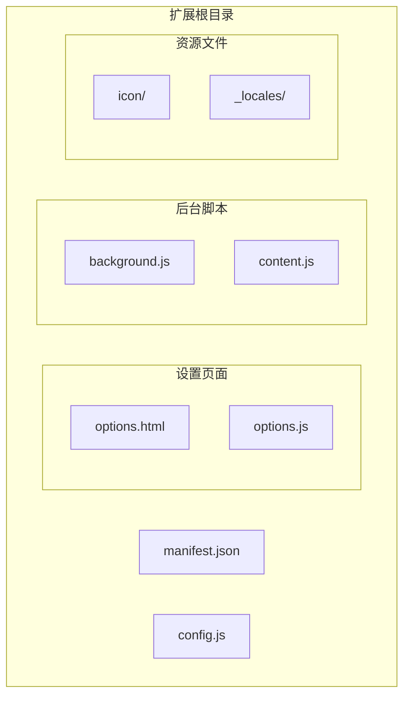
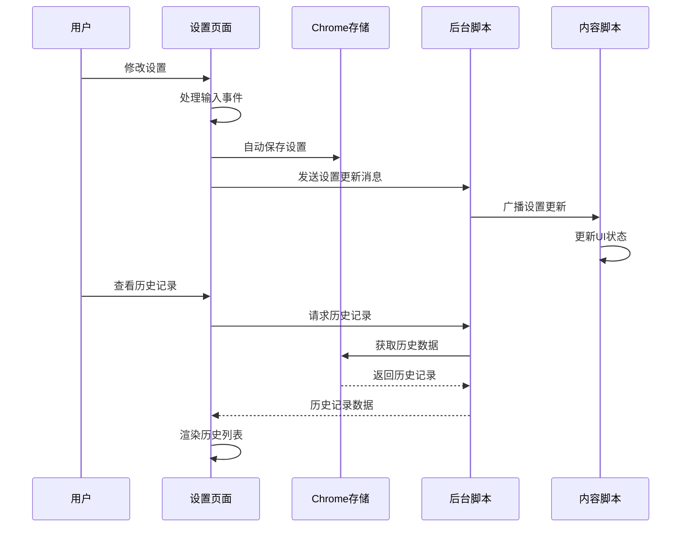
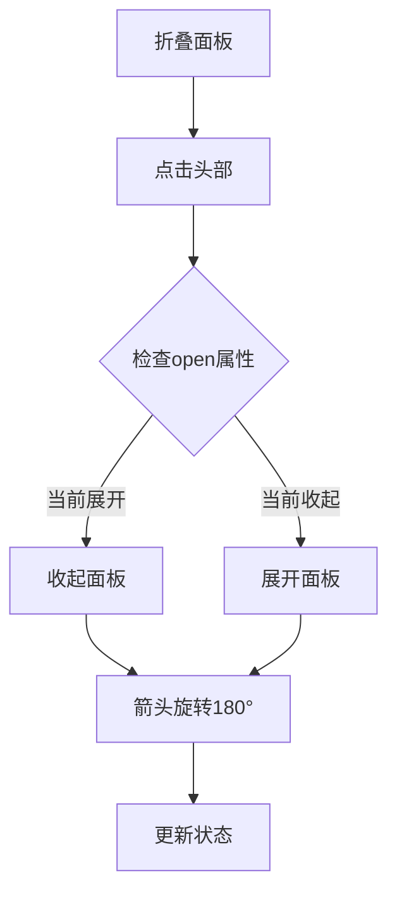
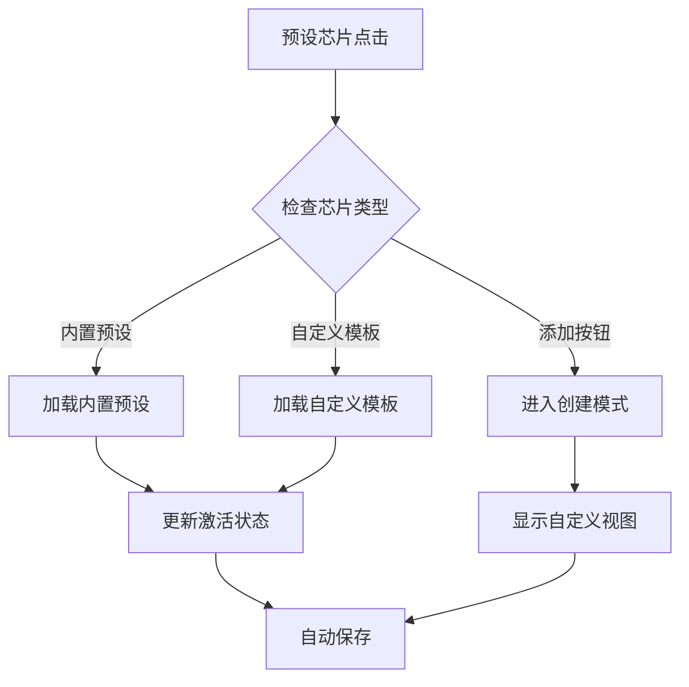
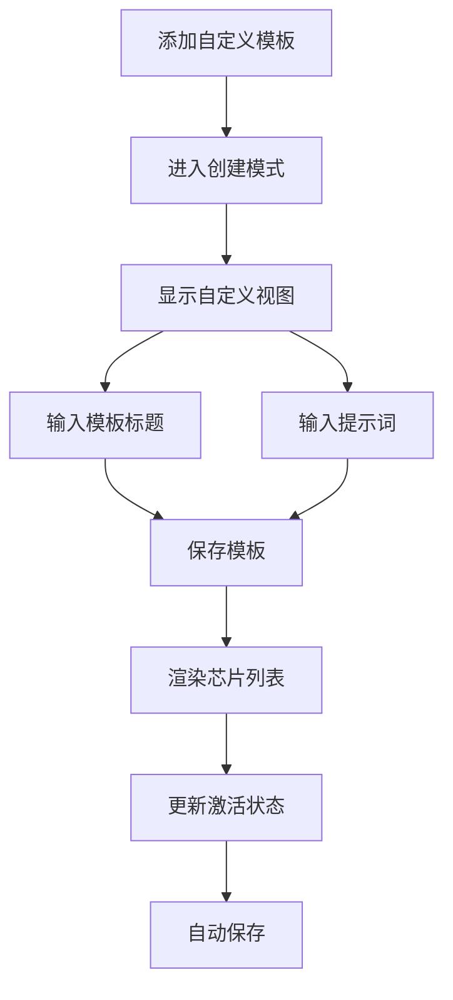
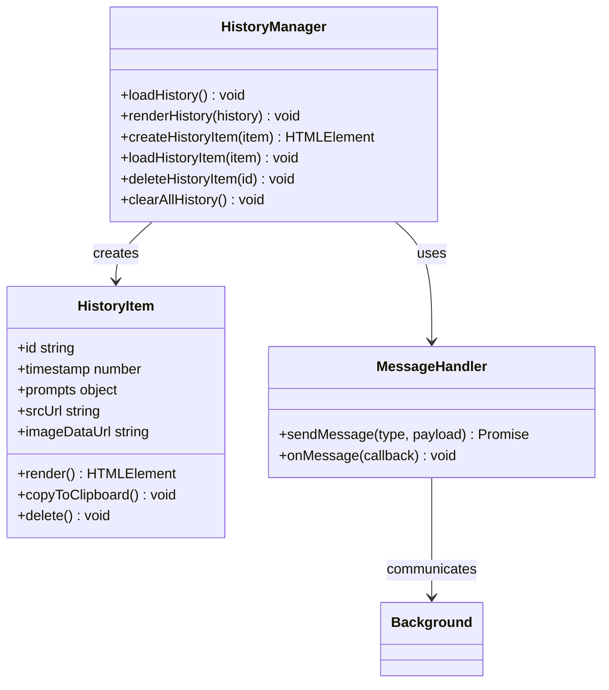
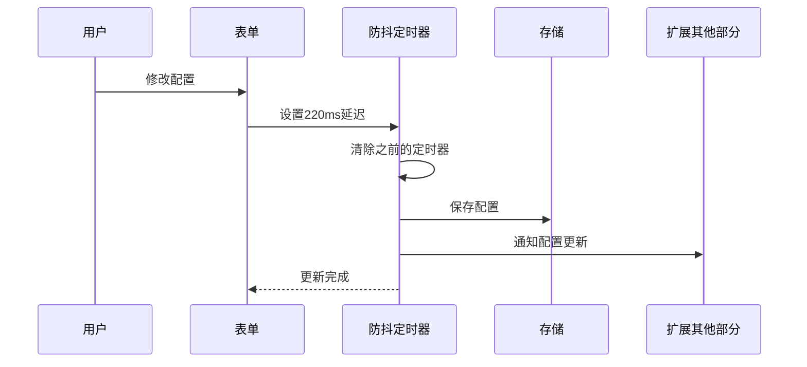
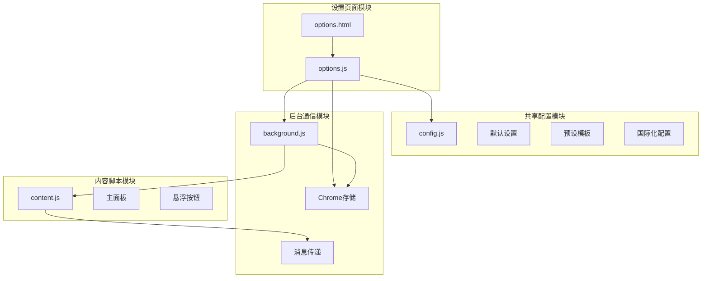

# 设置页面开发

<cite>
**本文档引用的文件**
- [options.html](file://options.html)
- [options.js](file://options.js)
- [config.js](file://config.js)
- [background.js](file://background.js)
- [content.js](file://content.js)
- [manifest.json](file://manifest.json)
- [_locales/en/messages.json](file://_locales/en/messages.json)
- [_locales/zh_CN/messages.json](file://_locales/zh_CN/messages.json)
</cite>

## 更新摘要
**变更内容**
- **重大UI重构**：从静态布局转换为折叠式面板（accordion-style），提升界面组织性和可用性
- **增强预设芯片管理**：改进的预设芯片系统，支持更多场景预设和自定义模板
- **优化自定义模板处理**：增强的自定义模板创建、编辑和删除功能
- **改进折叠面板交互**：新增展开/收起箭头图标，提供更好的视觉反馈
- **优化响应式设计**：针对不同屏幕尺寸的自适应布局

## 目录
1. [简介](#简介)
2. [项目结构](#项目结构)
3. [核心组件](#核心组件)
4. [架构概览](#架构概览)
5. [详细组件分析](#详细组件分析)
6. [依赖关系分析](#依赖关系分析)
7. [性能考虑](#性能考虑)
8. [故障排除指南](#故障排除指南)
9. [结论](#结论)
10. [附录](#附录)

## 简介

Img2Prompt 是一个 Chrome 扩展程序，能够将图片转换为 AI 提示词。设置页面是用户配置扩展功能的核心界面，采用了现代化的折叠式面板设计，提供了完整的配置管理、历史记录查看和交互体验优化功能。

本指南将深入分析完全重写的设置页面的 HTML 结构设计、JavaScript 逻辑实现，以及与后台脚本的通信机制，为开发者提供全面的开发参考。

## 项目结构

Img2Prompt 项目采用模块化架构，主要文件组织如下：



**图表来源**
- [manifest.json:1-45](file://manifest.json#L1-L45)
- [config.js:1-307](file://config.js#L1-L307)
- [options.html:1-805](file://options.html#L1-L805)
- [options.js:1-770](file://options.js#L1-L770)

**章节来源**
- [manifest.json:1-45](file://manifest.json#L1-L45)
- [config.js:1-307](file://config.js#L1-L307)

## 核心组件

设置页面由多个核心组件构成，每个组件都有特定的功能职责：

### 折叠式面板系统
- **折叠面板设计**：基于 `<details>` 和 `<summary>` 元素的现代化折叠面板
- **展开/收起动画**：流畅的 180ms 过渡动画，提供良好的视觉反馈
- **箭头图标指示器**：旋转箭头图标显示面板状态
- **响应式布局**：针对不同屏幕尺寸的自适应设计

### 预设芯片管理系统
- **内置预设芯片**：支持通用、摄影、插画CG、平面设计等多种场景
- **自定义模板芯片**：动态创建和管理用户自定义模板
- **激活状态管理**：智能识别当前使用的预设并高亮显示
- **一键切换功能**：快速在不同预设之间切换

### 历史记录管理
- **IndexedDB 存储**：基于 IndexedDB 的高性能历史记录存储
- **实时同步**：通过消息传递机制实现实时历史记录更新
- **用户交互**：提供完整的查看、复制、删除功能

### 用户界面组件
- **现代化暗色主题**：基于 CSS 变量的主题系统，支持颜色方案切换
- **响应式布局**：自适应桌面和移动设备的界面布局
- **动画效果**：流畅的过渡动画和悬停效果
- **现代化控件**：自定义开关、下拉菜单和按钮样式

### 配置管理系统
- **默认设置存储**：通过共享配置文件管理所有默认设置
- **实时配置更新**：自动保存机制确保设置变更立即生效
- **语言国际化**：支持中英文双语界面动态切换

**章节来源**
- [options.js:1-770](file://options.js#L1-L770)
- [config.js:1-307](file://config.js#L1-L307)

## 架构概览

设置页面采用分层架构设计，实现了清晰的关注点分离：



**图表来源**
- [options.js:541-559](file://options.js#L541-L559)
- [background.js:151-164](file://background.js#L151-L164)
- [content.js:374-415](file://content.js#L374-L415)

## 详细组件分析

### HTML 结构设计

设置页面采用语义化的 HTML5 结构，精心设计了现代化的折叠式面板布局和视觉层次：

#### 折叠式面板系统
- **details/summary 元素**：使用原生 HTML5 折叠面板实现
- **自定义样式**：完全自定义的折叠面板外观和行为
- **展开箭头图标**：旋转动画显示面板状态
- **内容区域分离**：头部和内容区域的清晰分离

#### 预设芯片管理系统
- **芯片容器**：flex 布局支持响应式芯片排列
- **激活状态样式**：蓝色高亮显示当前激活的预设
- **自定义模板标识**：齿轮图标区分自定义模板
- **添加按钮**：虚线边框的 + 号按钮用于创建新模板

#### 历史记录列表实现
- **容器结构**：灵活的网格布局支持响应式设计
- **项目渲染**：动态创建历史记录条目
- **交互功能**：复制、删除、查看详情等操作
- **动画效果**：淡入动画和悬停效果

#### 响应式布局设计
- **网格系统**：基于 CSS Grid 的灵活布局
- **媒体查询**：针对小屏幕设备的优化布局
- **弹性盒子**：使用 `flexbox` 实现内容居中和对齐
- **自适应字体**：根据屏幕尺寸调整字体大小

**章节来源**
- [options.html:1-805](file://options.html#L1-L805)

### JavaScript 逻辑实现

#### 折叠面板交互
设置页面实现了丰富的折叠面板交互：



**图表来源**
- [options.js:137-140](file://options.js#L137-L140)

#### 预设芯片管理
预设芯片管理系统提供了完整的预设选择和状态管理：



**图表来源**
- [options.js:27-82](file://options.js#L27-L82)
- [options.js:119-151](file://options.js#L119-L151)

#### 自定义模板处理机制

**更新** 自定义模板处理逻辑已重构并增强

自定义模板处理现在支持更完整的 CRUD 操作：



**图表来源**
- [options.js:104-117](file://options.js#L104-L117)
- [options.js:153-171](file://options.js#L153-L171)
- [options.js:201-218](file://options.js#L201-L218)

#### 历史记录管理界面
历史记录管理提供了完整的 CRUD 操作：



**图表来源**
- [options.js:258-288](file://options.js#L258-L288)
- [background.js:489-557](file://background.js#L489-L557)

#### 实时配置更新
采用防抖机制实现高效的配置更新：



**图表来源**
- [options.js:541-559](file://options.js#L541-L559)

**章节来源**
- [options.js:119-151](file://options.js#L119-L151)
- [options.js:258-288](file://options.js#L258-L288)

### 开发示例

#### 添加新的配置选项

要在设置页面中添加新的配置选项，需要遵循以下步骤：

1. **更新默认设置**：在共享配置中添加新选项
2. **更新 HTML 结构**：添加对应的表单元素
3. **实现 JavaScript 逻辑**：处理输入事件和保存逻辑
4. **更新消息传递**：确保后台脚能得到新选项

#### 实现表单数据双向绑定

设置页面实现了自动化的数据绑定机制：

```javascript
// 示例：自动保存配置
function handleAutoSave() {
    if (isHydrating) return;
    
    clearTimeout(handleAutoSave.timerId);
    handleAutoSave.timerId = setTimeout(async () => {
        const payload = buildPayload();
        await chrome.storage.local.set(payload);
        applyLanguage(payload.uiLanguage);
        trackSettingsSaved("auto_save");
        
        // 通知扩展其他部分
        chrome.runtime.sendMessage({ type: "settings:updated" });
    }, 220);
}
```

#### 处理用户输入验证

表单验证采用实时反馈机制：

```javascript
// 示例：输入事件处理
form.addEventListener("input", (e) => {
    if (e.target.name === "userPrompt") {
        updateActiveChip(e.target.value.trim());
    }
    handleAutoSave();
});

// 示例：表单提交验证
function validateForm() {
    const formData = new FormData(form);
    const errors = [];
    
    // 必填字段验证
    const requiredFields = ['apiEndpoint', 'model', 'apiKey'];
    requiredFields.forEach(field => {
        if (!formData.get(field)?.trim()) {
            errors.push(`${field} 不能为空`);
        }
    });
    
    // 格式验证
    if (formData.get('apiEndpoint') && !isValidUrl(formData.get('apiEndpoint'))) {
        errors.push('API 端点格式不正确');
    }
    
    return errors;
}
```

#### 折叠面板交互实现

**新增** 折叠面板交互的完整实现：

```javascript
// 折叠面板展开/收起处理
function toggleCollapsible(element) {
    const summary = element.querySelector('summary');
    const arrow = summary.querySelector('.collapsible-arrow');
    
    element.addEventListener('toggle', (e) => {
        if (e.target.hasAttribute('open')) {
            arrow.style.transform = 'rotate(180deg)';
        } else {
            arrow.style.transform = 'rotate(0deg)';
        }
    });
}

// 初始化所有折叠面板
function initCollapsiblePanels() {
    const panels = document.querySelectorAll('.collapsible');
    panels.forEach(panel => {
        toggleCollapsible(panel);
    });
}
```

#### 预设芯片管理实现

**更新** 预设芯片管理的完整实现：

```javascript
// 预设芯片点击处理
presetChipsContainer.addEventListener("click", (e) => {
    e.preventDefault();
    e.stopPropagation();
    
    const chip = e.target.closest(".preset-chip");
    if (!chip) return;
    
    if (isHydrating) return;
    const presetKey = chip.getAttribute("data-preset");
    
    if (presetKey === "+add") {
        enterCreateCustomMode();
        return;
    }
    
    // 智能堆叠逻辑
    const basePrompt = ImgPromptConfig.BASE_USER_PROMPT;
    
    if (PRESETS && PRESETS[presetKey]) {
        if (presetKey === "general") {
            // 通用：仅基础提示词
            form.userPrompt.value = basePrompt;
        } else {
            // 场景预设：基础 + 场景聚焦
            form.userPrompt.value = basePrompt + PRESETS[presetKey];
        }
        
        // 直接高亮点击的预设按钮
        const allChips = document.querySelectorAll(".preset-chip");
        allChips.forEach(chip => chip.classList.remove("active"));
        chip.classList.add("active");
        
        // 隐藏自定义模式视图
        showBuiltinMode();
        
        handleAutoSave();
        return;
    }
    
    if (presetKey.startsWith("custom_")) {
        const customId = presetKey;
        if (customTemplates[customId]) {
            form.userPrompt.value = customTemplates[customId].prompt;
            
            // 直接高亮点击的自定义预设按钮
            const allChips = document.querySelectorAll(".preset-chip");
            allChips.forEach(chip => chip.classList.remove("active"));
            chip.classList.add("active");
            
            // 显示自定义编辑模式
            showCustomEditMode(customId);
            
            handleAutoSave();
        }
    }
});
```

#### 自定义模板处理实现

**更新** 自定义模板处理的完整实现：

```javascript
// 自定义模板保存处理
customSaveBtn.addEventListener("click", async () => {
    const uiLang = form.uiLanguage ? form.uiLanguage.value : "zh";
    const title = customTitleInput.value.trim() || TRANSLATIONS[uiLang]["custom-title-label"] || "Template";
    const text = form.userPrompt.value.trim();
    
    if (!text) {
        setStatus("⚠️");
        return;
    }
    
    const id = currentEditingId || "custom_" + Date.now();
    customTemplates[id] = { title, prompt: text };
    
    await chrome.storage.local.set({ customTemplates });
    renderCustomChips();
    updateActiveChip(text);
    handleAutoSave();
    setStatus("✅ Saved");
});

// 自定义模板删除处理
customDeleteBtn.addEventListener("click", async () => {
    if (currentEditingId && customTemplates[currentEditingId]) {
        delete customTemplates[currentEditingId];
        await chrome.storage.local.set({ customTemplates });
        renderCustomChips();
        form.userPrompt.value = PRESETS["general"] || "";
        updateActiveChip(form.userPrompt.value);
        handleAutoSave();
        setStatus("🗑️ Deleted");
    }
});
```

**章节来源**
- [options.js:431-437](file://options.js#L431-L437)
- [options.js:541-559](file://options.js#L541-L559)
- [options.js:27-82](file://options.js#L27-L82)
- [options.js:153-171](file://options.js#L153-L171)

### 通信机制

设置页面与后台脚本通过消息传递实现松耦合通信：

#### 配置同步机制
- **自动保存**：配置变更触发自动保存到 Chrome 本地存储
- **手动同步**：用户点击重置按钮时强制同步默认设置
- **状态通知**：配置更新后通知扩展其他部分刷新状态

#### 历史记录同步
- **实时获取**：通过消息请求获取最新历史记录
- **增量更新**：监听存储变化实现历史记录的实时更新
- **批量操作**：支持清空全部历史记录等批量操作

#### 错误处理策略
- **前端验证**：实时输入验证和用户友好的错误提示
- **后端验证**：后台脚本执行完整的配置验证
- **降级处理**：网络错误时提供本地缓存和回退方案

**章节来源**
- [options.js:531-540](file://options.js#L531-L540)
- [background.js:151-164](file://background.js#L151-L164)

## 依赖关系分析

设置页面的依赖关系体现了清晰的模块化设计：



**图表来源**
- [options.js:1-10](file://options.js#L1-L10)
- [config.js:4-307](file://config.js#L4-L307)
- [background.js:1-12](file://background.js#L1-L12)

**章节来源**
- [manifest.json:10-26](file://manifest.json#L10-L26)

## 性能考虑

设置页面在性能优化方面采用了多项策略：

### 加载性能
- **懒加载**：历史记录采用按需加载机制
- **防抖优化**：自动保存采用220ms防抖减少存储写入
- **内存管理**：及时清理事件监听器和定时器

### 运行时性能
- **虚拟滚动**：历史记录列表采用虚拟滚动避免大量DOM节点
- **节流处理**：高频事件（如窗口大小变化）采用节流处理
- **异步操作**：所有网络请求和存储操作都采用异步模式

### 存储优化
- **增量更新**：只保存变更的配置项而非整个对象
- **压缩存储**：历史记录采用压缩存储减少空间占用
- **缓存策略**：合理使用浏览器缓存减少重复计算

## 故障排除指南

### 常见问题及解决方案

#### 设置无法保存
1. **检查存储权限**：确认扩展具有存储权限
2. **验证配置格式**：确保 API 端点和密钥格式正确
3. **重启扩展**：重新加载扩展程序解决临时状态问题

#### 历史记录显示异常
1. **清除缓存**：清理浏览器缓存和扩展数据
2. **检查网络连接**：确保网络连接稳定
3. **更新扩展版本**：安装最新版本修复已知问题

#### UI 显示问题
1. **刷新页面**：重新加载设置页面
2. **切换语言**：切换界面语言后恢复显示
3. **检查兼容性**：确认浏览器版本兼容性

#### 折叠面板问题
1. **检查浏览器支持**：确认浏览器支持 details/summary 元素
2. **验证CSS样式**：确保折叠面板样式正确加载
3. **重置面板状态**：清除面板展开状态后重新加载

#### 预设芯片问题
1. **检查预设匹配**：确认预设键名与配置一致
2. **验证智能堆叠**：检查基础提示词和场景预设的组合逻辑
3. **重置预设状态**：清除激活状态后重新选择预设

#### 自定义模板问题
1. **检查模板保存**：确认模板内容和标题有效
2. **验证模板渲染**：检查自定义芯片的渲染和显示
3. **清理模板缓存**：清除模板缓存后重新加载

**章节来源**
- [options.js:485-491](file://options.js#L485-L491)
- [background.js:465-476](file://background.js#L465-L476)

## 结论

Img2Prompt 的设置页面展现了现代 Web 扩展开发的最佳实践。通过完全重写的折叠式面板设计、清晰的架构分离和完善的用户体验优化，该设置页面为用户提供了直观、高效、可靠的配置管理体验。

关键优势包括：
- **现代化折叠面板设计**：基于原生 HTML5 元素的折叠面板系统
- **完整的功能覆盖**：从基础配置到高级功能的全面支持
- **优秀的用户体验**：实时反馈、智能验证和优雅的错误处理
- **良好的扩展性**：模块化设计便于添加新功能和维护
- **可靠的稳定性**：完善的错误处理和降级策略
- **智能预设处理**：增强的堆叠算法和状态管理机制
- **自定义模板系统**：完整的模板创建、编辑和管理功能

对于开发者而言，该设置页面提供了丰富的参考案例，包括折叠面板交互、预设芯片管理、自定义模板处理、消息通信等多个方面的最佳实践。

## 附录

### 开发最佳实践

#### 新功能开发流程
1. **需求分析**：明确功能需求和用户场景
2. **架构设计**：设计模块接口和数据流
3. **实现细节**：编写高质量的代码和测试
4. **性能优化**：确保功能的性能和稳定性
5. **文档完善**：提供详细的开发文档

#### 代码规范
- **命名规范**：使用语义化的变量和函数命名
- **注释标准**：为复杂逻辑添加必要的注释说明
- **错误处理**：完善的错误处理和用户提示
- **性能考虑**：关注性能影响的代码实现

#### 测试策略
- **单元测试**：为关键函数编写单元测试
- **集成测试**：测试模块间的交互功能
- **用户测试**：收集真实用户的使用反馈
- **兼容性测试**：确保多浏览器环境下的兼容性

### 国际化实现

设置页面支持中英文双语界面，通过以下机制实现：

#### 配置结构
- **SETTINGS_I18N**：设置页面的国际化字符串
- **UI_STRINGS**：运行时界面的国际化字符串
- **默认语言**：通过 `default_locale` 指定默认语言

#### 实现机制
- **data-i18n 属性**：标记需要翻译的元素
- **动态替换**：运行时根据语言设置替换文本
- **占位符支持**：支持带占位符的动态文本

### 折叠面板系统详解

**新增** 折叠面板系统的详细实现：

#### 折叠面板结构
- **details 元素**：作为折叠容器
- **summary 元素**：作为可点击的头部
- **内容区域**：折叠面板的主体内容
- **箭头图标**：旋转动画指示面板状态

#### 交互机制
折叠面板使用原生的 `toggle` 事件来处理展开/收起状态：

```javascript
// 折叠面板状态处理
element.addEventListener('toggle', (e) => {
    const summary = e.target.querySelector('summary');
    const arrow = summary.querySelector('.collapsible-arrow');
    
    if (e.target.hasAttribute('open')) {
        // 展开状态
        arrow.style.transform = 'rotate(180deg)';
    } else {
        // 收起状态
        arrow.style.transform = 'rotate(0deg)';
    }
});
```

#### 动画效果
- **180ms 过渡时间**：提供流畅的旋转动画
- **transform 属性**：使用 CSS transform 实现旋转
- **背景色变化**：展开时增加背景色亮度

### 预设芯片管理系统详解

**更新** 预设芯片管理系统的详细实现：

#### 芯片类型分类
- **内置预设芯片**：通用、摄影、插画CG、平面设计等
- **自定义模板芯片**：用户创建的个性化模板
- **添加按钮芯片**：用于创建新模板的特殊芯片

#### 芯片状态管理
智能激活状态管理确保正确的预设高亮：

```javascript
// 预设激活状态同步
function updateActiveChip(currentPrompt, isFromPresetClick = false) {
    const allChips = document.querySelectorAll(".preset-chip");
    allChips.forEach(chip => chip.classList.remove("active"));
    
    let found = false;
    if (PRESETS) {
        const match = Object.entries(PRESETS).find(([_, text]) => text === currentPrompt);
        if (match) {
            const chipToActivate = document.querySelector(`.preset-chip[data-preset="${match[0]}"]`);
            if (chipToActivate) chipToActivate.classList.add("active");
            showBuiltinMode();
            found = true;
            return;
        }
    }

    const customMatch = Object.entries(customTemplates).find(([_, tpl]) => tpl.prompt === currentPrompt);
    if (customMatch) {
        const chipToActivate = document.querySelector(`.preset-chip[data-preset="${customMatch[0]}"]`);
        if (chipToActivate) chipToActivate.classList.add("active");
        showCustomEditMode(customMatch[0]);
        found = true;
        return;
    }

    // Only enter create mode if explicitly requested (e.g., from +add button)
    // Don't auto-enter create mode when clicking presets
    if (!found && !isFromPresetClick) {
        showCustomCreateMode();
    } else if (!found && isFromPresetClick) {
        showBuiltinMode();
    }
}
```

#### 芯片渲染机制
动态渲染自定义模板芯片：

```javascript
// 自定义模板芯片渲染
function renderCustomChips() {
    const currentCustomChips = document.querySelectorAll(".preset-chip[data-preset^='custom_']");
    currentCustomChips.forEach(chip => chip.remove());

    const container = document.querySelector(".preset-chips");
    const addBtn = document.getElementById("btn-add-custom");

    Object.entries(customTemplates).forEach(([id, tpl]) => {
        const btn = document.createElement("button");
        btn.type = "button";
        btn.className = "preset-chip";
        btn.setAttribute("data-preset", id);
        btn.textContent = `⚙️ ${tpl.title}`;
        if (container && addBtn) {
            container.insertBefore(btn, addBtn);
        }
    });
}
```

### 自定义模板处理详解

**更新** 自定义模板处理的详细实现：

#### 模板生命周期
- **创建阶段**：用户点击添加按钮进入创建模式
- **编辑阶段**：用户输入模板标题和提示词
- **保存阶段**：模板数据持久化存储
- **使用阶段**：模板在预设芯片中可用
- **删除阶段**：模板从存储中移除

#### 数据结构设计
自定义模板采用简洁的数据结构：

```javascript
// 自定义模板数据结构
const customTemplate = {
    id: "custom_1699123456789", // 唯一标识符
    title: "我的模板", // 模板显示标题
    prompt: "完整的提示词内容" // 实际使用的提示词
};
```

#### 模板管理功能
完整的模板 CRUD 操作：

```javascript
// 模板保存处理
async function saveCustomTemplate(title, prompt) {
    const id = "custom_" + Date.now();
    customTemplates[id] = { title, prompt };
    await chrome.storage.local.set({ customTemplates });
    renderCustomChips();
    updateActiveChip(prompt);
    handleAutoSave();
}

// 模板删除处理
async function deleteCustomTemplate(id) {
    if (customTemplates[id]) {
        delete customTemplates[id];
        await chrome.storage.local.set({ customTemplates });
        renderCustomChips();
        form.userPrompt.value = PRESETS["general"] || "";
        updateActiveChip(form.userPrompt.value);
        handleAutoSave();
    }
}
```

**章节来源**
- [config.js:115-204](file://config.js#L115-L204)
- [options.js:539-569](file://options.js#L539-L569)
- [options.js:27-82](file://options.js#L27-L82)
- [options.js:153-171](file://options.js#L153-L171)
- [background.js:639-666](file://background.js#L639-L666)
- [background.js:876-896](file://background.js#L876-L896)
- [content.js:1668-1689](file://content.js#L1668-L1689)