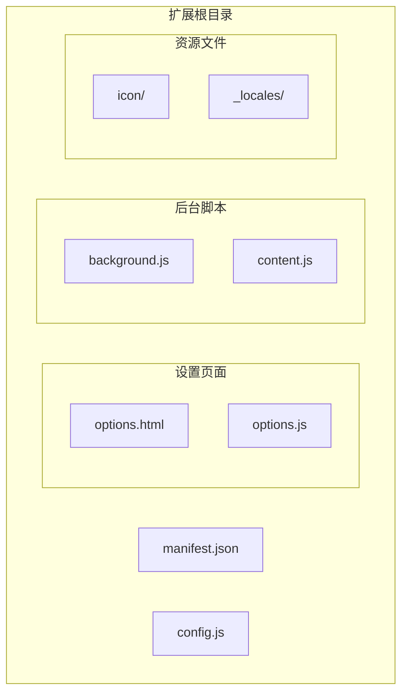
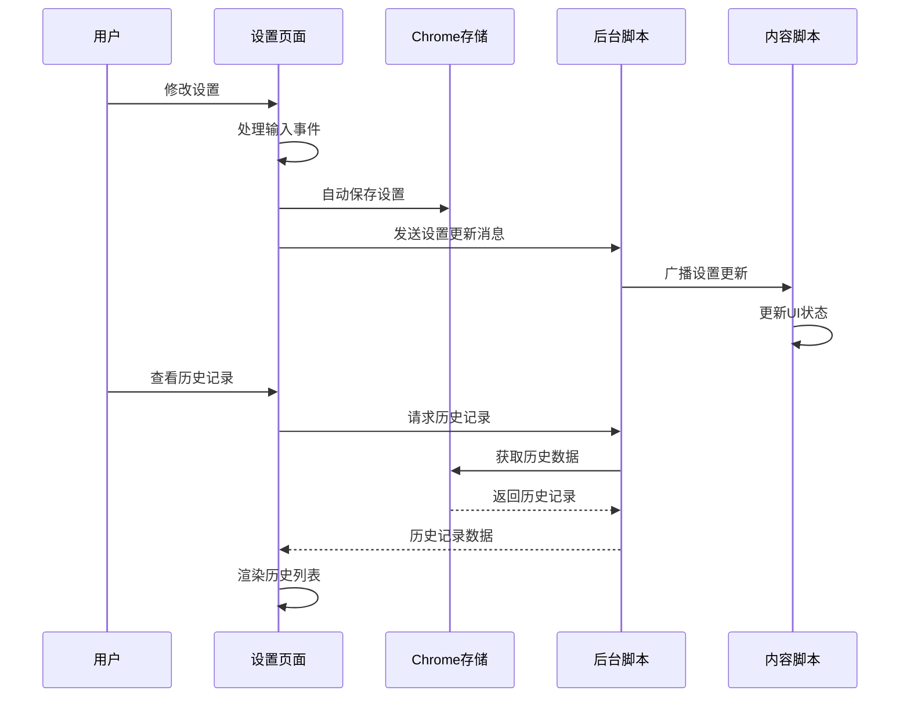
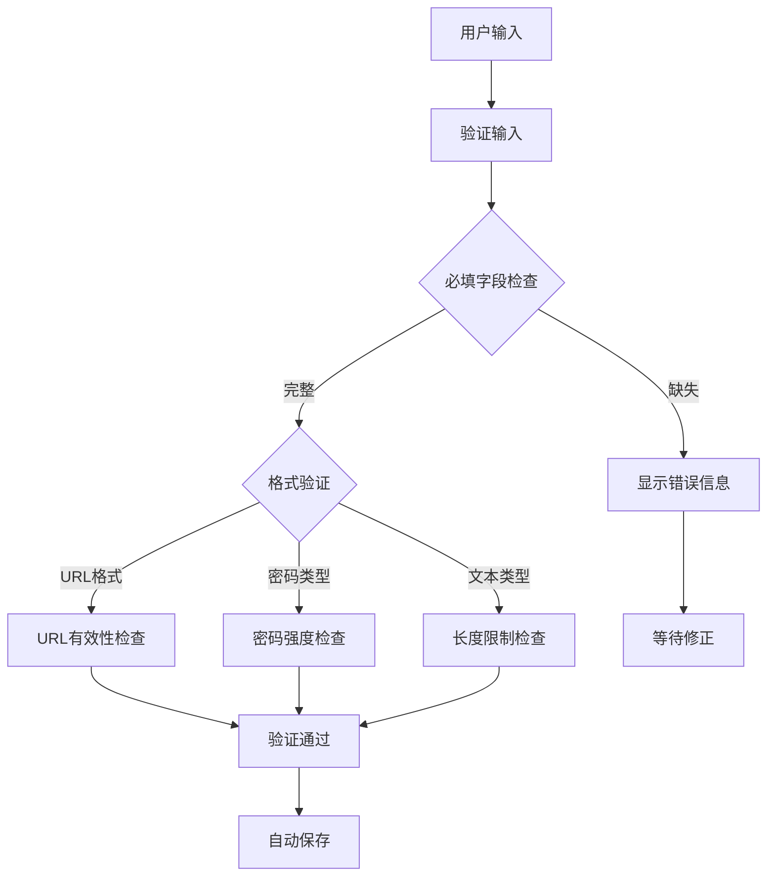
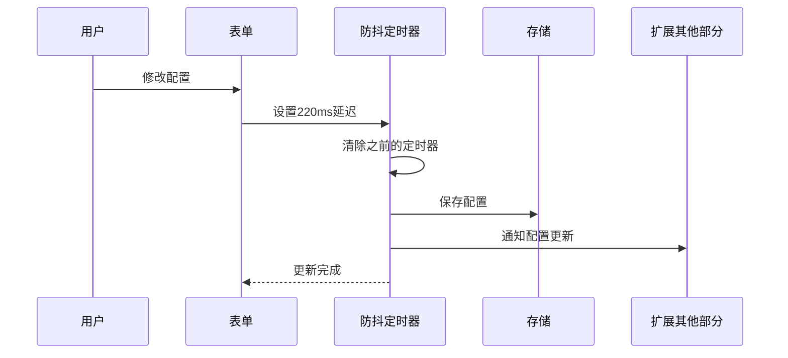
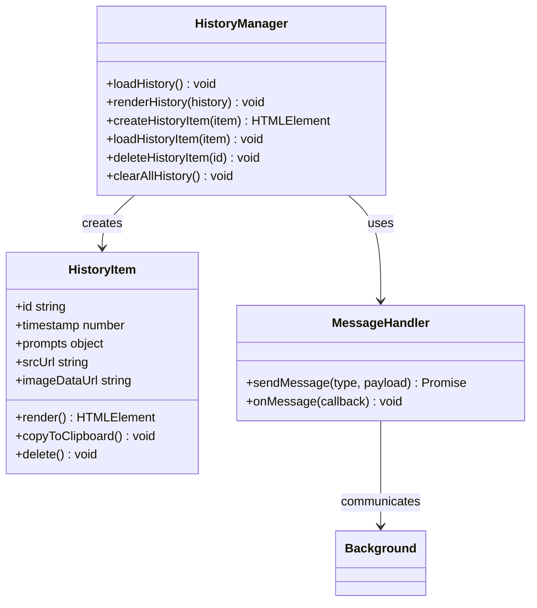
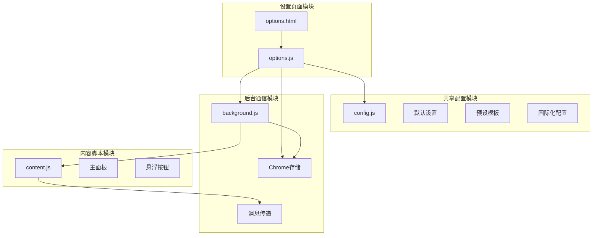

# 设置页面开发

<cite>
**本文档引用的文件**
- [options.html](file://options.html)
- [options.js](file://options.js)
- [config.js](file://config.js)
- [background.js](file://background.js)
- [content.js](file://content.js)
- [manifest.json](file://manifest.json)
- [_locales/en/messages.json](file://_locales/en/messages.json)
- [_locales/zh_CN/messages.json](file://_locales/zh_CN/messages.json)
</cite>

## 更新摘要
**变更内容**
- 完全重写的现代暗色主题 UI 设计
- 响应式布局和移动端适配
- 国际化支持（中英文双语）
- 增强的历史记录管理功能
- 自定义下拉菜单和开关控件
- 配置导入导出功能
- API 连接测试机制

## 目录
1. [简介](#简介)
2. [项目结构](#项目结构)
3. [核心组件](#核心组件)
4. [架构概览](#架构概览)
5. [详细组件分析](#详细组件分析)
6. [依赖关系分析](#依赖关系分析)
7. [性能考虑](#性能考虑)
8. [故障排除指南](#故障排除指南)
9. [结论](#结论)
10. [附录](#附录)

## 简介

Img2Prompt 是一个 Chrome 扩展程序，能够将图片转换为 AI 提示词。设置页面是用户配置扩展功能的核心界面，采用了现代化的暗色主题设计，提供了完整的配置管理、历史记录查看和交互体验优化功能。

本指南将深入分析完全重写的设置页面的 HTML 结构设计、JavaScript 逻辑实现，以及与后台脚本的通信机制，为开发者提供全面的开发参考。

## 项目结构

Img2Prompt 项目采用模块化架构，主要文件组织如下：



**图表来源**
- [manifest.json:1-45](file://manifest.json#L1-L45)
- [config.js:1-253](file://config.js#L1-L253)
- [options.html:1-751](file://options.html#L1-L751)
- [options.js:1-676](file://options.js#L1-L676)

**章节来源**
- [manifest.json:1-45](file://manifest.json#L1-L45)
- [config.js:1-253](file://config.js#L1-L253)

## 核心组件

设置页面由多个核心组件构成，每个组件都有特定的功能职责：

### 现代化 UI 组件
- **暗色主题设计**：基于 CSS 变量的主题系统，支持颜色方案切换
- **响应式布局**：自适应桌面和移动设备的界面布局
- **动画效果**：流畅的过渡动画和悬停效果
- **现代化控件**：自定义开关、下拉菜单和按钮样式

### 配置管理系统
- **默认设置存储**：通过共享配置文件管理所有默认设置
- **实时配置更新**：自动保存机制确保设置变更立即生效
- **语言国际化**：支持中英文双语界面动态切换

### 历史记录管理
- **IndexedDB 存储**：基于 IndexedDB 的高性能历史记录存储
- **实时同步**：通过消息传递机制实现实时历史记录更新
- **用户交互**：提供完整的查看、复制、删除功能

### 用户界面组件
- **预设模板系统**：内置多种场景预设和自定义模板
- **自定义下拉菜单**：替代原生 select 元素的现代化实现
- **切换开关**：美观的开关控件实现布尔配置项

**章节来源**
- [options.js:1-676](file://options.js#L1-L676)
- [config.js:1-253](file://config.js#L1-L253)

## 架构概览

设置页面采用分层架构设计，实现了清晰的关注点分离：



**图表来源**
- [options.js:218-223](file://options.js#L218-L223)
- [background.js:166-171](file://background.js#L166-L171)
- [content.js:209-247](file://content.js#L209-L247)

## 详细组件分析

### HTML 结构设计

设置页面采用语义化的 HTML5 结构，精心设计了现代化的表单元素布局和视觉层次：

#### 现代化暗色主题设计
- **CSS 变量系统**：使用 `:root` 定义主题色彩变量
- **渐变背景**：径向渐变和线性渐变组合的视觉效果
- **半透明元素**：使用 `rgba()` 实现深度感和层次感
- **毛玻璃效果**：`backdrop-filter: blur()` 实现模糊背景

#### 响应式布局设计
- **网格系统**：基于 CSS Grid 的灵活布局
- **媒体查询**：针对小屏幕设备的优化布局
- **弹性盒子**：使用 `flexbox` 实现内容居中和对齐
- **自适应字体**：根据屏幕尺寸调整字体大小

#### 表单元素布局
- **连接设置区域**：包含 API 端点、模型名称和 API 密钥输入
- **提示词设置区域**：预设模板选择和自定义模板编辑
- **使用体验区域**：悬浮按钮、截屏功能等交互设置
- **兼容性设置区域**：图片分辨率限制等技术参数

#### 输入控件配置
- **文本输入**：URL 验证、密码保护、占位符提示
- **复选框**：开关控件实现布尔配置
- **单选按钮**：语言选择器
- **自定义下拉菜单**：现代化的 select 替代方案

#### 历史记录列表实现
- **容器结构**：灵活的网格布局支持响应式设计
- **项目渲染**：动态创建历史记录条目
- **交互功能**：复制、删除、查看详情等操作
- **动画效果**：淡入动画和悬停效果

**章节来源**
- [options.html:1-751](file://options.html#L1-L751)

### JavaScript 逻辑实现

#### 现代化 UI 交互
设置页面实现了丰富的用户界面交互：



**图表来源**
- [options.js:502-520](file://options.js#L502-L520)

#### 实时配置更新
采用防抖机制实现高效的配置更新：



**图表来源**
- [options.js:502-520](file://options.js#L502-L520)

#### 历史记录管理界面
历史记录管理提供了完整的 CRUD 操作：



**图表来源**
- [options.js:219-329](file://options.js#L219-L329)
- [background.js:489-557](file://background.js#L489-L557)

**章节来源**
- [options.js:182-217](file://options.js#L182-L217)
- [options.js:219-329](file://options.js#L219-L329)

### 开发示例

#### 添加新的配置选项

要在设置页面中添加新的配置选项，需要遵循以下步骤：

1. **更新默认设置**：在共享配置中添加新选项
2. **更新 HTML 结构**：添加对应的表单元素
3. **实现 JavaScript 逻辑**：处理输入事件和保存逻辑
4. **更新消息传递**：确保后台脚本能识别新选项

#### 实现表单数据双向绑定

设置页面实现了自动化的数据绑定机制：

```javascript
// 示例：自动保存配置
function handleAutoSave() {
    if (isHydrating) return;
    
    clearTimeout(handleAutoSave.timerId);
    handleAutoSave.timerId = setTimeout(async () => {
        const payload = buildPayload();
        await chrome.storage.local.set(payload);
        applyLanguage(payload.uiLanguage);
        trackSettingsSaved("auto_save");
        
        // 通知扩展其他部分
        chrome.runtime.sendMessage({ type: "settings:updated" });
    }, 220);
}
```

#### 处理用户输入验证

表单验证采用实时反馈机制：

```javascript
// 示例：输入事件处理
form.addEventListener("input", (e) => {
    if (e.target.name === "userPrompt") {
        updateActiveChip(e.target.value.trim());
    }
    handleAutoSave();
});

// 示例：表单提交验证
function validateForm() {
    const formData = new FormData(form);
    const errors = [];
    
    // 必填字段验证
    const requiredFields = ['apiEndpoint', 'model', 'apiKey'];
    requiredFields.forEach(field => {
        if (!formData.get(field)?.trim()) {
            errors.push(`${field} 不能为空`);
        }
    });
    
    // 格式验证
    if (formData.get('apiEndpoint') && !isValidUrl(formData.get('apiEndpoint'))) {
        errors.push('API 端点格式不正确');
    }
    
    return errors;
}
```

**章节来源**
- [options.js:502-520](file://options.js#L502-L520)
- [config.js:5-20](file://config.js#L5-L20)

### 通信机制

设置页面与后台脚本通过消息传递实现松耦合通信：

#### 配置同步机制
- **自动保存**：配置变更触发自动保存到 Chrome 本地存储
- **手动同步**：用户点击重置按钮时强制同步默认设置
- **状态通知**：配置更新后通知扩展其他部分刷新状态

#### 历史记录同步
- **实时获取**：通过消息请求获取最新历史记录
- **增量更新**：监听存储变化实现历史记录的实时更新
- **批量操作**：支持清空全部历史记录等批量操作

#### 错误处理策略
- **前端验证**：实时输入验证和用户友好的错误提示
- **后端验证**：后台脚本执行完整的配置验证
- **降级处理**：网络错误时提供本地缓存和回退方案

**章节来源**
- [options.js:218-223](file://options.js#L218-L223)
- [background.js:166-171](file://background.js#L166-L171)

## 依赖关系分析

设置页面的依赖关系体现了清晰的模块化设计：



**图表来源**
- [options.js:1-10](file://options.js#L1-L10)
- [config.js:4-253](file://config.js#L4-L253)
- [background.js:1-12](file://background.js#L1-L12)

**章节来源**
- [manifest.json:10-26](file://manifest.json#L10-L26)

## 性能考虑

设置页面在性能优化方面采用了多项策略：

### 加载性能
- **懒加载**：历史记录采用按需加载机制
- **防抖优化**：自动保存采用220ms防抖减少存储写入
- **内存管理**：及时清理事件监听器和定时器

### 运行时性能
- **虚拟滚动**：历史记录列表采用虚拟滚动避免大量DOM节点
- **节流处理**：高频事件（如窗口大小变化）采用节流处理
- **异步操作**：所有网络请求和存储操作都采用异步模式

### 存储优化
- **增量更新**：只保存变更的配置项而非整个对象
- **压缩存储**：历史记录采用压缩存储减少空间占用
- **缓存策略**：合理使用浏览器缓存减少重复计算

## 故障排除指南

### 常见问题及解决方案

#### 设置无法保存
1. **检查存储权限**：确认扩展具有存储权限
2. **验证配置格式**：确保 API 端点和密钥格式正确
3. **重启扩展**：重新加载扩展程序解决临时状态问题

#### 历史记录显示异常
1. **清除缓存**：清理浏览器缓存和扩展数据
2. **检查网络连接**：确保网络连接稳定
3. **更新扩展版本**：安装最新版本修复已知问题

#### UI 显示问题
1. **刷新页面**：重新加载设置页面
2. **切换语言**：切换界面语言后恢复显示
3. **检查兼容性**：确认浏览器版本兼容性

**章节来源**
- [options.js:485-491](file://options.js#L485-L491)
- [background.js:465-476](file://background.js#L465-L476)

## 结论

Img2Prompt 的设置页面展现了现代 Web 扩展开发的最佳实践。通过完全重写的现代化设计、清晰的架构分离和完善的用户体验优化，该设置页面为用户提供了直观、高效、可靠的配置管理体验。

关键优势包括：
- **现代化 UI 设计**：暗色主题、响应式布局和流畅动画
- **完整的功能覆盖**：从基础配置到高级功能的全面支持
- **优秀的用户体验**：实时反馈、智能验证和优雅的错误处理
- **良好的扩展性**：模块化设计便于添加新功能和维护
- **可靠的稳定性**：完善的错误处理和降级策略

对于开发者而言，该设置页面提供了丰富的参考案例，包括表单验证、实时更新、历史记录管理、消息通信等多个方面的最佳实践。

## 附录

### 开发最佳实践

#### 新功能开发流程
1. **需求分析**：明确功能需求和用户场景
2. **架构设计**：设计模块接口和数据流
3. **实现细节**：编写高质量的代码和测试
4. **性能优化**：确保功能的性能和稳定性
5. **文档完善**：提供详细的开发文档

#### 代码规范
- **命名规范**：使用语义化的变量和函数命名
- **注释标准**：为复杂逻辑添加必要的注释说明
- **错误处理**：完善的错误处理和用户提示
- **性能考虑**：关注性能影响的代码实现

#### 测试策略
- **单元测试**：为关键函数编写单元测试
- **集成测试**：测试模块间的交互功能
- **用户测试**：收集真实用户的使用反馈
- **兼容性测试**：确保多浏览器环境下的兼容性

### 国际化实现

设置页面支持中英文双语界面，通过以下机制实现：

#### 配置结构
- **SETTINGS_I18N**：设置页面的国际化字符串
- **UI_STRINGS**：运行时界面的国际化字符串
- **默认语言**：通过 `default_locale` 指定默认语言

#### 实现机制
- **data-i18n 属性**：标记需要翻译的元素
- **动态替换**：运行时根据语言设置替换文本
- **占位符支持**：支持带占位符的动态文本

**章节来源**
- [config.js:115-204](file://config.js#L115-L204)
- [options.js:539-569](file://options.js#L539-L569)