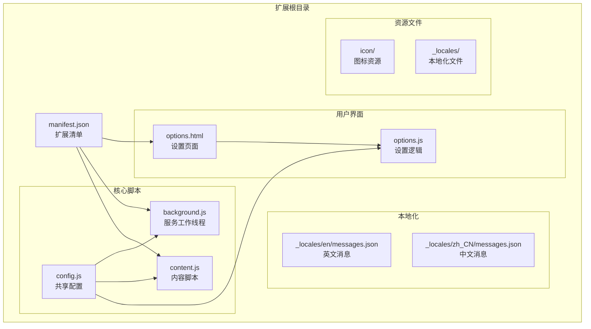
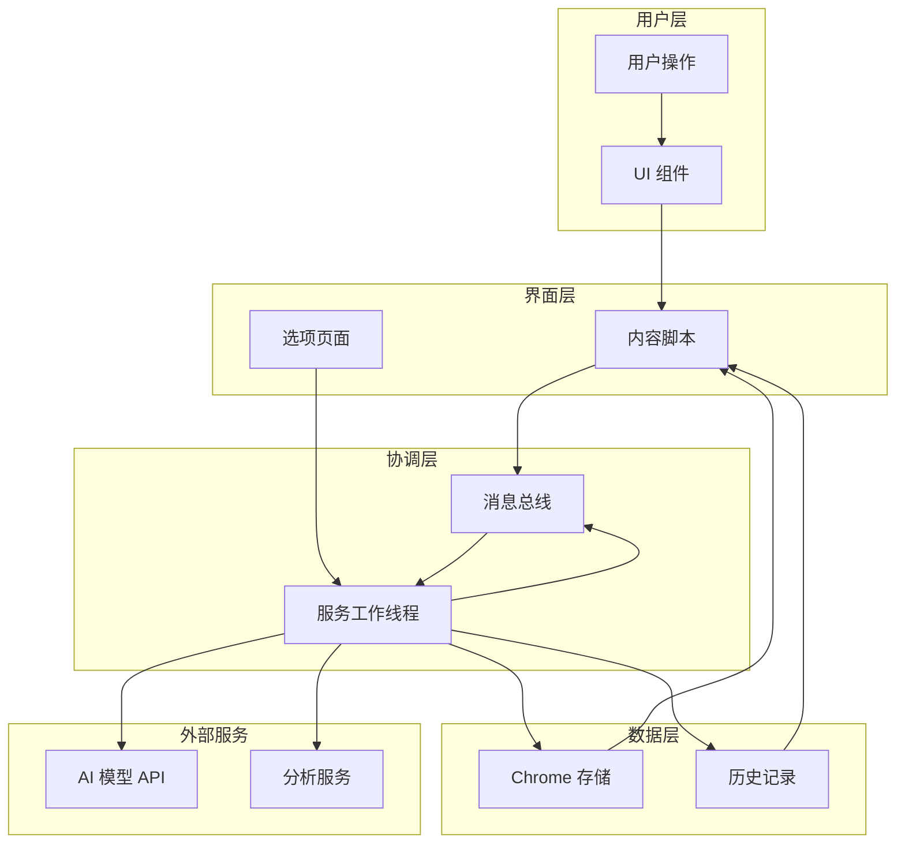
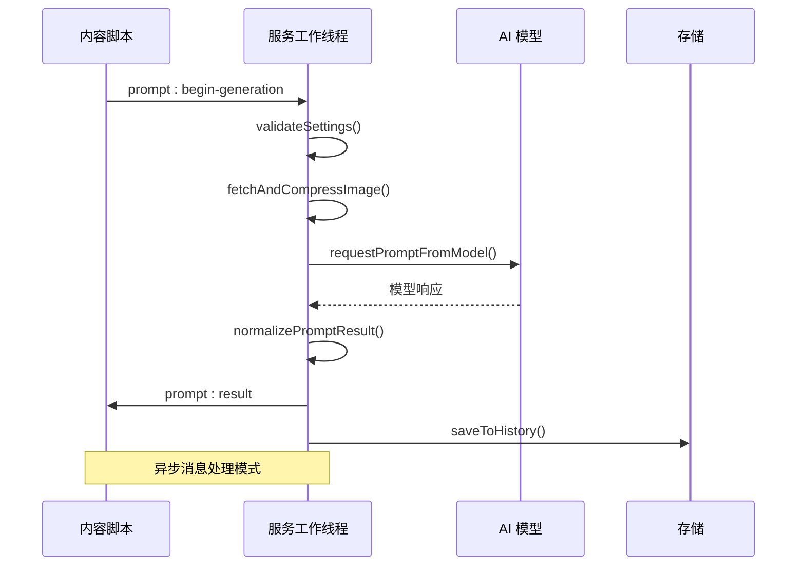
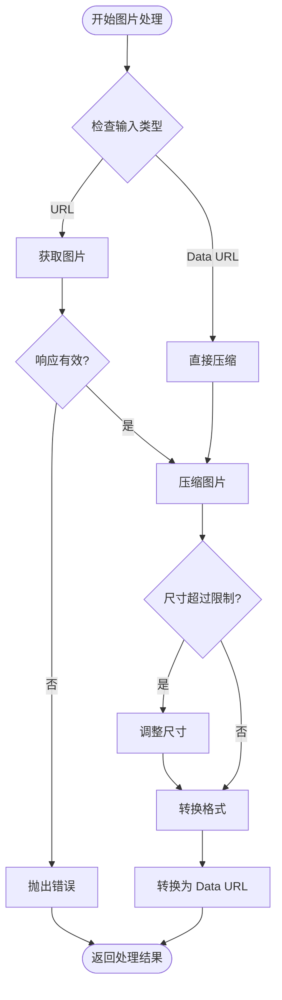
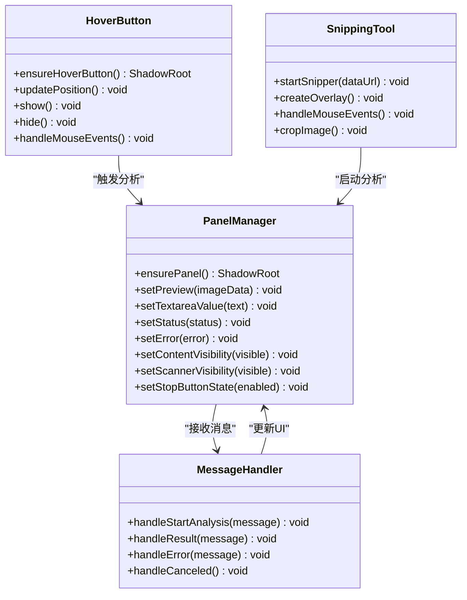
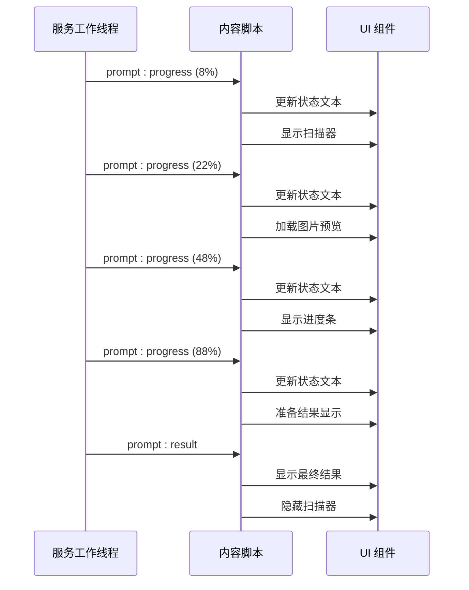
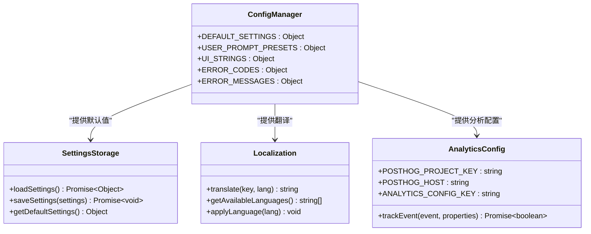
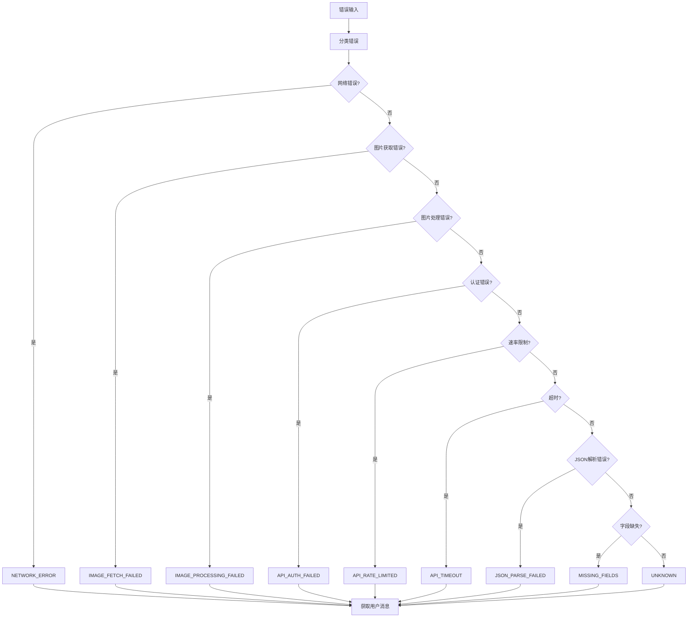
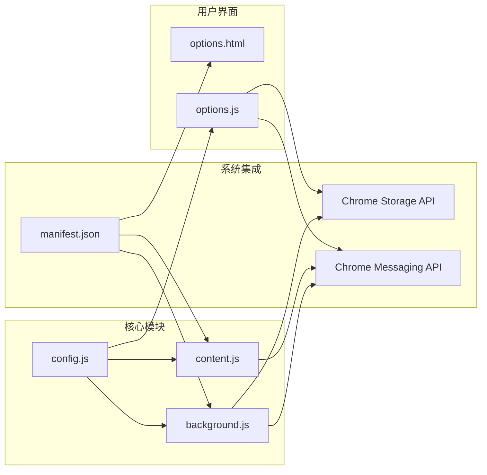
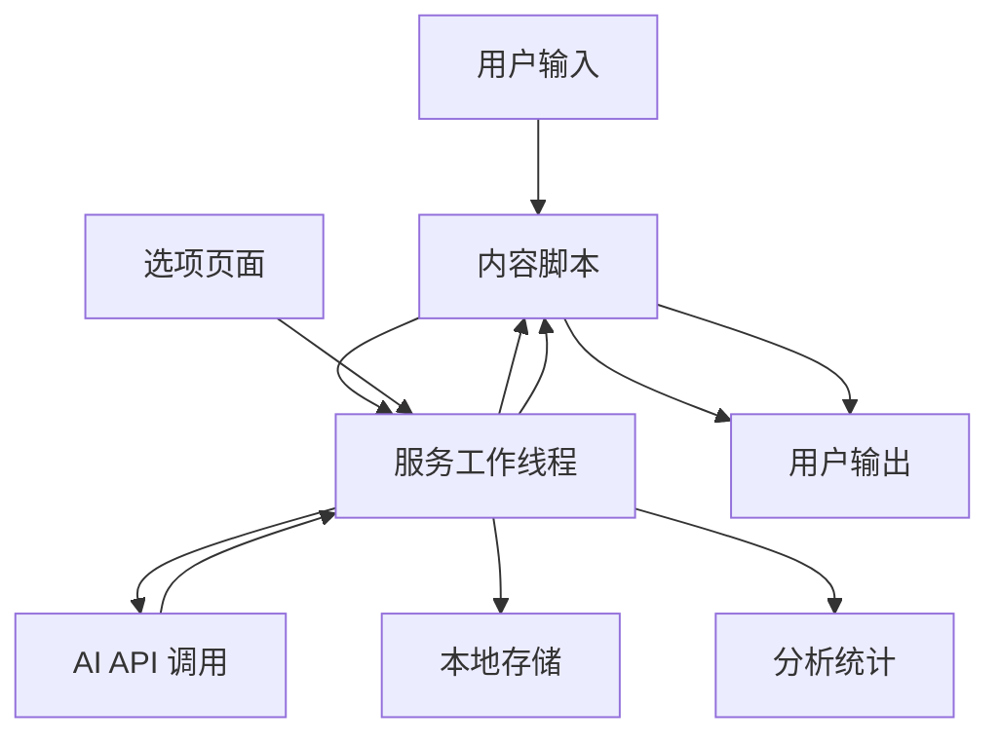

# 功能开发

<cite>
**本文档引用的文件**
- [background.js](file://background.js)
- [content.js](file://content.js)
- [config.js](file://config.js)
- [manifest.json](file://manifest.json)
- [options.js](file://options.js)
- [options.html](file://options.html)
- [_locales/en/messages.json](file://_locales/en/messages.json)
- [_locales/zh_CN/messages.json](file://_locales/zh_CN/messages.json)
</cite>

## 目录
1. [简介](#简介)
2. [项目结构](#项目结构)
3. [核心组件](#核心组件)
4. [架构概览](#架构概览)
5. [详细组件分析](#详细组件分析)
6. [依赖关系分析](#依赖关系分析)
7. [性能考虑](#性能考虑)
8. [故障排除指南](#故障排除指南)
9. [结论](#结论)
10. [附录](#附录)

## 简介

ImgPrompt 是一个 Chrome 扩展程序，能够将图片转换为 AI 提示词。该项目采用模块化架构设计，通过服务工作线程（background.js）处理后台逻辑，通过内容脚本（content.js）与网页交互，通过选项页面（options.html）提供用户配置界面。

该扩展支持多种 AI 模型，包括 OpenAI 兼容接口和 Anthropic Claude 模型，具备图片压缩、历史记录、多语言支持等功能特性。

## 项目结构

项目采用清晰的模块化组织结构：

**图表来源**
- [manifest.json:1-45](file://manifest.json#L1-L45)
- [background.js:1-50](file://background.js#L1-L50)
- [content.js:1-50](file://content.js#L1-L50)
- [config.js:1-50](file://config.js#L1-L50)

**章节来源**
- [manifest.json:1-45](file://manifest.json#L1-L45)
- [config.js:1-50](file://config.js#L1-L50)

## 核心组件

### 服务工作线程（Background）

服务工作线程是扩展的核心协调者，负责：
- 处理上下文菜单事件
- 管理图片分析流程
- 与 AI 模型 API 通信
- 处理历史记录存储
- 实现进度跟踪和错误处理

### 内容脚本（Content）

内容脚本运行在网页环境中，负责：
- 监听用户交互事件
- 管理 UI 组件显示
- 处理图片选择和预览
- 实现拖拽功能
- 管理悬停按钮

### 配置系统（Config）

共享配置系统提供：
- 默认设置和常量定义
- 用户提示词预设
- 多语言字符串
- 错误码和消息映射
- 分析统计配置

**章节来源**
- [background.js:1-100](file://background.js#L1-L100)
- [content.js:1-100](file://content.js#L1-L100)
- [config.js:1-100](file://config.js#L1-L100)

## 架构概览

扩展采用分层架构设计，各层职责明确：

**图表来源**
- [background.js:94-184](file://background.js#L94-L184)
- [content.js:209-247](file://content.js#L209-L247)
- [manifest.json:10-26](file://manifest.json#L10-L26)

## 详细组件分析

### 服务工作线程详细分析

#### 消息处理机制

服务工作线程实现了完整的消息处理系统：

**图表来源**
- [background.js:212-320](file://background.js#L212-L320)
- [content.js:289-326](file://content.js#L289-L326)

#### 图片处理流程

图片处理采用统一的压缩策略：

**图表来源**
- [background.js:775-849](file://background.js#L775-L849)

**章节来源**
- [background.js:212-320](file://background.js#L212-L320)
- [background.js:775-849](file://background.js#L775-L849)

### 内容脚本详细分析

#### UI 组件架构

内容脚本实现了复杂的 UI 组件系统：

**图表来源**
- [content.js:596-620](file://content.js#L596-L620)
- [content.js:622-725](file://content.js#L622-L725)
- [content.js:489-594](file://content.js#L489-L594)

#### 进度跟踪机制

内容脚本实现了详细的进度跟踪系统：

**图表来源**
- [content.js:220-224](file://content.js#L220-L224)
- [background.js:226-264](file://background.js#L226-L264)

**章节来源**
- [content.js:596-620](file://content.js#L596-L620)
- [content.js:622-725](file://content.js#L622-L725)
- [content.js:489-594](file://content.js#L489-L594)

### 配置系统详细分析

#### 设置管理架构

配置系统提供了灵活的设置管理机制：

**图表来源**
- [config.js:4-253](file://config.js#L4-L253)

#### 错误处理系统

错误处理系统实现了分级错误分类：

**图表来源**
- [background.js:872-945](file://background.js#L872-L945)

**章节来源**
- [config.js:4-253](file://config.js#L4-L253)
- [background.js:872-945](file://background.js#L872-L945)

## 依赖关系分析

### 模块依赖图

**图表来源**
- [manifest.json:10-26](file://manifest.json#L10-L26)
- [background.js:1-12](file://background.js#L1-L12)
- [content.js:1-4](file://content.js#L1-L4)

### 数据流分析

扩展的数据流遵循严格的单向原则：

**图表来源**
- [content.js:289-326](file://content.js#L289-L326)
- [background.js:170-184](file://background.js#L170-L184)

**章节来源**
- [manifest.json:10-26](file://manifest.json#L10-L26)
- [background.js:1-12](file://background.js#L1-L12)
- [content.js:1-4](file://content.js#L1-L4)

## 性能考虑

### 图片处理优化

扩展实现了多层图片处理优化：

1. **智能压缩策略**：根据最大边长自动调整图片尺寸
2. **格式转换优化**：使用 OffscreenCanvas 进行高效的图片转换
3. **内存管理**：及时释放 ImageBitmap 和 Canvas 资源
4. **质量平衡**：在质量和文件大小之间找到最佳平衡点

### 消息传递优化

消息传递系统采用了以下优化策略：

1. **异步处理**：所有消息处理都是异步的，避免阻塞主线程
2. **错误隔离**：每个消息处理都有独立的错误处理机制
3. **超时控制**：支持 AbortController 进行请求取消
4. **批量更新**：设置变更会批量通知所有相关组件

### 内存管理

扩展实现了严格的内存管理：

1. **资源清理**：及时清理事件监听器和定时器
2. **缓存策略**：合理使用缓存避免重复计算
3. **垃圾回收**：定期检查和清理不再使用的对象
4. **内存监控**：通过日志记录内存使用情况

## 故障排除指南

### 常见问题诊断

#### 图片处理问题

**问题症状**：图片无法正确处理或显示
**可能原因**：
- 网络连接问题
- 图片格式不受支持
- 浏览器兼容性问题

**解决方案**：
1. 检查网络连接是否正常
2. 尝试使用不同格式的图片
3. 在其他浏览器中测试扩展功能

#### AI 模型集成问题

**问题症状**：AI 调用失败或响应异常
**可能原因**：
- API 密钥配置错误
- 网络连接不稳定
- 模型参数设置不当

**解决方案**：
1. 验证 API 密钥的有效性
2. 检查 API 端点的可达性
3. 调整模型参数设置

#### UI 组件问题

**问题症状**：界面元素显示异常或功能失效
**可能原因**：
- JavaScript 错误
- CSS 样式冲突
- 浏览器兼容性问题

**解决方案**：
1. 检查浏览器控制台中的错误信息
2. 禁用其他可能冲突的扩展
3. 刷新页面重新加载组件

**章节来源**
- [background.js:872-945](file://background.js#L872-L945)
- [content.js:56-63](file://content.js#L56-L63)

## 结论

ImgPrompt 扩展展现了优秀的模块化设计和工程实践。其架构清晰、职责分离明确，为功能扩展提供了良好的基础。

主要优势包括：
- **模块化设计**：各组件职责明确，便于维护和扩展
- **异步架构**：采用异步处理避免阻塞用户体验
- **错误处理**：完善的错误分类和用户友好提示
- **性能优化**：多层优化确保流畅的用户体验

对于未来的功能扩展，建议重点关注：
1. 新 AI 模型的集成适配
2. 图片处理算法的进一步优化
3. 用户界面组件的模块化重构
4. 性能监控和分析系统的完善

## 附录

### 开发最佳实践

#### 代码组织原则

1. **单一职责原则**：每个函数和类应该有明确的职责
2. **开放封闭原则**：对扩展开放，对修改封闭
3. **里氏替换原则**：子类可以替换父类而不影响程序正确性
4. **接口隔离原则**：客户端不应该依赖不需要的接口
5. **依赖倒置原则**：高层模块不应该依赖低层模块

#### 模块化开发指南

1. **配置驱动**：将可变因素抽象为配置项
2. **接口抽象**：定义清晰的接口契约
3. **依赖注入**：通过构造函数或工厂方法注入依赖
4. **事件驱动**：使用事件机制解耦组件间通信
5. **中间件模式**：通过中间件处理横切关注点

#### 测试和调试方法

1. **单元测试**：为关键函数编写单元测试
2. **集成测试**：测试组件间的交互
3. **端到端测试**：模拟完整的用户流程
4. **性能测试**：监控关键路径的性能指标
5. **兼容性测试**：在不同浏览器和版本中验证功能

#### 性能优化建议

1. **懒加载**：按需加载非关键资源
2. **缓存策略**：合理使用缓存减少重复计算
3. **异步处理**：将耗时操作移至后台线程
4. **内存管理**：及时清理不再使用的资源
5. **网络优化**：合并请求和使用合适的缓存头