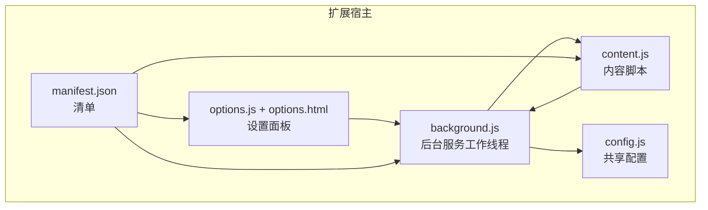
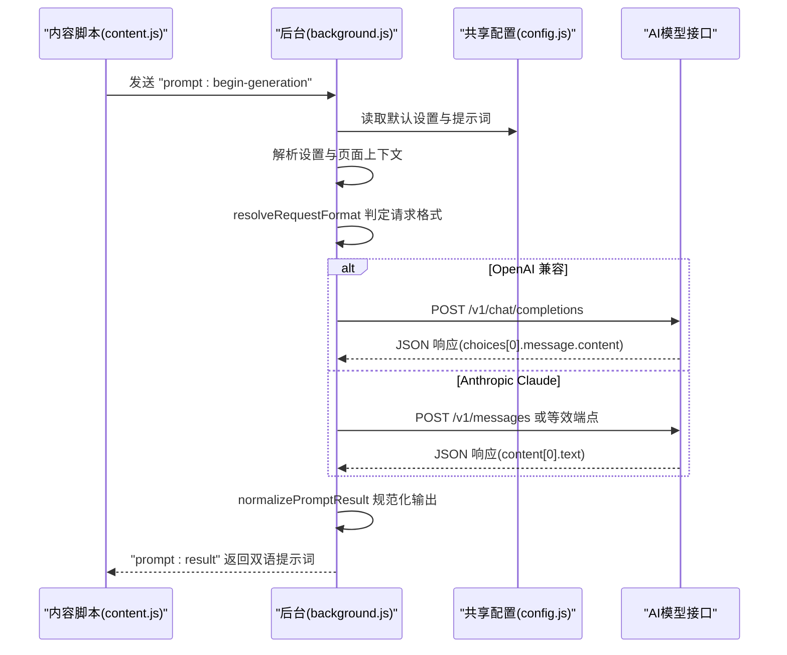
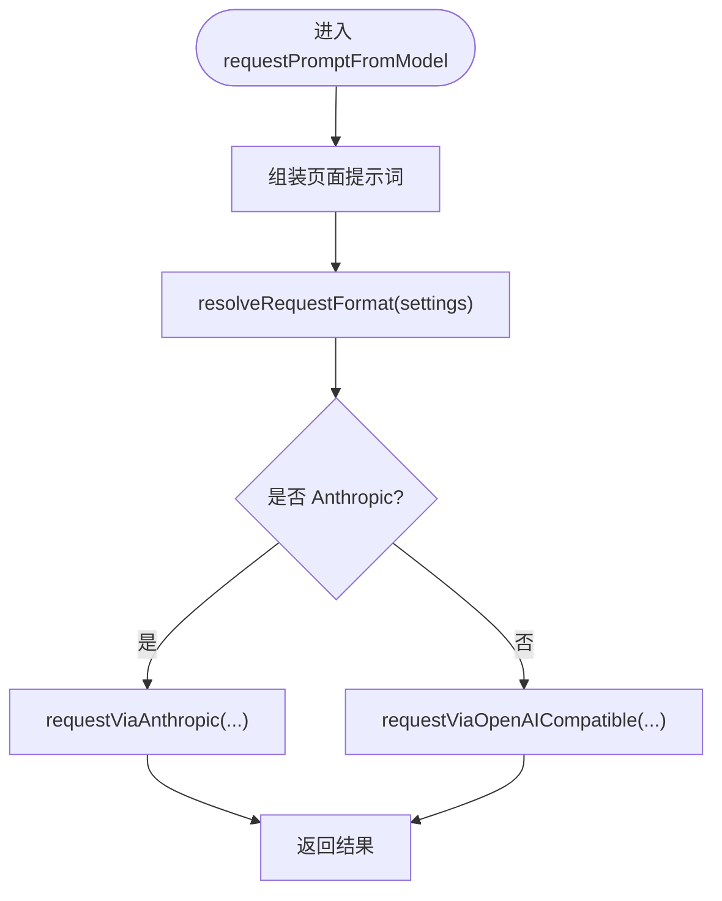
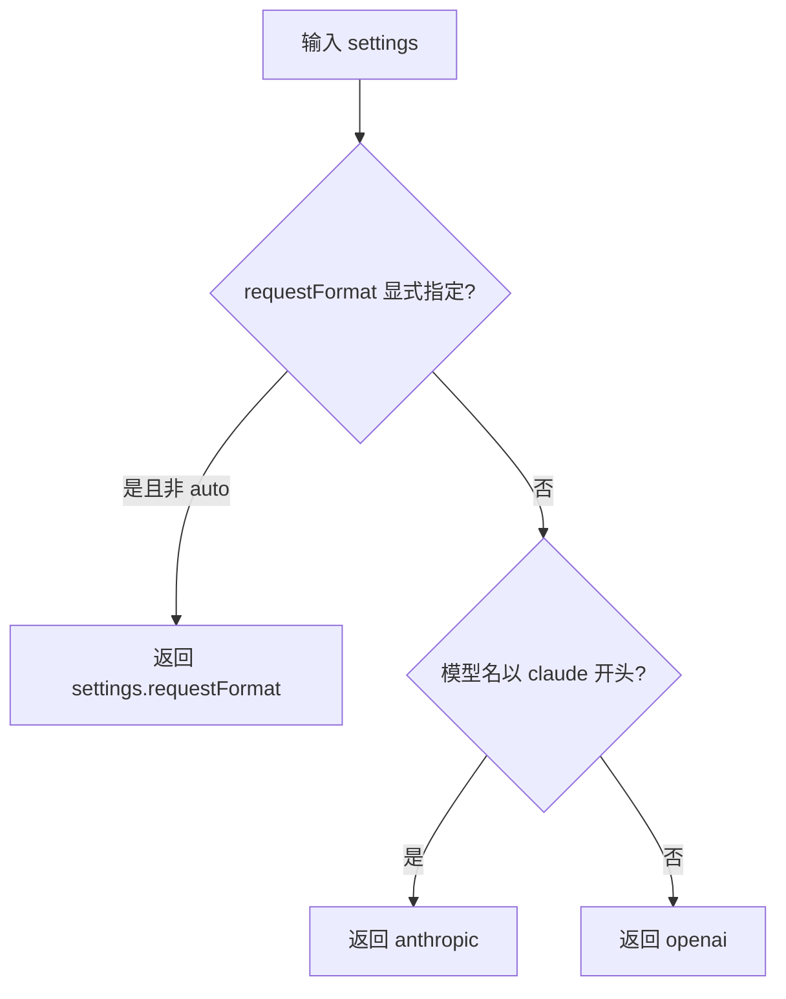
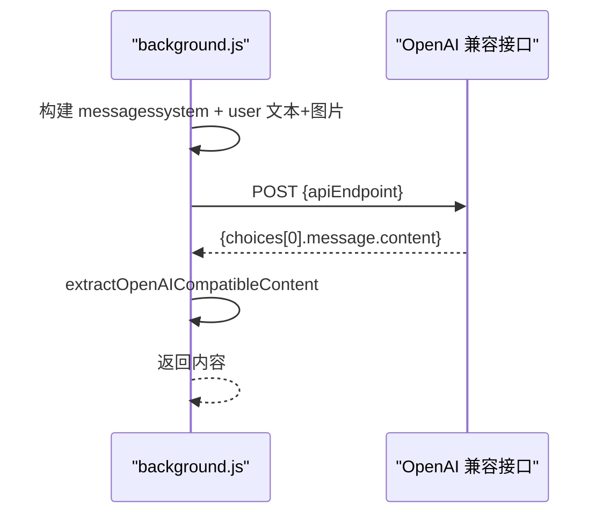
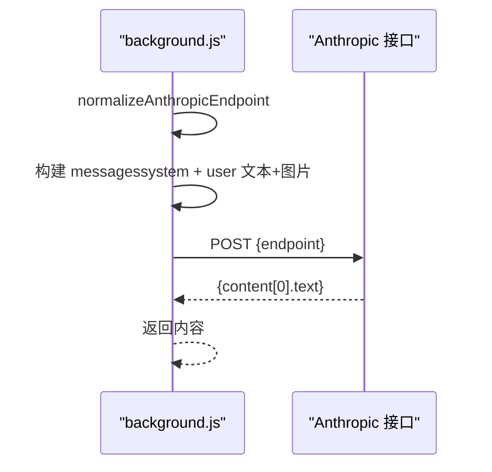
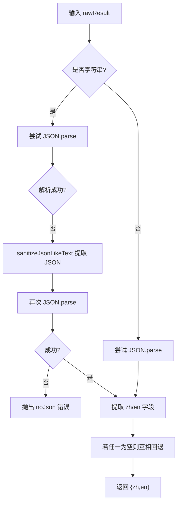
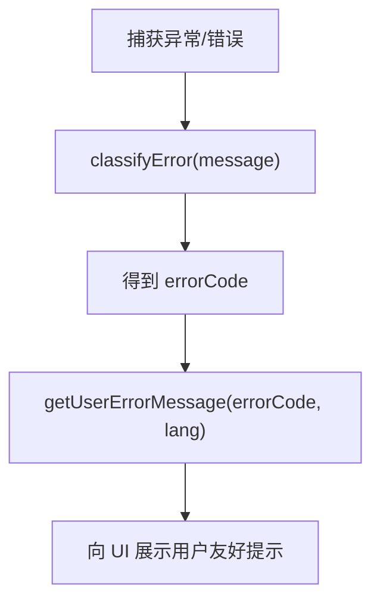
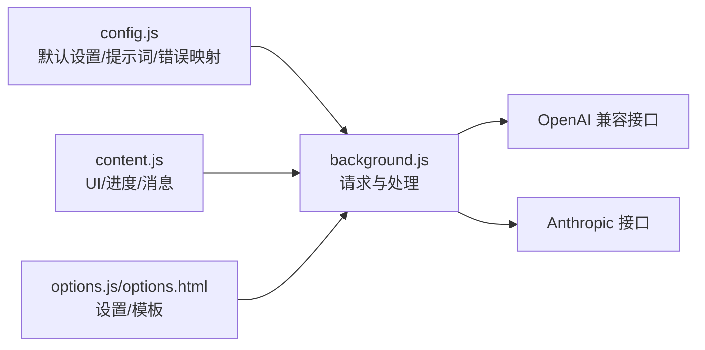

# AI模型集成

<cite>
**本文引用的文件**
- [background.js](file://background.js)
- [content.js](file://content.js)
- [config.js](file://config.js)
- [manifest.json](file://manifest.json)
- [options.js](file://options.js)
- [options.html](file://options.html)
</cite>

## 目录
1. [简介](#简介)
2. [项目结构](#项目结构)
3. [核心组件](#核心组件)
4. [架构总览](#架构总览)
5. [详细组件分析](#详细组件分析)
6. [依赖关系分析](#依赖关系分析)
7. [性能考量](#性能考量)
8. [故障排查指南](#故障排查指南)
9. [结论](#结论)
10. [附录](#附录)

## 简介
本指南聚焦 Img2Prompt 扩展的 AI 模型集成功能，围绕以下关键点展开：
- requestPromptFromModel 函数的实现与流程
- 模型格式解析与请求格式选择逻辑 resolveRequestFormat
- OpenAI 兼容接口与 Anthropic Claude 接口的差异化实现
- 请求体构建、请求头设置、响应处理
- 自动模型检测机制与扩展新模型支持的方法
- 错误分类与用户友好提示
- 性能优化建议与最佳实践

## 项目结构
该扩展采用 Manifest V3 架构，主要由后台脚本、内容脚本、选项页面与共享配置组成。核心 AI 集成逻辑集中在后台脚本中，内容脚本负责 UI 与进度反馈，选项页面负责用户配置与提示词模板管理。

图表来源
- [manifest.json:1-45](file://manifest.json#L1-L45)
- [background.js:1-120](file://background.js#L1-L120)
- [content.js:1-120](file://content.js#L1-L120)
- [options.js:1-60](file://options.js#L1-L60)
- [config.js:1-40](file://config.js#L1-L40)

章节来源
- [manifest.json:1-45](file://manifest.json#L1-L45)
- [background.js:1-120](file://background.js#L1-L120)
- [content.js:1-120](file://content.js#L1-L120)
- [options.js:1-60](file://options.js#L1-L60)
- [config.js:1-40](file://config.js#L1-L40)

## 核心组件
- requestPromptFromModel：统一入口，根据模型名称与设置决定走 OpenAI 兼容还是 Anthropic Claude 接口，并返回标准化提示词文本。
- resolveRequestFormat：自动模型检测，基于模型名前缀或显式设置判定请求格式。
- requestViaOpenAICompatible：构建 OpenAI 兼容风格的消息结构，发送请求并解析响应。
- requestViaAnthropic：构建 Anthropic 风格的消息结构，发送请求并解析响应。
- normalizePromptResult：将模型返回的原始内容规范化为 zh/en 双语提示词对象。
- 错误分类与用户提示：classifyError 与 getUserErrorMessage 提供一致的错误映射与本地化消息。

章节来源
- [background.js:478-515](file://background.js#L478-L515)
- [background.js:517-592](file://background.js#L517-L592)
- [background.js:594-666](file://background.js#L594-L666)
- [background.js:695-726](file://background.js#L695-L726)
- [background.js:872-945](file://background.js#L872-L945)

## 架构总览
下图展示了从内容脚本触发到后台脚本执行模型请求与结果归一化的端到端流程。

图表来源
- [content.js:289-326](file://content.js#L289-L326)
- [background.js:212-320](file://background.js#L212-L320)
- [background.js:478-515](file://background.js#L478-L515)
- [background.js:517-592](file://background.js#L517-L592)
- [background.js:594-666](file://background.js#L594-L666)
- [background.js:695-726](file://background.js#L695-L726)

## 详细组件分析

### requestPromptFromModel：统一请求入口
- 输入：settings、imageInput、pageContext、signal
- 处理：
  - 组装页面提示词（alt/title/url）
  - resolveRequestFormat 决定 OpenAI 兼容或 Anthropic
  - 调用对应接口函数
- 输出：标准化提示词字符串

图表来源
- [background.js:478-515](file://background.js#L478-L515)
- [background.js:517-592](file://background.js#L517-L592)
- [background.js:594-666](file://background.js#L594-L666)

章节来源
- [background.js:478-515](file://background.js#L478-L515)

### resolveRequestFormat：自动模型检测机制
- 优先级：
  - settings.requestFormat 显式指定且非 "auto"
  - 模型名以 "claude" 开头 → Anthropic
  - 默认 → OpenAI 兼容
- 作用：为后续请求体构建与端点适配提供依据

图表来源
- [background.js:505-515](file://background.js#L505-L515)

章节来源
- [background.js:505-515](file://background.js#L505-L515)

### OpenAI 兼容接口实现：requestViaOpenAICompatible
- 请求体要点：
  - model、temperature
  - messages：system + user（含 text 与 image_url）
- 请求头：
  - Content-Type: application/json
  - Authorization: Bearer {apiKey}
- 响应处理：
  - 校验状态码并给出用户友好错误
  - 使用 extractOpenAICompatibleContent 提取内容
  - 若为空则抛出“内容为空”错误

图表来源
- [background.js:517-592](file://background.js#L517-L592)
- [background.js:728-753](file://background.js#L728-L753)

章节来源
- [background.js:517-592](file://background.js#L517-L592)
- [background.js:728-753](file://background.js#L728-L753)

### Anthropic Claude 接口实现：requestViaAnthropic
- 端点适配：
  - normalizeAnthropicEndpoint 将 /v1/chat/completions 转换为 /v1/messages
- 请求体要点：
  - model、system、max_tokens、temperature
  - messages：user（含 text 与 image 对象）
- 请求头：
  - Content-Type: application/json
  - x-api-key: {apiKey}
  - anthropic-version: {settings.anthropicVersion || 默认}
- 响应处理：
  - 校验状态码并给出用户友好错误
  - 从 payload.content 中提取第一个 text 块

图表来源
- [background.js:594-666](file://background.js#L594-L666)
- [background.js:668-676](file://background.js#L668-L676)
- [background.js:678-693](file://background.js#L678-L693)

章节来源
- [background.js:594-666](file://background.js#L594-L666)
- [background.js:668-676](file://background.js#L668-L676)
- [background.js:678-693](file://background.js#L678-L693)

### 请求体构建与头部设置对比
- OpenAI 兼容
  - 头部：Authorization: Bearer {apiKey}
  - 消息结构：messages 数组，首条为 system，第二条为 user，其中 user.content 支持 text 与 image_url
- Anthropic
  - 头部：x-api-key: {apiKey}；anthropic-version: {版本}
  - 消息结构：messages 数组，user.content 支持 text 与 image 对象（base64）

章节来源
- [background.js:552-560](file://background.js#L552-L560)
- [background.js:604-633](file://background.js#L604-L633)
- [background.js:668-676](file://background.js#L668-L676)
- [background.js:678-693](file://background.js#L678-L693)

### 响应处理与结果规范化：normalizePromptResult
- 输入：原始字符串或 JSON
- 处理：
  - 若为字符串，尝试 JSON.parse；若失败，尝试从类似 JSON 的文本中提取 JSON 片段
  - 提取 zh 与 en 字段，若均为空则报错
- 输出：{ zh, en } 对象，缺失的一方回退到另一方

图表来源
- [background.js:695-726](file://background.js#L695-L726)
- [background.js:755-773](file://background.js#L755-L773)

章节来源
- [background.js:695-726](file://background.js#L695-L726)
- [background.js:755-773](file://background.js#L755-L773)

### 错误分类与用户提示：classifyError 与 getUserErrorMessage
- classifyError：基于错误信息关键词与状态码进行分类，覆盖网络、鉴权、速率限制、超时、JSON 解析、字段缺失、API 异常等
- getUserErrorMessage：按 UI 语言返回本地化错误消息

图表来源
- [background.js:872-945](file://background.js#L872-L945)
- [config.js:206-247](file://config.js#L206-L247)

章节来源
- [background.js:872-945](file://background.js#L872-L945)
- [config.js:206-247](file://config.js#L206-L247)

### 扩展新模型支持指南
- 新增模型类型步骤
  1) 在设置中添加新模型前缀或别名（如 "llama"），并在 resolveRequestFormat 中加入识别逻辑
  2) 如需特殊请求体或端点，新增一个 requestViaXXX 函数，遵循现有模式（请求体、头部、响应解析）
  3) 在 requestPromptFromModel 中增加分支，调用新函数
  4) 在 normalizePromptResult 中确保能正确提取目标字段
  5) 在 UI 与错误映射中补充必要的提示与本地化文案
- 端点适配
  - 若与 OpenAI 兼容，复用 requestViaOpenAICompatible 即可
  - 若需要不同端点或头部，参考 requestViaAnthropic 的端点转换与头部设置
- 参数与约束
  - 注意不同模型对图片输入格式的要求（Anthropic 需要 base64）
  - 注意温度、最大 token 等参数差异
  - 注意响应结构差异（choices vs content）

章节来源
- [background.js:478-515](file://background.js#L478-L515)
- [background.js:517-592](file://background.js#L517-L592)
- [background.js:594-666](file://background.js#L594-L666)
- [background.js:695-726](file://background.js#L695-L726)

## 依赖关系分析
- 耦合与内聚
  - requestPromptFromModel 作为门面，内聚地封装了 OpenAI 与 Anthropic 的差异
  - resolveRequestFormat 与具体实现解耦，便于扩展
  - normalizePromptResult 与模型无关，保证输出一致性
- 外部依赖
  - fetch API 用于 HTTP 请求
  - Chrome Extension APIs 用于存储、消息传递、侧边栏等

图表来源
- [config.js:1-253](file://config.js#L1-L253)
- [background.js:478-666](file://background.js#L478-L666)
- [content.js:289-326](file://content.js#L289-L326)
- [options.js:182-216](file://options.js#L182-L216)

章节来源
- [config.js:1-253](file://config.js#L1-L253)
- [background.js:478-666](file://background.js#L478-L666)
- [content.js:289-326](file://content.js#L289-L326)
- [options.js:182-216](file://options.js#L182-L216)

## 性能考量
- 图像压缩
  - 在后台统一进行图像获取与压缩，避免重复传输大图
  - 基于最长边阈值与 JPEG 质量进行压缩，减少请求体积
- 请求并发与取消
  - 使用 AbortController 支持取消生成，避免资源浪费
- 错误快速失败
  - 对 4xx/5xx 状态码与空内容进行快速错误分类与提示
- UI 进度与阶段提示
  - 将耗时过程拆分为多个阶段，提升用户体验

章节来源
- [background.js:238-243](file://background.js#L238-L243)
- [background.js:815-849](file://background.js#L815-L849)
- [background.js:122-132](file://background.js#L122-L132)
- [background.js:851-859](file://background.js#L851-L859)

## 故障排查指南
- 常见错误与定位
  - 认证失败：检查 API Key 是否正确，或接口是否需要不同头部
  - 速率限制：适当降低温度或减少并发请求
  - 超时：降低图片分辨率或更换更稳定的端点
  - JSON 解析失败：确保 system prompt 严格返回 JSON 结构
  - 内容为空：检查模型是否支持图片输入或返回结构
- 用户提示映射
  - 使用 classifyError 与 getUserErrorMessage 获取本地化提示
- 日志与诊断
  - 在后台记录请求 ID、模型、耗时、错误码，辅助问题定位

章节来源
- [background.js:872-945](file://background.js#L872-L945)
- [config.js:206-247](file://config.js#L206-L247)

## 结论
本扩展通过统一的请求入口与自动模型检测，实现了对 OpenAI 兼容与 Anthropic Claude 的无缝适配。其清晰的职责分离与一致的结果规范化，使得扩展新模型变得简单可控。配合完善的错误分类与本地化提示，能够在复杂多变的外部接口环境中保持稳定与易用。

## 附录
- 设置项与提示词模板
  - 默认设置、用户提示词预设、UI 语言与错误映射均集中于 config.js
  - 选项页面提供可视化配置与历史记录管理

章节来源
- [config.js:4-204](file://config.js#L4-L204)
- [options.js:182-216](file://options.js#L182-L216)
- [options.html:484-687](file://options.html#L484-L687)