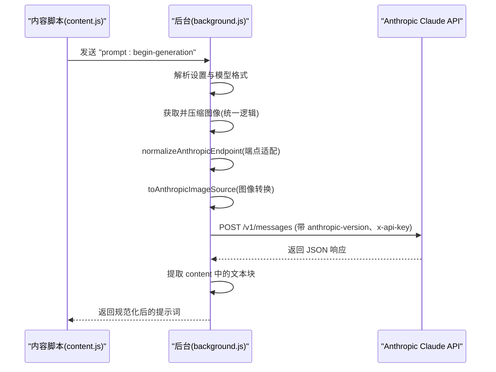
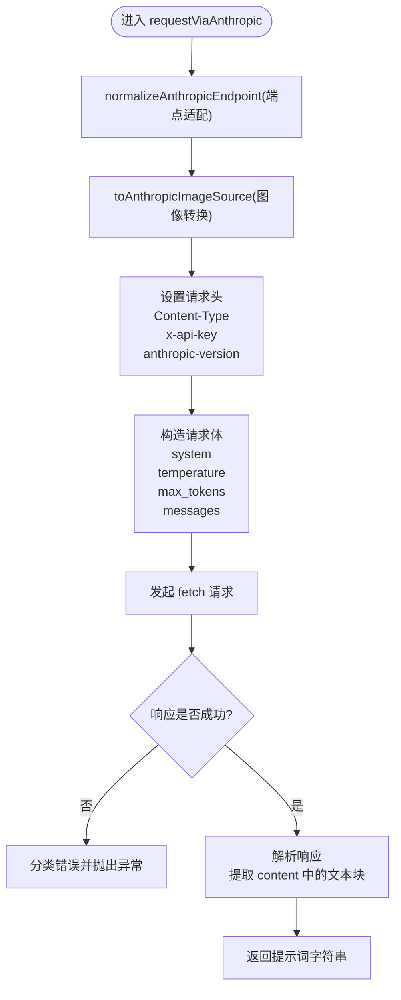
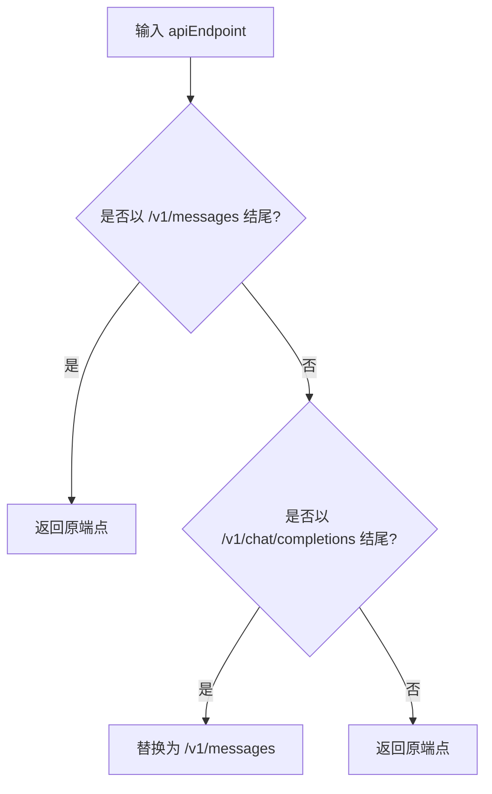
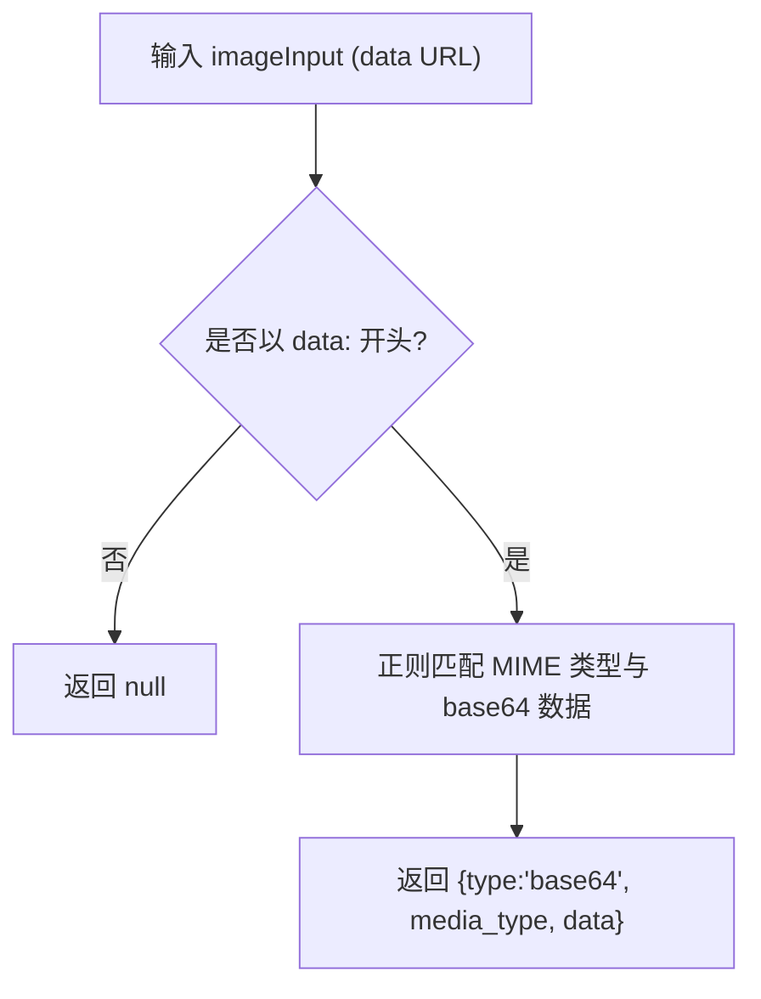
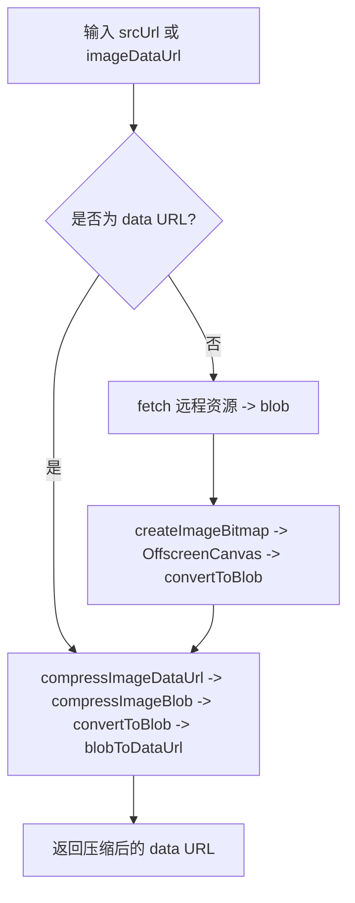
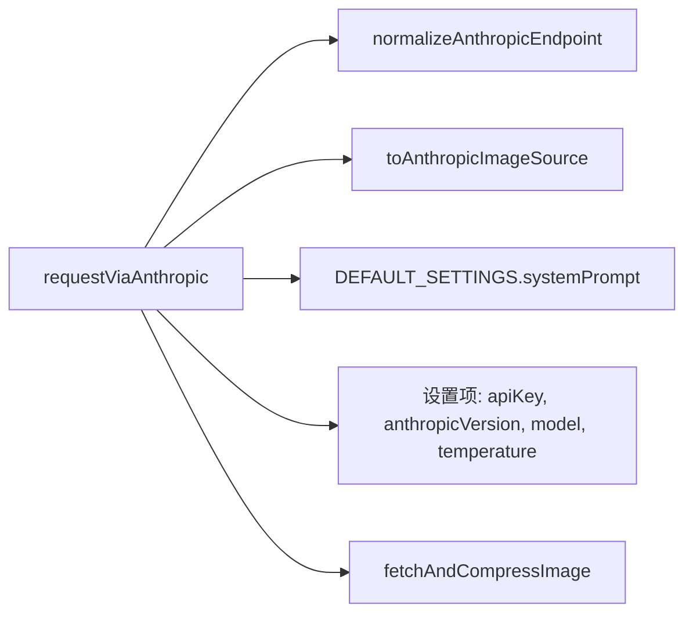

# Anthropic Claude 接口集成

<cite>
**本文档引用的文件**
- [background.js](file://background.js)
- [config.js](file://config.js)
- [content.js](file://content.js)
- [options.html](file://options.html)
- [options.js](file://options.js)
- [manifest.json](file://manifest.json)
</cite>

## 目录
1. [简介](#简介)
2. [项目结构](#项目结构)
3. [核心组件](#核心组件)
4. [架构总览](#架构总览)
5. [详细组件分析](#详细组件分析)
6. [依赖关系分析](#依赖关系分析)
7. [性能考量](#性能考量)
8. [故障排查指南](#故障排查指南)
9. [结论](#结论)

## 简介
本文件面向 Img2Prompt 扩展中与 Anthropic Claude 接口的集成，聚焦于以下函数与流程：
- requestViaAnthropic：Claude 请求主流程，含端点标准化、图像数据格式转换、请求头配置、响应解析与错误分类。
- normalizeAnthropicEndpoint：端点适配逻辑，确保使用 Claude 的消息接口。
- toAnthropicImageSource：将 data URL 图像转换为 Claude 所需的 base64 图像源对象。
- Anthropic 特有参数：anthropic-version 头部、max_tokens 限制、system prompt 使用。
- 配置与兼容性：如何配置 Claude API 端点、不同版本 API 的兼容、图像传输优化。
- 错误处理与性能优化建议。

## 项目结构
扩展采用 Manifest V3 架构，主要模块如下：
- background.js：后台服务工作线程，负责发起模型请求、进度通知、错误分类与存储。
- content.js：内容脚本，负责 UI 交互、生成流程控制、与后台通信。
- config.js：共享配置，包含默认设置、提示词模板、UI 文案与错误码。
- options.html/js：设置面板，管理 API 端点、模型、密钥、温度、分辨率等。
- manifest.json：声明扩展元信息、权限与后台脚本。

```mermaid
graph TB
subgraph "扩展"
BG["background.js<br/>后台服务工作线程"]
CT["content.js<br/>内容脚本"]
CFG["config.js<br/>共享配置"]
OPT_HTML["options.html<br/>设置面板视图"]
OPT_JS["options.js<br/>设置面板逻辑"]
MAN["manifest.json<br/>清单文件"]
end
subgraph "模型服务"
CLAUDE["Anthropic Claude API"]
end
CT --> BG
BG --> CLAUDE
CT <- --> OPT_HTML
OPT_HTML --> OPT_JS
OPT_JS --> CT
CT --> CFG
BG --> CFG
MAN --> BG
MAN --> CT
```

图表来源
- [background.js:1-184](file://background.js#L1-L184)
- [content.js:1-120](file://content.js#L1-L120)
- [config.js:1-253](file://config.js#L1-L253)
- [options.html:1-120](file://options.html#L1-L120)
- [options.js:1-120](file://options.js#L1-L120)
- [manifest.json:1-45](file://manifest.json#L1-L45)

章节来源
- [background.js:1-184](file://background.js#L1-L184)
- [content.js:1-120](file://content.js#L1-L120)
- [config.js:1-253](file://config.js#L1-L253)
- [options.html:1-120](file://options.html#L1-L120)
- [options.js:1-120](file://options.js#L1-L120)
- [manifest.json:1-45](file://manifest.json#L1-L45)

## 核心组件
- requestViaAnthropic：Claude 请求主流程，负责端点标准化、图像数据转换、请求头设置、请求体构造、响应解析与错误分类。
- normalizeAnthropicEndpoint：将传入的 API 端点适配为 Claude 的消息接口路径。
- toAnthropicImageSource：将 data URL 图像转换为 Claude 所需的 base64 图像源对象。
- requestPromptFromModel：根据模型前缀自动选择 Claude 或 OpenAI 兼容请求路径。
- resolveRequestFormat：基于模型名自动识别 Claude 请求格式。
- 图像压缩与传输：统一的图像获取与压缩逻辑，确保 Claude 所需的 base64 数据。

章节来源
- [background.js:478-666](file://background.js#L478-L666)
- [background.js:668-693](file://background.js#L668-L693)
- [background.js:775-849](file://background.js#L775-L849)
- [background.js:505-515](file://background.js#L505-L515)

## 架构总览
下图展示了从内容脚本触发到 Claude API 的完整调用链路，以及关键的数据与参数转换。



图表来源
- [background.js:212-320](file://background.js#L212-L320)
- [background.js:478-666](file://background.js#L478-L666)
- [background.js:668-693](file://background.js#L668-L693)
- [background.js:775-849](file://background.js#L775-L849)

## 详细组件分析

### requestViaAnthropic 函数实现
该函数是 Claude 接口的核心入口，负责：
- 端点标准化：通过 normalizeAnthropicEndpoint 将传入端点转换为 Claude 的消息接口路径。
- 图像数据转换：通过 toAnthropicImageSource 将 data URL 转换为 Claude 所需的 base64 图像源对象。
- 请求头配置：设置 Content-Type、x-api-key、anthropic-version。
- 请求体构造：包含 system prompt、temperature、max_tokens、messages（用户角色 + 文本 + 图像）。
- 响应解析：从 content 数组中提取第一个类型为 text 的块作为最终提示词。
- 错误处理：对 401/403/429/5xx 等状态码进行分类，并返回用户友好错误信息。



图表来源
- [background.js:594-666](file://background.js#L594-L666)
- [background.js:668-693](file://background.js#L668-L693)

章节来源
- [background.js:594-666](file://background.js#L594-L666)

### normalizeAnthropicEndpoint 端点适配逻辑
该函数确保传入的 API 端点最终指向 Claude 的消息接口：
- 若以 /v1/messages 结尾，则保持不变。
- 若以 /v1/chat/completions 结尾，则替换为 /v1/messages。
- 否则保持原样。



图表来源
- [background.js:668-676](file://background.js#L668-L676)

章节来源
- [background.js:668-676](file://background.js#L668-L676)

### toAnthropicImageSource base64 数据转换机制
该函数将 data URL 图像转换为 Claude 所需的 base64 图像源对象：
- 仅当输入为以 data: 开头的字符串时才处理。
- 使用正则匹配 data URI 的 MIME 类型与 base64 数据。
- 返回包含 type、media_type、data 的对象，供 Claude 请求体使用。



图表来源
- [background.js:678-693](file://background.js#L678-L693)

章节来源
- [background.js:678-693](file://background.js#L678-L693)

### Anthropic API 特有参数设置
- anthropic-version 头部：默认使用 2023-06-01，可在设置中覆盖。
- max_tokens 限制：固定为 1400，避免过长响应与成本问题。
- system prompt：使用全局默认 system prompt，确保输出结构化 JSON。
- x-api-key：通过 Authorization 头传递，与 Claude API 规范一致。

章节来源
- [background.js:594-666](file://background.js#L594-L666)
- [config.js:5-20](file://config.js#L5-L20)

### 请求格式与模型识别
- resolveRequestFormat：若 requestFormat 显式指定则使用；否则若模型名以 claude 开头则走 Anthropic 流程。
- requestPromptFromModel：根据格式选择 requestViaAnthropic 或 requestViaOpenAICompatible。

章节来源
- [background.js:505-515](file://background.js#L505-L515)
- [background.js:478-503](file://background.js#L478-L503)

### 图像数据获取与压缩
- 统一入口：processGeneration 在后台统一执行图像获取与压缩。
- 支持 data URL 与远程 URL：若为 data URL 则直接压缩；否则先拉取再压缩。
- 压缩策略：按最大边限制缩放，转为 JPEG，质量约 0.92，最后转为 data URL。



图表来源
- [background.js:775-849](file://background.js#L775-L849)

章节来源
- [background.js:775-849](file://background.js#L775-L849)

## 依赖关系分析
- requestViaAnthropic 依赖：
  - normalizeAnthropicEndpoint：端点适配。
  - toAnthropicImageSource：图像数据转换。
  - 全局默认 system prompt：来自 config.js。
  - 设置项：apiKey、anthropicVersion、model、temperature、maxImageEdge。
- 图像处理依赖：
  - fetchAndCompressImage：统一图像获取与压缩。
  - createImageBitmap、OffscreenCanvas、convertToBlob、FileReader：浏览器 API。



图表来源
- [background.js:594-666](file://background.js#L594-L666)
- [background.js:668-693](file://background.js#L668-L693)
- [config.js:5-20](file://config.js#L5-L20)
- [background.js:775-849](file://background.js#L775-L849)

章节来源
- [background.js:594-666](file://background.js#L594-L666)
- [background.js:668-693](file://background.js#L668-L693)
- [config.js:5-20](file://config.js#L5-L20)
- [background.js:775-849](file://background.js#L775-L849)

## 性能考量
- 图像压缩：通过最大边限制与 JPEG 质量控制，显著减少请求体大小，提高成功率与速度。
- 请求头与参数：固定 anthropic-version 与 max_tokens，避免不必要的重试与超时。
- 取消机制：AbortController 支持取消请求，避免长时间占用。
- 错误分类：快速识别网络、鉴权、限流、超时等问题，减少无效重试。

章节来源
- [background.js:218-320](file://background.js#L218-L320)
- [background.js:872-945](file://background.js#L872-L945)

## 故障排查指南
- 认证失败（401/403）
  - 检查 API Key 是否正确，确认 x-api-key 头是否设置。
  - 章节来源
    - [background.js:635-654](file://background.js#L635-L654)
- 调用次数超限（429）
  - 降低请求频率或提升配额；检查错误分类。
  - 章节来源
    - [background.js:896-910](file://background.js#L896-L910)
- 服务器错误（5xx）
  - 稍后重试或更换端点；检查端点适配是否正确。
  - 章节来源
    - [background.js:647-649](file://background.js#L647-L649)
- 图像处理失败
  - 确认图像可访问且为图片类型；检查 data URL 格式。
  - 章节来源
    - [background.js:785-807](file://background.js#L785-L807)
- 端点不兼容
  - 使用 /v1/messages 或自动适配；避免使用 /v1/chat/completions。
  - 章节来源
    - [background.js:668-676](file://background.js#L668-L676)

## 结论
Img2Prompt 对 Anthropic Claude 的集成通过清晰的端点适配、严格的图像数据转换与稳健的错误分类，实现了稳定高效的图片提示词生成能力。配合统一的图像压缩与请求参数控制，能够在保证质量的同时提升性能与可靠性。建议在生产环境中：
- 明确配置 anthropic-version 与 max_tokens，避免不必要的变更。
- 使用统一的端点适配逻辑，避免路径差异导致的 400 错误。
- 结合设置面板的分辨率限制，持续优化图像体积与响应时间。
- 建立完善的日志与错误上报，便于快速定位问题。