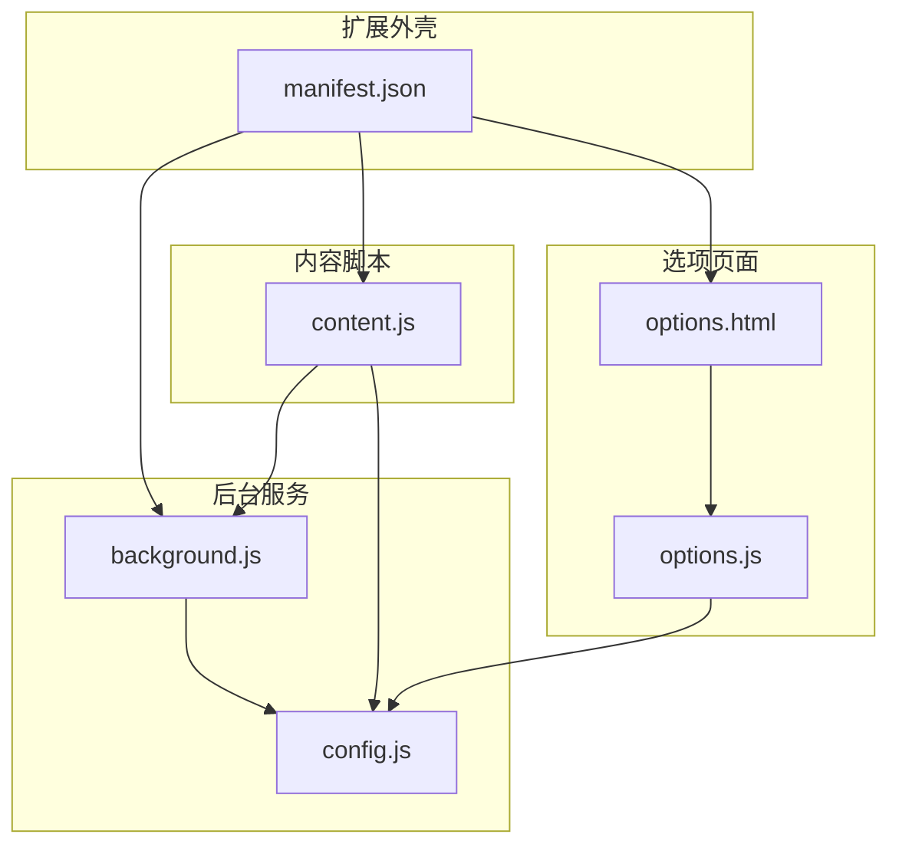
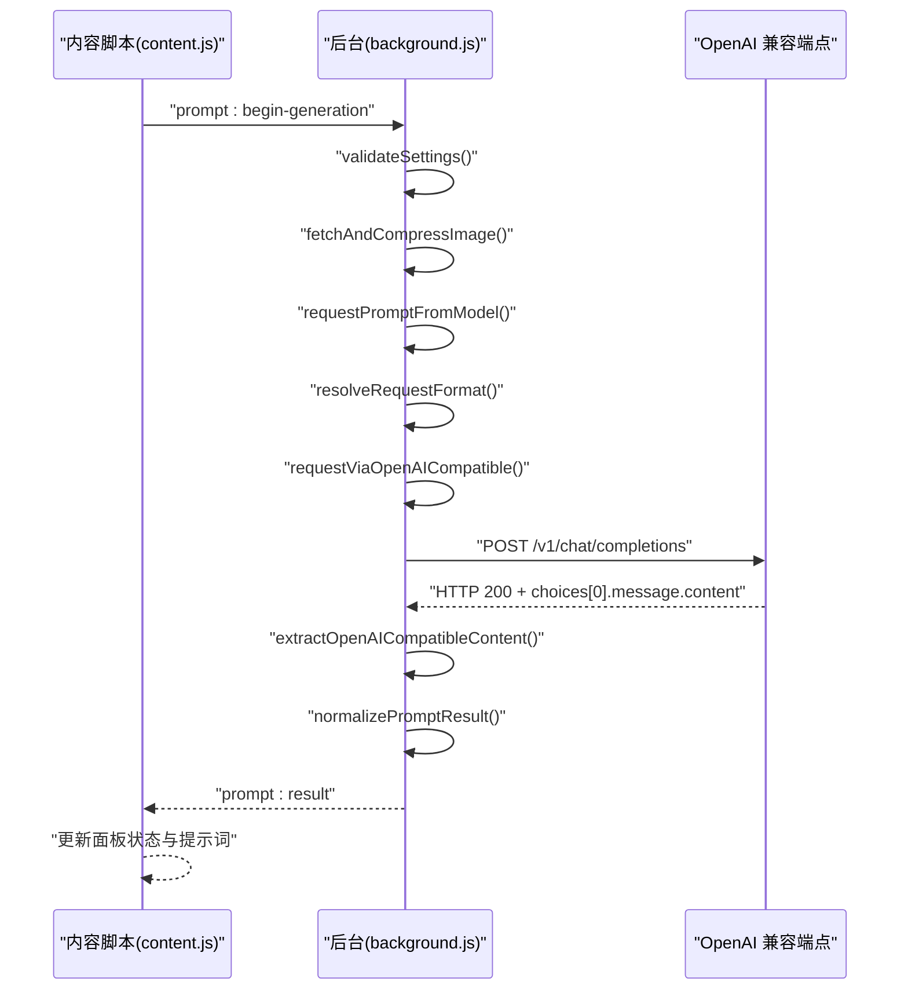
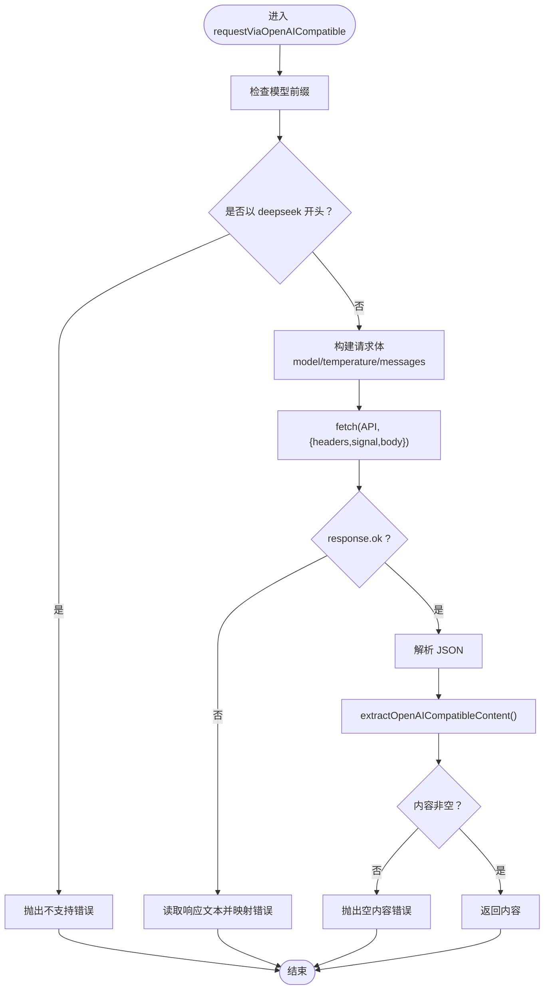
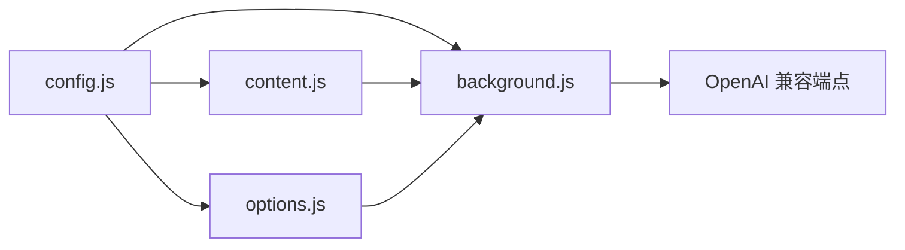

# OpenAI 兼容接口集成

<cite>
**本文引用的文件**
- [background.js](file://background.js)
- [content.js](file://content.js)
- [config.js](file://config.js)
- [manifest.json](file://manifest.json)
- [options.html](file://options.html)
- [options.js](file://options.js)
</cite>

## 目录
1. [简介](#简介)
2. [项目结构](#项目结构)
3. [核心组件](#核心组件)
4. [架构总览](#架构总览)
5. [详细组件分析](#详细组件分析)
6. [依赖关系分析](#依赖关系分析)
7. [性能考量](#性能考量)
8. [故障排查指南](#故障排查指南)
9. [结论](#结论)
10. [附录](#附录)

## 简介
本文件面向 Img2Prompt 扩展的 OpenAI 兼容接口集成，聚焦 requestViaOpenAICompatible 函数的实现细节与周边流程，涵盖：
- 请求体构建逻辑与消息格式设计
- 温度参数设置与模型适配
- 支持与不支持的模型类型及其原因与处理策略
- 请求头设置、超时控制机制与错误处理策略
- 不同 OpenAI 兼容端点的配置方法与模型特定参数差异
- 性能优化建议与常见问题排查

## 项目结构
该扩展采用 Manifest V3 架构，主要由后台脚本、内容脚本、选项页面与共享配置组成。OpenAI 兼容接口集成位于后台脚本中，内容脚本负责用户交互与进度反馈，选项页面负责配置与历史记录管理。

图表来源
- [manifest.json:1-45](file://manifest.json#L1-L45)
- [background.js:1-120](file://background.js#L1-L120)
- [content.js:1-120](file://content.js#L1-L120)
- [config.js:1-60](file://config.js#L1-L60)
- [options.html:1-120](file://options.html#L1-L120)
- [options.js:1-60](file://options.js#L1-L60)

章节来源
- [manifest.json:1-45](file://manifest.json#L1-L45)
- [background.js:1-120](file://background.js#L1-L120)
- [content.js:1-120](file://content.js#L1-L120)
- [config.js:1-60](file://config.js#L1-L60)
- [options.html:1-120](file://options.html#L1-L120)
- [options.js:1-60](file://options.js#L1-L60)

## 核心组件
- requestViaOpenAICompatible：封装 OpenAI 兼容接口调用，构建请求体、设置请求头、处理响应与错误。
- requestPromptFromModel：根据模型前缀自动路由至 OpenAI 兼容或 Anthropic 接口。
- normalizePromptResult：解析并标准化模型返回的 JSON 文本，提取 zh/en 提示词。
- extractOpenAICompatibleContent：从不同响应形态中抽取文本内容。
- validateSettings：校验设置项（端点、密钥、模型）。
- 进程控制：AbortController 与 activeRequests 映射用于取消与超时控制。

章节来源
- [background.js:478-592](file://background.js#L478-L592)
- [background.js:478-503](file://background.js#L478-L503)
- [background.js:695-726](file://background.js#L695-L726)
- [background.js:728-753](file://background.js#L728-L753)
- [background.js:465-476](file://background.js#L465-L476)
- [background.js:17-17](file://background.js#L17-L17)

## 架构总览
OpenAI 兼容接口集成的端到端流程如下：

图表来源
- [content.js:249-326](file://content.js#L249-L326)
- [background.js:212-320](file://background.js#L212-L320)
- [background.js:478-503](file://background.js#L478-L503)
- [background.js:517-592](file://background.js#L517-L592)
- [background.js:728-753](file://background.js#L728-L753)
- [background.js:695-726](file://background.js#L695-L726)

## 详细组件分析

### requestViaOpenAICompatible 实现详解
- 模型类型判定与策略
  - 若模型名以 deepseek 开头，则直接抛出错误，提示当前不支持该模型的图片输入格式，建议改用 gpt-*、gemini-* 或 claude-*。
  - 其他模型走 OpenAI 兼容路径。
- 请求体构建
  - model：来自设置项。
  - temperature：来自设置项，默认 1。
  - messages：
    - system：使用默认 systemPrompt。
    - user：包含两部分：
      - text：用户提示词与页面上下文（alt、title、URL）拼接。
      - image_url：base64 数据或可访问的图片 URL。
- 请求头与超时
  - Content-Type: application/json
  - Authorization: Bearer {apiKey}
  - 使用 AbortController 与 fetch 的 signal 实现超时控制；在 processGeneration 中创建并传入。
- 响应处理
  - 若 response.ok 非真，读取响应文本并按状态码映射用户友好错误信息。
  - 解析 JSON 并通过 extractOpenAICompatibleContent 抽取内容；若为空则抛错。
- 错误分类与用户提示
  - 依据状态码映射 401/403/429/408/5xx 等错误，结合 UI 语言返回对应文案。

图表来源
- [background.js:517-592](file://background.js#L517-L592)
- [background.js:728-753](file://background.js#L728-L753)

章节来源
- [background.js:517-592](file://background.js#L517-L592)
- [background.js:728-753](file://background.js#L728-L753)

### 消息格式与温度参数
- 消息格式
  - system：固定 systemPrompt，用于约束输出结构与语言风格。
  - user：复合内容数组，包含 text 与 image_url 两个元素，满足多模态输入。
- 温度参数
  - 来源于设置项，作为请求体的一部分发送给兼容端点。
  - 默认值在配置中定义，可在选项页面调整。

章节来源
- [background.js:526-550](file://background.js#L526-L550)
- [config.js:5-20](file://config.js#L5-L20)

### 支持与不支持的模型类型
- 支持的模型
  - gpt-*：OpenAI 官方模型族，兼容 /v1/chat/completions。
  - gemini-*：Google Gemini 模型，兼容 /v1/chat/completions。
  - claude-*：Anthropic Claude 模型，但会走 Anthropic 路径（非 OpenAI 兼容），此处仅说明其识别与分流。
- 不支持的模型
  - deepseek-*：当前不支持该模型的图片输入格式，会直接报错并建议改用 gpt-*、gemini-* 或 claude-*。
- 处理策略
  - 在 requestPromptFromModel 中通过 resolveRequestFormat 识别 claude-* 走 Anthropic 路径；在 requestViaOpenAICompatible 中对 deepseek-* 直接拦截并提示。

章节来源
- [background.js:478-503](file://background.js#L478-L503)
- [background.js:505-515](file://background.js#L505-L515)
- [background.js:517-524](file://background.js#L517-L524)

### 请求头设置与超时控制
- 请求头
  - Content-Type: application/json
  - Authorization: Bearer {apiKey}
- 超时控制
  - 使用 AbortController 与 fetch 的 signal 传递至 requestViaOpenAICompatible。
  - 在 processGeneration 中创建并注册到 activeRequests，支持取消与中断。
- 取消与中断
  - 用户点击“停止生成”时，向后台发送取消消息，后台通过 AbortController.abort() 中断请求。

章节来源
- [background.js:552-560](file://background.js#L552-L560)
- [background.js:17-17](file://background.js#L17-L17)
- [background.js:122-132](file://background.js#L122-L132)
- [content.js:1340-1362](file://content.js#L1340-L1362)

### 错误处理策略
- 状态码映射
  - 401：认证失败（API 密钥无效）
  - 403：访问被拒绝（权限不足）
  - 429：速率限制超限
  - 408/5xx：服务器错误或超时
- 内容校验
  - 若响应内容为空或无法解析，抛出相应错误。
- 用户提示
  - 根据 UI 语言返回本地化错误信息，便于用户快速定位问题。

章节来源
- [background.js:562-582](file://background.js#L562-L582)
- [background.js:728-753](file://background.js#L728-L753)

### 配置与使用示例
- 配置 OpenAI 兼容端点
  - 在选项页面的“连接设置”中填写 API Endpoint（常见为 /v1/chat/completions）、Model 与 API Key。
  - 也可在 options.html 中看到对应的表单字段与占位提示。
- 模型特定参数差异
  - requestViaOpenAICompatible 使用统一的消息结构与温度参数；若目标端点需要额外参数（如 max_tokens），需在上游端点或代理层处理。
- 性能优化建议
  - 降低图片分辨率（maxImageEdge）以减少请求体积，避免超时或被拒。
  - 合理设置 temperature，平衡创造性与稳定性。
  - 使用 AbortController 控制长请求，及时取消无效请求。

章节来源
- [options.html:484-520](file://options.html#L484-L520)
- [options.js:407-422](file://options.js#L407-L422)
- [background.js:526-550](file://background.js#L526-L550)

## 依赖关系分析
- 组件耦合
  - background.js 依赖 config.js 提供默认设置与 UI 文案。
  - content.js 与 background.js 通过消息通道通信，实现 UI 与后台逻辑解耦。
  - options.html/js 与 background.js 通过存储与消息实现配置同步。
- 外部依赖
  - fetch 与 AbortController 用于网络请求与取消。
  - Chrome Extension API（storage、runtime、contextMenus、sidePanel）用于扩展功能。

图表来源
- [config.js:1-60](file://config.js#L1-L60)
- [background.js:1-12](file://background.js#L1-L12)
- [content.js:1-10](file://content.js#L1-L10)
- [options.js:1-6](file://options.js#L1-L6)

章节来源
- [config.js:1-60](file://config.js#L1-L60)
- [background.js:1-12](file://background.js#L1-L12)
- [content.js:1-10](file://content.js#L1-L10)
- [options.js:1-6](file://options.js#L1-L6)

## 性能考量
- 图像压缩
  - 在后台统一执行图像获取与压缩，避免前端重复计算与传输大体积数据。
- 请求体积控制
  - 通过 maxImageEdge 限制图片最大边，降低请求体大小，提高成功率与速度。
- 取消与中断
  - 使用 AbortController 在用户取消或长时间无响应时及时中断请求，释放资源。
- 响应解析
  - 对 JSON-like 文本进行清洗与解析，减少异常分支带来的开销。

章节来源
- [background.js:775-800](file://background.js#L775-L800)
- [background.js:517-592](file://background.js#L517-L592)
- [background.js:17-17](file://background.js#L17-L17)

## 故障排查指南
- 常见错误与解决
  - 认证失败（401）：检查 API Key 是否正确、是否过期。
  - 访问被拒绝（403）：检查 API 权限与配额。
  - 速率限制（429）：降低请求频率或升级配额。
  - 服务器错误（408/5xx）：检查网络与端点可用性，适当降低分辨率。
  - 模型不支持（deepseek-*）：改用 gpt-*、gemini-* 或 claude-*。
  - 返回内容为空：检查 systemPrompt 与 userPrompt，确保输出为纯 JSON。
- 诊断步骤
  - 在选项页面查看版本与设置项，确认 API Endpoint、Model、API Key 填写正确。
  - 降低 maxImageEdge 并重试，观察是否仍出现超时或被拒。
  - 使用“停止生成”按钮取消当前请求，重新发起。
  - 查看后台日志与 UI 错误提示，定位具体环节。

章节来源
- [background.js:562-582](file://background.js#L562-L582)
- [background.js:517-524](file://background.js#L517-L524)
- [background.js:695-726](file://background.js#L695-L726)
- [options.html:484-520](file://options.html#L484-L520)

## 结论
Img2Prompt 的 OpenAI 兼容接口集成通过统一的请求体构建、严谨的错误映射与完善的取消机制，实现了稳定高效的图片提示词生成能力。针对不同模型族与端点差异，系统提供了清晰的分流与提示策略。建议在生产环境中持续关注端点兼容性与配额变化，合理配置温度与分辨率，以获得更佳的用户体验与成功率。

## 附录
- 相关配置项
  - 默认 systemPrompt、userPrompt、temperature、maxImageEdge 等均在 config.js 中定义。
  - 选项页面提供可视化配置与历史记录管理。

章节来源
- [config.js:5-20](file://config.js#L5-L20)
- [options.html:484-520](file://options.html#L484-L520)
- [options.js:407-422](file://options.js#L407-L422)