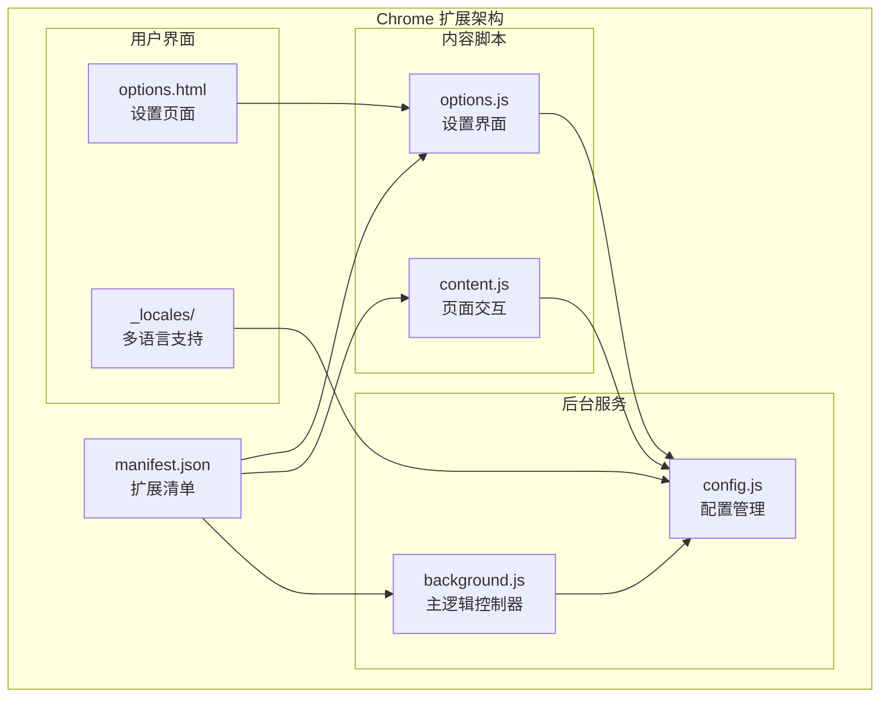
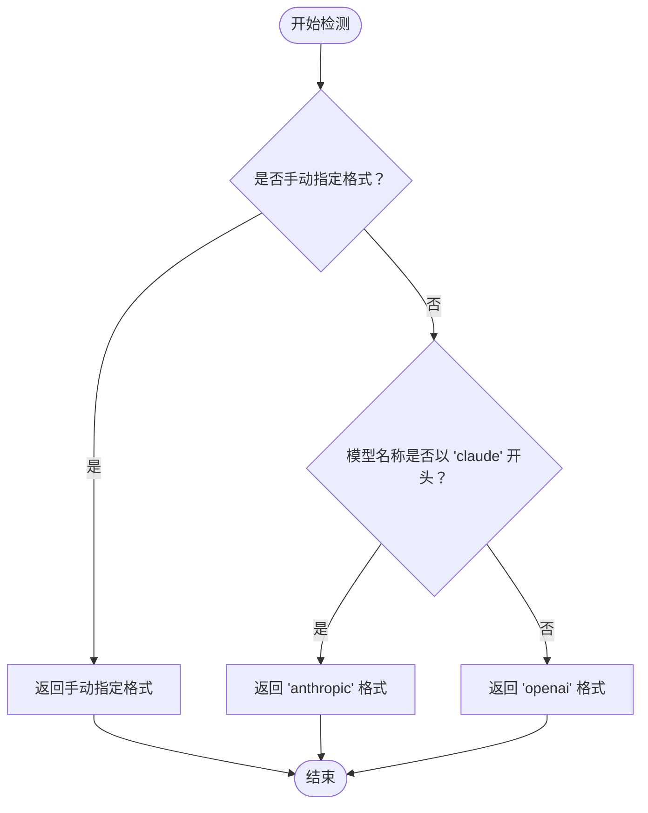
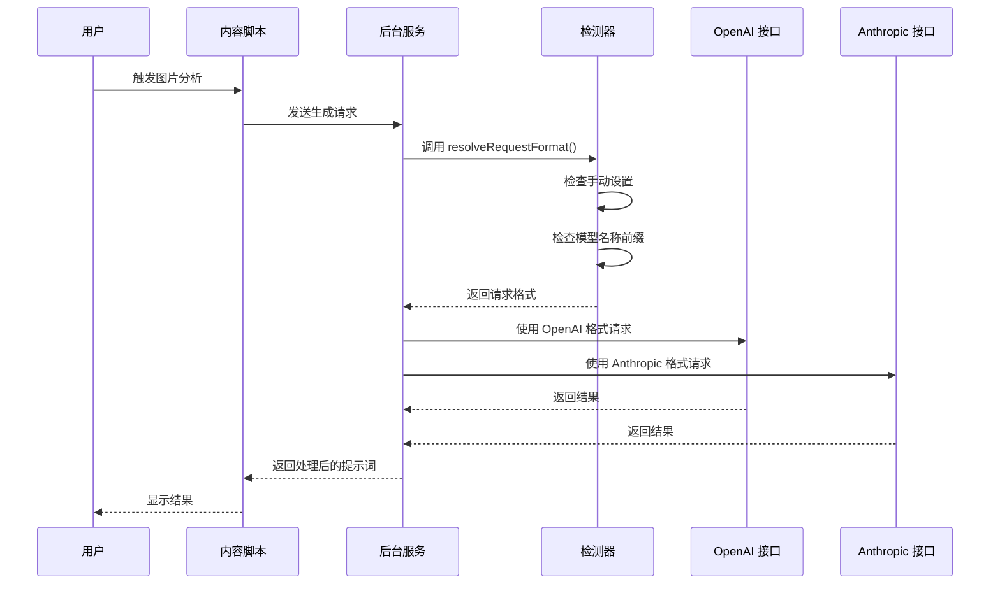
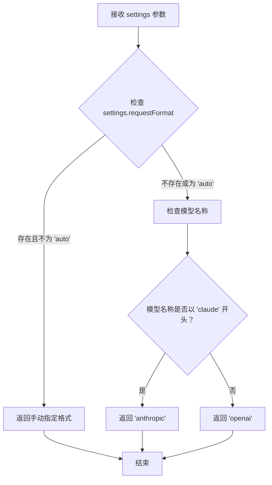
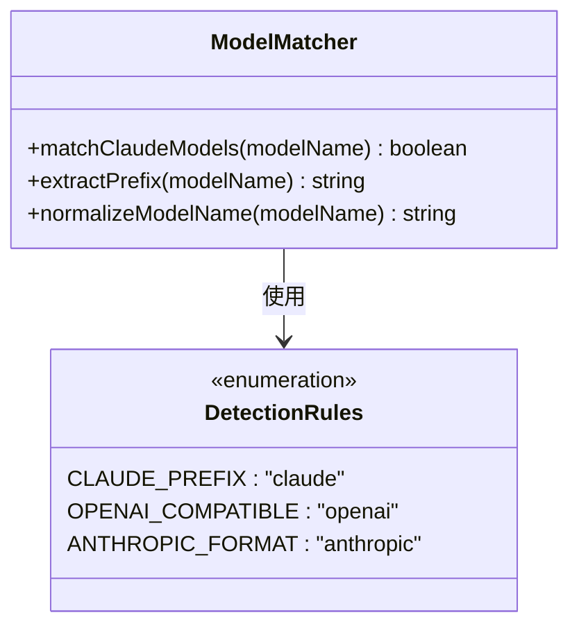
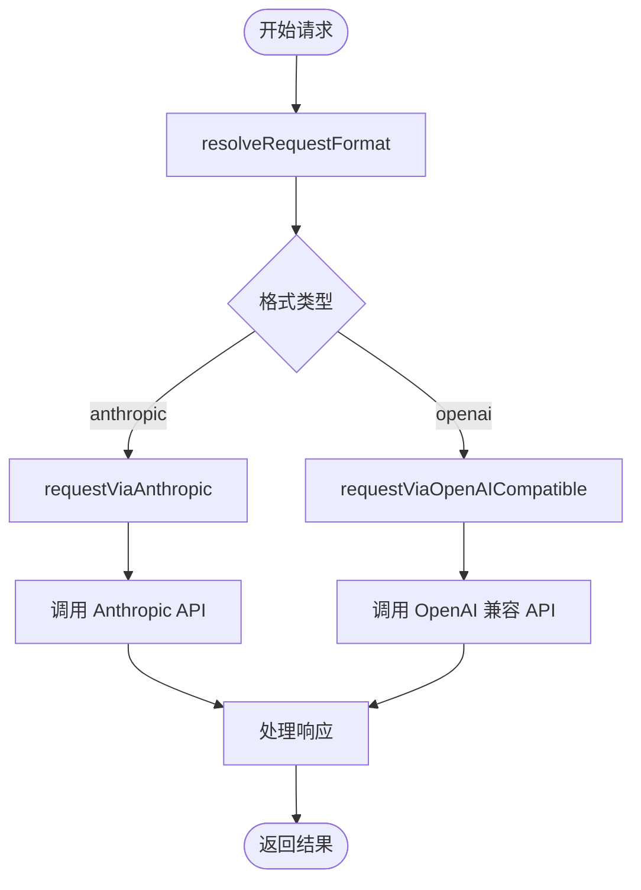
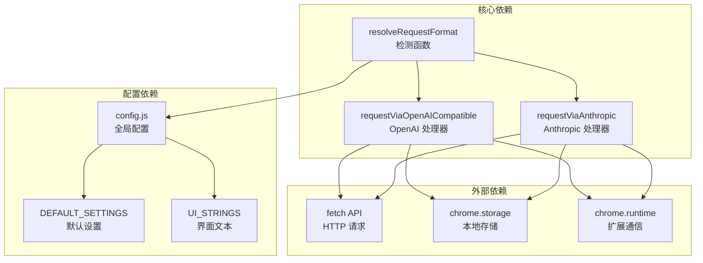

# 模型自动检测系统

<cite>
**本文档引用的文件**
- [background.js](file://background.js)
- [config.js](file://config.js)
- [content.js](file://content.js)
- [options.js](file://options.js)
- [manifest.json](file://manifest.json)
- [options.html](file://options.html)
- [messages.json](file://_locales/en/messages.json)
- [messages.json](file://_locales/zh_CN/messages.json)
</cite>

## 目录
1. [简介](#简介)
2. [项目结构](#项目结构)
3. [核心组件](#核心组件)
4. [架构概览](#架构概览)
5. [详细组件分析](#详细组件分析)
6. [依赖关系分析](#依赖关系分析)
7. [性能考虑](#性能考虑)
8. [故障排除指南](#故障排除指南)
9. [结论](#结论)

## 简介

Img2Prompt 是一个 Chrome 扩展程序，能够将图片转换为 AI 模型可用的提示词。该系统的核心功能之一是模型自动检测系统，它能够智能地根据模型名称自动选择合适的请求格式（OpenAI 或 Anthropic），并支持用户手动指定请求格式。

该系统通过 `resolveRequestFormat` 函数实现智能模型检测，能够识别 Claude 系列模型并自动切换到 Anthropic 请求格式，同时保持对 OpenAI 兼容格式的广泛支持。

## 项目结构

Img2Prompt 采用典型的 Chrome 扩展架构，包含以下主要组件：



**图表来源**
- [manifest.json:1-45](file://manifest.json#L1-L45)
- [background.js:1-50](file://background.js#L1-L50)
- [config.js:1-50](file://config.js#L1-L50)

**章节来源**
- [manifest.json:1-45](file://manifest.json#L1-L45)
- [background.js:1-50](file://background.js#L1-L50)
- [config.js:1-50](file://config.js#L1-L50)

## 核心组件

### 模型自动检测系统

模型自动检测系统的核心是 `resolveRequestFormat` 函数，它实现了智能的模型名称匹配逻辑：



**图表来源**
- [background.js:505-515](file://background.js#L505-L515)

### 请求格式处理

系统支持两种主要的请求格式：

1. **OpenAI 兼容格式**：适用于大多数现代 AI 模型
2. **Anthropic 格式**：专门用于 Claude 系列模型

**章节来源**
- [background.js:505-515](file://background.js#L505-L515)
- [background.js:478-503](file://background.js#L478-L503)

## 架构概览



**图表来源**
- [background.js:478-503](file://background.js#L478-L503)
- [background.js:505-515](file://background.js#L505-L515)

## 详细组件分析

### resolveRequestFormat 函数详解

`resolveRequestFormat` 函数是整个检测系统的核心，其工作原理如下：

#### 函数签名和参数
- **函数名**: `resolveRequestFormat`
- **参数**: `settings` - 包含模型配置的对象
- **返回值**: `"openai"` 或 `"anthropic"` 或手动指定的格式

#### 检测逻辑流程



**图表来源**
- [background.js:505-515](file://background.js#L505-L515)

#### 关键实现细节

1. **手动优先级**: 如果用户手动设置了 `requestFormat` 且不为 "auto"，系统将优先使用用户的设置
2. **Claude 自动识别**: 任何以 "claude" 开头的模型名称都会被识别为 Anthropic 格式
3. **默认回退**: 其他所有模型都将使用 OpenAI 兼容格式

**章节来源**
- [background.js:505-515](file://background.js#L505-L515)

### 模型名称匹配机制

系统使用简单而有效的字符串匹配机制来识别 Claude 模型：



**图表来源**
- [background.js:510-512](file://background.js#L510-L512)

#### 匹配规则

1. **大小写不敏感**: 使用 `toLowerCase()` 进行统一处理
2. **前缀匹配**: 使用 `startsWith("claude")` 进行精确匹配
3. **空值处理**: 对 `null` 或 `undefined` 的模型名称进行安全处理

**章节来源**
- [background.js:510-512](file://background.js#L510-L512)

### 请求格式选择逻辑

系统根据检测结果选择相应的请求格式处理器：



**图表来源**
- [background.js:478-503](file://background.js#L478-L503)

**章节来源**
- [background.js:478-503](file://background.js#L478-L503)

### 配置系统集成

模型检测系统与配置系统紧密集成，支持多种配置选项：

#### 默认配置
- **默认 API 端点**: OpenAI 兼容格式
- **默认模型**: `gpt-5-mini`
- **默认请求格式**: `"auto"`
- **Anthropic 版本**: `"2023-06-01"`

#### 用户配置覆盖
用户可以通过设置界面手动指定：
- API 端点
- 模型名称
- 请求格式（自动/手动）
- API 密钥
- 其他高级设置

**章节来源**
- [config.js:5-20](file://config.js#L5-L20)
- [options.js:407-422](file://options.js#L407-L422)

## 依赖关系分析



**图表来源**
- [background.js:1-20](file://background.js#L1-L20)
- [config.js:1-20](file://config.js#L1-L20)

### 关键依赖关系

1. **配置依赖**: 所有处理器都依赖于全局配置对象
2. **API 依赖**: 两个处理器都依赖浏览器的 fetch API
3. **存储依赖**: 通过 Chrome 扩展存储 API 进行数据持久化
4. **运行时依赖**: 通过 chrome.runtime 进行跨组件通信

**章节来源**
- [background.js:1-20](file://background.js#L1-L20)
- [config.js:1-20](file://config.js#L1-L20)

## 性能考虑

### 检测算法复杂度
- **时间复杂度**: O(1) - 基于简单的字符串前缀匹配
- **空间复杂度**: O(1) - 不依赖额外的数据结构
- **执行时间**: 几乎可以忽略不计

### 缓存策略
- **检测结果缓存**: 在单次请求生命周期内复用检测结果
- **配置缓存**: 通过全局变量避免重复读取配置
- **API 端点标准化**: 预先处理 Anthropic 端点转换

### 错误处理优化
- **早期失败**: 在检测阶段就发现配置问题
- **快速失败**: 对不支持的模型类型立即抛出错误
- **资源清理**: 及时释放内存和网络连接

## 故障排除指南

### 常见问题诊断

#### 问题 1: Claude 模型无法正确识别
**症状**: Claude 模型名称被错误识别为 OpenAI 格式
**解决方案**:
1. 确认模型名称以 "claude" 开头
2. 检查是否有额外的字符或空格
3. 使用手动格式设置覆盖自动检测

#### 问题 2: 请求格式设置不生效
**症状**: 即使手动设置了格式，系统仍使用自动检测
**解决方案**:
1. 检查 `requestFormat` 设置是否为 "auto"
2. 确认设置值不是 "auto"
3. 重新加载扩展以应用更改

#### 问题 3: Anthropic 端点转换失败
**症状**: Claude 模型请求失败，提示端点错误
**解决方案**:
1. 检查 API 端点是否正确
2. 确认端点以 `/v1/messages` 结尾
3. 验证 Anthropic API 密钥有效性

### 调试技巧

#### 启用详细日志
```javascript
// 在开发环境中添加调试信息
console.log('Model name:', settings.model);
console.log('Detected format:', resolveRequestFormat(settings));
```

#### 测试边界情况
1. **空模型名称**: `""`, `null`, `undefined`
2. **大小写混合**: `"CLAude-3"`, `"Claude-3"`, `"claude-3"`
3. **特殊字符**: `"claude-3.5-special"`
4. **非标准前缀**: `"my-claude-model"`

#### 验证配置
```javascript
// 检查配置是否正确加载
const settings = await loadSettings();
console.log('Current settings:', settings);
```

**章节来源**
- [background.js:505-515](file://background.js#L505-L515)
- [background.js:668-676](file://background.js#L668-L676)

## 结论

Img2Prompt 的模型自动检测系统是一个设计精良的轻量级解决方案，具有以下特点：

### 设计优势
1. **简洁高效**: 基于简单的字符串匹配，性能优异
2. **可扩展性强**: 易于添加新的检测规则和模型支持
3. **用户友好**: 支持手动覆盖，满足不同用户需求
4. **健壮性强**: 完善的错误处理和边界情况处理

### 技术亮点
1. **智能检测**: 自动识别 Claude 系列模型
2. **灵活配置**: 支持手动指定和自动检测两种模式
3. **错误预防**: 提前发现配置问题，避免运行时错误
4. **国际化支持**: 完整的多语言错误消息支持

### 未来改进方向
1. **正则表达式支持**: 更复杂的模型名称匹配规则
2. **动态规则加载**: 支持从配置文件动态加载检测规则
3. **性能监控**: 添加检测性能指标和统计信息
4. **测试覆盖率**: 增加单元测试和集成测试

该系统为 Img2Prompt 提供了可靠的模型检测能力，确保用户能够无缝地使用各种 AI 模型进行图片提示词生成。