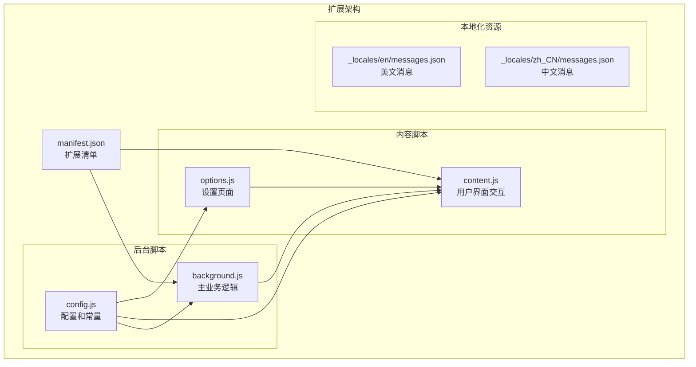
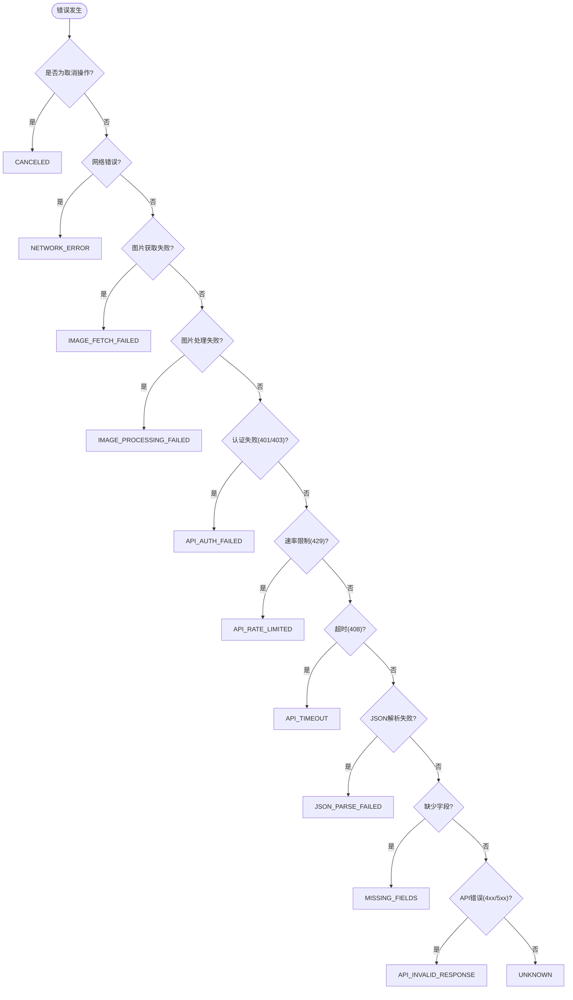
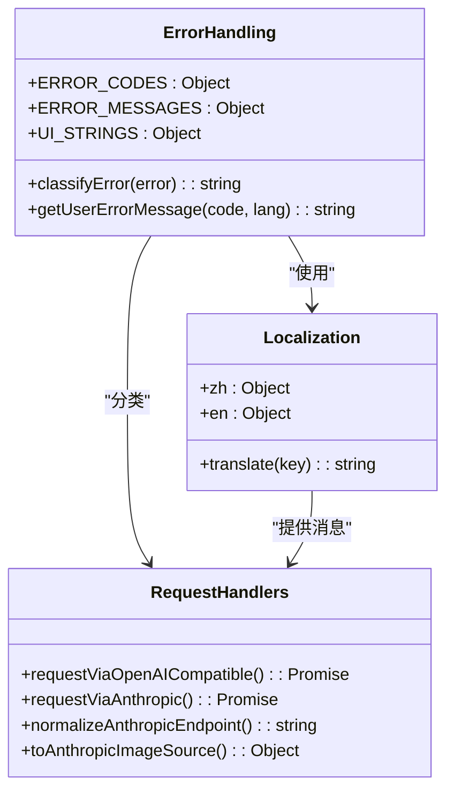
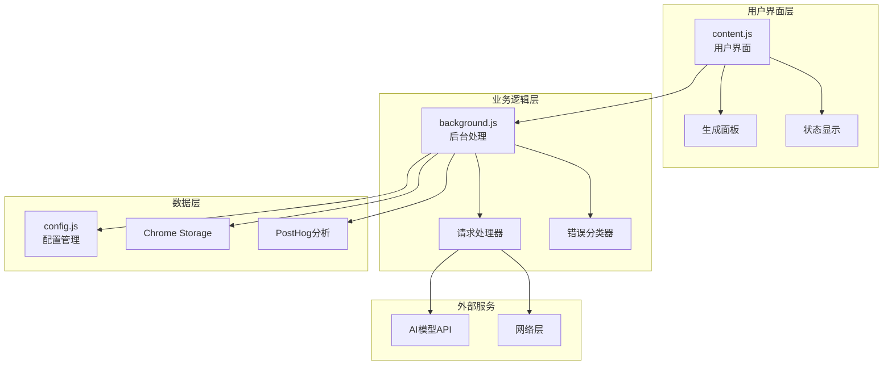
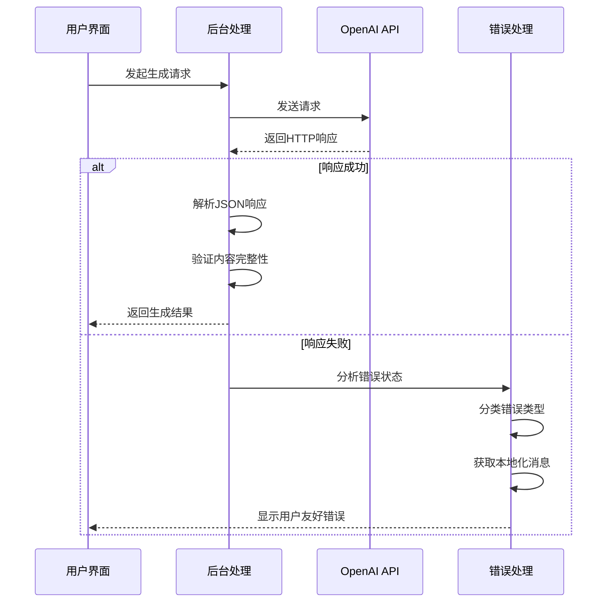
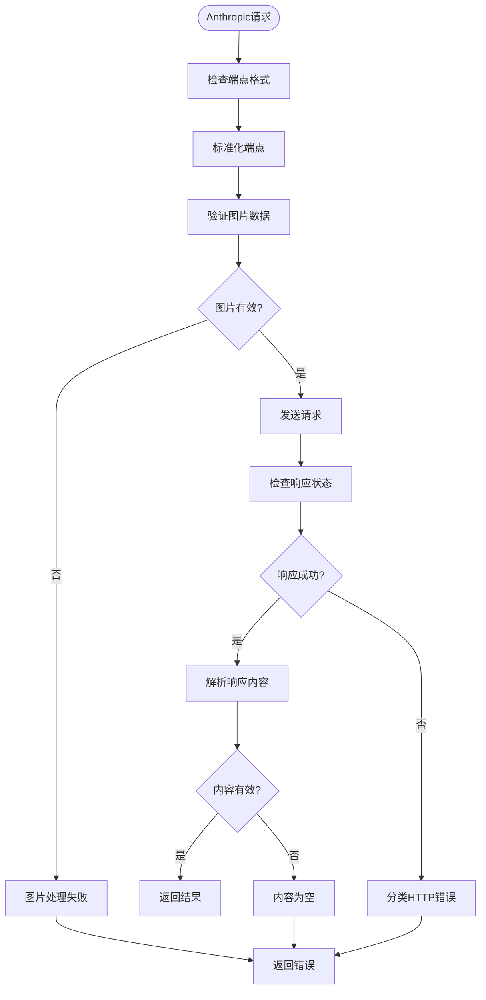
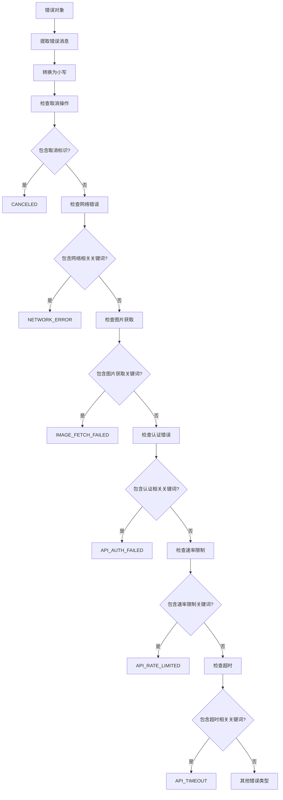
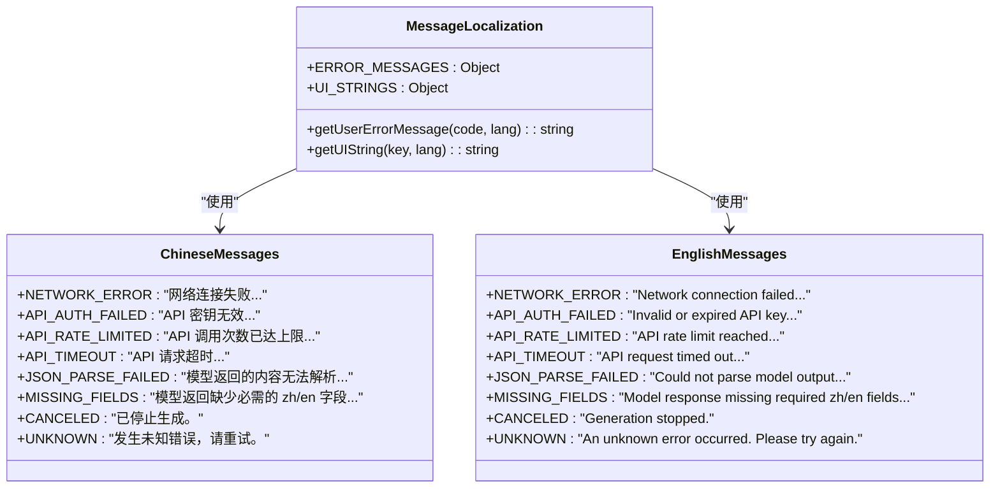
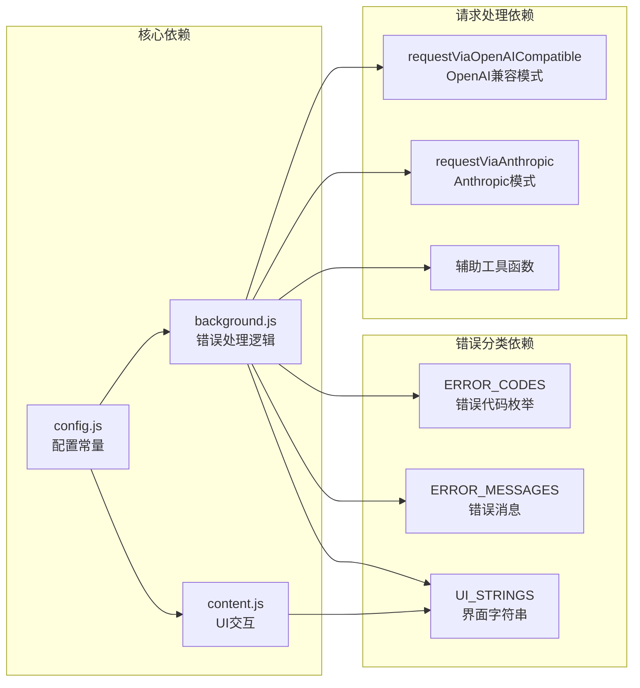
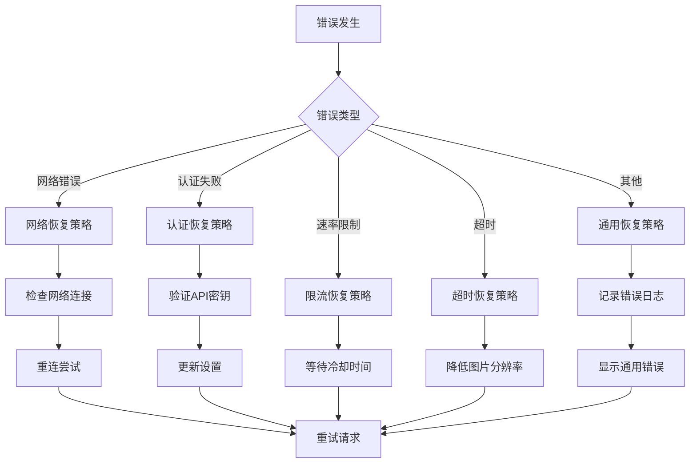

# 错误处理策略

<cite>
**本文档引用的文件**
- [background.js](file://background.js)
- [content.js](file://content.js)
- [config.js](file://config.js)
- [manifest.json](file://manifest.json)
- [options.js](file://options.js)
- [_locales/en/messages.json](file://_locales/en/messages.json)
- [_locales/zh_CN/messages.json](file://_locales/zh_CN/messages.json)
</cite>

## 目录
1. [简介](#简介)
2. [项目结构](#项目结构)
3. [核心组件](#核心组件)
4. [架构概览](#架构概览)
5. [详细组件分析](#详细组件分析)
6. [依赖关系分析](#依赖关系分析)
7. [性能考虑](#性能考虑)
8. [故障排除指南](#故障排除指南)
9. [结论](#结论)

## 简介

Img2Prompt 是一个 Chrome 扩展程序，能够将图像转换为 AI 提示词。该扩展实现了全面的错误处理策略，涵盖了从网络连接失败到 API 响应错误的各种场景。本文档深入分析了扩展的错误处理机制，包括错误分类、本地化消息处理、超时控制和恢复策略。

## 项目结构

Img2Prompt 采用模块化架构，主要包含以下关键文件：



**图表来源**
- [manifest.json:1-45](file://manifest.json#L1-L45)
- [background.js:1-12](file://background.js#L1-L12)
- [config.js:1-253](file://config.js#L1-L253)

**章节来源**
- [manifest.json:1-45](file://manifest.json#L1-L45)
- [config.js:1-253](file://config.js#L1-L253)

## 核心组件

### 错误分类系统

扩展实现了统一的错误分类系统，通过 `classifyError` 函数将各种异常归类到预定义的错误类型中：



**图表来源**
- [background.js:872-939](file://background.js#L872-L939)

### 错误消息本地化

扩展支持双语本地化，通过 `getUserErrorMessage` 函数根据用户语言返回相应的错误消息：



**图表来源**
- [config.js:206-247](file://config.js#L206-L247)
- [background.js:941-944](file://background.js#L941-L944)

**章节来源**
- [background.js:872-939](file://background.js#L872-L939)
- [config.js:206-247](file://config.js#L206-L247)

## 架构概览

扩展的错误处理架构分为三个层次：



**图表来源**
- [background.js:212-320](file://background.js#L212-L320)
- [content.js:209-247](file://content.js#L209-L247)

## 详细组件分析

### OpenAI 兼容请求错误处理

OpenAI 兼容模式的错误处理实现了详细的 HTTP 状态码分类：



**图表来源**
- [background.js:517-592](file://background.js#L517-L592)

#### HTTP 状态码分类策略

| 状态码 | 错误类型 | 处理逻辑 |
|--------|----------|----------|
| 401 | 认证失败 | 检查 API 密钥有效性，提示重新配置 |
| 403 | 权限拒绝 | 检查 API 权限设置，建议联系管理员 |
| 429 | 速率限制 | 建议稍后重试或升级配额 |
| 408 | 请求超时 | 检查网络连接，降低图片分辨率 |
| 5xx | 服务器错误 | 建议重试或更换模型 |

**章节来源**
- [background.js:562-582](file://background.js#L562-L582)

### Anthropic 请求错误处理

Anthropic 模式的错误处理具有特定的 API 要求和错误分类：



**图表来源**
- [background.js:594-666](file://background.js#L594-L666)

**章节来源**
- [background.js:594-666](file://background.js#L594-L666)

### 错误分类算法

错误分类算法采用多级匹配策略，确保准确识别各种错误类型：



**图表来源**
- [background.js:872-939](file://background.js#L872-L939)

**章节来源**
- [background.js:872-939](file://background.js#L872-L939)

### 本地化错误消息处理

扩展实现了完整的双语支持，错误消息根据用户语言动态选择：



**图表来源**
- [config.js:220-247](file://config.js#L220-L247)
- [config.js:32-113](file://config.js#L32-L113)

**章节来源**
- [config.js:220-247](file://config.js#L220-L247)
- [config.js:32-113](file://config.js#L32-L113)

## 依赖关系分析

扩展的错误处理依赖关系如下：



**图表来源**
- [background.js:8-11](file://background.js#L8-L11)
- [config.js:206-247](file://config.js#L206-L247)

**章节来源**
- [background.js:8-11](file://background.js#L8-L11)
- [config.js:206-247](file://config.js#L206-L247)

## 性能考虑

### 超时控制机制

扩展实现了多层次的超时控制：

1. **请求超时**: 通过 AbortController 实现请求取消
2. **图片压缩超时**: 在图片处理阶段设置合理的超时时间
3. **进度更新超时**: 防止长时间无响应的界面卡顿

### 信号合并策略

扩展使用 AbortController 实现信号合并，确保：
- 单个请求的独立取消能力
- 避免内存泄漏和悬挂请求
- 支持并发请求的独立管理

### 错误恢复策略



## 故障排除指南

### 常见错误场景及解决方案

#### 认证失败 (401/403)

**症状**: "认证失败（API 密钥无效）" 或 "访问被拒绝（检查 API 权限）"

**解决方案**:
1. 检查 API 密钥是否正确配置
2. 验证 API 权限设置
3. 确认账户状态正常
4. 尝试重新生成 API 密钥

#### 速率限制 (429)

**症状**: "调用次数超限"

**解决方案**:
1. 等待冷却时间结束
2. 降低请求频率
3. 升级 API 计划
4. 使用缓存机制

#### 服务器错误 (5xx)

**症状**: "服务器错误"

**解决方案**:
1. 稍后重试请求
2. 检查 API 服务状态
3. 联系 API 提供商
4. 切换到备用 API

#### 网络连接问题

**症状**: "网络连接失败，请检查网络后重试。"

**解决方案**:
1. 检查网络连接稳定性
2. 验证代理设置
3. 尝试不同的网络环境
4. 检查防火墙设置

#### 图片处理失败

**症状**: "图片处理失败：无法获取图片的二进制数据进行 AI 分析。"

**解决方案**:
1. 尝试不同的图片格式
2. 检查图片 URL 可访问性
3. 降低图片分辨率
4. 确保图片大小适中

### 自定义错误处理规则

要扩展新的错误处理规则，可以按照以下步骤进行：

1. **添加新的错误代码**:
   ```javascript
   // 在 config.js 的 ERROR_CODES 中添加新代码
   ERROR_CODES: {
       // ... 现有代码
       NEW_ERROR_TYPE: "NEW_ERROR_TYPE"
   }
   ```

2. **添加对应的错误消息**:
   ```javascript
   // 在 config.js 的 ERROR_MESSAGES 中添加本地化消息
   ERROR_MESSAGES: {
       zh: {
           // ... 现有消息
           "NEW_ERROR_TYPE": "新错误类型的中文消息"
       },
       en: {
           // ... 现有消息
           "NEW_ERROR_TYPE": "New error type English message"
       }
   }
   ```

3. **更新错误分类逻辑**:
   ```javascript
   // 在 background.js 的 classifyError 函数中添加新规则
   if (/* 新的条件 */) {
       return ERROR_CODES.NEW_ERROR_TYPE;
   }
   ```

4. **更新 UI 字符串** (如果需要):
   ```javascript
   // 在 config.js 的 UI_STRINGS 中添加界面文本
   UI_STRINGS: {
       zh: {
           // ... 现有文本
           "newErrorType": "新错误类型"
       },
       en: {
           // ... 现有文本
           "newErrorType": "New Error Type"
       }
   }
   ```

### 自定义错误消息实现

要实现自定义错误消息，可以：

1. **修改现有消息**:
   ```javascript
   // 在 config.js 中修改 ERROR_MESSAGES 对象
   ERROR_MESSAGES: {
       zh: {
           "API_AUTH_FAILED": "API 密钥验证失败，请检查密钥格式和有效期"
       }
   }
   ```

2. **添加新的本地化支持**:
   ```javascript
   // 在 config.js 中添加新的语言支持
   ERROR_MESSAGES: {
       zh: {
           // ... 现有消息
       },
       ja: {
           "API_AUTH_FAILED": "APIキー認証に失敗しました。"
       }
   }
   ```

3. **动态消息生成**:
   ```javascript
   // 在 background.js 中实现动态消息生成
   function getDynamicErrorMessage(errorCode, context) {
       switch (errorCode) {
           case ERROR_CODES.API_AUTH_FAILED:
               return `认证失败: ${context.endpoint} 需要有效的 API 密钥`;
           default:
               return getUserErrorMessage(errorCode, context.lang);
       }
   }
   ```

**章节来源**
- [background.js:872-939](file://background.js#L872-L939)
- [config.js:206-247](file://config.js#L206-L247)

## 结论

Img2Prompt 的错误处理策略展现了现代 Web 扩展程序的最佳实践。通过统一的错误分类系统、完善的本地化支持、智能的超时控制和灵活的恢复机制，该扩展能够为用户提供稳定可靠的 AI 提示词生成功能。

关键优势包括：
- **全面的错误覆盖**: 涵盖网络、认证、速率限制、超时等各类错误
- **用户友好的界面**: 通过本地化消息和进度反馈提升用户体验
- **可扩展的架构**: 易于添加新的错误类型和自定义处理逻辑
- **健壮的恢复机制**: 提供多种恢复策略确保服务连续性

未来可以进一步优化的方向包括：
- 增加更精细的错误统计和分析
- 实现智能重试机制
- 添加错误报告功能
- 扩展更多语言支持