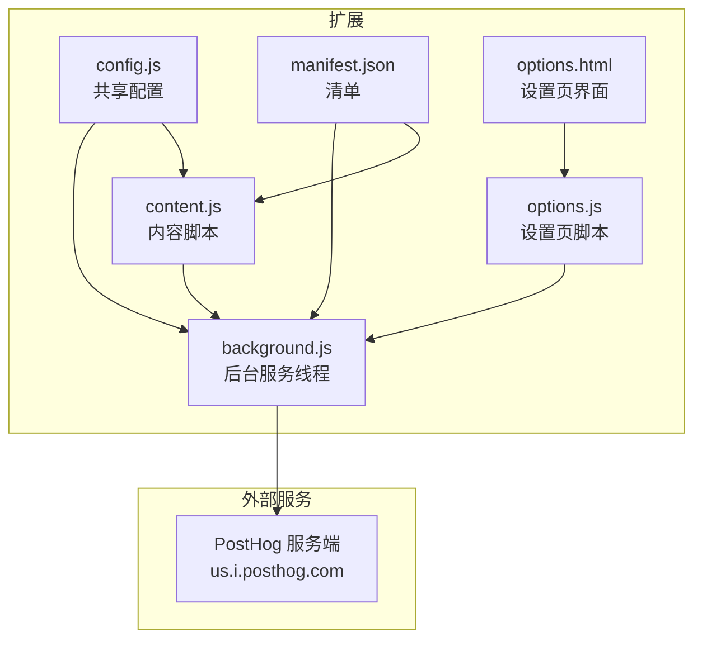
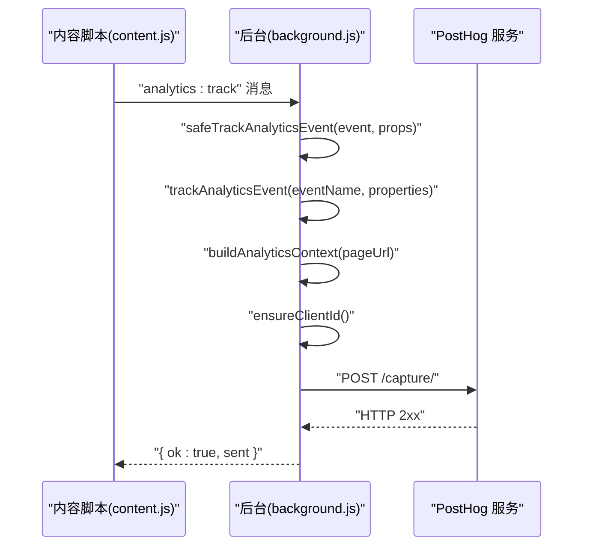
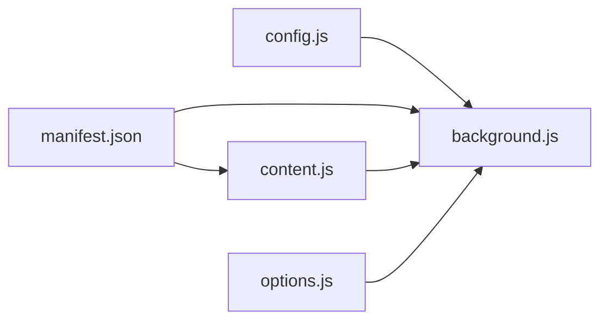

# 分析追踪系统

<cite>
**本文引用的文件**
- [background.js](file://background.js)
- [content.js](file://content.js)
- [config.js](file://config.js)
- [manifest.json](file://manifest.json)
- [options.js](file://options.js)
- [options.html](file://options.html)
</cite>

## 目录
1. [简介](#简介)
2. [项目结构](#项目结构)
3. [核心组件](#核心组件)
4. [架构总览](#架构总览)
5. [详细组件分析](#详细组件分析)
6. [依赖关系分析](#依赖关系分析)
7. [性能考量](#性能考量)
8. [故障排查指南](#故障排查指南)
9. [结论](#结论)
10. [附录](#附录)

## 简介
本文件面向 Img2Prompt 的分析追踪系统，聚焦于 safeTrackAnalyticsEvent 与 trackAnalyticsEvent 两个函数的实现与集成，涵盖：
- PostHog 集成与事件采集流程
- 事件类型与属性定义
- 分析上下文构建（页面主机、协议、扩展版本）
- 用户隐私保护机制（可选分析、匿名化、最小化数据）
- 新增事件与自定义属性的方法
- 数据安全与合规性最佳实践

## 项目结构
该扩展采用 Manifest V3 架构，核心文件如下：
- background.js：后台服务线程，负责事件采集、PostHog 发送、客户端 ID 管理、生成流程事件上报
- content.js：内容脚本，负责 UI 交互、触发分析事件（如复制、语言切换、截屏工具等）
- config.js：共享配置，包含 PostHog 密钥、主机、分析配置键名、UI 文案等
- manifest.json：声明权限、背景脚本、内容脚本注入范围
- options.js/options.html：设置页，包含分析事件上报（如设置保存）

图表来源
- [background.js:1-410](file://background.js#L1-L410)
- [content.js:1569-1578](file://content.js#L1569-L1578)
- [config.js:249-252](file://config.js#L249-L252)
- [manifest.json:1-45](file://manifest.json#L1-L45)
- [options.js:469-483](file://options.js#L469-L483)

章节来源
- [manifest.json:1-45](file://manifest.json#L1-L45)
- [config.js:1-253](file://config.js#L1-L253)

## 核心组件
- safeTrackAnalyticsEvent：安全包装的分析事件发送函数，捕获异常并返回布尔结果，避免阻断主流程
- trackAnalyticsEvent：实际向 PostHog 发送事件的函数，包含启用状态检查、客户端 ID 生成、请求体构造与响应校验
- buildAnalyticsContext：从页面 URL 中提取主机与协议，作为分析上下文属性
- 客户端 ID：首次使用时随机生成并持久化存储，作为匿名标识符
- 分析开关：通过本地存储键名控制是否启用分析，默认启用；禁用时直接返回

章节来源
- [background.js:359-410](file://background.js#L359-L410)
- [background.js:343-357](file://background.js#L343-L357)
- [background.js:330-341](file://background.js#L330-L341)

## 架构总览
分析追踪系统由“内容脚本 -> 后台服务线程 -> PostHog”三层协作构成。内容脚本通过消息通道触发后台发送分析事件；后台根据配置与上下文构造请求体并发起 HTTP 请求；PostHog 服务端接收并存储事件。

图表来源
- [content.js:1569-1578](file://content.js#L1569-L1578)
- [background.js:94-108](file://background.js#L94-L108)
- [background.js:359-410](file://background.js#L359-L410)

## 详细组件分析

### safeTrackAnalyticsEvent 与 trackAnalyticsEvent 实现
- 功能职责
  - safeTrackAnalyticsEvent：对外暴露的安全封装，内部调用 trackAnalyticsEvent，捕获异常并返回 false，保证调用方不会因网络或服务异常而崩溃
  - trackAnalyticsEvent：核心发送逻辑，执行以下步骤：
    - 参数校验（事件名非空）
    - 读取分析开关（默认启用，若显式禁用则返回 false）
    - 校验 PostHog 主机与项目密钥
    - 确保客户端 ID（首次生成并持久化）
    - 构造请求体（包含 api_key、event、distinct_id、timestamp、properties）
    - 发送 POST 请求至 /capture/
    - 校验响应状态码，失败抛出错误

- 关键点
  - 异常处理：safeTrackAnalyticsEvent 捕获错误并返回 false，不影响 UI 与业务流程
  - 最小化数据：只传递必要字段，避免敏感信息
  - 匿名化：使用随机客户端 ID，不绑定真实身份
  - 可选分析：通过本地存储键名控制开关

章节来源
- [background.js:359-410](file://background.js#L359-L410)

### 事件类型与属性定义
- 内置事件类型（由后台在生成流程中自动上报）
  - extension_installed：安装时上报，携带客户端 ID 与安装原因
  - extension_updated：更新时上报，携带客户端 ID、更新原因与前一版本号
  - generation_started：开始生成时上报，携带请求 ID、触发来源、模型、耗时上下文
  - generation_succeeded：成功完成时上报，携带请求 ID、触发来源、模型、耗时、页面上下文
  - generation_canceled：取消生成时上报，携带请求 ID、触发来源、耗时、页面上下文
  - generation_failed：生成失败时上报，携带请求 ID、触发来源、模型、耗时、错误码与错误摘要、页面上下文

- 事件属性（通用）
  - distinct_id：客户端 ID
  - $lib：库标识
  - $lib_version：扩展版本
  - extensionVersion：扩展版本
  - pageHost：页面主机
  - pageProtocol：页面协议（不含冒号）
  - 其他自定义属性：由调用方传入（如 model、trigger、durationMs、errorCode、errorMessage 等）

- 上下文构建
  - buildAnalyticsContext：从传入的页面 URL 解析 host 与 protocol，失败时返回空对象

章节来源
- [background.js:19-57](file://background.js#L19-L57)
- [background.js:227-315](file://background.js#L227-L315)
- [background.js:343-357](file://background.js#L343-L357)

### PostHog 集成与数据发送机制
- 配置来源
  - 项目密钥与主机在共享配置中定义，经 Base64 解码后使用
- 发送端点
  - 使用 /capture/ 端点，请求头为 application/json
- 请求体结构
  - api_key：PostHog 项目密钥
  - event：事件名
  - distinct_id：客户端 ID
  - timestamp：ISO 时间戳
  - properties：包含通用属性与调用方传入的自定义属性
- 错误处理
  - 非 2xx 响应抛出错误，safeTrackAnalyticsEvent 捕获并返回 false

章节来源
- [config.js:249-252](file://config.js#L249-L252)
- [background.js:375-395](file://background.js#L375-L395)

### 分析上下文信息构建
- 页面主机与协议
  - 从传入的 pageUrl 解析 host 与 protocol（去除末尾冒号）
  - 失败时返回空对象，避免影响事件上报
- 扩展版本
  - 通过 manifest 版本注入到 properties 中，便于版本维度分析

章节来源
- [background.js:343-357](file://background.js#L343-L357)

### 用户隐私保护机制
- 可选分析
  - 通过本地存储键名控制分析开关，默认启用；禁用时 trackAnalyticsEvent 直接返回 false
- 匿名化
  - 使用随机客户端 ID，不包含任何可识别个人身份的信息
- 最小化数据
  - 仅传递必要字段，避免敏感信息（如 API Key、URL 参数等）进入事件属性
- 用户知情与控制
  - 设置页提供分析开关（通过本地存储键名控制），用户可随时禁用分析

章节来源
- [background.js:364-369](file://background.js#L364-L369)
- [config.js:249-252](file://config.js#L249-L252)

### 在内容脚本中添加分析事件
- 触发方式
  - 通过消息通道向后台发送 analytics:track 消息，后台统一处理
- 示例路径
  - 语言切换事件：content.js 中的语言切换按钮点击后触发
  - 复制提示词事件：content.js 中复制按钮点击后触发
  - 截屏工具事件：content.js 中截屏工具打开与裁剪完成事件触发
- 自定义属性
  - 在调用时传入 properties 对象，后台会合并上下文属性（如 pageUrl）后发送

章节来源
- [content.js:1304-1332](file://content.js#L1304-L1332)
- [content.js:1326-1332](file://content.js#L1326-L1332)
- [content.js:490-573](file://content.js#L490-L573)
- [content.js:1569-1578](file://content.js#L1569-L1578)

### 在设置页中添加分析事件
- 触发方式
  - options.js 中的设置保存动作通过消息通道向后台发送 analytics:track
- 自定义属性
  - 包含来源（如恢复默认、自动保存）、模型、是否填写 API 地址与密钥、悬浮按钮开关等

章节来源
- [options.js:469-483](file://options.js#L469-L483)

### 生成流程中的事件上报
- 安装/更新事件
  - onInstalled 回调中根据安装原因上报 extension_installed 或 extension_updated
- 生成生命周期事件
  - generation_started：开始阶段上报
  - generation_succeeded：成功完成阶段上报
  - generation_canceled：取消阶段上报
  - generation_failed：失败阶段上报
- 属性补充
  - 自动附加页面上下文（host、protocol）与扩展版本信息

章节来源
- [background.js:19-57](file://background.js#L19-L57)
- [background.js:227-315](file://background.js#L227-L315)

## 依赖关系分析
- 配置依赖
  - config.js 提供 PostHog 项目密钥、主机、分析配置键名
- 运行时依赖
  - manifest.json 声明后台脚本与内容脚本注入范围
- 通信依赖
  - content.js 与 background.js 通过消息通道通信
  - options.js 与 background.js 通过消息通道通信

图表来源
- [config.js:249-252](file://config.js#L249-L252)
- [manifest.json:10-26](file://manifest.json#L10-L26)
- [content.js:1569-1578](file://content.js#L1569-L1578)
- [options.js:469-483](file://options.js#L469-L483)

章节来源
- [config.js:1-253](file://config.js#L1-L253)
- [manifest.json:1-45](file://manifest.json#L1-L45)

## 性能考量
- 异步发送与非阻塞
  - safeTrackAnalyticsEvent 捕获异常并返回布尔值，避免阻断主流程
- 请求体精简
  - 仅传递必要字段，减少网络开销
- 上下文解析
  - buildAnalyticsContext 使用 URL 解析，失败时快速返回空对象，避免异常传播
- 可选分析
  - 当分析被禁用时，直接短路返回，避免不必要的网络请求

[本节为通用指导，无需特定文件引用]

## 故障排查指南
- 事件未上报
  - 检查分析开关是否被禁用（本地存储键名对应值为 false）
  - 检查 PostHog 主机与项目密钥是否正确配置
  - 检查网络连通性与跨域策略
- 上报失败
  - safeTrackAnalyticsEvent 返回 false，表示发送失败但不会影响业务
  - trackAnalyticsEvent 抛出错误，可通过日志查看具体状态码
- 上下文缺失
  - 若 pageUrl 为空或非法，buildAnalyticsContext 返回空对象，需确保传入有效 URL

章节来源
- [background.js:364-369](file://background.js#L364-L369)
- [background.js:371-373](file://background.js#L371-L373)
- [background.js:397-399](file://background.js#L397-L399)
- [background.js:343-357](file://background.js#L343-L357)

## 结论
Img2Prompt 的分析追踪系统以安全、匿名、可选为核心设计原则，通过内容脚本与后台服务线程的清晰分工，结合 PostHog 的标准化事件采集，实现了对扩展使用行为的可观测性。系统具备良好的错误处理与性能特性，同时通过最小化数据与可选分析保障用户隐私。

[本节为总结性内容，无需特定文件引用]

## 附录

### 如何新增一个分析事件
- 在需要埋点的位置调用 safeSendRuntimeMessage 发送 analytics:track 消息，例如：
  - 路径参考：[content.js:1569-1578](file://content.js#L1569-L1578)
- 在后台监听消息并调用 safeTrackAnalyticsEvent，例如：
  - 路径参考：[background.js:94-108](file://background.js#L94-L108)
- 在调用时传入自定义属性，后台会自动合并上下文属性（如 pageUrl），例如：
  - 路径参考：[content.js:1304-1332](file://content.js#L1304-L1332)

### 如何自定义事件属性
- 在消息中传入 properties 对象，后台会将其与上下文属性合并后发送，例如：
  - 路径参考：[background.js:96-99](file://background.js#L96-L99)
- 常见自定义属性示例（按需添加）：
  - trigger：触发来源（如 hover_button、shortcut_snipping）
  - model：模型名称
  - durationMs：耗时（毫秒）
  - errorCode/errorMessage：错误码与错误摘要
  - language/textLength：语言与文本长度等

### 如何实现可选的分析功能
- 在设置页中通过本地存储键名控制分析开关（默认启用），例如：
  - 路径参考：[config.js:249-252](file://config.js#L249-L252)
- 在发送前检查开关状态，例如：
  - 路径参考：[background.js:364-369](file://background.js#L364-L369)

### 数据安全与合规性最佳实践
- 最小化数据：仅上报必要属性，避免敏感信息
- 匿名化：使用随机客户端 ID，不关联真实身份
- 可选分析：允许用户随时禁用分析
- 透明性：在设置页明确说明分析用途与数据范围
- 合规性：遵守目标地区的隐私法规（如 GDPR、CCPA），提供清晰的用户控制选项

[本节为通用指导，无需特定文件引用]