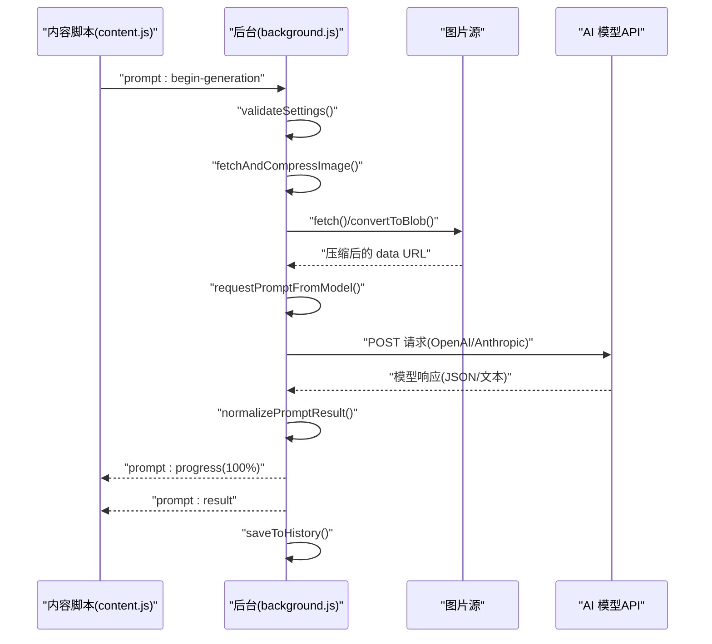
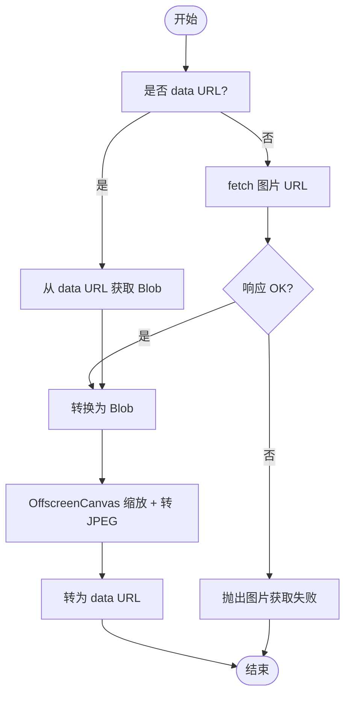
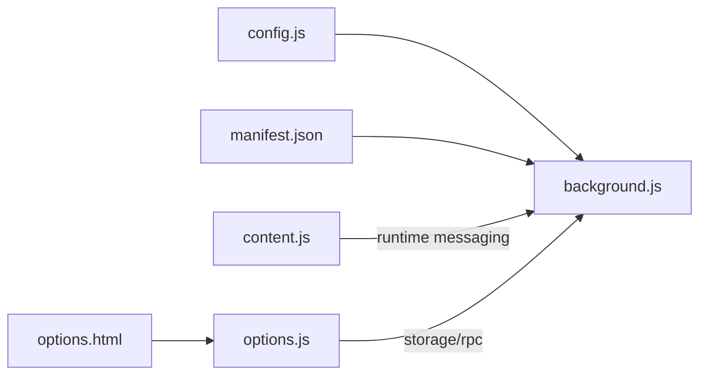

# 后台逻辑开发

<cite>
**本文引用的文件列表**
- [background.js](file://background.js)
- [config.js](file://config.js)
- [content.js](file://content.js)
- [manifest.json](file://manifest.json)
- [options.html](file://options.html)
- [options.js](file://options.js)
</cite>

## 目录
1. [简介](#简介)
2. [项目结构](#项目结构)
3. [核心组件](#核心组件)
4. [架构总览](#架构总览)
5. [详细组件分析](#详细组件分析)
6. [依赖关系分析](#依赖关系分析)
7. [性能考量](#性能考量)
8. [故障排查指南](#故障排查指南)
9. [结论](#结论)
10. [附录](#附录)

## 简介
本指南面向 Img2Prompt 后台逻辑开发，聚焦 background.js 的核心实现，包括消息处理机制、AI 模型请求流程、图片处理逻辑。文档将详细说明如何在 processGeneration 函数中添加新的 AI 模型支持，如何在 requestPromptFromModel 中扩展新的 API 端点，如何实现自定义图片压缩算法，以及如何完善错误分类与处理逻辑。同时提供性能优化建议，涵盖并发控制、内存管理与缓存策略。

## 项目结构
- 服务工作线程：background.js 承担消息路由、生成流程编排、图片压缩、模型请求与错误分类等职责。
- 配置共享：config.js 提供默认设置、UI 文案、错误码与消息映射、分析上报配置等。
- 内容脚本：content.js 负责 UI 展示、进度反馈、与后台通信、历史记录交互等。
- 设置页面：options.html 与 options.js 提供设置面板、用户提示词模板、历史记录管理与自动保存。
- 清单文件：manifest.json 声明后台脚本、权限、命令与侧边栏行为。

```mermaid
graph TB
subgraph "扩展"
BG["background.js"]
CFG["config.js"]
CT["content.js"]
OPT_HTML["options.html"]
OPT_JS["options.js"]
MAN["manifest.json"]
end
MAN --> BG
CFG --> BG
CT <- --> BG
OPT_HTML --> OPT_JS
OPT_JS --> BG
```

图表来源
- [background.js:1-57](file://background.js#L1-L57)
- [config.js:1-253](file://config.js#L1-L253)
- [content.js:1-120](file://content.js#L1-L120)
- [options.html:1-60](file://options.html#L1-L60)
- [options.js:1-30](file://options.js#L1-L30)
- [manifest.json:1-45](file://manifest.json#L1-L45)

章节来源
- [manifest.json:1-45](file://manifest.json#L1-L45)
- [background.js:1-57](file://background.js#L1-L57)
- [config.js:1-253](file://config.js#L1-L253)
- [content.js:1-120](file://content.js#L1-L120)
- [options.html:1-60](file://options.html#L1-L60)
- [options.js:1-30](file://options.js#L1-L30)

## 核心组件
- 消息处理与生命周期
  - 安装事件：初始化客户端 ID、上下文菜单、默认设置、侧边栏行为与安装/更新事件上报。
  - 上下文菜单点击：向对应标签页发送“开始分析”消息。
  - 快捷命令：触发截图捕获并下发“开始截图分析”消息。
  - 运行时消息：统一处理分析开始、进度、结果、错误、取消、设置更新、历史查询/删除/清空等。
- 生成流程编排
  - processGeneration：校验设置、拉取并压缩图片、调用模型、解析结果、写入历史、发送进度与最终结果。
- 图片处理
  - fetchAndCompressImage：根据来源类型（URL 或 data:）抓取并压缩，统一走 OffscreenCanvas 路径。
  - compressImageDataUrl/compressImageBlob：将 data URL 或 Blob 转换为 JPEG data URL。
- 模型请求
  - requestPromptFromModel：根据设置决定请求格式（OpenAI 兼容或 Anthropic），分派到对应函数。
  - requestViaOpenAICompatible/requestViaAnthropic：构造请求体、发送请求、解析响应、错误分类。
  - resolveRequestFormat：基于模型名或显式设置判断请求格式。
- 错误分类与用户提示
  - classifyError：按关键词与状态码归类错误类型。
  - getUserErrorMessage：根据语言与错误码映射用户友好提示。
- 进度与统计
  - sendProgress/sendTabMessage：向内容脚本推送进度与阶段信息。
  - 安全埋点：safeTrackAnalyticsEvent/safeTrackAnalyticsEvent：PostHog 上报封装，带开关与兜底。

章节来源
- [background.js:94-184](file://background.js#L94-L184)
- [background.js:212-320](file://background.js#L212-L320)
- [background.js:478-503](file://background.js#L478-L503)
- [background.js:505-515](file://background.js#L505-L515)
- [background.js:517-592](file://background.js#L517-L592)
- [background.js:594-666](file://background.js#L594-L666)
- [background.js:775-849](file://background.js#L775-L849)
- [background.js:872-945](file://background.js#L872-L945)
- [background.js:851-870](file://background.js#L851-L870)
- [background.js:359-410](file://background.js#L359-L410)

## 架构总览
后台逻辑围绕“消息驱动 + 流水线编排”的模式构建：
- 消息入口：chrome.runtime.onMessage、chrome.contextMenus.onClicked、chrome.commands.onCommand。
- 编排中心：processGeneration 统一调度图片抓取、压缩、模型请求、结果解析与历史写入。
- 异步控制：AbortController + activeRequests Map 实现请求取消；信号传递至 fetch。
- 错误闭环：错误分类 + 用户提示 + 埋点上报 + 取消状态反馈。



图表来源
- [background.js:212-320](file://background.js#L212-L320)
- [background.js:478-503](file://background.js#L478-L503)
- [background.js:775-849](file://background.js#L775-L849)
- [background.js:517-592](file://background.js#L517-L592)
- [background.js:594-666](file://background.js#L594-L666)
- [background.js:695-726](file://background.js#L695-L726)

## 详细组件分析

### 消息处理与生命周期
- 安装与初始化
  - 创建上下文菜单、设置侧边栏行为、注入默认设置、安装/更新事件上报。
- 上下文菜单与快捷命令
  - 上下文菜单点击触发“开始分析”，快捷命令触发截图捕获并下发“开始截图分析”。
- 运行时消息路由
  - 支持分析开始、进度、结果、错误、取消、设置更新、历史查询/删除/清空等。
  - 取消流程：通过 activeRequests Map 获取 AbortController 并 abort，清理 Map 条目，向前端发送取消结果。

章节来源
- [background.js:19-57](file://background.js#L19-L57)
- [background.js:59-92](file://background.js#L59-L92)
- [background.js:94-184](file://background.js#L94-L184)
- [background.js:122-132](file://background.js#L122-L132)

### 生成流程编排（processGeneration）
- 关键步骤
  - 加载设置、选择 UI 语言字典、校验设置。
  - 发送“准备中”进度 -> 抓取并压缩图片 -> 发送“获取图片”进度。
  - 调用 requestPromptFromModel -> 发送“调用模型”进度。
  - 解析 normalizePromptResult -> 发送“整理提示词”进度。
  - 发送最终结果与写入历史，并上报成功事件。
- 取消与错误
  - 若信号被 abort，发送取消事件并上报取消统计。
  - 其他异常通过 classifyError 映射错误码，发送错误事件并上报失败统计。

章节来源
- [background.js:212-320](file://background.js#L212-L320)
- [background.js:280-319](file://background.js#L280-L319)

### 图片处理逻辑（fetchAndCompressImage 系列）
- 输入类型
  - data URL：直接转换为 Blob，进入压缩流程。
  - 外链 URL：fetch 获取 Blob，再压缩。
- 压缩策略
  - 使用 OffscreenCanvas 将图像缩放至最大边不超过 maxEdge。
  - 转换为 JPEG Blob（质量约 0.92），再转为 data URL。
- 边界处理
  - 空 Blob、非图片类型、转换失败均抛出明确错误，便于上层分类与提示。



图表来源
- [background.js:775-849](file://background.js#L775-L849)

章节来源
- [background.js:775-849](file://background.js#L775-L849)

### 模型请求流程（requestPromptFromModel）
- 请求格式判定
  - resolveRequestFormat：若设置为“auto”，依据模型名前缀（如 claude）选择 Anthropic；否则默认 OpenAI 兼容。
- OpenAI 兼容请求
  - 构造 messages 结构，包含 system 与 user 内容（文本 + 图片 URL）。
  - 发送 POST 请求，解析 choices[0].message.content 或多段文本拼接。
  - 对 401/403/429/408/5xx 等状态码提供具体错误提示。
- Anthropic 请求
  - 规范化端点（/v1/chat/completions -> /v1/messages），校验 base64 图片来源。
  - 发送 POST 请求，解析 content 数组中的 text 块。
  - 对 401/403/429/5xx 等状态码提供具体错误提示。

章节来源
- [background.js:478-503](file://background.js#L478-L503)
- [background.js:505-515](file://background.js#L505-L515)
- [background.js:517-592](file://background.js#L517-L592)
- [background.js:594-666](file://background.js#L594-L666)
- [background.js:668-676](file://background.js#L668-L676)
- [background.js:678-693](file://background.js#L678-L693)

### 错误分类与用户提示（classifyError）
- 分类维度
  - 网络错误（failed to fetch、networkerror）、图片获取/处理（fetch image、base64、bitmap）、认证（401/403、authentication、unauthorized、forbidden）、限流（429、rate limit）、超时（timeout、408）、JSON 解析（json、parse、invalid json）、字段缺失（zh/en、missing、field）、API 错误（含括号状态码）。
- 映射策略
  - ERROR_CODES 枚举与 ERROR_MESSAGES 多语言映射，getUserErrorMessage 输出用户提示。

章节来源
- [background.js:872-945](file://background.js#L872-L945)
- [config.js:206-247](file://config.js#L206-L247)

### 进度与统计（sendProgress/sendTabMessage/safeTrackAnalyticsEvent）
- 进度推送：sendProgress 将阶段与百分比推送到内容脚本，便于 UI 更新。
- 事件上报：safeTrackAnalyticsEvent 包装 PostHog 上报，支持开关与异常兜底。
- 上下文：buildAnalyticsContext 从页面 URL 提取 host/protocol，作为属性附加。

章节来源
- [background.js:851-870](file://background.js#L851-L870)
- [background.js:359-410](file://background.js#L359-L410)
- [background.js:343-357](file://background.js#L343-L357)

### 扩展指南：添加新的 AI 模型支持
- 在 requestPromptFromModel 中新增分支
  - 新增一个分支，根据 settings.requestFormat 或模型名前缀识别新模型。
  - 实现 requestViaNewProvider({ settings, imageInput, pageHints, signal })，构造请求体与头部，发送请求并解析响应。
  - 注意：确保解析逻辑能从响应中提取纯文本提示词，必要时实现 extractNewProviderContent。
- 请求格式适配
  - 若新模型需要特定字段（如 system、messages、temperature、max_tokens 等），在请求体中补齐。
  - 若需要自定义头部（如 x-api-key、anthropic-version），在 headers 中设置。
- 错误处理策略
  - 在请求失败时，解析状态码与错误文本，映射到 ERROR_CODES 中的相应枚举。
  - 对于 401/403/429/408/5xx 等常见状态码，提供用户可读提示。
- 超时控制机制
  - 使用 AbortController 与 fetch 的 signal 参数实现超时控制。
  - 在 processGeneration 中创建 controller 并将其传入 requestPromptFromModel。
  - 在 requestPromptFromModel 的子函数中将 signal 透传给 fetch。
- 示例参考路径
  - [requestPromptFromModel:478-503](file://background.js#L478-L503)
  - [requestViaOpenAICompatible:517-592](file://background.js#L517-L592)
  - [requestViaAnthropic:594-666](file://background.js#L594-L666)

章节来源
- [background.js:478-503](file://background.js#L478-L503)
- [background.js:517-592](file://background.js#L517-L592)
- [background.js:594-666](file://background.js#L594-L666)

### 扩展指南：实现自定义图片压缩算法
- 压缩入口
  - compressImageBlob：核心流程（缩放 + JPEG 转换）。
  - compressImageDataUrl：data URL -> Blob -> 压缩。
  - fetchAndCompressImage：外链 URL -> Blob -> 压缩。
- 自定义策略
  - 调整缩放阈值：maxEdge 参数来自设置，可在 compressImageBlob 中按需调整。
  - 调整质量：JPEG 质量参数（当前约 0.92）可在 compressImageBlob 中修改。
  - 替换算法：可将 OffscreenCanvas + convertToBlob 替换为自定义 Canvas 处理流程，注意保持输出为 data URL。
- 注意事项
  - 保证输出为 data URL，以便后续作为模型请求体的 image_url/base64。
  - 对空 Blob、非图片类型、转换失败等情况抛出明确错误，便于上层分类。

章节来源
- [background.js:775-849](file://background.js#L775-L849)

### 扩展指南：添加新的错误分类与处理逻辑
- 新增错误码
  - 在 config.js 的 ERROR_CODES 中添加新枚举值。
  - 在 ERROR_MESSAGES 中为 zh/en 两套文案补充映射。
- 新增分类规则
  - 在 classifyError 中增加匹配条件，覆盖新模型或新接口的错误特征。
  - 优先匹配状态码（如 401/403/429/408/5xx），其次匹配关键词（如 invalid token、quota exceeded、unsupported image format）。
- 用户提示
  - 使用 getUserErrorMessage 获取对应语言的用户提示，确保一致性与可读性。

章节来源
- [config.js:206-247](file://config.js#L206-L247)
- [background.js:872-945](file://background.js#L872-L945)

## 依赖关系分析
- 组件耦合
  - background.js 依赖 config.js 的默认设置、UI 文案、错误码与消息映射。
  - content.js 通过 runtime 消息与 background.js 交互，负责 UI 与进度展示。
  - options.html/options.js 通过 storage 与 runtime 与后台交互，实现设置持久化与历史管理。
- 外部依赖
  - fetch API：用于图片抓取与模型请求。
  - OffscreenCanvas：用于高性能图片缩放与格式转换。
  - PostHog：用于匿名使用统计与事件追踪。



图表来源
- [config.js:1-253](file://config.js#L1-L253)
- [background.js:1-12](file://background.js#L1-L12)
- [manifest.json:1-45](file://manifest.json#L1-L45)
- [content.js:1-120](file://content.js#L1-L120)
- [options.html:1-60](file://options.html#L1-L60)
- [options.js:1-30](file://options.js#L1-L30)

章节来源
- [config.js:1-253](file://config.js#L1-L253)
- [background.js:1-12](file://background.js#L1-L12)
- [manifest.json:1-45](file://manifest.json#L1-L45)
- [content.js:1-120](file://content.js#L1-L120)
- [options.html:1-60](file://options.html#L1-L60)
- [options.js:1-30](file://options.js#L1-L30)

## 性能考量
- 并发请求控制
  - 当前实现为串行流水线（抓取 -> 请求 -> 解析 -> 写入），避免并发带来的资源竞争。
  - 若需并发，建议引入队列与令牌桶控制，限制同时活跃的请求数量，并在 processGeneration 中统一管理。
- 内存管理
  - OffscreenCanvas 与 ImageBitmap 的使用需及时释放（imgBitmap.close）。
  - data URL 体积较大，应尽量降低 maxEdge 与 JPEG 质量，减少内存占用。
- 缓存策略
  - 可考虑对最近 N 张图片的压缩结果进行短期缓存（基于 URL 或哈希），避免重复抓取与压缩。
  - 历史记录已采用本地存储，建议限制最大条数并定期清理。
- 网络与超时
  - 使用 AbortController 与 fetch signal 实现可取消请求，避免长时间阻塞。
  - 对高延迟网络环境，适当提高超时阈值并在 UI 层提示用户。

[本节为通用指导，无需列出章节来源]

## 故障排查指南
- 常见问题与定位
  - 网络错误：检查网络连通性与代理设置；查看 classifyError 是否命中 NETWORK_ERROR。
  - 图片获取失败：确认图片 URL 可访问、内容类型为 image/*；查看 classifyError 是否命中 IMAGE_FETCH_FAILED。
  - 图片处理失败：检查 data URL 格式与 Blob 大小；查看 classifyError 是否命中 IMAGE_PROCESSING_FAILED。
  - 认证失败：核对 API Key 与权限；查看 classifyError 是否命中 API_AUTH_FAILED。
  - 限流/超时：降低 maxImageEdge 或等待配额恢复；查看 classifyError 是否命中 API_RATE_LIMITED 或 API_TIMEOUT。
  - JSON 解析失败：调整 system prompt 确保输出纯 JSON；查看 classifyError 是否命中 JSON_PARSE_FAILED。
  - 字段缺失：确保返回包含 zh/en 字段；查看 classifyError 是否命中 MISSING_FIELDS。
- 用户提示
  - 使用 getUserErrorMessage 获取对应语言的用户提示，便于在 UI 中展示。
- 取消流程
  - 通过“prompt:cancel-generation”消息触发 AbortController.abort，确保资源释放与 UI 反馈一致。

章节来源
- [background.js:872-945](file://background.js#L872-L945)
- [background.js:122-132](file://background.js#L122-L132)

## 结论
background.js 以消息驱动为核心，通过统一的生成流程编排、健壮的图片压缩与模型请求适配、完善的错误分类与用户提示，实现了稳定高效的 Img2Prompt 后台逻辑。扩展新模型、自定义压缩算法与错误分类的关键在于：在 requestPromptFromModel 中新增分支、在 compressImageBlob 中调整策略、在 classifyError 中补充规则，并通过 AbortController 与 activeRequests Map 实现可靠的取消与资源管理。

[本节为总结性内容，无需列出章节来源]

## 附录
- 设置面板与历史记录
  - options.html 提供设置表单与历史记录展示，options.js 负责自动保存、模板管理与历史操作。
  - content.js 与后台通过 runtime 消息交互，实现设置更新通知与历史项加载。

章节来源
- [options.html:1-60](file://options.html#L1-L60)
- [options.js:1-30](file://options.js#L1-L30)
- [content.js:1-120](file://content.js#L1-L120)