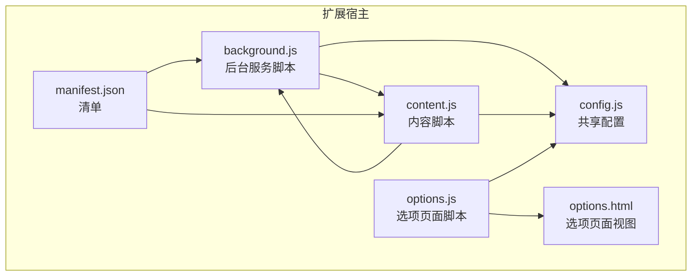
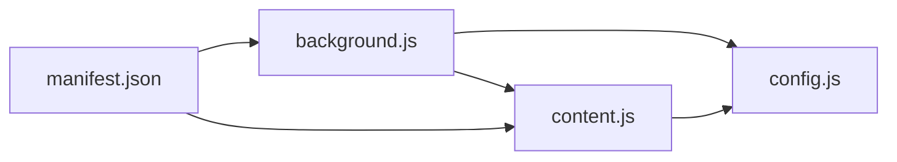

# 图片处理逻辑

<cite>
**本文引用的文件列表**
- [background.js](file://background.js)
- [content.js](file://content.js)
- [config.js](file://config.js)
- [manifest.json](file://manifest.json)
- [options.js](file://options.js)
- [options.html](file://options.html)
</cite>

## 目录
1. [简介](#简介)
2. [项目结构](#项目结构)
3. [核心组件](#核心组件)
4. [架构总览](#架构总览)
5. [详细组件分析](#详细组件分析)
6. [依赖关系分析](#依赖关系分析)
7. [性能考量](#性能考量)
8. [故障排查指南](#故障排查指南)
9. [结论](#结论)
10. [附录](#附录)

## 简介
本文件聚焦于 Img2Prompt 的图片处理能力，围绕后台服务脚本中的图片获取与压缩流程展开，系统性阐述：
- fetchAndCompressImage 的实现路径与算法细节
- 支持的图片格式与转换策略（JPEG）
- 压缩参数与质量控制
- 内存优化与跨域安全处理
- 错误分类与边界情况处理
- 如何扩展自定义压缩算法
- 不同来源图片数据的处理方式（URL、Data URL、剪贴板）

## 项目结构
该扩展采用 Manifest V3 架构，核心由后台服务脚本、内容脚本、选项页面与共享配置组成。图片处理主要发生在后台服务脚本中，内容脚本负责触发与进度反馈，选项页面负责参数配置。



图表来源
- [background.js](file://background.js)
- [content.js](file://content.js)
- [config.js](file://config.js)
- [manifest.json](file://manifest.json)
- [options.js](file://options.js)
- [options.html](file://options.html)

章节来源
- [manifest.json](file://manifest.json)
- [background.js](file://background.js)
- [content.js](file://content.js)
- [config.js](file://config.js)
- [options.js](file://options.js)
- [options.html](file://options.html)

## 核心组件
- 图片获取与压缩统一入口：fetchAndCompressImage
- 数据 URL 处理：compressImageDataUrl
- Blob 转换与尺寸压缩：compressImageBlob
- Blob 到 Data URL：blobToDataUrl
- 进度与消息传递：sendProgress、sendTabMessage
- 错误分类与用户提示：classifyError、getUserErrorMessage

章节来源
- [background.js](file://background.js)

## 架构总览
图片处理在后台服务脚本中执行，遵循“统一入口、统一压缩”的策略。无论输入是远程 URL 还是 Data URL，最终都会被转换为 JPEG 的 Data URL，以便后续模型调用。

```mermaid
sequenceDiagram
participant CT as "内容脚本<br/>content.js"
participant BG as "后台脚本<br/>background.js"
participant NET as "网络层"
participant IMG as "图像解码器<br/>createImageBitmap"
participant CAN as "离屏画布<br/>OffscreenCanvas"
participant FS as "文件读取器<br/>FileReader"
CT->>BG : "prompt : begin-generation"<br/>携带 srcUrl 或 imageDataUrl
BG->>BG : "fetchAndCompressImage(srcUrl, maxEdge)"
alt 输入为 Data URL
BG->>NET : "fetch(dataUrl)"
NET-->>BG : "blob"
else 输入为远程 URL
BG->>NET : "fetch(url, {signal})"
NET-->>BG : "响应(可能非 image/*)"
BG->>BG : "校验 content-type 并警告"
NET-->>BG : "blob"
end
BG->>IMG : "createImageBitmap(blob)"
IMG-->>BG : "ImageBitmap"
BG->>CAN : "OffscreenCanvas(tw, th)"
BG->>CAN : "drawImage(ImageBitmap)"
CAN-->>BG : "convertToBlob(image/jpeg, quality)"
BG->>FS : "readAsDataURL(blob)"
FS-->>BG : "data : image/jpeg;base64,..."
BG-->>CT : "进度与结果"
```

图表来源
- [background.js](file://background.js)
- [content.js](file://content.js)

## 详细组件分析

### fetchAndCompressImage：统一入口与算法
- 输入支持：字符串 URL（远程或 Data URL）
- 行为：
  - 若为 Data URL，直接解码为 Blob
  - 若为远程 URL，发起请求并校验 Content-Type，随后解码为 Blob
  - 将 Blob 通过 createImageBitmap 解码为位图
  - 使用 OffscreenCanvas 进行尺寸缩放与绘制
  - 将结果转换为 JPEG Blob，再转为 Data URL
- 输出：标准的 data:image/jpeg;base64,... 字符串
- 关键点：
  - 统一尺寸上限：maxEdge（来自设置）
  - 统一质量：JPEG 质量固定为 0.92
  - 统一格式：始终输出 JPEG Data URL
  - 安全：远程请求带 AbortSignal，避免长时间挂起

章节来源
- [background.js](file://background.js)

### compressImageDataUrl：Data URL 路径
- 将 Data URL 通过 fetch 转为 Blob，再进入统一的 compressImageBlob 流程
- 适用场景：剪贴板粘贴、截图裁切等直接得到 Data URL 的情形

章节来源
- [background.js](file://background.js)

### compressImageBlob：尺寸压缩与像素渲染
- 步骤：
  - createImageBitmap：解码任意图像格式为 ImageBitmap
  - 计算目标尺寸 tw/th：按最大边不超过 maxEdge 等比缩放
  - OffscreenCanvas：创建离屏画布并绘制缩放后的图像
  - convertToBlob：导出 JPEG，质量 0.92
  - blobToDataUrl：FileReader 读取为 Data URL
- 性能与内存：
  - 使用 OffscreenCanvas 避免主线程阻塞
  - ImageBitmap 在使用后及时关闭以释放资源
  - 质量与尺寸共同决定最终体积

章节来源
- [background.js](file://background.js)

### blobToDataUrl：二进制到 Base64
- 作用：将 Blob 转为 Data URL，供后续模型调用
- 注意：该函数本身不改变图像内容，仅做编码

章节来源
- [background.js](file://background.js)

### 进度与消息传递：sendProgress 与 sendTabMessage
- sendProgress：向内容脚本发送阶段进度与文本
- sendTabMessage：封装消息发送，忽略“接收端不存在”类错误，避免干扰主流程

章节来源
- [background.js](file://background.js)

### 错误分类与用户提示：classifyError 与 getUserErrorMessage
- 分类维度：网络、图片获取、图片处理、鉴权、限流、超时、JSON 解析、字段缺失、取消、未知
- 用户提示：根据语言环境映射到 UI_STRINGS 中的友好文案

章节来源
- [background.js](file://background.js)
- [config.js](file://config.js)

### 内容脚本中的图片处理补充：截图裁切
- 截图工具通过 canvas 对 Data URL 进行裁剪，再以 JPEG 质量 0.92 导出为 Data URL
- 该路径与后台统一入口互补，覆盖“本地生成”的图片场景

章节来源
- [content.js](file://content.js)

## 依赖关系分析



图表来源
- [background.js](file://background.js)
- [content.js](file://content.js)
- [config.js](file://config.js)
- [manifest.json](file://manifest.json)

章节来源
- [background.js](file://background.js)
- [content.js](file://content.js)
- [config.js](file://config.js)
- [manifest.json](file://manifest.json)

## 性能考量
- 尺寸控制：通过 maxEdge 控制最大边，显著降低体积与传输时间
- 质量控制：JPEG 质量 0.92 在清晰度与体积间取得平衡
- 异步与离屏：OffscreenCanvas 与 createImageBitmap 避免主线程阻塞
- 取消与超时：AbortController 与信号传递，确保长耗时操作可中断
- 缓存策略：远程请求使用 no-store，避免缓存污染

章节来源
- [background.js](file://background.js)
- [options.js](file://options.js)
- [options.html](file://options.html)

## 故障排查指南
- 常见错误类型与定位
  - 网络错误：检查网络连通与代理设置
  - 图片获取失败：确认 URL 可访问、无跨域限制
  - 图片处理失败：检查是否为有效图像、尺寸是否过大
  - 鉴权失败：核对 API Key 与 Endpoint
  - 限流：降低分辨率或等待配额恢复
  - 超时：降低分辨率或提升网络质量
  - JSON 解析失败：调整 System Prompt，确保输出纯 JSON
  - 字段缺失：确保返回包含 zh/en
  - 取消：用户主动取消或超时导致
- 边界情况
  - 空 Blob：直接抛出错误
  - 非 image/*：记录警告但继续处理（部分场景仍可解码）
  - Data URL 非法：统一走 fetch 解码，失败则报处理失败
- 建议
  - 在选项页调整 maxImageEdge 以适配不同网络与设备
  - 使用“取消生成”按钮中断长时间任务
  - 遇到跨域问题时优先使用 Data URL 或本地生成的图片

章节来源
- [background.js](file://background.js)
- [config.js](file://config.js)

## 结论
Img2Prompt 的图片处理以“统一入口、统一压缩”为核心设计，通过 OffscreenCanvas 与 createImageBitmap 实现高效、安全的尺寸压缩与格式统一，最终输出稳定的 JPEG Data URL，满足模型调用需求。配合完善的错误分类与用户提示，能够在多变的网络与跨域环境中保持稳定表现。

## 附录

### 图片格式与压缩参数
- 支持格式：任何可被 createImageBitmap 解码的图像格式（如 PNG、WebP、GIF 等）
- 输出格式：统一为 JPEG（data:image/jpeg;base64,...）
- 尺寸上限：maxEdge（默认 1024，可在选项页调整）
- 质量：0.92（固定）
- 关键实现参考
  - [compressImageBlob](file://background.js)
  - [blobToDataUrl](file://background.js)

章节来源
- [background.js](file://background.js)

### 自定义压缩算法建议
- 扩展点
  - 替换 convertToBlob 的 type 与 quality 参数，以适配不同场景
  - 在 drawImage 前加入滤镜或色彩空间转换（需额外 Canvas API）
  - 保留尺寸计算逻辑，确保 maxEdge 生效
- 注意事项
  - 保持输出为 Data URL，便于模型调用
  - 控制内存峰值，避免大图直接解码
  - 保证错误路径一致，便于统一分类与提示

章节来源
- [background.js](file://background.js)

### 不同来源图片数据的处理
- 远程 URL
  - fetch 获取 Blob，createImageBitmap 解码，OffscreenCanvas 压缩
  - 参考：[fetchAndCompressImage](file://background.js)
- Data URL
  - 直接 fetch 解码为 Blob，进入统一流程
  - 参考：[compressImageDataUrl](file://background.js)
- 剪贴板/截图
  - 内容脚本使用 canvas 裁剪并导出 JPEG Data URL
  - 参考：[content.js 截图裁切逻辑](file://content.js)

章节来源
- [background.js](file://background.js)
- [content.js](file://content.js)

### 安全与跨域处理
- 跨域
  - 远程图片请求若受 CORS 限制，将导致 fetch 失败；建议使用 Data URL 或本地生成
- 数据安全
  - 所有图片数据在内存中进行解码与压缩，不持久化至磁盘
  - 输出仅为 Data URL，不暴露原始网络地址
- 最佳实践
  - 优先使用本地生成或受信任源的 Data URL
  - 避免在不可信页面粘贴图片，防止敏感信息泄露

章节来源
- [background.js](file://background.js)
- [content.js](file://content.js)

### 配置与参数
- 关键设置项
  - maxImageEdge：最大边像素数（512/768/1024/1280）
  - uiLanguage：界面语言（zh/en）
  - apiEndpoint、apiKey、model：模型调用参数
- 设置来源
  - [config.js 默认设置](file://config.js)
  - [options.js 选项页逻辑](file://options.js)
  - [options.html 视图](file://options.html)

章节来源
- [config.js](file://config.js)
- [options.js](file://options.js)
- [options.html](file://options.html)