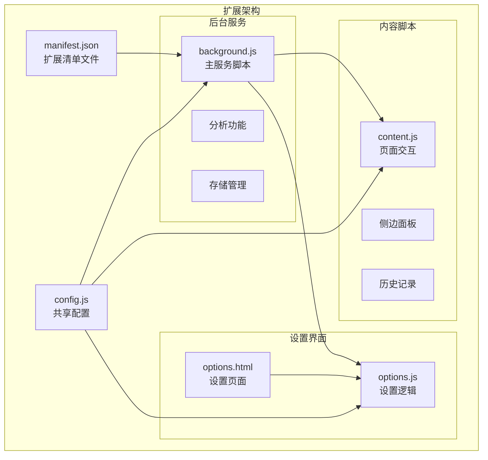
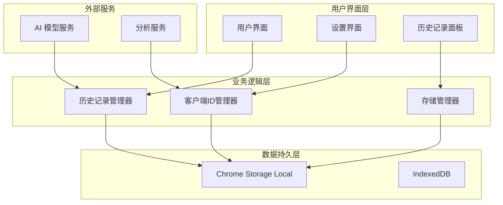
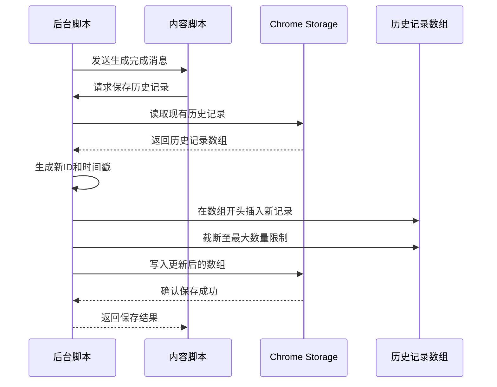
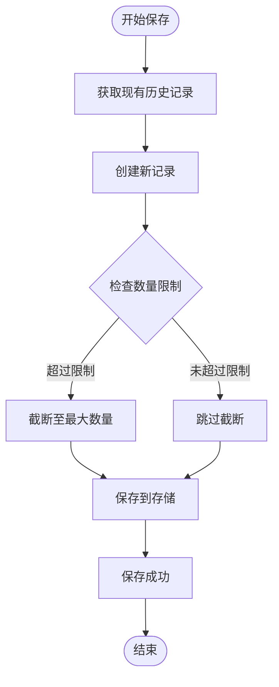
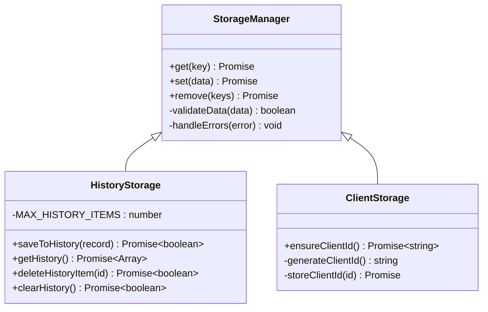
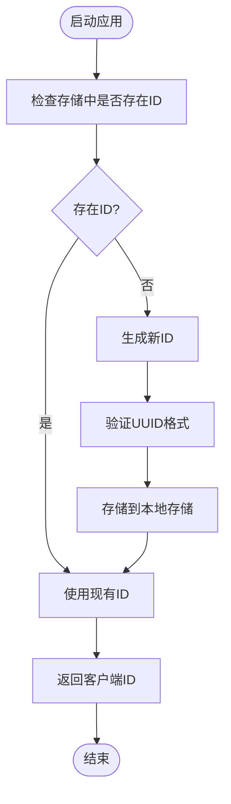
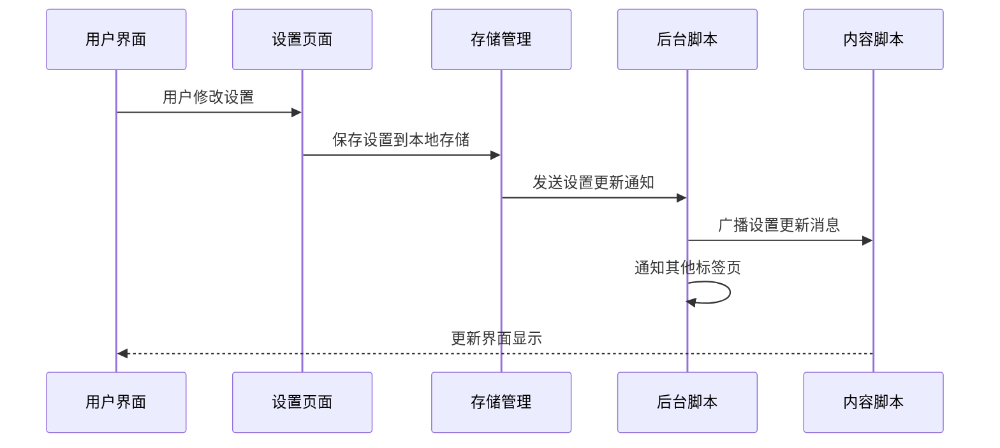
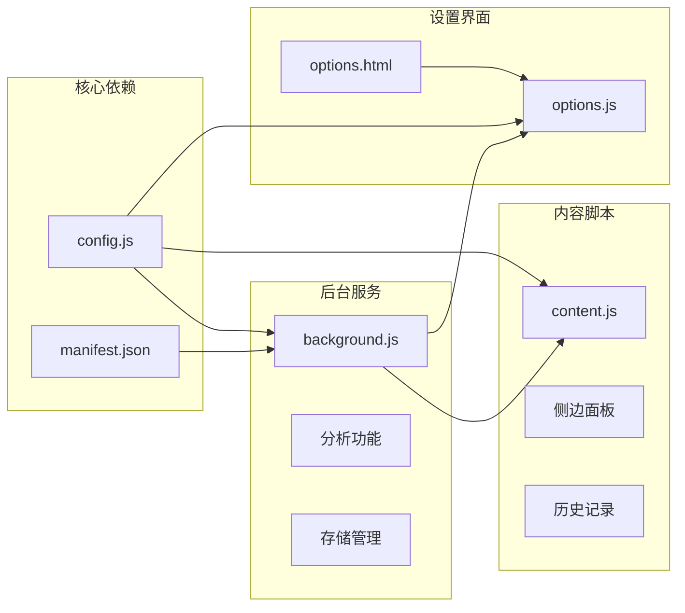
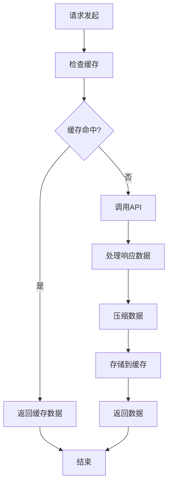
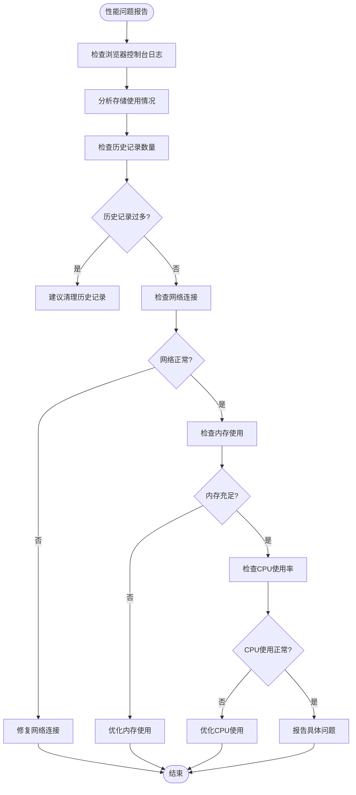

# 数据管理与存储

<cite>
**本文档引用的文件**
- [background.js](file://background.js)
- [content.js](file://content.js)
- [options.js](file://options.js)
- [config.js](file://config.js)
- [manifest.json](file://manifest.json)
- [options.html](file://options.html)
</cite>

## 目录
1. [简介](#简介)
2. [项目结构](#项目结构)
3. [核心组件](#核心组件)
4. [架构概览](#架构概览)
5. [详细组件分析](#详细组件分析)
6. [依赖关系分析](#依赖关系分析)
7. [性能考虑](#性能考虑)
8. [故障排除指南](#故障排除指南)
9. [结论](#结论)

## 简介

Img2Prompt 是一个基于 Chrome 扩展的数据管理系统，专注于图像到提示词的转换功能。该系统实现了完整的历史记录管理功能，包括数据持久化、客户端ID生成与管理、以及用户标识的安全保障。本文档深入分析了系统的数据管理架构，重点涵盖历史记录管理功能的实现细节、Chrome Storage API 的使用方式、数据结构设计、数据大小限制处理策略，以及客户端ID生成和管理机制。

## 项目结构

Img2Prompt 采用模块化的项目结构，主要由以下几个核心部分组成：

**图表来源**
- [manifest.json:1-45](file://manifest.json#L1-L45)
- [config.js:1-253](file://config.js#L1-L253)

**章节来源**
- [manifest.json:1-45](file://manifest.json#L1-L45)
- [config.js:1-253](file://config.js#L1-L253)

## 核心组件

### 历史记录管理组件

系统的核心数据管理功能围绕历史记录展开，提供了完整的 CRUD 操作：

- **saveToHistory**: 将生成的提示词保存到历史记录
- **getHistory**: 获取所有历史记录条目
- **deleteHistoryItem**: 删除指定的历史记录项
- **clearHistory**: 清空所有历史记录

### 客户端ID管理组件

系统通过唯一的客户端ID确保用户标识的唯一性和安全性：

- **ensureClientId**: 确保客户端ID的存在和唯一性
- **clientId 存储**: 使用 Chrome Storage API 持久化存储

### 存储管理组件

基于 Chrome Storage API 实现的数据持久化：

- **chrome.storage.local**: 本地存储，适合小量数据
- **数据结构设计**: JSON 格式的数组存储
- **大小限制处理**: 自动限制历史记录数量

**章节来源**
- [background.js:412-463](file://background.js#L412-L463)
- [background.js:330-341](file://background.js#L330-L341)

## 架构概览

系统采用分层架构设计，实现了清晰的职责分离：

**图表来源**
- [background.js:13-17](file://background.js#L13-L17)
- [background.js:412-463](file://background.js#L412-L463)

## 详细组件分析

### 历史记录管理实现

#### saveToHistory 函数分析

历史记录保存功能实现了完整的数据持久化流程：

**图表来源**
- [background.js:272-279](file://background.js#L272-L279)
- [background.js:412-430](file://background.js#L412-L430)

#### 数据结构设计

历史记录采用统一的数据结构，确保跨平台兼容性和查询效率：

| 字段名 | 类型 | 描述 | 必需 |
|--------|------|------|------|
| id | string | 唯一标识符，使用 UUID v4 | 是 |
| timestamp | number | 时间戳，精确到毫秒 | 是 |
| prompts | object | 提示词对象，包含 zh 和 en 字段 | 是 |
| srcUrl | string | 原始图片URL | 否 |
| imageDataUrl | string | 处理后的图片数据URL | 否 |
| pageUrl | string | 页面URL | 否 |
| model | string | 使用的模型名称 | 否 |
| trigger | string | 触发方式 | 否 |

#### 数据大小限制处理

系统实现了智能的数据大小限制机制：

**图表来源**
- [background.js:412-430](file://background.js#L412-L430)

**章节来源**
- [background.js:412-463](file://background.js#L412-L463)

### Chrome Storage API 使用详解

#### 存储键值设计

系统使用精心设计的存储键值来组织不同类型的数据：

| 键名 | 类型 | 描述 | 存储位置 |
|------|------|------|----------|
| clientId | string | 客户端唯一标识符 | chrome.storage.local |
| promptHistory | array | 历史记录数组 | chrome.storage.local |
| customTemplates | object | 自定义模板集合 | chrome.storage.local |
| analyticsConfig | boolean | 分析功能开关 | chrome.storage.local |

#### 异步操作模式

所有存储操作都采用异步模式，确保用户体验的流畅性：

**图表来源**
- [background.js:412-463](file://background.js#L412-L463)
- [background.js:330-341](file://background.js#L330-L341)

**章节来源**
- [background.js:330-341](file://background.js#L330-L341)
- [background.js:412-463](file://background.js#L412-L463)

### 客户端ID生成与管理

#### 唯一性保证机制

系统通过多种机制确保客户端ID的唯一性和安全性：

**图表来源**
- [background.js:330-341](file://background.js#L330-L341)

#### 安全性考虑

客户端ID生成采用了现代加密安全的随机数生成算法：

- **UUID v4**: 使用 cryptographically secure random number generator
- **去中心化**: 每个安装实例都有独立的ID
- **不可追踪**: ID与用户身份解耦，保护用户隐私

**章节来源**
- [background.js:330-341](file://background.js#L330-L341)

### 设置管理与同步

#### 设置存储机制

系统实现了完整的设置管理功能：

**图表来源**
- [options.js:387-405](file://options.js#L387-L405)
- [background.js:134-147](file://background.js#L134-L147)

**章节来源**
- [options.js:387-405](file://options.js#L387-L405)
- [background.js:134-147](file://background.js#L134-L147)

## 依赖关系分析

### 组件间依赖关系

**图表来源**
- [config.js:1-253](file://config.js#L1-L253)
- [manifest.json:1-45](file://manifest.json#L1-L45)

### 外部依赖

系统对外部依赖的管理：

| 依赖类型 | 用途 | 版本要求 | 安全考虑 |
|----------|------|----------|----------|
| Chrome Extensions API | 扩展功能 | Manifest V3 | 受浏览器沙箱保护 |
| PostHog Analytics | 用户行为分析 | 最新版本 | 数据匿名化处理 |
| OpenAI API | AI 模型调用 | 兼容接口 | API 密钥本地存储 |
| Local Storage | 数据持久化 | 浏览器内置 | 加密存储支持 |

**章节来源**
- [manifest.json:38-43](file://manifest.json#L38-L43)
- [config.js:249-252](file://config.js#L249-L252)

## 性能考虑

### 存储性能优化

系统采用了多项性能优化策略：

#### 异步存储操作
- 所有存储操作都是异步的，避免阻塞主线程
- 使用 Promise 链式调用提高代码可读性
- 错误处理采用 try-catch 模式

#### 数据压缩策略
- 图片数据自动压缩到 1024px 边界
- JPEG 格式转换，质量 0.92
- Base64 编码优化，减少存储空间

#### 内存管理
- 历史记录数量限制为 50 项
- 自动清理过期数据
- 及时释放内存资源

### 网络性能优化

**图表来源**
- [background.js:775-849](file://background.js#L775-L849)

**章节来源**
- [background.js:775-849](file://background.js#L775-L849)

## 故障排除指南

### 常见问题诊断

#### 存储相关问题

| 问题症状 | 可能原因 | 解决方案 |
|----------|----------|----------|
| 历史记录丢失 | 存储空间不足 | 清理历史记录或增加存储容量 |
| 客户端ID重复 | 浏览器缓存问题 | 清除浏览器缓存重新安装扩展 |
| 设置无法保存 | 权限不足 | 检查扩展权限设置 |
| 数据同步失败 | 网络连接问题 | 检查网络连接状态 |

#### 性能问题诊断

**图表来源**
- [background.js:872-945](file://background.js#L872-L945)

### 调试工具使用

#### 开发者工具集成

系统提供了完善的调试支持：

- **Chrome DevTools**: 支持扩展开发和调试
- **存储检查**: 查看和编辑本地存储数据
- **网络监控**: 监控 API 调用和响应
- **错误日志**: 记录详细的错误信息

**章节来源**
- [background.js:872-945](file://background.js#L872-L945)

## 结论

Img2Prompt 的数据管理系统展现了现代浏览器扩展的最佳实践。通过精心设计的架构，系统实现了：

1. **可靠的持久化存储**: 基于 Chrome Storage API 的稳定数据管理
2. **高效的性能表现**: 异步操作和智能缓存策略
3. **强大的扩展性**: 模块化设计便于功能扩展
4. **严格的安全保障**: 客户端ID生成和数据隐私保护

系统的核心优势在于其简洁而强大的历史记录管理功能，通过有限的状态机设计实现了复杂的数据管理需求。同时，系统的架构设计充分考虑了可维护性和可扩展性，为未来的功能增强奠定了坚实基础。

对于开发者而言，该系统提供了优秀的参考实现，展示了如何在浏览器扩展环境中高效地管理数据、处理异步操作、以及实现用户隐私保护等关键功能。