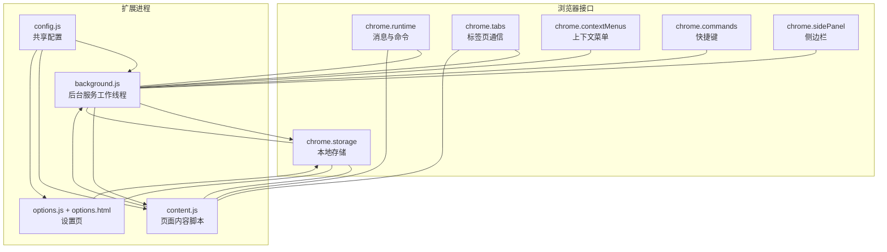
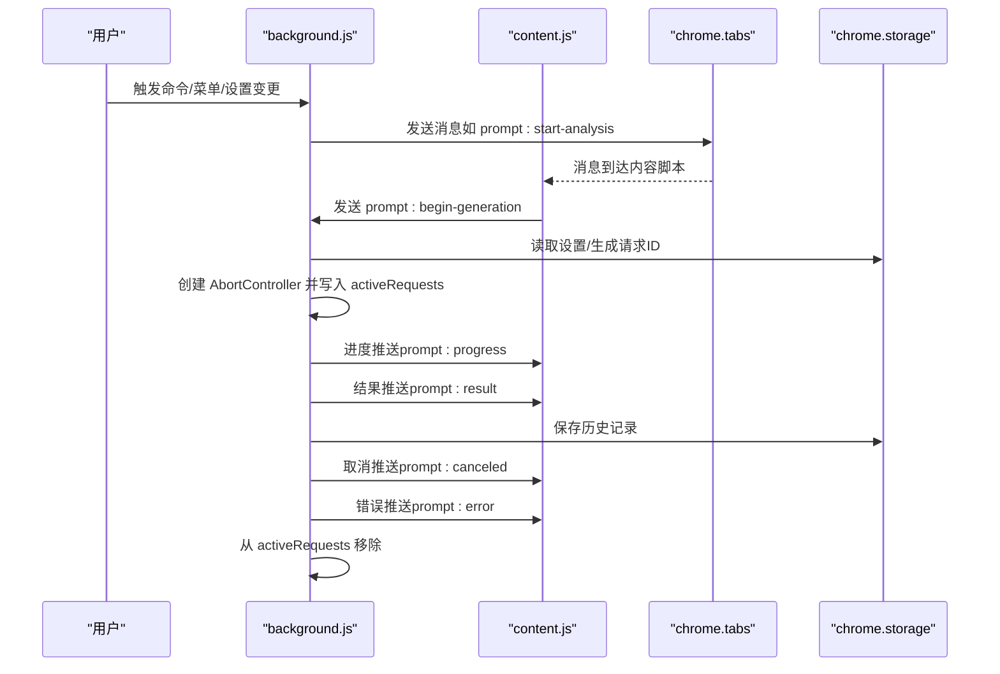
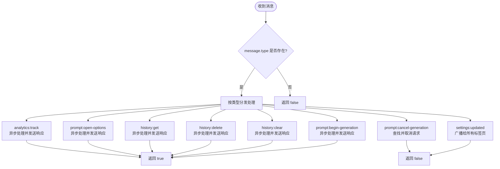
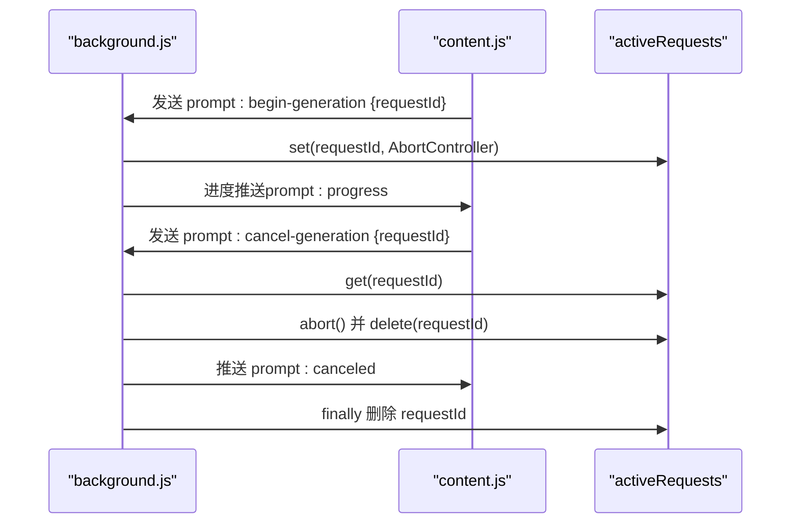
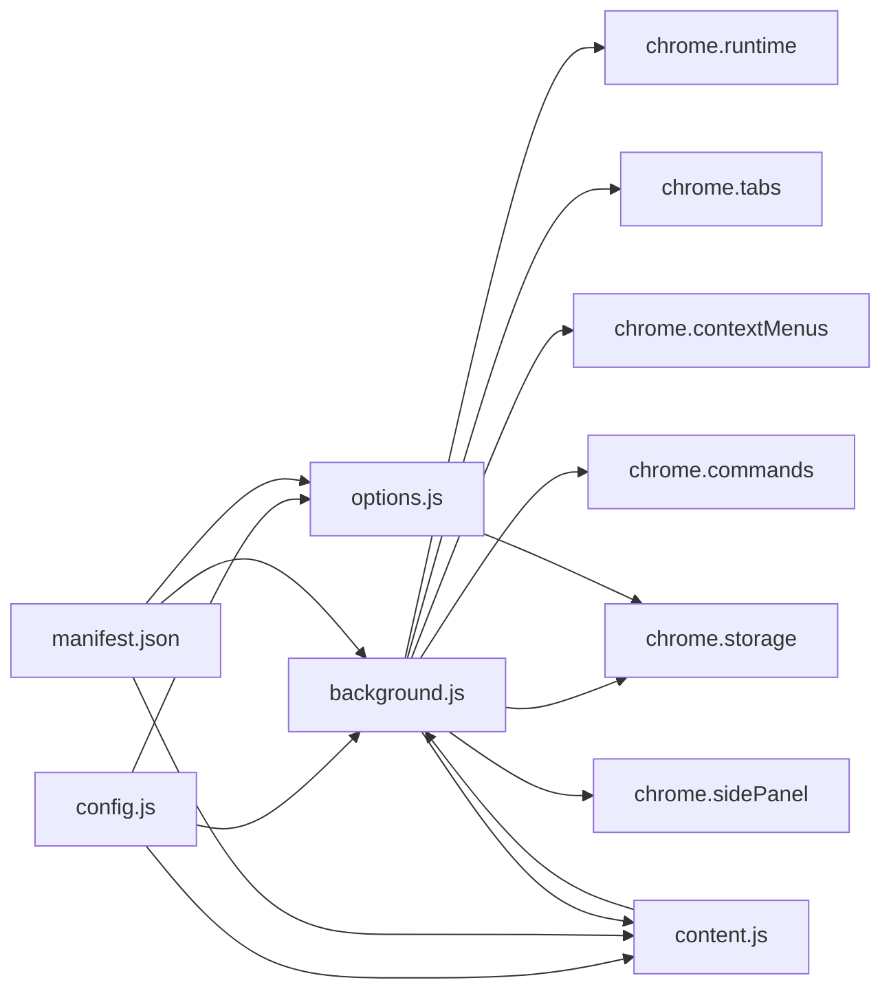

# 消息处理机制

<cite>
**本文引用的文件**
- [background.js](file://background.js)
- [content.js](file://content.js)
- [options.js](file://options.js)
- [manifest.json](file://manifest.json)
- [config.js](file://config.js)
- [options.html](file://options.html)
</cite>

## 目录
1. [简介](#简介)
2. [项目结构](#项目结构)
3. [核心组件](#核心组件)
4. [架构总览](#架构总览)
5. [详细组件分析](#详细组件分析)
6. [依赖关系分析](#依赖关系分析)
7. [性能考量](#性能考量)
8. [故障排查指南](#故障排查指南)
9. [结论](#结论)

## 简介
本文件聚焦 Img2Prompt 扩展的消息处理机制，系统性阐述后台脚本（background）与内容脚本（content）之间的消息路由、请求生命周期管理、异步响应模式、错误分类与处理策略。重点覆盖：
- chrome.runtime.onMessage 事件监听器的类型分发逻辑
- 不同消息类型的处理流程（analytics:track、prompt:open-options、prompt:cancel-generation、settings:updated 等）
- activeRequests 映射表的管理（请求ID生成、跟踪、取消）
- 新增消息类型的扩展方法、消息响应模式与异步返回值处理
- 错误处理策略与最佳实践

## 项目结构
该扩展采用 Manifest V3 架构，主要由以下模块组成：
- 后台脚本 background.js：负责全局状态、消息路由、生成流程编排、历史记录与分析事件上报
- 内容脚本 content.js：负责页面交互、UI 面板渲染、进度与结果回传、用户操作响应
- 设置页 options.js + options.html：负责设置项编辑、历史记录展示与管理、设置变更通知
- 配置文件 config.js：共享默认设置、UI 文案、错误码与分析配置
- 清单 manifest.json：声明权限、命令、侧边栏与内容脚本注入

图表来源
- [manifest.json:10-41](file://manifest.json#L10-L41)
- [background.js:17-184](file://background.js#L17-L184)
- [content.js:209-247](file://content.js#L209-L247)
- [options.js:182-405](file://options.js#L182-L405)

章节来源
- [manifest.json:1-45](file://manifest.json#L1-L45)
- [background.js:17-184](file://background.js#L17-L184)
- [content.js:209-247](file://content.js#L209-L247)
- [options.js:182-405](file://options.js#L182-L405)
- [config.js:4-253](file://config.js#L4-L253)

## 核心组件
- 后台消息监听器（onMessage）：集中处理来自内容脚本与扩展内部的消息，按 message.type 分发至对应处理器；对需要异步处理的消息返回 true 以保持通道开放，确保 sendResponse 可在后续回调中调用
- activeRequests 映射表：以 requestId 为键，存储 AbortController 实例，用于生成阶段的取消控制
- 进度与结果推送：通过 sendProgress/sendTabMessage 将阶段性状态推送到内容脚本，驱动 UI 更新
- 设置更新广播：当设置变更时，向所有活跃标签页广播 settings:updated，确保 UI 即时同步
- 历史记录管理：提供历史记录的获取、删除与清空，配合内容脚本与设置页使用

章节来源
- [background.js:94-184](file://background.js#L94-L184)
- [background.js:17-17](file://background.js#L17-L17)
- [background.js:851-870](file://background.js#L851-L870)
- [background.js:134-147](file://background.js#L134-L147)
- [background.js:432-463](file://background.js#L432-L463)

## 架构总览
消息流从触发源（上下文菜单、快捷键、设置页、内容脚本）进入 chrome.runtime，后台脚本根据消息类型执行相应逻辑，必要时通过 chrome.tabs.sendMessage 将进度、结果或错误回传给内容脚本，最终由内容脚本更新 UI。

图表来源
- [background.js:94-184](file://background.js#L94-L184)
- [background.js:212-320](file://background.js#L212-L320)
- [content.js:209-247](file://content.js#L209-L247)
- [content.js:249-326](file://content.js#L249-L326)

## 详细组件分析

### 后台消息监听器与路由机制
- 类型分发：后台脚本通过 if/else-if 判断 message.type，分别处理 analytics:track、prompt:open-options、prompt:cancel-generation、settings:updated、history:*、prompt:begin-generation 等
- 异步响应模式：对于需要异步处理的消息（如 analytics:track、prompt:begin-generation、history:*），返回 true 以保持消息通道开放，随后在异步回调中调用 sendResponse 发送响应
- 同步响应模式：对于不需要异步处理的消息（如 prompt:open-options），在处理完成后立即 sendResponse 并返回 false

图表来源
- [background.js:94-184](file://background.js#L94-L184)

章节来源
- [background.js:94-184](file://background.js#L94-L184)

### activeRequests 映射表管理
- 请求ID生成：在上下文菜单点击与快捷键捕获时，使用 crypto.randomUUID() 生成唯一 requestId，并随消息传递
- 请求跟踪：processGeneration 中为每个请求创建 AbortController 并存入 activeRequests，键为 requestId
- 取消机制：prompt:cancel-generation 收到后，从 activeRequests 获取对应控制器并调用 abort，清理映射表，向内容脚本推送 prompt:canceled 并上报分析事件
- 生命周期结束：无论成功、取消或失败，均在 finally 中从 activeRequests 删除对应条目，避免内存泄漏

图表来源
- [background.js:64-72](file://background.js#L64-L72)
- [background.js:122-132](file://background.js#L122-L132)
- [background.js:219-220](file://background.js#L219-L220)
- [background.js:282-294](file://background.js#L282-L294)
- [background.js:317-319](file://background.js#L317-L319)

章节来源
- [background.js:17-17](file://background.js#L17-L17)
- [background.js:64-72](file://background.js#L64-L72)
- [background.js:122-132](file://background.js#L122-L132)
- [background.js:212-320](file://background.js#L212-L320)

### 消息类型详解与处理流程

#### analytics:track
- 功能：安全地上报分析事件，支持开关控制与错误兜底
- 处理要点：异步调用 trackAnalyticsEvent，成功则 sendResponse({ ok: true, sent })，失败则返回错误信息
- 安全性：safeTrackAnalyticsEvent 包裹，避免异常影响主线程

章节来源
- [background.js:95-108](file://background.js#L95-L108)
- [background.js:404-410](file://background.js#L404-L410)

#### prompt:open-options
- 功能：打开侧边栏设置面板
- 处理要点：异步打开侧边栏，sendResponse({ ok: true }) 或返回错误信息
- 兼容性：若浏览器不支持 sidePanel API，则抛出明确错误

章节来源
- [background.js:110-120](file://background.js#L110-L120)
- [background.js:186-210](file://background.js#L186-L210)

#### prompt:cancel-generation
- 功能：取消正在进行的生成请求
- 处理要点：根据 requestId 查找 AbortController，调用 abort 并清理映射表；向内容脚本推送 prompt:canceled；返回是否成功取消

章节来源
- [background.js:122-132](file://background.js#L122-L132)
- [background.js:282-294](file://background.js#L282-L294)

#### settings:updated
- 功能：广播设置更新，确保各标签页即时刷新 UI
- 处理要点：查询所有标签页并逐个发送 { type: "settings:updated" }，忽略不可达或未注入内容脚本的标签页

章节来源
- [background.js:134-147](file://background.js#L134-L147)
- [content.js:240-243](file://content.js#L240-L243)

#### history:get / history:delete / history:clear
- 功能：历史记录的获取、删除与清空
- 处理要点：异步读写 chrome.storage.local，sendResponse 返回 ok 与错误信息；clear 后通知内容脚本刷新

章节来源
- [background.js:149-168](file://background.js#L149-L168)
- [background.js:432-463](file://background.js#L432-L463)

#### prompt:begin-generation
- 功能：启动生成流程（图像获取、压缩、模型请求、结果解析、历史保存）
- 处理要点：创建 AbortController 并写入 activeRequests；分阶段推送进度；异常时分类错误并推送 prompt:error；成功后推送 prompt:result 并保存历史

章节来源
- [background.js:170-183](file://background.js#L170-L183)
- [background.js:212-320](file://background.js#L212-L320)

### 内容脚本消息处理与 UI 更新
- onMessage 分发：根据 message.type 在内容脚本内更新面板状态、进度、结果或错误
- 进度与结果：仅当 message.requestId 与当前 activeRequestId 匹配时才更新，避免跨请求污染
- 设置更新：收到 settings:updated 后重新加载设置并更新面板语言

章节来源
- [content.js:209-247](file://content.js#L209-L247)
- [content.js:249-326](file://content.js#L249-L326)
- [content.js:347-487](file://content.js#L347-L487)

### 设置页与消息交互
- 自动保存：handleAutoSave 在用户输入变化后延迟保存设置并广播 settings:updated
- 历史记录：通过 sendMessage 调用后台的 history:* 接口，实现列表渲染与删除清空
- 分析事件：trackSettingsSaved 主动上报设置保存事件

章节来源
- [options.js:387-405](file://options.js#L387-L405)
- [options.js:218-223](file://options.js#L218-L223)
- [options.js:321-326](file://options.js#L321-L326)
- [options.js:469-483](file://options.js#L469-L483)

## 依赖关系分析
- 配置依赖：config.js 提供 DEFAULT_SETTINGS、UI_STRINGS、ERROR_CODES、ERROR_MESSAGES、POSTHOG_* 等，被 background.js、content.js、options.js 共享
- 权限依赖：manifest.json 声明 contextMenus、storage、sidePanel、activeTab、commands 等权限，支撑消息路由与 UI 行为
- 通信依赖：chrome.runtime、chrome.tabs、chrome.storage、chrome.contextMenus、chrome.commands、chrome.sidePanel

图表来源
- [config.js:4-253](file://config.js#L4-L253)
- [manifest.json:10-41](file://manifest.json#L10-L41)
- [background.js:94-184](file://background.js#L94-L184)

章节来源
- [config.js:4-253](file://config.js#L4-L253)
- [manifest.json:10-41](file://manifest.json#L10-L41)
- [background.js:94-184](file://background.js#L94-L184)

## 性能考量
- 请求压缩：在后台统一进行图像获取与压缩，减少模型请求体积，提高成功率
- 进度推送：分阶段推送进度，避免一次性大量消息导致 UI 卡顿
- 取消控制：AbortController 与 activeRequests 协作，快速中断长耗时请求
- 存储访问：历史记录与设置读写集中在后台，避免重复 IO

## 故障排查指南
- 网络与鉴权错误：classifyError 对网络错误、401/403、429、超时、JSON 解析失败等进行分类，返回用户友好提示
- Extension context 错误：content.js 中 safeSendRuntimeMessage 对“扩展上下文失效”等错误进行识别与降级
- Receiving end does not exist：sendTabMessage 对此类错误进行吞吐，避免异常传播
- 分析事件失败：safeTrackAnalyticsEvent 对分析上报失败进行静默兜底

章节来源
- [background.js:872-939](file://background.js#L872-L939)
- [content.js:65-75](file://content.js#L65-L75)
- [background.js:861-870](file://background.js#L861-L870)
- [background.js:404-410](file://background.js#L404-L410)

## 结论
Img2Prompt 的消息处理机制以后台脚本为中心，通过 onMessage 的类型分发与 activeRequests 的请求生命周期管理，实现了从触发到结果回传的完整链路。异步响应模式与错误分类策略保证了稳定性与用户体验。新增消息类型时，应遵循现有模式：定义 type、在后台实现处理器、在内容脚本中注册 onMessage 分支、必要时通过 sendResponse 返回状态或错误信息，并在异常路径中清理资源与映射表。