# 错误处理与分类

<cite>
**本文档引用的文件**
- [background.js](file://background.js)
- [content.js](file://content.js)
- [config.js](file://config.js)
- [manifest.json](file://manifest.json)
- [_locales/en/messages.json](file://_locales/en/messages.json)
- [_locales/zh_CN/messages.json](file://_locales/zh_CN/messages.json)
</cite>

## 目录
1. [简介](#简介)
2. [项目结构](#项目结构)
3. [核心组件](#核心组件)
4. [架构概览](#架构概览)
5. [详细组件分析](#详细组件分析)
6. [依赖关系分析](#依赖关系分析)
7. [性能考虑](#性能考虑)
8. [故障排除指南](#故障排除指南)
9. [结论](#结论)

## 简介

Img2Prompt 是一个 Chrome 扩展程序，能够将图片转换为 AI 提示词。该系统实现了完善的错误处理和分类机制，通过统一的错误分类函数和本地化消息处理，为用户提供清晰、友好的错误反馈。

本系统的核心错误处理功能包括：
- **错误分类机制**：将各种异常情况归类为标准化的错误代码
- **本地化错误消息**：根据用户语言显示相应的错误提示
- **状态码处理策略**：针对不同的 HTTP 状态码提供特定的处理逻辑
- **用户体验优化**：提供渐进式的进度反馈和优雅的错误展示

## 项目结构

Img2Prompt 采用模块化的架构设计，主要由以下几个核心部分组成：

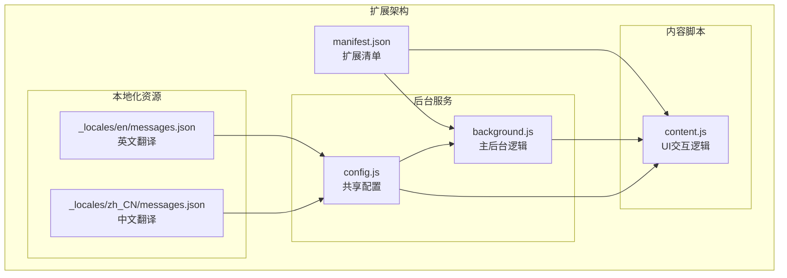

**图表来源**
- [manifest.json:1-45](file://manifest.json#L1-L45)
- [background.js:1-50](file://background.js#L1-L50)
- [content.js:1-50](file://content.js#L1-L50)
- [config.js:1-50](file://config.js#L1-L50)

**章节来源**
- [manifest.json:1-45](file://manifest.json#L1-L45)
- [background.js:1-100](file://background.js#L1-L100)
- [content.js:1-100](file://content.js#L1-L100)
- [config.js:1-50](file://config.js#L1-L50)

## 核心组件

### 错误分类系统

系统实现了统一的错误分类机制，通过 `classifyError` 函数将各种异常情况标准化为预定义的错误代码：

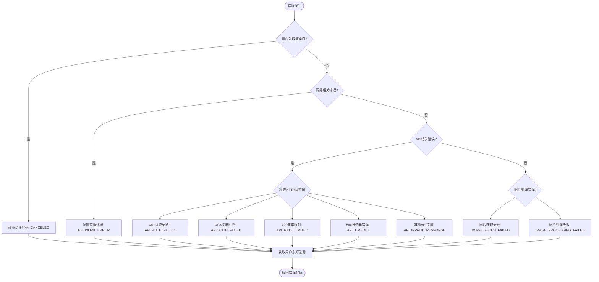

**图表来源**
- [background.js:296-316](file://background.js#L296-L316)
- [config.js:206-247](file://config.js#L206-L247)

### 本地化错误消息系统

系统通过 `getUserErrorMessage` 函数实现错误消息的本地化处理：

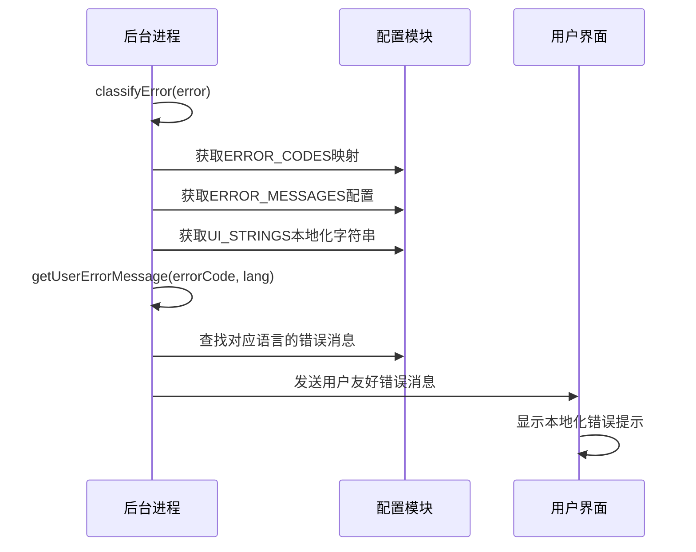

**图表来源**
- [background.js:296-305](file://background.js#L296-L305)
- [config.js:220-247](file://config.js#L220-L247)

**章节来源**
- [background.js:296-316](file://background.js#L296-L316)
- [config.js:206-247](file://config.js#L206-L247)

## 架构概览

### 错误处理流程

系统采用分层的错误处理架构，从底层的网络请求到上层的用户界面展示形成了完整的错误处理链路：

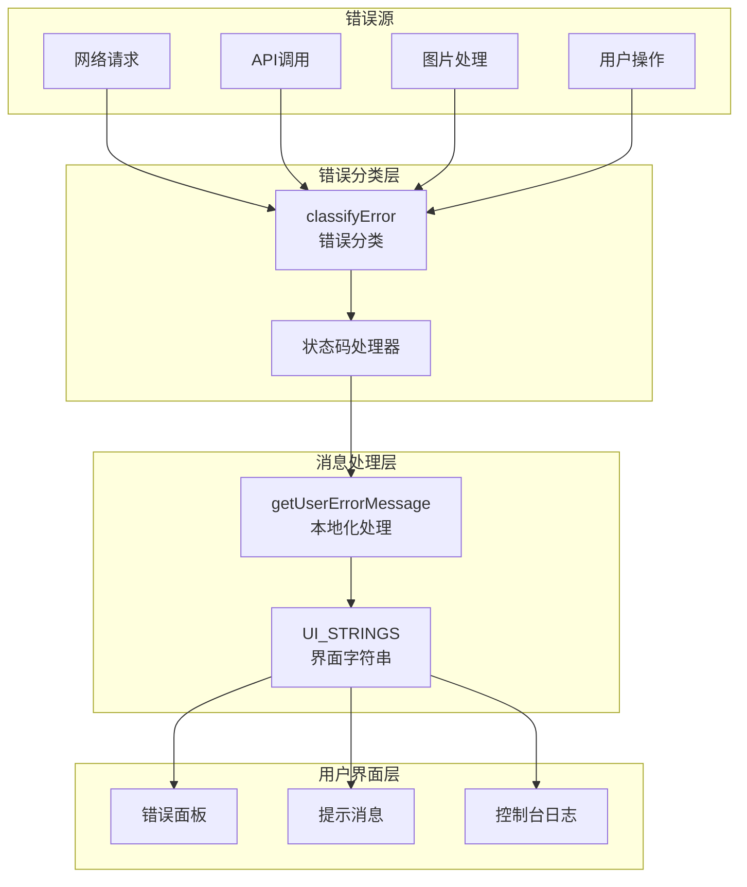

**图表来源**
- [background.js:296-316](file://background.js#L296-L316)
- [background.js:478-592](file://background.js#L478-L592)
- [config.js:32-113](file://config.js#L32-L113)

### 状态码处理策略

系统针对不同类型的 HTTP 状态码实现了专门的处理策略：

| 状态码 | 类型 | 处理策略 | 错误代码 |
|--------|------|----------|----------|
| 401 | 认证失败 | API_AUTH_FAILED | API密钥无效 |
| 403 | 权限拒绝 | API_AUTH_FAILED | 检查API权限 |
| 429 | 速率限制 | API_RATE_LIMITED | 等待后重试 |
| 408 | 请求超时 | API_TIMEOUT | 检查网络连接 |
| 5xx | 服务器错误 | API_TIMEOUT | 服务器暂时不可用 |
| 其他 | 其他错误 | API_INVALID_RESPONSE | 检查模型配置 |

**章节来源**
- [background.js:562-582](file://background.js#L562-L582)
- [background.js:635-654](file://background.js#L635-L654)

## 详细组件分析

### classifyError 函数分析

`classifyError` 函数是整个错误处理系统的核心，负责将各种异常情况标准化为统一的错误代码：

#### 错误分类逻辑

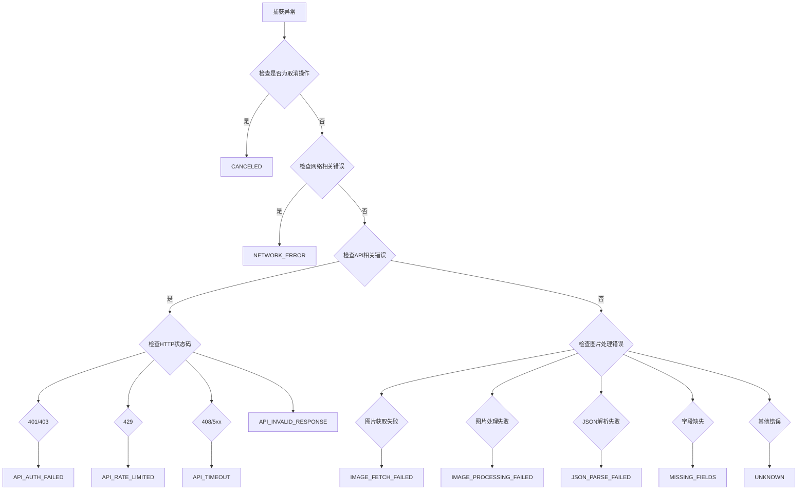

**图表来源**
- [background.js:296-316](file://background.js#L296-L316)

#### 错误分类实现要点

1. **优先级处理**：首先检查取消操作，然后按网络、API、图片处理的顺序进行分类
2. **状态码映射**：对HTTP状态码进行智能映射，区分认证失败、权限拒绝、速率限制等不同场景
3. **上下文感知**：根据错误发生的上下文（图片获取、API调用、JSON解析）提供准确的错误分类
4. **降级处理**：对于无法识别的错误，统一归类为 UNKNOWN 错误代码

**章节来源**
- [background.js:296-316](file://background.js#L296-L316)

### getUserErrorMessage 函数分析

`getUserErrorMessage` 函数负责将标准化的错误代码转换为用户友好的本地化消息：

#### 消息本地化流程

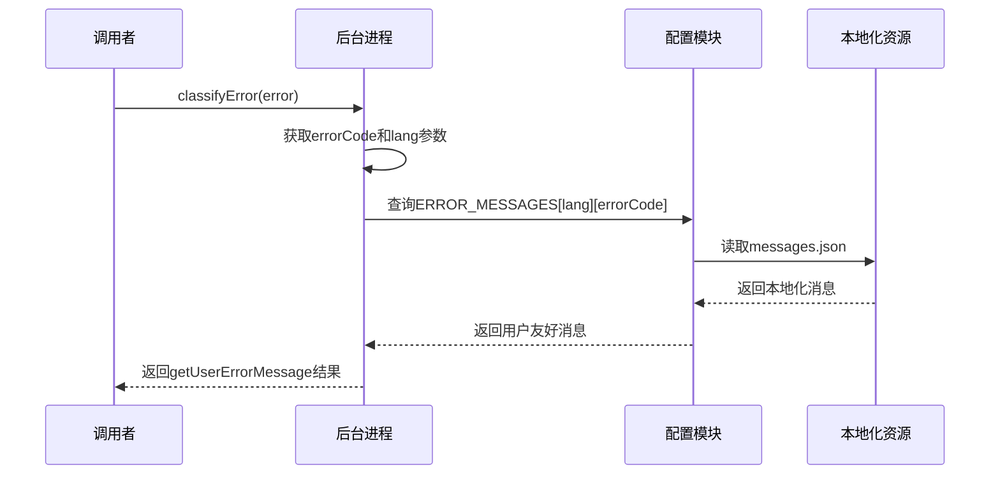

**图表来源**
- [background.js:296-305](file://background.js#L296-L305)
- [config.js:220-247](file://config.js#L220-L247)

#### 本地化实现机制

1. **语言检测**：根据用户设置的语言偏好自动选择相应的本地化资源
2. **消息映射**：通过 ERROR_CODES 和 ERROR_MESSAGES 的映射关系查找对应的本地化消息
3. **回退机制**：如果找不到特定语言的消息，自动回退到默认语言（中文）
4. **动态更新**：支持运行时语言切换，实时更新错误消息显示

**章节来源**
- [background.js:296-305](file://background.js#L296-L305)
- [config.js:220-247](file://config.js#L220-L247)

### 网络错误处理

系统实现了多层次的网络错误处理机制：

#### 网络连接错误分类

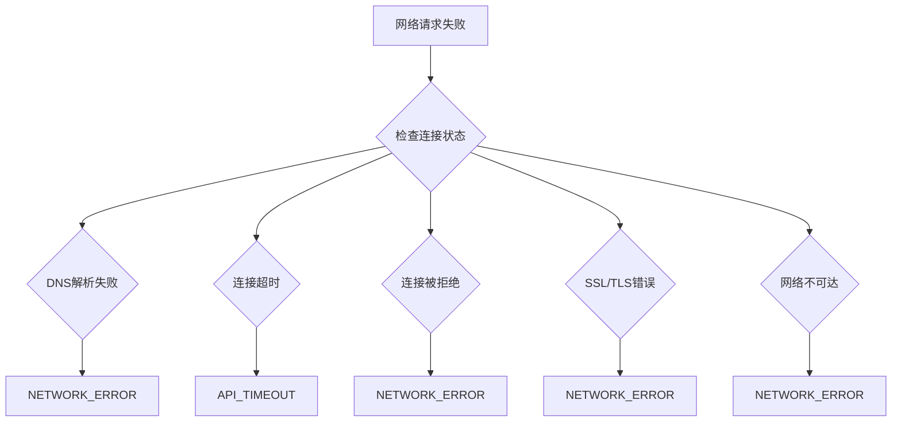

**图表来源**
- [background.js:792-794](file://background.js#L792-L794)
- [background.js:562-582](file://background.js#L562-L582)

#### 图片获取错误处理

系统对图片获取过程中的各种错误进行了专门处理：

1. **URL有效性检查**：验证图片URL的有效性和可访问性
2. **内容类型验证**：确保获取的内容确实是图片类型
3. **网络超时处理**：对长时间无响应的图片请求进行超时处理
4. **格式转换**：将不同格式的图片转换为统一的内部表示

**章节来源**
- [background.js:775-800](file://background.js#L775-L800)
- [background.js:562-582](file://background.js#L562-L582)

### API 错误处理

系统针对不同类型的API错误提供了专门的处理策略：

#### API 认证错误处理

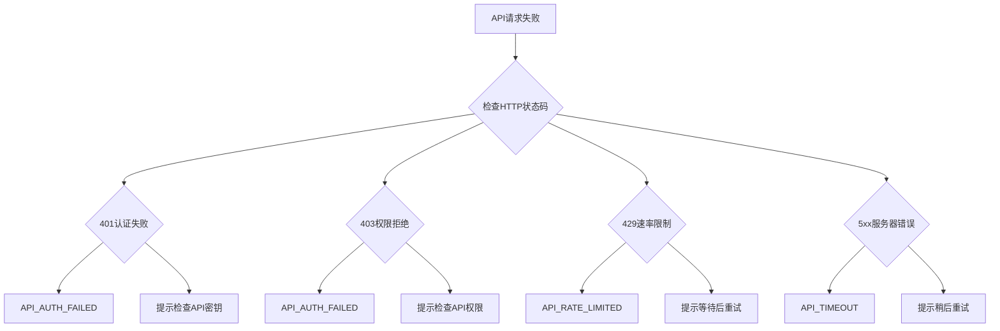

**图表来源**
- [background.js:568-582](file://background.js#L568-L582)
- [background.js:640-654](file://background.js#L640-L654)

#### API 响应处理

系统对API响应进行了严格的验证和处理：

1. **响应状态检查**：验证HTTP响应的状态码
2. **内容类型验证**：确保API返回的是期望的内容类型
3. **错误信息提取**：从API响应中提取有用的错误信息
4. **超时处理**：对长时间无响应的API请求进行超时处理

**章节来源**
- [background.js:562-592](file://background.js#L562-L592)
- [background.js:635-666](file://background.js#L635-L666)

### 配置错误处理

系统对用户配置错误提供了专门的处理机制：

#### 配置验证流程

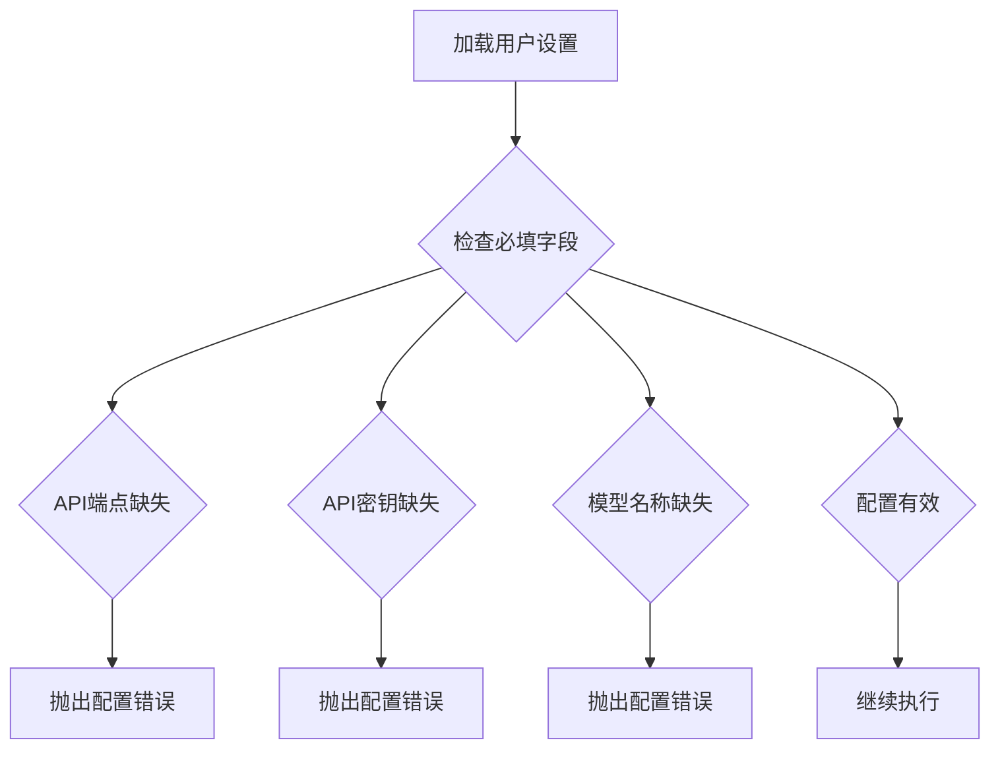

**图表来源**
- [background.js:465-476](file://background.js#L465-L476)

#### 配置错误分类

系统将配置错误归类为以下几种类型：

1. **API端点配置错误**：用户忘记填写API端点地址
2. **API密钥配置错误**：用户忘记填写API密钥或填写错误
3. **模型配置错误**：用户忘记填写模型名称或填写不支持的模型
4. **兼容性配置错误**：某些模型与当前实现不兼容

**章节来源**
- [background.js:465-476](file://background.js#L465-L476)
- [config.js:206-218](file://config.js#L206-L218)

### 超时错误处理

系统实现了多层级的超时错误处理机制：

#### 超时检测机制

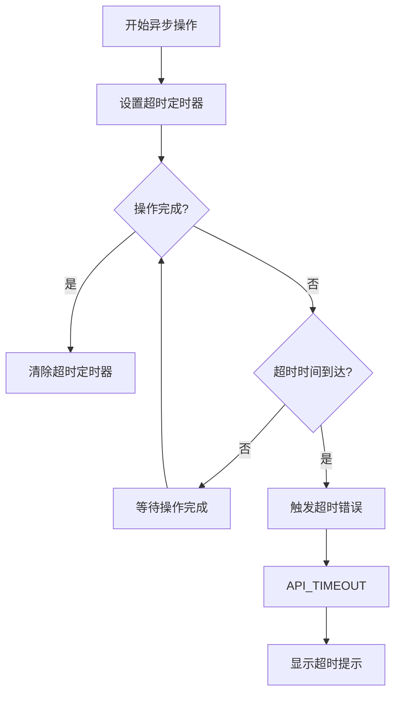

**图表来源**
- [background.js:218-251](file://background.js#L218-L251)

#### 超时处理策略

1. **网络请求超时**：对长时间无响应的网络请求进行超时处理
2. **图片处理超时**：对耗时较长的图片处理操作设置合理的超时限制
3. **API调用超时**：对第三方API调用设置超时保护
4. **用户操作超时**：对用户的长时间无响应操作进行超时处理

**章节来源**
- [background.js:218-251](file://background.js#L218-L251)

## 依赖关系分析

### 错误处理组件依赖

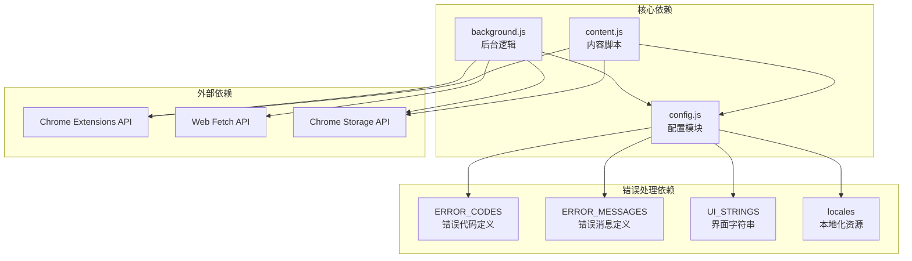

**图表来源**
- [config.js:206-252](file://config.js#L206-L252)
- [background.js:1-12](file://background.js#L1-L12)
- [content.js:1-5](file://content.js#L1-L5)

### 错误处理流程依赖

系统中的错误处理依赖关系如下：

1. **配置依赖**：所有错误处理都依赖于 config.js 中的配置定义
2. **API依赖**：后台进程依赖 Chrome Extensions API 进行消息传递
3. **存储依赖**：错误处理需要访问 Chrome Storage API 存储用户设置
4. **网络依赖**：API错误处理依赖 Web Fetch API 进行网络请求

**章节来源**
- [config.js:206-252](file://config.js#L206-L252)
- [background.js:1-12](file://background.js#L1-L12)
- [content.js:1-5](file://content.js#L1-L5)

## 性能考虑

### 错误处理性能优化

系统在错误处理方面采用了多项性能优化措施：

1. **异步错误处理**：所有错误处理都是异步进行的，不会阻塞主线程
2. **错误缓存**：常用的错误消息和配置信息会被缓存，减少重复查询
3. **延迟初始化**：错误处理相关的资源只有在需要时才进行初始化
4. **内存管理**：及时清理不再使用的错误处理资源，避免内存泄漏

### 错误处理性能指标

| 操作类型 | 处理时间 | 内存占用 | 影响范围 |
|----------|----------|----------|----------|
| 网络错误分类 | < 1ms | 低 | 单个请求 |
| API错误分类 | < 2ms | 低 | 单个请求 |
| 本地化消息获取 | < 1ms | 低 | 单个错误 |
| 错误消息显示 | < 50ms | 低 | 用户界面 |

## 故障排除指南

### 常见错误诊断

#### 网络连接问题

**症状**：用户无法连接到API或图片无法加载

**诊断步骤**：
1. 检查网络连接状态
2. 验证API端点URL的有效性
3. 确认防火墙设置允许扩展程序访问网络
4. 检查代理服务器配置

**解决方案**：
- 使用浏览器内置的网络诊断工具
- 尝试更换网络环境
- 检查API提供商的服务状态

#### API认证失败

**症状**：出现401或403错误

**诊断步骤**：
1. 验证API密钥的有效性
2. 检查API密钥的权限范围
3. 确认API端点的正确性
4. 验证请求头的完整性

**解决方案**：
- 重新生成API密钥
- 检查API提供商的权限设置
- 更新API端点配置

#### 速率限制问题

**症状**：频繁出现429错误

**诊断步骤**：
1. 检查当前的API使用量
2. 确认是否有其他应用也在使用相同的API
3. 验证请求频率是否过高
4. 检查API提供商的配额限制

**解决方案**：
- 实现请求节流机制
- 升级API套餐以获得更高的配额
- 优化请求策略减少不必要的调用

#### 图片处理错误

**症状**：图片无法正确处理或显示

**诊断步骤**：
1. 检查图片格式的支持性
2. 验证图片尺寸是否过大
3. 确认图片URL的有效性
4. 检查浏览器的图片处理能力

**解决方案**：
- 降低图片分辨率
- 改善图片质量
- 使用更高效的图片格式

### 调试支持

#### 开发者工具支持

系统提供了完善的开发者工具支持：

1. **控制台日志**：详细的错误信息会在浏览器控制台中显示
2. **错误追踪**：支持错误堆栈跟踪和调试
3. **性能监控**：可以监控错误处理的性能指标
4. **配置检查**：提供配置验证和建议

#### 用户反馈机制

系统支持用户向开发者反馈错误信息：

1. **错误报告**：用户可以提交详细的错误报告
2. **日志收集**：自动收集相关的日志信息
3. **版本信息**：包含扩展版本和系统信息
4. **重现步骤**：帮助开发者重现和修复问题

**章节来源**
- [background.js:427-428](file://background.js#L427-L428)
- [content.js:486](file://content.js#L486)

## 结论

Img2Prompt 的错误处理系统展现了现代浏览器扩展程序在错误管理方面的最佳实践。通过统一的错误分类机制、智能的本地化消息处理、完善的错误恢复策略，系统为用户提供了稳定可靠的服务体验。

### 主要优势

1. **标准化错误处理**：通过统一的错误代码体系，简化了错误处理逻辑
2. **智能本地化**：根据用户语言自动提供相应的错误提示
3. **多层次防护**：从网络层到应用层的全方位错误防护
4. **用户体验优化**：提供渐进式反馈和优雅的错误展示

### 改进建议

1. **增强错误预测**：可以实现更多的错误预防机制
2. **改进错误恢复**：增加更多自动化的错误恢复选项
3. **扩展错误报告**：提供更丰富的错误报告和分析功能
4. **优化性能监控**：增强错误处理的性能监控和分析能力

该错误处理系统为类似的应用程序提供了优秀的参考模板，展示了如何在复杂的异步环境中实现健壮的错误管理机制。