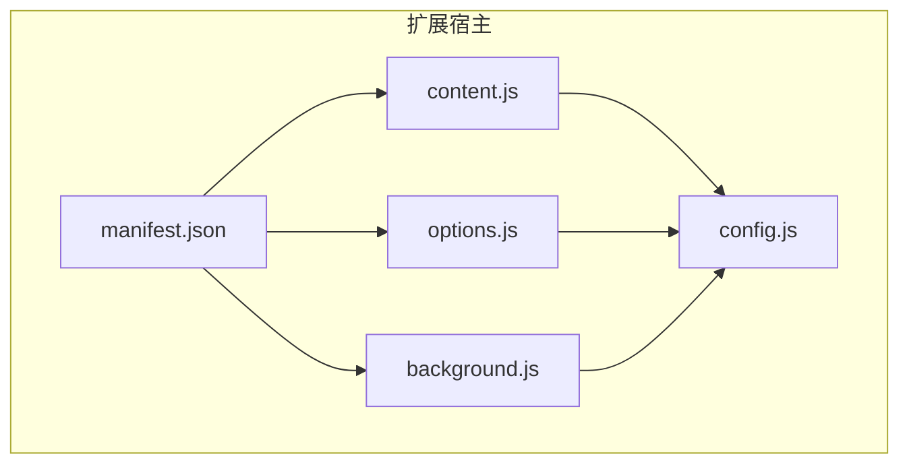
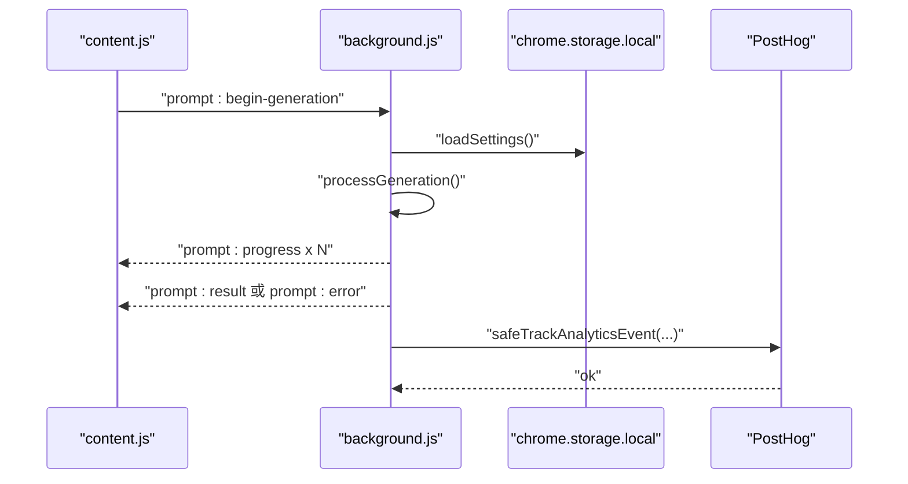
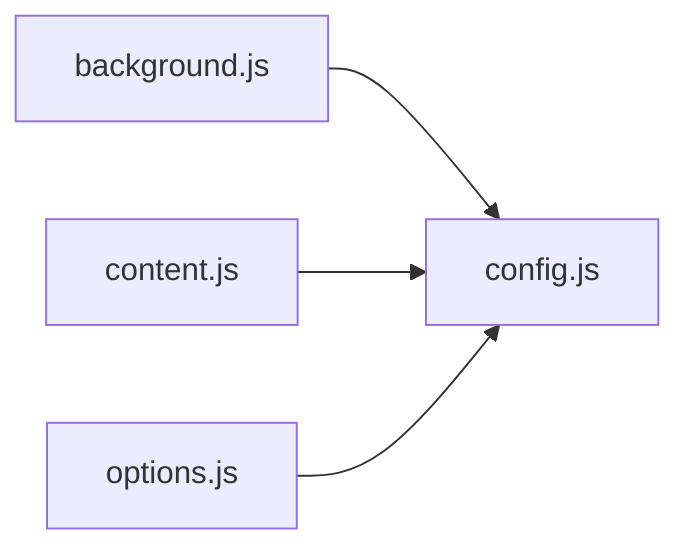

# 依赖管理策略

<cite>
**本文引用的文件**
- [background.js](file://background.js)
- [config.js](file://config.js)
- [content.js](file://content.js)
- [options.js](file://options.js)
- [options.html](file://options.html)
- [manifest.json](file://manifest.json)
</cite>

## 目录
1. [简介](#简介)
2. [项目结构](#项目结构)
3. [核心组件](#核心组件)
4. [架构总览](#架构总览)
5. [详细组件分析](#详细组件分析)
6. [依赖关系分析](#依赖关系分析)
7. [性能考量](#性能考量)
8. [故障排查指南](#故障排查指南)
9. [结论](#结论)
10. [附录](#附录)

## 简介
本指南围绕 Img2Prompt 的依赖管理策略展开，重点覆盖：
- importScripts 的使用模式与全局变量管理
- 模块间依赖关系与解耦设计
- config.js 在 background.js 中的正确导入与使用
- globalThis.ImgPromptConfig 的结构与作用
- 依赖注入最佳实践（避免循环依赖、动态加载、版本管理）
- 接口抽象、依赖反转、工厂模式的应用
- 冲突解决策略、性能影响分析与调试技巧

## 项目结构
项目采用 Manifest V3 扩展结构，核心文件如下：
- background.js：服务工作线程，负责消息分发、生成流程与持久化
- config.js：共享配置，通过全局对象暴露给多个脚本
- content.js：页面注入脚本，负责 UI、事件与与后台通信
- options.js + options.html：设置页，负责读取/写入配置并同步到扩展其他部分
- manifest.json：声明服务工作线程、内容脚本与权限



图表来源
- [manifest.json:10-26](file://manifest.json#L10-L26)
- [content.js:1-3](file://content.js#L1-L3)
- [options.html:683-684](file://options.html#L683-L684)
- [background.js:1-2](file://background.js#L1-L2)

章节来源
- [manifest.json:1-45](file://manifest.json#L1-L45)
- [content.js:1-3](file://content.js#L1-L3)
- [options.html:683-684](file://options.html#L683-L684)
- [background.js:1-2](file://background.js#L1-L2)

## 核心组件
- 共享配置模块（config.js）
  - 以全局对象形式暴露 DEFAULT_SETTINGS、UI_STRINGS、SETTINGS_I18N、ERROR_CODES、ERROR_MESSAGES、POSTHOG_PROJECT_KEY、POSTHOG_HOST、ANALYTICS_CONFIG_KEY 等
  - 供 background.js、content.js、options.js 复用
- 后台服务（background.js）
  - 加载 config.js 后，从 globalThis.ImgPromptConfig 读取常量
  - 处理安装、上下文菜单、命令触发、消息路由、生成流程、历史记录与分析上报
- 页面注入（content.js）
  - 注入 Shadow DOM 面板，监听运行时消息，驱动 UI 与生成流程
- 设置页（options.js + options.html）
  - 读取/写入存储，渲染多语言文案，管理用户提示词模板，同步设置变更

章节来源
- [config.js:4-252](file://config.js#L4-L252)
- [background.js:1-12](file://background.js#L1-L12)
- [content.js:1-4](file://content.js#L1-L4)
- [options.js:1-7](file://options.js#L1-L7)

## 架构总览
下图展示扩展三类脚本与共享配置之间的依赖关系与交互路径。

```mermaid
graph TB
CFG["globalThis.ImgPromptConfig<br/>config.js"]
BG["background.js"]
CS["content.js"]
OPT["options.js"]
CS --> CFG
OPT --> CFG
BG --> CFG
BG <- --> CS
BG <- --> OPT
```

图表来源
- [background.js:1-2](file://background.js#L1-L2)
- [content.js:1-3](file://content.js#L1-L3)
- [options.js:1-7](file://options.js#L1-L7)
- [config.js:4-252](file://config.js#L4-L252)

## 详细组件分析

### 共享配置模块（config.js）
- 结构要点
  - DEFAULT_SETTINGS：默认设置与系统/用户提示词模板
  - USER_PROMPT_PRESETS：内置提示词模板集合
  - UI_STRINGS：多语言 UI 文案
  - SETTINGS_I18N：设置页多语言文案
  - ERROR_CODES / ERROR_MESSAGES：错误码与用户友好提示映射
  - ANALYTICS：PostHog 上报所需常量
- 使用方式
  - background.js 通过 importScripts('config.js') 引入，随后从 globalThis.ImgPromptConfig 读取
  - content.js 与 options.js 通过页面加载顺序保证 window.ImgPromptConfig 可用

章节来源
- [config.js:4-252](file://config.js#L4-L252)

### 后台服务（background.js）
- 依赖注入与全局变量
  - 使用 importScripts('config.js') 动态加载共享配置
  - 将 globalThis.ImgPromptConfig 解构为常量（如 DEFAULT_SETTINGS、UI_STRINGS、ERROR_CODES 等），避免重复访问全局对象
- 消息处理与流程编排
  - 监听 runtime.onMessage，分发至具体处理函数（如生成、取消、历史查询）
  - 与 content.js 通过 sendMessage/onMessage 通信，传递进度、结果与错误
- 数据持久化与分析
  - 使用 chrome.storage.local 存取设置、客户端 ID、历史记录
  - 安全上报：safeTrackAnalyticsEvent 包装 trackAnalyticsEvent，避免异常阻断主流程



图表来源
- [background.js:94-184](file://background.js#L94-L184)
- [background.js:212-320](file://background.js#L212-L320)
- [background.js:404-410](file://background.js#L404-L410)

章节来源
- [background.js:1-12](file://background.js#L1-L12)
- [background.js:94-184](file://background.js#L94-L184)
- [background.js:212-320](file://background.js#L212-L320)
- [background.js:404-410](file://background.js#L404-L410)

### 页面注入（content.js）
- 依赖注入与全局变量
  - 通过 window.ImgPromptConfig 获取 UI_STRINGS 等配置
- UI 生命周期与事件
  - 创建/挂载 Shadow DOM 面板，绑定拖拽、复制、语言切换、停止等事件
  - 监听来自 background.js 的进度、结果与错误消息，更新 UI
- 与后台通信
  - 发送生成请求、取消请求、历史加载等消息；封装安全发送函数以规避扩展上下文失效

章节来源
- [content.js:1-4](file://content.js#L1-L4)
- [content.js:209-247](file://content.js#L209-L247)
- [content.js:622-725](file://content.js#L622-L725)

### 设置页（options.js + options.html）
- 依赖注入与全局变量
  - 通过 window.ImgPromptConfig 获取 DEFAULT_SETTINGS、SETTINGS_I18N、USER_PROMPT_PRESETS
- 表单与模板管理
  - 渲染多语言文案，管理内置与自定义提示词模板，自动保存到存储
- 与后台通信
  - 发送 settings:updated 通知其他部分刷新 UI；发送 analytics:track 记录行为

章节来源
- [options.js:1-7](file://options.js#L1-L7)
- [options.js:182-216](file://options.js#L182-L216)
- [options.js:377-405](file://options.js#L377-L405)

## 依赖关系分析

### 依赖链路
- config.js 是唯一共享配置源，被 background.js、content.js、options.js 依赖
- content.js 与 options.js 通过页面加载顺序保证 window.ImgPromptConfig 可用
- background.js 通过 importScripts('config.js') 在服务工作线程中加载配置



图表来源
- [background.js:1-2](file://background.js#L1-L2)
- [content.js:1-3](file://content.js#L1-L3)
- [options.html:683-684](file://options.html#L683-L684)

### 潜在循环依赖与规避
- 当前结构未发现循环依赖：config.js 仅提供只读配置，不反向依赖其他模块
- 若未来引入“后台向页面动态注入配置”的需求，应避免在 config.js 中依赖 background/content 的运行时状态

章节来源
- [config.js:4-252](file://config.js#L4-L252)
- [background.js:1-2](file://background.js#L1-L2)
- [content.js:1-3](file://content.js#L1-L3)
- [options.html:683-684](file://options.html#L683-L684)

### 模块间解耦设计
- 接口抽象
  - 通过 globalThis.ImgPromptConfig 统一暴露配置接口，避免各模块直接硬编码常量
- 依赖反转
  - content.js 与 options.js 不直接依赖后台实现细节，而是通过消息协议与后台交互
- 工厂模式应用
  - requestViaOpenAICompatible/requestViaAnthropic 可视为“请求工厂”，根据 settings 自动选择适配器

章节来源
- [background.js:478-503](file://background.js#L478-L503)
- [background.js:517-592](file://background.js#L517-L592)
- [background.js:594-666](file://background.js#L594-L666)

## 性能考量
- 配置加载
  - importScripts 会在服务工作线程中同步执行，建议保持 config.js 体积较小，避免阻塞后台初始化
- 消息通信
  - 进度与结果通过多次消息推送，注意避免过于频繁的 UI 更新导致主线程压力
- 图像处理
  - 背景压缩与前端裁剪均可能带来 CPU 占用，建议结合 maxImageEdge 与设备像素比优化
- 存储访问
  - 批量读写设置与历史记录，减少频繁 IO 操作

[本节为通用指导，无需特定文件来源]

## 故障排查指南
- 配置未生效
  - 确认 content.js 与 options.html 是否在各自脚本之前加载了 config.js
  - 检查 globalThis.ImgPromptConfig 是否存在（background.js 通过 importScripts 后应可用）
- 生成失败
  - 查看 ERROR_CODES 与 ERROR_MESSAGES 映射，结合 UI_STRINGS 提示定位问题
  - 检查 API Endpoint、API Key、模型名与温度参数
- 上报失败
  - safeTrackAnalyticsEvent 已做异常兜底，若仍失败，检查 ANALYTICS_CONFIG_KEY 与 PostHog 配置

章节来源
- [background.js:1-12](file://background.js#L1-L12)
- [background.js:206-218](file://background.js#L206-L218)
- [background.js:220-234](file://background.js#L220-L234)
- [background.js:404-410](file://background.js#L404-L410)

## 结论
- 通过 globalThis.ImgPromptConfig 实现跨模块共享配置，配合 importScripts 与页面加载顺序，形成清晰的依赖注入链路
- 采用消息协议与运行时存储实现模块解耦，降低耦合度与维护成本
- 建议在后续演进中进一步抽象后台适配层，增强可测试性与可替换性

[本节为总结性内容，无需特定文件来源]

## 附录

### 依赖注入最佳实践清单
- 避免循环依赖
  - config.js 仅提供只读配置，不依赖运行时模块
- 动态加载
  - 服务工作线程使用 importScripts('config.js')；页面脚本通过页面加载顺序保证 window.ImgPromptConfig 可用
- 版本管理
  - 通过 manifest.json 的 version 字段统一标识扩展版本，上报时携带该信息
- 错误处理
  - 使用 safeTrackAnalyticsEvent 包装分析上报，避免异常中断主流程
- 调试技巧
  - 在 content.js 中使用 safeSendRuntimeMessage 包装消息发送，捕获扩展上下文失效错误
  - 利用 chrome.storage.local 的 onChanged 监听设置变化，快速验证配置同步

章节来源
- [manifest.json:35-44](file://manifest.json#L35-L44)
- [background.js:1-12](file://background.js#L1-L12)
- [background.js:404-410](file://background.js#L404-L410)
- [content.js:65-75](file://content.js#L65-L75)