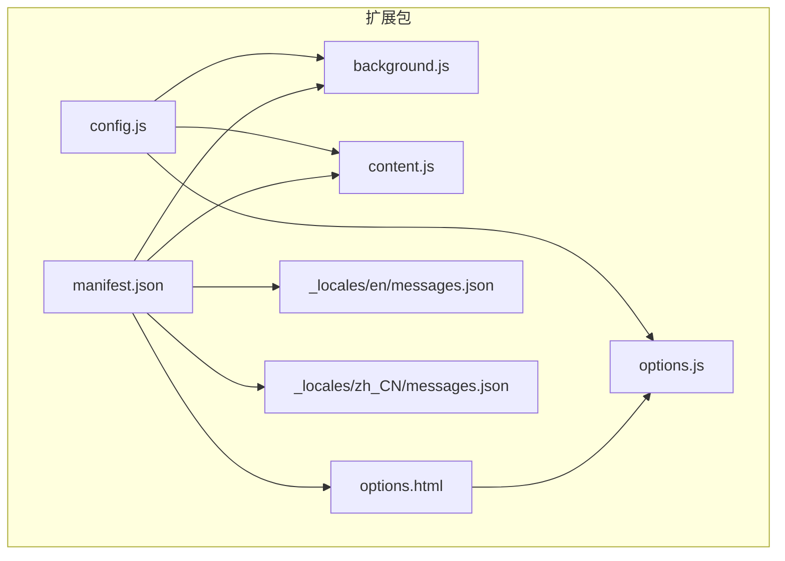
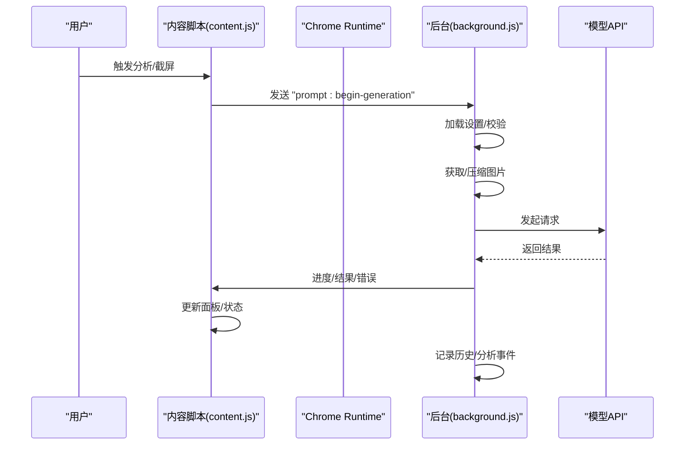
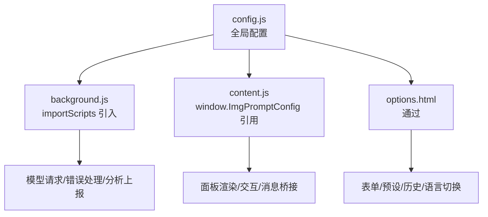
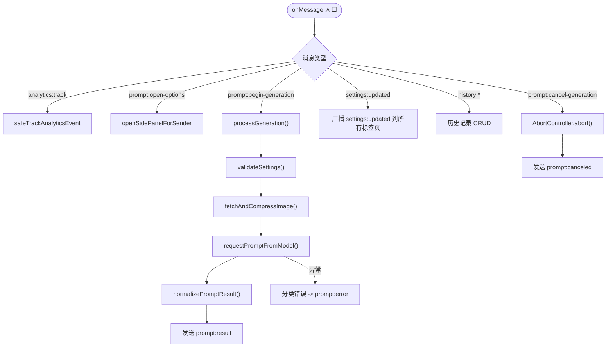
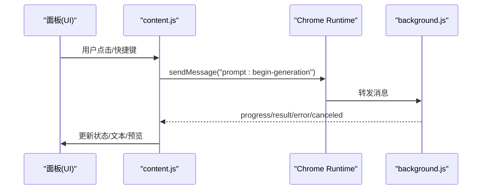
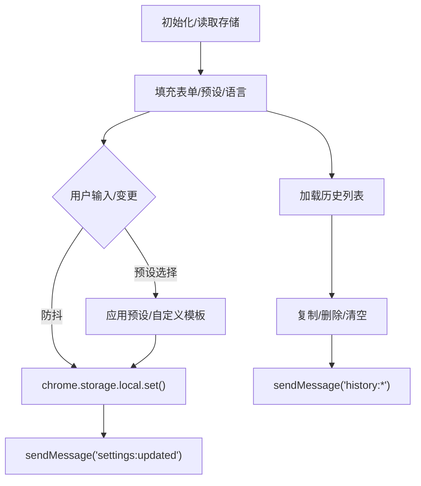
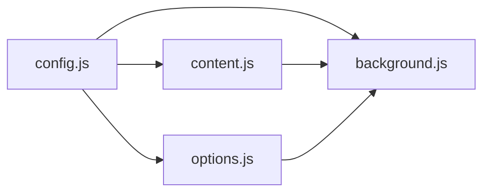

# 模块集成开发

<cite>
**本文引用的文件**
- [manifest.json](file://manifest.json)
- [config.js](file://config.js)
- [background.js](file://background.js)
- [content.js](file://content.js)
- [options.js](file://options.js)
- [options.html](file://options.html)
- [messages.json(英文)](file://_locales\en\messages.json)
- [messages.json(中文)](file://_locales\zh_CN\messages.json)
</cite>

## 目录
1. [简介](#简介)
2. [项目结构](#项目结构)
3. [核心组件](#核心组件)
4. [架构总览](#架构总览)
5. [详细组件分析](#详细组件分析)
6. [依赖关系分析](#依赖关系分析)
7. [性能考量](#性能考量)
8. [故障排查指南](#故障排查指南)
9. [结论](#结论)
10. [附录](#附录)

## 简介
本指南面向 Img2Prompt 的模块集成开发，聚焦于 Chrome Extension 的多模块协作与消息传递机制。围绕以下目标展开：
- 解释 Chrome Extension API 的使用与消息协议设计
- 说明 importScripts 的使用模式、全局变量管理与模块依赖处理
- 提供在新模块中正确引入 config.js 的实践
- 展示模块间解耦设计与异步依赖关系处理
- 阐述模块生命周期管理、错误传播与资源清理策略
- 总结架构设计原则（单一职责、依赖注入、事件驱动）
- 给出调试与测试方法（单元测试、集成测试、性能监控）

## 项目结构
该扩展采用 Manifest V3，核心模块包括：
- 配置共享模块：config.js（全局配置、UI 文案、错误码等）
- 后台服务模块：background.js（运行时监听、消息处理、与模型 API 交互、历史记录与分析上报）
- 内容脚本模块：content.js（页面交互、悬浮按钮、截屏工具、与后台的消息桥接）
- 设置页模块：options.html + options.js（设置表单、预设模板、历史记录管理、自动保存与事件上报）
- 本地化资源：_locales 下的多语言消息映射

图表来源
- [manifest.json:1-45](file://manifest.json#L1-L45)
- [config.js:1-253](file://config.js#L1-L253)
- [background.js:1-120](file://background.js#L1-L120)
- [content.js:1-50](file://content.js#L1-L50)
- [options.js:1-30](file://options.js#L1-L30)
- [options.html:683-686](file://options.html#L683-L686)
- [messages.json(英文):1-11](file://_locales\en\messages.json#L1-L11)
- [messages.json(中文):1-11](file://_locales\zh_CN\messages.json#L1-L11)

章节来源
- [manifest.json:1-45](file://manifest.json#L1-L45)
- [config.js:1-253](file://config.js#L1-L253)

## 核心组件
- 配置共享模块（config.js）
  - 通过 globalThis.ImgPromptConfig 暴露默认设置、UI 文案、错误码、分析配置等
  - 在后台（service worker）与内容脚本（content script）中分别通过 importScripts 与 window.ImgPromptConfig 引用
- 后台模块（background.js）
  - 注册上下文菜单、命令监听、消息路由、设置更新广播、历史记录管理、分析事件上报
  - 负责图像获取与压缩、模型请求、结果归一化与进度通知
- 内容脚本模块（content.js）
  - 页面交互、悬浮按钮、截屏选取、面板渲染、状态同步、与后台的消息桥接
  - 使用节流函数优化高频事件处理
- 设置页模块（options.html + options.js）
  - 表单与预设模板管理、自动保存、历史记录展示与操作、语言切换、分析事件上报
- 本地化资源（_locales）
  - 扩展名与描述的国际化映射

章节来源
- [config.js:4-252](file://config.js#L4-L252)
- [background.js:1-120](file://background.js#L1-L120)
- [content.js:1-50](file://content.js#L1-L50)
- [options.js:1-30](file://options.js#L1-L30)
- [options.html:683-686](file://options.html#L683-L686)
- [messages.json(英文):1-11](file://_locales\en\messages.json#L1-L11)
- [messages.json(中文):1-11](file://_locales\zh_CN\messages.json#L1-L11)

## 架构总览
整体采用“事件驱动 + 消息协议”的架构：
- Manifest 声明后台服务、内容脚本注入、权限与快捷键
- content.js 作为页面侧入口，负责 UI 与用户交互
- background.js 作为后台协调者，负责与模型 API 通信、持久化与分析上报
- config.js 作为跨模块共享配置中心，避免重复定义与分散配置

图表来源
- [manifest.json:10-26](file://manifest.json#L10-L26)
- [content.js:249-326](file://content.js#L249-L326)
- [background.js:94-184](file://background.js#L94-L184)
- [background.js:212-320](file://background.js#L212-L320)

## 详细组件分析

### 配置模块（config.js）
- 设计要点
  - 通过 globalThis.ImgPromptConfig 暴露统一配置，便于后台与内容脚本复用
  - 包含默认设置、UI 文案、错误码与消息映射、分析配置键名
  - 为选项页提供 i18n 映射与预设模板
- 使用模式
  - 后台：importScripts('config.js'); const CONFIG = globalThis.ImgPromptConfig
  - 内容脚本：const CONFIG = window.ImgPromptConfig
  - 选项页：通过 <script> 引入 config.js 后使用 window.ImgPromptConfig
- 依赖关系
  - 后台与内容脚本均依赖该模块；选项页通过 HTML 直接引入
  - 不存在循环依赖，耦合度低

图表来源
- [config.js:4-252](file://config.js#L4-L252)
- [background.js:1-12](file://background.js#L1-L12)
- [content.js:1-4](file://content.js#L1-L4)
- [options.html:683-686](file://options.html#L683-L686)

章节来源
- [config.js:1-253](file://config.js#L1-L253)

### 后台模块（background.js）
- 职责
  - 安装/更新事件、上下文菜单、快捷键捕获、消息监听与分发
  - 设置加载与校验、历史记录增删查、分析事件上报
  - 图像获取与压缩、模型请求（OpenAI 兼容/Anthropic）、结果归一化与错误分类
- 关键流程
  - onInstalled：初始化客户端 ID、上下文菜单、默认设置、侧边栏行为
  - onMessage：处理 analytics:track、prompt:open-options、prompt:cancel-generation、settings:updated、history:*、prompt:begin-generation
  - processGeneration：统一处理生成流程，发送进度、结果、错误与历史记录
  - requestPromptFromModel：根据模型类型选择请求路径
- 错误传播
  - 将异常分类为 ERROR_CODES，并向内容脚本发送 prompt:error 或 prompt:canceled
- 资源清理
  - 使用 AbortController 管理请求取消
  - activeRequests Map 管理进行中的请求，finally 中清理

图表来源
- [background.js:94-184](file://background.js#L94-L184)
- [background.js:212-320](file://background.js#L212-L320)
- [background.js:465-476](file://background.js#L465-L476)
- [background.js:775-800](file://background.js#L775-L800)

章节来源
- [background.js:1-945](file://background.js#L1-L945)

### 内容脚本模块（content.js）
- 职责
  - 页面交互：悬浮按钮、截屏选取、面板渲染与拖拽
  - 与后台通信：发送开始分析、接收进度/结果/错误、取消生成
  - 设置同步：监听存储变化，动态更新 UI 语言与功能开关
- 关键流程
  - handleStartAnalysis：构建请求、设置面板状态、发送 prompt:begin-generation
  - 处理 runtime.onMessage：prompt:progress、prompt:result、prompt:canceled、prompt:error、settings:updated
  - startSnipper：绘制覆盖层、裁剪区域、生成 base64 并触发分析
- 解耦设计
  - 使用 safeSendRuntimeMessage 包装消息发送，屏蔽扩展上下文失效等异常
  - 通过 UI_STRINGS 动态更新面板文案，避免硬编码
- 异步依赖
  - 与后台的消息往返基于 chrome.runtime.sendMessage/OnMessage
  - 截屏选取依赖 canvas 与 devicePixelRatio，注意缩放与内存占用

图表来源
- [content.js:209-247](file://content.js#L209-L247)
- [content.js:249-326](file://content.js#L249-L326)
- [content.js:489-594](file://content.js#L489-L594)

章节来源
- [content.js:1-800](file://content.js#L1-L800)

### 设置页模块（options.html + options.js）
- 职责
  - 表单：连接信息、模型参数、体验设置、兼容性设置
  - 预设模板：内置预设与自定义模板管理
  - 历史记录：查看、复制、删除、清空
  - 自动保存：防抖保存至 chrome.storage.local
  - 语言切换：动态更新界面文案
- 关键流程
  - 初始化：读取默认设置与自定义模板，填充表单
  - 预设选择：切换内置或自定义模板，自动保存
  - 自动保存：防抖写入存储，同时广播 settings:updated
  - 历史记录：通过 runtime.sendMessage 触发后台历史 CRUD
- 与后台联动
  - 通过 runtime.sendMessage 触发 analytics:track、history:*、settings:updated

图表来源
- [options.js:182-216](file://options.js#L182-L216)
- [options.js:369-405](file://options.js#L369-L405)
- [options.js:218-248](file://options.js#L218-L248)
- [options.html:683-686](file://options.html#L683-L686)

章节来源
- [options.js:1-551](file://options.js#L1-L551)
- [options.html:1-687](file://options.html#L1-L687)

## 依赖关系分析
- 模块依赖
  - background.js 依赖 config.js（importScripts）
  - content.js 依赖 config.js（window.ImgPromptConfig）
  - options.html 通过 <script> 引入 config.js，再加载 options.js
- 耦合与内聚
  - config.js 作为共享配置中心，内聚度高、耦合度低
  - content.js 与 background.js 通过消息协议解耦，遵循单一职责
  - options.js 与 content.js 通过 settings:updated 事件保持 UI 一致
- 循环依赖
  - 未发现循环依赖，消息传递方向清晰

图表来源
- [config.js:4-252](file://config.js#L4-L252)
- [background.js:1-12](file://background.js#L1-L12)
- [content.js:1-4](file://content.js#L1-L4)
- [options.js:1-6](file://options.js#L1-L6)

章节来源
- [manifest.json:22-26](file://manifest.json#L22-L26)
- [config.js:1-253](file://config.js#L1-L253)
- [background.js:1-12](file://background.js#L1-L12)
- [content.js:1-5](file://content.js#L1-L5)
- [options.js:1-6](file://options.js#L1-L6)

## 性能考量
- 图像处理
  - 后台统一执行 fetchAndCompressImage，避免内容脚本重复逻辑
  - 截屏选取使用 canvas 绘制与 toDataURL，注意设备像素比与内存占用
- 消息与事件
  - content.js 使用节流函数处理 pointermove 等高频事件
  - options.js 使用防抖保存，减少存储写入频率
- 异步与并发
  - 使用 AbortController 管理请求取消，避免资源泄漏
  - activeRequests Map 管理进行中的请求，确保及时清理

章节来源
- [content.js:5-28](file://content.js#L5-L28)
- [background.js:775-800](file://background.js#L775-L800)
- [options.js:387-405](file://options.js#L387-L405)

## 故障排查指南
- 常见错误与定位
  - 网络错误：检查 apiEndpoint、apiKey、网络连通性
  - 图像获取失败：确认图片 URL 可访问、内容类型为 image/*
  - 模型返回空内容：检查 systemPrompt 与 userPrompt，确保输出纯 JSON
  - 400/401/429：根据 status 信息调整请求体或配额
- 错误传播
  - 后台将异常分类为 ERROR_CODES，并通过 prompt:error 返回给内容脚本
  - 用户友好消息来自 ERROR_MESSAGES，按 UI 语言选择
- 调试建议
  - 后台：console.log 与 safeTrackAnalyticsEvent 输出
  - 内容脚本：检查 runtime.lastError 与 isExtensionContextError 辅助判断
  - 设置页：确认 settings:updated 是否广播成功

章节来源
- [background.js:280-317](file://background.js#L280-L317)
- [background.js:206-218](file://background.js#L206-L218)
- [background.js:562-582](file://background.js#L562-L582)
- [content.js:56-75](file://content.js#L56-L75)

## 结论
本项目通过“配置共享 + 事件驱动 + 消息协议”的架构，实现了后台与内容脚本的高效协作。config.js 作为共享配置中心，降低了模块间的耦合；content.js 与 background.js 通过明确的消息类型与生命周期管理，保证了异步流程的可控性与可维护性。结合防抖、节流与资源清理策略，整体具备良好的性能与稳定性。后续新增模块应遵循单一职责与事件驱动原则，优先通过消息协议与共享配置进行集成。

## 附录

### 开发示例：在新模块中正确引入 config.js
- 后台（service worker）
  - 使用 importScripts('config.js') 引入
  - 通过 globalThis.ImgPromptConfig 访问配置
- 内容脚本
  - 通过 window.ImgPromptConfig 访问配置
- 选项页
  - 在 HTML 中通过 <script> 引入 config.js，再加载对应 JS

章节来源
- [background.js:1-12](file://background.js#L1-L12)
- [content.js:1-4](file://content.js#L1-L4)
- [options.html:683-686](file://options.html#L683-L686)

### 模块生命周期管理
- 安装/更新：onInstalled 初始化默认设置与客户端 ID
- 运行期：onMessage 处理各类业务消息；settings:updated 广播更新
- 生成流程：processGeneration 统一处理，支持取消与错误回传
- 资源清理：AbortController 与 activeRequests Map 管理请求生命周期

章节来源
- [background.js:19-57](file://background.js#L19-L57)
- [background.js:94-147](file://background.js#L94-L147)
- [background.js:212-320](file://background.js#L212-L320)

### 错误传播机制
- 后台：classifyError -> prompt:error/prompt:canceled
- 内容脚本：handleError/handleCanceled -> 更新面板状态与错误文案

章节来源
- [background.js:280-317](file://background.js#L280-L317)
- [content.js:464-487](file://content.js#L464-L487)

### 资源清理策略
- 请求取消：AbortController.abort()，activeRequests 清理
- 存储清理：chrome.storage.local.set({ key: [] }) 清空历史
- DOM 清理：移除 overlay、隐藏面板、停止计时器

章节来源
- [background.js:122-132](file://background.js#L122-L132)
- [background.js:455-463](file://background.js#L455-L463)
- [content.js:489-594](file://content.js#L489-L594)

### 架构设计原则应用
- 单一职责：config.js 专注配置；background.js 专注后台协调；content.js 专注页面交互；options.js 专注设置与历史
- 依赖注入：通过 importScripts/window.ImgPromptConfig 注入共享配置
- 事件驱动：chrome.runtime.onMessage 作为事件总线，模块间通过消息解耦

章节来源
- [config.js:4-252](file://config.js#L4-L252)
- [background.js:94-184](file://background.js#L94-L184)
- [content.js:209-247](file://content.js#L209-L247)
- [options.js:387-405](file://options.js#L387-L405)

### 调试与测试方法
- 单元测试
  - 对独立函数（如 normalizePromptResult、sanitizeJsonLikeText、extractOpenAICompatibleContent）进行断言测试
  - 使用模拟 fetch 与 AbortSignal 测试异步与取消逻辑
- 集成测试
  - 模拟 content.js 与 background.js 的消息交互，验证进度、结果与错误路径
  - 验证 settings:updated 广播对 UI 的即时影响
- 性能监控
  - 使用 safeTrackAnalyticsEvent 上报关键事件与耗时
  - 在高频事件（pointermove、输入）处加入节流/防抖
  - 监控 activeRequests 与内存占用，避免泄漏

章节来源
- [background.js:359-410](file://background.js#L359-L410)
- [content.js:5-28](file://content.js#L5-L28)
- [options.js:387-405](file://options.js#L387-L405)