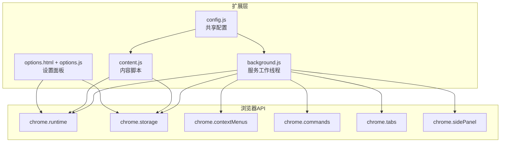
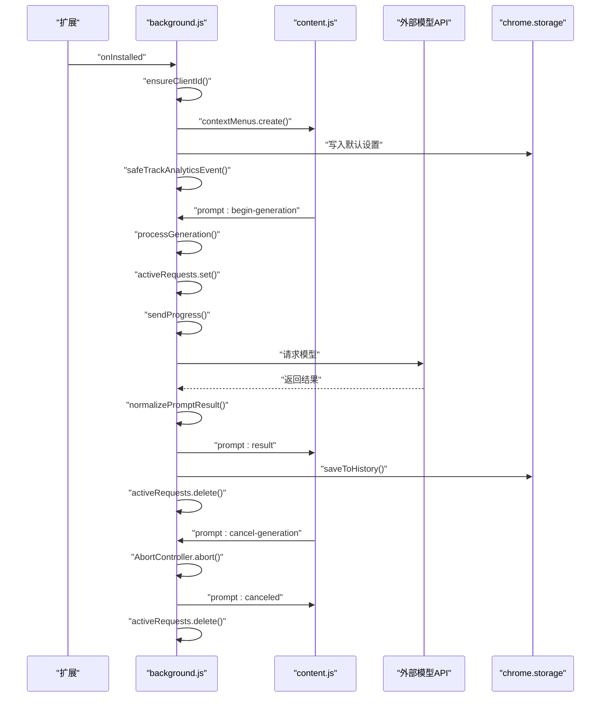
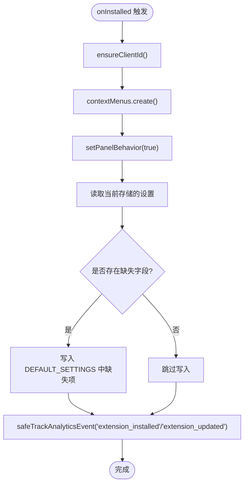
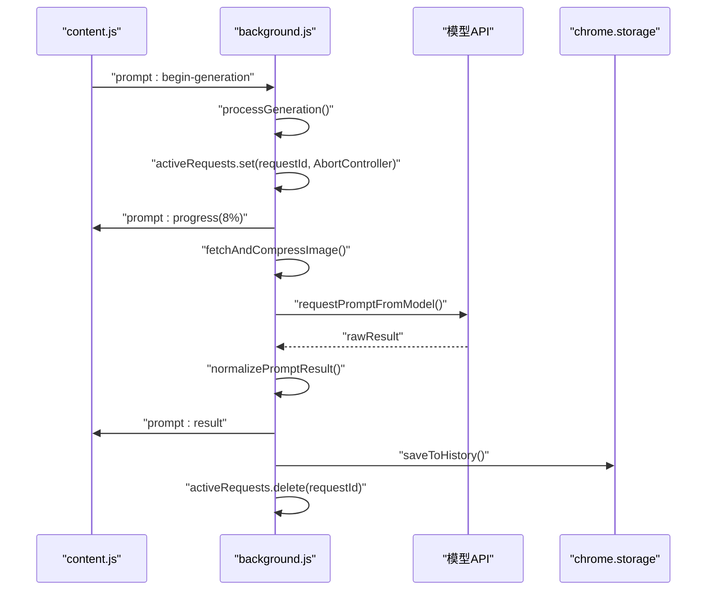
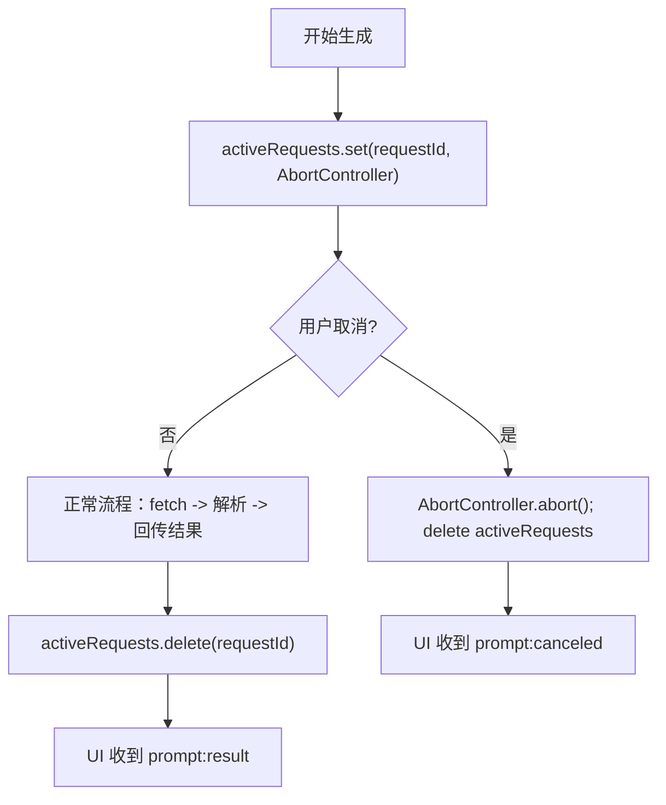
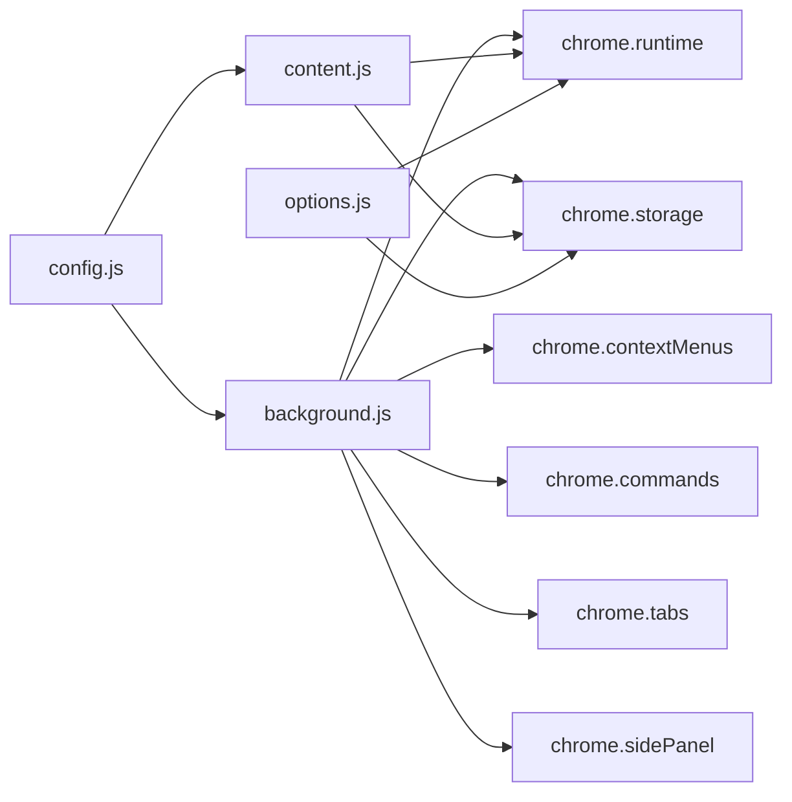

# 生命周期管理

<cite>
**本文引用的文件**
- [background.js](file://background.js)
- [manifest.json](file://manifest.json)
- [config.js](file://config.js)
- [content.js](file://content.js)
- [options.js](file://options.js)
- [options.html](file://options.html)
</cite>

## 目录
1. [简介](#简介)
2. [项目结构](#项目结构)
3. [核心组件](#核心组件)
4. [架构总览](#架构总览)
5. [详细组件分析](#详细组件分析)
6. [依赖关系分析](#依赖关系分析)
7. [性能考量](#性能考量)
8. [故障排查指南](#故障排查指南)
9. [结论](#结论)
10. [附录](#附录)

## 简介
本文件聚焦于 Img2Prompt 扩展的生命周期管理，覆盖从安装、启动、运行到卸载的完整流程。重点解释 onInstalled、onStartup、onSuspend 等事件处理机制，详述初始化任务、状态恢复与资源清理；深入剖析 activeRequests 映射表的职责与管理策略（请求取消、超时处理、内存泄漏防护）；提供生命周期钩子的使用示例，展示如何在不同阶段执行初始化代码、处理异常与优雅关闭；同时给出状态持久化策略、错误恢复机制与性能监控方案。

## 项目结构
- 扩展采用 Manifest V3，后台脚本为 service worker（background.js），内容脚本注入页面（content.js），选项页（options.html + options.js），共享配置（config.js）。
- 关键权限与能力：contextMenus、storage、sidePanel、activeTab；通过命令触发截图分析（capture_screenshot）。

图表来源
- [manifest.json:10-41](file://manifest.json#L10-L41)
- [background.js:1-20](file://background.js#L1-L20)
- [content.js:1-10](file://content.js#L1-L10)
- [options.js:1-10](file://options.js#L1-L10)

章节来源
- [manifest.json:1-45](file://manifest.json#L1-L45)
- [background.js:1-20](file://background.js#L1-L20)
- [content.js:1-10](file://content.js#L1-L10)
- [options.js:1-10](file://options.js#L1-L10)
- [config.js:1-10](file://config.js#L1-L10)

## 核心组件
- 服务工作线程（background.js）
  - 处理扩展安装、消息路由、生成流程、历史记录、统计上报、图像压缩等。
  - 维护 activeRequests 映射表，统一管理请求生命周期。
- 内容脚本（content.js）
  - 页面交互入口（右键菜单、悬浮按钮、快捷截图）、UI 面板渲染、进度与结果回传。
- 设置面板（options.html + options.js）
  - 连接参数、提示词模板、体验设置、历史记录管理、自动保存与通知。
- 共享配置（config.js）
  - 默认设置、UI 文案、错误码、统计配置、提示词预设等。

章节来源
- [background.js:17-57](file://background.js#L17-L57)
- [content.js:30-60](file://content.js#L30-L60)
- [options.js:1-25](file://options.js#L1-L25)
- [config.js:4-30](file://config.js#L4-L30)

## 架构总览
扩展生命周期由 Manifest V3 的 service worker 驱动，核心事件流如下：
- 安装阶段：注册上下文菜单、设置侧边栏行为、写入默认设置、统计上报。
- 运行阶段：响应消息、发起生成、进度回传、结果分发、历史记录持久化。
- 卸载阶段：清理映射表、释放资源、避免内存泄漏。

图表来源
- [background.js:19-57](file://background.js#L19-L57)
- [background.js:94-184](file://background.js#L94-L184)
- [background.js:212-320](file://background.js#L212-L320)
- [content.js:209-247](file://content.js#L209-L247)

## 详细组件分析

### 安装与启动阶段（onInstalled）
- 注册上下文菜单（右键图片触发）。
- 设置侧边栏行为（点击图标自动打开侧边栏）。
- 初始化默认设置（仅缺失项写入，避免覆盖用户已有设置）。
- 上报安装/更新事件（携带客户端 ID、版本号等）。

图表来源
- [background.js:19-57](file://background.js#L19-L57)
- [background.js:330-341](file://background.js#L330-L341)

章节来源
- [background.js:19-57](file://background.js#L19-L57)
- [background.js:330-341](file://background.js#L330-L341)

### 运行阶段（消息与生成流程）
- 消息路由：接收来自内容脚本的消息（开始生成、取消、打开设置、历史查询等），统一调度至对应处理器。
- 生成流程：校验设置、压缩图像、调用模型、解析结果、回传进度与结果、持久化历史。
- 取消与错误：基于 AbortController 实现请求取消；错误分类与用户友好提示；统计上报。

图表来源
- [background.js:94-184](file://background.js#L94-L184)
- [background.js:212-320](file://background.js#L212-L320)
- [background.js:775-849](file://background.js#L775-L849)

章节来源
- [background.js:94-184](file://background.js#L94-L184)
- [background.js:212-320](file://background.js#L212-L320)
- [background.js:775-849](file://background.js#L775-L849)

### 卸载与资源清理
- activeRequests 映射表在生成结束（成功/失败/取消）后删除条目，避免内存泄漏。
- 发送消息时对“接收端不存在”等异常进行捕获与忽略，确保优雅退出。
- 历史记录按上限裁剪，避免无限增长。

章节来源
- [background.js:122-132](file://background.js#L122-L132)
- [background.js:317-319](file://background.js#L317-L319)
- [background.js:412-430](file://background.js#L412-L430)

### activeRequests 映射表：职责与管理策略
- 职责
  - 记录每个生成请求对应的 AbortController，实现请求级取消。
  - 在生成流程开始时插入条目，在 finally 中删除，防止悬挂引用。
- 管理策略
  - 取消：收到取消消息时，若存在对应控制器则 abort 并删除映射。
  - 超时：未见显式超时控制，建议结合 AbortSignal 使用 fetch 超时或引入定时器。
  - 内存泄漏防护：finally 中删除映射；发送消息时忽略“接收端不存在”错误。
- 与 UI 的协作
  - 进度与结果通过消息回传，UI 根据 requestId 匹配更新。

图表来源
- [background.js:219-220](file://background.js#L219-L220)
- [background.js:122-132](file://background.js#L122-L132)
- [background.js:317-319](file://background.js#L317-L319)

章节来源
- [background.js:17-18](file://background.js#L17-L18)
- [background.js:122-132](file://background.js#L122-L132)
- [background.js:219-220](file://background.js#L219-L220)
- [background.js:317-319](file://background.js#L317-L319)

### 错误处理与恢复
- 错误分类：根据错误文本特征匹配网络、鉴权、速率限制、超时、JSON 解析、字段缺失等类型。
- 用户提示：依据 UI 文案字典映射为本地化错误消息。
- 恢复机制：重试、调整分辨率、更换模型、检查密钥与接口地址。
- 统计上报：成功/失败/取消均上报，包含耗时、触发来源、页面上下文。

章节来源
- [background.js:872-945](file://background.js#L872-L945)
- [background.js:280-317](file://background.js#L280-L317)
- [config.js:206-247](file://config.js#L206-L247)

### 状态持久化与历史管理
- 存储位置：chrome.storage.local。
- 结构：clientId、历史记录数组（含 prompts、srcUrl、imageDataUrl、pageUrl、model、trigger、timestamp 等）。
- 读写：读取、追加、裁剪（最多 50 条）、删除单条、清空。
- 与 UI 协作：选项页通过消息查询历史并渲染；内容脚本加载历史项直接显示。

章节来源
- [background.js:14-16](file://background.js#L14-L16)
- [background.js:412-463](file://background.js#L412-L463)
- [options.js:218-248](file://options.js#L218-L248)
- [content.js:378-431](file://content.js#L378-L431)

### 性能监控与优化
- 进度回传：分阶段推进（准备、取图、调用模型、整理提示词），便于 UI 响应与用户感知。
- 图像压缩：OffscreenCanvas + convertToBlob，限制最大边长，降低请求体积与网络开销。
- 本地化：UI 文案与错误消息按语言字典选择，减少网络请求。
- 统计上报：PostHog 配置，记录关键事件与耗时，辅助性能分析。

章节来源
- [background.js:851-859](file://background.js#L851-L859)
- [background.js:815-849](file://background.js#L815-L849)
- [config.js:249-251](file://config.js#L249-L251)

## 依赖关系分析

图表来源
- [manifest.json:10-41](file://manifest.json#L10-L41)
- [background.js:1-12](file://background.js#L1-L12)
- [content.js:1-5](file://content.js#L1-L5)
- [options.js:1-7](file://options.js#L1-L7)

章节来源
- [manifest.json:10-41](file://manifest.json#L10-L41)
- [background.js:1-12](file://background.js#L1-L12)
- [content.js:1-5](file://content.js#L1-L5)
- [options.js:1-7](file://options.js#L1-L7)

## 性能考量
- 图像压缩：限制最大边长与 JPEG 质量，显著降低请求体大小与网络延迟。
- 请求取消：AbortController 提供即时取消，避免无效计算与带宽浪费。
- 事件节流：内容脚本中对指针移动等高频事件进行节流，减少 UI 更新频率。
- 存储批量写入：设置面板采用防抖合并保存，降低存储压力。

章节来源
- [background.js:815-849](file://background.js#L815-L849)
- [background.js:122-132](file://background.js#L122-L132)
- [content.js:5-28](file://content.js#L5-L28)
- [options.js:387-405](file://options.js#L387-L405)

## 故障排查指南
- 常见问题与定位
  - 网络错误：检查网络连通性与代理设置；查看错误分类是否命中 NETWORK_ERROR。
  - 鉴权失败：核对 API Key 是否正确；确认 401/403 错误映射。
  - 速率限制：等待配额恢复或提升额度；观察 API_RATE_LIMITED。
  - 超时：降低图片分辨率或缩短提示词；确认 API_TIMEOUT。
  - JSON 解析失败：调整 System Prompt，确保输出纯 JSON；参考 JSON_PARSE_FAILED。
  - 字段缺失：检查 zh/en 字段是否齐全；参考 MISSING_FIELDS。
- 取消与内存
  - 若生成未响应，优先尝试取消；若仍卡住，检查 activeRequests 中是否存在悬挂条目。
  - 查看控制台是否有“接收端不存在”类错误，确认消息发送时机与目标页面状态。
- 历史记录
  - 清空历史后重新生成验证；确认 MAX_HISTORY_ITEMS 限制生效。

章节来源
- [background.js:872-945](file://background.js#L872-L945)
- [background.js:122-132](file://background.js#L122-L132)
- [background.js:455-463](file://background.js#L455-L463)

## 结论
Img2Prompt 的生命周期管理围绕 service worker 的 onInstalled 事件展开，结合消息路由与 UI 协作，实现了从安装初始化、运行时生成、历史持久化到资源清理的闭环。activeRequests 映射表是请求生命周期的核心，配合 AbortController 与 finally 清理，有效避免了内存泄漏与悬挂请求。通过错误分类与本地化提示，提升了用户体验；通过进度回传与图像压缩，兼顾了性能与稳定性。建议后续补充显式的请求超时控制与更完善的 onSuspend/onStartup 处理，进一步增强健壮性与可维护性。

## 附录

### 生命周期钩子使用示例（基于现有实现）
- 安装阶段初始化
  - 注册上下文菜单、设置侧边栏行为、写入默认设置、上报安装事件。
  - 参考路径：[background.js:19-57](file://background.js#L19-L57)
- 运行阶段消息处理
  - 开始生成、取消生成、打开设置、历史查询与删除、清空历史。
  - 参考路径：[background.js:94-184](file://background.js#L94-L184)
- 生成流程与 UI 协作
  - 进度回传、结果分发、历史持久化。
  - 参考路径：[background.js:212-320](file://background.js#L212-L320)，[content.js:209-247](file://content.js#L209-L247)
- 取消与清理
  - AbortController.abort()、activeRequests.delete()、忽略“接收端不存在”错误。
  - 参考路径：[background.js:122-132](file://background.js#L122-L132)，[background.js:317-319](file://background.js#L317-L319)，[background.js:861-870](file://background.js#L861-L870)

### 状态持久化策略
- 存储键
  - 客户端 ID：clientId
  - 历史记录：promptHistory（数组，最多 50 条）
- 读写操作
  - 读取：chrome.storage.local.get(keys)
  - 写入：chrome.storage.local.set({ key: value })
  - 裁剪：超过上限时截断
- 参考路径
  - [background.js:14-16](file://background.js#L14-L16)
  - [background.js:412-463](file://background.js#L412-L463)

### 错误恢复机制
- 自动重试：建议在 UI 层提供“重试”按钮，结合错误分类与用户提示。
- 参数调整：降低分辨率、更换模型、检查密钥与接口地址。
- 日志与统计：利用 PostHog 上报关键事件与耗时，辅助定位问题。
- 参考路径
  - [background.js:872-945](file://background.js#L872-L945)
  - [config.js:249-251](file://config.js#L249-L251)