# 通信机制设计

<cite>
**本文档引用的文件**
- [background.js](file://background.js)
- [content.js](file://content.js)
- [manifest.json](file://manifest.json)
- [config.js](file://config.js)
- [options.js](file://options.js)
- [options.html](file://options.html)
</cite>

## 目录
1. [简介](#简介)
2. [项目结构](#项目结构)
3. [核心组件](#核心组件)
4. [架构概览](#架构概览)
5. [详细组件分析](#详细组件分析)
6. [依赖关系分析](#依赖关系分析)
7. [性能考虑](#性能考虑)
8. [故障排除指南](#故障排除指南)
9. [结论](#结论)

## 简介

Img2Prompt 是一个 Chrome 扩展程序，通过智能的图像到提示词转换功能帮助用户生成高质量的图像生成提示。该扩展的核心通信机制设计围绕 Chrome Extension 的消息传递协议构建，实现了 background script 与 content script 之间的高效、可靠的消息传递。

本设计文档深入分析了扩展的通信架构，包括消息类型定义、参数传递规范、响应处理机制、消息路由策略、错误传播机制和超时处理方案。文档还涵盖了通信安全考虑、消息验证规则和性能优化技巧。

## 项目结构

Img2Prompt 扩展采用标准的 Chrome Extension 结构，主要包含以下核心文件：

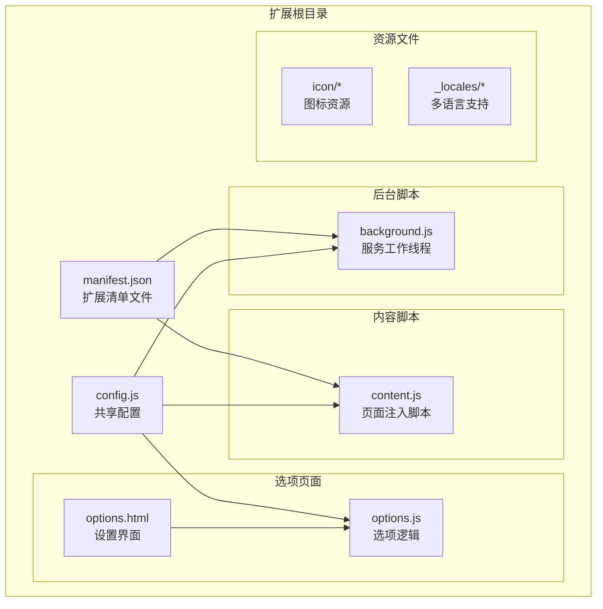

**图表来源**
- [manifest.json:1-45](file://manifest.json#L1-L45)
- [background.js:1-50](file://background.js#L1-L50)
- [content.js:1-50](file://content.js#L1-L50)
- [config.js:1-50](file://config.js#L1-L50)

**章节来源**
- [manifest.json:1-45](file://manifest.json#L1-L45)
- [config.js:1-50](file://config.js#L1-L50)

## 核心组件

### 消息传递架构

扩展的通信机制基于 Chrome Extension 的消息传递 API 构建，主要包括以下核心组件：

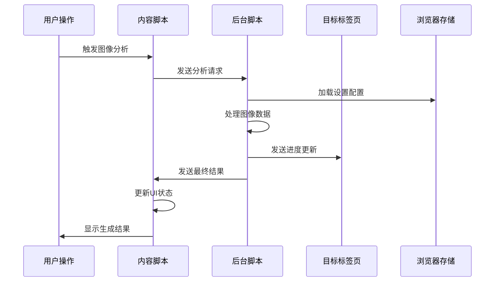

**图表来源**
- [content.js:289-326](file://content.js#L289-L326)
- [background.js:212-320](file://background.js#L212-L320)

### 消息类型定义

扩展定义了完整的消息类型体系，涵盖从用户交互到系统管理的各个方面：

| 消息类型 | 发送方 | 接收方 | 用途 | 参数 |
|---------|--------|--------|------|------|
| `prompt:start-analysis` | 上下文菜单/快捷键 | background.js | 开始图像分析 | srcUrl, imageDataUrl, trigger |
| `prompt:start-snipping` | 快捷键命令 | content.js | 截图分析 | dataUrl |
| `prompt:begin-generation` | content.js | background.js | 开始生成流程 | requestId, srcUrl, imageDataUrl |
| `prompt:progress` | background.js | content.js | 进度更新 | requestId, progress, text |
| `prompt:result` | background.js | content.js | 生成完成 | requestId, prompts, source |
| `prompt:canceled` | background.js | content.js | 取消通知 | requestId, errorCode |
| `prompt:error` | background.js | content.js | 错误通知 | requestId, errorCode, message |
| `prompt:load-history-item` | options.js | content.js | 加载历史记录 | data |
| `prompt:cancel-generation` | content.js | background.js | 取消生成 | requestId |
| `settings:updated` | options.js | content.js | 设置更新 | - |
| `analytics:track` | content.js/options.js | background.js | 数据分析 | event, properties |

**章节来源**
- [content.js:209-247](file://content.js#L209-L247)
- [background.js:94-184](file://background.js#L94-L184)

## 架构概览

### 整体通信架构

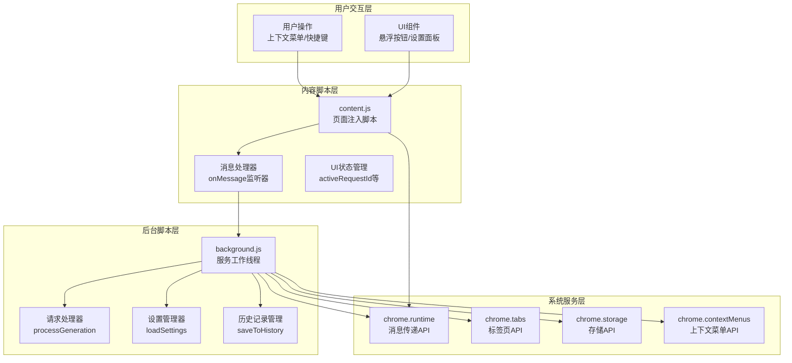

**图表来源**
- [manifest.json:10-26](file://manifest.json#L10-L26)
- [content.js:209-247](file://content.js#L209-L247)
- [background.js:94-184](file://background.js#L94-L184)

### 消息路由策略

扩展采用了分层的消息路由策略，确保消息能够准确到达目标组件：

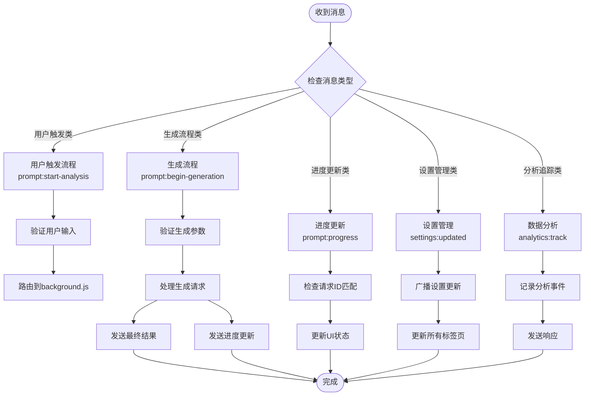

**图表来源**
- [content.js:249-326](file://content.js#L249-L326)
- [background.js:170-184](file://background.js#L170-L184)

**章节来源**
- [content.js:249-326](file://content.js#L249-L326)
- [background.js:170-184](file://background.js#L170-L184)

## 详细组件分析

### Background Script 消息处理

#### 主消息监听器

background.js 实现了一个强大的主消息监听器，负责处理来自 content script 的各种请求：

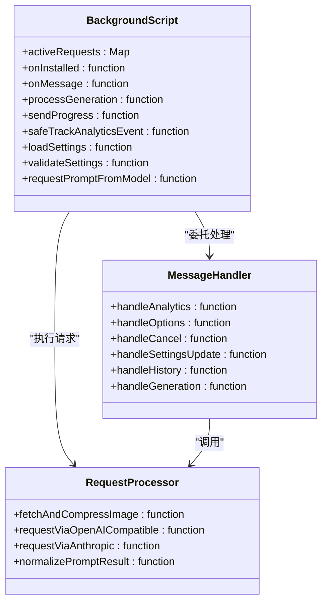

**图表来源**
- [background.js:94-184](file://background.js#L94-L184)
- [background.js:212-320](file://background.js#L212-L320)

#### 异步响应处理

background.js 使用了标准的 Chrome Extension 异步响应模式：

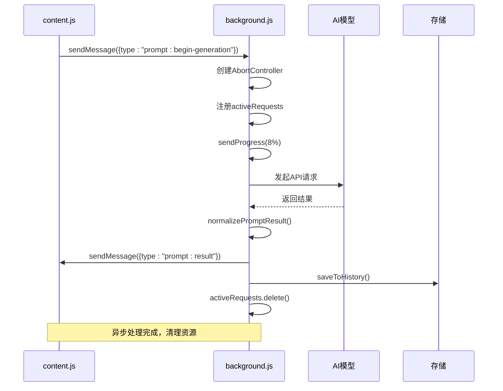

**图表来源**
- [background.js:170-184](file://background.js#L170-L184)
- [background.js:212-320](file://background.js#L212-L320)

**章节来源**
- [background.js:94-184](file://background.js#L94-L184)
- [background.js:212-320](file://background.js#L212-L320)

### Content Script 消息处理

#### 消息监听器实现

content.js 实现了完整的消息监听器，负责处理来自 background.js 的各种通知：

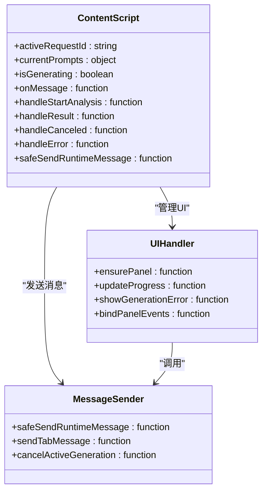

**图表来源**
- [content.js:209-247](file://content.js#L209-L247)
- [content.js:249-326](file://content.js#L249-L326)

#### 消息验证和错误处理

content.js 实现了完善的消息验证和错误处理机制：

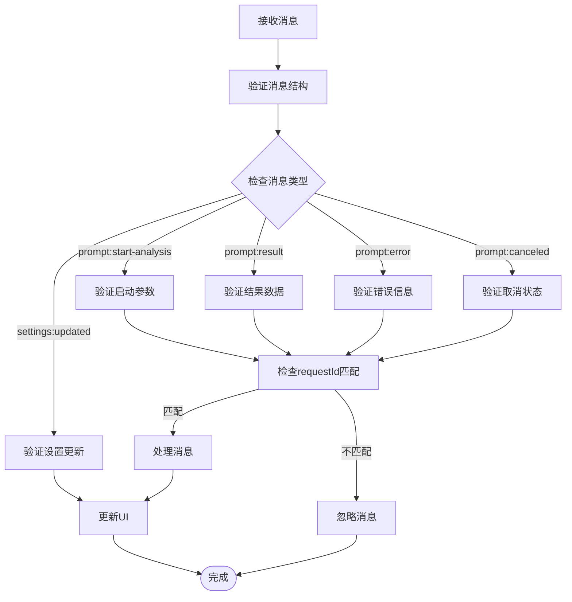

**图表来源**
- [content.js:209-247](file://content.js#L209-L247)
- [content.js:56-75](file://content.js#L56-L75)

**章节来源**
- [content.js:209-247](file://content.js#L209-L247)
- [content.js:56-75](file://content.js#L56-L75)

### 消息类型定义和参数规范

#### 完整的消息类型定义

扩展定义了以下消息类型及其参数规范：

**启动分析消息**
- 类型: `prompt:start-analysis`
- 参数: `{ requestId, srcUrl, pageUrl, trigger }`
- 用途: 从上下文菜单或快捷键启动图像分析

**生成请求消息**
- 类型: `prompt:begin-generation`
- 参数: `{ requestId, srcUrl, imageDataUrl, trigger, pageContext }`
- 用途: 开始实际的图像生成流程

**进度更新消息**
- 类型: `prompt:progress`
- 参数: `{ requestId, progress, text }`
- 用途: 实时更新生成进度

**结果消息**
- 类型: `prompt:result`
- 参数: `{ requestId, prompts, source }`
- 用途: 发送最终的生成结果

**取消消息**
- 类型: `prompt:canceled`
- 参数: `{ requestId, errorCode }`
- 用途: 通知生成过程被取消

**错误消息**
- 类型: `prompt:error`
- 参数: `{ requestId, errorCode, message }`
- 用途: 发送错误信息给用户

**章节来源**
- [content.js:209-247](file://content.js#L209-L247)
- [background.js:256-264](file://background.js#L256-L264)

### 消息路由和处理流程

#### 完整的消息处理流程

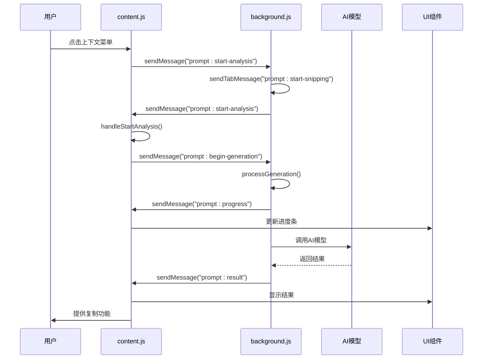

**图表来源**
- [content.js:249-326](file://content.js#L249-L326)
- [background.js:212-320](file://background.js#L212-L320)

**章节来源**
- [content.js:249-326](file://content.js#L249-L326)
- [background.js:212-320](file://background.js#L212-L320)

## 依赖关系分析

### 组件耦合度分析

扩展的通信机制展现了良好的模块化设计，各组件之间具有适当的耦合度：

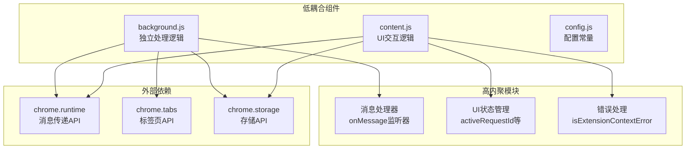

**图表来源**
- [background.js:94-184](file://background.js#L94-L184)
- [content.js:209-247](file://content.js#L209-L247)

### 潜在循环依赖

经过分析，扩展的通信机制没有发现循环依赖问题。各组件遵循单向数据流原则：

- **content.js** → **background.js**：单向消息传递
- **options.js** → **background.js**：单向设置更新
- **background.js** → **content.js**：单向状态通知

这种设计确保了系统的稳定性和可维护性。

**章节来源**
- [background.js:94-184](file://background.js#L94-L184)
- [content.js:209-247](file://content.js#L209-L247)

## 性能考虑

### 消息传递优化

扩展在消息传递方面采用了多项性能优化策略：

1. **异步处理**: 所有消息处理都是异步的，避免阻塞主线程
2. **请求去重**: 使用 `activeRequests` Map 避免重复处理相同请求
3. **进度分片**: 将长耗时操作分解为多个进度更新
4. **错误快速返回**: 及时处理错误情况，避免资源浪费

### 内存管理

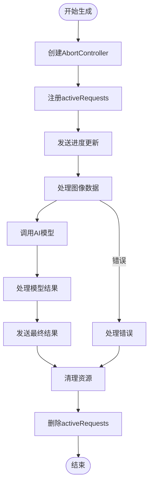

**图表来源**
- [background.js:212-320](file://background.js#L212-L320)

### 资源清理策略

扩展实现了完善的资源清理机制：

- **请求超时**: 使用 AbortController 支持请求取消
- **内存释放**: 及时清理 activeRequests Map 中的条目
- **事件监听器**: 在适当时候移除事件监听器
- **定时器清理**: 使用 clear 方法清理定时器

**章节来源**
- [background.js:17-17](file://background.js#L17-L17)
- [background.js:212-320](file://background.js#L212-L320)

## 故障排除指南

### 常见通信问题

#### 消息丢失问题

**症状**: content script 无法接收到 background.js 的消息

**可能原因**:
1. 消息类型不匹配
2. requestId 不一致
3. Tab 页未正确注入 content script

**解决方案**:
1. 检查消息类型字符串是否完全匹配
2. 确保 requestId 在整个生命周期内保持一致
3. 验证 manifest.json 中的 content_scripts 配置

#### 异步响应超时

**症状**: sendMessage 调用后没有收到响应

**可能原因**:
1. background.js 中的异步操作超时
2. 网络请求失败
3. AbortController 被提前触发

**解决方案**:
1. 检查网络连接和 API 端点
2. 实现适当的超时处理机制
3. 确保正确的错误处理和响应发送

#### UI 状态不同步

**症状**: UI 显示的状态与实际处理状态不一致

**可能原因**:
1. 消息处理顺序问题
2. 多个并发请求干扰
3. 缺少状态清理

**解决方案**:
1. 实现严格的请求 ID 匹配
2. 确保每个请求都有独立的状态管理
3. 在错误情况下正确清理 UI 状态

**章节来源**
- [content.js:56-75](file://content.js#L56-L75)
- [background.js:280-317](file://background.js#L280-L317)

### 调试技巧

#### 日志记录

扩展在关键位置添加了详细的日志记录：

```javascript
// 在 background.js 中
console.log('[ImgPrompt] Processing generation request:', { requestId, tabId });

// 在 content.js 中  
console.warn('[PicPrompt] Generation error:', message.errorCode, errorMessage);
```

#### 错误分类

扩展实现了详细的错误分类机制：

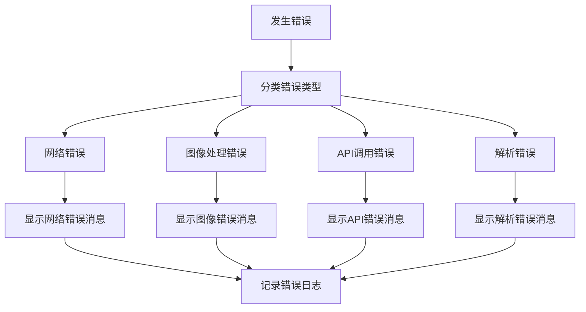

**图表来源**
- [background.js:296-317](file://background.js#L296-L317)

**章节来源**
- [background.js:296-317](file://background.js#L296-L317)

## 结论

Img2Prompt 的通信机制设计展现了现代 Chrome Extension 的最佳实践。通过精心设计的消息传递协议、完善的错误处理机制和性能优化策略，该扩展实现了可靠的跨脚本通信。

### 设计亮点

1. **清晰的消息类型定义**: 完整的消息类型体系确保了通信的明确性和可维护性
2. **异步处理模式**: 采用标准的 Chrome Extension 异步响应模式，避免了阻塞问题
3. **健壮的错误处理**: 实现了多层次的错误检测和处理机制
4. **性能优化**: 通过请求去重、进度分片和资源清理等策略提升了整体性能
5. **安全考虑**: 实现了消息验证和错误传播机制

### 改进建议

1. **超时处理**: 可以考虑为长时间运行的操作添加超时机制
2. **重试策略**: 对于临时性错误可以实现自动重试机制
3. **监控指标**: 可以添加更详细的性能监控和错误统计
4. **文档完善**: 可以进一步完善 API 文档和使用示例

该通信机制为类似的应用提供了优秀的参考模板，展示了如何在 Chrome Extension 中实现高效、可靠的跨脚本通信。