# 错误处理机制

<cite>
**本文档引用的文件**
- [config.js](file://config.js)
- [background.js](file://background.js)
- [content.js](file://content.js)
- [manifest.json](file://manifest.json)
- [options.js](file://options.js)
- [_locales/en/messages.json](file://_locales/en/messages.json)
- [_locales/zh_CN/messages.json](file://_locales/zh_CN/messages.json)
</cite>

## 目录
1. [简介](#简介)
2. [项目结构](#项目结构)
3. [核心组件](#核心组件)
4. [架构概览](#架构概览)
5. [详细组件分析](#详细组件分析)
6. [依赖关系分析](#依赖关系分析)
7. [性能考虑](#性能考虑)
8. [故障排除指南](#故障排除指南)
9. [结论](#结论)

## 简介

Img2Prompt 是一个 Chrome 扩展程序，能够将图片转换为 AI 提示词。该扩展实现了完善的错误处理机制，涵盖了从配置验证到 API 调用、从网络连接到用户界面的全方位错误管理。本文档将深入分析其错误处理架构，包括错误分类体系、错误码定义、国际化错误消息处理，以及关键函数的实现逻辑。

## 项目结构

Img2Prompt 采用模块化架构，主要由以下几个核心部分组成：

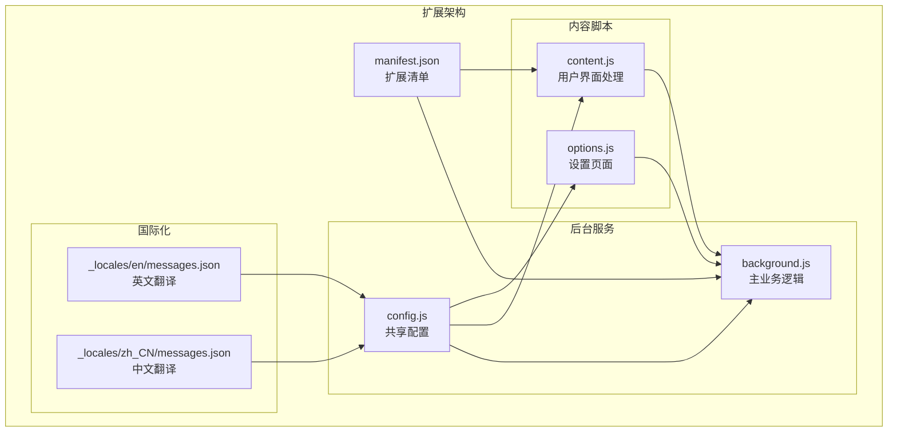

**图表来源**
- [manifest.json:1-45](file://manifest.json#L1-L45)
- [config.js:1-253](file://config.js#L1-L253)

**章节来源**
- [manifest.json:1-45](file://manifest.json#L1-L45)
- [config.js:1-253](file://config.js#L1-L253)

## 核心组件

### 错误分类体系

Img2Prompt 实现了一个层次化的错误分类系统，将错误分为多个类别以便于处理和用户提示：

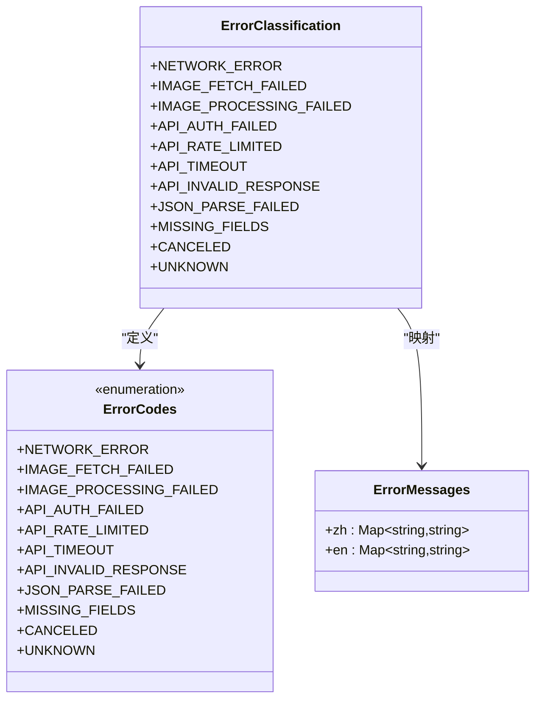

**图表来源**
- [config.js:206-247](file://config.js#L206-L247)

### 错误处理流程

扩展的错误处理遵循统一的流程模式：

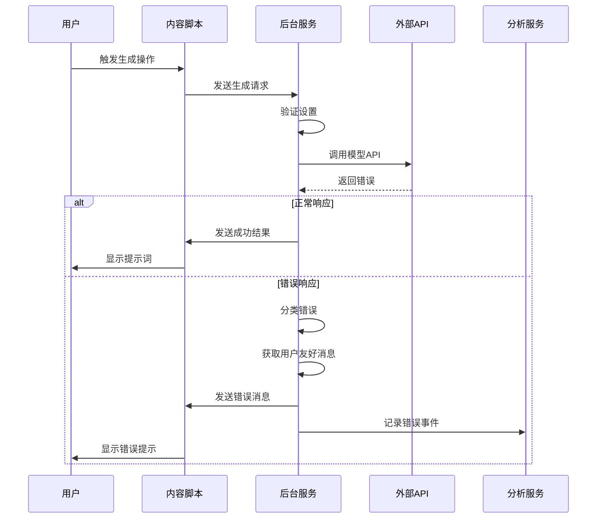

**图表来源**
- [background.js:212-320](file://background.js#L212-L320)
- [content.js:209-247](file://content.js#L209-L247)

**章节来源**
- [config.js:206-247](file://config.js#L206-L247)
- [background.js:212-320](file://background.js#L212-L320)
- [content.js:209-247](file://content.js#L209-L247)

## 架构概览

### 错误处理架构

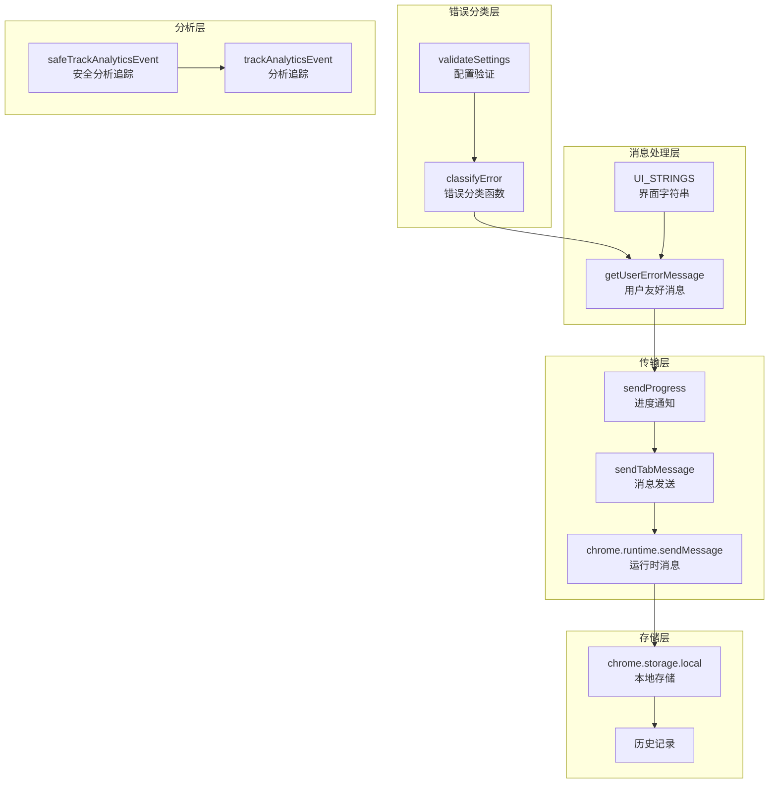

**图表来源**
- [background.js:872-945](file://background.js#L872-L945)
- [config.js:32-113](file://config.js#L32-L113)

## 详细组件分析

### 错误分类函数 (classifyError)

`classifyError` 函数是错误处理的核心组件，负责将底层异常转换为标准化的错误代码：

#### 实现逻辑

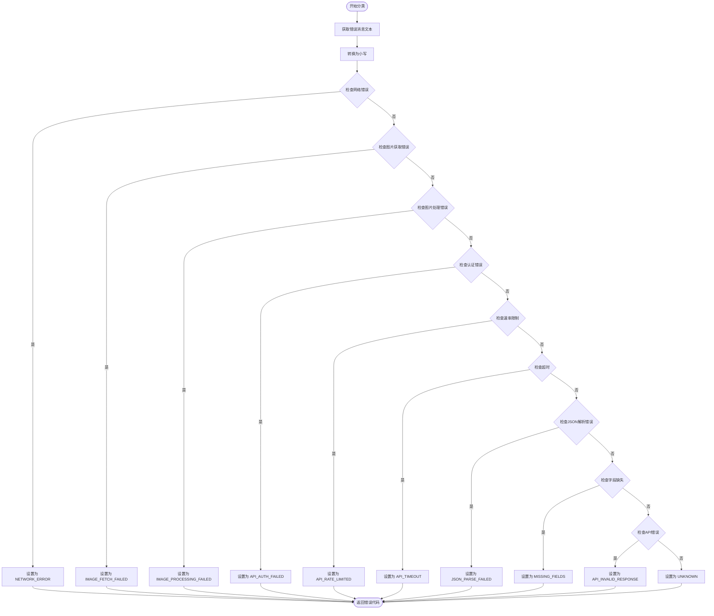

**图表来源**
- [background.js:872-945](file://background.js#L872-L945)

#### 错误匹配规则

| 错误类型 | 匹配关键词 | 示例检测 |
|---------|-----------|----------|
| 网络错误 | `failed to fetch`, `networkerror`, `network error` | 网络连接失败 |
| 图片获取 | `fetch`, `image`, `404` | 图片URL无效 |
| 图片处理 | `base64`, `image processing`, `bitmap` | 图片编码失败 |
| 认证失败 | `(401)`, `authentication`, `api key`, `unauthorized` | API密钥无效 |
| 速率限制 | `(429)`, `rate limit`, `too many requests` | 调用频率过高 |
| 超时 | `timeout`, `timed out`, `(408)` | 请求超时 |
| JSON解析 | `json`, `parse`, `invalid json` | 响应格式错误 |
| 字段缺失 | `zh/en`, `missing`, `field` | 缺少必要字段 |

**章节来源**
- [background.js:872-945](file://background.js#L872-L945)

### 配置验证函数 (validateSettings)

`validateSettings` 函数确保用户配置的有效性，防止后续操作因配置问题而失败：

#### 验证逻辑

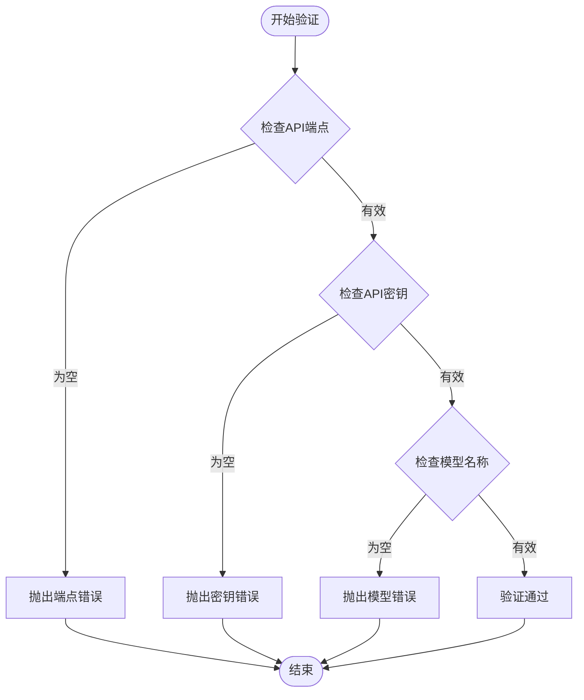

**图表来源**
- [background.js:465-476](file://background.js#L465-L476)

#### 验证规则

- **API端点验证**: 必须提供有效的API端点URL
- **API密钥验证**: 必须提供有效的API密钥
- **模型名称验证**: 必须指定使用的AI模型

**章节来源**
- [background.js:465-476](file://background.js#L465-L476)

### 用户友好消息函数 (getUserErrorMessage)

`getUserErrorMessage` 函数根据错误代码和用户语言返回适当的错误提示：

#### 国际化处理

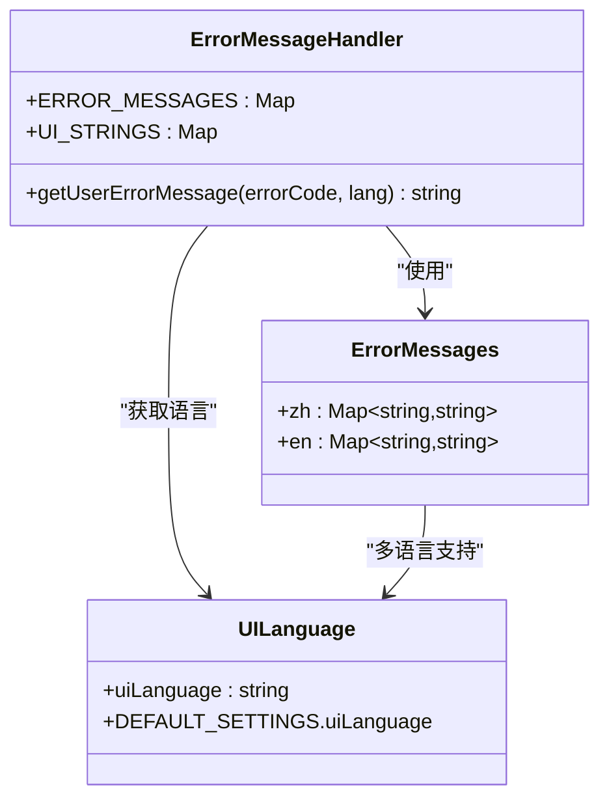

**图表来源**
- [config.js:220-247](file://config.js#L220-L247)
- [background.js:941-945](file://background.js#L941-L945)

#### 错误消息映射

| 错误代码 | 中文消息 | 英文消息 |
|---------|---------|---------|
| NETWORK_ERROR | 网络连接失败，请检查网络后重试。 | Network connection failed. Please check your connection and try again. |
| IMAGE_FETCH_FAILED | 无法获取图片，请确认图片链接有效且可访问。 | Unable to fetch image. Please verify the image URL is valid and accessible. |
| IMAGE_PROCESSING_FAILED | 图片处理失败，请尝试换一张图片或调整分辨率设置。 | Image processing failed. Please try another image or lower the resolution. |
| API_AUTH_FAILED | API 密钥无效或已过期，请检查设置中的 API Key。 | Invalid or expired API key. Please check your API Key in settings. |
| API_RATE_LIMITED | API 调用次数已达上限，请稍后再试或升级配额。 | API rate limit reached. Please try again later or upgrade your quota. |
| API_TIMEOUT | API 请求超时，请检查网络连接或降低图片分辨率。 | API request timed out. Check your connection or lower image resolution. |
| API_INVALID_RESPONSE | API 返回了意外结果，请检查模型配置或更换模型。 | API returned unexpected results. Check model configuration or try another model. |
| JSON_PARSE_FAILED | 模型返回的内容无法解析，请调整 System Prompt 确保输出纯 JSON。 | Could not parse model output. Adjust System Prompt to ensure pure JSON output. |
| MISSING_FIELDS | 模型返回缺少必需的 zh/en 字段，请检查 System Prompt。 | Model response missing required zh/en fields. Check your System Prompt. |
| CANCELED | 已停止生成。 | Generation stopped. |
| UNKNOWN | 发生未知错误，请重试。 | An unknown error occurred. Please try again. |

**章节来源**
- [config.js:220-247](file://config.js#L220-L247)
- [background.js:941-945](file://background.js#L941-L945)

### 错误传播机制

#### 进度通知系统

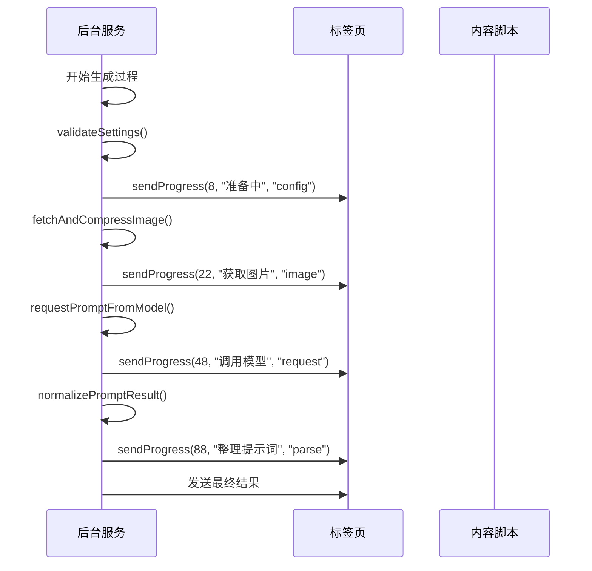

**图表来源**
- [background.js:226-264](file://background.js#L226-L264)

#### 错误传播流程

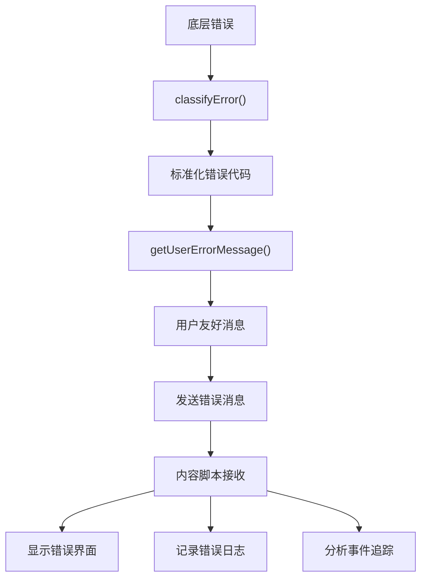

**图表来源**
- [background.js:296-316](file://background.js#L296-L316)
- [content.js:464-487](file://content.js#L464-L487)

**章节来源**
- [background.js:226-264](file://background.js#L226-L264)
- [background.js:296-316](file://background.js#L296-L316)
- [content.js:464-487](file://content.js#L464-L487)

## 依赖关系分析

### 组件依赖图

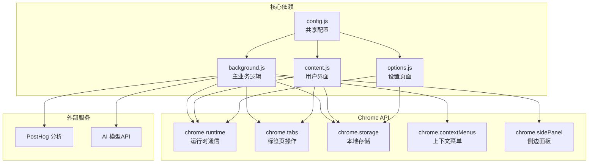

**图表来源**
- [manifest.json:10-41](file://manifest.json#L10-L41)
- [config.js:249-252](file://config.js#L249-L252)

### 错误处理依赖关系

| 组件 | 依赖项 | 用途 |
|------|-------|-----|
| classifyError | ERROR_CODES | 标准化错误代码 |
| getUserErrorMessage | ERROR_MESSAGES, UI_STRINGS | 国际化错误消息 |
| validateSettings | DEFAULT_SETTINGS | 配置验证 |
| sendProgress | sendTabMessage | 进度通知 |
| sendTabMessage | chrome.tabs.sendMessage | 消息传递 |
| safeTrackAnalyticsEvent | trackAnalyticsEvent | 错误追踪 |

**章节来源**
- [manifest.json:10-41](file://manifest.json#L10-L41)
- [config.js:249-252](file://config.js#L249-L252)

## 性能考虑

### 错误处理性能优化

1. **异步错误处理**: 所有错误处理都是异步的，避免阻塞主线程
2. **错误缓存**: 用户友好消息基于错误代码缓存，减少重复计算
3. **条件日志**: 只在必要时记录详细错误信息
4. **资源清理**: 及时清理图像位图和Canvas资源

### 内存管理

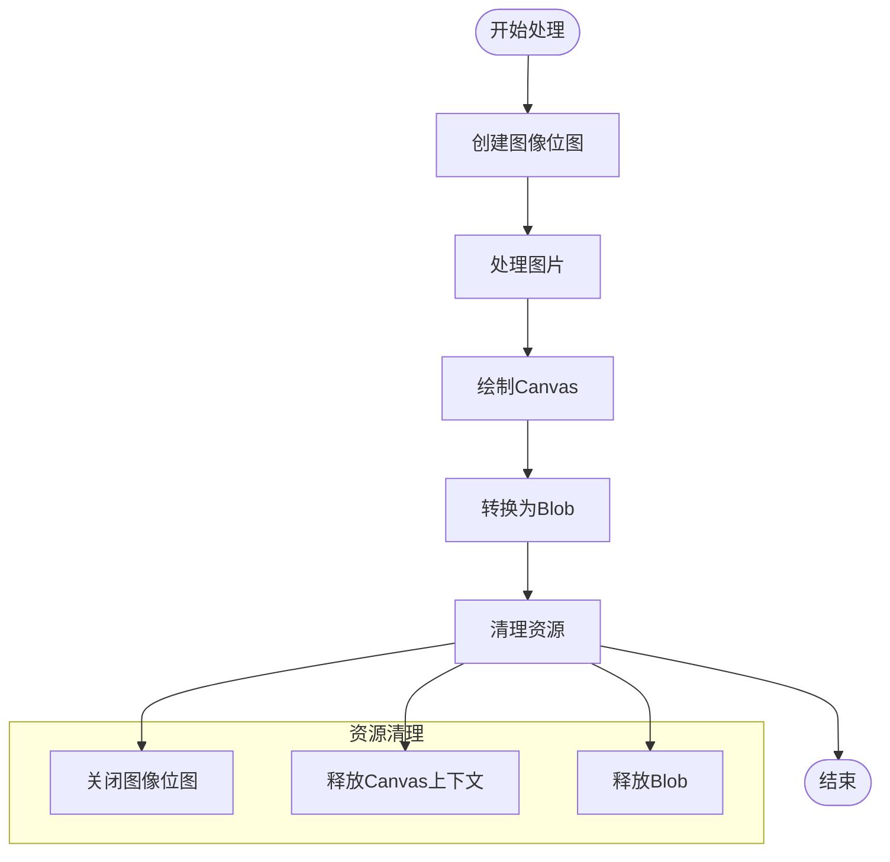

**图表来源**
- [background.js:815-849](file://background.js#L815-L849)

## 故障排除指南

### 常见错误诊断

#### 网络连接错误

**症状**: `NETWORK_ERROR`
**可能原因**:
- 网络连接不稳定
- API端点不可达
- 防火墙阻止访问

**解决方案**:
1. 检查网络连接状态
2. 验证API端点URL正确性
3. 尝试不同的网络环境

#### API认证错误

**症状**: `API_AUTH_FAILED`
**可能原因**:
- API密钥无效或过期
- 权限不足
- 认证头格式错误

**解决方案**:
1. 重新生成API密钥
2. 检查API提供商的权限设置
3. 验证请求头格式

#### 图片处理错误

**症状**: `IMAGE_PROCESSING_FAILED`
**可能原因**:
- 图片格式不受支持
- 图片尺寸过大
- 图片损坏

**解决方案**:
1. 使用标准图片格式 (JPEG/PNG)
2. 降低图片分辨率
3. 尝试不同的图片源

#### 速率限制错误

**症状**: `API_RATE_LIMITED`
**可能原因**:
- 超过API调用限制
- 短时间内频繁请求
- 账户配额不足

**解决方案**:
1. 等待冷却时间结束
2. 降低请求频率
3. 升级API账户配额

### 调试技巧

#### 开发者工具使用

1. **控制台日志**: 查看详细的错误堆栈信息
2. **网络面板**: 监控API请求和响应
3. **应用面板**: 检查本地存储的数据状态
4. **扩展面板**: 查看扩展的运行时状态

#### 错误日志分析

```javascript
// 错误日志格式示例
{
  timestamp: Date.now(),
  errorCode: "API_AUTH_FAILED",
  errorMessage: "认证失败（API 密钥无效）",
  stackTrace: "Error: 认证失败（API 密钥无效）",
  context: {
    model: "gpt-5-mini",
    endpoint: "https://api.openai.com/v1/chat/completions",
    trigger: "context_menu"
  }
}
```

#### 最佳实践

1. **渐进式错误处理**: 从粗粒度到细粒度逐步处理
2. **用户反馈**: 提供清晰的用户友好错误消息
3. **错误恢复**: 实现自动重试和手动重试机制
4. **监控告警**: 设置关键错误的实时告警

**章节来源**
- [background.js:872-945](file://background.js#L872-L945)
- [content.js:56-63](file://content.js#L56-L63)

## 结论

Img2Prompt 的错误处理机制展现了现代浏览器扩展的最佳实践，具有以下特点：

1. **完整的错误分类体系**: 11种标准化错误类型覆盖了主要的使用场景
2. **国际化的用户体验**: 支持中英文双语的用户友好错误消息
3. **可靠的错误传播**: 从后台服务到用户界面的完整错误链路
4. **智能的错误恢复**: 结合自动重试和手动干预的混合策略
5. **完善的监控机制**: 集成分析服务进行错误统计和趋势分析

该错误处理架构不仅提供了良好的用户体验，还为后续的功能扩展和维护奠定了坚实的基础。通过持续的监控和优化，可以进一步提升系统的稳定性和可靠性。