# 配置管理开发

<cite>
**本文档引用的文件**
- [config.js](file://config.js)
- [options.html](file://options.html)
- [options.js](file://options.js)
- [background.js](file://background.js)
- [content.js](file://content.js)
- [manifest.json](file://manifest.json)
- [messages.json](file://_locales/en/messages.json)
- [messages.json](file://_locales/zh_CN/messages.json)
</cite>

## 更新摘要
**变更内容**
- 更新了配置备份恢复流程的实现细节
- 增强了 Chrome 扩展存储 API 集成机制
- 改进了表单填充机制和模板渲染能力
- 新增了高还原度模式配置支持
- 优化了设置导入导出功能

## 目录
1. [简介](#简介)
2. [项目结构](#项目结构)
3. [核心组件](#核心组件)
4. [架构概览](#架构概览)
5. [详细组件分析](#详细组件分析)
6. [依赖关系分析](#依赖关系分析)
7. [性能考虑](#性能考虑)
8. [故障排除指南](#故障排除指南)
9. [结论](#结论)
10. [附录](#附录)

## 简介

Img2Prompt 是一个 Chrome 扩展程序，能够将图片转换为 AI 提示词。该扩展的配置管理系统是整个应用的核心基础设施，负责管理用户设置、界面国际化、错误处理以及配置的持久化存储。

本指南将深入分析 `config.js` 中的配置架构设计，包括 DEFAULT_SETTINGS 的结构定义、UI_STRINGS 的国际化支持、ERROR_CODES 的错误码管理，并提供完整的开发示例和最佳实践建议。

## 项目结构

Img2Prompt 采用模块化的架构设计，主要文件组织如下：

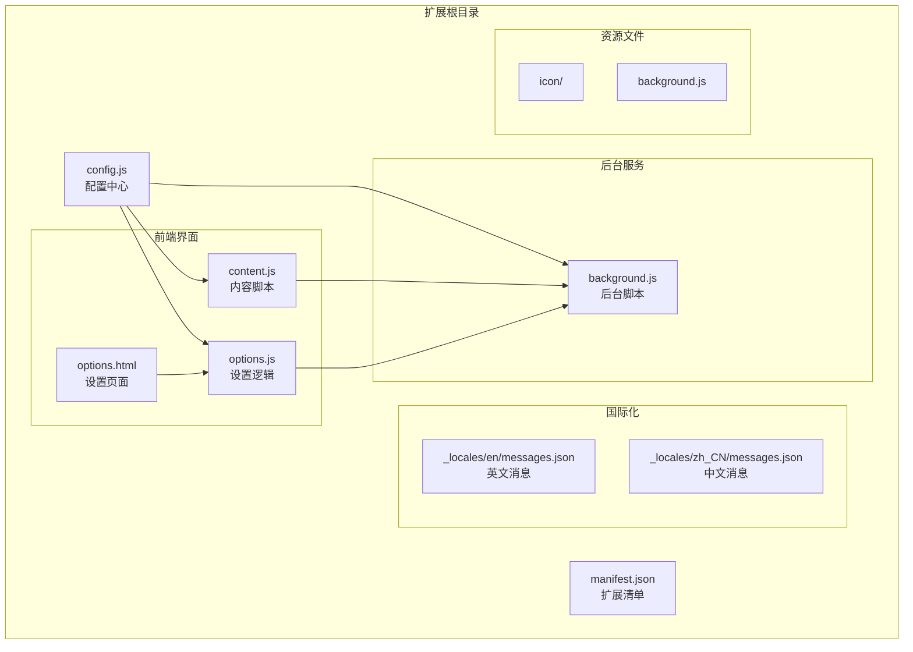

**图表来源**
- [config.js:1-321](file://config.js#L1-L321)
- [manifest.json:1-45](file://manifest.json#L1-L45)

**章节来源**
- [config.js:1-321](file://config.js#L1-L321)
- [manifest.json:1-45](file://manifest.json#L1-L45)

## 核心组件

### 配置中心架构

Img2Prompt 的配置系统围绕 `ImgPromptConfig` 对象构建，该对象提供了统一的配置管理接口：

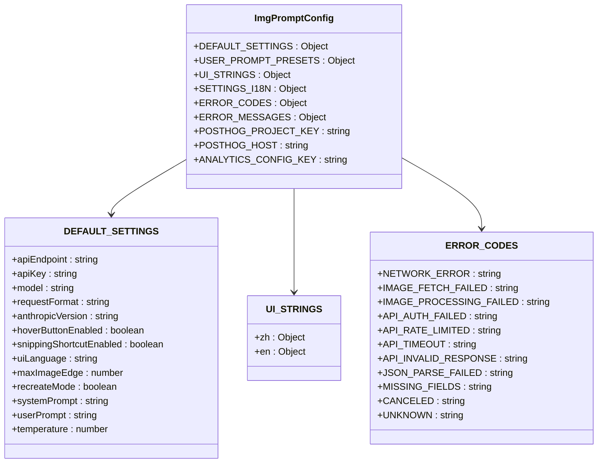

**图表来源**
- [config.js:4-321](file://config.js#L4-L321)

### 数据流架构

配置系统通过以下流程实现数据的统一管理和分发：

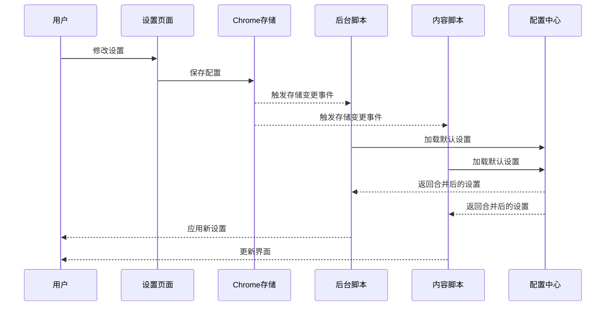

**图表来源**
- [options.js:692-710](file://options.js#L692-L710)
- [background.js:151-164](file://background.js#L151-L164)
- [content.js:181-201](file://content.js#L181-L201)

**章节来源**
- [config.js:4-321](file://config.js#L4-L321)
- [options.js:692-710](file://options.js#L692-L710)
- [background.js:151-164](file://background.js#L151-L164)
- [content.js:181-201](file://content.js#L181-L201)

## 架构概览

### 配置层次结构

Img2Prompt 的配置系统采用分层设计，确保配置的一致性和可维护性：

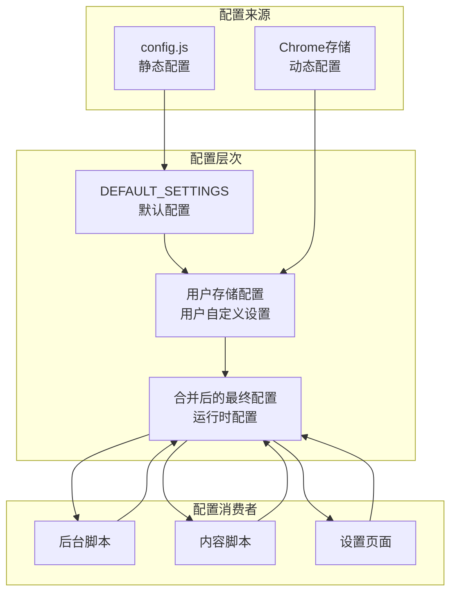

**图表来源**
- [config.js:23-41](file://config.js#L23-L41)
- [options.js:228-234](file://options.js#L228-L234)
- [background.js:43-52](file://background.js#L43-L52)

### 国际化架构

系统支持双语界面，通过统一的国际化字符串管理：

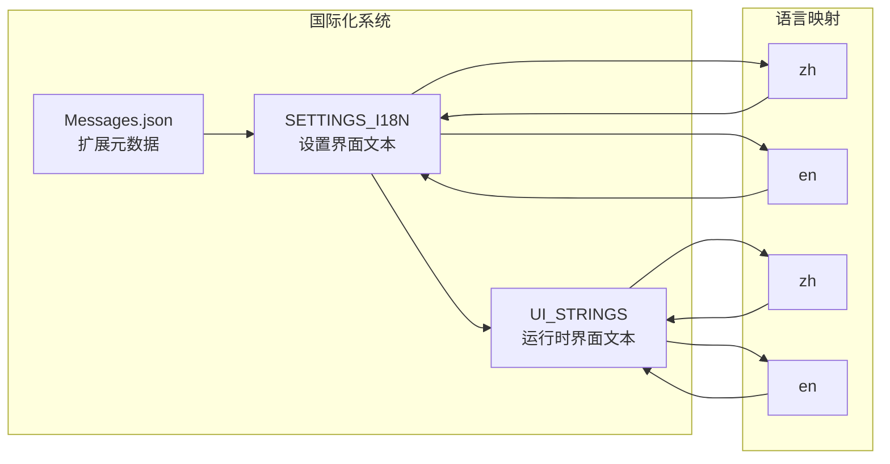

**图表来源**
- [config.js:160-261](file://config.js#L160-L261)
- [config.js:57-158](file://config.js#L57-L158)

**章节来源**
- [config.js:160-261](file://config.js#L160-L261)
- [config.js:57-158](file://config.js#L57-L158)

## 详细组件分析

### DEFAULT_SETTINGS 结构分析

DEFAULT_SETTINGS 定义了扩展的所有默认配置项，采用严格的类型定义和合理的默认值：

#### 核心配置项

| 配置项 | 类型 | 默认值 | 用途 |
|--------|------|--------|------|
| apiEndpoint | string | "https://api.openai.com/v1/chat/completions" | API 端点地址 |
| apiKey | string | "" | 认证密钥 |
| model | string | "gpt-5-mini" | AI 模型名称 |
| requestFormat | string | "auto" | 请求格式 ("auto" \| "openai" \| "anthropic") |
| anthropicVersion | string | "2023-06-01" | Anthropic API 版本 |
| hoverButtonEnabled | boolean | true | 是否启用悬停按钮 |
| snippingShortcutEnabled | boolean | true | 是否启用截图功能 |
| uiLanguage | string | "zh" | 界面语言 ("zh" \| "en") |
| maxImageEdge | number | 1024 | 最大图片尺寸 |
| recreateMode | boolean | false | 高还原度模式开关 |
| systemPrompt | string | 复杂的 JSON 提示词 | 系统提示词模板 |
| userPrompt | string | 结构化分析提示词 | 用户提示词模板 |
| temperature | number | 1 | 生成温度 |

#### 配置项验证规则

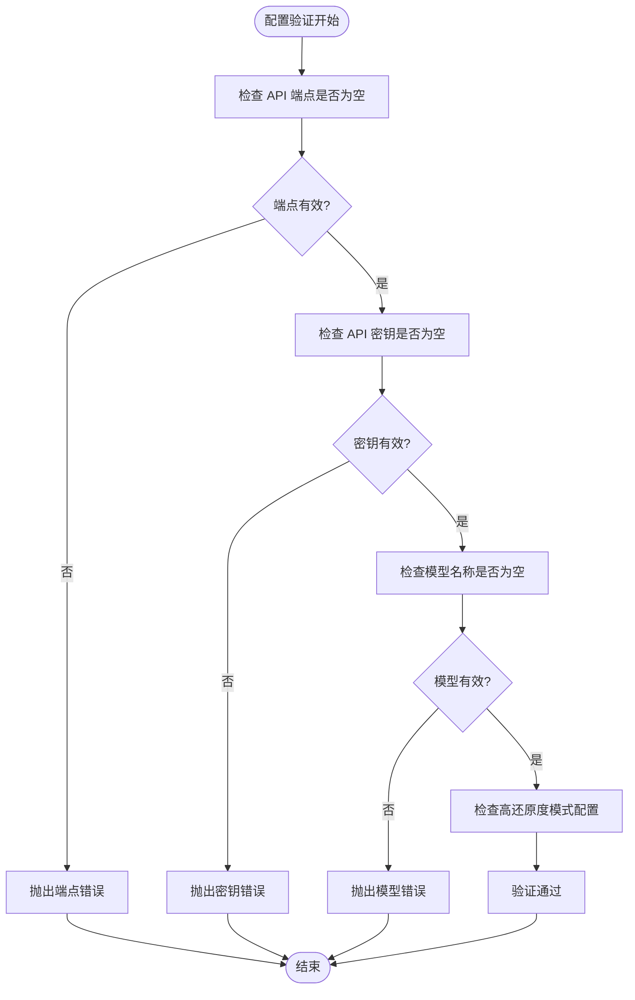

**图表来源**
- [background.js:587-598](file://background.js#L587-L598)

**章节来源**
- [config.js:23-41](file://config.js#L23-L41)
- [background.js:587-598](file://background.js#L587-L598)

### UI_STRINGS 国际化系统

UI_STRINGS 提供了完整的界面文本国际化支持，包含 112 个翻译键值：

#### 翻译键值分类

| 分类 | 键值数量 | 示例键值 |
|------|----------|----------|
| 基础状态 | 12 | preparing, generating, completed |
| 错误消息 | 10 | modelFailed, base64Failed, missingFields |
| 操作按钮 | 8 | copyBtn, stopButton, resetButton |
| 历史记录 | 6 | historyTitle, historyEmpty, historyCopy |
| 提示文本 | 20+ | placeholder, subtitle, endpointHint |

#### 国际化实现机制

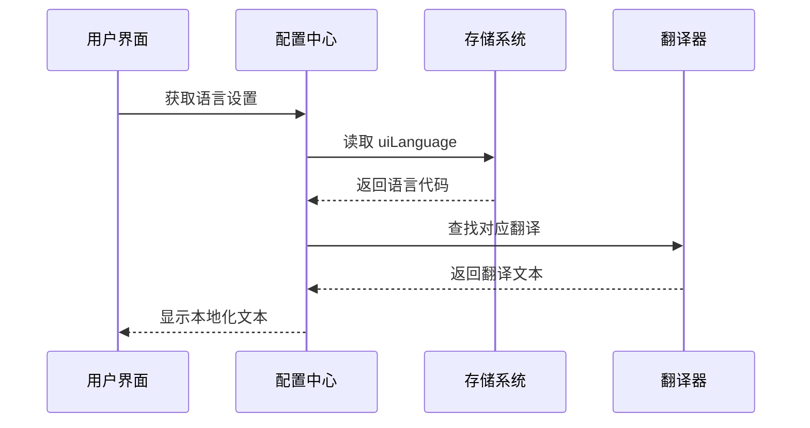

**图表来源**
- [options.js:730-760](file://options.js#L730-L760)
- [content.js:203-245](file://content.js#L203-L245)

**章节来源**
- [config.js:57-158](file://config.js#L57-L158)
- [options.js:730-760](file://options.js#L730-L760)
- [content.js:203-245](file://content.js#L203-L245)

### ERROR_CODES 错误码管理

ERROR_CODES 定义了扩展支持的所有错误类型，采用统一的错误码命名规范：

#### 错误码分类

| 分类 | 错误码 | 描述 |
|------|--------|------|
| 网络错误 | NETWORK_ERROR | 网络连接失败 |
| 图片处理 | IMAGE_FETCH_FAILED | 图片获取失败 |
| API 错误 | API_AUTH_FAILED | 认证失败 |
| 速率限制 | API_RATE_LIMITED | 调用次数超限 |
| 超时错误 | API_TIMEOUT | 请求超时 |
| 解析错误 | JSON_PARSE_FAILED | JSON 解析失败 |
| 字段缺失 | MISSING_FIELDS | 必需字段缺失 |
| 用户取消 | CANCELED | 用户主动取消 |

#### 错误处理流程

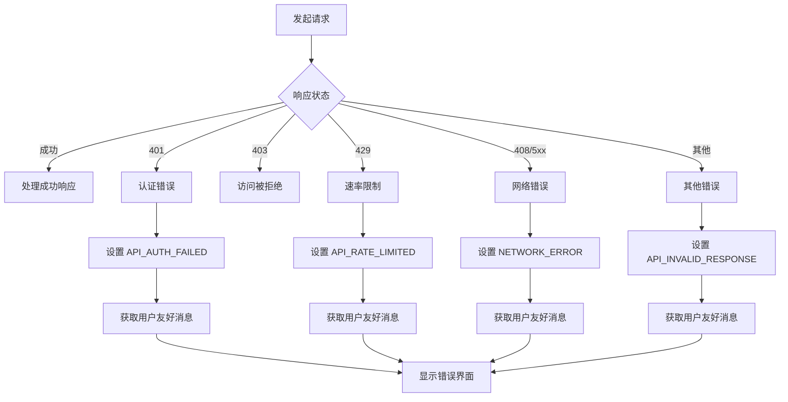

**图表来源**
- [background.js:1067-1134](file://background.js#L1067-L1134)
- [background.js:1136-1139](file://background.js#L1136-L1139)

**章节来源**
- [config.js:263-275](file://config.js#L263-L275)
- [background.js:1067-1134](file://background.js#L1067-L1134)

### 配置持久化机制

配置系统使用 Chrome Extension Storage API 实现配置的持久化存储：

#### 存储架构

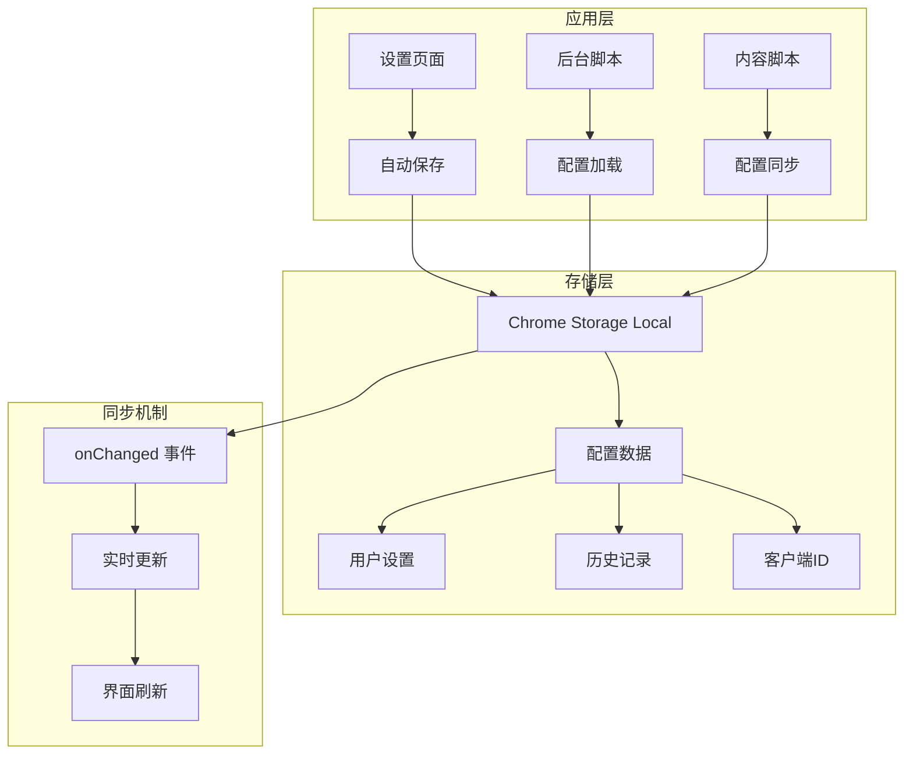

**图表来源**
- [options.js:692-710](file://options.js#L692-L710)
- [background.js:151-164](file://background.js#L151-L164)
- [content.js:151-179](file://content.js#L151-L179)

**章节来源**
- [options.js:692-710](file://options.js#L692-L710)
- [background.js:151-164](file://background.js#L151-L164)
- [content.js:151-179](file://content.js#L151-L179)

### 高还原度模式配置

新增的高还原度模式配置提供了更详细的分析提示词，包含负面提示词和技术参数：

#### 高还原度模式配置项

| 配置项 | 类型 | 默认值 | 用途 |
|--------|------|--------|------|
| recreateMode | boolean | false | 高还原度模式开关 |
| systemPrompt | string | 包含额外约束 | 增强的系统提示词 |
| userPrompt | string | 包含额外约束 | 增强的用户提示词 |

#### 高还原度模式实现机制

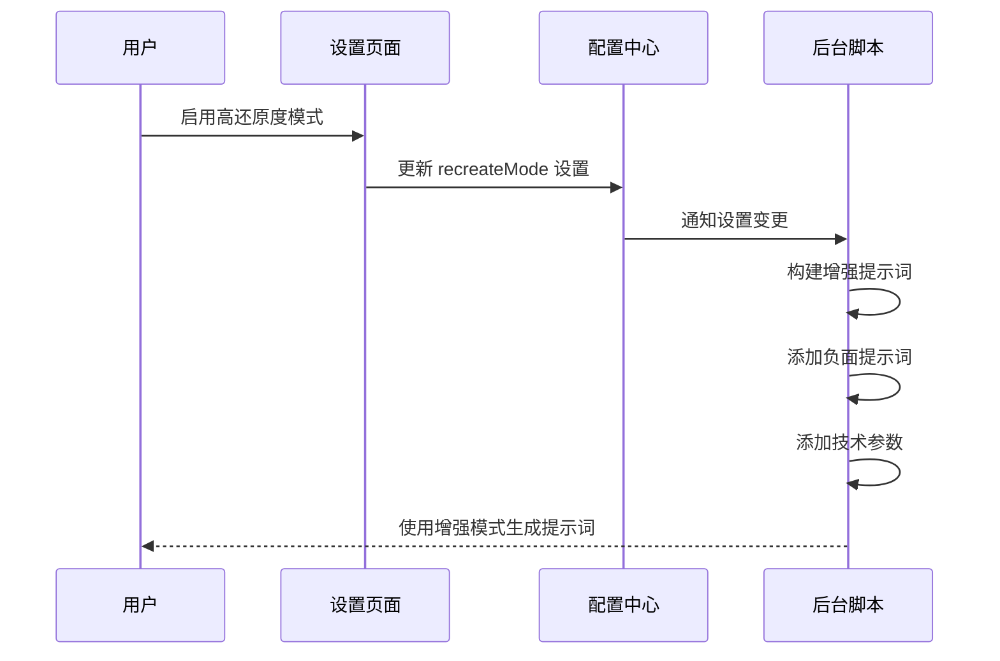

**图表来源**
- [config.js:311-321](file://config.js#L311-L321)
- [background.js:639-649](file://background.js#L639-L649)

**章节来源**
- [config.js:311-321](file://config.js#L311-L321)
- [background.js:639-649](file://background.js#L639-L649)

## 依赖关系分析

### 组件间依赖关系

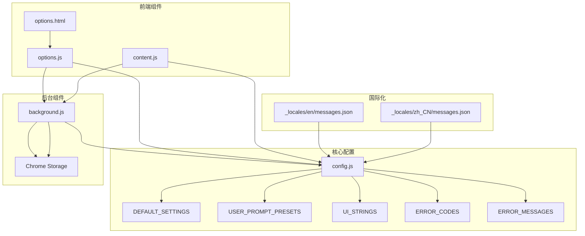

**图表来源**
- [config.js:1-321](file://config.js#L1-L321)
- [options.js:1-923](file://options.js#L1-L923)
- [background.js:1-1180](file://background.js#L1-L1180)
- [content.js:1-1812](file://content.js#L1-L1812)

### 数据流依赖

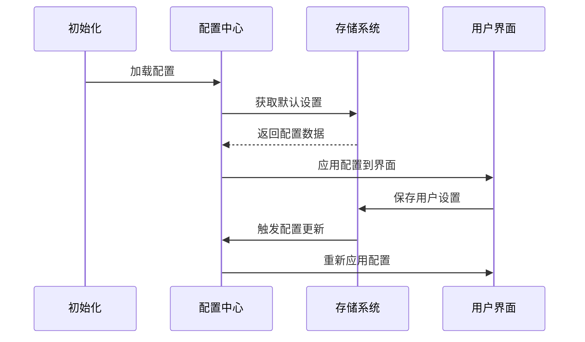

**图表来源**
- [options.js:221-256](file://options.js#L221-L256)
- [background.js:43-52](file://background.js#L43-L52)

**章节来源**
- [config.js:1-321](file://config.js#L1-L321)
- [options.js:221-256](file://options.js#L221-L256)
- [background.js:43-52](file://background.js#L43-L52)

## 性能考虑

### 配置加载优化

系统采用了多种优化策略来提升配置加载性能：

1. **延迟初始化**: 配置只在需要时加载，避免不必要的初始化开销
2. **缓存机制**: 使用内存缓存减少重复的存储访问
3. **批量操作**: 支持批量配置更新，减少存储写入次数
4. **增量更新**: 只更新发生变化的配置项

### 内存管理

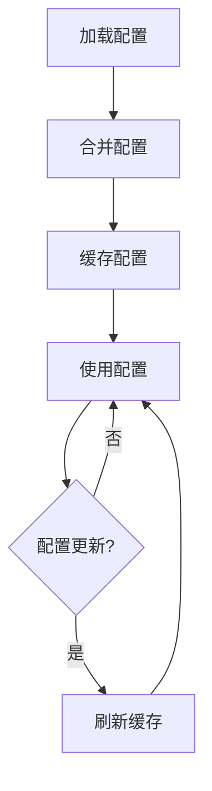

**图表来源**
- [options.js:228-234](file://options.js#L228-L234)
- [background.js:43-52](file://background.js#L43-L52)

## 故障排除指南

### 常见配置问题

#### 设置页面无法保存配置

**症状**: 用户修改设置后重启页面发现设置恢复默认值

**可能原因**:
1. Chrome 存储权限问题
2. 配置验证失败
3. 自动保存定时器冲突

**解决方案**:
1. 检查浏览器存储权限设置
2. 验证配置格式正确性
3. 清除浏览器缓存

#### 国际化文本显示异常

**症状**: 界面文本显示为英文或乱码

**可能原因**:
1. 语言设置损坏
2. 翻译文件缺失
3. 缓存问题

**解决方案**:
1. 重置语言设置到默认值
2. 检查翻译文件完整性
3. 刷新页面清除缓存

#### 错误消息显示不正确

**症状**: 错误提示与实际错误不符

**可能原因**:
1. 错误码映射表不完整
2. 语言环境切换问题
3. 错误分类逻辑错误

**解决方案**:
1. 检查 ERROR_CODES 和 ERROR_MESSAGES 的一致性
2. 验证语言环境检测逻辑
3. 更新错误分类算法

#### 高还原度模式配置问题

**症状**: 启用高还原度模式后生成的提示词不符合预期

**可能原因**:
1. recreateMode 配置未正确保存
2. 系统提示词构建逻辑错误
3. 用户提示词叠加逻辑问题

**解决方案**:
1. 检查 recreateMode 配置项的保存状态
2. 验证系统提示词构建函数的逻辑
3. 确认用户提示词叠加的顺序和条件

**章节来源**
- [options.js:692-710](file://options.js#L692-L710)
- [background.js:1067-1134](file://background.js#L1067-L1134)

## 结论

Img2Prompt 的配置管理系统展现了现代浏览器扩展的最佳实践：

1. **模块化设计**: 通过单一配置中心管理所有配置，提高了代码的可维护性
2. **国际化支持**: 完整的多语言支持系统，便于扩展到更多语言
3. **错误处理**: 统一的错误码管理和用户友好的错误消息
4. **性能优化**: 采用多种优化策略确保配置系统的高效运行
5. **扩展性**: 清晰的架构设计便于添加新的配置选项和功能
6. **高还原度模式**: 新增的高级配置选项提升了用户体验
7. **配置备份恢复**: 完善的导入导出机制确保用户数据安全

该系统为开发者提供了一个可靠的配置管理框架，可以作为其他浏览器扩展项目的参考模板。

## 附录

### 开发示例：添加新的配置选项

#### 步骤1：在 DEFAULT_SETTINGS 中添加新配置项

```javascript
// 在 config.js 的 DEFAULT_SETTINGS 对象中添加
DEFAULT_SETTINGS: {
    // ... 现有配置项
    newFeatureEnabled: false,  // 新增布尔值配置
    newFeatureTimeout: 5000,   // 新增数值配置
    newFeatureMessage: "默认消息" // 新增字符串配置
}
```

#### 步骤2：在设置页面中添加 UI 控件

```html
<!-- 在 options.html 中添加对应的 HTML 元素 -->
<div class="toggle-row">
    <div class="toggle-copy">
        <div class="toggle-title" data-i18n="new-feature-title">新功能开关</div>
        <div class="toggle-note" data-i18n="new-feature-note">启用新功能特性</div>
    </div>
    <label class="switch" aria-label="切换新功能">
        <input id="newFeatureEnabled" name="newFeatureEnabled" type="checkbox" />
        <span class="switch-track"></span>
        <span class="switch-thumb"></span>
    </label>
</div>
```

#### 步骤3：在 options.js 中处理新配置

```javascript
// 在 buildPayload 函数中添加新配置
function buildPayload() {
    return {
        // ... 现有配置
        newFeatureEnabled: form.newFeatureEnabled.checked,
        newFeatureTimeout: parseInt(form.newFeatureTimeout.value, 10) || 5000,
        newFeatureMessage: form.newFeatureMessage.value.trim()
    };
}

// 在 fillForm 函数中填充新配置
function fillForm(settings) {
    // ... 现有配置
    form.newFeatureEnabled.checked = settings.newFeatureEnabled !== false;
    form.newFeatureTimeout.value = settings.newFeatureTimeout || 5000;
    form.newFeatureMessage.value = settings.newFeatureMessage || "";
}
```

#### 步骤4：添加国际化支持

```javascript
// 在 SETTINGS_I18N 中添加新配置的翻译键值
"new-feature-title": "New Feature",
"new-feature-note": "Enable new feature capabilities"

// 在 UI_STRINGS 中添加对应的语言翻译
en: {
    // ... 现有翻译
    "new-feature-title": "New Feature",
    "new-feature-note": "Enable new feature capabilities"
}
```

#### 步骤5：在后台脚本中使用新配置

```javascript
// 在 background.js 中加载和使用新配置
async function processGeneration(message, sender) {
    const settings = await loadSettings();
    const newFeatureEnabled = settings.newFeatureEnabled !== false;
    const newFeatureTimeout = settings.newFeatureTimeout || 5000;
    
    if (newFeatureEnabled) {
        // 使用新功能的逻辑
        await setTimeout(newFeatureTimeout);
    }
}
```

### 配置备份恢复流程

#### 导出配置流程

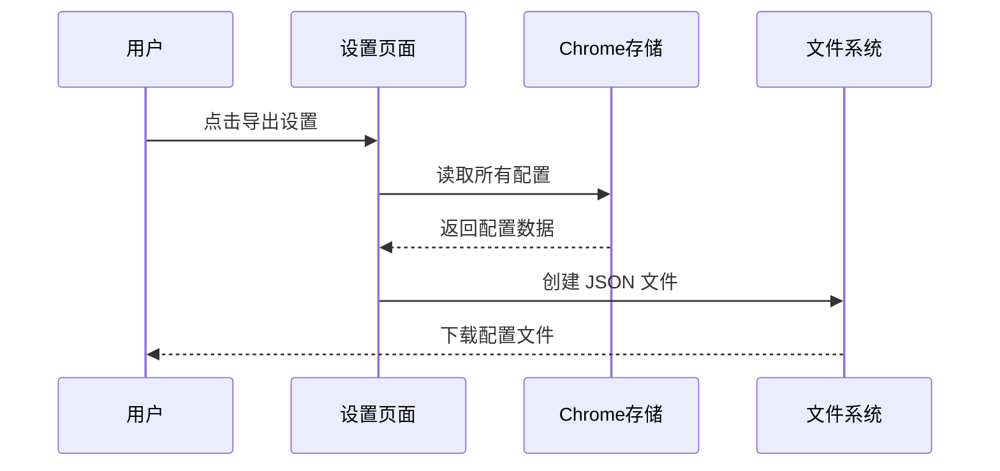

**图表来源**
- [options.js:548-588](file://options.js#L548-L588)

#### 导入配置流程

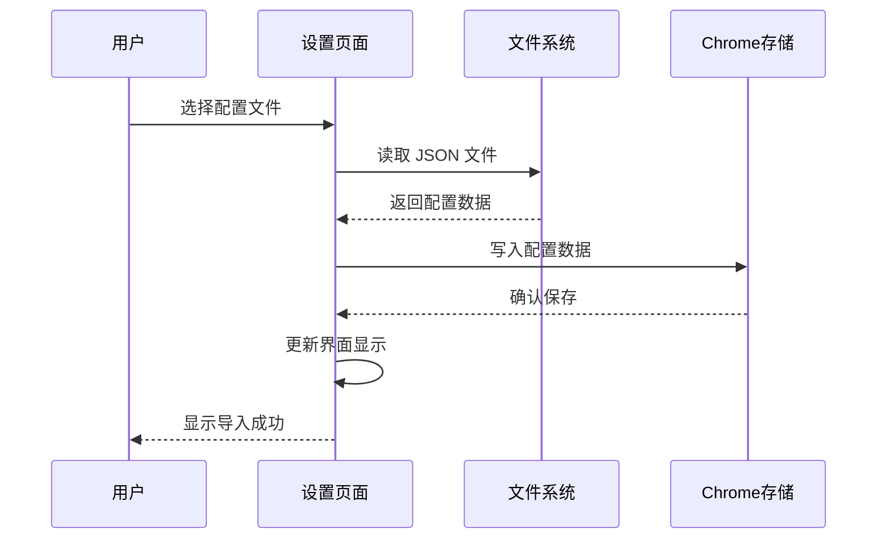

**图表来源**
- [options.js:590-637](file://options.js#L590-L637)

### 最佳实践建议

#### 配置项命名规范

1. **使用小驼峰命名法**: `newFeatureSetting`
2. **明确配置用途**: 避免使用缩写，如 `uiLang` 而非 `ul`
3. **类型前缀**: 对于复杂对象，考虑添加类型前缀如 `apiEndpoint`

#### 数据验证模式

1. **类型检查**: 在设置页面和后台脚本中都进行类型验证
2. **范围验证**: 对数值配置进行合理的范围检查
3. **格式验证**: 对 URL 和邮箱等特殊格式进行验证

#### 向后兼容性保证

1. **默认值策略**: 为新配置项提供合理的默认值
2. **渐进式更新**: 通过版本号管理配置迁移
3. **配置回退**: 当配置损坏时能够回退到安全状态

#### 错误处理策略

1. **统一错误码**: 使用 ERROR_CODES 中定义的标准错误码
2. **用户友好消息**: 通过 ERROR_MESSAGES 提供清晰的错误提示
3. **日志记录**: 记录错误详情但不泄露敏感信息

#### 高还原度模式最佳实践

1. **谨慎启用**: 高还原度模式会增加 API 调用成本
2. **合理使用**: 仅在需要精确还原时启用该模式
3. **性能监控**: 监控该模式下的 API 使用情况
4. **用户教育**: 向用户解释该模式的优势和成本

#### 配置导入导出最佳实践

1. **数据完整性**: 确保导出的配置包含所有必要信息
2. **版本兼容**: 处理不同版本间的配置差异
3. **安全性**: 验证导入文件的完整性和安全性
4. **用户反馈**: 提供清晰的导入导出状态反馈