# 开发指南

<cite>
**本文档引用的文件**
- [manifest.json](file://manifest.json)
- [background.js](file://background.js)
- [content.js](file://content.js)
- [options.js](file://options.js)
- [config.js](file://config.js)
- [options.html](file://options.html)
- [messages.json (en)](file://_locales/en/messages.json)
- [messages.json (zh_CN)](file://_locales/zh_CN/messages.json)
</cite>

## 目录
1. [简介](#简介)
2. [项目结构](#项目结构)
3. [核心组件](#核心组件)
4. [架构概览](#架构概览)
5. [详细组件分析](#详细组件分析)
6. [依赖关系分析](#依赖关系分析)
7. [开发环境搭建](#开发环境搭建)
8. [扩展开发最佳实践](#扩展开发最佳实践)
9. [添加新功能指南](#添加新功能指南)
10. [插件系统设计](#插件系统设计)
11. [构建、测试和部署](#构建测试和部署)
12. [性能考虑](#性能考虑)
13. [故障排除指南](#故障排除指南)
14. [代码规范和提交指南](#代码规范和提交指南)
15. [结论](#结论)

## 简介

ImgPrompt 是一个 Chrome 扩展程序，能够将图片转换为 AI 提示词。该扩展通过服务工作线程与内容脚本的协作，实现了图片分析、AI 模型调用和结果展示的完整流程。项目采用模块化设计，支持多语言界面、历史记录管理和多种 AI 模型集成。

## 项目结构

项目采用典型的 Chrome 扩展程序结构，包含以下核心文件：

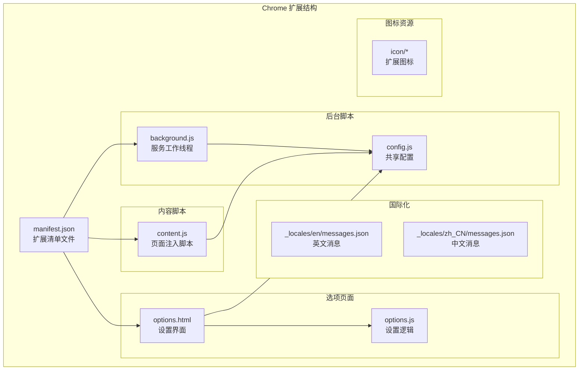

**图表来源**
- [manifest.json:1-45](file://manifest.json#L1-L45)
- [background.js:1-50](file://background.js#L1-L50)
- [content.js:1-50](file://content.js#L1-L50)
- [options.js:1-30](file://options.js#L1-L30)

**章节来源**
- [manifest.json:1-45](file://manifest.json#L1-L45)
- [config.js:1-50](file://config.js#L1-L50)

## 核心组件

### 1. 配置管理系统

配置系统是整个扩展的核心，提供了统一的配置管理机制：

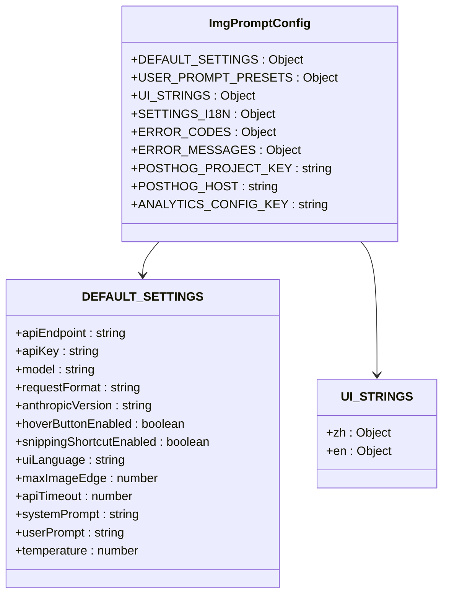

**图表来源**
- [config.js:4-254](file://config.js#L4-L254)

### 2. 后台服务工作线程

后台服务工作线程负责扩展的核心业务逻辑：

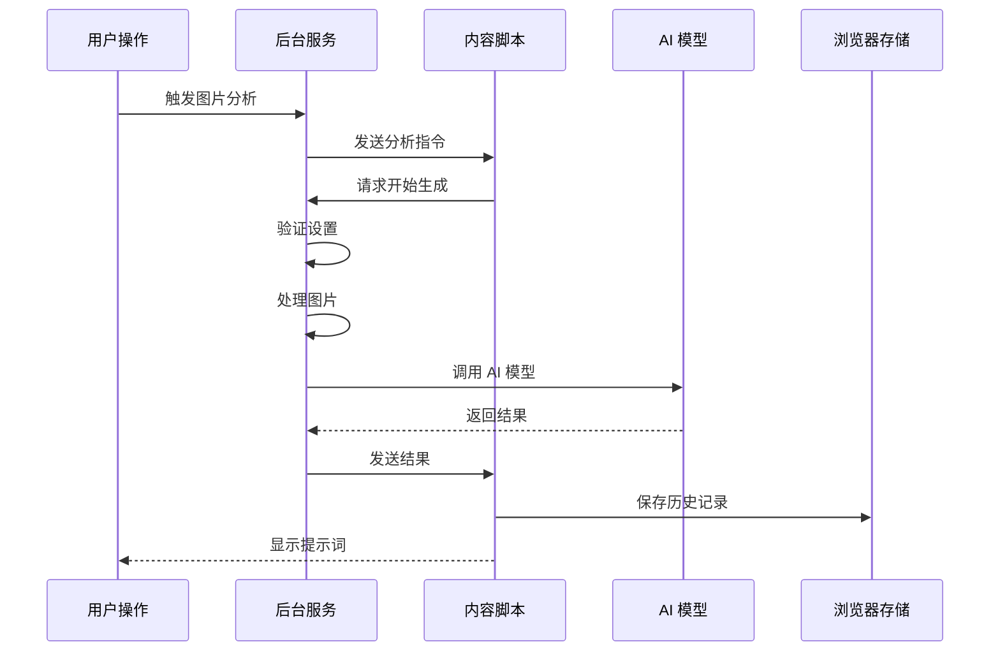

**图表来源**
- [background.js:212-320](file://background.js#L212-L320)
- [content.js:249-326](file://content.js#L249-L326)

**章节来源**
- [background.js:1-100](file://background.js#L1-L100)
- [config.js:1-100](file://config.js#L1-L100)

## 架构概览

ImgPrompt 采用了分层架构设计，确保了良好的模块分离和可维护性：

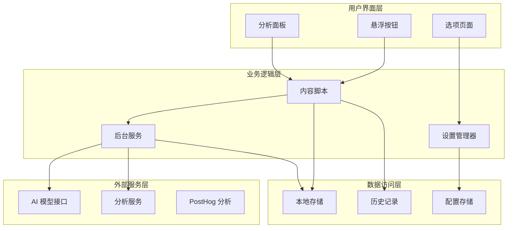

**图表来源**
- [background.js:1-200](file://background.js#L1-L200)
- [content.js:1-200](file://content.js#L1-L200)
- [options.js:1-100](file://options.js#L1-L100)

## 详细组件分析

### 后台服务工作线程 (background.js)

后台服务工作线程是扩展的核心，负责处理所有后台逻辑：

#### 主要职责
- **消息路由**: 处理来自内容脚本的消息
- **AI 模型调用**: 支持多种 AI 模型接口
- **进度跟踪**: 实时更新生成进度
- **错误处理**: 统一的错误分类和处理
- **历史记录**: 管理用户的生成历史

#### 关键功能模块

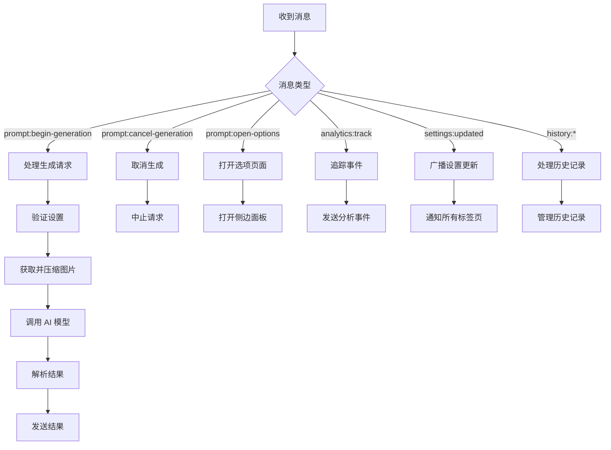

**图表来源**
- [background.js:94-184](file://background.js#L94-L184)
- [background.js:212-320](file://background.js#L212-L320)

**章节来源**
- [background.js:1-400](file://background.js#L1-L400)

### 内容脚本 (content.js)

内容脚本负责与网页交互，提供用户界面和实时反馈：

#### 用户界面组件

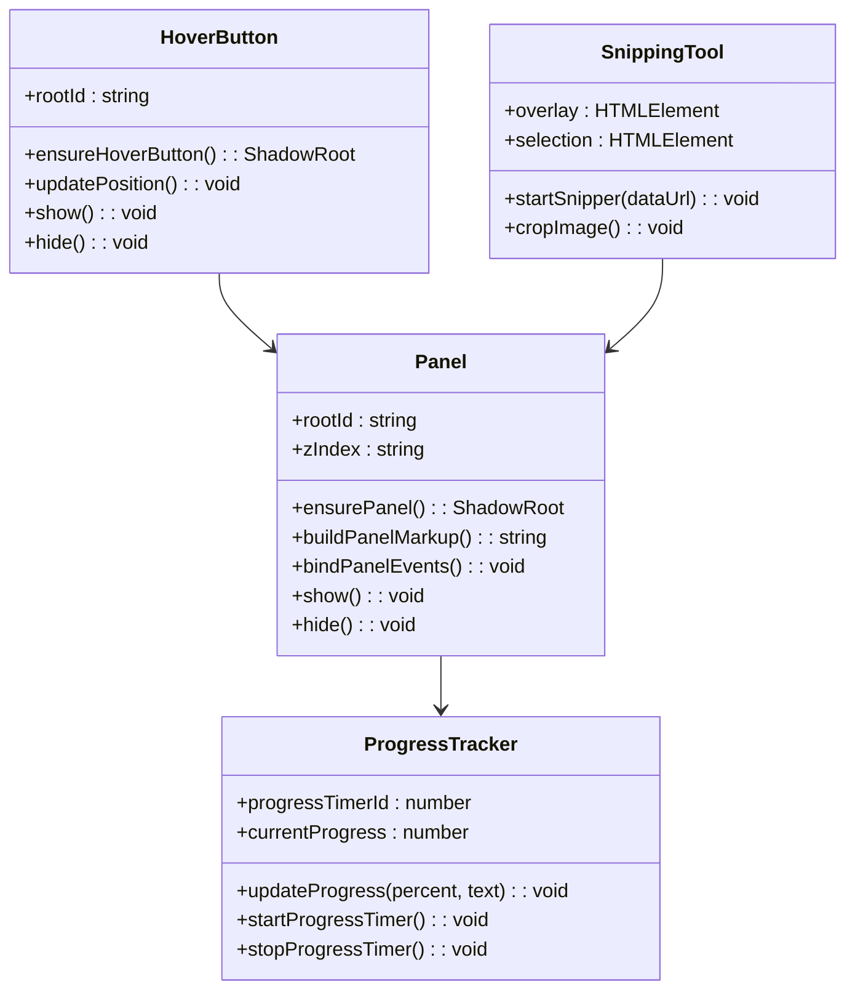

**图表来源**
- [content.js:596-725](file://content.js#L596-L725)
- [content.js:622-725](file://content.js#L622-L725)

#### 事件处理机制

内容脚本通过事件监听器处理各种用户交互：

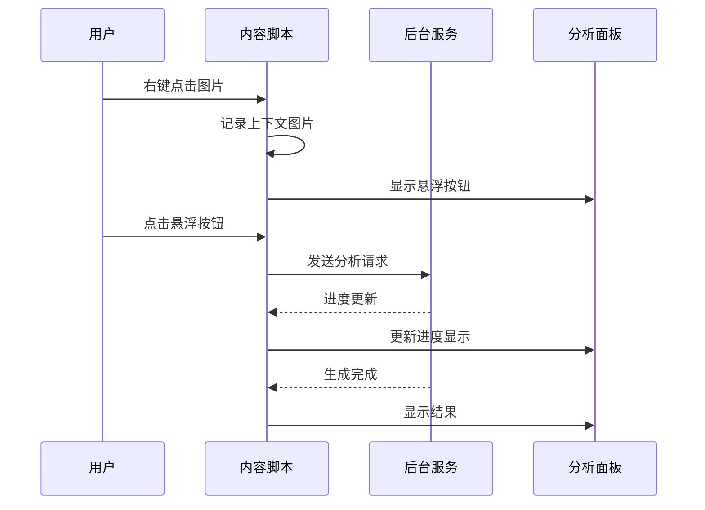

**图表来源**
- [content.js:77-111](file://content.js#L77-L111)
- [content.js:209-247](file://content.js#L209-L247)

**章节来源**
- [content.js:1-800](file://content.js#L1-L800)

### 选项页面 (options.js)

选项页面提供了用户配置界面：

#### 设置管理功能

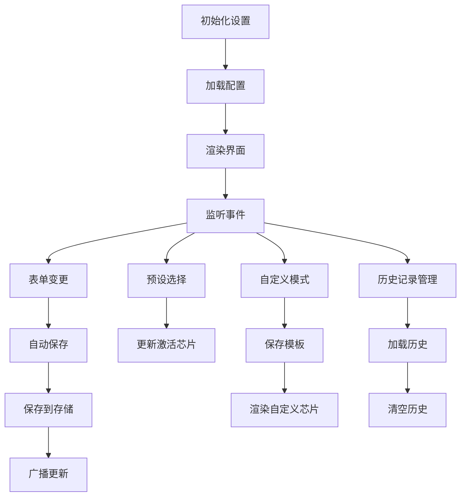

**图表来源**
- [options.js:182-213](file://options.js#L182-L213)
- [options.js:366-402](file://options.js#L366-L402)

**章节来源**
- [options.js:1-491](file://options.js#L1-L491)

## 依赖关系分析

### 模块依赖图

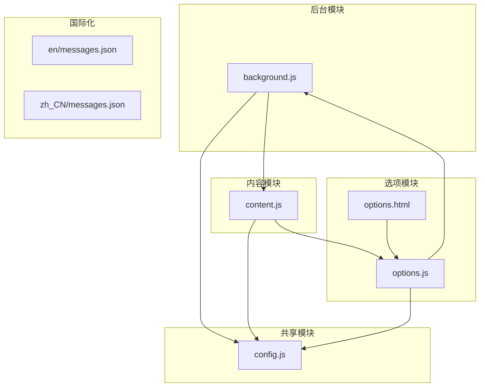

**图表来源**
- [manifest.json:22-26](file://manifest.json#L22-L26)
- [config.js:1-10](file://config.js#L1-L10)

### 外部依赖

| 依赖类型 | 用途 | 版本 |
|---------|------|------|
| PostHog | 用户行为分析 | v1.0.0 |
| Chrome Extensions API | 扩展功能 | Manifest V3 |
| OpenAI Compatible API | AI 模型接口 | v1/chat/completions |
| Anthropic API | Claude 模型接口 | v1/messages |

**章节来源**
- [manifest.json:35-43](file://manifest.json#L35-L43)
- [background.js:359-410](file://background.js#L359-L410)

## 开发环境搭建

### 系统要求

- **操作系统**: Windows 10+ / macOS 10.15+ / Linux
- **浏览器**: Chrome 90+ 或 Chromium 90+
- **Node.js**: 16+ (可选，用于构建工具)
- **Git**: 2.0+

### 开发工具配置

#### 1. 基础开发环境

```bash
# 克隆仓库
git clone https://github.com/your-repo/img2prompt.git
cd img2prompt

# 安装依赖 (可选)
npm install

# 启动开发服务器 (可选)
npm run dev
```

#### 2. 浏览器扩展开发配置

1. **启用开发者模式**
   - 在 Chrome 中打开 `chrome://extensions/`
   - 启用右上角的"开发者模式"

2. **加载未打包扩展**
   - 点击"加载已解压的扩展程序"
   - 选择项目根目录

3. **配置开发工具**
   - 打开 `chrome://extensions/` 查看扩展状态
   - 点击"详细信息"查看日志和错误

#### 3. 调试技巧

```javascript
// 后台服务调试
chrome.runtime.onMessage.addListener((message, sender, sendResponse) => {
    console.log('收到消息:', message);
    // 调试代码
    return true;
});

// 内容脚本调试
console.log('内容脚本已加载');
console.log('配置:', window.ImgPromptConfig);
```

**章节来源**
- [manifest.json:1-45](file://manifest.json#L1-L45)

## 扩展开发最佳实践

### 1. 代码组织原则

#### 模块化设计
- **单一职责**: 每个文件只负责特定功能
- **清晰边界**: 模块间通过明确定义的接口通信
- **可复用性**: 通用功能封装为独立模块

#### 文件命名规范
- `background.js`: 后台服务逻辑
- `content.js`: 页面注入脚本
- `options.js`: 设置页面逻辑
- `config.js`: 共享配置
- `options.html`: 设置页面结构

### 2. 模块化设计模式

#### 配置驱动开发
```javascript
// 使用配置对象管理设置
const DEFAULT_SETTINGS = {
    apiEndpoint: '',
    apiKey: '',
    model: '',
    // ... 其他设置
};

// 通过配置对象统一管理
const settings = { ...DEFAULT_SETTINGS, ...storedSettings };
```

#### 事件驱动架构
```javascript
// 使用事件总线模式
class EventBus {
    constructor() {
        this.listeners = new Map();
    }
    
    subscribe(event, callback) {
        if (!this.listeners.has(event)) {
            this.listeners.set(event, []);
        }
        this.listeners.get(event).push(callback);
    }
    
    publish(event, data) {
        const callbacks = this.listeners.get(event);
        if (callbacks) {
            callbacks.forEach(cb => cb(data));
        }
    }
}
```

### 3. 性能优化策略

#### 异步处理
- 使用 `AbortController` 管理异步操作
- 实现超时机制防止长时间阻塞
- 使用节流和防抖优化高频事件

#### 内存管理
- 及时清理事件监听器
- 合理使用 WeakMap 和 WeakSet
- 避免内存泄漏

**章节来源**
- [background.js:218-220](file://background.js#L218-L220)
- [content.js:5-28](file://content.js#L5-L28)

## 添加新功能指南

### 1. 添加新的 AI 模型支持

#### 步骤 1: 更新配置

在 `config.js` 中添加新的模型配置：

```javascript
DEFAULT_SETTINGS: {
    // ... 现有配置
    model: "gpt-5-mini", // 默认模型
    // 新增模型配置
    modelCapabilities: {
        "gpt-5-mini": {
            supportsImages: true,
            maxTokens: 2000,
            temperatureRange: [0, 2]
        },
        "claude-3": {
            supportsImages: true,
            maxTokens: 10000,
            temperatureRange: [0, 1]
        }
    }
}
```

#### 步骤 2: 实现模型适配器

在 `background.js` 中添加新的模型处理函数：

```javascript
async function requestViaNewModel({ settings, imageInput, pageHints, signal }) {
    const requestBody = {
        model: settings.model,
        messages: [
            {
                role: "system",
                content: settings.systemPrompt
            },
            {
                role: "user",
                content: [
                    {
                        type: "text",
                        text: [settings.userPrompt, pageHints].filter(Boolean).join("\n\n")
                    },
                    {
                        type: "image_url",
                        image_url: {
                            url: imageInput
                        }
                    }
                ]
            }
        ]
    };

    // 实现模型特定的请求逻辑
    const response = await fetch(settings.apiEndpoint, {
        method: "POST",
        headers: {
            "Content-Type": "application/json",
            "Authorization": `Bearer ${settings.apiKey}`
        },
        body: JSON.stringify(requestBody)
    });

    return await response.json();
}
```

#### 步骤 3: 更新模型选择逻辑

```javascript
function resolveRequestFormat(settings) {
    const model = settings.model.toLowerCase();
    
    // 添加新模型的识别逻辑
    if (model.includes('claude')) {
        return "anthropic";
    }
    
    // 新增模型判断
    if (model.includes('new-model')) {
        return "new-model-format";
    }
    
    return "openai";
}
```

### 2. 添加用户界面扩展

#### 步骤 1: 更新 HTML 结构

在 `options.html` 中添加新的设置项：

```html
<section class="section">
    <div class="section-head">
        <h2 class="section-title" data-i18n="advanced-section-title">高级设置</h2>
        <p class="section-note" data-i18n="advanced-section-note">高级功能配置</p>
    </div>
    
    <div class="toggle-row">
        <div class="toggle-copy">
            <div class="toggle-title" data-i18n="toggle-advanced-feature">高级功能</div>
            <div class="toggle-note" data-i18n="toggle-advanced-note">启用高级分析功能</div>
        </div>
        <label class="switch" aria-label="切换高级功能">
            <input id="advancedFeatureEnabled" name="advancedFeatureEnabled" type="checkbox" />
            <span class="switch-track"></span>
            <span class="switch-thumb"></span>
        </label>
    </div>
</section>
```

#### 步骤 2: 实现 JavaScript 逻辑

在 `options.js` 中添加相应的处理逻辑：

```javascript
// 监听新功能开关
document.getElementById('advancedFeatureEnabled').addEventListener('change', async function() {
    const isEnabled = this.checked;
    
    // 保存设置
    await chrome.storage.local.set({ advancedFeatureEnabled: isEnabled });
    
    // 通知其他组件
    chrome.runtime.sendMessage({
        type: "settings:updated",
        changes: { advancedFeatureEnabled: isEnabled }
    });
    
    // 更新 UI 状态
    updateAdvancedFeatureState(isEnabled);
});

function updateAdvancedFeatureState(isEnabled) {
    const advancedPanel = document.getElementById('advanced-settings-panel');
    if (advancedPanel) {
        advancedPanel.style.display = isEnabled ? 'block' : 'none';
    }
}
```

#### 步骤 3: 添加国际化支持

在 `config.js` 中添加新的翻译键：

```javascript
SETTINGS_I18N: {
    zh: {
        // ... 现有翻译
        "advanced-section-title": "高级设置",
        "advanced-section-note": "高级功能配置",
        "toggle-advanced-feature": "高级功能",
        "toggle-advanced-note": "启用高级分析功能"
    },
    en: {
        // ... 现有翻译
        "advanced-section-title": "Advanced Settings",
        "advanced-section-note": "Advanced feature configuration",
        "toggle-advanced-feature": "Advanced Feature",
        "toggle-advanced-note": "Enable advanced analysis features"
    }
}
```

### 3. 添加新的历史记录功能

#### 数据模型设计

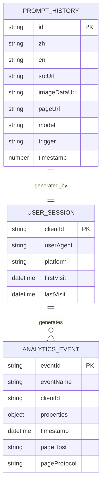

#### 实现历史记录管理

```javascript
// 历史记录存储管理
class HistoryManager {
    constructor(maxItems = 50) {
        this.maxItems = maxItems;
        this.storageKey = "promptHistory";
    }
    
    async save(record) {
        try {
            const history = await this.get();
            const newRecord = {
                id: crypto.randomUUID(),
                timestamp: Date.now(),
                ...record
            };
            
            history.unshift(newRecord);
            
            // 限制历史记录数量
            if (history.length > this.maxItems) {
                history = history.slice(0, this.maxItems);
            }
            
            await chrome.storage.local.set({ [this.storageKey]: history });
            return true;
        } catch (error) {
            console.error('[ImgPrompt] Failed to save history:', error);
            return false;
        }
    }
    
    async get() {
        try {
            const stored = await chrome.storage.local.get(this.storageKey);
            return stored[this.storageKey] || [];
        } catch (error) {
            console.error('[ImgPrompt] Failed to get history:', error);
            return [];
        }
    }
    
    async delete(id) {
        try {
            const history = await this.get();
            const filtered = history.filter(item => item.id !== id);
            await chrome.storage.local.set({ [this.storageKey]: filtered });
            return true;
        } catch (error) {
            console.error('[ImgPrompt] Failed to delete history:', error);
            return false;
        }
    }
    
    async clear() {
        try {
            await chrome.storage.local.set({ [this.storageKey]: [] });
            return true;
        } catch (error) {
            console.error('[ImgPrompt] Failed to clear history:', error);
            return false;
        }
    }
}
```

**章节来源**
- [background.js:412-463](file://background.js#L412-L463)
- [options.js:215-245](file://options.js#L215-L245)

## 插件系统设计

### 设计理念

ImgPrompt 采用松耦合的插件架构，允许动态扩展功能而无需修改核心代码：

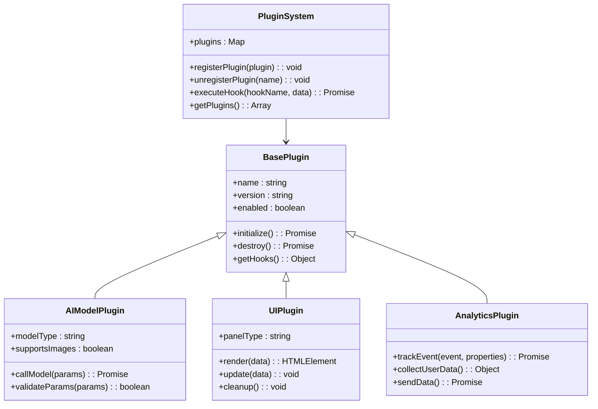

### 扩展点说明

#### 1. Hook 系统

```javascript
// 定义可用的 Hook 点
const HOOK_POINTS = {
    // 图像处理阶段
    BEFORE_IMAGE_PROCESS: 'before_image_process',
    AFTER_IMAGE_PROCESS: 'after_image_process',
    
    // AI 模型调用阶段
    BEFORE_MODEL_CALL: 'before_model_call',
    AFTER_MODEL_CALL: 'after_model_call',
    
    // 结果处理阶段
    BEFORE_RESULT_PARSE: 'before_result_parse',
    AFTER_RESULT_PARSE: 'after_result_parse',
    
    // UI 更新阶段
    BEFORE_PANEL_UPDATE: 'before_panel_update',
    AFTER_PANEL_UPDATE: 'after_panel_update'
};
```

#### 2. 插件注册机制

```javascript
// 插件注册示例
class NewAIModelPlugin extends BasePlugin {
    constructor() {
        super();
        this.name = 'NewAIModel';
        this.version = '1.0.0';
        this.modelType = 'new-model';
        this.supportsImages = true;
    }
    
    async initialize() {
        // 注册 Hook
        await this.registerHook(HOOK_POINTS.BEFORE_MODEL_CALL, this.validateModel);
        await this.registerHook(HOOK_POINTS.AFTER_MODEL_CALL, this.processResult);
        
        console.log(`${this.name} 插件已初始化`);
    }
    
    async validateModel(params) {
        // 自定义模型参数验证
        if (!params.settings.apiKey) {
            throw new Error('API Key 缺失');
        }
        
        if (!params.settings.model.includes(this.modelType)) {
            throw new Error(`不支持的模型类型: ${params.settings.model}`);
        }
        
        return params;
    }
    
    async processResult(result) {
        // 自定义结果处理逻辑
        const processedResult = await this.customPostProcessing(result);
        return processedResult;
    }
    
    async customPostProcessing(result) {
        // 实现自定义后处理
        return {
            ...result,
            processed: true,
            timestamp: Date.now()
        };
    }
}
```

#### 3. 动态加载机制

```javascript
// 插件动态加载
class DynamicPluginLoader {
    constructor() {
        this.plugins = new Map();
        this.hooks = new Map();
    }
    
    async loadPlugin(pluginPath) {
        try {
            // 动态导入插件
            const pluginModule = await import(pluginPath);
            const PluginClass = pluginModule.default;
            
            const pluginInstance = new PluginClass();
            
            // 初始化插件
            await pluginInstance.initialize();
            
            // 注册插件
            this.plugins.set(pluginInstance.name, pluginInstance);
            
            // 注册插件的 Hook
            const pluginHooks = pluginInstance.getHooks();
            if (pluginHooks) {
                this.registerPluginHooks(pluginInstance.name, pluginHooks);
            }
            
            return pluginInstance;
        } catch (error) {
            console.error(`加载插件失败: ${pluginPath}`, error);
            throw error;
        }
    }
    
    registerPluginHooks(pluginName, hooks) {
        for (const [hookName, handler] of Object.entries(hooks)) {
            if (!this.hooks.has(hookName)) {
                this.hooks.set(hookName, []);
            }
            this.hooks.get(hookName).push({ pluginName, handler });
        }
    }
    
    async executeHook(hookName, data) {
        const handlers = this.hooks.get(hookName);
        if (!handlers || handlers.length === 0) {
            return data;
        }
        
        let result = data;
        for (const { handler } of handlers) {
            try {
                result = await handler(result);
            } catch (error) {
                console.error(`执行 Hook 失败: ${hookName}`, error);
            }
        }
        
        return result;
    }
}
```

**章节来源**
- [background.js:478-503](file://background.js#L478-L503)
- [content.js:209-247](file://content.js#L209-L247)

## 构建、测试和部署

### 构建流程

#### 1. 开发构建

```bash
# 基础开发构建
npm run build

# 开发模式（热重载）
npm run dev

# 生产构建（压缩优化）
npm run build:prod
```

#### 2. 代码质量检查

```bash
# ESLint 检查
npm run lint

# 类型检查（TypeScript）
npm run type-check

# 代码格式化
npm run format
```

#### 3. 测试流程

```bash
# 单元测试
npm run test

# 端到端测试
npm run test:e2e

# 快照测试
npm run test:snapshot
```

### 测试策略

#### 单元测试

```javascript
// 测试配置管理
describe('Config Management', () => {
    test('should load default settings', () => {
        const config = loadConfig();
        expect(config.DEFAULT_SETTINGS).toBeDefined();
    });
    
    test('should merge user settings with defaults', () => {
        const userSettings = { apiKey: 'test-key' };
        const merged = mergeSettings(userSettings);
        expect(merged.apiKey).toBe('test-key');
        expect(merged.apiEndpoint).toBe(DEFAULT_SETTINGS.apiEndpoint);
    });
});

// 测试 AI 模型调用
describe('AI Model Integration', () => {
    test('should handle network errors gracefully', async () => {
        const mockFetch = jest.fn().mockRejectedValue(new Error('Network Error'));
        global.fetch = mockFetch;
        
        const result = await callAIModel({ settings: getDefaultSettings() });
        expect(result).toBeNull();
    });
    
    test('should validate model response format', () => {
        const validResponse = { choices: [{ message: { content: 'test' } }] };
        const invalidResponse = { invalid: 'format' };
        
        expect(validateModelResponse(validResponse)).toBe(true);
        expect(validateModelResponse(invalidResponse)).toBe(false);
    });
});
```

#### 集成测试

```javascript
// 测试扩展生命周期
describe('Extension Lifecycle', () => {
    test('should initialize background script correctly', async () => {
        await initializeBackgroundScript();
        expect(chrome.runtime.onInstalled).toHaveBeenCalled();
        expect(chrome.contextMenus.create).toHaveBeenCalled();
    });
    
    test('should handle message routing', async () => {
        const message = { type: 'prompt:start-analysis' };
        const result = await sendMessageToBackground(message);
        expect(result).toBe(true);
    });
});
```

### 部署流程

#### 1. Chrome Web Store 发布

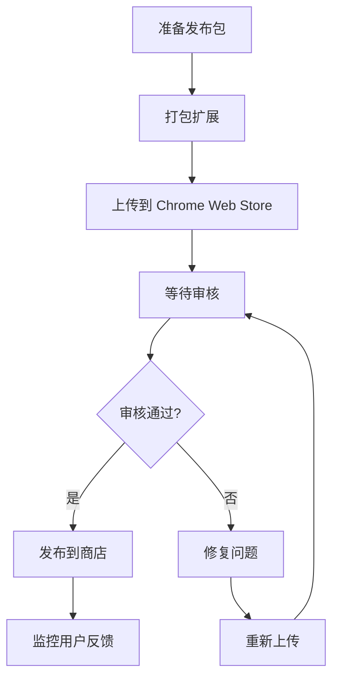

**图表来源**
- [manifest.json:35-43](file://manifest.json#L35-L43)

#### 2. 发布前检查清单

| 检查项目 | 描述 | 状态 |
|---------|------|------|
| 清单文件 | manifest.json 格式正确 | ✅ |
| 权限声明 | 仅声明必要权限 | ✅ |
| 图标 | 16x16, 48x48, 128x128 图标齐全 | ✅ |
| 国际化 | 多语言支持完整 | ✅ |
| 安全性 | 无敏感权限滥用 | ✅ |
| 性能 | 加载时间 < 1 秒 | ✅ |
| 兼容性 | 支持 Chrome 90+ | ✅ |

#### 3. 审核注意事项

**常见审核问题及解决方案**:

1. **权限滥用**
   - 仅声明必要权限
   - 提供权限使用说明
   - 避免访问无关网站

2. **恶意行为检测**
   - 不修改用户数据
   - 不收集敏感信息
   - 不安装其他软件

3. **用户体验问题**
   - 不弹出广告
   - 不强制下载
   - 提供清晰的帮助文档

**章节来源**
- [manifest.json:1-45](file://manifest.json#L1-L45)

## 性能考虑

### 1. 内存管理

#### 对象池模式
```javascript
class ObjectPool {
    constructor(createFn, resetFn, maxSize = 100) {
        this.createFn = createFn;
        this.resetFn = resetFn;
        this.pool = [];
        this.maxSize = maxSize;
    }
    
    acquire() {
        if (this.pool.length > 0) {
            return this.pool.pop();
        }
        return this.createFn();
    }
    
    release(obj) {
        if (this.pool.length < this.maxSize) {
            this.resetFn(obj);
            this.pool.push(obj);
        }
    }
}

// 使用示例
const imagePool = new ObjectPool(
    () => new Image(),
    (img) => img.src = '',
    50
);
```

#### 内存泄漏防护
```javascript
// 清理事件监听器
function cleanupListeners() {
    listeners.forEach(listener => {
        element.removeEventListener(listener.event, listener.handler);
    });
    listeners.clear();
}

// 使用 WeakRef 防止内存泄漏
const cache = new Map();
function getCachedData(key) {
    const cached = cache.get(key);
    if (cached && cached.ref.deref()) {
        return cached.ref.deref();
    }
    return null;
}
```

### 2. 网络性能优化

#### 请求缓存
```javascript
class RequestCache {
    constructor(ttl = 5 * 60 * 1000) { // 5分钟
        this.cache = new Map();
        this.ttl = ttl;
    }
    
    get(key) {
        const item = this.cache.get(key);
        if (!item) return null;
        
        if (Date.now() - item.timestamp > this.ttl) {
            this.cache.delete(key);
            return null;
        }
        
        return item.data;
    }
    
    set(key, data) {
        this.cache.set(key, {
            data,
            timestamp: Date.now()
        });
    }
    
    clear() {
        this.cache.clear();
    }
}
```

#### 批量请求
```javascript
class BatchRequestManager {
    constructor(batchSize = 10, delay = 100) {
        this.batchSize = batchSize;
        this.delay = delay;
        this.queue = [];
        this.processing = false;
    }
    
    async add(request) {
        this.queue.push(request);
        
        if (!this.processing) {
            this.processing = true;
            await this.processBatch();
        }
    }
    
    async processBatch() {
        while (this.queue.length > 0) {
            const batch = this.queue.splice(0, this.batchSize);
            await Promise.all(batch.map(req => req()));
            await this.sleep(this.delay);
        }
        this.processing = false;
    }
    
    sleep(ms) {
        return new Promise(resolve => setTimeout(resolve, ms));
    }
}
```

### 3. UI 性能优化

#### 虚拟滚动
```javascript
class VirtualScroll {
    constructor(container, itemHeight, bufferSize = 10) {
        this.container = container;
        this.itemHeight = itemHeight;
        this.bufferSize = bufferSize;
        this.visibleItems = [];
        this.scrollTop = 0;
    }
    
    updateScroll(scrollTop) {
        this.scrollTop = scrollTop;
        const startIndex = Math.floor(scrollTop / this.itemHeight) - this.bufferSize;
        const endIndex = startIndex + this.bufferSize * 2;
        
        this.renderVisibleRange(Math.max(0, startIndex), Math.min(endIndex, this.totalItems));
    }
    
    renderVisibleRange(start, end) {
        // 只渲染可见范围内的元素
        this.container.innerHTML = '';
        for (let i = start; i < end; i++) {
            this.container.appendChild(this.createItem(i));
        }
    }
}
```

#### 懒加载优化
```javascript
// 图片懒加载
const imageObserver = new IntersectionObserver((entries) => {
    entries.forEach(entry => {
        if (entry.isIntersecting) {
            const img = entry.target;
            img.src = img.dataset.src;
            img.classList.remove('lazy');
            imageObserver.unobserve(img);
        }
    });
});

document.querySelectorAll('img[data-src]').forEach(img => {
    imageObserver.observe(img);
});
```

**章节来源**
- [background.js:799-800](file://background.js#L799-L800)
- [content.js:328-345](file://content.js#L328-L345)

## 故障排除指南

### 1. 常见问题诊断

#### 网络连接问题

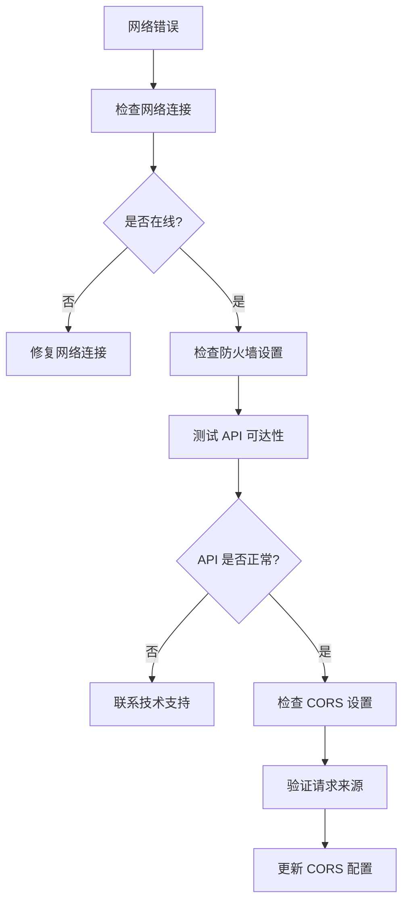

#### AI 模型调用失败

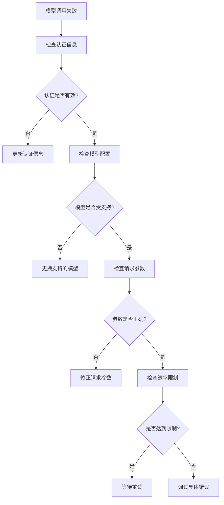

### 2. 错误处理机制

#### 错误分类系统

```javascript
class ErrorHandler {
    constructor() {
        this.errorTypes = {
            NETWORK_ERROR: {
                code: 'NETWORK_ERROR',
                severity: 'HIGH',
                message: '网络连接失败',
                solution: '检查网络连接和代理设置'
            },
            AUTHENTICATION_ERROR: {
                code: 'AUTHENTICATION_ERROR',
                severity: 'HIGH',
                message: '认证失败',
                solution: '检查 API 密钥有效性'
            },
            RATE_LIMIT_ERROR: {
                code: 'RATE_LIMIT_ERROR',
                severity: 'MEDIUM',
                message: '请求频率过高',
                solution: '等待冷却时间或升级套餐'
            },
            VALIDATION_ERROR: {
                code: 'VALIDATION_ERROR',
                severity: 'LOW',
                message: '参数验证失败',
                solution: '检查输入参数格式'
            }
        };
    }
    
    handleError(error) {
        const errorInfo = this.classifyError(error);
        const userMessage = this.getUserFriendlyMessage(errorInfo);
        
        this.logError(errorInfo);
        this.showNotification(userMessage);
        
        return errorInfo;
    }
    
    classifyError(error) {
        const errorType = this.errorTypes.NETWORK_ERROR;
        
        if (error.message.includes('401') || error.message.includes('invalid')) {
            return this.errorTypes.AUTHENTICATION_ERROR;
        }
        
        if (error.message.includes('429') || error.message.includes('rate limit')) {
            return this.errorTypes.RATE_LIMIT_ERROR;
        }
        
        if (error.message.includes('validation')) {
            return this.errorTypes.VALIDATION_ERROR;
        }
        
        return errorType;
    }
    
    getUserFriendlyMessage(errorInfo) {
        const lang = this.getCurrentLanguage();
        return lang === 'zh' 
            ? this.getUserMessageZH(errorInfo)
            : this.getUserMessageEN(errorInfo);
    }
}
```

#### 调试工具

```javascript
// 开发者调试工具
class DevTools {
    constructor() {
        this.debugMode = false;
        this.logLevel = 'INFO';
        this.performanceData = new Map();
    }
    
    enableDebug() {
        this.debugMode = true;
        this.log('调试模式已启用');
    }
    
    log(message, level = 'INFO') {
        if (!this.debugMode) return;
        
        const timestamp = new Date().toISOString();
        const formattedMessage = `[${timestamp}] ${level}: ${message}`;
        
        if (level === 'ERROR') {
            console.error(formattedMessage);
        } else if (level === 'WARN') {
            console.warn(formattedMessage);
        } else {
            console.log(formattedMessage);
        }
    }
    
    measurePerformance(operation, callback) {
        if (!this.debugMode) return callback();
        
        const start = performance.now();
        const result = callback();
        const end = performance.now();
        
        this.performanceData.set(operation, end - start);
        this.log(`${operation} 执行时间: ${(end - start).toFixed(2)}ms`);
        
        return result;
    }
    
    getPerformanceReport() {
        let report = '性能报告:\n';
        this.performanceData.forEach((time, operation) => {
            report += `- ${operation}: ${time.toFixed(2)}ms\n`;
        });
        return report;
    }
}
```

**章节来源**
- [background.js:280-317](file://background.js#L280-L317)
- [content.js:56-63](file://content.js#L56-L63)

## 代码规范和提交指南

### 1. 编码规范

#### JavaScript 规范

```javascript
// ✅ 好的做法
class ImageProcessor {
    constructor(options = {}) {
        this.maxWidth = options.maxWidth || 1024;
        this.maxHeight = options.maxHeight || 1024;
        this.quality = options.quality || 0.86;
    }
    
    async processImage(imageUrl) {
        try {
            const response = await fetch(imageUrl);
            const blob = await response.blob();
            return await this.compressImage(blob);
        } catch (error) {
            throw new Error(`图像处理失败: ${error.message}`);
        }
    }
    
    compressImage(blob) {
        return new Promise((resolve, reject) => {
            const canvas = document.createElement('canvas');
            const ctx = canvas.getContext('2d');
            const img = new Image();
            
            img.onload = () => {
                canvas.width = img.width;
                canvas.height = img.height;
                ctx.drawImage(img, 0, 0);
                canvas.toBlob(resolve, 'image/jpeg', this.quality);
            };
            
            img.onerror = reject;
            img.src = URL.createObjectURL(blob);
        });
    }
}

// ❌ 避免的做法
var ImageProcessor = function(options) {
    this.maxWidth = options.maxWidth || 1024;
    this.maxHeight = options.maxHeight || 1024;
    this.quality = options.quality || 0.86;
}

ImageProcessor.prototype.processImage = async function(imageUrl) {
    // 缺少错误处理
    const response = await fetch(imageUrl);
    const blob = await response.blob();
    return this.compressImage(blob);
}
```

#### HTML/CSS 规范

```css
/* ✅ 好的做法 */
.ipi-panel {
    width: 392px;
    max-width: calc(100vw - 20px);
    color: #f8fafc;
    font-family: -apple-system, BlinkMacSystemFont, "Segoe UI", sans-serif;
    background: transparent;
    border: 0;
    box-shadow: none;
    overflow: visible;
    position: relative;
}

.ipi-body {
    padding: 0 12px 12px;
}

.ipi-stage {
    position: relative;
    margin: 0 10px;
    min-height: 150px;
    border-radius: 28px;
    overflow: hidden;
    background: transparent;
}

/* ❌ 避免的做法 */
.ipi-panel {
    width: 392px;
    max-width: calc(100vw - 20px);
    color: #f8fafc;
    font-family: -apple-system, BlinkMacSystemFont, "Segoe UI", sans-serif;
    background: transparent;
    border: 0;
    box-shadow: none;
    overflow: visible;
    position: relative;
}
```

### 2. Git 工作流程

#### 分支管理


#### 提交规范

```bash
# ✅ 好的提交信息
feat(background): 添加新的 AI 模型支持
fix(content): 修复图片加载失败问题
docs(options): 更新设置页面文档
refactor(utils): 重构工具函数
chore(deps): 更新依赖版本

# ❌ 避免的提交信息
fix bug
update
change
test
```

#### Pull Request 模板

```markdown
## 变更摘要

<!-- 简要描述变更内容 -->

## 变更类型

- [ ] 功能新增
- [ ] Bug 修复
- [ ] 文档更新
- [ ] 代码重构
- [ ] 依赖更新

## 影响范围

<!-- 描述变更影响的功能模块 -->

## 测试验证

- [ ] 单元测试通过
- [ ] 集成测试通过
- [ ] 手动测试通过

## 相关问题

<!-- 关联的问题编号 -->
```

### 3. 代码审查清单

#### 功能审查
- [ ] 功能需求是否满足
- [ ] 边界条件是否处理
- [ ] 错误处理是否完善
- [ ] 性能是否达标

#### 代码质量
- [ ] 代码风格是否一致
- [ ] 注释是否充分
- [ ] 变量命名是否清晰
- [ ] 函数复杂度是否合理

#### 安全性
- [ ] 输入验证是否到位
- [ ] 权限检查是否完整
- [ ] 敏感信息是否保护
- [ ] XSS 防护是否实现

**章节来源**
- [config.js:1-50](file://config.js#L1-L50)
- [manifest.json:1-45](file://manifest.json#L1-L45)

## 结论

ImgPrompt 项目展现了现代 Chrome 扩展开发的最佳实践，通过模块化设计、清晰的架构分离和完善的错误处理机制，为开发者提供了一个可扩展、可维护的平台。

### 项目优势

1. **架构清晰**: 分层设计确保了良好的模块分离
2. **扩展性强**: 插件系统支持动态功能扩展
3. **用户体验佳**: 实时反馈和进度跟踪提升使用体验
4. **国际化支持**: 完整的多语言支持
5. **性能优化**: 多种性能优化策略确保流畅运行

### 未来发展方向

1. **AI 模型生态**: 支持更多 AI 服务提供商
2. **插件市场**: 建立官方插件市场
3. **团队协作**: 支持多人协作生成功能
4. **数据分析**: 增强使用数据分析能力
5. **移动端支持**: 考虑移动端扩展支持

通过遵循本文档的开发指南和最佳实践，开发者可以快速理解和扩展 ImgPrompt 项目，为用户提供更好的图片转提示词体验。