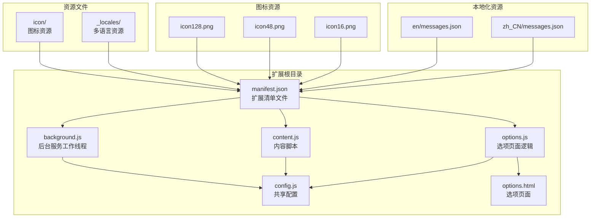
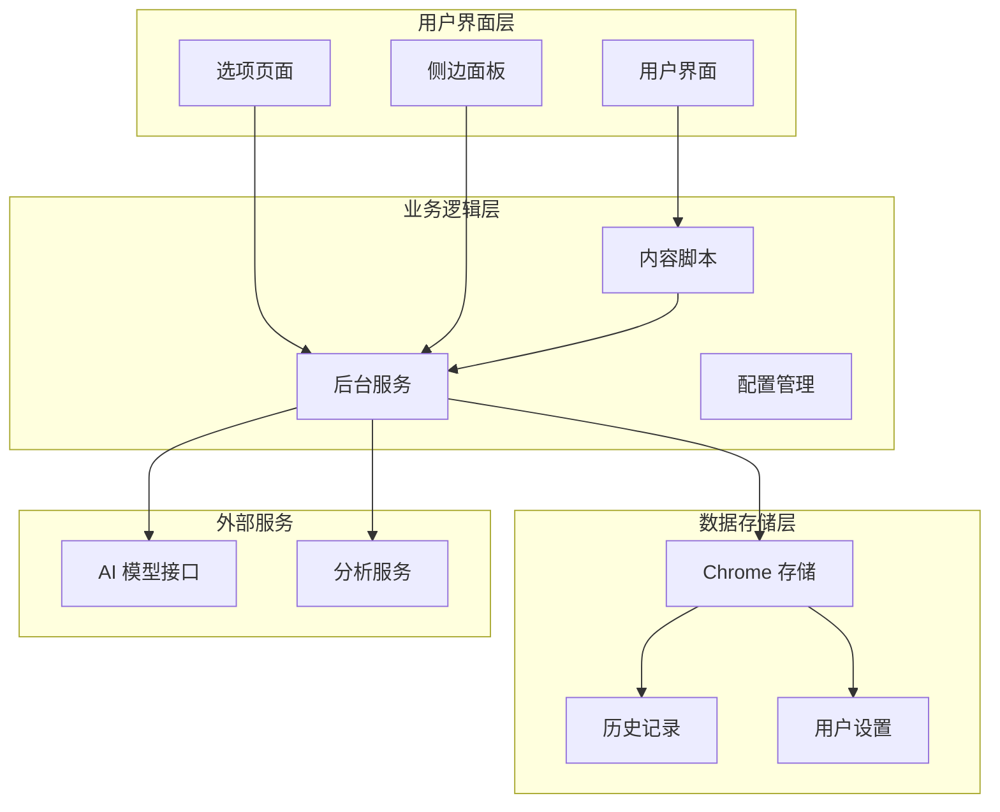
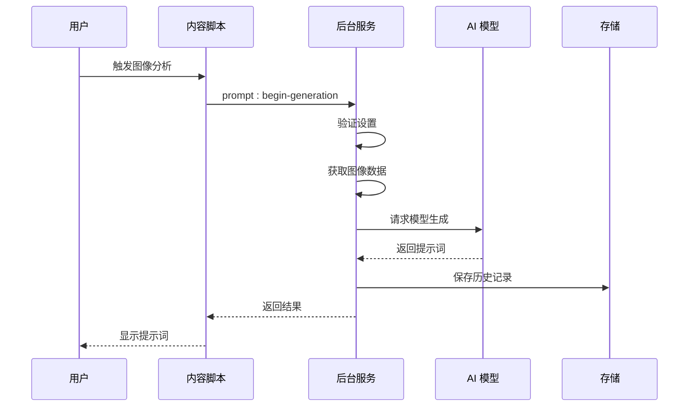
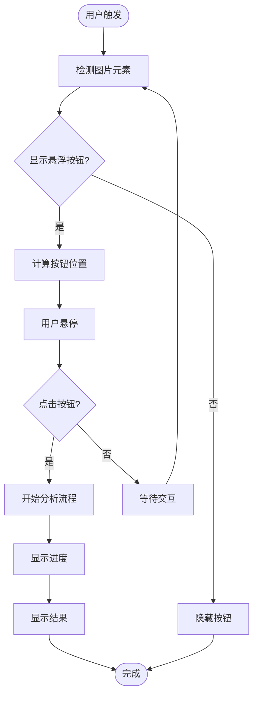
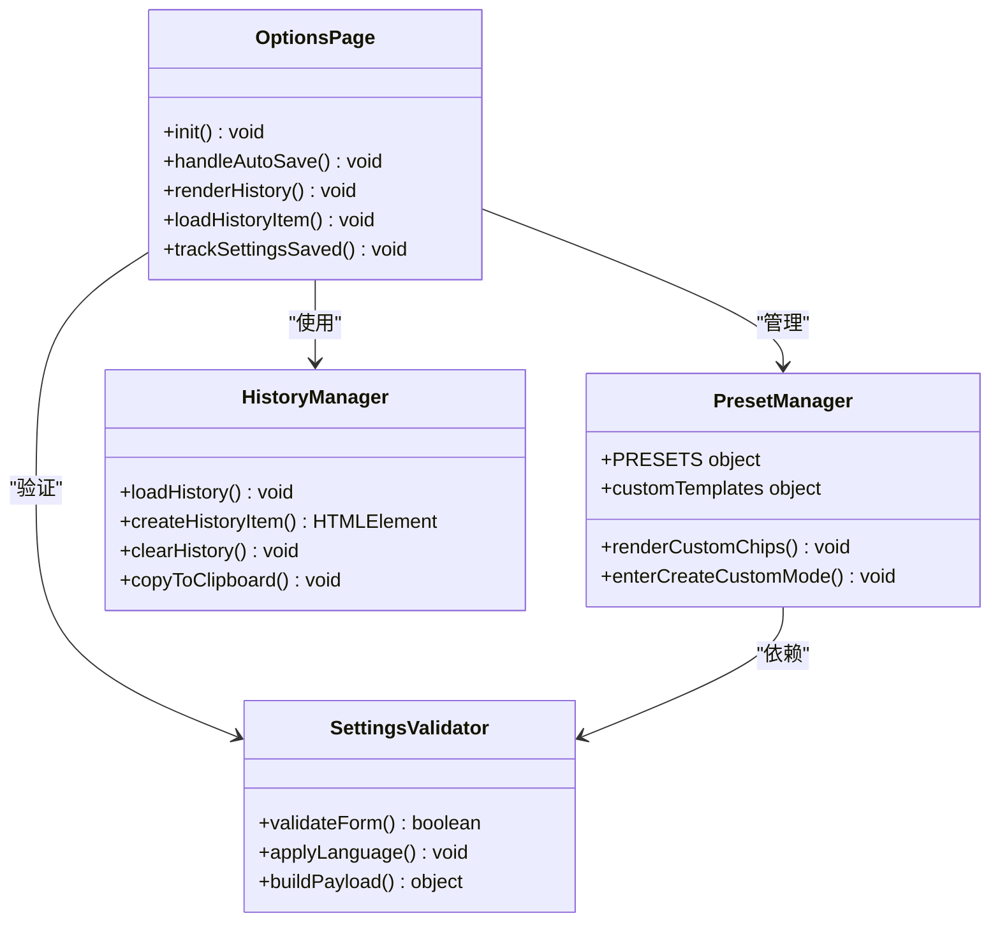
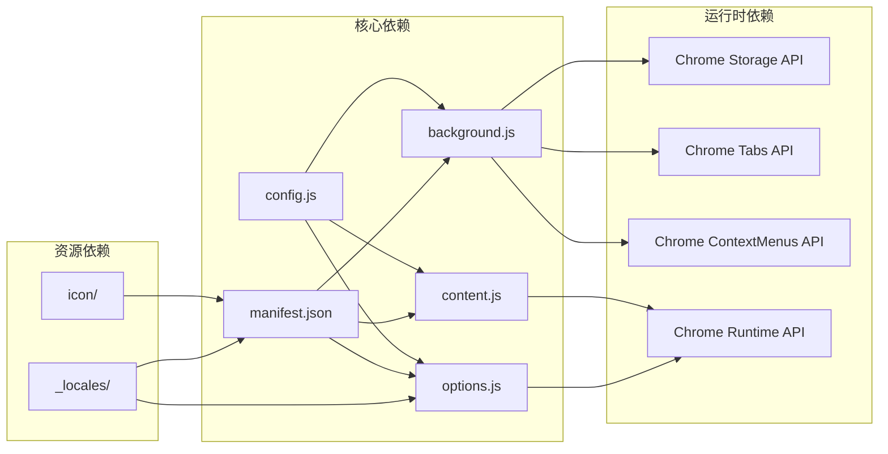

# 构建与部署

<cite>
**本文档引用的文件**
- [manifest.json](file://manifest.json)
- [background.js](file://background.js)
- [content.js](file://content.js)
- [options.js](file://options.js)
- [config.js](file://config.js)
- [options.html](file://options.html)
- [_locales/en/messages.json](file://_locales/en/messages.json)
- [_locales/zh_CN/messages.json](file://_locales/zh_CN/messages.json)
- [icon/icon128.png](file://icon/icon128.png)
- [icon/icon48.png](file://icon/icon48.png)
- [icon/icon16.png](file://icon/icon16.png)
</cite>

## 目录
1. [简介](#简介)
2. [项目结构](#项目结构)
3. [核心组件](#核心组件)
4. [架构概览](#架构概览)
5. [详细组件分析](#详细组件分析)
6. [依赖关系分析](#依赖关系分析)
7. [性能考虑](#性能考虑)
8. [故障排除指南](#故障排除指南)
9. [结论](#结论)
10. [附录](#附录)

## 简介

ImgPrompt 是一个基于 Chrome 扩展的 AI 图像提示词生成功能。该扩展允许用户通过图像生成高质量的提示词，支持多种 AI 模型接口，包括 OpenAI 兼容接口和 Anthropic Claude 模型。项目采用 Manifest V3 架构，实现了现代化的扩展开发模式。

该扩展的核心功能包括：
- 图像到提示词的 AI 生成
- 多种预设场景模板
- 实时进度反馈和状态管理
- 历史记录管理和导出
- 多语言界面支持
- 截屏功能集成

## 项目结构

ImgPrompt 项目采用清晰的模块化组织结构，每个文件都有明确的职责分工：

**图表来源**
- [manifest.json:1-45](file://manifest.json#L1-L45)
- [config.js:1-253](file://config.js#L1-L253)

**章节来源**
- [manifest.json:1-45](file://manifest.json#L1-L45)
- [config.js:1-253](file://config.js#L1-L253)

## 核心组件

### 扩展清单配置 (manifest.json)

扩展清单文件定义了扩展的基本信息、权限声明、功能配置和资源路径：

**版本管理配置**
- 版本号：1.0.0
- 更新URL：Chrome Web Store 更新服务
- Manifest Version：3

**权限声明**
- 主机权限：`<all_urls>` - 允许访问所有网页
- 扩展权限：`contextMenus`、`storage`、`sidePanel`、`activeTab`
- 图标资源：16×16、48×48、128×128 像素图标

**功能特性**
- 后台服务工作线程：`background.js`
- 内容脚本：`config.js`、`content.js`
- 侧边面板：`options.html`
- 快捷键：Alt+S 截图功能

**章节来源**
- [manifest.json:1-45](file://manifest.json#L1-L45)

### 配置管理系统 (config.js)

共享配置系统提供了统一的设置管理、国际化支持和错误处理：

**默认设置**
- API 端点：OpenAI 兼容接口
- 模型：gpt-5-mini
- 系统提示词：专业的图像提示词工程师角色
- 用户提示词：图像结构分析任务
- UI 语言：中文优先

**多语言支持**
- 中文 (zh) 和英文 (en) 完整翻译
- 动态语言切换
- 国际化字符串管理

**错误处理**
- 错误码分类
- 用户友好错误消息
- 详细的错误映射表

**章节来源**
- [config.js:4-253](file://config.js#L4-L253)

## 架构概览

ImgPrompt 采用了典型的 Chrome 扩展三层架构模式：

**图表来源**
- [background.js:1-945](file://background.js#L1-L945)
- [content.js:1-1578](file://content.js#L1-L1578)
- [options.js:1-489](file://options.js#L1-L489)

## 详细组件分析

### 后台服务工作线程 (background.js)

后台服务是扩展的核心协调者，负责处理跨标签页通信、API 调用和状态管理：

#### 主要功能模块

**安装和初始化**
- 自动创建上下文菜单
- 设置侧边面板行为
- 初始化默认设置
- 发送安装/更新事件

**消息处理系统**
- 支持多种消息类型
- 异步消息响应
- 错误处理和重试机制

**AI 模型集成**
- OpenAI 兼容接口支持
- Anthropic Claude 模型适配
- 自动请求格式检测
- 图像数据压缩和优化

**数据分析和追踪**
- PostHog 集成
- 用户行为追踪
- 性能指标收集
- 隐私保护的数据处理

**图表来源**
- [background.js:212-320](file://background.js#L212-L320)
- [content.js:249-326](file://content.js#L249-L326)

**章节来源**
- [background.js:1-945](file://background.js#L1-L945)

### 内容脚本 (content.js)

内容脚本运行在目标网页环境中，负责用户交互和界面展示：

#### 用户界面管理

**悬浮按钮系统**
- 智能图片检测
- 动态位置计算
- 优雅的动画效果
- 可配置的显示行为

**侧边面板集成**
- 实时状态同步
- 进度条显示
- 错误信息处理
- 复制功能支持

**交互事件处理**
- 鼠标事件监听
- 键盘快捷键支持
- 拖拽功能实现
- 剪贴板操作

**图表来源**
- [content.js:77-101](file://content.js#L77-L101)
- [content.js:622-725](file://content.js#L622-L725)

**章节来源**
- [content.js:1-1578](file://content.js#L1-L1578)

### 选项页面系统 (options.js + options.html)

选项页面提供了完整的用户配置界面：

#### 界面设计特点

**响应式布局**
- 移动端适配
- 深色主题设计
- 渐变色彩方案
- 动画过渡效果

**功能模块划分**
- 连接设置区域
- 提示词模板管理
- 使用体验配置
- 兼容性参数调整
- 历史记录查看

**智能数据管理**
- 实时设置同步
- 自动保存机制
- 数据验证和清理
- 历史记录导入导出

**图表来源**
- [options.js:182-213](file://options.js#L182-L213)
- [options.js:333-357](file://options.js#L333-L357)

**章节来源**
- [options.js:1-489](file://options.js#L1-L489)
- [options.html:1-687](file://options.html#L1-L687)

## 依赖关系分析

### 文件间依赖关系

**图表来源**
- [manifest.json:10-43](file://manifest.json#L10-L43)
- [config.js:1-3](file://config.js#L1-L3)

### 外部服务依赖

**AI 模型接口**
- OpenAI 兼容接口
- Anthropic Claude 模型
- 自动格式检测和适配

**分析服务**
- PostHog 事件追踪
- 隐私友好的数据收集
- 可配置的分析开关

**章节来源**
- [background.js:359-410](file://background.js#L359-L410)
- [background.js:478-666](file://background.js#L478-L666)

## 性能考虑

### 内存和资源管理

**图像处理优化**
- 自动图像压缩到指定分辨率
- Base64 编码优化
- 内存泄漏防护
- 大图像处理降级策略

**异步操作管理**
- 请求超时控制
- 取消信号支持
- 并发请求限制
- 错误重试机制

**存储优化**
- 历史记录大小限制 (50项)
- 增量更新策略
- 清理过期数据
- 压缩存储格式

### 网络性能

**请求优化**
- 连接复用
- 压缩传输
- 缓存策略
- 错误快速失败

**并发控制**
- 请求队列管理
- 速率限制处理
- 优雅降级
- 用户反馈机制

## 故障排除指南

### 常见问题诊断

**安装和启动问题**
- 检查 manifest.json 配置
- 验证图标文件完整性
- 确认权限声明正确
- 浏览器兼容性检查

**功能异常排查**
- 查看后台服务日志
- 检查内容脚本注入
- 验证 API 密钥有效性
- 网络连接状态检查

**性能问题解决**
- 监控内存使用情况
- 检查图像处理时间
- 优化存储访问频率
- 减少不必要的重渲染

### 调试工具使用

**浏览器开发者工具**
- 扩展页面调试
- 网络请求监控
- 存储数据检查
- 控制台错误追踪

**扩展专用工具**
- chrome://extensions 页面
- 扩展管理器
- 开发者模式启用
- 热重载支持

**章节来源**
- [background.js:59-57](file://background.js#L59-L57)
- [content.js:56-63](file://content.js#L56-L63)

## 结论

ImgPrompt 是一个功能完整、架构清晰的 Chrome 扩展项目。其设计体现了现代扩展开发的最佳实践：

**技术优势**
- 清晰的模块化架构
- 完善的错误处理机制
- 优秀的用户体验设计
- 良好的性能优化

**扩展性特点**
- 易于添加新功能
- 支持多语言扩展
- 可配置的 AI 模型集成
- 灵活的设置管理

**部署建议**
- 建议使用自动化构建流程
- 完善测试覆盖
- 建立版本管理规范
- 制定发布策略

该项目为 Chrome 扩展开发提供了良好的参考范例，特别适合学习现代扩展架构设计和实现方法。

## 附录

### 版本管理最佳实践

**语义化版本控制**
- 主版本：重大功能变更
- 次版本：向后兼容的功能新增
- 修订版本：向后兼容的问题修复

**变更日志维护**
- 记录每次重要变更
- 区分功能、修复、改进
- 提供迁移指导
- 维护向后兼容性

**发布流程建议**
- 预发布版本测试
- 用户反馈收集
- 文档同步更新
- 回滚策略准备

### 安全审查要点

**隐私保护措施**
- 最小权限原则
- 本地数据存储
- 加密敏感信息
- 用户同意机制

**权限说明**
- 明确权限用途
- 提供权限控制
- 定期权限审计
- 用户透明度

**数据处理声明**
- 数据收集范围
- 使用目的说明
- 第三方共享政策
- 数据保留期限

### 发布准备清单

**Chrome Web Store 发布**
- 开发者账户注册
- 应用截图准备
- 描述文案编写
- 价格和分发设置
- 审核材料准备

**质量保证**
- 功能测试覆盖
- 兼容性验证
- 性能基准测试
- 用户验收测试