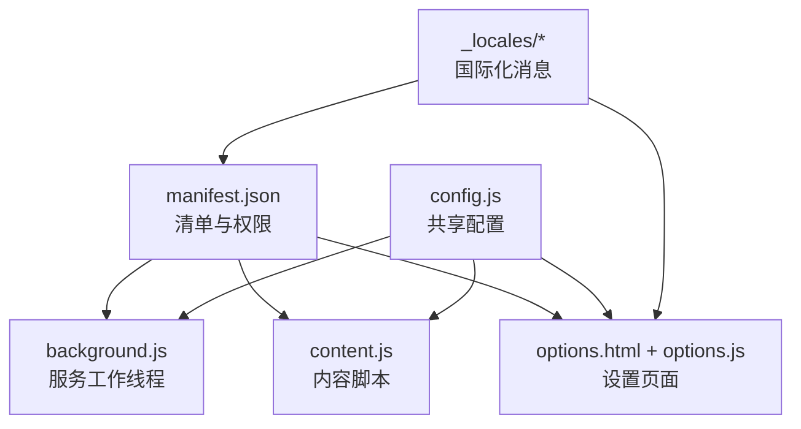
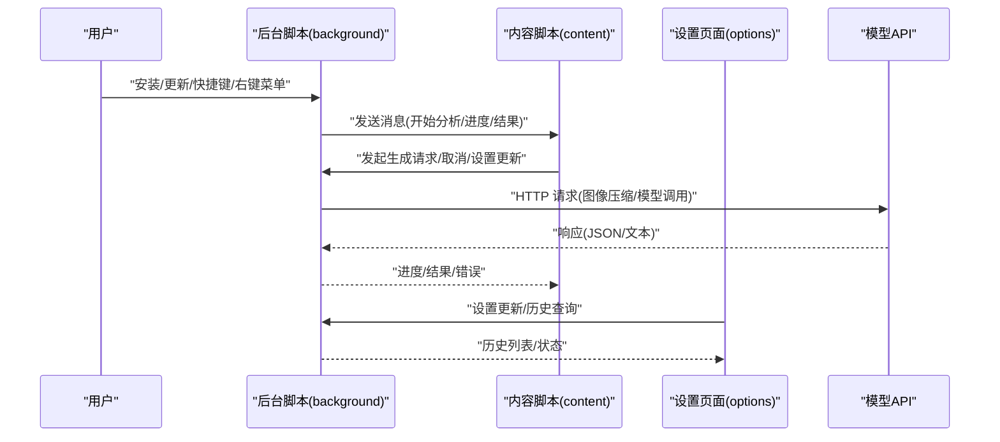
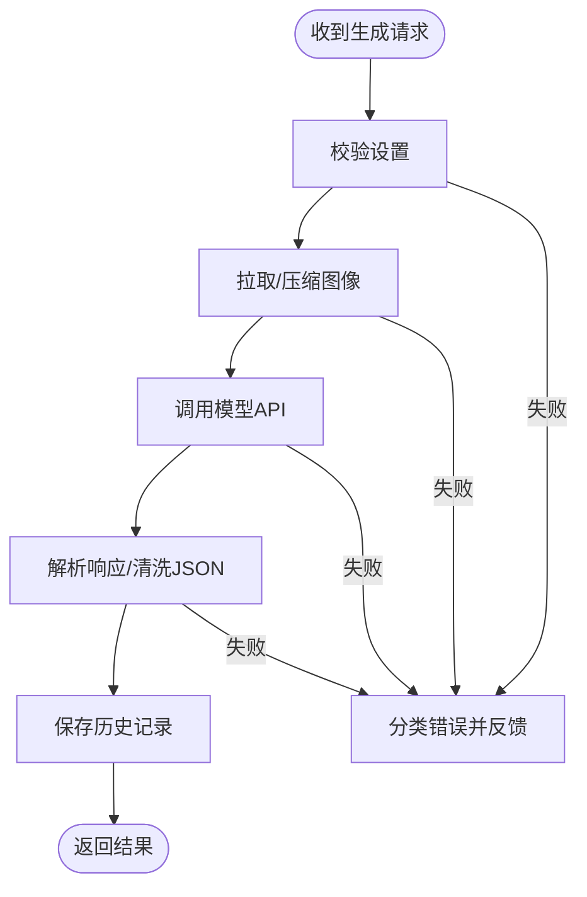
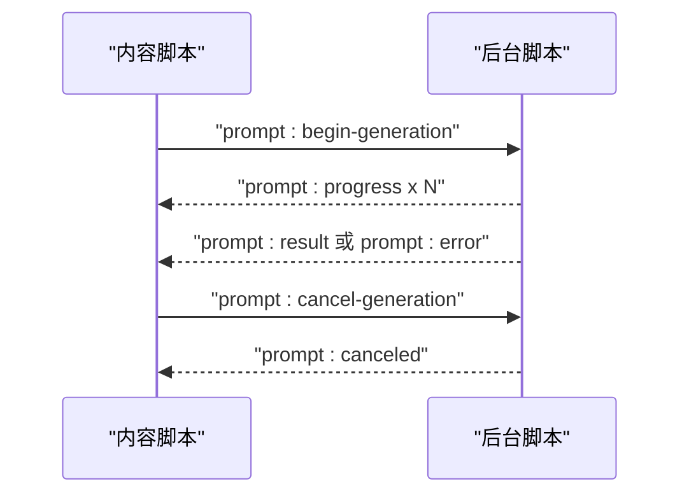
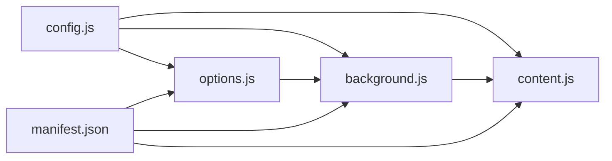

# 环境搭建

<cite>
**本文引用的文件**
- [manifest.json](file://manifest.json)
- [background.js](file://background.js)
- [content.js](file://content.js)
- [options.js](file://options.js)
- [config.js](file://config.js)
- [options.html](file://options.html)
- [messages.json（英文）](file://_locales/en/messages.json)
- [messages.json（简体中文）](file://_locales/zh_CN/messages.json)
</cite>

## 目录
1. [简介](#简介)
2. [项目结构](#项目结构)
3. [核心组件](#核心组件)
4. [架构总览](#架构总览)
5. [详细组件分析](#详细组件分析)
6. [依赖关系分析](#依赖关系分析)
7. [性能与构建建议](#性能与构建建议)
8. [开发与调试指南](#开发与调试指南)
9. [常见问题排查](#常见问题排查)
10. [结论](#结论)

## 简介
本指南面向需要在本地搭建 Img2Prompt Chrome 扩展开发环境的开发者，覆盖从工具链、浏览器开发者模式、本地加载扩展、manifest.json 配置要点，到调试工具（DevTools、网络监控、存储管理）的使用，并提供常见问题排查方法。本项目采用 Chrome Extension Manifest V3，包含服务工作线程、内容脚本、选项页面与多语言资源。

## 项目结构
- 根目录包含扩展清单、后台脚本、内容脚本、选项页面与国际化消息文件。
- 关键文件职责：
  - manifest.json：扩展清单，声明权限、背景脚本、内容脚本、图标、侧边栏等。
  - background.js：服务工作线程，负责安装事件、上下文菜单、命令监听、消息路由、与模型 API 通信、历史记录与分析事件上报。
  - content.js：内容脚本，注入 UI 面板、处理用户交互、与后台通信、展示进度与结果。
  - options.js + options.html：设置页面，管理连接参数、提示词模板、体验设置、历史记录。
  - config.js：共享配置（默认设置、提示词预设、UI 文案、错误码、PostHog 上报配置）。
  - _locales/*：国际化消息映射。

图表来源
- [manifest.json](file://manifest.json)
- [background.js](file://background.js)
- [content.js](file://content.js)
- [options.js](file://options.js)
- [options.html](file://options.html)
- [config.js](file://config.js)
- [_locales/en/messages.json](file://_locales/en/messages.json)
- [_locales/zh_CN/messages.json](file://_locales/zh_CN/messages.json)

章节来源
- [manifest.json](file://manifest.json)
- [background.js](file://background.js)
- [content.js](file://content.js)
- [options.js](file://options.js)
- [options.html](file://options.html)
- [config.js](file://config.js)
- [_locales/en/messages.json](file://_locales/en/messages.json)
- [_locales/zh_CN/messages.json](file://_locales/zh_CN/messages.json)

## 核心组件
- 清单与权限
  - 使用 Manifest V3，声明 action、background.service_worker、content_scripts、permissions、host_permissions、side_panel、commands 等。
  - 权限包括 contextMenus、storage、sidePanel、activeTab；主机权限为 <all_urls>。
- 服务工作线程（background）
  - 处理安装、上下文菜单、全局快捷键、消息分发、与模型 API 通信、历史记录、分析事件上报。
- 内容脚本（content）
  - 注入悬浮按钮与主面板 UI，处理用户交互，向后台发送生成请求并接收进度/结果。
- 设置页面（options）
  - 提供连接参数、提示词模板、体验设置、历史记录管理与自动保存。
- 共享配置（config）
  - 默认设置、提示词预设、UI 文案、错误码与消息、PostHog 上报配置。

章节来源
- [manifest.json](file://manifest.json)
- [background.js](file://background.js)
- [content.js](file://content.js)
- [options.js](file://options.js)
- [config.js](file://config.js)

## 架构总览
下图展示了扩展在浏览器中的运行时交互：清单声明组件，服务工作线程常驻，内容脚本按需注入，设置页面通过消息与后台交互。

图表来源
- [background.js](file://background.js)
- [content.js](file://content.js)
- [options.js](file://options.js)

## 详细组件分析

### 清单与权限（manifest.json）
- 关键点
  - manifest_version: 3
  - background.service_worker: background.js
  - content_scripts: 注入 config.js 与 content.js，匹配 <all_urls>，run_at: document_idle
  - permissions: contextMenus, storage, sidePanel, activeTab
  - host_permissions: <all_urls>
  - side_panel.default_path: options.html
  - commands: capture_screenshot（Alt+S）
  - action.icons: 图标路径
  - default_locale: en
  - i18n 名称/描述由 _locales/* 提供
- 建议
  - 若仅需特定域名，可将 host_permissions 收敛为实际 API 域名，减少权限范围。
  - content_scripts 的 run_at 可根据页面加载策略微调，但默认已较合理。

章节来源
- [manifest.json](file://manifest.json)
- [_locales/en/messages.json](file://_locales/en/messages.json)
- [_locales/zh_CN/messages.json](file://_locales/zh_CN/messages.json)

### 服务工作线程（background）
- 职责
  - 安装事件：创建上下文菜单、初始化默认设置、侧边栏行为、分析事件上报。
  - 快捷键：捕获可见区域截图并触发分析。
  - 消息路由：处理 analytics、打开侧边栏、取消生成、设置更新广播、历史读写。
  - 生成流程：校验设置、拉取/压缩图像、调用模型、解析结果、保存历史、上报事件。
  - 存储：使用 chrome.storage.local 管理客户端设置、历史、客户端 ID。
- 错误处理
  - 统一分类错误码，结合 UI 文案映射，向内容脚本反馈用户友好信息。
- 性能
  - 使用 AbortController 管理长请求，避免重复并发。
  - 对图像进行最大边压缩，降低请求体积。

图表来源
- [background.js](file://background.js)
- [config.js](file://config.js)

章节来源
- [background.js](file://background.js)
- [config.js](file://config.js)

### 内容脚本（content）
- 职责
  - 注入悬浮按钮与主面板 UI（Shadow DOM），处理用户交互（复制、切换语言、拖拽、停止）。
  - 监听来自后台的消息，更新进度、展示结果、错误提示。
  - 与后台通信：开始分析、加载历史项、设置更新通知。
- 用户体验
  - 支持 UI 语言切换、最大图像边设置、首选提示词语言记忆。
  - 截屏工具：框选区域截图并触发分析。

图表来源
- [content.js](file://content.js)
- [background.js](file://background.js)

章节来源
- [content.js](file://content.js)

### 设置页面（options）
- 功能
  - 连接设置：API Endpoint、Model、API Key。
  - 提示词模板：内置预设与自定义模板，支持增删改查与自动保存。
  - 体验设置：悬浮按钮开关、截屏快捷键开关、面板语言切换、最大图像边。
  - 历史记录：查看、复制、删除、清空。
- 交互
  - 自动保存：表单变更后延迟保存至 chrome.storage.local。
  - 通知：向内容脚本广播设置更新，确保 UI 即时同步。
  - 分析事件：保存设置时上报事件。

章节来源
- [options.js](file://options.js)
- [options.html](file://options.html)
- [config.js](file://config.js)

### 共享配置（config）
- 默认设置：API 地址、模型、温度、系统/用户提示词、最大图像边等。
- 提示词预设：多场景模板。
- UI 文案：中英双语。
- 错误码与消息：统一错误分类与本地化文案。
- 分析配置：PostHog 项目键与上报地址、分析开关键名。

章节来源
- [config.js](file://config.js)

## 依赖关系分析
- 组件耦合
  - background 与 content 通过消息通道强耦合，是扩展的核心交互层。
  - options 与 background 通过消息与存储间接耦合，实现设置同步。
  - config 作为共享模块被 background、content、options 引用。
- 外部依赖
  - 模型 API：OpenAI 兼容接口或 Anthropic Claude。
  - PostHog：可选分析上报。
- 潜在风险
  - content_scripts 匹配 <all_urls> 可能带来不必要的注入成本，建议按需收敛。
  - 服务工作线程与内容脚本的错误传播需保持一致的错误码与文案。

图表来源
- [config.js](file://config.js)
- [background.js](file://background.js)
- [content.js](file://content.js)
- [options.js](file://options.js)
- [manifest.json](file://manifest.json)

章节来源
- [config.js](file://config.js)
- [background.js](file://background.js)
- [content.js](file://content.js)
- [options.js](file://options.js)
- [manifest.json](file://manifest.json)

## 性能与构建建议
- 当前项目未使用 Webpack/Vite 等打包工具，直接以原生 JS/HTML/CSS 方式分发。
- 如需本地开发体验提升，可考虑：
  - 使用本地静态服务器（如 http-server）提供热更新与跨域调试。
  - 将 config.js 作为独立模块，配合构建工具进行资源内联与压缩。
  - 将 options.html 中的样式与脚本拆分，便于缓存与增量更新。
- 注意
  - Manifest V3 不支持 eval/eval-like 行为，避免在内容脚本中动态执行字符串。
  - 服务工作线程中使用 importScripts 加载共享配置，符合规范。

[本节为通用建议，不直接分析具体文件]

## 开发与调试指南

### 工具链与环境要求
- Node.js：用于本地静态服务器与构建（可选）。
- 文本编辑器：推荐 VS Code，启用 ESLint/Prettier。
- Chrome 浏览器：最新稳定版，开启开发者模式。

### 加载未打包扩展（开发者模式）
- 步骤
  1) 打开 Chrome，访问 chrome://extensions/
  2) 开启“开发者模式”
  3) 点击“加载已解压的扩展程序”，选择项目根目录
  4) 在扩展页面点击“最小化侧边栏”图标打开设置页
- 注意
  - 若出现“扩展程序未加载”的提示，检查 manifest.json 是否存在语法错误或缺失字段。
  - 若图标不显示，确认 icons/action/default_icon 路径存在且文件可访问。

章节来源
- [manifest.json](file://manifest.json)

### 清单配置要点
- 权限声明
  - contextMenus：用于右键菜单入口
  - storage：本地存储设置与历史
  - sidePanel：侧边栏 API
  - activeTab：获取当前标签页信息
- 主机权限
  - <all_urls>：允许访问任意页面的图像与发起网络请求
  - 建议：若仅对接特定 API，可改为具体域名，减少权限暴露
- 背景脚本与内容脚本
  - background.service_worker 指向 background.js
  - content_scripts 注入顺序：config.js -> content.js
  - run_at: document_idle 保证 DOM 可用且不影响首屏渲染
- 侧边栏与动作图标
  - side_panel.default_path 指向 options.html
  - action.default_icon 指向 icon 下的 PNG

章节来源
- [manifest.json](file://manifest.json)

### 开发工具使用
- Chrome DevTools
  - 扩展页调试：在 chrome://extensions/ 中点击“检查视图”进入后台/内容脚本 DevTools
  - Console：查看日志与错误堆栈
  - Sources：断点调试，观察变量与调用栈
- 网络请求监控
  - Network 面板：过滤 XHR/Fetch，查看模型 API 请求/响应
  - 关注状态码与响应体，定位鉴权、配额、格式等问题
- 存储管理
  - Application 面板：查看 Local Storage、IndexedDB（如有）
  - 清理历史记录或重置默认设置，验证数据持久化逻辑

章节来源
- [background.js](file://background.js)
- [content.js](file://content.js)
- [options.js](file://options.js)

## 常见问题排查

- 安装后无图标/无法打开设置
  - 检查 manifest.json 中 action/icons 路径是否正确
  - 确认已开启“开发者模式”并重新加载扩展
- 右键菜单不出现
  - 确认 background.js 中 contextMenus.create 是否成功
  - 检查 permissions 中是否包含 contextMenus
- 快捷键无效
  - 确认 chrome://extensions/shortcuts 中快捷键未被占用
  - 检查 commands.capture_screenshot 是否生效
- 生成失败/空白结果
  - 查看 Network 面板：401/403/429/5xx 等状态码
  - 检查 API Endpoint/Model/API Key 是否正确
  - 降低最大图像边设置，避免请求过大
- 侧边栏无法打开
  - 确认浏览器支持 sidePanel API（不同版本差异）
  - 检查 side_panel.default_path 是否指向 options.html
- 语言切换无效
  - 确认 options 页面中 uiLanguage 与 content 脚本的语言切换逻辑
  - 检查 UI 文案是否在 config.js 中存在对应键值

章节来源
- [manifest.json](file://manifest.json)
- [background.js](file://background.js)
- [content.js](file://content.js)
- [options.js](file://options.js)
- [config.js](file://config.js)

## 结论
本指南基于现有源码梳理了 Img2Prompt 的开发环境搭建与调试要点。项目采用 Manifest V3，组件边界清晰：后台脚本负责业务与网络，内容脚本负责 UI 与交互，设置页面负责配置与历史管理。建议在本地开发时结合 DevTools 的网络与存储面板进行问题定位，并根据实际 API 域名收敛 host_permissions 以增强安全性。