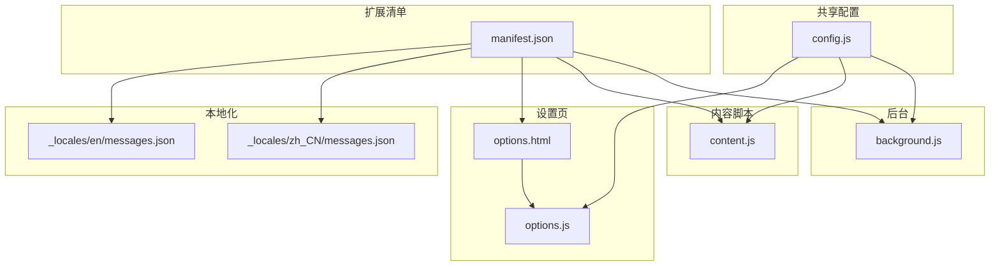
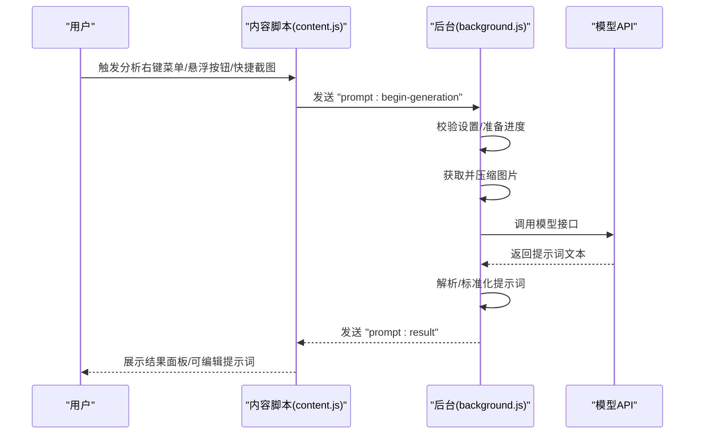
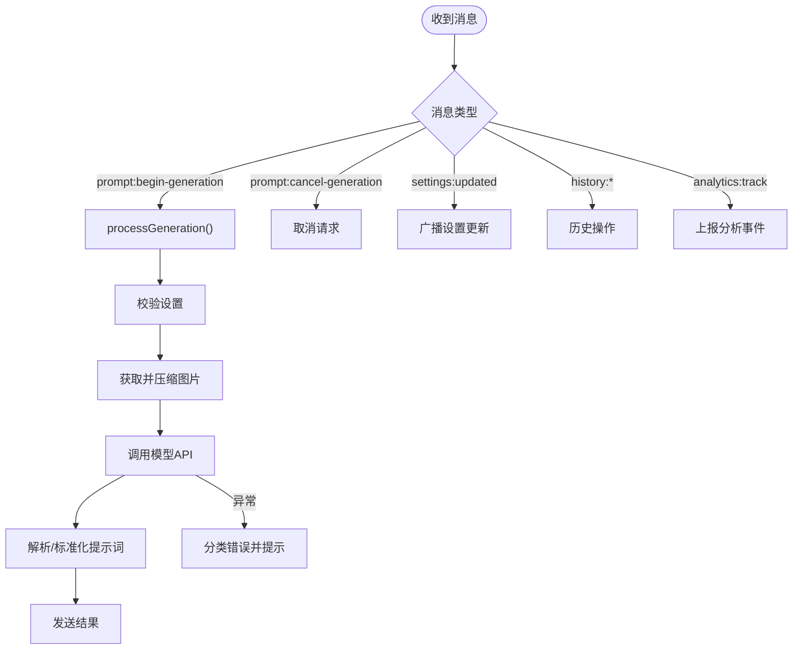
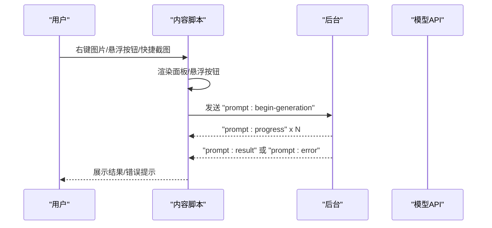
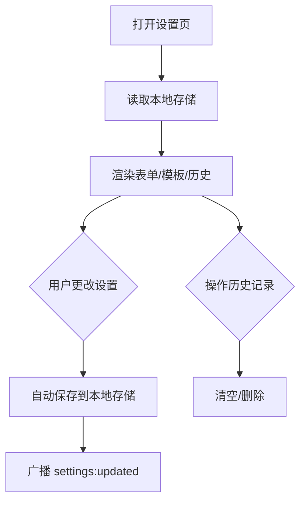
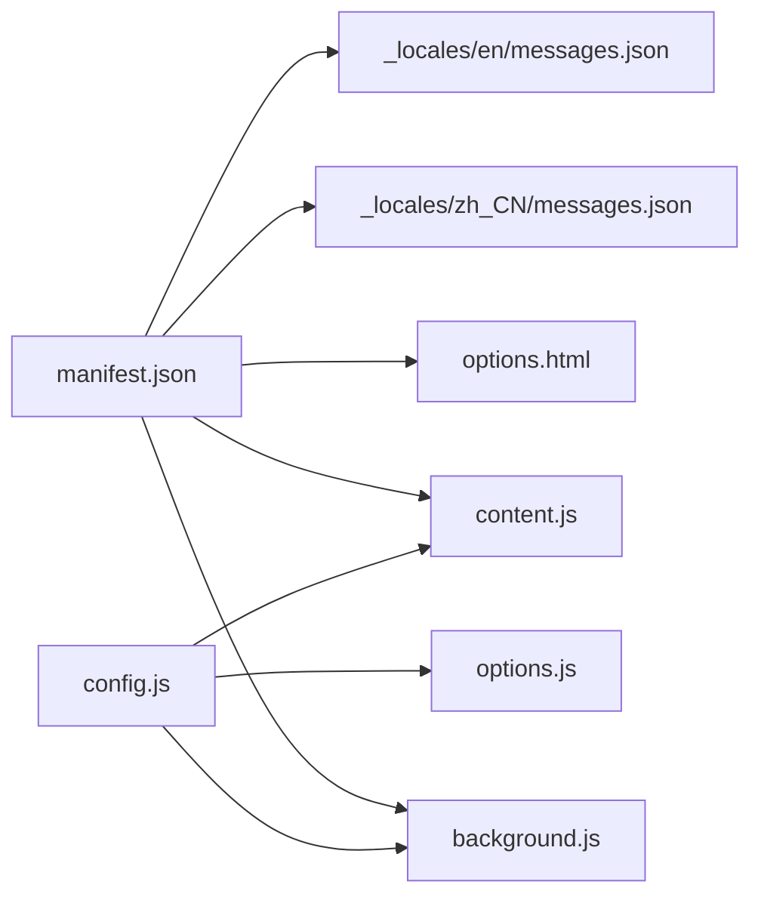

# 快速开始

<cite>
**本文引用的文件**
- [manifest.json](file://manifest.json)
- [config.js](file://config.js)
- [background.js](file://background.js)
- [content.js](file://content.js)
- [options.html](file://options.html)
- [options.js](file://options.js)
- [_locales/en/messages.json](file://_locales/en/messages.json)
- [_locales/zh_CN/messages.json](file://_locales/zh_CN/messages.json)
</cite>

## 目录
1. [简介](#简介)
2. [项目结构](#项目结构)
3. [核心组件](#核心组件)
4. [架构总览](#架构总览)
5. [详细组件分析](#详细组件分析)
6. [依赖关系分析](#依赖关系分析)
7. [性能与稳定性](#性能与稳定性)
8. [常见使用场景](#常见使用场景)
9. [安装与首次使用](#安装与首次使用)
10. [故障排除与常见问题](#故障排除与常见问题)
11. [结论](#结论)

## 简介
ImgPrompt 是一款 Chrome 扩展，可将网页中的图片一键转换为高质量的图像生成提示词（Prompt）。它支持通过右键菜单、悬浮按钮以及快捷截图三种方式触发分析，并提供中文/英文双语界面、历史记录与自定义提示词模板等功能。本指南帮助你在 5 分钟内完成安装并成功使用核心功能。

## 项目结构
该扩展采用 Manifest V3 架构，核心文件组织如下：
- manifest.json：声明扩展元信息、权限、后台脚本、侧边栏页面等
- config.js：共享配置（默认设置、提示词模板、UI 文案、错误码等）
- background.js：后台服务脚本，负责上下文菜单、快捷键、消息路由、与模型 API 的交互、进度与历史管理
- content.js：内容脚本，负责在页面中渲染分析面板、悬浮按钮、处理用户交互、与后台通信
- options.html + options.js：设置页，提供 API 配置、提示词模板、兼容性设置、历史记录管理等
- _locales/*：多语言文案（扩展名、描述）

图表来源
- [manifest.json:1-45](file://manifest.json#L1-L45)
- [config.js:1-254](file://config.js#L1-L254)
- [background.js:1-120](file://background.js#L1-L120)
- [content.js:1-120](file://content.js#L1-L120)
- [options.html:1-120](file://options.html#L1-L120)
- [options.js:1-60](file://options.js#L1-L60)

章节来源
- [manifest.json:1-45](file://manifest.json#L1-L45)
- [config.js:1-254](file://config.js#L1-L254)

## 核心组件
- 扩展清单与权限
  - 声明 action 图标、背景服务脚本、命令（快捷截图）、内容脚本注入、侧边栏路径、权限（上下文菜单、存储、侧边栏、活动标签页）等
- 共享配置
  - 默认设置（API 地址、模型、温度、系统提示词、用户提示词等）
  - 提示词模板集合（通用、摄影、CG、平面设计、UI、3D 资产、电商产品）
  - UI 文案（中英双语）、错误码与错误消息映射、分析上报配置
- 后台脚本
  - 上下文菜单注册与点击处理
  - 快捷键监听与截图捕获
  - 设置变更广播、历史记录增删查、与模型 API 交互（OpenAI 兼容/Anthropic）
  - 进度通知、错误分类与用户友好提示
- 内容脚本
  - 在页面渲染分析面板与悬浮按钮
  - 处理用户交互（复制、拖拽、停止、语言切换）
  - 截图选取区域并转为 base64 后交给后台分析
- 设置页
  - API 配置、提示词模板选择/自定义、兼容性设置（超时、分辨率）、历史记录查看与清理

章节来源
- [manifest.json:1-45](file://manifest.json#L1-L45)
- [config.js:1-254](file://config.js#L1-L254)
- [background.js:1-184](file://background.js#L1-L184)
- [content.js:1-120](file://content.js#L1-L120)
- [options.html:1-120](file://options.html#L1-L120)
- [options.js:1-120](file://options.js#L1-L120)

## 架构总览
扩展采用“后台服务脚本 + 内容脚本 + 设置页”的分层架构。内容脚本负责 UI 与用户交互；后台脚本负责与模型 API 通信、进度与错误处理、历史记录；设置页负责配置持久化与全局状态同步。

图表来源
- [background.js:212-320](file://background.js#L212-L320)
- [content.js:249-326](file://content.js#L249-L326)

## 详细组件分析

### 组件一：后台服务脚本（background.js）
职责与能力
- 初始化与上下文菜单：安装时创建右键菜单项，设置侧边栏行为，写入默认设置
- 快捷键处理：监听 “Alt+S”（或 Mac 的 Option+S），截取可见区域为 PNG，再交由内容脚本分析
- 消息路由：处理分析开始、进度、结果、错误、取消、设置更新、历史查询/删除/清空
- 设置校验与模型请求：根据设置选择 OpenAI 兼容或 Anthropic 接口，构造请求体，支持超时控制
- 错误分类与上报：将错误映射为用户可读提示，同时可选上报分析事件
- 历史记录：保存/读取/删除/清空，限制最大条目数

图表来源
- [background.js:94-184](file://background.js#L94-L184)
- [background.js:212-320](file://background.js#L212-L320)

章节来源
- [background.js:1-184](file://background.js#L1-L184)
- [background.js:212-320](file://background.js#L212-L320)

### 组件二：内容脚本（content.js）
职责与能力
- 渲染分析面板与悬浮按钮：在页面右上角固定位置展示卡片式 UI，支持拖拽、复制、停止、语言切换
- 用户交互处理：复制提示词、拖动卡片、关闭面板、停止生成、语言切换
- 与后台通信：启动分析、接收进度、结果、错误、取消、设置更新
- 截图工具：绘制覆盖层，框选区域后裁剪为 JPEG，回调内容脚本继续分析
- 设置同步：监听本地存储变化，动态更新 UI 语言、悬浮按钮开关、最大分辨率等

图表来源
- [content.js:209-247](file://content.js#L209-L247)
- [content.js:249-326](file://content.js#L249-L326)

章节来源
- [content.js:1-200](file://content.js#L1-L200)
- [content.js:209-326](file://content.js#L209-L326)

### 组件三：设置页（options.html + options.js）
职责与能力
- API 配置：输入 API Endpoint、Model、API Key，自动保存至本地存储
- 提示词模板：内置多场景模板（通用、摄影、CG、设计、UI、3D、电商），支持自定义模板并持久化
- 兼容性设置：API 超时、最大图片分辨率、悬浮按钮开关、截屏快捷键开关
- 历史记录：查看、复制、删除单条、清空全部
- 语言切换：设置面板 UI 语言（中文/英文）

图表来源
- [options.html:1-120](file://options.html#L1-L120)
- [options.js:182-213](file://options.js#L182-L213)
- [options.js:366-402](file://options.js#L366-L402)

章节来源
- [options.html:1-200](file://options.html#L1-L200)
- [options.js:1-120](file://options.js#L1-L120)

## 依赖关系分析
- manifest.json 依赖
  - 后台脚本 background.js
  - 内容脚本 content.js（注入 config.js 与自身）
  - 侧边栏页面 options.html
  - 图标资源（manifest 中声明）
- 共享配置 config.js
  - 被 background.js、content.js、options.js 引用
  - 提供默认设置、提示词模板、UI 文案、错误映射、分析上报配置
- 本地化
  - 扩展名与描述来自 _locales/*/messages.json

图表来源
- [manifest.json:1-45](file://manifest.json#L1-L45)
- [config.js:1-254](file://config.js#L1-L254)

章节来源
- [manifest.json:1-45](file://manifest.json#L1-L45)
- [config.js:1-254](file://config.js#L1-L254)

## 性能与稳定性
- 图片压缩与分辨率限制：默认最大边长 1024px，可在设置中降低以减少请求体积，避免超时或被拒绝
- 超时控制：默认 60 秒，可在设置中调整，避免长时间挂起
- 进度与取消：后台维护 activeRequests 映射，支持中途取消，避免资源浪费
- 错误分类：针对网络、鉴权、速率限制、超时、无效响应、JSON 解析失败等场景提供明确提示

章节来源
- [config.js:14-21](file://config.js#L14-L21)
- [background.js:517-604](file://background.js#L517-L604)
- [background.js:606-690](file://background.js#L606-L690)

## 常见使用场景
- 右键菜单触发
  - 在任意网页中右键图片，选择扩展菜单项，即可弹出分析面板并开始生成提示词
- 悬浮按钮使用
  - 将鼠标悬停在图片上，出现悬浮按钮，点击即可快速分析
- 快捷截图功能
  - 使用快捷键对页面任意区域进行框选截图，自动分析截图中的内容

章节来源
- [manifest.json:13-21](file://manifest.json#L13-L21)
- [background.js:74-92](file://background.js#L74-L92)
- [content.js:489-594](file://content.js#L489-L594)

## 安装与首次使用

### 从 Chrome Web Store 安装（推荐）
- 步骤
  - 在 Chrome 扩展商店搜索扩展名
  - 点击“添加到 Chrome”，确认权限
  - 安装完成后，扩展图标出现在地址栏右侧
- 注意
  - 首次使用需要在设置页填写 API 配置

章节来源
- [manifest.json:1-45](file://manifest.json#L1-L45)

### 开发者模式手动安装
- 步骤
  - 下载源码并解压到本地目录
  - 打开 Chrome，访问 chrome://extensions/
  - 开启“开发者模式”
  - 点击“加载已解压的扩展程序”，选择仓库根目录
  - 确认扩展加载成功
- 注意
  - 若未显示图标，刷新页面或重启浏览器
  - 如需调试，可在扩展页点击“检查视图：background page”查看后台日志

章节来源
- [manifest.json:1-45](file://manifest.json#L1-L45)

### 首次使用完整流程
- 打开设置页
  - 点击扩展图标，打开侧边栏设置页
  - 或在扩展页点击“选项”进入设置页
- 填写 API 配置
  - API Endpoint：填写 OpenAI 兼容接口地址（如 /v1/chat/completions）
  - Model：填写模型名称（如 gpt-5-mini、gemini-2.5-pro、claude-*）
  - API Key：填写你的密钥（仅保存在本地）
- 选择提示词模板
  - 选择内置场景模板，或点击“添加自定义”创建个性化模板
- 调整兼容性设置
  - 如遇 400/超时，适当降低“最大图片分辨率”或提高“API 请求超时时间”
- 保存并测试
  - 回到任意网页，右键图片或使用悬浮按钮触发分析
  - 查看面板中的提示词，可直接复制或进一步编辑

章节来源
- [options.html:379-450](file://options.html#L379-L450)
- [options.js:182-213](file://options.js#L182-L213)
- [config.js:16-31](file://config.js#L16-L31)

## 故障排除与常见问题

- 无法生成提示词
  - 检查 API 配置是否正确（Endpoint、Model、Key）
  - 确认网络连通性，必要时降低图片分辨率或延长超时时间
  - 若模型返回非 JSON，调整 System Prompt 确保输出纯 JSON
- 右键菜单不可用
  - 确认扩展已启用，且页面允许上下文菜单
  - 重新安装扩展或刷新页面
- 悬浮按钮不显示
  - 在设置页开启“悬浮 PicPrompt 按钮”
  - 检查图片是否可识别（部分动态加载图片可能延迟）
- 快捷截图无效
  - 确认快捷键为 Alt/Option + S
  - 检查是否启用了“截屏提取提示词”
- 历史记录为空
  - 首次使用尚未生成任何记录
  - 可在设置页清空或查看历史列表

章节来源
- [background.js:465-476](file://background.js#L465-L476)
- [background.js:517-604](file://background.js#L517-L604)
- [background.js:606-690](file://background.js#L606-L690)
- [options.html:555-565](file://options.html#L555-L565)

## 结论
通过本指南，你可以在 5 分钟内完成 ImgPrompt 的安装与首次使用。建议优先使用 Chrome Web Store 安装，首次使用务必在设置页填写正确的 API 配置并选择合适的提示词模板。若遇到问题，可依据“故障排除与常见问题”逐项排查。随着使用深入，你可以利用自定义模板与历史记录提升效率。