# 技术架构

<cite>
**本文档引用的文件**
- [manifest.json](file://manifest.json)
- [background.js](file://background.js)
- [content.js](file://content.js)
- [config.js](file://config.js)
- [options.html](file://options.html)
- [options.js](file://options.js)
</cite>

## 目录
1. [简介](#简介)
2. [项目结构](#项目结构)
3. [核心组件](#核心组件)
4. [架构总览](#架构总览)
5. [详细组件分析](#详细组件分析)
6. [依赖关系分析](#依赖关系分析)
7. [性能考虑](#性能考虑)
8. [故障排除指南](#故障排除指南)
9. [结论](#结论)

## 简介

Img2Prompt 是一个基于 Chrome Extension Manifest V3 的图片转提示词工具扩展。该扩展通过智能分析网页中的图片内容，生成高质量的图像生成提示词，支持多种AI模型接口，并提供直观的用户界面和丰富的配置选项。

该扩展采用现代浏览器扩展架构，利用 Service Worker 作为后台服务，Content Script 处理页面交互，Side Panel 提供配置界面，实现了完整的端到端工作流程。

## 项目结构

项目采用简洁的文件组织结构，每个文件都有明确的职责分工：

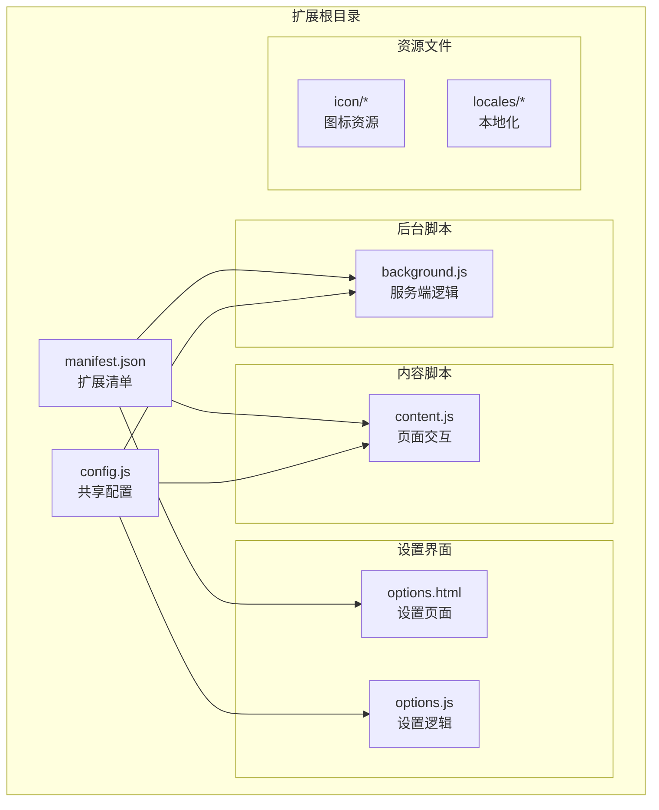

**图表来源**
- [manifest.json:1-45](file://manifest.json#L1-L45)
- [config.js:1-254](file://config.js#L1-L254)

**章节来源**
- [manifest.json:1-45](file://manifest.json#L1-L45)
- [config.js:1-254](file://config.js#L1-L254)

## 核心组件

### 扩展清单配置

manifest.json 定义了扩展的基本配置和权限声明：

- **服务端**: 使用 Service Worker 作为后台运行环境
- **内容脚本**: 注入到所有页面，监听用户交互
- **权限**: contextMenus, storage, sidePanel, activeTab
- **快捷键**: Alt+S 触发截图功能
- **侧边栏**: 默认路径指向设置页面

### 共享配置系统

config.js 提供了全局配置管理，包含：
- 默认设置参数
- 多语言字符串
- 错误码定义
- 分析追踪配置
- 用户提示词预设

**章节来源**
- [manifest.json:10-41](file://manifest.json#L10-L41)
- [config.js:4-254](file://config.js#L4-L254)

## 架构总览

Img2Prompt 采用了典型的浏览器扩展三层架构：

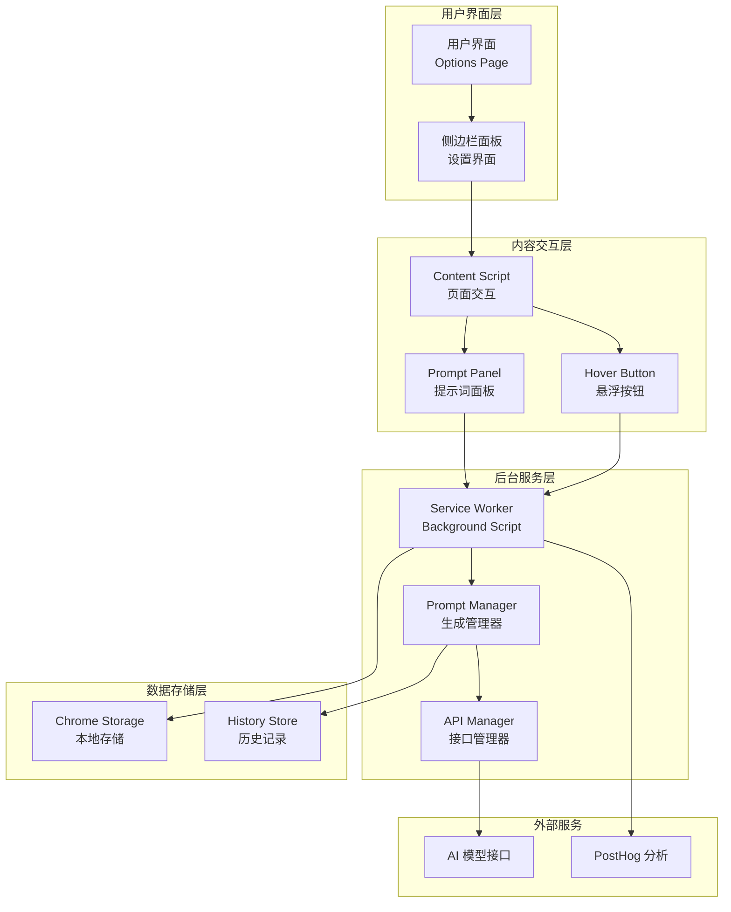

**图表来源**
- [background.js:19-57](file://background.js#L19-L57)
- [content.js:596-620](file://content.js#L596-L620)
- [options.js:182-213](file://options.js#L182-L213)

## 详细组件分析

### Background Script (background.js)

Background Script 是整个扩展的核心服务端组件，负责协调各个模块的工作。

#### 主要职责

1. **生命周期管理**
   - 扩展安装/更新事件处理
   - 客户端ID生成和验证
   - 设置初始化和迁移

2. **消息路由中心**
   - 处理来自内容脚本的消息
   - 管理跨标签页通信
   - 协调异步操作

3. **业务逻辑处理**
   - 图片分析和生成流程
   - API 请求管理和错误处理
   - 历史记录管理

#### 关键功能模块

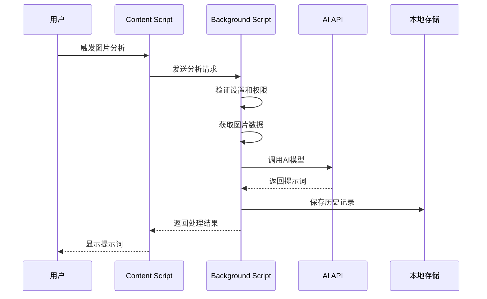

**图表来源**
- [background.js:212-320](file://background.js#L212-L320)
- [content.js:249-326](file://content.js#L249-L326)

#### 数据流设计

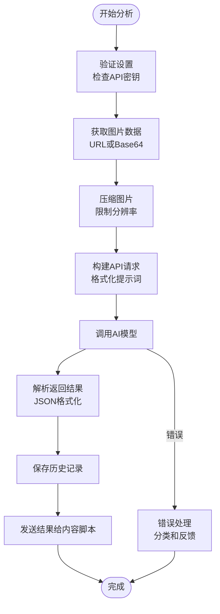

**图表来源**
- [background.js:478-604](file://background.js#L478-L604)
- [background.js:719-750](file://background.js#L719-L750)

**章节来源**
- [background.js:19-57](file://background.js#L19-L57)
- [background.js:94-184](file://background.js#L94-L184)
- [background.js:212-320](file://background.js#L212-L320)

### Content Script (content.js)

Content Script 负责与网页内容的直接交互，提供用户友好的界面和交互体验。

#### 核心功能

1. **悬浮按钮系统**
   - 智能检测图片元素
   - 动态定位和显示悬浮按钮
   - 遮挡检测和位置优化

2. **提示词面板**
   - 实时进度显示
   - 多语言切换支持
   - 一键复制功能

3. **用户交互处理**
   - 截图功能
   - 历史记录查看
   - 设置同步

#### 界面组件架构

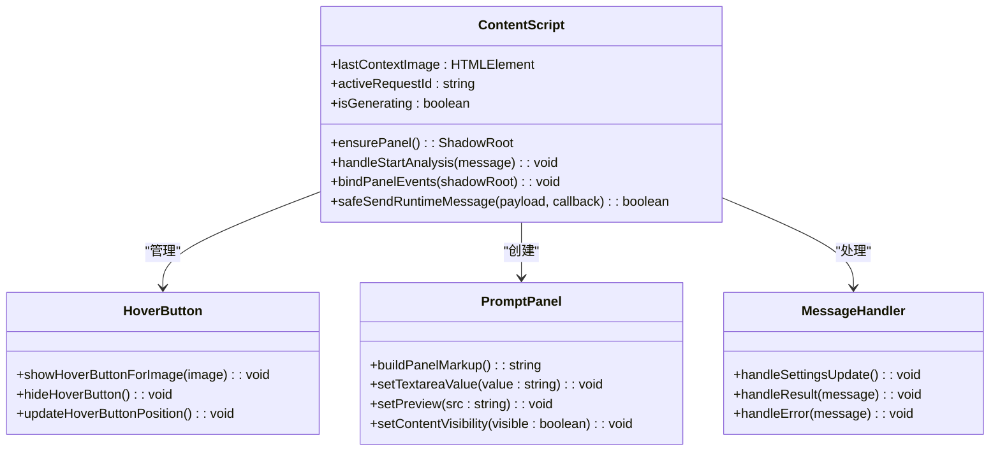

**图表来源**
- [content.js:30-55](file://content.js#L30-L55)
- [content.js:622-725](file://content.js#L622-L725)
- [content.js:1273-1346](file://content.js#L1273-L1346)

#### 交互流程

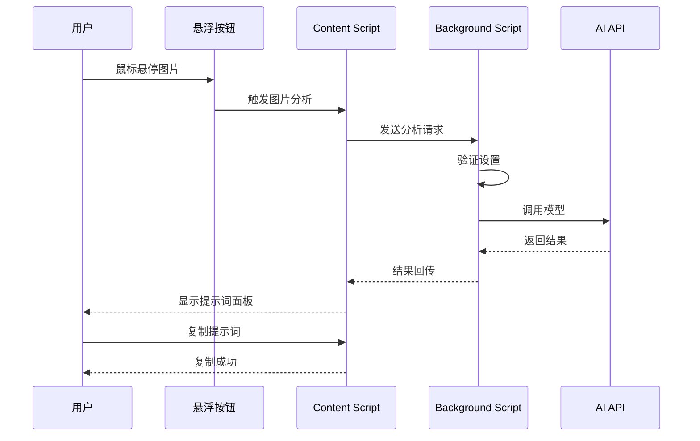

**图表来源**
- [content.js:1158-1190](file://content.js#L1158-L1190)
- [content.js:249-326](file://content.js#L249-L326)

**章节来源**
- [content.js:30-55](file://content.js#L30-L55)
- [content.js:1158-1271](file://content.js#L1158-L1271)
- [content.js:1273-1346](file://content.js#L1273-L1346)

### Config Management (config.js)

Config.js 提供了统一的配置管理，确保各组件间的一致性。

#### 配置层次结构

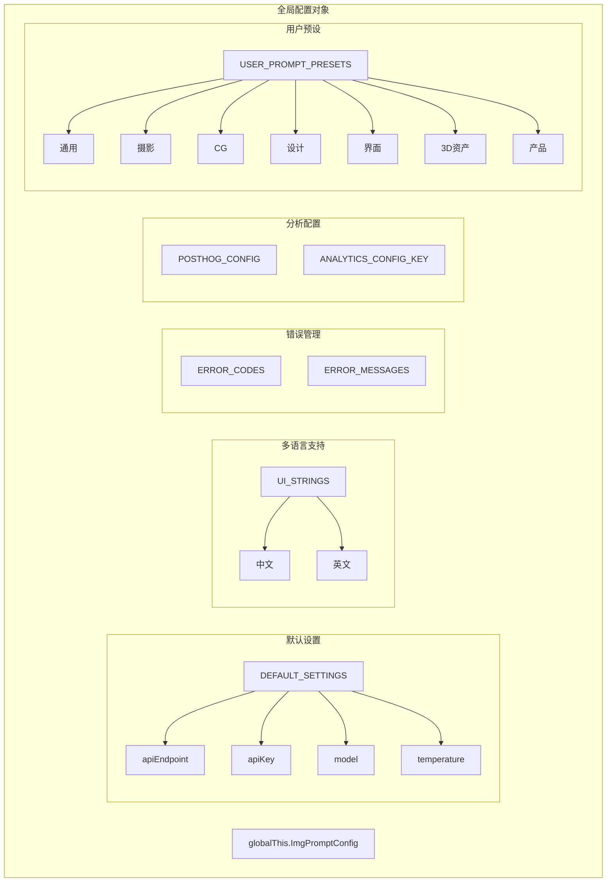

**图表来源**
- [config.js:4-254](file://config.js#L4-L254)

#### 配置使用模式

配置系统采用"共享配置"模式，通过全局对象在不同脚本间共享：

- **Content Script**: 直接访问 `window.ImgPromptConfig`
- **Background Script**: 通过 `importScripts` 加载
- **Options Page**: 通过脚本注入获取配置

**章节来源**
- [config.js:4-254](file://config.js#L4-L254)

### Options Page (options.html + options.js)

Options Page 提供了完整的设置管理界面。

#### 页面结构

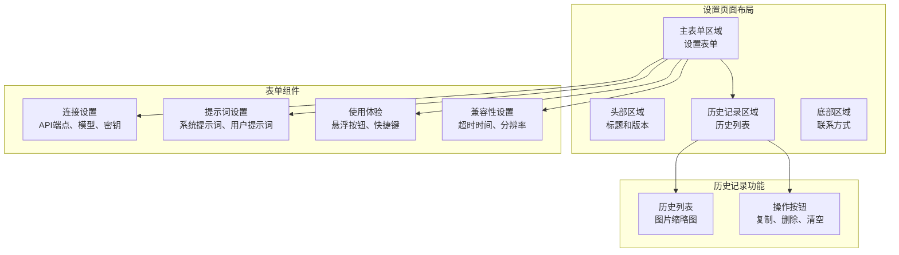

**图表来源**
- [options.html:370-585](file://options.html#L370-L585)
- [options.js:182-213](file://options.js#L182-L213)

#### 设置同步机制

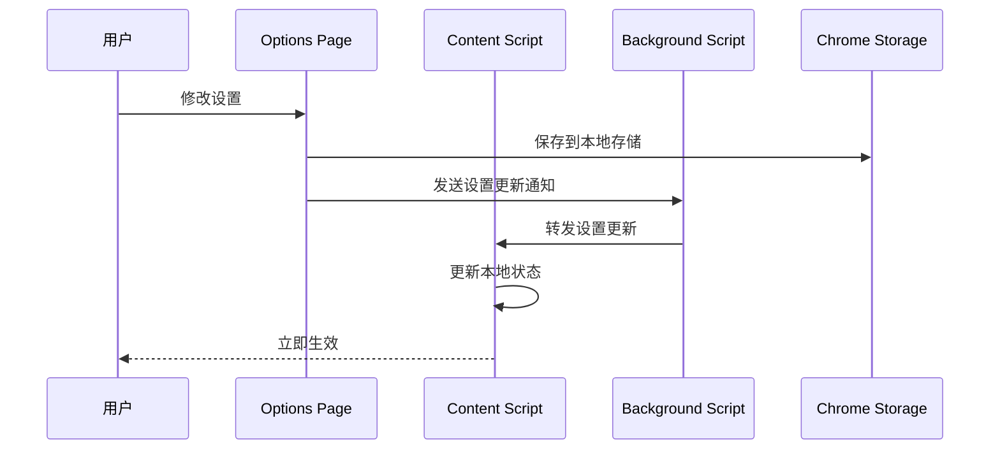

**图表来源**
- [options.js:384-402](file://options.js#L384-L402)
- [background.js:134-147](file://background.js#L134-L147)

**章节来源**
- [options.html:370-585](file://options.html#L370-L585)
- [options.js:182-213](file://options.js#L182-L213)

## 依赖关系分析

### 组件间依赖关系

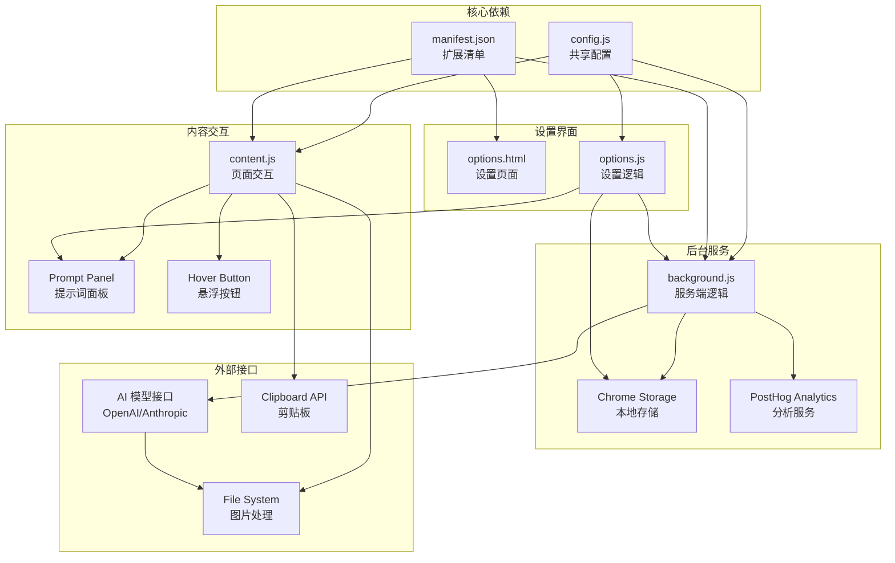

**图表来源**
- [manifest.json:10-41](file://manifest.json#L10-L41)
- [background.js:1-12](file://background.js#L1-L12)
- [content.js:1-4](file://content.js#L1-L4)

### 消息传递协议

扩展内部采用统一的消息传递协议：

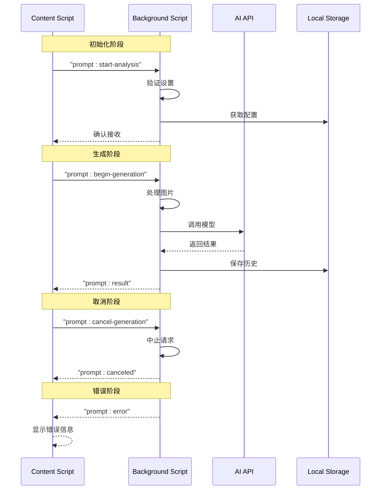

**图表来源**
- [content.js:209-247](file://content.js#L209-L247)
- [background.js:94-184](file://background.js#L94-L184)

**章节来源**
- [manifest.json:10-41](file://manifest.json#L10-L41)
- [background.js:1-12](file://background.js#L1-L12)
- [content.js:209-247](file://content.js#L209-L247)

## 性能考虑

### 内存管理

1. **图片处理优化**
   - 自动压缩图片到指定分辨率
   - Base64编码限制在合理范围内
   - 及时释放Canvas内存

2. **DOM操作优化**
   - Shadow DOM减少样式冲突
   - 节流处理高频事件
   - 懒加载非关键资源

3. **网络请求优化**
   - 请求超时控制
   - 错误重试机制
   - 连接池管理

### 存储策略

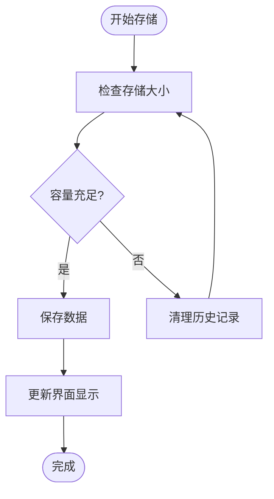

**图表来源**
- [background.js:412-430](file://background.js#L412-L430)
- [background.js:432-463](file://background.js#L432-L463)

### 缓存机制

- **配置缓存**: 在内存中缓存常用配置
- **图片缓存**: Base64数据缓存避免重复处理
- **历史缓存**: 最近项目缓存提升响应速度

## 故障排除指南

### 常见问题诊断

1. **API调用失败**
   - 检查API密钥有效性
   - 验证网络连接状态
   - 确认模型名称正确
   - 查看请求超时设置

2. **图片处理错误**
   - 确认图片URL可访问
   - 检查图片格式支持
   - 调整分辨率限制
   - 验证跨域访问权限

3. **界面显示异常**
   - 刷新页面重新注入
   - 检查扩展权限设置
   - 清除浏览器缓存
   - 重启浏览器扩展进程

### 错误处理流程

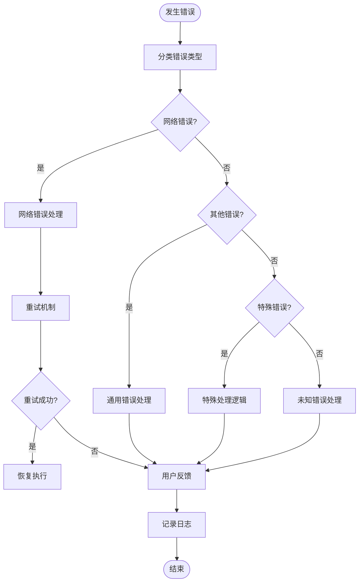

**图表来源**
- [background.js:280-317](file://background.js#L280-L317)
- [background.js:465-476](file://background.js#L465-L476)

**章节来源**
- [background.js:280-317](file://background.js#L280-L317)
- [background.js:465-476](file://background.js#L465-L476)

## 结论

Img2Prompt 展示了一个设计良好的浏览器扩展架构，通过清晰的分层设计和标准化的消息传递协议，实现了复杂的功能需求。其主要优势包括：

1. **模块化设计**: 每个组件职责明确，便于维护和扩展
2. **用户体验**: 提供直观的界面和流畅的交互体验
3. **可靠性**: 完善的错误处理和恢复机制
4. **性能优化**: 合理的资源管理和缓存策略

该架构为类似项目的开发提供了优秀的参考模板，特别是在浏览器扩展的前后端分离、消息通信和状态管理方面具有重要的借鉴价值。