# 数据管理策略

<cite>
**本文档引用的文件**
- [manifest.json](file://manifest.json)
- [config.js](file://config.js)
- [background.js](file://background.js)
- [content.js](file://content.js)
- [options.js](file://options.js)
- [options.html](file://options.html)
</cite>

## 目录
1. [简介](#简介)
2. [项目结构概览](#项目结构概览)
3. [核心组件与数据流](#核心组件与数据流)
4. [Chrome Storage API 使用模式](#chrome-storage-api-使用模式)
5. [配置数据管理](#配置数据管理)
6. [历史记录存储策略](#历史记录存储策略)
7. [临时状态管理](#临时状态管理)
8. [数据同步与一致性](#数据同步与一致性)
9. [数据迁移与版本兼容性](#数据迁移与版本兼容性)
10. [数据访问模式最佳实践](#数据访问模式最佳实践)
11. [性能优化建议](#性能优化建议)
12. [数据安全与隐私保护](#数据安全与隐私保护)
13. [故障排除指南](#故障排除指南)
14. [结论](#结论)

## 简介

本文件详细阐述了 ImgPrompt Chrome 扩展的数据管理策略，重点分析了 Chrome Storage API 的使用模式、数据持久化策略、本地状态管理机制以及数据同步和一致性保证措施。该扩展通过服务工作线程和内容脚本的协作，实现了高效的图像到提示词转换功能，同时确保用户数据的安全性和隐私保护。

## 项目结构概览

ImgPrompt 扩展采用模块化的架构设计，主要包含以下核心组件：

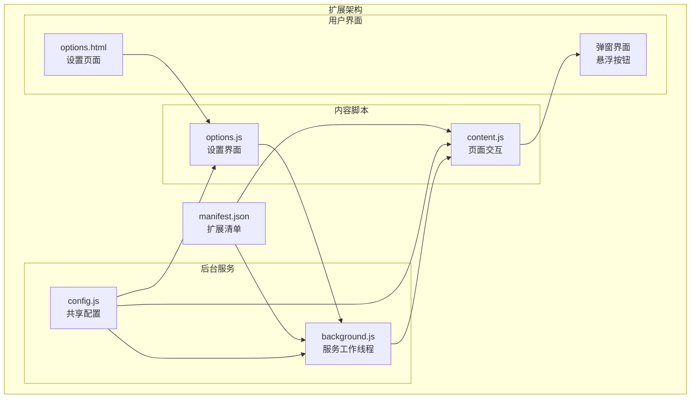

**图表来源**
- [manifest.json:1-45](file://manifest.json#L1-L45)
- [background.js:1-50](file://background.js#L1-L50)
- [content.js:1-50](file://content.js#L1-L50)
- [options.js:1-30](file://options.js#L1-L30)

## 核心组件与数据流

### 数据流架构

扩展采用分层数据管理模式，通过明确的职责分离确保数据的一致性和可靠性：

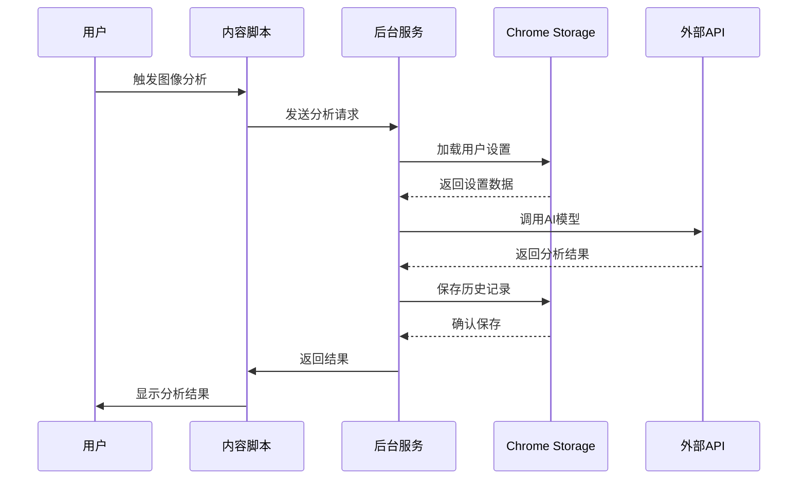

**图表来源**
- [background.js:212-320](file://background.js#L212-L320)
- [content.js:249-326](file://content.js#L249-L326)

### 组件职责分离

| 组件 | 主要职责 | 数据访问模式 |
|------|----------|-------------|
| background.js | 服务工作线程，处理核心业务逻辑 | 读写 Chrome Storage，调用外部API |
| content.js | 页面交互，用户界面管理 | 本地状态管理，UI更新 |
| options.js | 设置界面，配置管理 | 读写 Chrome Storage，事件处理 |
| config.js | 共享配置，默认设置 | 静态配置提供 |

**章节来源**
- [background.js:1-100](file://background.js#L1-L100)
- [content.js:1-100](file://content.js#L1-L100)
- [options.js:1-50](file://options.js#L1-L50)

## Chrome Storage API 使用模式

### 存储区域选择

扩展采用 Chrome Storage 的不同区域来满足各种数据持久化需求：

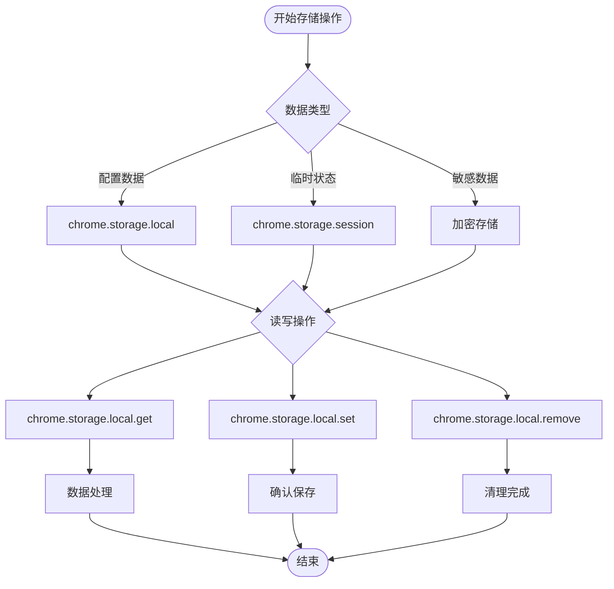

**图表来源**
- [background.js:322-328](file://background.js#L322-L328)
- [content.js:102-111](file://content.js#L102-L111)

### 存储键值设计

扩展使用结构化的键值命名约定来组织不同类型的数据：

| 键名前缀 | 数据类型 | 存储用途 | 示例 |
|----------|----------|----------|------|
| `promptHistory` | 数组 | 历史记录存储 | `promptHistory` |
| `clientId` | 字符串 | 用户标识符 | `clientId` |
| `analyticsConfig` | 布尔值 | 分析开关 | `analyticsConfig` |
| `customTemplates` | 对象 | 自定义模板 | `customTemplates` |
| `hoverButtonEnabled` | 布尔值 | UI状态 | `hoverButtonEnabled` |
| `uiLanguage` | 字符串 | 语言设置 | `uiLanguage` |
| `maxImageEdge` | 整数 | 性能设置 | `maxImageEdge` |

**章节来源**
- [background.js:13-16](file://background.js#L13-L16)
- [background.js:412-463](file://background.js#L412-L463)
- [content.js:102-141](file://content.js#L102-L141)
- [options.js:182-213](file://options.js#L182-L213)

## 配置数据管理

### 默认设置管理

扩展通过共享配置模块提供统一的默认设置管理：

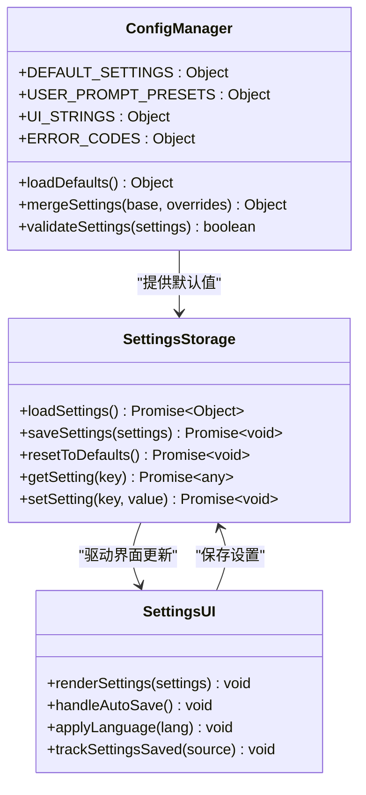

**图表来源**
- [config.js:4-20](file://config.js#L4-L20)
- [background.js:322-328](file://background.js#L322-L328)
- [options.js:404-420](file://options.js#L404-L420)

### 设置持久化策略

设置数据采用渐进式初始化和增量更新策略：

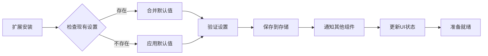

**图表来源**
- [background.js:19-57](file://background.js#L19-L57)
- [background.js:322-328](file://background.js#L322-L328)

**章节来源**
- [config.js:1-253](file://config.js#L1-L253)
- [background.js:19-57](file://background.js#L19-L57)
- [options.js:182-213](file://options.js#L182-L213)

## 历史记录存储策略

### 历史记录数据结构

历史记录采用数组形式存储，每个条目包含完整的分析结果和元数据：

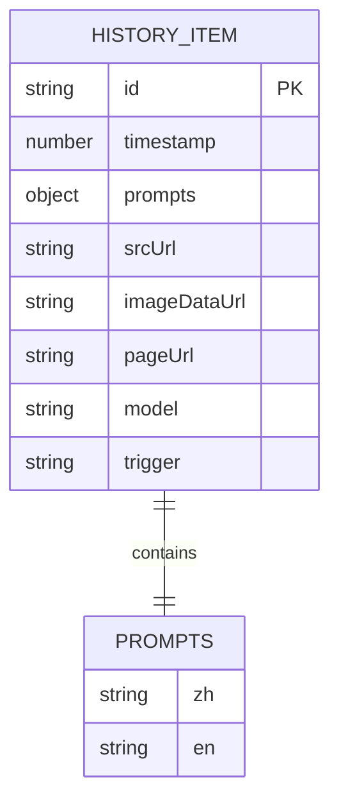

**图表来源**
- [background.js:412-430](file://background.js#L412-L430)
- [background.js:432-440](file://background.js#L432-L440)

### 存储容量管理

历史记录采用固定大小队列管理策略，确保存储空间的有效利用：

| 参数 | 值 | 说明 |
|------|-----|------|
| MAX_HISTORY_ITEMS | 50 | 最大历史记录数量 |
| 存储策略 | LRU | 先进先出替换 |
| 清理机制 | 自动 | 超限时自动删除最旧项 |

### 历史记录操作流程

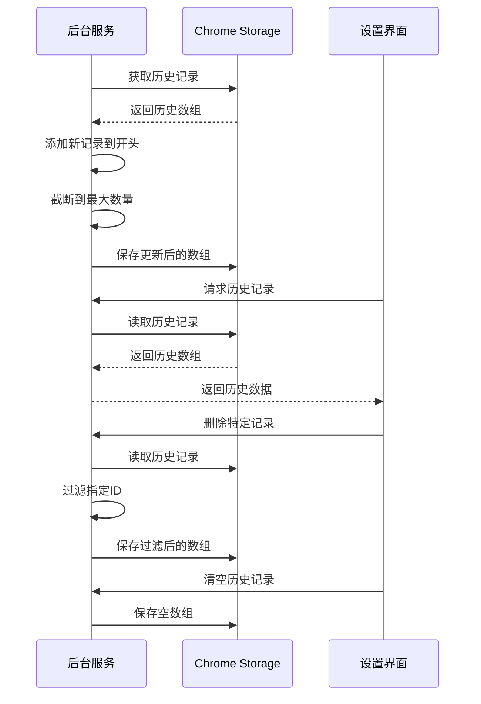

**图表来源**
- [background.js:412-463](file://background.js#L412-L463)
- [options.js:215-245](file://options.js#L215-L245)

**章节来源**
- [background.js:412-463](file://background.js#L412-L463)
- [options.js:215-364](file://options.js#L215-L364)

## 临时状态管理

### 内存状态设计

扩展在内存中维护多种临时状态变量，用于协调组件间的通信和UI状态管理：

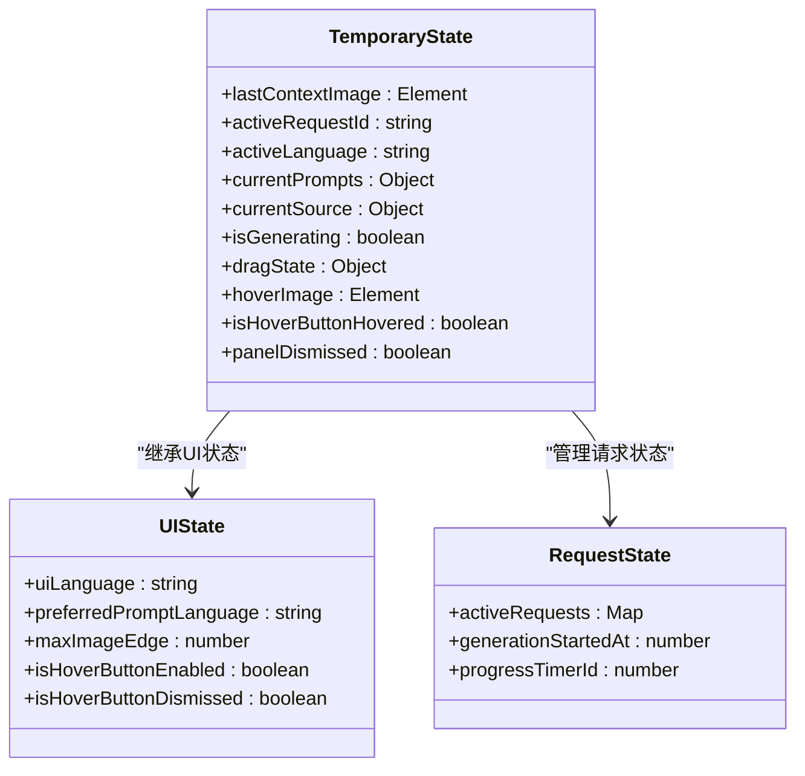

**图表来源**
- [content.js:36-54](file://content.js#L36-L54)
- [background.js:17](file://background.js#L17)

### 状态同步机制

扩展采用双向状态同步机制，确保各组件间的状态一致性：

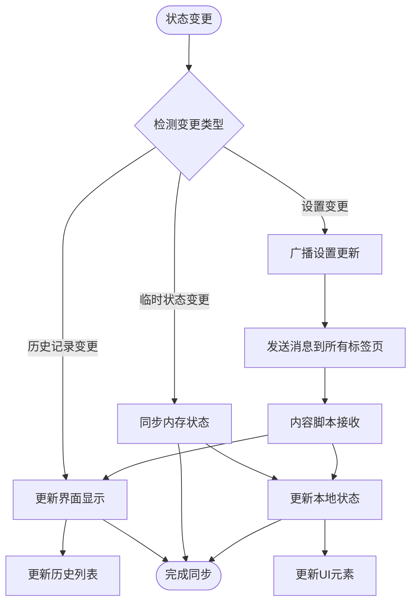

**图表来源**
- [background.js:134-147](file://background.js#L134-L147)
- [content.js:113-141](file://content.js#L113-L141)

**章节来源**
- [content.js:36-163](file://content.js#L36-L163)
- [background.js:134-147](file://background.js#L134-L147)

## 数据同步与一致性

### 跨组件数据同步

扩展实现了多层级的数据同步机制，确保各组件间的数据一致性：

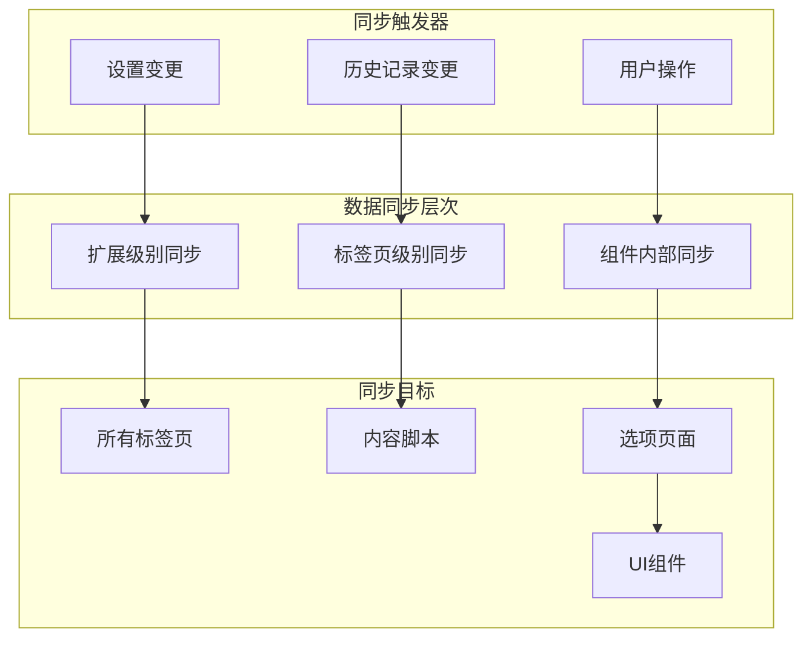

### 一致性保证措施

扩展采用多种机制确保数据一致性：

1. **原子性操作**: 所有存储操作都采用原子性，避免部分更新
2. **事务性处理**: 批量操作通过单次存储调用完成
3. **冲突解决**: 采用最后写入获胜策略处理并发冲突
4. **回滚机制**: 关键操作支持失败回滚

**章节来源**
- [background.js:134-147](file://background.js#L134-L147)
- [content.js:113-141](file://content.js#L113-L141)

## 数据迁移与版本兼容性

### 版本管理策略

扩展通过清单文件中的版本号实现版本管理：

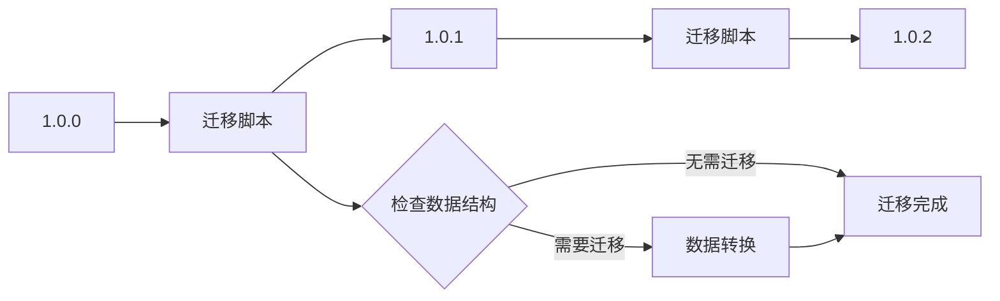

### 迁移兼容性处理

扩展采用向后兼容的设计原则：

| 兼容性维度 | 处理策略 | 实现方式 |
|------------|----------|----------|
| 数据结构 | 向后兼容 | 默认值填充 |
| API接口 | 版本控制 | 动态适配 |
| 用户界面 | 渐进增强 | 条件渲染 |
| 功能特性 | 可选启用 | 开关控制 |

**章节来源**
- [manifest.json:43](file://manifest.json#L43)
- [background.js:19-57](file://background.js#L19-L57)

## 数据访问模式最佳实践

### 异步操作模式

扩展严格遵循异步编程模式，确保UI响应性和数据一致性：

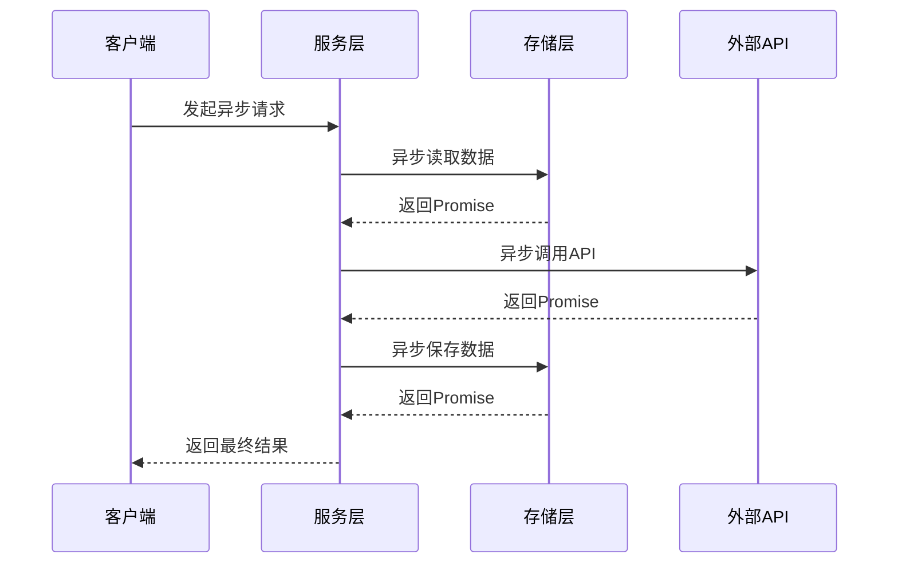

### 错误处理策略

扩展实现了完善的错误处理机制：

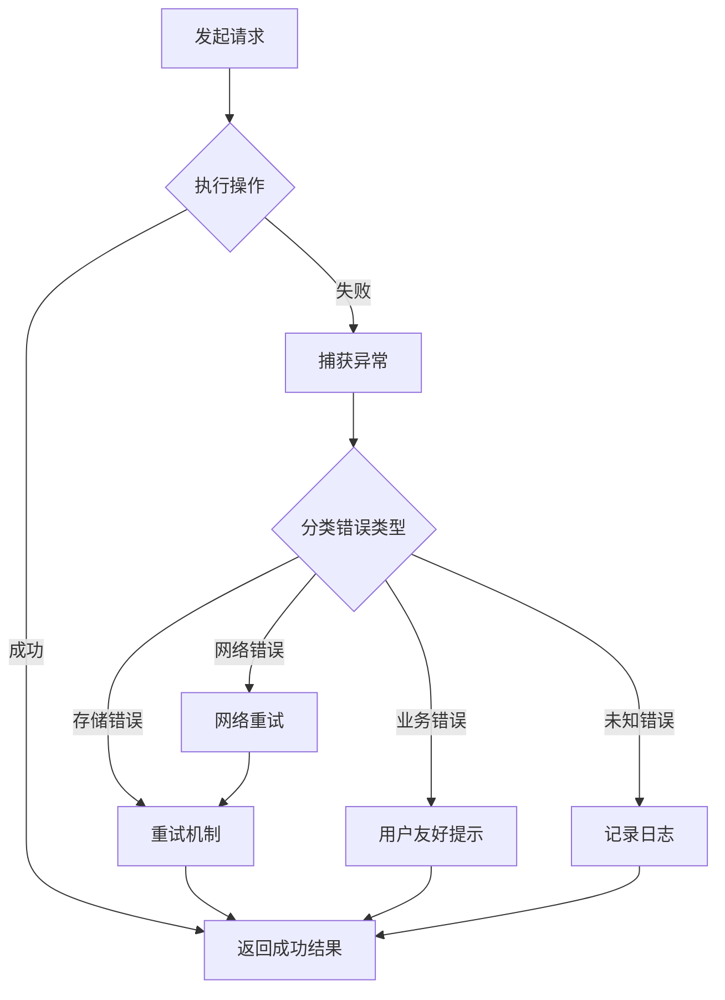

**章节来源**
- [background.js:872-945](file://background.js#L872-L945)
- [content.js:56-75](file://content.js#L56-L75)

## 性能优化建议

### 存储优化策略

扩展采用了多项存储优化技术：

1. **批量操作**: 将多个存储操作合并为单次调用
2. **增量更新**: 仅更新变化的数据部分
3. **缓存机制**: 在内存中缓存常用数据
4. **压缩存储**: 对大数据进行压缩存储

### 内存管理优化

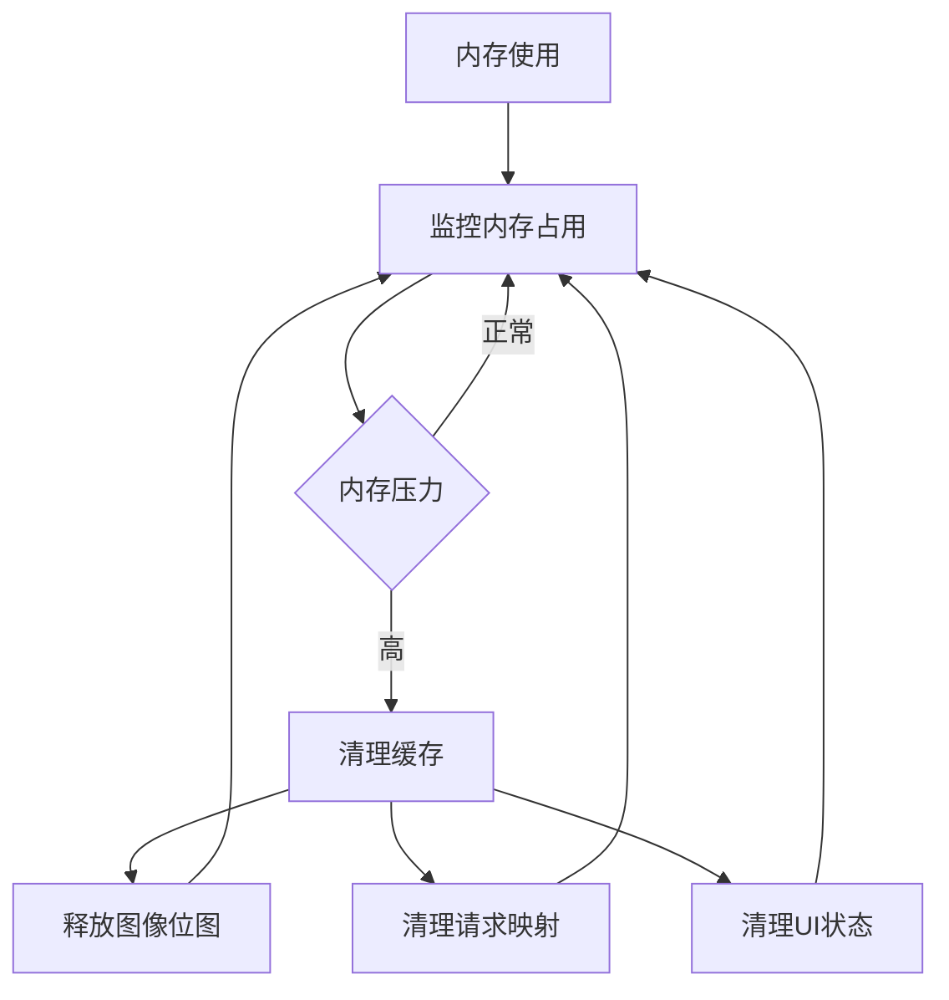

### 网络优化策略

扩展实现了智能的网络请求优化：

| 优化技术 | 实现方式 | 性能收益 |
|----------|----------|----------|
| 请求去重 | 基于URL的请求缓存 | 减少重复请求 |
| 超时控制 | 动态超时调整 | 提高成功率 |
| 错误重试 | 指数退避算法 | 增强稳定性 |
| 连接复用 | HTTP/2连接池 | 降低延迟 |

**章节来源**
- [background.js:801-850](file://background.js#L801-L850)
- [content.js:5-28](file://content.js#L5-L28)

## 数据安全与隐私保护

### 数据最小化原则

扩展严格遵循数据最小化原则，仅收集必要的用户数据：

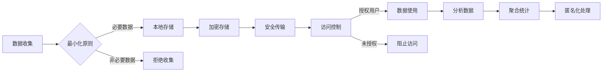

### 隐私保护措施

扩展实施了多层次的隐私保护措施：

1. **本地存储优先**: 敏感数据仅存储在本地
2. **最小权限原则**: 仅申请必要的权限
3. **用户控制**: 用户可随时删除个人数据
4. **透明度**: 明确告知数据使用目的

### 安全存储实现

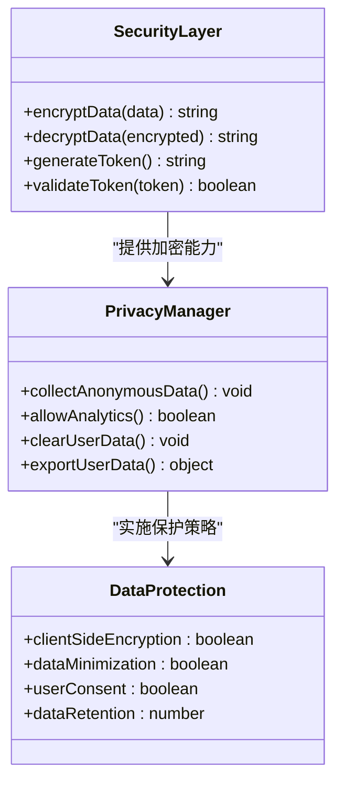

**图表来源**
- [config.js:249-252](file://config.js#L249-L252)
- [background.js:359-410](file://background.js#L359-L410)

**章节来源**
- [config.js:249-252](file://config.js#L249-L252)
- [background.js:359-410](file://background.js#L359-L410)

## 故障排除指南

### 常见问题诊断

扩展提供了完善的错误诊断和处理机制：

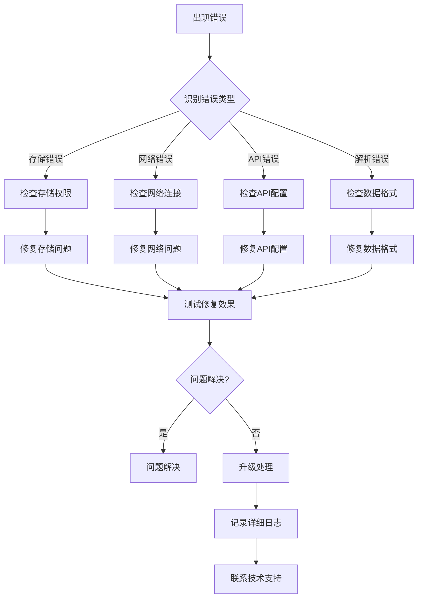

### 调试工具和方法

扩展支持多种调试和诊断方法：

1. **控制台日志**: 详细的错误和状态信息
2. **存储检查**: 直接查看存储中的数据
3. **网络监控**: 跟踪API调用和响应
4. **性能分析**: 监控内存和CPU使用情况

**章节来源**
- [background.js:872-945](file://background.js#L872-L945)
- [content.js:56-75](file://content.js#L56-L75)

## 结论

ImgPrompt 扩展展现了现代 Chrome 扩展数据管理的最佳实践。通过合理的架构设计、严格的权限控制、完善的错误处理机制和持续的性能优化，该扩展实现了高效、安全、可靠的用户体验。

### 核心优势

1. **架构清晰**: 分层设计确保了良好的可维护性
2. **数据安全**: 本地存储和隐私保护措施完善
3. **性能优秀**: 多层次的优化策略提升了用户体验
4. **扩展性强**: 模块化设计便于功能扩展和维护

### 未来改进方向

1. **数据备份**: 实现用户数据的云端备份功能
2. **性能监控**: 增加更详细的性能指标监控
3. **用户反馈**: 收集用户使用数据以改进功能
4. **安全审计**: 定期进行安全性和合规性审查

该数据管理策略为类似项目的开发提供了宝贵的参考经验，特别是在 Chrome 扩展环境中实现复杂数据管理功能方面具有重要的借鉴意义。