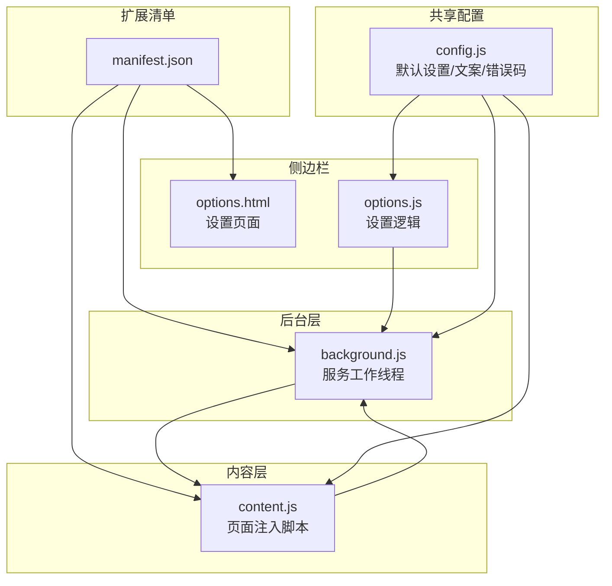
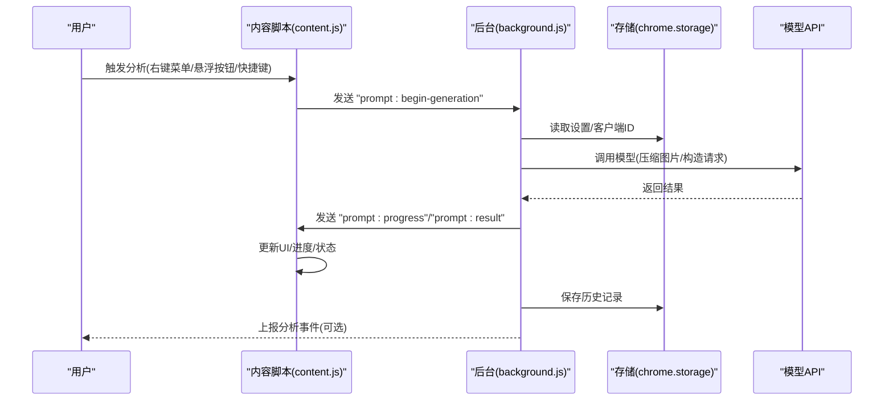
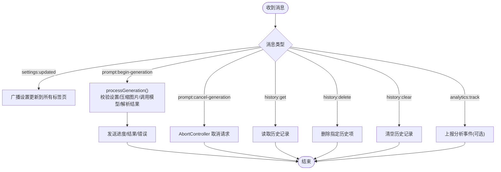
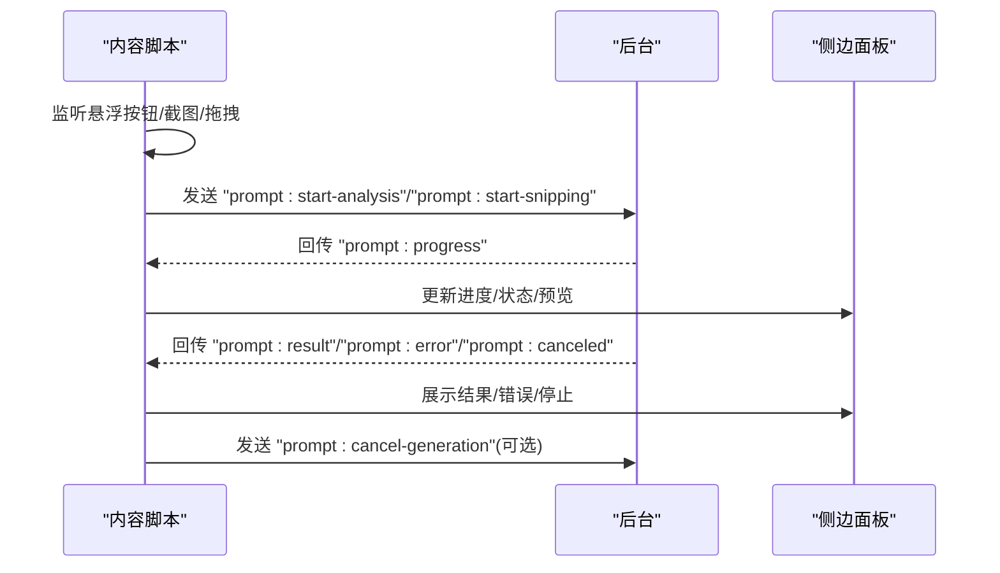
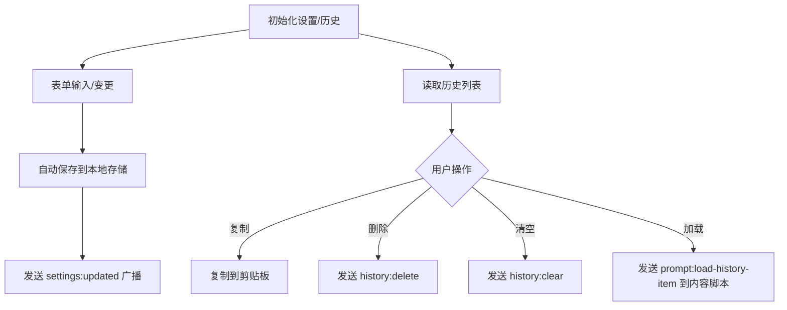
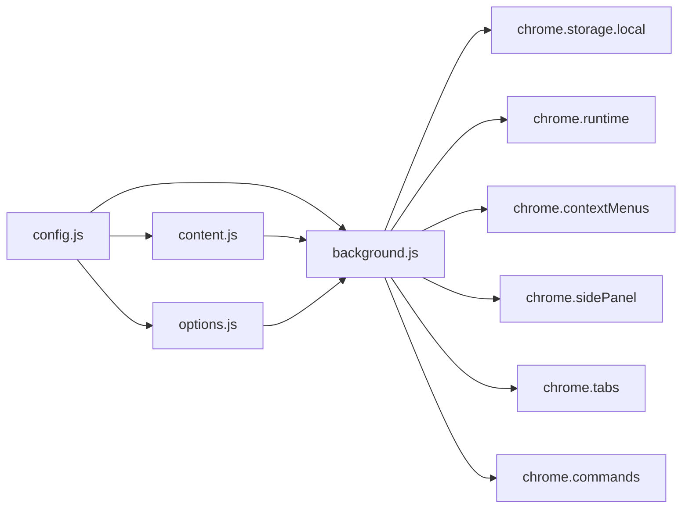

# 整体架构设计

<cite>
**本文档引用的文件**
- [manifest.json](file://manifest.json)
- [background.js](file://background.js)
- [content.js](file://content.js)
- [options.js](file://options.js)
- [options.html](file://options.html)
- [config.js](file://config.js)
- [_locales/en/messages.json](file://_locales/en/messages.json)
</cite>

## 目录
1. [简介](#简介)
2. [项目结构](#项目结构)
3. [核心组件](#核心组件)
4. [架构总览](#架构总览)
5. [详细组件分析](#详细组件分析)
6. [依赖关系分析](#依赖关系分析)
7. [性能考虑](#性能考虑)
8. [故障排除指南](#故障排除指南)
9. [结论](#结论)

## 简介
本项目是一个基于 Chrome Extension Manifest V3 的图片转提示词工具，通过浏览器扩展实现“图片到提示词”的自动化分析与生成。扩展采用分层架构：后台脚本负责业务流程编排与持久化、内容脚本负责页面交互与 UI 展示、侧边栏选项页提供配置与历史记录管理。扩展严格遵循 Manifest V3 的安全与权限模型，通过消息传递协议实现跨组件通信，并提供完善的错误处理与进度反馈机制。

## 项目结构
扩展采用“共享配置 + 多入口脚本”的组织方式：
- manifest.json 定义扩展元信息、权限、后台脚本、内容脚本注入规则、侧边栏路径等
- background.js 作为服务工作线程，处理安装事件、上下文菜单、键盘快捷键、消息路由与业务流程
- content.js 注入到目标页面，负责悬浮按钮、侧边面板 UI、用户交互与进度反馈
- options.html/options.js 提供设置界面与历史记录管理
- config.js 提供全局配置常量与多语言文案，供多个模块复用

**图表来源**
- [manifest.json](file://manifest.json)
- [background.js](file://background.js)
- [content.js](file://content.js)
- [options.js](file://options.js)
- [options.html](file://options.html)
- [config.js](file://config.js)

**章节来源**
- [manifest.json](file://manifest.json)
- [config.js](file://config.js)

## 核心组件
- 扩展清单与权限
  - 使用 Manifest V3，声明后台服务工作线程、内容脚本、侧边栏、上下文菜单与存储权限
  - 主机权限为通配符，允许跨域访问；内容脚本匹配所有页面并在文档空闲时注入
- 后台脚本（background.js）
  - 处理安装事件、上下文菜单点击、全局快捷键触发截图、消息监听与业务流程编排
  - 负责设置项持久化、历史记录管理、分析进度与结果分发、错误分类与上报
- 内容脚本（content.js）
  - 页面级 UI 与交互：悬浮按钮、侧边面板、拖拽、复制、停止生成
  - 进度条与状态展示、语言切换、与后台的消息收发
- 侧边栏选项页（options.html/options.js）
  - 设置表单、预设模板、自定义模板、历史记录列表与操作
  - 与后台通信以刷新历史、删除/清空历史、保存设置并广播更新
- 共享配置（config.js）
  - 默认设置、系统提示词、用户提示词预设、UI 文案、错误码与消息、分析上报配置

**章节来源**
- [manifest.json](file://manifest.json)
- [background.js](file://background.js)
- [content.js](file://content.js)
- [options.js](file://options.js)
- [options.html](file://options.html)
- [config.js](file://config.js)

## 架构总览
扩展采用“后台驱动 + 内容脚本 UI + 侧边栏配置”的三层架构：
- 生命周期与启动顺序
  - 浏览器启动时加载 manifest，注册后台服务工作线程
  - 内容脚本按匹配规则在页面加载后注入
  - 用户通过图标、上下文菜单或快捷键触发分析流程
- 权限与安全边界
  - 后台拥有持久化存储、上下文菜单、侧边栏控制等能力
  - 内容脚本仅在受控页面内运行，具备 DOM 访问与 UI 渲染能力
  - 侧边栏仅在用户主动打开时加载，避免不必要的资源占用
- 数据流与控制流
  - 用户触发 -> 内容脚本收集上下文 -> 后台发起模型请求 -> 后台回传进度/结果 -> 内容脚本渲染 UI
  - 设置变更通过后台广播到所有标签页，确保 UI 即时同步

**图表来源**
- [background.js](file://background.js)
- [content.js](file://content.js)

## 详细组件分析

### 后台脚本（background.js）
职责与流程
- 安装与初始化
  - 创建上下文菜单、设置侧边栏行为、初始化默认设置、跟踪安装/更新事件
- 快捷键与截图
  - 监听全局快捷键，调用标签页截图并下发给内容脚本进行裁剪分析
- 消息路由与业务编排
  - 处理来自内容脚本的消息（开始生成、取消、设置更新、历史查询/删除/清空）
  - 统一进度通知、结果分发、错误分类与用户友好提示
- 持久化与历史
  - 使用本地存储管理设置、客户端 ID、历史记录，提供查询/删除/清空接口
- 模型请求与错误处理
  - 支持 OpenAI 兼容与 Anthropic Claude 两种请求格式，自动识别模型类型
  - 对网络、鉴权、限流、超时、无效响应等进行分类与提示

**图表来源**
- [background.js](file://background.js)

**章节来源**
- [background.js](file://background.js)

### 内容脚本（content.js）
职责与流程
- 页面交互
  - 监听指针移动与滚动，根据配置显示悬浮按钮；点击按钮触发分析
  - 提供截图工具：全屏截图后在页面上绘制选区，裁剪后下发给后台
- 侧边面板 UI
  - 动态创建 Shadow DOM 面板，包含预览图、进度条、状态文本、语言切换、复制按钮、停止按钮
  - 支持拖拽移动、语言偏好记忆、复制到剪贴板、停止生成
- 消息处理
  - 接收后台进度、结果、错误、取消等消息，更新 UI 状态
  - 在面板关闭或生成取消时清理状态与计时器

**图表来源**
- [content.js](file://content.js)
- [background.js](file://background.js)

**章节来源**
- [content.js](file://content.js)

### 侧边栏选项页（options.html/options.js）
职责与流程
- 设置管理
  - 表单字段：API 地址、模型、密钥、用户提示词、体验开关、兼容性参数
  - 预设模板与自定义模板，支持增删改查与即时保存
  - 语言切换与 UI 文案国际化
- 历史记录
  - 读取后台历史、渲染列表、复制/删除/清空操作
  - 加载历史项到主面板或回退到剪贴板
- 与后台通信
  - 自动保存设置并广播更新，上报设置保存事件，查询/删除/清空历史

**图表来源**
- [options.js](file://options.js)
- [options.html](file://options.html)
- [background.js](file://background.js)

**章节来源**
- [options.js](file://options.js)
- [options.html](file://options.html)

### 共享配置（config.js）
- 默认设置与提示词
  - 包含 API 地址、模型、温度、系统提示词、用户提示词预设等
- UI 文案与多语言
  - 中文/英文 UI 文案字典，用于后台、内容脚本与选项页
- 错误码与错误消息
  - 统一的错误分类与用户提示映射
- 分析上报配置
  - PostHog 项目密钥与上报主机，用于可选的匿名使用统计

**章节来源**
- [config.js](file://config.js)

## 依赖关系分析
- 组件耦合
  - content.js 与 background.js 通过消息协议强耦合，是扩展的核心通信链路
  - options.js 与 background.js 通过消息与存储交互，实现设置与历史管理
  - config.js 为三者提供共享常量与文案，降低重复与维护成本
- 外部依赖
  - Chrome 扩展 API：runtime、storage、contextMenus、sidePanel、tabs、commands
  - 第三方分析平台：PostHog（可选）
- 潜在循环依赖
  - 无直接循环；config.js 被多模块引用但不反向依赖其他模块

**图表来源**
- [background.js](file://background.js)
- [content.js](file://content.js)
- [options.js](file://options.js)
- [config.js](file://config.js)

**章节来源**
- [background.js](file://background.js)
- [content.js](file://content.js)
- [options.js](file://options.js)
- [config.js](file://config.js)

## 性能考虑
- 图像处理
  - 在后台统一执行图像获取与压缩，避免内容脚本在页面主线程中进行大对象处理
  - 支持最大边长配置，降低请求体积与网络开销
- 消息与事件
  - 使用节流与去抖策略减少高频事件（如指针移动）带来的 UI 更新压力
  - 进度定时器在生成结束后及时清理，避免内存泄漏
- 存储与历史
  - 历史记录限制数量，避免无限增长导致存储膨胀
- 错误与回退
  - 对网络异常、鉴权失败、限流等进行分类与用户友好提示，减少重试风暴

[本节为通用指导，无需特定文件来源]

## 故障排除指南
- 常见问题与定位
  - 无法获取图片：检查图片 URL 是否有效、网络连通性、是否跨域
  - 模型请求失败：核对 API 密钥、端点地址、模型名称、请求格式
  - 生成被取消：确认是否点击了停止按钮或面板关闭
  - 侧边栏无法打开：确认浏览器版本支持 sidePanel API
- 日志与诊断
  - 后台日志：查看控制台错误与网络请求状态
  - 内容脚本：检查面板是否成功挂载、事件绑定是否生效
  - 选项页：确认设置保存与历史读取是否成功

**章节来源**
- [background.js](file://background.js)
- [content.js](file://content.js)
- [options.js](file://options.js)

## 结论
该扩展以 Manifest V3 为基础，构建了清晰的后台-内容-侧边栏三层架构。通过统一的共享配置与消息协议，实现了稳定的跨组件通信与一致的用户体验。后台负责复杂流程与持久化，内容脚本专注页面交互与 UI，侧边栏提供便捷的配置与历史管理。整体设计兼顾安全性、可维护性与扩展性，适合进一步引入更多模型与功能。