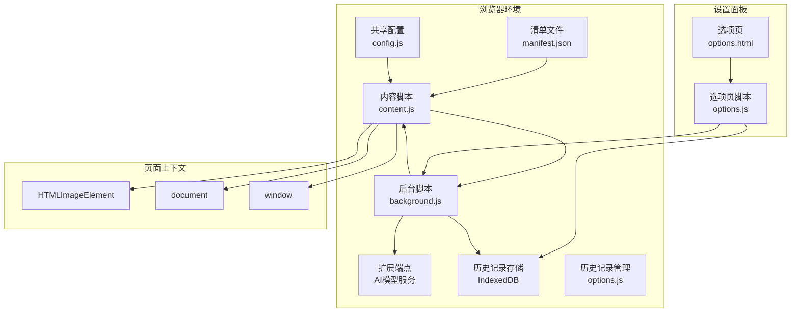
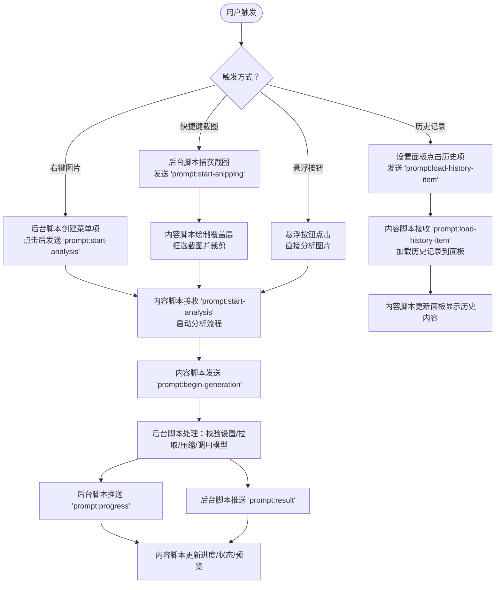
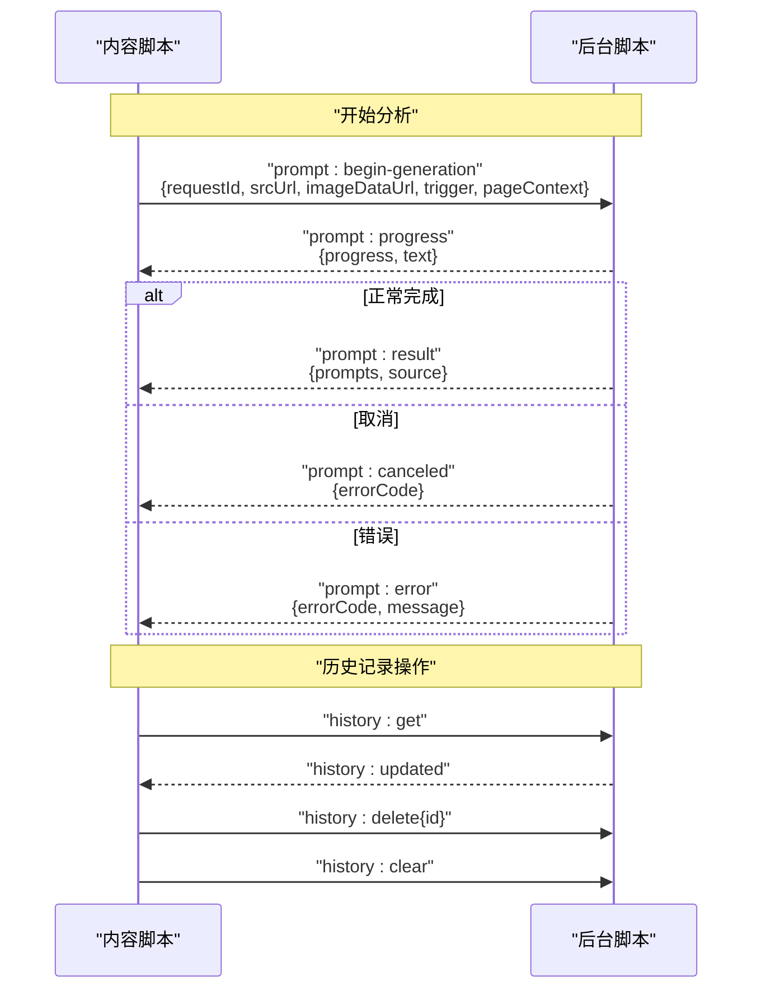
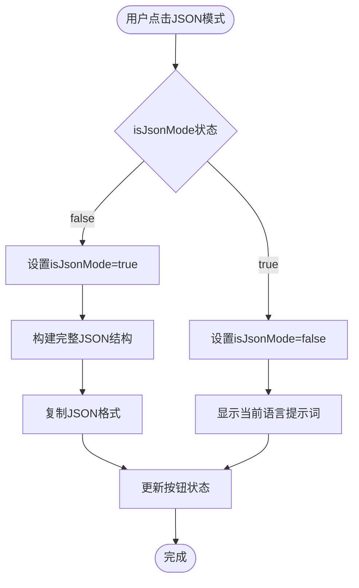
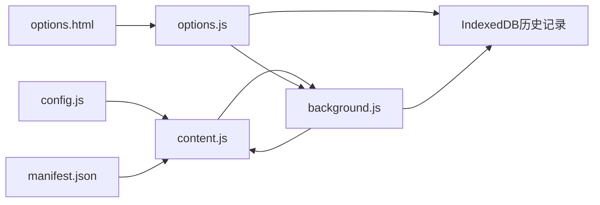

# 内容脚本模块 (content.js)

<cite>
**本文引用的文件**
- [content.js](file://content.js)
- [background.js](file://background.js)
- [config.js](file://config.js)
- [manifest.json](file://manifest.json)
- [options.html](file://options.html)
- [options.js](file://options.js)
</cite>

## 更新摘要
**变更内容**
- 新增 JSON 模式功能，支持结构化提示词显示和编辑
- 增强负向提示词处理能力，支持中文和英文负向提示词
- 新增历史记录功能，支持本地存储和管理生成历史
- 优化 UI 状态管理，改进用户交互体验
- 增强错误处理和用户反馈机制
- 改进文本复制功能，支持 JSON 和简化格式两种模式
- 新增双语言提示词处理逻辑，支持中文和英文双向切换

## 目录
1. [简介](#简介)
2. [项目结构](#项目结构)
3. [核心组件](#核心组件)
4. [架构总览](#架构总览)
5. [详细组件分析](#详细组件分析)
6. [依赖关系分析](#依赖关系分析)
7. [性能考量](#性能考量)
8. [故障排查指南](#故障排查指南)
9. [结论](#结论)
10. [附录](#附录)

## 简介
本文件面向内容脚本模块（content.js），系统化梳理其用户界面交互逻辑、图片分析触发机制、消息传递协议、UI 状态管理与进度条显示、错误信息展示与用户反馈机制，并给出用户体验优化建议与跨浏览器兼容性注意事项。文档以"代码级可视化"为主，辅以流程与时序图，帮助读者快速理解从用户操作到后台推理再到 UI 反馈的完整链路。

**更新** 本版本新增了 JSON 模式和负向提示词支持，显著增强了 AI 响应处理能力和用户界面显示结构化分析结果的功能。同时新增了历史记录功能，支持本地存储和管理用户的生成历史，提供更好的使用体验。

## 项目结构
该扩展采用 Manifest V3 架构，内容脚本在页面生命周期早期注入，负责：
- 监听右键菜单与快捷键触发的图片分析请求
- 在页面中渲染悬浮按钮与分析面板
- 通过消息通道与后台脚本通信，驱动图片获取、压缩与模型推理
- 管理 UI 状态、进度条、错误提示与用户反馈
- **新增** 支持 JSON 模式切换和负向提示词处理
- **新增** 结构化提示词数据的解析和显示
- **新增** 历史记录的本地存储和管理功能



**图表来源**
- [manifest.json:22-26](file://manifest.json#L22-L26)
- [config.js:1-273](file://config.js#L1-L273)
- [content.js:1-1820](file://content.js#L1-L1820)
- [background.js:1-200](file://background.js#L1-L200)
- [options.html:1-687](file://options.html#L1-L687)
- [options.js:1-200](file://options.js#L1-L200)

**章节来源**
- [manifest.json:1-45](file://manifest.json#L1-L45)
- [config.js:1-273](file://config.js#L1-L273)
- [content.js:1-1820](file://content.js#L1-L1820)
- [background.js:1-200](file://background.js#L1-L200)
- [options.html:1-200](file://options.html#L1-L200)
- [options.js:1-200](file://options.js#L1-L200)

## 核心组件
- 用户界面容器与事件绑定
  - 面板根节点与 Shadow DOM 构建、事件绑定与拖拽
  - 悬浮按钮根节点与显示/隐藏策略
- 图片分析触发机制
  - 右键菜单响应（contextMenus）
  - 快捷键截图（commands）与截图裁剪
  - 鼠标悬停图片时的悬浮入口
- 消息传递协议
  - 与后台脚本的消息类型与数据交换
  - 进度回调、结果回传、错误与取消通知
  - **新增** 历史记录加载消息处理
- UI 状态管理
  - 进度条、状态文本、扫描动画、预览图、复制按钮状态
  - 错误信息展示与用户反馈
- 异步与错误处理
  - 扩展上下文失效检测与安全发送
  - 取消生成、超时与网络异常处理
- **新增** JSON模式与负向提示词支持
  - isJsonMode状态变量管理
  - JSON模式切换按钮与UI交互
  - 负向提示词（negative_zh/negative_en）处理逻辑
  - 增强的提示数据结构支持
  - 结构化提示词解析和显示
- **新增** 历史记录管理
  - IndexedDB本地存储机制
  - 历史记录的增删查改操作
  - 与设置面板的历史记录同步

**章节来源**
- [content.js:596-725](file://content.js#L596-L725)
- [content.js:1158-1271](file://content.js#L1158-L1271)
- [content.js:209-247](file://content.js#L209-L247)
- [content.js:1373-1476](file://content.js#L1373-L1476)
- [content.js:56-75](file://content.js#L56-L75)
- [content.js:55-55](file://content.js#L55-L55)
- [content.js:1212-1214](file://content.js#L1212-L1214)
- [content.js:1408-1481](file://content.js#L1408-L1481)
- [content.js:355-363](file://content.js#L355-L363)
- [content.js:390-398](file://content.js#L390-L398)
- [content.js:1408-1481](file://content.js#L1408-L1481)
- [background.js:439-557](file://background.js#L439-L557)

## 架构总览
内容脚本与后台脚本通过 Chrome 扩展消息通道协同工作，内容脚本负责 UI 与用户交互，后台脚本负责网络请求与模型推理。新增的历史记录功能通过 IndexedDB 实现本地存储，与设置面板进行双向同步。

```mermaid
sequenceDiagram
participant User as "用户"
participant CS as "内容脚本<br/>content.js"
participant BG as "后台脚本<br/>background.js"
participant API as "外部模型服务"
participant HIST as "历史记录存储<br/>IndexedDB"
User->>CS : 右键图片/点击悬浮按钮/快捷键截图
CS->>BG : 发送 "prompt : begin-generation"
BG->>BG : 校验设置/拉取图片并压缩
BG->>API : 调用模型接口
API-->>BG : 返回包含结构化提示词的JSON
BG-->>CS : 回传 "prompt : progress"/"prompt : result"
CS->>CS : 更新面板状态/进度/预览/文本
CS->>HIST : 保存历史记录
CS-->>User : 展示结果/复制/停止
User->>OPT : 打开设置面板查看历史
OPT->>HIST : 查询历史记录
HIST-->>OPT : 返回历史数据
OPT-->>User : 显示历史记录列表
```

**图表来源**
- [content.js:249-326](file://content.js#L249-L326)
- [background.js:212-320](file://background.js#L212-L320)
- [background.js:478-666](file://background.js#L478-L666)
- [background.js:439-557](file://background.js#L439-L557)

**章节来源**
- [content.js:249-326](file://content.js#L249-L326)
- [background.js:212-320](file://background.js#L212-L320)
- [background.js:478-666](file://background.js#L478-L666)
- [background.js:439-557](file://background.js#L439-L557)

## 详细组件分析

### 用户界面交互与 DOM 操作
- 面板构建与事件绑定
  - ensurePanel：创建/挂载面板根节点与 Shadow DOM，注入面板 HTML，绑定关闭、拖拽、语言切换、复制、停止等事件
  - bindPanelEvents：注册预览图加载/错误、面板关闭、拖拽、语言切换、文本输入、复制、停止等事件
- 悬浮按钮
  - ensureHoverButton：创建/挂载悬浮按钮根节点与 Shadow DOM，绑定显示/隐藏、点击事件
  - showHoverButtonForImage/updateHoverButtonPosition/hideHoverButton：基于图片可见性与遮挡检测动态定位与显示
- 拖拽与定位
  - startDragging/onDragMove/stopDragging：在面板卡片上启用拖拽，避免与交互控件冲突
- 预览图与扫描动画
  - setPreview/setScannerVisibility：设置预览图与扫描动画开关
- 复制按钮状态
  - setCopyButtonState/resetCopyButton：复制成功后短暂置为"完成"态，自动复原

**章节来源**
- [content.js:596-725](file://content.js#L596-L725)
- [content.js:1273-1346](file://content.js#L1273-L1346)
- [content.js:1158-1271](file://content.js#L1158-L1271)
- [content.js:1501-1567](file://content.js#L1501-L1567)
- [content.js:1439-1499](file://content.js#L1439-L1499)
- [content.js:1454-1476](file://content.js#L1454-L1476)

### 事件监听与用户交互处理
- 右键菜单响应
  - 监听 contextmenu，记录最近一次右键图片，供后续分析使用
- 指针移动与滚动/窗口大小变化
  - 使用节流处理 pointermove，更新悬浮按钮位置
  - 监听 scroll 与 resize，同步悬浮按钮位置
- 设置变更监听
  - 监听 chrome.storage.onChanged，按需更新悬浮按钮显示、面板语言与最大分辨率
- 面板内部交互
  - 语言切换：更新首选语言并持久化；同步按钮激活态与文本区域内容
  - 文本输入：实时更新当前语言下的提示词
  - 复制：写入剪贴板，更新按钮状态与错误提示
  - 停止：向后台发送取消请求
  - **新增** JSON模式切换：通过JSON模式按钮切换显示格式
  - **新增** 负向提示词处理：支持中文和英文负向提示词的显示和编辑
  - **新增** 历史记录加载：通过历史记录面板加载之前的生成结果

**章节来源**
- [content.js:77-97](file://content.js#L77-L97)
- [content.js:99-111](file://content.js#L99-L111)
- [content.js:113-141](file://content.js#L113-L141)
- [content.js:1273-1346](file://content.js#L1273-L1346)
- [content.js:1460-1481](file://content.js#L1460-L1481)

### 图片分析触发机制
- 右键菜单
  - 右键图片时，记录目标图片，后台脚本通过 contextMenus 注入菜单项，点击后向内容脚本发送"开始分析"消息
- 快捷键截图
  - 监听 Alt+S（或 Mac Option+S），后台脚本捕获可见区域截图，向内容脚本发送"开始截图"消息，内容脚本绘制覆盖层并进行框选裁剪，再发起分析
- 悬浮按钮
  - 鼠标悬停图片时显示悬浮按钮，点击后直接分析该图片



**图表来源**
- [background.js:59-72](file://background.js#L59-L72)
- [background.js:74-92](file://background.js#L74-L92)
- [content.js:489-594](file://content.js#L489-L594)
- [content.js:249-326](file://content.js#L249-L326)
- [content.js:421-478](file://content.js#L421-L478)

**章节来源**
- [background.js:59-72](file://background.js#L59-L72)
- [background.js:74-92](file://background.js#L74-L92)
- [content.js:489-594](file://content.js#L489-L594)
- [content.js:249-326](file://content.js#L249-L326)
- [content.js:421-478](file://content.js#L421-L478)

### 消息传递协议与数据交换
- 内容脚本到后台脚本
  - prompt:begin-generation：携带 requestId、srcUrl、imageDataUrl、触发来源与页面上下文
  - prompt:cancel-generation：取消当前请求
  - analytics:track：埋点事件上报
  - **新增** prompt:load-history-item：加载历史记录到面板
- 后台脚本到内容脚本
  - prompt:start-analysis：开始分析（右键菜单）
  - prompt:start-snipping：开始截图（快捷键）
  - prompt:progress：进度推进与状态文本
  - prompt:result：分析完成，返回 prompts 与 source
  - prompt:canceled：请求被取消
  - prompt:error：错误信息与错误码
  - settings:updated：设置变更通知
  - **新增** history:get/history:delete/history:clear：历史记录查询、删除、清空
- 安全发送与上下文失效处理
  - safeSendRuntimeMessage：包装 sendMessage，捕获扩展上下文失效错误并降级处理



**图表来源**
- [content.js:290-317](file://content.js#L290-L317)
- [content.js:220-246](file://content.js#L220-L246)
- [background.js:212-320](file://background.js#L212-L320)
- [background.js:166-185](file://background.js#L166-L185)

**章节来源**
- [content.js:290-317](file://content.js#L290-L317)
- [content.js:220-246](file://content.js#L220-L246)
- [background.js:212-320](file://background.js#L212-L320)
- [background.js:166-185](file://background.js#L166-L185)

### UI 状态管理与进度条显示
- 进度条与状态文本
  - updateProgress：设置进度百分比与状态文本
  - startProgressTimer/stopProgressTimer：定时刷新状态文本中的耗时
  - formatProgressText：附加耗时显示
- 加载与扫描状态
  - setLoadingState：切换加载态与文本域只读
  - setScannerVisibility：显示/隐藏扫描动画
- 面板可见性与内容区
  - setContentVisibility：展开/收起内容区
  - setPreview：设置预览图并处理加载/错误
- 错误与用户反馈
  - setError：显示错误信息
  - showGenerationError/handleError：统一错误处理与 UI 反馈
- 复制按钮
  - setCopyButtonState/resetCopyButton：复制成功后短暂置为"完成"态

**章节来源**
- [content.js:1373-1476](file://content.js#L1373-L1476)
- [content.js:1418-1429](file://content.js#L1418-L1429)
- [content.js:1382-1390](file://content.js#L1382-L1390)
- [content.js:1494-1499](file://content.js#L1494-L1499)
- [content.js:1477-1483](file://content.js#L1477-L1483)
- [content.js:1439-1452](file://content.js#L1439-L1452)
- [content.js:452-487](file://content.js#L452-L487)
- [content.js:1454-1476](file://content.js#L1454-L1476)

### 异步操作与错误处理
- 扩展上下文失效检测
  - isExtensionContextError：识别扩展上下文失效类错误
  - safeSendRuntimeMessage：包装消息发送，避免因上下文失效导致崩溃
- 取消生成
  - cancelActiveGeneration：向后台发送取消请求，必要时停止 UI 计时器
- 错误分类与用户友好提示
  - 后台脚本根据错误类型映射为用户可读消息，内容脚本统一展示

**章节来源**
- [content.js:56-75](file://content.js#L56-L75)
- [content.js:1348-1362](file://content.js#L1348-L1362)
- [background.js:280-317](file://background.js#L280-L317)

### 截图功能集成
- 截图覆盖层与框选
  - startSnipper：创建覆盖层与"洞穿"效果，监听鼠标事件绘制矩形框，计算设备像素比后裁剪
  - 裁剪后以 data URL 形式作为 imageDataUrl 发起分析
- 事件与清理
  - 支持 Esc 取消；裁剪失败时记录日志

**章节来源**
- [content.js:489-594](file://content.js#L489-L594)

### 与设置面板的联动
- 设置变更通知
  - options.js 自动保存设置并发送 "settings:updated"，内容脚本收到后立即更新 UI 语言与悬浮按钮状态
- 面板语言切换
  - 内容脚本在面板中切换语言时，同步更新首选语言并持久化

**章节来源**
- [options.js:387-405](file://options.js#L387-L405)
- [content.js:113-141](file://content.js#L113-L141)
- [content.js:1295-1311](file://content.js#L1295-L1311)

### **新增** JSON模式与负向提示词支持

#### JSON模式状态管理
- isJsonMode状态变量
  - 全局状态变量，控制面板显示格式
  - 初始值为false，表示默认显示简化的提示词格式
- JSON模式切换逻辑
  - 通过JSON模式按钮触发状态切换
  - 切换时更新按钮激活态样式
  - 根据状态决定文本显示格式
  - 在JSON模式下禁用语言切换按钮

#### 负向提示词处理
- 数据结构增强
  - currentPrompts对象现在包含negative字段
  - 支持结构化提示词的负向提示词存储
- 后台脚本集成
  - 后台脚本解析JSON响应时提取负向提示词
  - 支持负向提示词的验证和过滤
- 前端显示逻辑
  - JSON模式下同时显示正面和负向提示词
  - 简化模式下仅显示对应语言的正面提示词
  - 负向提示词在JSON输出中被移除，以避免重复

#### 复制功能增强
- JSON格式复制
  - JSON模式下复制完整的结构化JSON
  - 包含所有视觉分析字段
  - 负向提示词在简化模式下不包含在JSON输出中
- 简化格式复制
  - 简化模式下复制人类可读的提示词文本
  - 支持负向提示词的条件复制

#### 结构化提示词解析
- buildReadableText函数
  - 将结构化提示词转换为人类可读的文本格式
  - 支持嵌套对象的递归处理
  - 生成包含所有视觉分析字段的完整描述
- JSON输入处理
  - 在JSON模式下监听文本输入
  - 实时解析JSON并更新结构化数据
  - 提供错误处理和数据验证



**图表来源**
- [content.js:1460-1481](file://content.js#L1460-L1481)
- [content.js:1427-1458](file://content.js#L1427-L1458)
- [content.js:355-363](file://content.js#L355-L363)

**章节来源**
- [content.js:55-55](file://content.js#L55-L55)
- [content.js:1212-1214](file://content.js#L1212-L1214)
- [content.js:1408-1481](file://content.js#L1408-L1481)
- [content.js:355-363](file://content.js#L355-L363)
- [content.js:390-398](file://content.js#L390-L398)
- [content.js:1427-1458](file://content.js#L1427-L1458)

### 结构化提示词数据处理

#### 数据结构定义
- currentPrompts对象包含以下字段：
  - image_type：图片类型描述
  - aspect_ratio：宽高比
  - background：背景描述
  - subject：主体对象（包含identity、appearance、clothing、posture、position）
  - surrounding_elements：环绕元素
  - composition：构图方式
  - text_content：文字内容
  - style：艺术风格
  - lighting：光线描述
  - color_palette：色彩方案
  - negative：负向提示词
  - parameters：技术参数

#### 处理流程
- 结果处理：handleResult函数解析后台返回的结构化数据
- 显示转换：buildReadableText函数将结构化数据转换为可读文本
- JSON输出：setTextareaValue函数在JSON模式下生成完整JSON
- 输入解析：bindPanelEvents函数在JSON模式下解析用户输入的JSON

**章节来源**
- [content.js:374-415](file://content.js#L374-L415)
- [content.js:58-81](file://content.js#L58-L81)
- [content.js:1652-1679](file://content.js#L1652-L1679)
- [content.js:1476-1498](file://content.js#L1476-L1498)

### **新增** 历史记录管理功能

#### 历史记录存储机制
- IndexedDB本地存储
  - 使用IndexedDB作为历史记录的持久化存储
  - 存储结构包含：id、timestamp、prompts、srcUrl、imageDataUrl、pageUrl、model、trigger
  - 最大历史记录数量限制为50条
- 存储操作
  - saveToHistory：保存生成结果到历史记录
  - getHistory：获取历史记录列表
  - deleteHistoryItem：删除指定历史记录
  - clearHistory：清空所有历史记录

#### 历史记录UI集成
- 设置面板历史记录显示
  - options.html中添加历史记录区域
  - options.js中实现历史记录列表渲染
  - 支持历史记录的复制、删除、清空操作
- 内容脚本历史记录加载
  - handleLoadHistoryItem：处理历史记录加载消息
  - 支持从历史记录直接加载到主面板
  - 自动同步历史记录的预览图和提示词

#### 历史记录数据结构
- 历史记录项包含：
  - id：唯一标识符
  - timestamp：生成时间戳
  - prompts：结构化提示词数据
  - srcUrl/imageDataUrl：图片源信息
  - pageUrl：页面URL
  - model：使用的模型
  - trigger：触发来源

**章节来源**
- [background.js:439-557](file://background.js#L439-L557)
- [options.js:258-476](file://options.js#L258-L476)
- [content.js:421-478](file://content.js#L421-L478)

## 依赖关系分析
- 内容脚本依赖
  - config.js：共享配置（默认设置、UI 文案、错误码与消息映射）
  - manifest.json：声明内容脚本注入顺序与运行时机
- 与后台脚本的耦合
  - 通过消息类型强约定的数据交换
  - 后台脚本负责网络与模型调用，内容脚本负责 UI 与交互
  - **新增** 后台脚本现在处理结构化JSON格式的提示词数据
  - **新增** 后台脚本集成历史记录的IndexedDB存储
- 与设置面板的耦合
  - 通过 chrome.storage 与消息通道实现设置变更的即时同步
  - **新增** 历史记录的双向同步机制



**图表来源**
- [config.js:1-273](file://config.js#L1-L273)
- [manifest.json:22-26](file://manifest.json#L22-L26)
- [content.js:1-55](file://content.js#L1-L55)
- [background.js:1-200](file://background.js#L1-L200)
- [options.html:1-200](file://options.html#L1-L200)
- [options.js:1-200](file://options.js#L1-L200)

**章节来源**
- [config.js:1-273](file://config.js#L1-L273)
- [manifest.json:22-26](file://manifest.json#L22-L26)
- [content.js:1-55](file://content.js#L1-L55)
- [background.js:1-200](file://background.js#L1-L200)
- [options.html:1-200](file://options.html#L1-L200)
- [options.js:1-200](file://options.js#L1-L200)

## 性能考量
- 节流与去抖
  - 对 pointermove 使用节流（100ms），减少频繁计算与重绘
- DOM 操作最小化
  - 通过 Shadow DOM 封装样式与结构，减少全局污染
  - 预览图仅在加载成功后显示，避免闪烁
- 进度刷新
  - 使用定时器按需刷新状态文本中的耗时，避免每帧更新
- 图像处理
  - 最大边长与质量参数在配置中集中管理，便于统一优化
- 取消与清理
  - 取消生成时及时停止计时器与 UI 动画，释放资源
- **新增** JSON模式性能优化
  - JSON模式下仅在切换时重新构建数据结构
  - 复制操作使用缓存的JSON字符串，避免重复序列化
  - 结构化数据解析采用增量更新，避免全量重绘
- **新增** 负向提示词处理优化
  - 负向提示词在JSON输出中被排除，减少数据传输量
  - 提供条件渲染，仅在需要时显示负向提示词
- **新增** 历史记录性能优化
  - IndexedDB存储采用游标遍历，避免一次性加载大量数据
  - 历史记录数量限制为50条，防止内存溢出
  - 历史记录预览采用懒加载，提升列表渲染性能

**章节来源**
- [content.js:99](file://content.js#L99)
- [content.js:1418-1429](file://content.js#L1418-L1429)
- [content.js:1413-1416](file://content.js#L1413-L1416)
- [config.js:5-20](file://config.js#L5-L20)
- [content.js:1460-1481](file://content.js#L1460-L1481)
- [background.js:439-557](file://background.js#L439-L557)

## 故障排查指南
- 扩展上下文失效
  - 现象：消息发送报错，UI 不更新
  - 处理：safeSendRuntimeMessage 已捕获并降级；检查扩展是否被禁用或页面刷新
- 网络/模型错误
  - 现象：面板显示"生成失败"
  - 处理：查看后台脚本错误映射，确认 API Endpoint、Key、模型与温度设置
- 图片无法读取
  - 现象：预览图不显示或报错
  - 处理：检查图片 URL 是否可访问，或尝试降低分辨率设置
- 快捷键无效
  - 现象：按下 Alt+S 无反应
  - 处理：确认后台脚本已创建命令监听，且快捷键未被系统占用
- 悬浮按钮不显示
  - 现象：悬停图片无入口
  - 处理：检查设置中"悬浮 PicPrompt 按钮"开关与图片尺寸阈值
- **新增** JSON模式问题
  - 现象：JSON模式按钮无响应或显示异常
  - 处理：检查isJsonMode状态变量，确认JSON数据结构完整性
- **新增** 负向提示词问题
  - 现象：负向提示词未显示或复制异常
  - 处理：确认后台脚本正确解析JSON响应，检查负向提示词字段存在性
- **新增** 结构化提示词解析问题
  - 现象：JSON输入无效或解析错误
  - 处理：检查JSON格式是否符合结构化提示词规范，确认字段完整性
- **新增** 历史记录问题
  - 现象：历史记录无法显示或保存失败
  - 处理：检查IndexedDB初始化状态，确认浏览器支持IndexedDB，查看控制台错误日志

**章节来源**
- [content.js:56-75](file://content.js#L56-L75)
- [background.js:280-317](file://background.js#L280-L317)
- [background.js:74-92](file://background.js#L74-L92)
- [content.js:1158-1271](file://content.js#L1158-L1271)
- [content.js:1460-1481](file://content.js#L1460-L1481)
- [content.js:355-363](file://content.js#L355-L363)
- [background.js:439-557](file://background.js#L439-L557)

## 结论
content.js 通过清晰的事件分发、消息协议与 UI 状态机，实现了从用户触发到模型推理再到结果呈现的完整闭环。其关键优势在于：
- 事件与 UI 解耦，易于维护与扩展
- 消息协议明确，前后端职责清晰
- 错误处理与用户反馈完善，提升可用性
- 性能优化措施到位，保证流畅体验
- **新增** JSON模式和负向提示词支持，增强了提示词数据的完整性和实用性
- **新增** 结构化提示词处理能力，显著提升了AI响应的质量和用户界面的显示效果
- **新增** 历史记录功能，提供本地存储和管理能力，改善用户体验

**更新** 新增的 JSON 模式、负向提示词支持和历史记录功能显著提升了用户体验，使用户能够获得更精确、更完整的 AI 图像生成提示词，并能够方便地管理和复用之前的生成结果。这些功能的引入体现了从简单提示词到结构化、参数化提示词的发展趋势，为高级用户提供了更强大的工具。

建议持续关注跨浏览器差异与新特性支持，确保在不同环境下稳定运行。

## 附录

### 关键函数与路径参考
- 事件与交互
  - [handleDocumentPointerMove:1158-1190](file://content.js#L1158-L1190)
  - [bindPanelEvents:1273-1346](file://content.js#L1273-L1346)
  - [showHoverButtonForImage/updateHoverButtonPosition/hideHoverButton:1192-1271](file://content.js#L1192-L1271)
- 分析流程
  - [handleStartAnalysis:249-326](file://content.js#L249-L326)
  - [handleResult/handleCanceled/handleError:347-487](file://content.js#L347-L487)
  - [handleLoadHistoryItem:421-478](file://content.js#L421-L478)
  - [startSnipper:489-594](file://content.js#L489-L594)
- 消息与状态
  - [safeSendRuntimeMessage:65-75](file://content.js#L65-L75)
  - [updateProgress/startProgressTimer/stopProgressTimer:1373-1416](file://content.js#L1373-L1416)
  - [setPreview/setScannerVisibility/setContentVisibility:1439-1499](file://content.js#L1439-L1499)
- 设置联动
  - [handleSettingsUpdate:144-163](file://content.js#L144-L163)
  - [updatePanelLanguage:165-207](file://content.js#L165-L207)
- **新增** JSON模式与负向提示词
  - [isJsonMode状态变量:55-55](file://content.js#L55-L55)
  - [JSON模式切换按钮:1212-1214](file://content.js#L1212-L1214)
  - [JSON模式切换逻辑:1460-1481](file://content.js#L1460-L1481)
  - [负向提示词处理:355-363](file://content.js#L355-L363)
  - [负向提示词复制:1427-1458](file://content.js#L1427-L1458)
  - [结构化提示词解析:58-81](file://content.js#L58-L81)
  - [JSON输入处理:1476-1498](file://content.js#L1476-L1498)
  - [JSON输出生成:1652-1679](file://content.js#L1652-L1679)
- **新增** 历史记录管理
  - [saveToHistory/getHistory/deleteHistoryItem/clearHistory:439-557](file://background.js#L439-L557)
  - [loadHistory/renderHistory/createHistoryItem:258-476](file://options.js#L258-L476)
  - [handleLoadHistoryItem:421-478](file://content.js#L421-L478)