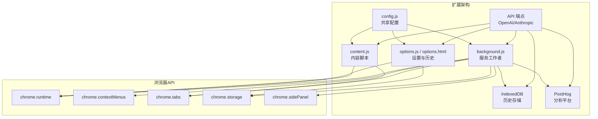
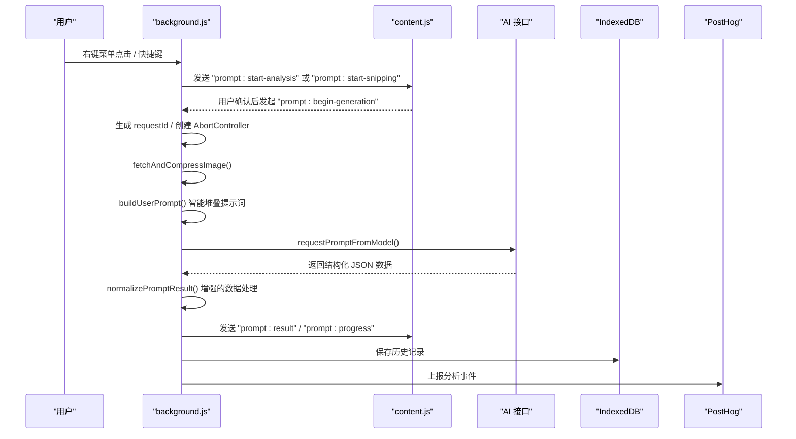
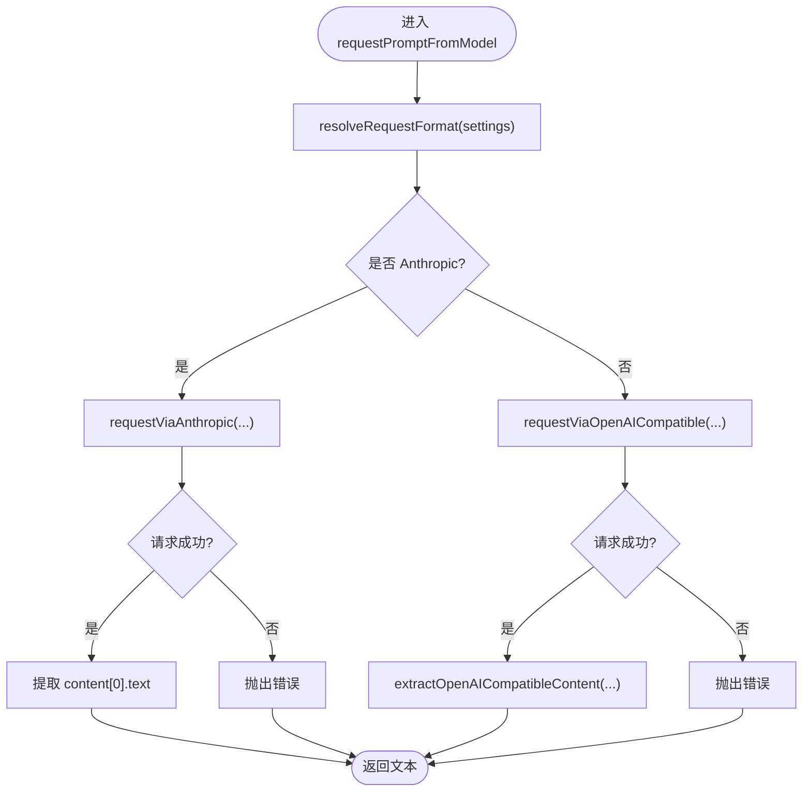
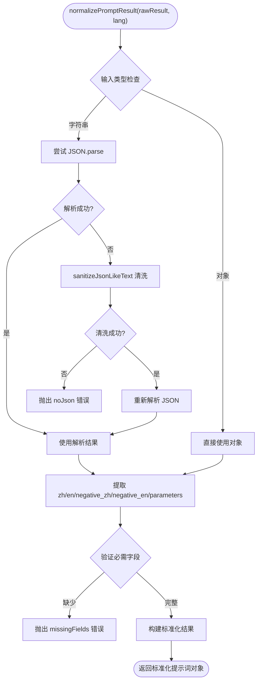
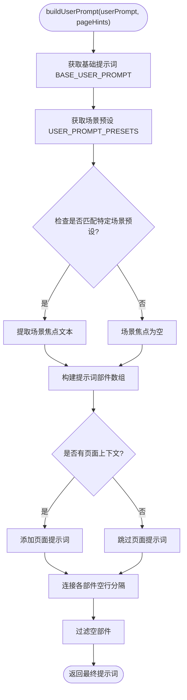
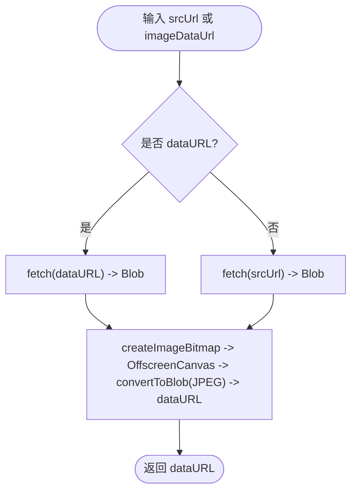
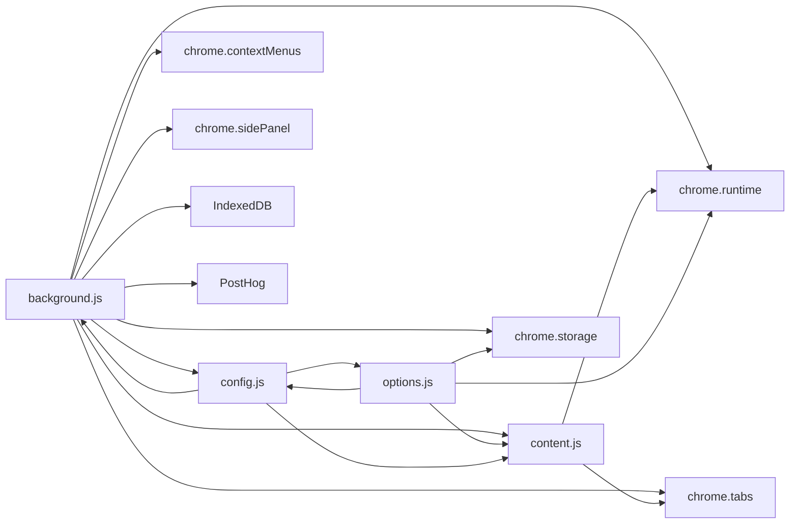

# 后台服务模块 (background.js)

<cite>
**本文引用的文件**
- [background.js](file://background.js)
- [config.js](file://config.js)
- [content.js](file://content.js)
- [manifest.json](file://manifest.json)
- [options.js](file://options.js)
- [options.html](file://options.html)
</cite>

## 更新摘要
**变更内容**
- 增强 normalizePromptResult 函数，新增对 negative_zh、negative_en 和 parameters 字段的支持
- 实现完整的结构化提示数据处理，支持多语言正面提示词、负面提示词和参数对象
- 优化提示词数据的标准化和归一化流程

## 目录
1. [简介](#简介)
2. [项目结构](#项目结构)
3. [核心组件](#核心组件)
4. [架构总览](#架构总览)
5. [详细组件分析](#详细组件分析)
6. [依赖关系分析](#依赖关系分析)
7. [性能考量](#性能考量)
8. [故障排查指南](#故障排查指南)
9. [结论](#结论)
10. [附录](#附录)

## 简介
本文件面向后台服务模块 background.js 的深度技术文档，聚焦以下主题：
- 服务工作者架构下的扩展初始化与右键菜单注册流程
- 截图捕获与"框选截图"工作流
- 消息通信处理机制（与内容脚本 content.js 的双向通信）
- AI 模型调用流程（OpenAI 兼容接口与 Anthropic Claude 接口的实现差异）
- 图片处理与压缩逻辑（Base64 编码、尺寸调整、格式转换）
- 异步请求管理、超时控制与错误分类处理
- IndexedDB 历史存储系统与 PostHog 分析集成
- 性能优化建议与最佳实践
- **新增** 增强的结构化提示数据处理（normalizePromptResult 函数）

## 项目结构
该扩展采用 Manifest V3 服务工作者架构，核心文件如下：
- manifest.json：声明服务工作者脚本、权限、命令、侧边栏等
- background.js：服务工作者后台脚本，负责初始化、消息路由、AI 调用、图片压缩、IndexedDB 历史存储与分析事件
- content.js：内容脚本，负责 UI 面板渲染、用户交互、进度反馈、与后台通信
- config.js：共享配置（默认设置、UI 文案、错误码、分析上报配置）
- options.js / options.html：设置面板与历史记录 UI，负责用户参数持久化与可视化

**图表来源**
- [manifest.json:10-11](file://manifest.json#L10-L11)
- [background.js:19-57](file://background.js#L19-L57)
- [content.js:209-247](file://content.js#L209-L247)
- [options.js:182-216](file://options.js#L182-L216)

**章节来源**
- [manifest.json:1-45](file://manifest.json#L1-L45)
- [background.js:1-184](file://background.js#L1-L184)
- [content.js:1-163](file://content.js#L1-L163)
- [config.js:1-253](file://config.js#L1-L253)
- [options.js:1-216](file://options.js#L1-L216)
- [options.html:1-687](file://options.html#L1-L687)

## 核心组件
- 服务工作者初始化与右键菜单注册
  - onInstalled 回调中创建右键菜单项、设置侧边栏行为、初始化默认设置、上报安装/更新事件
- 截图捕获与"框选截图"
  - 命令触发后抓取可见区域 PNG，向内容脚本发送"开始框选"消息
- 消息通信处理
  - 统一监听 runtime.onMessage，分发至对应处理分支（分析、选项、取消、历史、设置更新、分析事件上报）
- AI 模型调用
  - 自动识别请求格式（OpenAI 兼容或 Anthropic），构造请求体，处理响应与错误
- 图片处理与压缩
  - 支持从 URL 或 dataURL 获取图片，统一压缩为 JPEG，限制最大边长，返回 dataURL
- 错误分类与用户提示
  - 将底层错误映射为统一错误码，结合 UI 文案输出用户友好信息
- IndexedDB 历史记录与分析事件
  - IndexedDB 存储历史记录，支持查询、删除、清空；通过 PostHog 上报分析事件
- **新增** 增强的结构化提示数据处理
  - normalizePromptResult 函数支持完整的结构化提示数据，包括 zh/en 正面提示词、negative_zh/negative_en 负面提示词、parameters 参数对象

**章节来源**
- [background.js:19-57](file://background.js#L19-L57)
- [background.js:74-92](file://background.js#L74-L92)
- [background.js:94-184](file://background.js#L94-L184)
- [background.js:212-320](file://background.js#L212-L320)
- [background.js:478-503](file://background.js#L478-L503)
- [background.js:517-666](file://background.js#L517-L666)
- [background.js:775-849](file://background.js#L775-L849)
- [background.js:872-945](file://background.js#L872-L945)
- [background.js:412-463](file://background.js#L412-L463)
- [background.js:639-666](file://background.js#L639-L666)

## 架构总览
后台服务作为服务工作者，承担以下职责：
- 生命周期与初始化：注册右键菜单、侧边栏行为、默认设置与分析事件
- 用户触发：右键菜单、快捷键命令、内容脚本发起的分析请求
- 数据处理：图片获取与压缩、请求格式判定、模型调用、结果规范化
- 通信协调：向内容脚本推送进度与结果，接收取消与设置更新
- 存储与分析：IndexedDB 历史记录管理、PostHog 分析事件上报
- **新增** 结构化提示数据处理：增强 normalizePromptResult 函数，支持完整的结构化提示数据格式

**图表来源**
- [background.js:59-72](file://background.js#L59-L72)
- [background.js:74-92](file://background.js#L74-L92)
- [background.js:174-182](file://background.js#L174-L182)
- [background.js:212-320](file://background.js#L212-L320)
- [background.js:478-503](file://background.js#L478-L503)
- [background.js:695-726](file://background.js#L695-L726)
- [background.js:412-430](file://background.js#L412-L430)

## 详细组件分析

### 服务工作者架构与初始化
- 服务工作者注册
  - manifest.json 中声明 service_worker: "background.js"
  - 支持 Manifest V3 的现代扩展架构
- 初始化流程
  - onInstalled 回调中创建右键菜单项（上下文为图片）、设置侧边栏行为、合并默认设置、安装/更新事件上报
  - 初始化 IndexedDB 历史存储系统
- 右键菜单点击
  - 触发后生成 requestId，向当前标签页发送"开始分析"消息，携带图片源地址与页面上下文
- 快捷键命令
  - 捕获可见区域 PNG，向内容脚本发送"开始框选"消息，由内容脚本实现框选与裁剪

**章节来源**
- [background.js:19-57](file://background.js#L19-L57)
- [background.js:59-72](file://background.js#L59-L72)
- [background.js:74-92](file://background.js#L74-L92)

### 截图捕获与"框选截图"工作流
- 截图捕获
  - 使用 tabs.captureVisibleTab 获取 PNG，向内容脚本传递 dataURL，触发"开始框选"
- 框选截图
  - 内容脚本绘制覆盖层，计算选区坐标，基于原始 dataURL 在 Canvas 上按设备像素比裁剪，导出 JPEG dataURL，再交由后台进行分析

**章节来源**
- [background.js:83-92](file://background.js#L83-L92)
- [content.js:489-594](file://content.js#L489-L594)

### 消息通信处理机制
- 统一消息监听
  - 处理分析、选项、取消、历史、设置更新、分析事件上报等类型
- 进度与结果推送
  - 通过 sendProgress/sendTabMessage 向内容脚本推送阶段进度与最终结果
- 设置更新广播
  - 当设置变更时，向所有标签页广播 settings:updated，确保 UI 即时同步

**章节来源**
- [background.js:94-184](file://background.js#L94-L184)
- [background.js:851-870](file://background.js#L851-L870)
- [background.js:134-147](file://background.js#L134-L147)

### AI 模型调用流程（OpenAI 兼容与 Anthropic Claude）
- 请求格式判定
  - 若显式指定 requestFormat 则按其执行；否则根据模型名前缀自动判定（claude 开头走 Anthropic）
- OpenAI 兼容接口
  - 构造 messages 数组，包含 system prompt 与 user 内容（文本 + image_url），发送 POST 请求
  - 对 401/403/429/408/5xx 等状态码提供具体错误提示
  - 解析响应，提取 choices[0].message.content
- Anthropic Claude 接口
  - 将 endpoint 规范化为 /messages，校验 imageInput 是否为可安全读取的 dataURL（base64）
  - 构造 messages，其中 image 以 source.type/base64/data 形式传输
  - 提取 content[0].text 作为结果
- 特殊模型限制
  - 对 DeepSeek 模型明确提示不支持当前图片输入格式

**图表来源**
- [background.js:478-503](file://background.js#L478-L503)
- [background.js:505-515](file://background.js#L505-L515)
- [background.js:517-592](file://background.js#L517-L592)
- [background.js:594-666](file://background.js#L594-L666)
- [background.js:728-753](file://background.js#L728-L753)

**章节来源**
- [background.js:478-503](file://background.js#L478-L503)
- [background.js:505-515](file://background.js#L505-L515)
- [background.js:517-592](file://background.js#L517-L592)
- [background.js:594-666](file://background.js#L594-L666)
- [background.js:728-753](file://background.js#L728-L753)

### 增强的结构化提示数据处理（normalizePromptResult 函数）
- **更新** 增强的数据处理机制
  - 支持完整的结构化提示数据格式，包括 zh/en 正面提示词、negative_zh/negative_en 负面提示词、parameters 参数对象
  - 实现智能 JSON 解析和数据清洗，支持 Markdown 代码块和普通 JSON 格式
  - 提供完善的字段验证和默认值处理
- 处理流程
  - 检测输入类型，如果是字符串则尝试解析为 JSON
  - 使用 sanitizeJsonLikeText 清洗可能包含 Markdown 代码块的 JSON 文本
  - 提取 zh、en、negative_zh、negative_en、parameters 字段
  - 验证必需字段，确保至少存在 zh 或 en
  - 构建标准化的提示词对象，提供互备机制（zh/en 互备）
- 与 UI 面板的协同
  - content.js 中同样实现了相同的结构化数据处理逻辑
  - 支持多语言界面的提示词显示和编辑
  - 提供参数对象的可视化展示和编辑功能

**图表来源**
- [background.js:846-883](file://background.js#L846-L883)
- [background.js:912-930](file://background.js#L912-L930)

**章节来源**
- [background.js:846-883](file://background.js#L846-L883)
- [background.js:912-930](file://background.js#L912-L930)
- [content.js:355-363](file://content.js#L355-L363)

### 智能提示词堆叠逻辑（buildUserPrompt 函数）
- **新增** 智能堆叠机制
  - 基于 ImgPromptConfig.BASE_USER_PROMPT 和 ImgPromptConfig.USER_PROMPT_PRESETS 实现
  - 支持基础提示词与场景预设的智能组合
  - 自动检测用户选择的特定场景预设，避免重复添加通用场景
- 构建流程
  - 从配置中获取基础提示词和预设集合
  - 检查用户提示词是否匹配特定场景预设（排除 general 场景）
  - 构建最终提示词：基础提示词 + 场景焦点（如有） + 页面上下文
  - 使用空行分隔各部分，确保格式清晰
- 与 UI 面板的协同
  - options.js 中也实现了类似的智能堆叠逻辑，确保前后端一致性
  - 支port 用户自定义场景模板的智能识别与激活

**图表来源**
- [background.js:639-666](file://background.js#L639-L666)
- [options.js:42-56](file://options.js#L42-L56)

**章节来源**
- [background.js:639-666](file://background.js#L639-L666)
- [config.js:5-38](file://config.js#L5-L38)
- [options.js:42-56](file://options.js#L42-L56)

### 图片处理与压缩逻辑（Base64、尺寸调整、格式转换）
- 输入来源
  - 支持 srcUrl（远程图片）或 imageDataUrl（dataURL）
- 统一处理路径
  - 若为 dataURL：直接解码为 Blob 并压缩
  - 若为远程 URL：fetch 获取 Blob，随后压缩
- 压缩策略
  - 计算最大边比例，按比例缩放至目标尺寸
  - 使用 OffscreenCanvas 绘制，convertToBlob 输出 JPEG，质量约 0.92
  - 最终转换为 dataURL 返回
- 输出约定
  - 返回 dataURL，供模型调用使用

**图表来源**
- [background.js:775-807](file://background.js#L775-L807)
- [background.js:809-813](file://background.js#L809-L813)
- [background.js:815-849](file://background.js#L815-L849)

**章节来源**
- [background.js:775-849](file://background.js#L775-L849)

### 异步请求管理、超时控制与错误处理
- 请求管理
  - 使用 AbortController 为每个生成请求创建信号，支持取消
  - activeRequests Map 记录进行中的请求，便于取消
- 超时控制
  - fetch 请求通过 AbortSignal 传入，若外部中断则视为取消
- 错误分类
  - classifyError 将底层错误映射为统一错误码（网络、图片获取/处理、鉴权、限流、超时、JSON 解析、缺失字段、未知）
- 用户提示
  - getUserErrorMessage 根据语言与错误码返回用户友好文案
- 分析事件
  - 成功/失败/取消均会上报分析事件，包含触发来源、模型、耗时、错误码等

**章节来源**
- [background.js:17-17](file://background.js#L17-L17)
- [background.js:122-132](file://background.js#L122-L132)
- [background.js:280-319](file://background.js#L280-L319)
- [background.js:872-945](file://background.js#L872-L945)
- [background.js:359-410](file://background.js#L359-L410)

### IndexedDB 历史存储系统
- 数据库初始化
  - 使用 IndexedDB API 创建 ImgPromptDB 数据库
  - 创建 history 对象存储，包含 id 主键和 timestamp 索引
- 历史记录管理
  - saveToHistory：保存生成记录，包含 prompts、srcUrl、imageDataUrl、pageUrl、model、trigger
  - getHistory：按时间倒序获取历史记录，限制最多 50 条
  - deleteHistoryItem：删除指定历史记录
  - clearHistory：清空所有历史记录
- 性能优化
  - 使用事务批量操作，避免重复查询
  - 自动清理超出限制的历史记录

**章节来源**
- [background.js:439-557](file://background.js#L439-L557)
- [background.js:559-585](file://background.js#L559-L585)

### PostHog 分析集成
- 配置与初始化
  - 从 config.js 加载 POSTHOG_PROJECT_KEY 和 POSTHOG_HOST
  - 支持客户端 ID 生成与持久化
- 事件跟踪
  - safeTrackAnalyticsEvent：安全的分析事件跟踪，自动处理异常
  - trackAnalyticsEvent：直接调用 PostHog API 发送事件
  - buildAnalyticsContext：构建页面上下文信息（host、protocol）
- 事件类型
  - extension_installed：扩展安装事件
  - extension_updated：扩展更新事件
  - generation_started：生成开始事件
  - generation_succeeded：生成成功事件
  - generation_failed：生成失败事件
  - generation_canceled：生成取消事件

**章节来源**
- [background.js:386-437](file://background.js#L386-L437)
- [background.js:370-384](file://background.js#L370-L384)
- [config.js:249-251](file://config.js#L249-L251)

### 关键函数实现模式示例（代码片段路径）
- processGeneration
  - 作用：协调整个生成流程，包括设置加载、图片压缩、模型调用、结果归一化、进度推送、历史保存与分析事件上报
  - 示例路径：[processGeneration:236-347](file://background.js#L236-L347)
- requestPromptFromModel
  - 作用：根据设置决定调用 OpenAI 兼容或 Anthropic 接口
  - 示例路径：[requestPromptFromModel:600-625](file://background.js#L600-L625)
- requestViaOpenAICompatible
  - 作用：构造 OpenAI 兼容请求体，发送并解析响应
  - 示例路径：[requestViaOpenAICompatible:639-714](file://background.js#L639-L714)
- requestViaAnthropic
  - 作用：构造 Anthropic 请求体，发送并解析响应
  - 示例路径：[requestViaAnthropic:716-788](file://background.js#L716-L788)
- fetchAndCompressImage
  - 作用：统一获取与压缩图片，返回 dataURL
  - 示例路径：[fetchAndCompressImage:897-929](file://background.js#L897-L929)
- **更新** normalizePromptResult
  - 作用：增强的结构化提示数据处理，支持完整的多语言提示词和参数对象
  - 示例路径：[normalizePromptResult:846-883](file://background.js#L846-L883)
- **新增** buildUserPrompt
  - 作用：实现智能提示词堆叠逻辑，替代简单字符串拼接
  - 示例路径：[buildUserPrompt:639-666](file://background.js#L639-L666)

**章节来源**
- [background.js:236-347](file://background.js#L236-L347)
- [background.js:600-625](file://background.js#L600-L625)
- [background.js:639-714](file://background.js#L639-L714)
- [background.js:716-788](file://background.js#L716-L788)
- [background.js:897-929](file://background.js#L897-L929)
- [background.js:846-883](file://background.js#L846-L883)
- [background.js:639-666](file://background.js#L639-L666)

## 依赖关系分析
- 配置依赖
  - config.js 提供默认设置、UI 文案、错误码、分析上报配置，被 background.js、content.js、options.js 共享
  - **新增** config.js 中的 BASE_USER_PROMPT 和 USER_PROMPT_PRESETS 为 buildUserPrompt 提供基础配置
  - **新增** config.js 中的系统提示词模板包含完整的结构化提示数据格式定义
- 权限与 API
  - manifest.json 声明 contextMenus、storage、sidePanel、activeTab 权限，支持右键菜单、本地存储、侧边栏与活动标签页操作
- 模块耦合
  - background.js 与 content.js 通过消息通道强耦合，但职责清晰：前者负责后台逻辑与模型调用，后者负责 UI 与用户交互
  - options.js 与 options.html 通过 chrome.storage 与 runtime 通信，负责设置持久化与历史记录展示
  - **新增** options.js 与 background.js 在提示词构建逻辑上保持一致性
  - **新增** content.js 与 background.js 在结构化提示数据处理上保持完全一致

**图表来源**
- [manifest.json:38-41](file://manifest.json#L38-L41)
- [background.js:1-12](file://background.js#L1-L12)
- [content.js:1-4](file://content.js#L1-L4)
- [options.js:1-7](file://options.js#L1-L7)

**章节来源**
- [manifest.json:1-45](file://manifest.json#L1-L45)
- [background.js:1-12](file://background.js#L1-L12)
- [content.js:1-4](file://content.js#L1-L4)
- [options.js:1-7](file://options.js#L1-L7)

## 性能考量
- 图片压缩
  - 通过 OffscreenCanvas 与 convertToBlob 减少主线程阻塞；JPEG 质量约 0.92，在保证视觉质量的同时显著降低体积
  - 建议根据网络状况与模型接口限制，合理设置 maxImageEdge（默认 1024）
- 请求并发与取消
  - 使用 AbortController 精确控制请求生命周期，避免资源泄漏
  - activeRequests Map 便于集中管理与清理
- 错误快速失败
  - 对 401/403/429/408/5xx 等状态码提供即时用户提示，减少无效重试
- 分析事件上报
  - 仅在启用分析且具备密钥与主机时才上报，避免不必要的网络开销
- IndexedDB 优化
  - 使用事务批量操作，避免重复查询
  - 自动清理超出限制的历史记录，保持数据库大小可控
- **新增** 增强的结构化数据处理
  - normalizePromptResult 函数提供高效的 JSON 解析和数据清洗
  - 支持多种 JSON 格式输入，包括 Markdown 代码块包装
  - 提供完善的字段验证和错误处理机制
- **新增** 智能提示词堆叠
  - buildUserPrompt 函数避免了重复的基础提示词，减少了请求体大小
  - 支持场景预设的智能识别，提高 AI 生成的针对性和准确性

## 故障排查指南
- 常见错误与定位
  - 网络错误：检查网络连通性与代理设置
  - 图片获取失败：确认图片 URL 可访问、非跨域、内容类型为 image/*
  - 图片处理失败：确认图片可安全读取（dataURL base64 格式正确）
  - 鉴权失败：核对 API Key 与权限范围
  - 限流：降低请求频率或提升配额
  - 超时：降低 maxImageEdge 或改善网络环境
  - JSON 解析失败：调整 system prompt，确保输出纯 JSON
  - 缺失字段：确保返回包含 zh/en 字段
  - **新增** 结构化数据处理错误：检查 JSON 格式是否符合规范，确认包含必要的字段
  - IndexedDB 错误：检查浏览器存储权限与数据库版本兼容性
  - PostHog 集成失败：验证项目密钥与主机配置
  - **新增** 提示词构建错误：检查 BASE_USER_PROMPT 和 USER_PROMPT_PRESETS 配置是否正确
- 用户提示映射
  - 使用错误码映射到 UI 文案，便于快速定位问题类别
- 取消与重试
  - 通过 cancel-generation 消息主动取消；必要时重新发起分析

**章节来源**
- [background.js:872-945](file://background.js#L872-L945)
- [config.js:206-247](file://config.js#L206-L247)

## 结论
background.js 以清晰的服务工作者架构与职责分离实现了完整的图片提示词生成链路：从扩展初始化、右键菜单与快捷键触发，到图片获取与压缩、AI 模型调用、结果归一化与 UI 推送，再到 IndexedDB 历史记录与 PostHog 分析事件上报。其错误分类与用户提示机制提升了用户体验，而统一的图片处理与请求管理保障了稳定性与性能。

**最新更新** 增强的 normalizePromptResult 函数实现了完整的结构化提示数据处理，支持 zh/en 正面提示词、negative_zh/negative_en 负面提示词和 parameters 参数对象的标准化处理。该函数提供了智能 JSON 解析、数据清洗和字段验证功能，显著提升了提示词数据的完整性和可用性。同时，content.js 中也实现了相同的结构化数据处理逻辑，确保前后端的一致性和数据完整性。

新增的 IndexedDB 存储系统提供了可靠的本地数据持久化，PostHog 集成增强了产品分析能力。建议在生产环境中持续监控分析事件与错误分布，动态调整 maxImageEdge 与模型参数，以获得更优的吞吐与成功率。

## 附录
- 设置面板与历史记录
  - options.js 负责表单持久化、预设模板管理、历史记录渲染与复制/删除/清空操作
  - options.html 提供 UI 布局与样式，支持多语言切换
- 侧边栏与悬浮按钮
  - background.js 通过 sidePanel API 控制侧边栏行为；content.js 实现悬浮按钮与主面板 UI
- **新增** 结构化提示数据格式
  - config.js 中的系统提示词模板定义了完整的结构化提示数据格式
  - 支持多语言提示词、负面提示词和参数对象的标准化输出
- **新增** 提示词配置
  - config.js 中的 BASE_USER_PROMPT 提供基础提示词模板
  - USER_PROMPT_PRESETS 提供多种场景预设，支持智能堆叠逻辑

**章节来源**
- [options.js:182-551](file://options.js#L182-L551)
- [options.html:1-687](file://options.html#L1-687)
- [content.js:102-163](file://content.js#L102-L163)
- [config.js:5-38](file://config.js#L5-L38)
- [config.js:19-24](file://config.js#L19-L24)