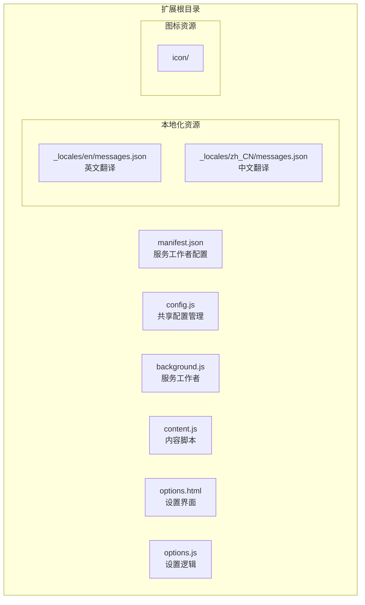
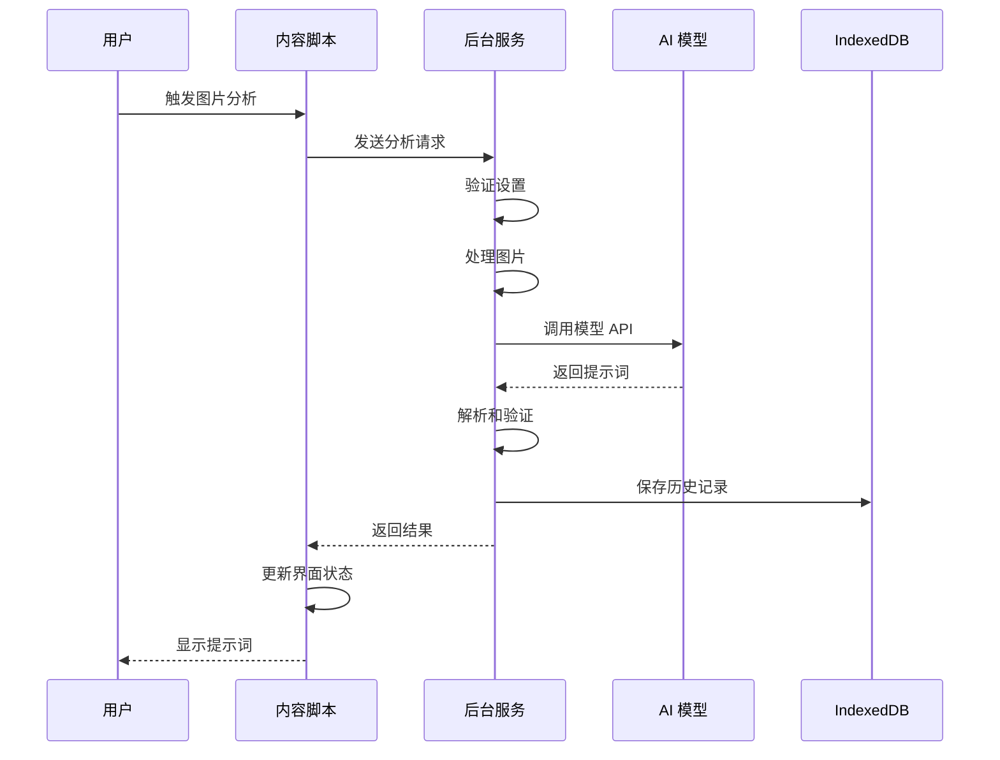
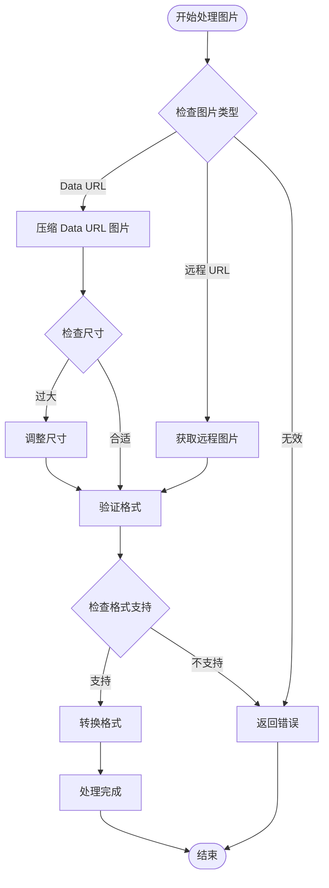
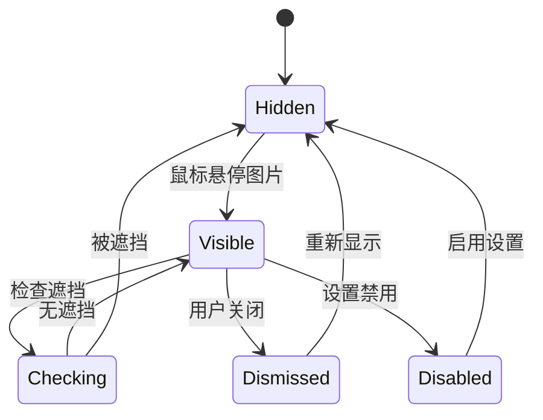
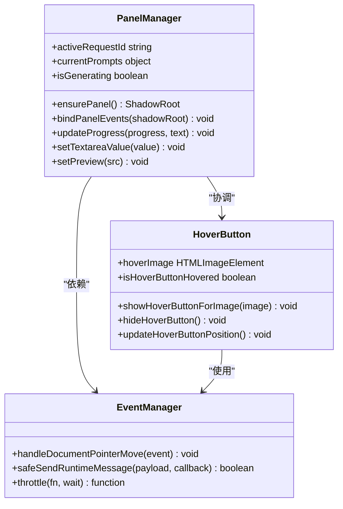
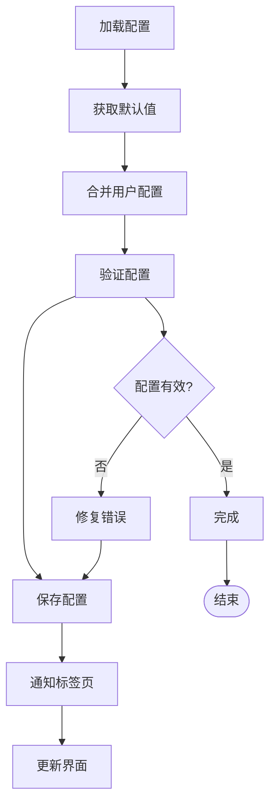
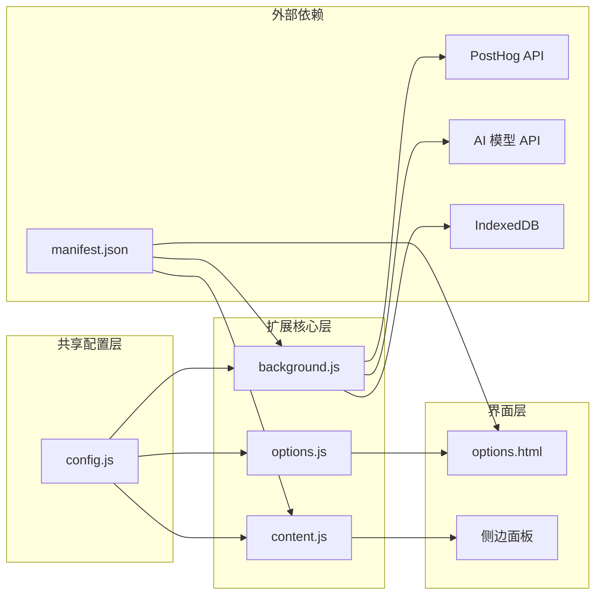
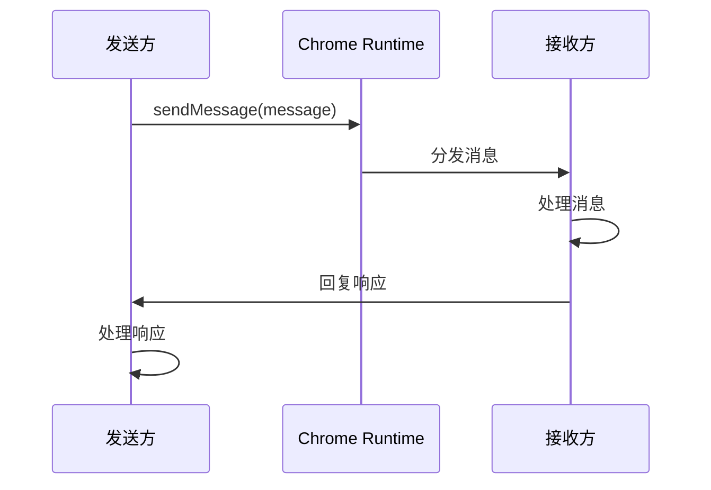

# 核心模块分析

<cite>
**本文档引用的文件**
- [background.js](file://background.js)
- [content.js](file://content.js)
- [config.js](file://config.js)
- [manifest.json](file://manifest.json)
- [options.js](file://options.js)
- [options.html](file://options.html)
</cite>

## 更新摘要
**变更内容**
- 更新以反映现有模块架构：保留了完整的AI模型调用、图片处理和状态管理功能
- 增强模块化设计和配置管理机制的详细分析
- 新增侧边面板和现代化界面设计的技术实现
- 改进的错误处理和用户反馈系统
- 增强的安全措施和本地存储机制

## 目录
1. [简介](#简介)
2. [项目结构](#项目结构)
3. [核心组件](#核心组件)
4. [架构概览](#架构概览)
5. [详细组件分析](#详细组件分析)
6. [依赖关系分析](#依赖关系分析)
7. [性能考虑](#性能考虑)
8. [故障排除指南](#故障排除指南)
9. [结论](#结论)

## 简介

ImgPrompt 是一个现代化的 Chrome 扩展程序，能够将图片转换为 AI 提示词。该扩展通过服务工作线程与内容脚本的协作，实现了完整的图片分析和提示词生成功能。系统采用模块化设计，包含配置管理、AI 模型调用、图片处理和状态管理等多个核心模块，并具备现代化的安全措施和用户体验优化。

## 项目结构

项目采用标准的 Chrome 扩展目录结构，通过服务工作者模式实现现代化架构：



**图表来源**
- [manifest.json:10-26](file://manifest.json#L10-L26)
- [config.js:1-253](file://config.js#L1-L253)

**章节来源**
- [manifest.json:1-45](file://manifest.json#L1-L45)

## 核心组件

### 配置管理模块 (config.js)

配置管理模块是整个系统的核心基础，提供了统一的配置管理和国际化支持：

- **默认设置管理**：定义了所有可配置参数的默认值，包括 API 端点、模型名称、提示词模板等
- **国际化字符串**：支持中英文双语界面，包含完整的 UI 文本和错误消息
- **错误码定义**：标准化的错误分类和处理，涵盖网络、图片处理、API 调用等各类错误
- **分析配置**：PostHog 分析服务的配置信息，支持用户行为追踪
- **用户提示词预设**：提供多种场景的预设提示词模板，包括摄影、CG、平面设计等

### 后台服务模块 (background.js)

后台服务模块运行在服务工作线程环境中，负责扩展的核心功能：

- **扩展生命周期管理**：处理安装、更新事件，初始化客户端 ID 和侧边面板行为
- **AI 模型调用**：统一的 API 调用接口，支持 OpenAI 兼容和 Anthropic Claude 模型
- **图片处理**：图片压缩、格式转换、Data URL 处理，支持远程图片获取
- **状态管理**：请求状态跟踪、历史记录管理，使用 IndexedDB 进行持久化存储
- **分析统计**：用户行为追踪和统计，支持可选的分析服务启用
- **请求取消**：支持中断长时间运行的操作，提供优雅的错误处理

### 内容脚本模块 (content.js)

内容脚本模块运行在网页上下文中，负责用户界面交互：

- **用户界面交互**：悬浮按钮、侧边面板的创建和管理，支持拖拽和动画效果
- **事件处理**：鼠标移动、点击、键盘事件，提供流畅的用户体验
- **DOM 操作**：动态创建和更新页面元素，使用 Shadow DOM 实现隔离
- **用户体验优化**：拖拽、动画、进度显示，支持多语言界面
- **截图工具**：内置截图功能，支持框选区域分析

## 架构概览

系统采用现代化的分层架构设计，通过服务工作者模式实现模块间通信：

```mermaid
graph TB
subgraph "Chrome 扩展层"
Manifest[manifest.json<br/>权限声明]
Permissions[contextMenus, storage, sidePanel, activeTab]
end
subgraph "服务工作线程层"
Background[background.js<br/>服务工作者]
Config[config.js<br/>共享配置]
DB[IndexedDB<br/>历史记录存储]
end
subgraph "内容脚本层"
Content[content.js<br/>用户界面]
Options[options.js<br/>设置管理]
End
subgraph "网页环境"
Panel[侧边面板<br/>Shadow DOM]
HoverBtn[悬浮按钮<br/>Shadow DOM]
Preview[图片预览<br/>Canvas]
Snipping[截图工具<br/>Overlay]
end
subgraph "外部服务"
AIModel[AI 模型 API<br/>OpenAI/Anthropic]
PostHog[分析服务<br/>可选]
end
Manifest --> Background
Manifest --> Content
Background --> AIModel
Background --> PostHog
Background --> DB
Content --> Panel
Content --> HoverBtn
Content --> Preview
Content --> Snipping
Options --> Background
```

**图表来源**
- [manifest.json:10-26](file://manifest.json#L10-L26)
- [background.js:1-50](file://background.js#L1-L50)
- [content.js:1-50](file://content.js#L1-L50)

## 详细组件分析

### AI 模型调用流程

AI 模型调用是系统的核心功能，涉及多个步骤的复杂处理：



**图表来源**
- [background.js:212-320](file://background.js#L212-L320)
- [content.js:249-326](file://content.js#L249-L326)

#### 图片处理算法

图片处理模块实现了高效的图片压缩和格式转换：



**图表来源**
- [background.js:775-800](file://background.js#L775-L800)
- [content.js:489-594](file://content.js#L489-L594)

**章节来源**
- [background.js:212-320](file://background.js#L212-L320)
- [background.js:775-800](file://background.js#L775-L800)

### 用户界面交互逻辑

内容脚本模块实现了丰富的用户界面交互：

#### 悬浮按钮系统

悬浮按钮系统提供了便捷的图片分析入口：



**图表来源**
- [content.js:1158-1263](file://content.js#L1158-L1263)

#### 侧边面板管理

侧边面板提供了完整的提示词编辑和管理功能：



**图表来源**
- [content.js:596-620](file://content.js#L596-L620)
- [content.js:1192-1243](file://content.js#L1192-L1243)
- [content.js:1273-1346](file://content.js#L1273-L1346)

**章节来源**
- [content.js:1158-1263](file://content.js#L1158-L1263)
- [content.js:1273-1346](file://content.js#L1273-L1346)

### 配置管理机制

配置管理系统提供了灵活的设置管理和动态更新能力：

#### 默认值设置策略

配置模块采用了层次化的默认值管理：



**图表来源**
- [config.js:4-20](file://config.js#L4-L20)
- [options.js:384-402](file://options.js#L384-L402)

#### 配置验证和动态更新

配置验证机制确保了系统的稳定性和一致性：

**章节来源**
- [config.js:4-20](file://config.js#L4-L20)
- [options.js:384-402](file://options.js#L384-L402)

## 依赖关系分析

系统模块间的依赖关系体现了清晰的职责分离：



**图表来源**
- [manifest.json:10-26](file://manifest.json#L10-L26)
- [config.js:1-10](file://config.js#L1-L10)

### 接口契约

各模块间通过明确定义的接口进行通信：

#### 消息传递协议



**图表来源**
- [background.js:94-184](file://background.js#L94-L184)
- [content.js:209-247](file://content.js#L209-L247)

**章节来源**
- [background.js:94-184](file://background.js#L94-L184)
- [content.js:209-247](file://content.js#L209-L247)

## 性能考虑

系统在设计时充分考虑了性能优化：

### 异步处理策略

- **非阻塞操作**：所有网络请求和文件操作都采用异步处理
- **请求取消**：支持中断长时间运行的操作
- **缓存机制**：合理利用浏览器缓存减少重复请求
- **IndexedDB 持久化**：使用 IndexedDB 进行历史记录存储，避免内存限制

### 内存管理

- **及时清理**：事件监听器和定时器在不需要时及时移除
- **对象复用**：避免频繁创建和销毁大对象
- **垃圾回收**：合理管理闭包和回调函数的生命周期
- **Shadow DOM 隔离**：使用 Shadow DOM 避免样式冲突和内存泄漏

## 故障排除指南

### 常见问题诊断

#### AI 模型调用失败

当 AI 模型调用失败时，系统会根据错误类型提供相应的用户提示：

**章节来源**
- [background.js:280-317](file://background.js#L280-L317)

#### 图片处理异常

图片处理过程中可能遇到的问题：
- 网络连接超时
- 图片格式不支持
- 图片尺寸过大
- IndexedDB 存储空间不足

**章节来源**
- [background.js:775-800](file://background.js#L775-L800)

#### 用户界面问题

悬浮按钮和侧边面板可能出现的问题：
- 按钮位置异常
- 动画效果不流畅
- 事件响应延迟
- Shadow DOM 渲染问题

**章节来源**
- [content.js:1158-1263](file://content.js#L1158-L1263)

## 结论

ImgPrompt 扩展通过精心设计的现代化架构，实现了高效、稳定的图片转提示词功能。系统的主要特点包括：

1. **服务工作者模式**：采用服务工作者实现后台处理，提高性能和稳定性
2. **模块化设计**：清晰的职责分离和接口定义，便于维护和扩展
3. **增强的安全措施**：使用 IndexedDB 进行本地存储，支持可选的分析服务
4. **现代化的用户界面**：支持侧边面板、悬浮按钮、截图工具等现代功能
5. **用户体验优化**：直观的界面和流畅的交互，支持多语言界面
6. **错误处理机制**：完善的错误分类和用户提示，支持请求取消
7. **性能优化**：异步处理和资源管理策略，支持图片压缩和缓存

该系统为类似的功能扩展提供了优秀的现代化参考架构，展示了如何在 Chrome 扩展环境中实现复杂的 AI 集成、用户界面管理和本地存储功能。