# 配置管理模块 (config.js)

<cite>
**本文档引用的文件**
- [config.js](file://config.js)
- [manifest.json](file://manifest.json)
- [options.js](file://options.js)
- [background.js](file://background.js)
- [content.js](file://content.js)
- [options.html](file://options.html)
- [messages.json](file://_locales/en/messages.json)
- [messages.json](file://_locales/zh_CN/messages.json)
</cite>

## 更新摘要
**所做更改**
- 新增高还原度模式配置选项 (recreateMode) 的详细说明
- 增强系统提示词和用户提示词模板的配置分析
- 新增四个专业领域模板 (anime/architecture/food/portrait) 的完整说明
- 更新配置项组织结构以反映新增的专业模板
- 完善配置验证机制和动态更新策略的说明

## 目录
1. [简介](#简介)
2. [项目结构](#项目结构)
3. [核心组件](#核心组件)
4. [架构概览](#架构概览)
5. [详细组件分析](#详细组件分析)
6. [依赖关系分析](#依赖关系分析)
7. [性能考虑](#性能考虑)
8. [故障排除指南](#故障排除指南)
9. [结论](#结论)

## 简介

ImgPrompt 扩展的配置管理模块是一个集中式的配置管理系统，负责管理扩展的所有配置项、UI 字符串本地化、错误码管理和分析配置。该模块采用共享配置模式，通过全局对象 `ImgPromptConfig` 提供统一的配置访问接口，确保所有扩展组件（选项页面、后台脚本、内容脚本）都能访问一致的配置数据。

该模块的设计遵循了以下原则：
- **单一真相源**：所有配置数据集中在单个文件中
- **类型安全**：明确区分不同类型的配置项
- **国际化支持**：内置多语言字符串管理
- **向后兼容**：支持配置项的动态更新和迁移
- **模块化设计**：清晰的配置分类和组织结构

**更新** 新增高还原度模式配置选项 (recreateMode) 和四个专业领域模板，增强了系统的专业性和准确性。

## 项目结构

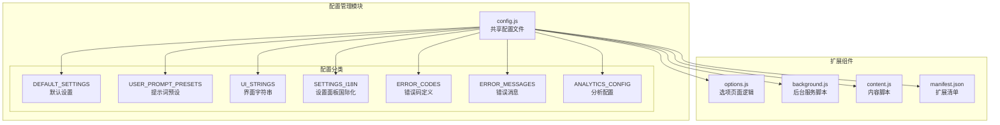

**图表来源**
- [config.js:1-273](file://config.js#L1-L273)
- [options.js:1-685](file://options.js#L1-L685)
- [background.js:1-1136](file://background.js#L1-L1136)
- [content.js:1-1578](file://content.js#L1-L1578)

**章节来源**
- [config.js:1-273](file://config.js#L1-L273)
- [manifest.json:1-45](file://manifest.json#L1-L45)

## 核心组件

### 默认设置 (DEFAULT_SETTINGS)

默认设置是配置系统的核心基础，包含了扩展运行所需的所有必要配置项：

| 配置项 | 类型 | 默认值 | 描述 |
|--------|------|--------|------|
| apiEndpoint | string | "https://api.openai.com/v1/chat/completions" | API 端点地址 |
| apiKey | string | "" | API 认证密钥 |
| model | string | "gpt-5-mini" | AI 模型名称 |
| requestFormat | string | "auto" | 请求格式（auto/openai/anthropic） |
| anthropicVersion | string | "2023-06-01" | Anthropic API 版本 |
| hoverButtonEnabled | boolean | true | 是否启用悬浮按钮 |
| snippingShortcutEnabled | boolean | true | 是否启用截图功能 |
| uiLanguage | string | "zh" | 用户界面语言 |
| maxImageEdge | number | 1024 | 最大图像边缘尺寸 |
| recreateMode | boolean | false | 高还原度模式开关 |
| systemPrompt | string | 复杂的 JSON 结构提示 | 系统级提示词 |
| userPrompt | string | 结构化分析提示 | 用户级提示词 |
| temperature | number | 1 | 生成温度参数 |

**更新** 新增 recreateMode 配置项，用于控制是否启用高还原度模式。

### 提示词预设 (USER_PROMPT_PRESETS)

系统提供了多种场景化的提示词预设，每种预设针对特定的图像分析需求：

- **general**: 通用图像结构分解
- **photo**: 摄影技术参数分析
- **cg**: 数字艺术和 CG 分析
- **design**: 平面设计元素识别
- **assets3d**: 3D 资产技术分析
- **product**: 电商产品摄影分析
- **ui**: 界面设计系统分析
- **anime**: 动漫插画专业分析
- **architecture**: 建筑室内设计分析
- **food**: 美食摄影专业分析
- **portrait**: 人像摄影专业分析

**更新** 新增四个专业领域模板：anime、architecture、food、portrait，每个都包含详细的分析维度和专业术语。

### UI 字符串本地化 (UI_STRINGS)

UI 字符串系统支持中英文双语界面，包含完整的界面文本资源：

| 分类 | 中文键 | 英文键 | 用途 |
|------|--------|--------|------|
| 状态文本 | preparing/generating/completed | preparing/generating/completed | 生成状态显示 |
| 错误消息 | modelFailed/base64Failed | modelFailed/base64Failed | 错误提示 |
| 操作按钮 | copyBtn/cancelBtn | copyBtn/cancelBtn | 用户操作 |
| 历史记录 | historyTitle/historyEmpty | historyTitle/historyEmpty | 历史管理 |

### 设置面板国际化 (SETTINGS_I18N)

设置面板的完整本地化支持，涵盖所有设置界面的标签和说明：

- **连接设置**：API 端点、模型、密钥配置
- **提示词设置**：System Prompt 和 User Prompt 配置
- **使用体验**：悬浮按钮和截图功能控制
- **高还原度模式**：新增的专业模式配置
- **兼容性设置**：图像分辨率和请求格式优化
- **帮助信息**：快捷键说明和联系信息

**更新** 新增高还原度模式的设置项，提供详细的模式说明和使用指导。

### 错误码管理 (ERROR_CODES)

标准化的错误码定义，确保错误处理的一致性和可维护性：

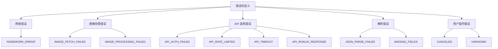

**图表来源**
- [config.js:226-238](file://config.js#L226-L238)

**章节来源**
- [config.js:4-273](file://config.js#L4-L273)

## 架构概览

配置管理模块采用分层架构设计，确保配置的统一管理和高效访问：

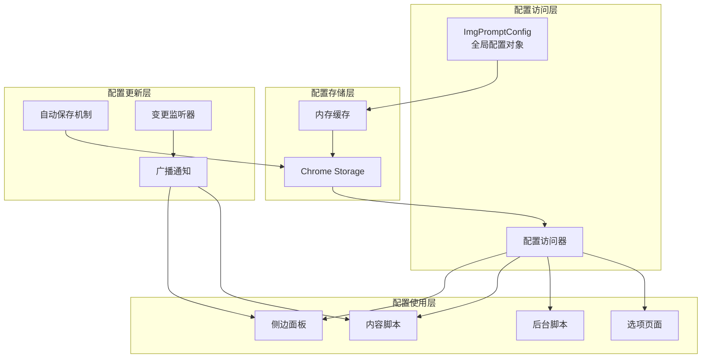

**图表来源**
- [config.js:1-273](file://config.js#L1-L273)
- [options.js:511-529](file://options.js#L511-L529)
- [background.js:151-164](file://background.js#L151-L164)

### 配置验证机制

配置验证系统确保所有配置项的有效性和一致性：

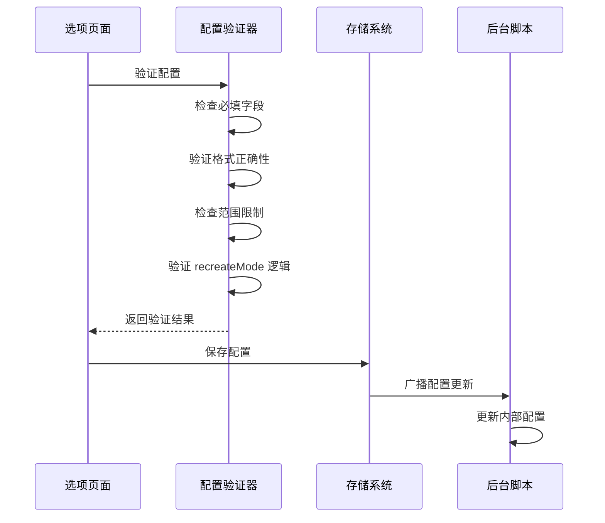

**图表来源**
- [background.js:349-355](file://background.js#L349-L355)
- [options.js:511-529](file://options.js#L511-L529)

### 动态更新策略

系统实现了多层次的配置更新机制：

1. **自动保存延迟机制**：防抖处理，避免频繁写入
2. **实时变更监听**：即时响应配置变化
3. **跨组件同步**：确保所有扩展组件保持配置一致
4. **回滚机制**：支持配置恢复到默认值

**更新** 高还原度模式的动态更新策略已集成到现有的配置更新机制中。

**章节来源**
- [options.js:511-529](file://options.js#L511-L529)
- [background.js:151-164](file://background.js#L151-L164)

## 详细组件分析

### 配置项组织结构

配置系统采用层次化的组织结构，每个配置类别都有明确的职责分工：

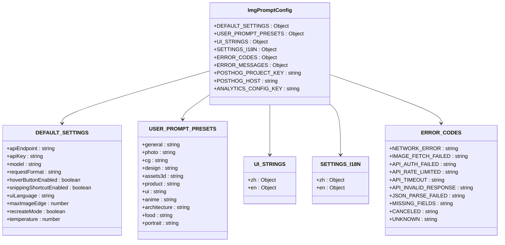

**图表来源**
- [config.js:4-273](file://config.js#L4-L273)

### API 端点配置

API 端点配置支持多种兼容的 AI 服务提供商：

| 服务提供商 | 端点格式 | 认证方式 | 特殊要求 |
|------------|----------|----------|----------|
| OpenAI | `/v1/chat/completions` | Bearer Token | 支持多模态输入 |
| Anthropic | `/v1/messages` | x-api-key | 需要 Anthropic 版本 |
| Gemini | `/v1beta/models/{model}:generateContent` | API Key | 支持多模态 |
| 自定义 | `{custom_endpoint}` | 可配置 | 遵循 OpenAI 兼容协议 |

### 模型参数设置

模型参数配置支持灵活的参数调整：

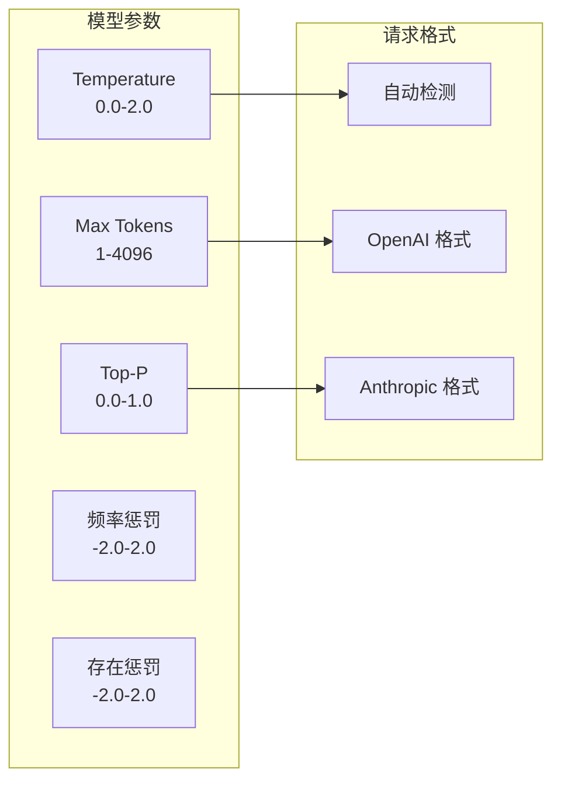

**图表来源**
- [config.js:8-24](file://config.js#L8-L24)
- [background.js:349-355](file://background.js#L349-L355)

### 界面语言选项

界面语言系统支持动态切换和持久化存储：

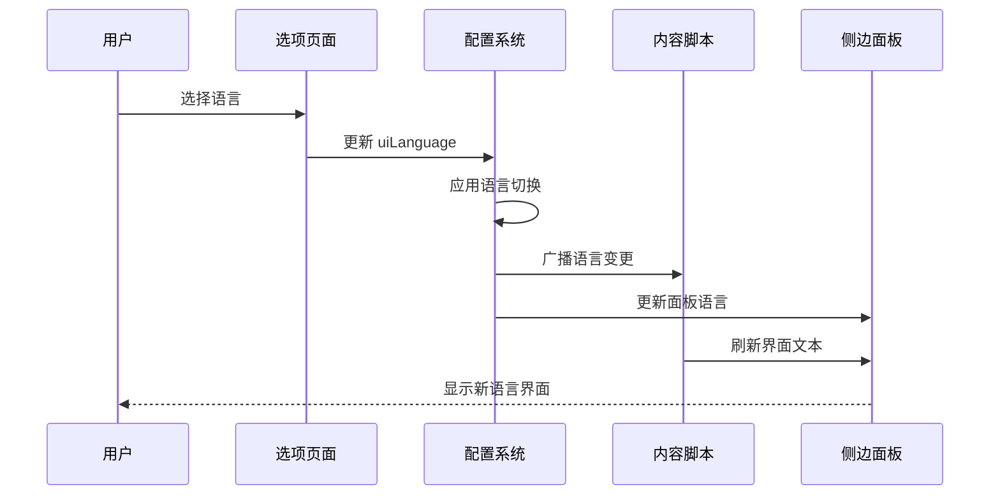

**图表来源**
- [options.js:548-578](file://options.js#L548-L578)
- [content.js:126-141](file://content.js#L126-L141)

### 行为偏好配置

行为偏好配置管理用户交互设置：

| 偏好设置 | 默认值 | 影响范围 | 配置键 |
|----------|--------|----------|--------|
| 悬浮按钮 | 启用 | 页面交互 | `hoverButtonEnabled` |
| 截图功能 | 启用 | 快捷操作 | `snippingShortcutEnabled` |
| 图像压缩 | 1024px | 性能优化 | `maxImageEdge` |
| 语言偏好 | 中文 | 界面显示 | `uiLanguage` |
| 高还原度模式 | 关闭 | 专业分析 | `recreateMode` |

**更新** 新增高还原度模式配置项，提供专业的图像还原分析能力。

### 专业领域模板配置

系统新增的四个专业领域模板提供了深度的分析能力：

#### 动漫插画模板 (anime)
- **角色设计**：头发、眼睛、面部特征、身体比例
- **服装配饰**：制服、魔法少女、传统服饰细节
- **艺术风格**：分镜效果、线条风格、特效元素
- **背景环境**：学校、城市、幻想世界场景
- **色彩搭配**：动漫常用色系和主题色调
- **构图技巧**：三分法、动态角度、特写镜头

#### 建筑室内模板 (architecture)
- **建筑风格**：现代、古典、哥特、装饰艺术等
- **结构元素**：柱子、横梁、拱门、穹顶设计
- **材料质感**：混凝土、玻璃、钢材、木材纹理
- **空间布局**：平面图、流线设计、开放vs封闭空间
- **照明设计**：自然光、人工照明、氛围营造
- **装饰细节**：家具、装饰品、色彩方案

#### 美食摄影模板 (food)
- **菜品构图**：摆盘风格、食材分布、分量控制
- **烹饪技法**：烤制、油炸、烘焙、蒸煮特征
- **餐具搭配**：瓷器、木质、石材材质选择
- **光影效果**：柔光箱、窗光、反射光运用
- **色彩协调**：食物本色、餐具对比、背景和谐
- **质感表现**：光泽、纹理、层次感呈现

#### 人像摄影模板 (portrait)
- **人物特征**：年龄、种族、性别表达、面部轮廓
- **姿态语言**：头部位置、身体姿态、手势表达
- **服装造型**：商务、休闲、前卫风格搭配
- **化妆修饰**：自然妆、戏剧化妆、无妆效果
- **灯光布景**：伦勃朗光、蝴蝶光、分割光配置
- **后期处理**：自然修图、时尚大片、纪实风格

**章节来源**
- [config.js:26-37](file://config.js#L26-L37)
- [options.js:401-406](file://options.js#L401-L406)
- [content.js:365-376](file://content.js#L365-L376)

## 依赖关系分析

配置管理模块与扩展其他组件的依赖关系：

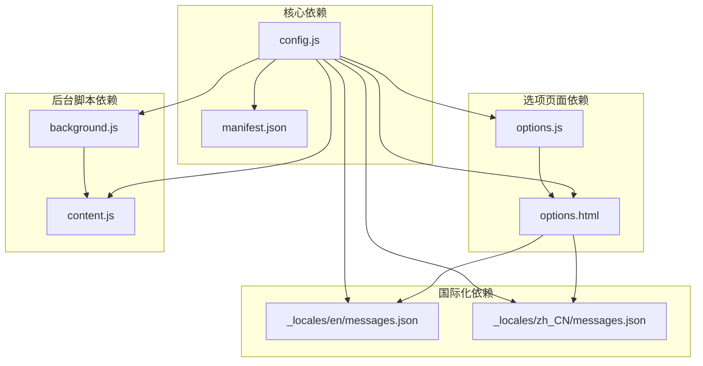

**图表来源**
- [config.js:1-273](file://config.js#L1-L273)
- [options.js:1-685](file://options.js#L1-L685)
- [background.js:1-1136](file://background.js#L1-L1136)
- [content.js:1-1578](file://content.js#L1-L1578)

### 配置验证机制

配置验证系统确保数据的完整性和有效性：

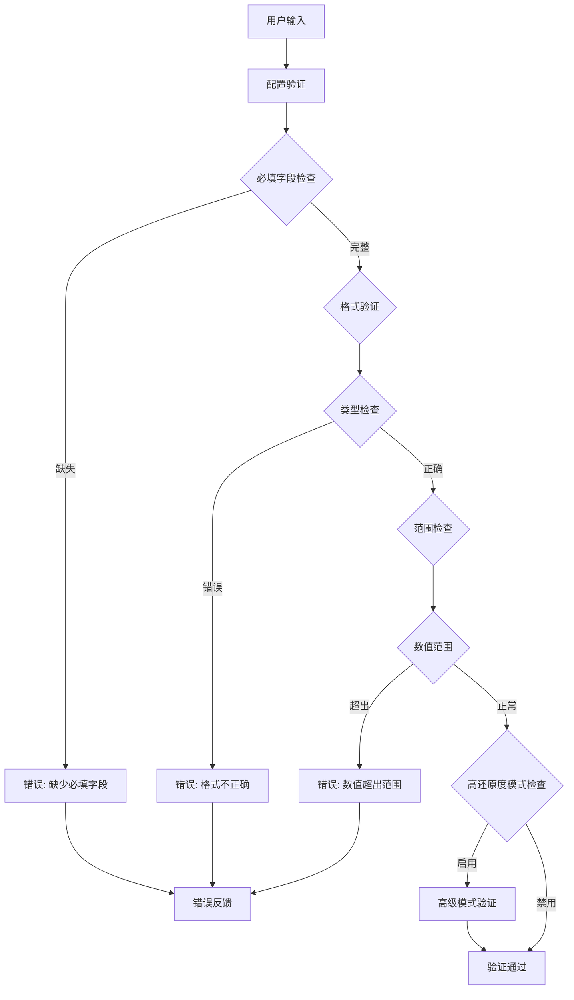

**图表来源**
- [background.js:349-355](file://background.js#L349-L355)

### 动态更新策略

系统实现了多层次的配置更新机制：

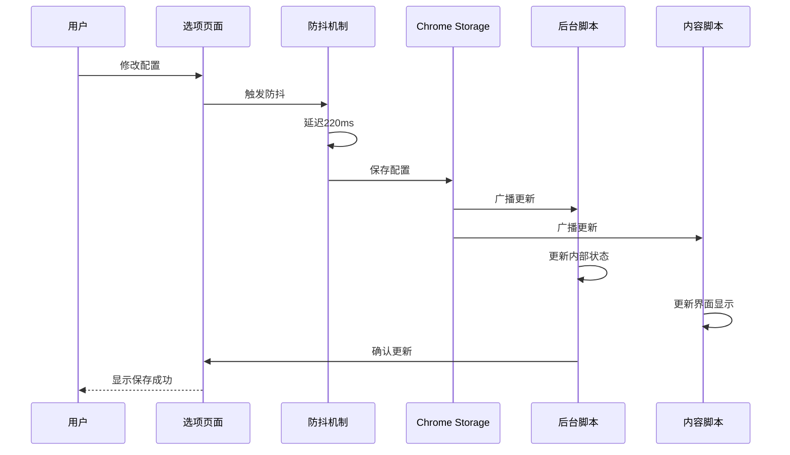

**图表来源**
- [options.js:511-529](file://options.js#L511-L529)
- [background.js:151-164](file://background.js#L151-L164)

**章节来源**
- [options.js:511-529](file://options.js#L511-L529)
- [background.js:151-164](file://background.js#L151-L164)

## 性能考虑

配置管理模块在设计时充分考虑了性能优化：

### 内存管理
- **懒加载策略**：配置项按需加载，避免不必要的内存占用
- **缓存机制**：常用配置项缓存在内存中，减少存储访问开销
- **垃圾回收**：及时清理不再使用的配置引用

### 网络优化
- **批量存储**：配置更新采用批量写入，减少存储 API 调用次数
- **增量更新**：只更新发生变化的配置项
- **去重处理**：避免重复的配置更新操作

### 用户体验优化
- **防抖处理**：配置变更采用防抖机制，避免频繁的界面更新
- **异步处理**：配置保存操作异步执行，不影响用户操作
- **渐进式加载**：配置项按需加载，提升初始启动速度

**更新** 高还原度模式的引入增加了配置项的复杂性，但通过合理的缓存和懒加载策略确保性能不受影响。

## 故障排除指南

### 常见配置问题

| 问题类型 | 症状 | 解决方案 |
|----------|------|----------|
| API 连接失败 | 无法连接到 AI 服务 | 检查 API 端点和密钥配置 |
| 图像处理错误 | 无法处理图片输入 | 调整图像分辨率设置 |
| 模型响应异常 | 模型返回格式错误 | 检查 System Prompt 配置 |
| 语言显示问题 | 界面文字显示异常 | 重置语言设置到默认值 |
| 配置丢失 | 设置无法保存 | 检查浏览器存储权限 |
| 高还原度模式失效 | 专业模板不生效 | 检查 recreateMode 配置 |

**更新** 新增高还原度模式相关的故障排除指导。

### 配置迁移策略

系统支持配置的平滑迁移和版本兼容：

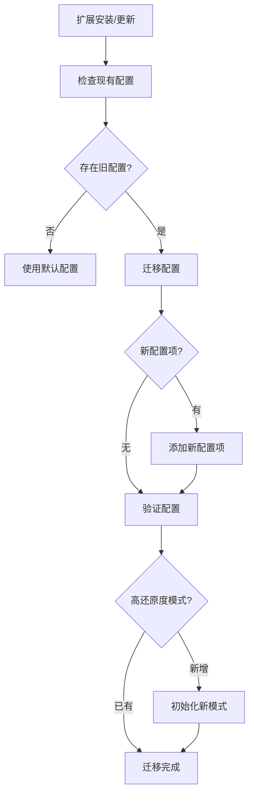

**图表来源**
- [background.js:29-74](file://background.js#L29-L74)

### 版本兼容性处理

系统通过以下机制确保版本兼容性：

1. **默认值回退**：新版本缺少的配置项使用默认值
2. **类型转换**：自动转换配置项的数据类型
3. **格式升级**：支持配置格式的向后兼容
4. **错误恢复**：配置损坏时自动恢复到安全状态
5. **专业模板兼容**：新版本的专业模板与旧版本配置兼容

**更新** 高还原度模式和专业模板的引入确保了向后兼容性。

**章节来源**
- [background.js:29-74](file://background.js#L29-L74)

## 结论

ImgPrompt 的配置管理模块展现了现代浏览器扩展配置系统的最佳实践。通过集中式配置管理、完善的国际化支持、健壮的验证机制和高效的更新策略，该模块为扩展提供了稳定可靠的基础架构。

**更新** 新增的高还原度模式配置选项和四个专业领域模板显著增强了系统的专业性和准确性，为不同领域的图像分析需求提供了专门的解决方案。

### 主要优势

1. **统一性**：所有组件共享同一套配置，确保一致性
2. **可维护性**：清晰的配置分类和组织结构
3. **可扩展性**：支持新的配置项和功能扩展
4. **用户体验**：流畅的配置更新和语言切换体验
5. **可靠性**：完善的错误处理和配置恢复机制
6. **专业化**：新增的专业领域模板满足细分需求

### 最佳实践建议

1. **配置项命名规范**：使用语义化的配置项名称
2. **默认值设计**：提供合理的默认值和边界检查
3. **国际化优先**：所有用户可见文本都应支持多语言
4. **性能优化**：合理使用缓存和异步处理
5. **错误处理**：提供清晰的错误信息和恢复机制
6. **专业模板使用**：根据具体需求选择合适的专业模板
7. **高还原度模式应用**：在需要精确还原的场景下启用专业模式

该配置管理模块为 ImgPrompt 扩展的成功运行奠定了坚实的基础，其设计理念和实现方式值得其他浏览器扩展项目借鉴和学习。新增的专业功能进一步提升了系统的实用性和专业性，为用户提供了更加精准和专业的图像分析体验。