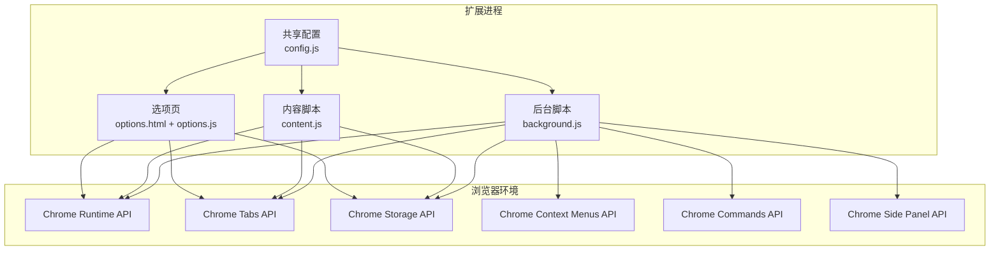
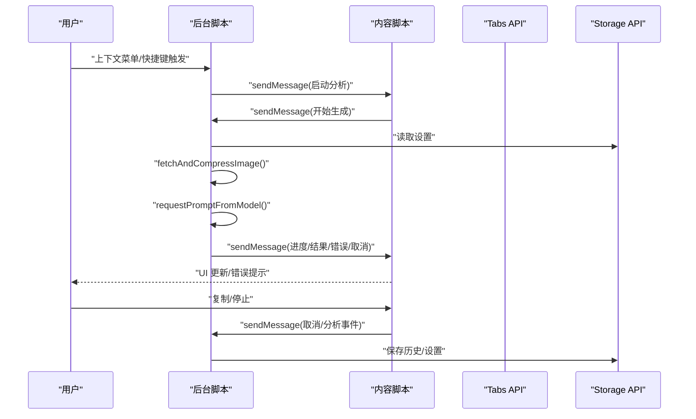
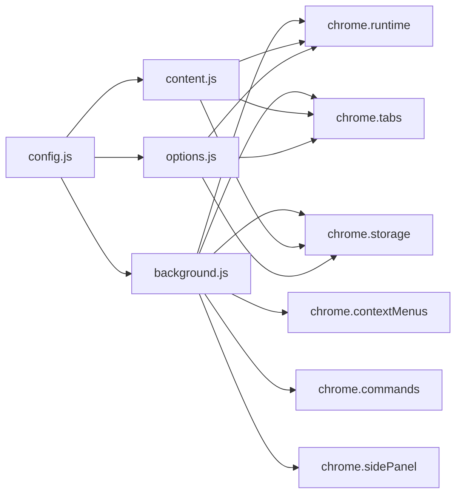

# 组件通信机制

<cite>
**本文引用的文件**
- [manifest.json](file://manifest.json)
- [config.js](file://config.js)
- [background.js](file://background.js)
- [content.js](file://content.js)
- [options.js](file://options.js)
- [options.html](file://options.html)
- [messages.json](file://_locales/en/messages.json)
- [messages.json](file://_locales/zh_CN/messages.json)
</cite>

## 目录
1. [简介](#简介)
2. [项目结构](#项目结构)
3. [核心组件](#核心组件)
4. [架构总览](#架构总览)
5. [详细组件分析](#详细组件分析)
6. [依赖关系分析](#依赖关系分析)
7. [性能考量](#性能考量)
8. [故障排查指南](#故障排查指南)
9. [结论](#结论)
10. [附录](#附录)

## 简介
本文件系统化梳理 ImgPrompt Chrome 扩展的组件通信机制，覆盖后台脚本与内容脚本之间的消息传递、事件监听与回调处理、异步消息处理模式与错误处理策略，并总结双向通信与状态同步的设计模式及通信协议规范与最佳实践。重点解释 runtime.sendMessage、tabs.sendMessage 等 API 的使用场景与实现细节，给出消息格式、超时与重试建议，帮助开发者在扩展开发中高效、稳定地实现跨组件通信。

## 项目结构
该扩展采用 Manifest V3 架构，包含以下关键模块：
- 后台服务工作线程：负责上下文菜单、命令触发、全局状态管理、与模型服务交互、进度与结果分发。
- 内容脚本：注入页面，负责 UI 面板渲染、用户交互、与后台通信、状态同步与错误展示。
- 设置页：独立页面，负责用户配置、历史记录查看与操作、与后台通信。
- 共享配置：提供默认设置、UI 文案、错误码与分析配置等共享常量。

图表来源
- [manifest.json:10-42](file://manifest.json#L10-L42)
- [background.js:1-120](file://background.js#L1-L120)
- [content.js:1-120](file://content.js#L1-L120)
- [options.js:1-60](file://options.js#L1-L60)

章节来源
- [manifest.json:1-45](file://manifest.json#L1-L45)
- [config.js:1-50](file://config.js#L1-L50)

## 核心组件
- 后台脚本（background.js）
  - 监听安装、上下文菜单点击、键盘命令，向内容脚本发送启动分析的消息。
  - 处理来自内容脚本的生成请求，执行图像获取与压缩、调用模型、解析结果、分发进度与最终结果。
  - 提供历史记录查询、删除、清空等存储操作。
  - 支持侧边栏打开与设置更新广播。
- 内容脚本（content.js）
  - 注册运行时消息监听器，接收后台进度、结果、错误、取消与设置更新通知。
  - 发送生成请求、取消请求、分析事件、设置更新等消息给后台。
  - 维护 UI 面板状态、语言偏好、复制与停止等交互。
- 选项页（options.html + options.js）
  - 加载共享配置，渲染设置表单与历史记录列表。
  - 通过 runtime.sendMessage 与 tabs.sendMessage 与后台通信，实现设置保存、历史记录读写与加载。
- 共享配置（config.js）
  - 定义默认设置、UI 文案、错误码、分析配置等，供各模块复用。

章节来源
- [background.js:19-184](file://background.js#L19-L184)
- [content.js:209-247](file://content.js#L209-L247)
- [options.js:182-223](file://options.js#L182-L223)

## 架构总览
扩展采用“后台驱动 + 内容脚本 UI + 选项页配置”的三层通信架构：
- 后台作为协调者与执行者，负责与模型服务交互、进度与结果分发。
- 内容脚本负责页面级 UI 与用户交互，承载生成流程的可视化与状态反馈。
- 选项页负责用户配置与历史记录管理，通过消息与后台交互。

图表来源
- [background.js:59-92](file://background.js#L59-L92)
- [background.js:212-320](file://background.js#L212-L320)
- [content.js:249-326](file://content.js#L249-L326)
- [content.js:1348-1362](file://content.js#L1348-L1362)

## 详细组件分析

### 后台脚本（background.js）通信要点
- 上下文菜单与命令触发
  - 监听 contextMenus.onClick 与 commands.onCommand，构造消息并使用 sendMessage 发送到对应标签页。
- 运行时消息处理
  - onMessage 监听来自内容脚本的消息类型，处理生成、取消、设置更新、历史记录等。
  - 对于需要同步响应的场景，返回 true 并在异步完成后通过 sendResponse 回传结果。
- 与内容脚本的双向通信
  - 使用 sendTabMessage（封装）与 chrome.tabs.sendMessage 发送消息到指定标签页。
  - 使用 chrome.runtime.sendMessage 处理来自选项页的消息。
- 异步处理与错误分类
  - 对网络、鉴权、速率限制、模型返回异常等进行分类与用户友好提示。
- 状态同步
  - settings:updated 类型广播到所有标签页，确保 UI 即时更新。

章节来源
- [background.js:59-92](file://background.js#L59-L92)
- [background.js:94-184](file://background.js#L94-L184)
- [background.js:134-147](file://background.js#L134-L147)

### 内容脚本（content.js）通信要点
- 运行时消息监听
  - 监听 prompt:*、settings:updated 等类型，分别处理进度、结果、错误、取消与设置更新。
- 与后台通信
  - 发送 prompt:begin-generation、prompt:cancel-generation、analytics:track 等消息。
  - 使用 safeSendRuntimeMessage 包装 sendMessage，捕获扩展上下文失效等错误。
- UI 与状态管理
  - 维护 activeRequestId、isGenerating、currentPrompts 等状态，保证多阶段 UI 更新与交互一致性。
- 事件与回调
  - 通过回调函数处理后台响应，区分 runtimeError 与 response.ok=false 的情况。

章节来源
- [content.js:209-247](file://content.js#L209-L247)
- [content.js:290-318](file://content.js#L290-L318)
- [content.js:1348-1362](file://content.js#L1348-L1362)

### 选项页（options.html + options.js）通信要点
- 初始化与历史记录
  - 初始化时通过 runtime.sendMessage 获取历史记录并渲染。
- 设置保存与广播
  - 自动保存设置，通过 runtime.sendMessage 广播 settings:updated，使内容脚本即时更新 UI。
- 历史记录操作
  - 通过 runtime.sendMessage 发送 history:* 消息；通过 tabs.sendMessage 将历史项加载到当前标签页的内容脚本。
- 分析事件上报
  - 通过 runtime.sendMessage 发送 analytics:track 消息。

章节来源
- [options.js:218-223](file://options.js#L218-L223)
- [options.js:384-404](file://options.js#L384-L404)
- [options.js:336-360](file://options.js#L336-L360)
- [options.js:470-483](file://options.js#L470-L483)

### 共享配置（config.js）作用
- DEFAULT_SETTINGS：默认配置与提示词模板。
- UI_STRINGS：UI 文案（中英文），用于内容脚本与选项页的本地化。
- ERROR_CODES/ERROR_MESSAGES：错误码与用户友好提示映射。
- ANALYTICS_CONFIG_KEY/POSTHOG_*：分析上报配置。

章节来源
- [config.js:4-253](file://config.js#L4-L253)

## 依赖关系分析

图表来源
- [manifest.json:10-42](file://manifest.json#L10-L42)
- [background.js:1-12](file://background.js#L1-L12)
- [content.js:1-5](file://content.js#L1-L5)
- [options.js:1-5](file://options.js#L1-L5)

章节来源
- [manifest.json:10-42](file://manifest.json#L10-L42)

## 性能考量
- 消息异步化
  - onMessage 中对耗时操作使用异步处理并通过 sendResponse 返回，避免阻塞主线程。
- 进度分发
  - 后台按阶段发送进度消息，前端仅更新当前请求 ID 匹配的状态，减少不必要的 UI 刷新。
- 图像处理
  - 在后台统一执行 fetchAndCompressImage，避免重复计算与跨脚本传输大对象。
- 存储与广播
  - 设置变更通过 settings:updated 广播，减少轮询与重复读取。

[本节为通用指导，无需特定文件引用]

## 故障排查指南
- 扩展上下文失效
  - 内容脚本 safeSendRuntimeMessage 会捕获扩展上下文失效类错误，避免抛出异常导致 UI 错误。
- 通信失败与错误分类
  - 后台对网络、鉴权、速率限制、模型返回等进行分类，返回用户友好提示。
- 诊断步骤
  - 检查后台 onMessage 是否正确返回 true 并在异步完成后 sendResponse。
  - 确认内容脚本 activeRequestId 与收到的消息一致，避免状态错乱。
  - 查看 chrome.runtime.lastError 与 response.ok 字段，区分不同错误来源。

章节来源
- [content.js:56-75](file://content.js#L56-L75)
- [background.js:280-317](file://background.js#L280-L317)

## 结论
该扩展通过清晰的消息协议与严格的异步处理模式，实现了后台与内容脚本、选项页之间的高效通信。通过进度分发、状态同步与错误分类，提供了良好的用户体验。建议在后续迭代中进一步完善超时与重试机制、统一消息格式校验与日志记录，以提升稳定性与可观测性。

[本节为总结性内容，无需特定文件引用]

## 附录

### 消息协议规范与最佳实践
- 消息类型与字段
  - prompt:start-analysis：携带 requestId、srcUrl、pageUrl、trigger 等。
  - prompt:begin-generation：携带 requestId、srcUrl、imageDataUrl、trigger、pageContext 等。
  - prompt:progress/prompt:result/prompt:error/prompt:canceled：携带 requestId、progress/prompts/errorCode/message 等。
  - prompt:cancel-generation：携带 requestId。
  - settings:updated：无额外字段，用于广播设置更新。
  - history:get/history:delete/history:clear：用于历史记录管理。
  - analytics:track：用于分析事件上报。
  - prompt:load-history-item：用于将历史项加载到内容脚本。
- 双向通信模式
  - 内容脚本发起请求（prompt:begin-generation），后台返回进度与最终结果。
  - 选项页发起设置保存与历史操作，后台通过广播 settings:updated 与历史消息响应。
- 超时与重试建议
  - 对外部模型请求设置合理超时时间（如 30-60 秒），在网络错误或 5xx 时进行指数退避重试（最多 2-3 次）。
  - 对于 UI 层，建议在发送消息前检查扩展上下文有效性，失败时提示用户刷新页面或重新启用扩展。
- 错误处理策略
  - 对网络错误、鉴权失败、速率限制、模型返回异常进行分类与用户友好提示。
  - 对于扩展上下文失效类错误，采用降级策略（隐藏面板、提示用户重试）而非抛出异常。

[本节为通用指导，无需特定文件引用]