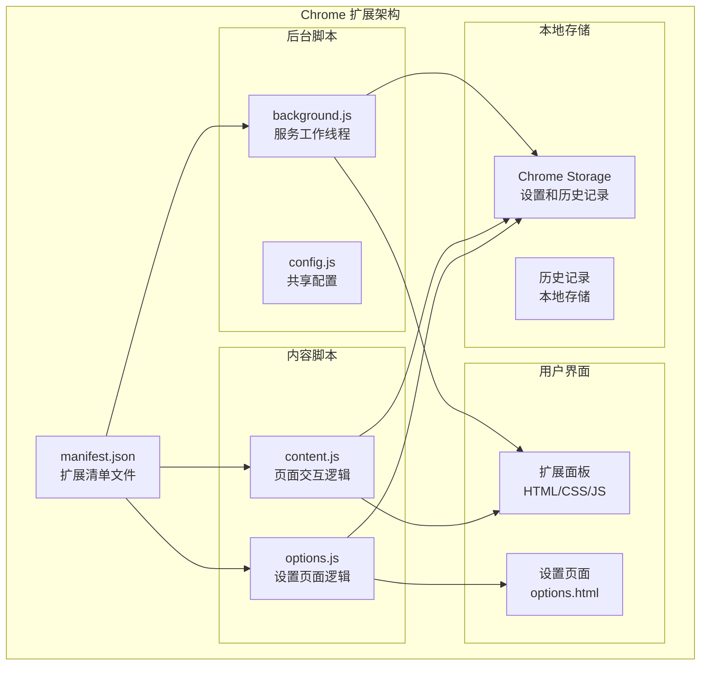
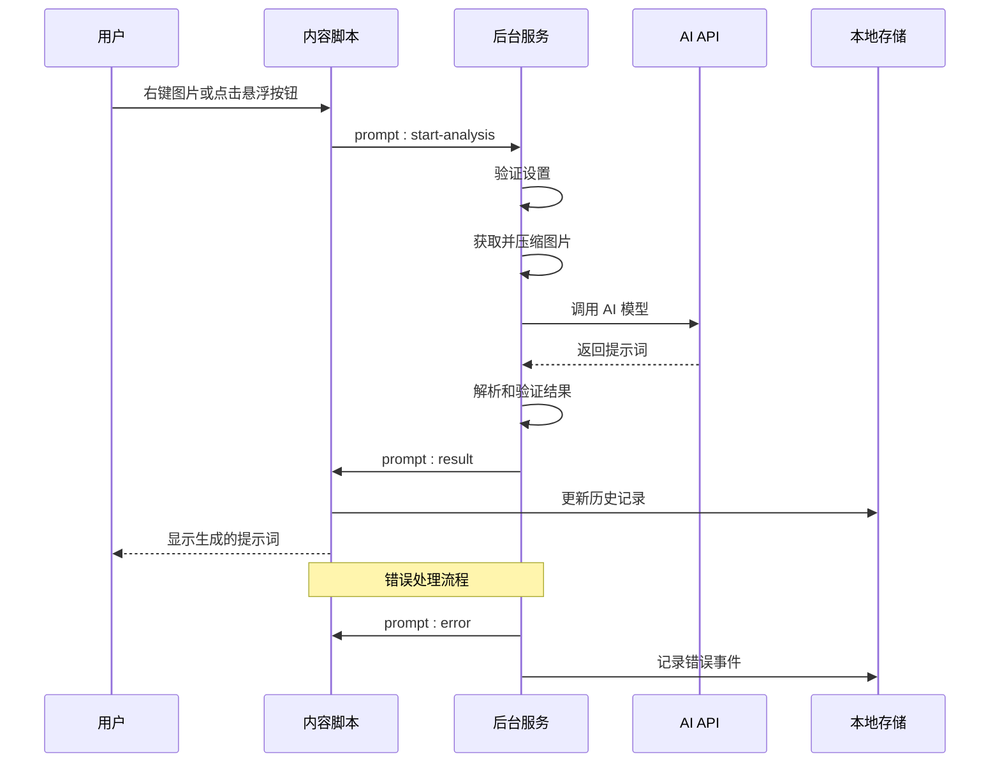
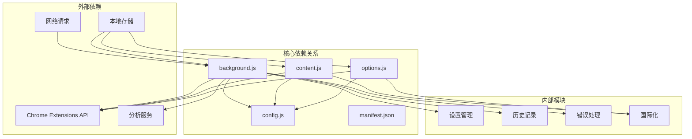

# 故障排除与常见问题

<cite>
**本文档引用的文件**
- [background.js](file://background.js)
- [content.js](file://content.js)
- [options.js](file://options.js)
- [config.js](file://config.js)
- [manifest.json](file://manifest.json)
- [options.html](file://options.html)
- [messages.json](file://_locales/en/messages.json)
- [messages.json](file://_locales/zh_CN/messages.json)
</cite>

## 目录
1. [简介](#简介)
2. [项目结构](#项目结构)
3. [核心组件](#核心组件)
4. [架构概览](#架构概览)
5. [详细故障排除指南](#详细故障排除指南)
6. [依赖关系分析](#依赖关系分析)
7. [性能优化建议](#性能优化建议)
8. [安全故障排除指南](#安全故障排除指南)
9. [问题反馈与支持](#问题反馈与支持)
10. [结论](#结论)

## 简介

ImgPrompt 是一个 Chrome 扩展程序，能够将图片转换为 AI 提示词。该扩展通过浏览器上下文菜单和悬浮按钮提供便捷的图片分析功能，支持多种 AI 模型接口，包括 OpenAI 和 Anthropic Claude。

本故障排除文档旨在帮助用户快速识别和解决使用过程中遇到的各种问题，包括 API 连接问题、图片处理失败、生成结果异常等常见情况。

## 项目结构

ImgPrompt 采用典型的 Chrome 扩展架构，包含以下主要组件：



**图表来源**
- [manifest.json:1-45](file://manifest.json#L1-L45)
- [background.js:1-50](file://background.js#L1-L50)
- [content.js:1-50](file://content.js#L1-L50)
- [options.js:1-30](file://options.js#L1-L30)

**章节来源**
- [manifest.json:1-45](file://manifest.json#L1-L45)
- [config.js:1-50](file://config.js#L1-L50)

## 核心组件

### 1. 后台服务工作线程 (background.js)
负责处理 API 请求、图片压缩、错误分类和分析事件追踪。

### 2. 内容脚本 (content.js)
管理用户界面、事件处理和与后台的通信。

### 3. 设置页面 (options.js)
提供用户配置界面，管理设置持久化和历史记录。

### 4. 共享配置 (config.js)
包含默认设置、错误代码和国际化字符串。

**章节来源**
- [background.js:1-100](file://background.js#L1-L100)
- [content.js:1-100](file://content.js#L1-L100)
- [options.js:1-50](file://options.js#L1-L50)
- [config.js:1-100](file://config.js#L1-L100)

## 架构概览



**图表来源**
- [background.js:212-320](file://background.js#L212-L320)
- [content.js:249-326](file://content.js#L249-L326)

## 详细故障排除指南

### API 连接问题

#### 1. 认证失败 (API_AUTH_FAILED)
**症状**: 显示 "API 密钥无效或已过期" 或 "认证失败"

**诊断步骤**:
1. 检查 API Key 是否正确填写
2. 验证 API Endpoint 地址格式
3. 确认网络连接正常
4. 测试 API Key 在其他工具中的有效性

**解决方案**:
- 重新生成有效的 API Key
- 确认 API Endpoint 匹配所选模型
- 检查 API 服务提供商的状态页面
- 验证账户余额和配额

**章节来源**
- [background.js:568-582](file://background.js#L568-L582)
- [config.js:220-233](file://config.js#L220-L233)

#### 2. 调用次数超限 (API_RATE_LIMITED)
**症状**: 显示 "API 调用次数已达上限"

**诊断步骤**:
1. 检查 API 服务提供商的配额限制
2. 查看是否有其他应用同时使用同一密钥
3. 检查请求频率是否过高

**解决方案**:
- 升级 API 服务计划
- 实现请求节流机制
- 使用多个 API Key 负载均衡
- 优化图片大小减少请求体积

**章节来源**
- [background.js:572-574](file://background.js#L572-L574)
- [config.js:226](file://config.js#L226)

#### 3. 服务器错误 (API_TIMEOUT/INVALID_RESPONSE)
**症状**: 显示 "服务器错误" 或 "请求超时"

**诊断步骤**:
1. 检查网络连接稳定性
2. 验证 API Endpoint 可访问性
3. 测试不同时间段的请求
4. 检查防火墙和代理设置

**解决方案**:
- 增加请求超时时间
- 实现重试机制
- 切换到备用 API Endpoint
- 使用 CDN 或代理服务

**章节来源**
- [background.js:575-582](file://background.js#L575-L582)
- [config.js:227-228](file://config.js#L227-L228)

### 图片处理失败

#### 1. 图片获取失败 (IMAGE_FETCH_FAILED)
**症状**: 显示 "无法获取图片"

**诊断步骤**:
1. 检查图片 URL 是否有效
2. 验证跨域访问权限
3. 确认图片源的可访问性
4. 测试图片在浏览器中的直接访问

**解决方案**:
- 使用可公开访问的图片链接
- 避免需要登录验证的图片
- 检查图片防盗链设置
- 尝试下载后重新上传

**章节来源**
- [background.js:792-794](file://background.js#L792-L794)
- [config.js:223](file://config.js#L223)

#### 2. 图片处理失败 (IMAGE_PROCESSING_FAILED)
**症状**: 显示 "图片处理失败"

**诊断步骤**:
1. 检查图片格式是否受支持
2. 验证图片尺寸是否过大
3. 确认内存使用情况
4. 测试不同分辨率的图片

**解决方案**:
- 降低图片分辨率 (最大边缘 1024px)
- 改善图片质量格式
- 清理浏览器缓存
- 重启浏览器扩展

**章节来源**
- [background.js:775-800](file://background.js#L775-L800)
- [config.js:224](file://config.js#L224)

#### 3. Base64 编码失败 (BASE64_FAILED)
**症状**: 显示 "图片处理失败：无法获取图片的二进制数据"

**诊断步骤**:
1. 检查图片是否为有效数据 URL
2. 验证图片编码格式
3. 确认图片大小限制
4. 测试不同图片源

**解决方案**:
- 使用更小的图片文件
- 避免过大的图片文件
- 检查浏览器内存限制
- 尝试不同的图片格式

**章节来源**
- [background.js:781-783](file://background.js#L781-L783)
- [config.js:64](file://config.js#L64)

### 生成结果异常

#### 1. JSON 解析失败 (JSON_PARSE_FAILED)
**症状**: 显示 "模型返回的内容无法解析"

**诊断步骤**:
1. 检查 System Prompt 格式
2. 验证模型输出格式
3. 确认返回内容是否为纯 JSON
4. 测试简化后的提示词

**解决方案**:
- 确保 System Prompt 输出纯 JSON
- 移除 Markdown 包装符
- 验证 JSON 结构完整性
- 调整模型参数

**章节来源**
- [background.js:695-726](file://background.js#L695-L726)
- [config.js:229](file://config.js#L229)

#### 2. 缺少字段 (MISSING_FIELDS)
**症状**: 显示 "模型返回缺少 zh/en 字段"

**诊断步骤**:
1. 检查 JSON 结构是否包含必需字段
2. 验证字段命名一致性
3. 确认字段值非空
4. 测试不同模型的输出

**解决方案**:
- 确保 JSON 包含 zh 和 en 字段
- 验证字段值的有效性
- 调整 System Prompt 确保字段完整性
- 检查模型配置

**章节来源**
- [background.js:718-726](file://background.js#L718-L726)
- [config.js:230](file://config.js#L230)

#### 3. 模型返回空内容 (EMPTY_CONTENT)
**症状**: 显示 "模型返回内容为空"

**诊断步骤**:
1. 检查模型配置是否正确
2. 验证 API 请求参数
3. 确认网络连接稳定
4. 测试其他图片

**解决方案**:
- 重新配置模型参数
- 检查 API 请求格式
- 增加重试机制
- 更换备用模型

**章节来源**
- [background.js:586-590](file://background.js#L586-L590)
- [config.js:101](file://config.js#L101)

### 用户界面问题

#### 1. 扩展面板无法显示
**症状**: 右键菜单无响应或面板不显示

**诊断步骤**:
1. 检查扩展是否已启用
2. 验证权限设置
3. 确认浏览器版本兼容性
4. 重启浏览器扩展

**解决方案**:
- 重新安装扩展程序
- 检查浏览器扩展权限
- 清理浏览器缓存
- 更新到最新版本

**章节来源**
- [manifest.json:22-26](file://manifest.json#L22-L26)
- [content.js:596-620](file://content.js#L596-L620)

#### 2. 悬浮按钮不显示
**症状**: 鼠标悬停图片时无悬浮按钮

**诊断步骤**:
1. 检查悬浮按钮设置
2. 验证图片尺寸要求
3. 确认遮挡检测逻辑
4. 测试不同图片类型

**解决方案**:
- 启用悬浮按钮功能
- 确保图片尺寸大于 48x48px
- 检查页面布局遮挡
- 调整浏览器缩放比例

**章节来源**
- [content.js:1158-1263](file://content.js#L1158-L1263)
- [options.js:495-518](file://options.js#L495-L518)

## 依赖关系分析



**图表来源**
- [background.js:1-12](file://background.js#L1-L12)
- [content.js:1-5](file://content.js#L1-L5)
- [options.js:1-5](file://options.js#L1-L5)

**章节来源**
- [background.js:1-50](file://background.js#L1-L50)
- [content.js:1-50](file://content.js#L1-L50)
- [options.js:1-30](file://options.js#L1-L30)

## 性能优化建议

### 1. 内存使用优化

**图片压缩策略**:
- 默认最大边缘长度：1024px
- JPEG 质量：0.86
- 支持自定义分辨率限制

**内存管理最佳实践**:
- 及时清理图像对象引用
- 避免重复创建大对象
- 监控内存使用峰值
- 实现垃圾回收触发

### 2. 响应速度提升

**网络优化**:
- 实现请求超时控制
- 添加重试机制
- 优化并发请求
- 使用连接池复用

**UI 响应优化**:
- 异步处理长任务
- 实现进度指示器
- 减少 DOM 操作
- 使用虚拟滚动

**缓存策略**:
- 本地历史记录缓存
- 设置持久化缓存
- 图片预加载机制
- 失败重试缓存

### 3. 资源管理

**浏览器资源限制**:
- 监控扩展内存使用
- 避免内存泄漏
- 及时释放事件监听器
- 管理定时器资源

**性能监控**:
- 记录关键操作耗时
- 监控 API 响应时间
- 分析用户交互延迟
- 优化渲染性能

## 安全故障排除指南

### 1. API 密钥安全

**常见安全问题**:
- API Key 泄露风险
- 本地存储安全
- 网络传输加密
- 权限最小化原则

**安全检查清单**:
- ✅ API Key 仅保存在本地存储
- ✅ 不在控制台中显示敏感信息
- ✅ 使用 HTTPS 连接
- ✅ 定期轮换 API Key
- ✅ 限制 API Key 权限范围

**安全建议**:
- 使用专用 API Key
- 启用 IP 白名单
- 配置使用限额
- 监控异常使用模式

### 2. 数据隐私保护

**隐私数据处理**:
- 图片数据仅在本地处理
- 不上传原始图片到第三方
- 本地历史记录存储
- 用户可清除所有数据

**隐私保护措施**:
- 最小化数据收集
- 加密本地存储
- 提供数据删除选项
- 遵守隐私法规

### 3. 访问控制

**权限管理**:
- 仅请求必要权限
- 动态权限申请
- 用户明确同意
- 权限撤销机制

**权限检查**:
- 检查存储权限
- 验证分析权限
- 确认侧边栏权限
- 验证上下文菜单权限

**章节来源**
- [config.js:7-10](file://config.js#L7-L10)
- [manifest.json:38-39](file://manifest.json#L38-L39)

## 问题反馈与支持

### 1. 日志查看方法

**浏览器开发者工具**:
1. 打开 Chrome 开发者工具 (F12)
2. 切换到 Console 标签
3. 观察扩展相关错误信息
4. 检查 Network 标签的 API 请求

**扩展页面**:
1. 访问 chrome://extensions/
2. 启用"开发者模式"
3. 点击"详细信息"
4. 查看扩展日志

**控制台命令**:
```javascript
// 查看扩展状态
chrome.runtime.getManifest()

// 检查存储数据
chrome.storage.local.get(null)

// 监听消息
chrome.runtime.onMessage.addListener((message) => {
  console.log('收到消息:', message)
})
```

### 2. 错误代码对照表

| 错误代码 | 中文描述 | 英文描述 |
|---------|---------|---------|
| NETWORK_ERROR | 网络连接失败 | Network connection failed |
| IMAGE_FETCH_FAILED | 无法获取图片 | Unable to fetch image |
| IMAGE_PROCESSING_FAILED | 图片处理失败 | Image processing failed |
| API_AUTH_FAILED | API 密钥无效 | Invalid API key |
| API_RATE_LIMITED | 调用次数超限 | Rate limit exceeded |
| API_TIMEOUT | API 请求超时 | API request timeout |
| API_INVALID_RESPONSE | API 返回意外结果 | Unexpected API response |
| JSON_PARSE_FAILED | JSON 解析失败 | JSON parsing failed |
| MISSING_FIELDS | 缺少必需字段 | Missing required fields |
| CANCELED | 已停止生成 | Generation canceled |
| UNKNOWN | 发生未知错误 | Unknown error |

### 3. 社区支持资源

**官方联系方式**:
- 邮箱: ooooop2011@gmail.com
- GitHub: [项目仓库](https://github.com/ooooop2011/Img2Prompt)

**常见问题解答**:
- 模型兼容性列表
- API 集成指南
- 性能优化建议
- 故障排除流程

**社区资源**:
- GitHub Issues 页面
- 用户反馈渠道
- 版本更新日志
- 使用教程视频

### 4. 问题报告模板

当您遇到问题时，请提供以下信息：

**基本信息**:
- 扩展版本: [版本号]
- 浏览器版本: [浏览器名称和版本]
- 操作系统: [操作系统信息]

**问题描述**:
- 重现步骤
- 期望结果
- 实际结果
- 错误代码

**环境信息**:
- API 提供商: [服务商名称]
- 模型名称: [模型标识]
- API Endpoint: [端点地址]
- 网络环境: [网络类型]

**附加信息**:
- 截图或录屏
- 控制台错误日志
- 相关配置信息

**章节来源**
- [config.js:206-247](file://config.js#L206-L247)
- [options.html:562-564](file://options.html#L562-L564)

## 结论

ImgPrompt 扩展提供了强大的图片转提示词功能，通过合理的故障排除流程和性能优化建议，可以有效解决大多数使用问题。

**关键要点总结**:
1. **API 连接问题**主要源于认证配置和网络环境
2. **图片处理失败**通常与文件格式和大小限制有关
3. **生成结果异常**多由模型输出格式不规范引起
4. **性能优化**需要从内存管理和网络请求两方面入手
5. **安全考虑**应重点关注 API 密钥保护和数据隐私

通过遵循本文档提供的诊断步骤和解决方案，用户可以快速定位和解决大部分使用问题。对于复杂的技术问题，建议按照问题报告模板提供详细信息，以便获得更好的技术支持。