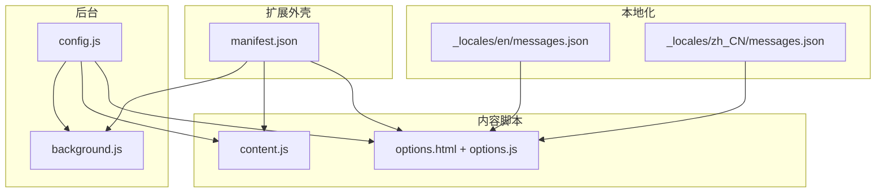
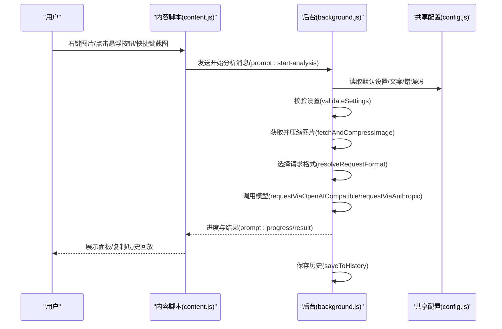
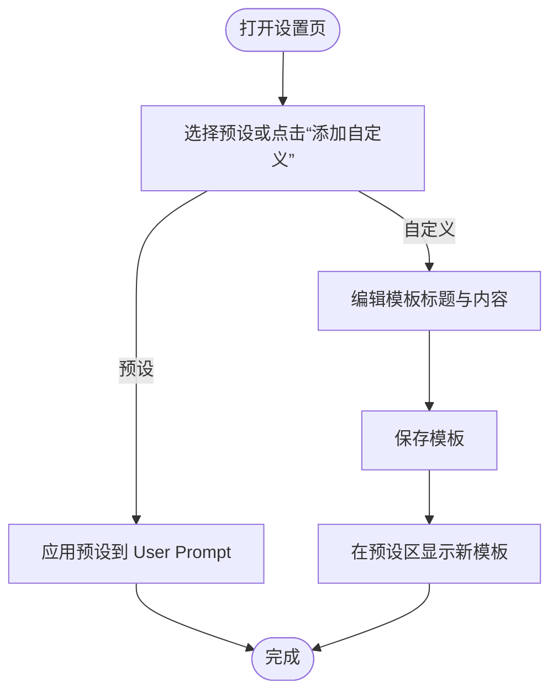
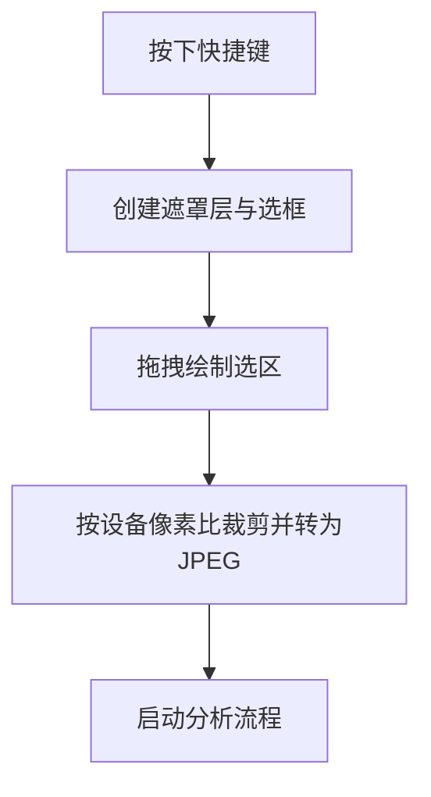
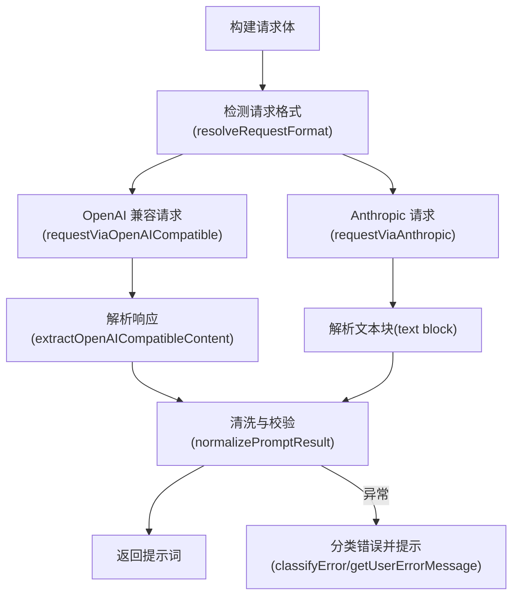
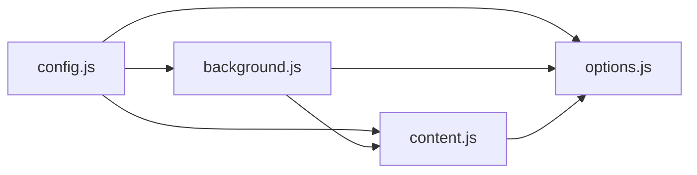

# 使用技巧

<cite>
**本文引用的文件列表**
- [manifest.json](file://manifest.json)
- [config.js](file://config.js)
- [background.js](file://background.js)
- [content.js](file://content.js)
- [options.html](file://options.html)
- [options.js](file://options.js)
- [_locales/en/messages.json](file://_locales/en/messages.json)
- [_locales/zh_CN/messages.json](file://_locales/zh_CN/messages.json)
</cite>

## 目录
1. [简介](#简介)
2. [项目结构](#项目结构)
3. [核心组件](#核心组件)
4. [架构总览](#架构总览)
5. [详细组件分析](#详细组件分析)
6. [依赖关系分析](#依赖关系分析)
7. [性能与质量建议](#性能与质量建议)
8. [工作流程优化](#工作流程优化)
9. [提示词优化策略](#提示词优化策略)
10. [图片质量与最佳实践](#图片质量与最佳实践)
11. [故障排查](#故障排查)
12. [结论](#结论)
13. [附录](#附录)

## 简介
本指南面向希望高效使用 ImgPrompt 的用户，围绕“提示词优化策略”“图片质量与最佳实践”“工作流程优化”“自定义模板与场景化预设”等方面提供系统化的使用技巧。通过理解扩展的运行机制与界面交互，您可以快速掌握从图片选择到提示词生成与复用的完整流程，显著提升效率与产出质量。

## 项目结构
该扩展采用 Chrome Extension Manifest V3 架构，主要由以下模块组成：
- 配置共享：全局配置与多语言文案、错误码、默认设置等集中于共享配置文件
- 后台逻辑：服务工作线程负责上下文菜单、截图捕获、消息分发、与模型交互、进度与历史管理
- 内容脚本：注入页面，提供悬浮按钮、侧边面板、进度反馈、复制与历史回放
- 设置页：HTML + JS 实现的选项页，支持预设模板、自定义模板、历史记录、兼容性设置
- 本地化：多语言资源文件，支持英文与简体中文



图表来源
- [manifest.json:1-45](file://manifest.json#L1-L45)
- [config.js:1-253](file://config.js#L1-L253)
- [background.js:1-945](file://background.js#L1-L945)
- [content.js:1-1578](file://content.js#L1-L1578)
- [options.html:1-595](file://options.html#L1-L595)
- [options.js:1-489](file://options.js#L1-L489)
- [_locales/en/messages.json:1-11](file://_locales/en/messages.json#L1-L11)
- [_locales/zh_CN/messages.json:1-11](file://_locales/zh_CN/messages.json#L1-L11)

章节来源
- [manifest.json:1-45](file://manifest.json#L1-L45)
- [config.js:1-253](file://config.js#L1-L253)

## 核心组件
- 共享配置与预设
  - 默认设置、系统提示词、用户提示词预设、UI 文案、错误映射、分析上报配置
- 后台服务
  - 上下文菜单、截图快捷键、消息路由、与模型交互、进度通知、历史持久化
- 内容脚本
  - 悬浮按钮、侧边面板、进度条、复制、历史回放、与后台通信
- 设置页
  - 连接设置、提示词预设与自定义、体验设置、兼容性设置、历史记录

章节来源
- [config.js:4-30](file://config.js#L4-L30)
- [background.js:1-184](file://background.js#L1-L184)
- [content.js:1-163](file://content.js#L1-L163)
- [options.html:1-595](file://options.html#L1-L595)
- [options.js:1-489](file://options.js#L1-L489)

## 架构总览
扩展以“后台服务 + 内容脚本 + 设置页”的方式协同工作。内容脚本负责用户交互与面板渲染；后台负责与模型通信、进度与错误处理、历史管理；设置页负责参数配置与模板管理。



图表来源
- [content.js:209-326](file://content.js#L209-L326)
- [background.js:212-320](file://background.js#L212-L320)
- [config.js:4-30](file://config.js#L4-L30)

## 详细组件分析

### 预设模板与自定义模板
- 预设模板覆盖通用、摄影、CG、平面设计、UI 设计、3D 资产、电商产品等场景
- 用户可在设置页选择预设，或进入“自定义模式”新增/编辑/删除模板
- 自定义模板保存在本地存储，便于团队共享与复用



图表来源
- [options.html:445-471](file://options.html#L445-L471)
- [options.js:26-57](file://options.js#L26-L57)
- [options.js:119-137](file://options.js#L119-L137)
- [config.js:22-30](file://config.js#L22-L30)

章节来源
- [options.html:445-471](file://options.html#L445-L471)
- [options.js:26-57](file://options.js#L26-L57)
- [options.js:119-137](file://options.js#L119-L137)
- [config.js:22-30](file://config.js#L22-L30)

### 历史记录与复用
- 生成完成后自动保存历史，包含提示词、源图数据、触发来源等
- 支持在设置页查看、复制、删除、清空历史
- 可直接在主面板回放历史项，无需再次生成

```mermaid
sequenceDiagram
participant U as "用户"
participant BG as "后台(background.js)"
participant OPT as "设置页(options.js)"
participant CT as "内容脚本(content.js)"
BG->>BG : 保存历史(saveToHistory)
U->>OPT : 查看历史/点击复制/删除
OPT->>BG : 请求历史(get/history : delete/clear)
BG-->>OPT : 返回历史列表
OPT->>CT : 发送加载历史项(prompt : load-history-item)
CT-->>U : 回放历史项到面板
```

图表来源
- [background.js:412-463](file://background.js#L412-L463)
- [options.js:215-245](file://options.js#L215-L245)
- [options.js:333-357](file://options.js#L333-L357)
- [content.js:378-431](file://content.js#L378-L431)

章节来源
- [background.js:412-463](file://background.js#L412-L463)
- [options.js:215-245](file://options.js#L215-L245)
- [options.js:333-357](file://options.js#L333-L357)
- [content.js:378-431](file://content.js#L378-L431)

### 截图与框选分析
- 支持通过快捷键对任意网页区域进行框选截图，自动裁剪并分析
- 截图工具提供视觉反馈与 ESC 取消



图表来源
- [content.js:489-594](file://content.js#L489-L594)
- [background.js:74-92](file://background.js#L74-L92)

章节来源
- [content.js:489-594](file://content.js#L489-L594)
- [background.js:74-92](file://background.js#L74-L92)

### 与模型交互与错误处理
- 自动识别模型类型（OpenAI 兼容或 Anthropic），构造消息体并调用
- 对响应进行解析与清洗，确保返回符合预期的 JSON 结构
- 统一错误分类与用户友好提示



图表来源
- [background.js:478-503](file://background.js#L478-L503)
- [background.js:517-592](file://background.js#L517-L592)
- [background.js:594-666](file://background.js#L594-L666)
- [background.js:695-726](file://background.js#L695-L726)

章节来源
- [background.js:478-503](file://background.js#L478-L503)
- [background.js:517-592](file://background.js#L517-L592)
- [background.js:594-666](file://background.js#L594-L666)
- [background.js:695-726](file://background.js#L695-L726)

## 依赖关系分析
- 配置依赖：共享配置为后台、内容脚本、设置页提供统一的默认值、文案、错误码与预设
- 通信依赖：内容脚本与后台通过消息通道传递状态、进度与结果
- 存储依赖：设置与历史均使用浏览器本地存储，保证离线可用与隐私



图表来源
- [config.js:4-30](file://config.js#L4-L30)
- [background.js:1-12](file://background.js#L1-L12)
- [content.js:1-4](file://content.js#L1-L4)
- [options.js:1-6](file://options.js#L1-L6)

章节来源
- [config.js:4-30](file://config.js#L4-L30)
- [background.js:1-12](file://background.js#L1-L12)
- [content.js:1-4](file://content.js#L1-L4)
- [options.js:1-6](file://options.js#L1-L6)

## 性能与质量建议
- 图片分辨率限制
  - 在设置页调整“最大图片边长”，建议根据网络与模型能力选择 512/768/1024/1280 px
  - 较低分辨率可减少请求体积，避免超时或接口拒绝
- 图片格式与尺寸
  - 优先使用清晰、主体突出、背景简洁的图片
  - 避免过小或过大的图片，确保主体占画面比例适中
- 模型与请求格式
  - 若出现 400 错误，尝试切换请求格式（OpenAI 兼容或 Anthropic）
  - 对于 DeepSeek 等不支持扩展图片格式的模型，改用 gpt-*、gemini-* 或 claude-* 模型
- 网络与并发
  - 避免同时发起多个生成任务，等待前序任务完成
  - 网络不稳定时适当提高分辨率阈值或降低温度参数

章节来源
- [options.html:551-562](file://options.html#L551-L562)
- [background.js:517-524](file://background.js#L517-L524)
- [background.js:567-582](file://background.js#L567-L582)
- [background.js:635-654](file://background.js#L635-L654)

## 工作流程优化
- 快速入口
  - 右键图片选择“ImgPrompt”或启用悬浮按钮后悬停图片
  - 使用快捷键 Alt/Option + S 进行截图分析
- 提示词复用
  - 生成完成后在设置页“历史记录”中复制或回放，避免重复生成
- 模板定制
  - 将常用提示词封装为自定义模板，团队共享
- 多语言与界面
  - 根据团队语言偏好切换面板语言，减少沟通成本

章节来源
- [manifest.json:13-20](file://manifest.json#L13-L20)
- [content.js:77-111](file://content.js#L77-L111)
- [options.html:518-541](file://options.html#L518-L541)
- [options.js:421-451](file://options.js#L421-L451)

## 提示词优化策略
- 场景化预设
  - 摄影：强调光质、色温、对比度、镜头光学特性、胶片属性
  - CG：关注笔触动态、色彩理论、光照与材质交互、渲染管线与风格流派
  - 平面设计：聚焦排版层级、网格对齐、负空间、图标风格与设计运动
  - UI 设计：拆解组件库特征、导航与交互、设计令牌（颜色、圆角、阴影、字号）、界面风格与功能层级
  - 3D 资产：关注 PBR 贴图准确性、网格密度、轮廓完整性、表面瑕疵
  - 电商产品：评估布光、材质质感、品牌细节、环境语境与心理定位
- 通用策略
  - 明确主体、构图、风格、光线、相机/镜头线索、色彩体系、材质、背景、情绪、质量提示与宽高比
  - 输出严格 JSON，确保 zh 与 en 字段齐全，便于后续自动化处理
- 自定义模板
  - 将团队内部最佳实践固化为模板，结合具体项目需求微调
  - 定期回顾与迭代，形成可复用的知识库

章节来源
- [config.js:22-30](file://config.js#L22-L30)
- [config.js:15-20](file://config.js#L15-L20)
- [options.js:119-137](file://options.js#L119-L137)

## 图片质量与最佳实践
- 分辨率建议
  - 一般场景：1024px 边长
  - 复杂场景：768/512px 边长，优先保留主体细节
- 格式与尺寸
  - 优先 JPEG（压缩后体积更小），PNG 适用于透明背景
  - 避免过小或过大的图片，确保主体占画面比例适中
- 画面要素
  - 主体清晰、背景简洁、光线均匀、无明显畸变
  - 避免反光、强阴影、过曝/欠曝区域
- 生成前检查
  - 确认图片可访问、未被跨域限制
  - 如为外链图，确保网络稳定与缓存策略合理

章节来源
- [options.html:551-562](file://options.html#L551-L562)
- [background.js:775-800](file://background.js#L775-L800)

## 故障排查
- 常见错误与处理
  - 认证失败：检查 API Key 是否正确、是否过期
  - 调用受限：检查配额与速率限制，适当降低分辨率或延后重试
  - 服务器错误：检查模型可用性与网络连通性
  - 解析失败：确保模型输出严格 JSON，字段齐全
  - 图片获取失败：确认图片 URL 可访问、非跨域、网络稳定
- 快速定位
  - 查看面板状态与错误提示
  - 切换请求格式（OpenAI 兼容/Anthropic）
  - 降低分辨率或更换模型
- 历史回放
  - 使用历史记录中的项快速验证与复用

章节来源
- [background.js:296-317](file://background.js#L296-L317)
- [background.js:567-582](file://background.js#L567-L582)
- [background.js:635-654](file://background.js#L635-L654)
- [background.js:695-726](file://background.js#L695-L726)
- [background.js:775-800](file://background.js#L775-L800)

## 结论
通过合理选择场景化预设、定制模板、优化图片质量与分辨率、善用历史记录与快捷入口，您可以在不同设计与开发场景中高效产出高质量提示词。建议团队建立模板库与最佳实践清单，持续沉淀与复用经验，进一步提升整体效率与一致性。

## 附录
- 快捷键
  - 默认：Alt/Option + S（可在扩展快捷键页面修改）
- 语言支持
  - 设置页支持中文与英文切换
- 版本信息
  - 设置页显示扩展版本号，便于问题定位与升级

章节来源
- [manifest.json:13-20](file://manifest.json#L13-L20)
- [options.html:197-202](file://options.html#L197-L202)
- [options.js:421-451](file://options.js#L421-L451)