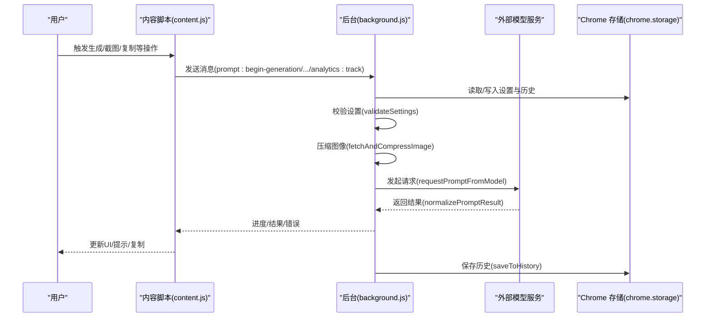
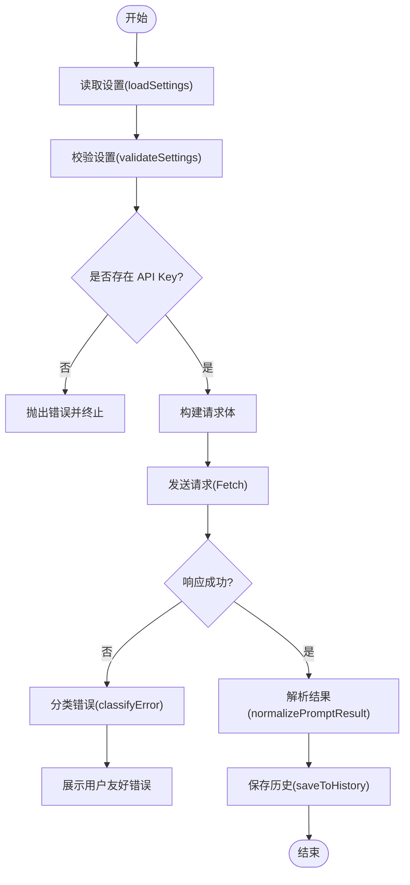
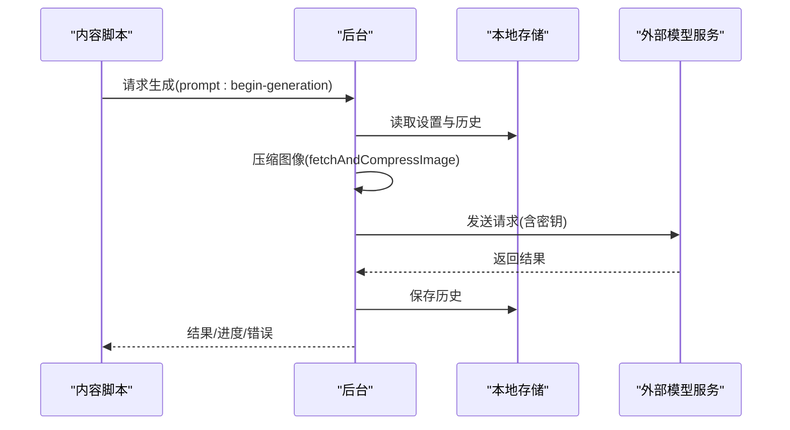
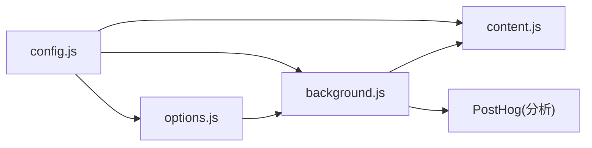

# 安全考虑

<cite>
**本文引用的文件**
- [manifest.json](file://manifest.json)
- [config.js](file://config.js)
- [background.js](file://background.js)
- [content.js](file://content.js)
- [options.js](file://options.js)
- [options.html](file://options.html)
</cite>

## 目录
1. [简介](#简介)
2. [项目结构](#项目结构)
3. [核心组件](#核心组件)
4. [架构总览](#架构总览)
5. [详细组件分析](#详细组件分析)
6. [依赖关系分析](#依赖关系分析)
7. [性能与安全权衡](#性能与安全权衡)
8. [故障排查指南](#故障排查指南)
9. [结论](#结论)
10. [附录](#附录)

## 简介
本指南面向 Img2Prompt 扩展的安全设计与实践，聚焦于 API 密钥保护、数据隐私、最小权限原则、安全配置与威胁分析。文档基于仓库源码进行逐层剖析，帮助开发者与使用者理解扩展如何在本地处理图像与提示词、如何与外部模型服务通信，并提供可操作的安全建议与防护措施。

## 项目结构
该扩展采用 Manifest V3 架构，包含后台脚本、内容脚本、选项页面与共享配置。关键文件职责如下：
- manifest.json：声明权限、主机权限、侧边栏、图标与更新地址等元信息。
- config.js：共享配置（默认设置、提示词预设、UI 文案、错误码、PostHog 分析配置等）。
- background.js：后台服务工作线程，负责消息路由、设置加载、历史记录、图像压缩、与外部模型服务通信、分析事件上报等。
- content.js：内容脚本，负责 UI 面板渲染、用户交互、进度反馈、与后台通信、截图工具等。
- options.js / options.html：设置页面，负责 API 密钥、模型、提示词、兼容性与历史记录管理。

```mermaid
graph TB
subgraph "扩展外壳"
M["manifest.json"]
C["config.js"]
end
subgraph "后台"
BG["background.js"]
end
subgraph "内容脚本"
CT["content.js"]
end
subgraph "设置页面"
OPT_HTML["options.html"]
OPT_JS["options.js"]
end
M --> BG
M --> CT
C --> BG
C --> CT
C --> OPT_JS
OPT_HTML --> OPT_JS
CT <- --> BG
OPT_JS --> BG
```

图表来源
- [manifest.json:1-45](file://manifest.json#L1-L45)
- [config.js:1-253](file://config.js#L1-L253)
- [background.js:1-120](file://background.js#L1-L120)
- [content.js:1-60](file://content.js#L1-L60)
- [options.js:1-40](file://options.js#L1-L40)

章节来源
- [manifest.json:1-45](file://manifest.json#L1-L45)
- [config.js:1-253](file://config.js#L1-L253)

## 核心组件
- 共享配置模块：集中存放默认设置、提示词预设、UI 文案、错误码与分析配置，供后台与内容脚本复用。
- 后台服务：负责设置持久化、历史记录、图像压缩、与外部模型服务通信、分析事件上报、错误分类与用户提示。
- 内容脚本：负责 UI 面板、悬浮按钮、截图工具、与后台的消息传递、剪贴板交互。
- 设置页面：负责 API 密钥、模型、提示词、兼容性与历史记录管理，并向后台发送分析事件。

章节来源
- [config.js:4-253](file://config.js#L4-L253)
- [background.js:322-463](file://background.js#L322-L463)
- [content.js:209-326](file://content.js#L209-L326)
- [options.js:182-213](file://options.js#L182-L213)

## 架构总览
扩展通过后台与内容脚本双向通信，内容脚本负责用户交互与 UI 展示，后台负责与外部模型服务通信与本地数据持久化。设置页面通过消息与后台交互，同时可触发分析事件上报。



图表来源
- [content.js:209-326](file://content.js#L209-L326)
- [background.js:212-320](file://background.js#L212-L320)
- [background.js:478-666](file://background.js#L478-L666)
- [background.js:412-463](file://background.js#L412-L463)

## 详细组件分析

### API 密钥保护
- 密钥存储位置：设置页面输入的 API Key 通过表单提交至后台，后台将其写入本地存储（chrome.storage.local）。内容脚本与设置页面均未直接在 DOM 中暴露密钥。
- 传输加密：与外部模型服务通信时，使用 HTTPS（Fetch 默认行为），并在请求头中携带密钥（不同模型服务采用不同头部，如 Authorization 或 x-api-key）。
- 访问控制策略：
  - 后台在发起请求前执行设置校验（validateSettings），若缺失密钥则抛出错误并阻止请求。
  - 错误分类包含 API 认证失败（401/403）与速率限制（429），便于用户快速定位问题。
  - 分析事件上报使用独立的 PostHog 项目密钥与主机，与业务密钥分离。



图表来源
- [background.js:322-328](file://background.js#L322-L328)
- [background.js:465-476](file://background.js#L465-L476)
- [background.js:478-666](file://background.js#L478-L666)
- [background.js:872-944](file://background.js#L872-L944)

章节来源
- [options.js:404-419](file://options.js#L404-L419)
- [background.js:465-476](file://background.js#L465-L476)
- [background.js:552-560](file://background.js#L552-L560)
- [background.js:604-611](file://background.js#L604-L611)
- [background.js:872-944](file://background.js#L872-L944)

### 数据隐私与本地处理
- 本地处理：图像获取与压缩在后台完成，支持从 URL 获取或从内容脚本传入 dataURL；压缩使用 OffscreenCanvas 与 Blob 转换，避免在 UI 线程阻塞。
- 本地存储：设置与历史记录均存储在 chrome.storage.local，不包含敏感信息（API Key 除外）。
- 外部传输：仅在用户明确触发生成时，将压缩后的图像与提示词请求体发送至外部模型服务；请求头包含密钥，响应体解析后返回给内容脚本。
- 分析数据：分析事件上报至 PostHog，包含客户端 ID、扩展版本等，但不包含用户输入的提示词或图像内容。



图表来源
- [content.js:289-318](file://content.js#L289-L318)
- [background.js:775-849](file://background.js#L775-L849)
- [background.js:478-666](file://background.js#L478-L666)
- [background.js:412-463](file://background.js#L412-L463)

章节来源
- [background.js:775-849](file://background.js#L775-L849)
- [background.js:412-463](file://background.js#L412-L463)

### 最小权限原则与权限配置
- Manifest 权限与主机权限：
  - 权限：contextMenus、storage、sidePanel、activeTab。
  - 主机权限：使用通配符匹配，允许跨站访问以实现截图与图像获取。
- 最小化实践：
  - 仅在需要时启用“悬浮按钮”和“截图快捷键”，减少不必要的 UI 与事件监听。
  - 通过设置项控制最大图像边缘像素，降低请求体积与带宽占用。
- 建议：
  - 若仅使用特定域名的模型服务，可在设置中限制主机权限范围（需自行修改 manifest）。
  - 对于高风险环境，可禁用侧边栏与截图功能，仅保留右键菜单入口。

章节来源
- [manifest.json:38-29](file://manifest.json#L38-L29)
- [options.js:404-419](file://options.js#L404-L419)

### 安全配置建议
- 网络安全：
  - 使用 HTTPS 模型服务端点，避免明文传输。
  - 在设置页面中优先选择受信任的模型服务提供商。
- 证书验证：
  - 浏览器默认进行 TLS 证书验证；若使用自建网关，确保证书链完整。
- 防篡改机制：
  - 扩展签名与更新地址由 Chrome 管理；建议定期更新以获取安全补丁。
  - 不在设置中保存敏感信息（如私有模型密钥）至公共云存储。

章节来源
- [manifest.json:42-44](file://manifest.json#L42-L44)
- [background.js:552-560](file://background.js#L552-L560)

### 安全威胁分析与防护
- 威胁类型与防护：
  - API 密钥泄露：仅在本地存储，不在 UI 显示；通过错误分类区分认证失败与速率限制。
  - 中间人攻击：使用 HTTPS；建议使用可信 CA 证书。
  - 本地数据泄露：chrome.storage.local 为扩展沙箱内存储，建议配合浏览器安全策略。
  - 恶意模型响应：对响应进行严格解析与字段校验，失败时提示用户调整 System Prompt。
  - 用户输入滥用：UI 提供复制与编辑功能，不自动上传用户输入；分析事件不含敏感内容。
- 风险缓解：
  - 保持设置页面与后台代码更新。
  - 限制主机权限范围，避免不必要的跨站访问。
  - 启用错误分类与用户提示，便于及时发现异常。

章节来源
- [background.js:872-944](file://background.js#L872-L944)
- [background.js:695-726](file://background.js#L695-L726)
- [background.js:375-401](file://background.js#L375-L401)

## 依赖关系分析
- 模块耦合：
  - config.js 作为共享配置，被 background.js、content.js、options.js 引用，降低重复与不一致风险。
  - background.js 与 content.js 通过消息通道通信，职责清晰：后台负责网络与存储，内容脚本负责 UI。
- 外部依赖：
  - Chrome Extension API（runtime、storage、tabs、contextMenus、sidePanel 等）。
  - PostHog 分析服务（独立项目密钥与主机）。
- 潜在风险：
  - 若共享配置被注入恶意内容，可能影响错误提示与分析事件；应确保扩展签名与更新来源可信。



图表来源
- [config.js:4-253](file://config.js#L4-L253)
- [background.js:1-12](file://background.js#L1-L12)
- [content.js:1-4](file://content.js#L1-L4)
- [options.js:1-7](file://options.js#L1-L7)

章节来源
- [config.js:4-253](file://config.js#L4-L253)
- [background.js:1-12](file://background.js#L1-L12)
- [content.js:1-4](file://content.js#L1-L4)
- [options.js:1-7](file://options.js#L1-L7)

## 性能与安全权衡
- 图像压缩：在后台进行，避免 UI 卡顿；可通过降低最大边像素减少网络负载与超时风险。
- 错误分类：快速定位问题（认证失败、速率限制、解析失败等），提升用户体验与安全性。
- 分析事件：异步上报，不影响主流程；用户可禁用分析以减少网络往返。

章节来源
- [background.js:775-849](file://background.js#L775-L849)
- [background.js:872-944](file://background.js#L872-L944)
- [background.js:375-401](file://background.js#L375-L401)

## 故障排查指南
- 常见错误与定位：
  - 认证失败（401/403）：检查 API Key 是否正确、模型服务是否支持该密钥形式。
  - 速率限制（429）：降低请求频率或提升配额。
  - 解析失败（JSON）：调整 System Prompt，确保输出纯 JSON。
  - 网络错误：检查网络连通性与代理设置。
- 诊断步骤：
  - 查看内容脚本 UI 的错误提示与状态栏。
  - 在设置页面查看历史记录，确认是否保存成功。
  - 在后台日志中观察分析事件上报情况（若有调试能力）。

章节来源
- [background.js:872-944](file://background.js#L872-L944)
- [options.js:215-220](file://options.js#L215-L220)

## 结论
Img2Prompt 在本地处理与存储方面遵循最小化原则，API 密钥仅在本地存储并通过 HTTPS 传输，错误分类与用户提示有助于快速定位问题。建议在生产环境中进一步限制主机权限、启用更强的证书校验，并定期更新扩展以获得最新安全补丁。通过合理配置与最小权限实践，可显著降低安全风险并提升用户体验。

## 附录
- 术语说明：
  - PostHog：开源分析平台，扩展使用独立项目密钥与主机。
  - OffscreenCanvas：在后台线程进行图像压缩，避免主线程阻塞。
- 参考路径：
  - 设置页面：[options.html:405-598](file://options.html#L405-L598)，[options.js:182-213](file://options.js#L182-L213)
  - 后台通信：[background.js:94-184](file://background.js#L94-L184)
  - 内容脚本通信：[content.js:209-247](file://content.js#L209-L247)