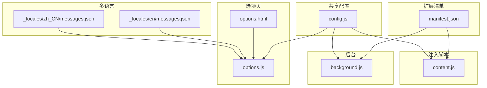
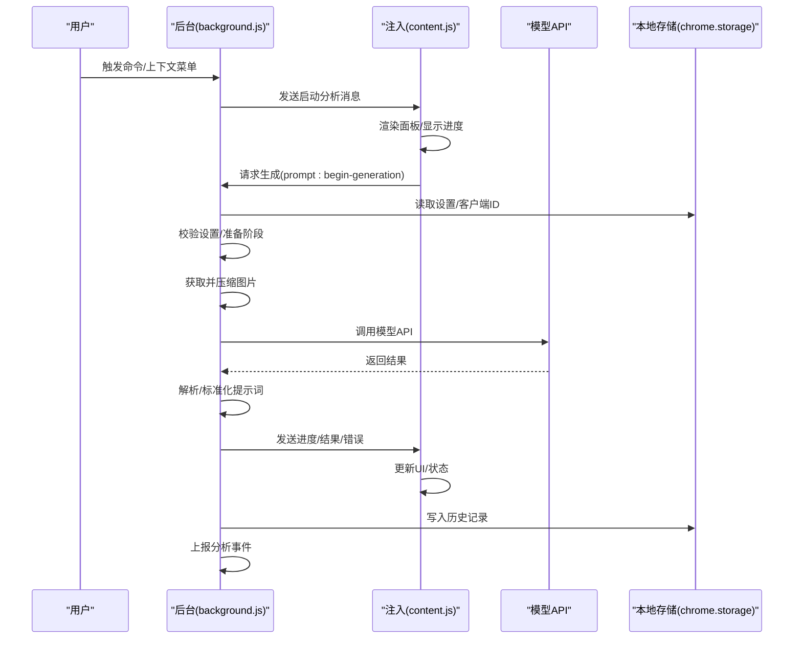
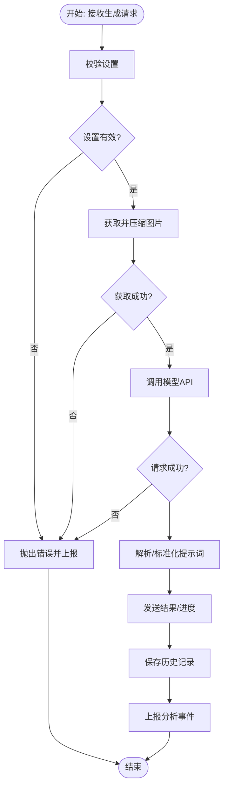
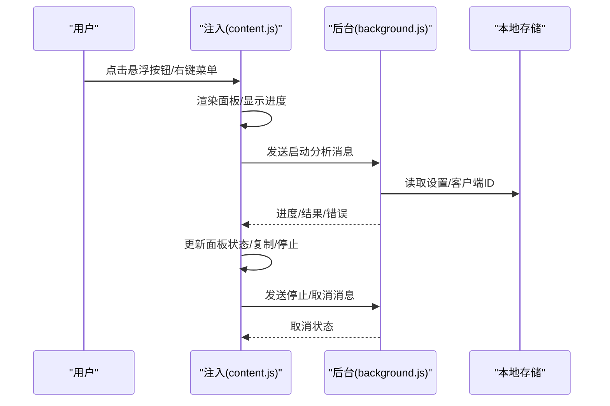
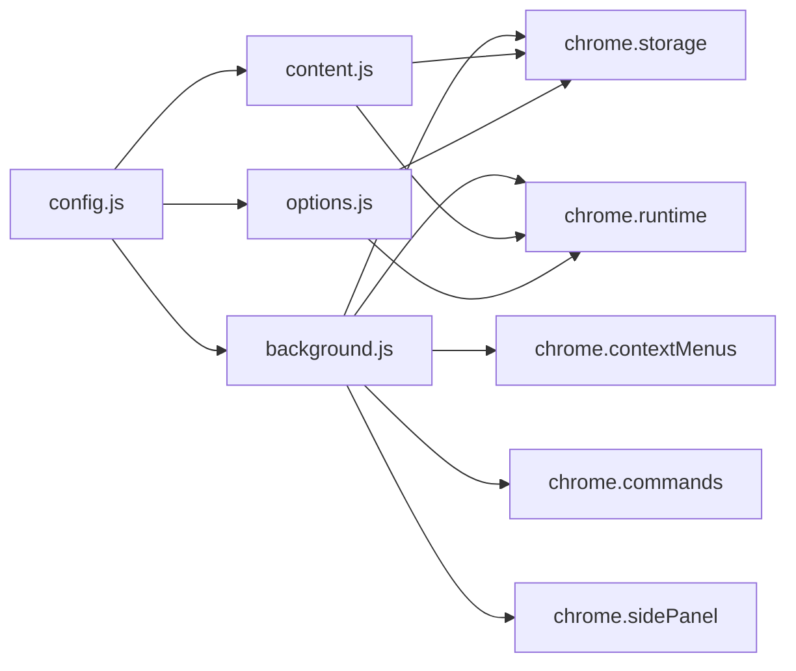

# 开发实践

<cite>
**本文引用的文件**
- [manifest.json](file://manifest.json)
- [config.js](file://config.js)
- [background.js](file://background.js)
- [content.js](file://content.js)
- [options.js](file://options.js)
- [options.html](file://options.html)
- [_locales/en/messages.json](file://_locales/en/messages.json)
- [_locales/zh_CN/messages.json](file://_locales/zh_CN/messages.json)
</cite>

## 更新摘要
**所做更改**
- 新增现代化开发实践章节，涵盖 Git 版本控制、CI/CD 工作流和 Chrome 扩展最佳实践
- 更新版本管理策略，增加语义化版本控制和变更日志管理
- 新增代码审查和持续集成流程规范
- 增强 Chrome 扩展开发最佳实践指导
- 补充 API 使用最佳实践和用户体验设计原则
- 完善测试策略和调试技巧章节

## 目录
1. [简介](#简介)
2. [项目结构](#项目结构)
3. [核心组件](#核心组件)
4. [架构总览](#架构总览)
5. [详细组件分析](#详细组件分析)
6. [依赖关系分析](#依赖关系分析)
7. [性能考量](#性能考量)
8. [故障排查指南](#故障排查指南)
9. [现代化开发实践](#现代化开发实践)
10. [测试策略与调试技巧](#测试策略与调试技巧)
11. [结论](#结论)
12. [附录](#附录)

## 简介
本指南面向 ImgPrompt 扩展的开发者与维护者，围绕代码质量、模块化设计、错误处理、维护策略、扩展开发规范、重构与架构演进、测试与调试等方面，提供系统化的实践建议。随着 Chrome 扩展生态的发展，本指南特别强调现代化开发实践，包括 Git 版本控制、CI/CD 工作流、代码审查和持续集成等最佳实践，帮助团队在保证功能稳定性的前提下，持续提升可维护性与可扩展性，并确保良好的用户体验与跨平台兼容性。

## 项目结构
该项目采用 Chrome Extension 的典型分层组织：
- manifest 定义扩展元信息、权限、命令、侧边栏、图标等
- config 提供全局共享配置（默认设置、文案、错误码、分析配置）
- background 作为服务工作线程，负责消息路由、设置持久化、历史记录、分析事件、与模型 API 通信
- content 注入页面脚本，负责 UI 面板渲染、用户交互、进度反馈、与 background 通信
- options 页面与脚本，负责设置面板、预设模板、历史记录展示与操作
- 多语言资源通过 _locales 提供

**图表来源**
- [manifest.json](file://manifest.json)
- [config.js](file://config.js)
- [background.js](file://background.js)
- [content.js](file://content.js)
- [options.js](file://options.js)
- [options.html](file://options.html)
- [_locales/en/messages.json](file://_locales/en/messages.json)
- [_locales/zh_CN/messages.json](file://_locales/zh_CN/messages.json)

**章节来源**
- [manifest.json](file://manifest.json)
- [config.js](file://config.js)
- [background.js](file://background.js)
- [content.js](file://content.js)
- [options.js](file://options.js)
- [options.html](file://options.html)
- [_locales/en/messages.json](file://_locales/en/messages.json)
- [_locales/zh_CN/messages.json](file://_locales/zh_CN/messages.json)

## 核心组件
- 共享配置模块：集中管理默认设置、文案、错误码、分析配置与预设提示词，供后台与注入脚本复用
- 后台服务工作线程：负责安装初始化、上下文菜单、快捷键、消息监听、设置同步、历史记录、分析事件、与模型 API 通信
- 注入脚本：负责 UI 面板构建与交互、悬浮按钮、进度条、复制、停止生成、与后台通信
- 选项页：负责设置表单、预设模板、自定义模板、历史记录展示与操作、语言切换
- 多语言资源：提供扩展名与描述的国际化

**章节来源**
- [config.js](file://config.js)
- [background.js](file://background.js)
- [content.js](file://content.js)
- [options.js](file://options.js)
- [options.html](file://options.html)
- [_locales/en/messages.json](file://_locales/en/messages.json)
- [_locales/zh_CN/messages.json](file://_locales/zh_CN/messages.json)

## 架构总览
扩展采用"后台 + 注入脚本 + 选项页"的三层架构，通过消息通道进行解耦；共享配置贯穿三者，确保一致性与可维护性。

**图表来源**
- [background.js](file://background.js)
- [content.js](file://content.js)

**章节来源**
- [background.js](file://background.js)
- [content.js](file://content.js)

## 详细组件分析

### 共享配置模块（config.js）
- 设计要点
  - 将默认设置、文案、错误码、分析配置与预设提示词集中管理，避免重复与不一致
  - 通过全局对象暴露给后台与注入脚本，减少重复导入
  - 错误码与错误消息按语言拆分，便于统一分类与翻译
- 数据结构与复杂度
  - 默认设置与文案为常量，读取复杂度 O(1)
  - 错误映射为哈希查找，复杂度 O(1)
- 依赖关系
  - 被 background 与 content 引用，作为只读配置源
- 最佳实践
  - 新增配置项时，遵循"默认值 + 文案 + 错误码 + 分类"的四要素
  - 语言文案与错误文案保持键名一致，便于 i18n 映射

**章节来源**
- [config.js](file://config.js)

### 后台服务工作线程（background.js）
- 功能职责
  - 安装/更新事件处理、上下文菜单创建、快捷键触发、消息路由、设置同步、历史记录、分析事件上报
  - 生成流程编排：校验设置、获取并压缩图片、调用模型 API、解析结果、发送进度与结果、错误分类与上报
- 关键流程
  - 生成流程：接收消息 -> 校验设置 -> 准备阶段 -> 获取/压缩图片 -> 调用模型 -> 解析/标准化 -> 结果回传 -> 历史记录 -> 分析事件
  - 取消流程：收到取消消息 -> 中止请求 -> 回传取消状态
- 错误处理
  - 对网络、鉴权、速率限制、超时、无效响应、JSON 解析失败、字段缺失、取消等进行分类
  - 用户友好错误消息与技术错误码分离，便于 UI 展示与日志追踪
- 性能与可靠性
  - 使用 AbortController 支持取消，避免悬挂请求
  - 进度分阶段上报，提升用户体验
  - 历史记录上限控制，避免无限增长
- 依赖关系
  - 依赖 config 提供的默认设置、文案、错误码、分析配置
  - 依赖 chrome.runtime、chrome.storage、chrome.contextMenus、chrome.commands、chrome.sidePanel 等 API

**图表来源**
- [background.js](file://background.js)

**章节来源**
- [background.js](file://background.js)

### 注入脚本（content.js）
- 功能职责
  - 构建与管理 UI 面板（Shadow DOM），处理拖拽、复制、停止生成、语言切换
  - 悬浮按钮：检测图片、遮挡检测、定位与显示
  - 截屏工具：绘制覆盖层、计算裁剪区域、生成 base64 并发起分析
  - 与后台通信：发送启动分析、取消、复制、停止等消息
- 用户体验
  - 进度条动画、扫描效果、状态文本、错误提示
  - 语言切换即时生效，面板可拖拽移动
- 交互细节
  - 阈值与尺寸控制（最大边长、质量参数）
  - 遮挡检测避免按钮被导航栏遮挡
  - 与后台的消息通道采用异步回调与错误分类

**图表来源**
- [content.js](file://content.js)
- [background.js](file://background.js)

**章节来源**
- [content.js](file://content.js)

### 选项页（options.js + options.html）
- 功能职责
  - 设置表单：API 地址、模型、密钥、用户提示词、语言、悬浮按钮、截屏快捷键、分辨率限制
  - 预设模板与自定义模板：内置场景预设 + 自定义模板 CRUD
  - 历史记录：列表展示、复制、删除、清空
  - 自动保存：防抖保存至本地存储，通知其他部分更新
  - 分析事件：记录设置保存行为
- 用户体验
  - 下拉选择器、开关、占位提示、状态提示、响应式布局
  - 一键恢复默认、版本号显示、联系开发者
- 交互细节
  - 预设芯片激活态、自定义模式切换、模板标题与内容联动
  - 历史项点击加载到主面板，失败回退到剪贴板

**章节来源**
- [options.js](file://options.js)
- [options.html](file://options.html)

## 依赖关系分析
- 模块内聚与耦合
  - config 为纯配置模块，低耦合、高内聚，被后台与注入脚本共同依赖
  - background 与 content 通过消息协议耦合，职责清晰
  - options 与 background 通过消息与存储耦合，负责设置与历史的读写
- 外部依赖
  - Chrome 扩展 API：runtime、storage、contextMenus、commands、sidePanel、tabs、i18n
  - PostHog 分析服务（可选）
- 循环依赖
  - 未发现循环依赖，模块间单向依赖清晰

**图表来源**
- [config.js](file://config.js)
- [background.js](file://background.js)
- [content.js](file://content.js)
- [options.js](file://options.js)

**章节来源**
- [config.js](file://config.js)
- [background.js](file://background.js)
- [content.js](file://content.js)
- [options.js](file://options.js)

## 性能考量
- 图像处理
  - 在后台统一执行图像获取与压缩，避免在注入脚本中进行大对象处理
  - 控制最大边长与质量参数，平衡精度与体积
- 网络请求
  - 使用 AbortController 支持取消，避免长时间挂起
  - 对 4xx/5xx 响应进行明确分类与用户提示
- 存储与历史
  - 历史记录上限控制，定期清理，避免无限增长
- UI 响应
  - 注入脚本中使用节流与防抖，减少频繁更新
  - Shadow DOM 渲染与样式隔离，避免与页面样式冲突

## 故障排查指南
- 常见问题与定位
  - 网络错误：检查 API 地址、密钥、网络连通性
  - 鉴权失败：确认密钥有效与权限范围
  - 速率限制：降低请求频率或提高配额
  - 超时：降低图片分辨率或优化网络环境
  - 无效响应：调整 System Prompt，确保返回纯 JSON
  - 取消：检查是否正确发送取消消息并终止请求
- 日志与诊断
  - 后台捕获技术错误码与用户友好消息，便于 UI 展示与日志追踪
  - 分析事件上报可辅助定位异常场景
- 用户反馈
  - 使用统一的错误文案与分类，提升可理解性

**章节来源**
- [background.js](file://background.js)
- [content.js](file://content.js)

## 现代化开发实践

### Git 版本控制最佳实践
- 分支管理策略
  - 主分支保护：master/main 分支必须通过代码审查才能合并
  - 功能分支：每个新功能开发在独立 feature/* 分支上进行
  - 修复分支：bug 修复在 fix/* 分支上进行
  - 发布分支：release/* 用于版本发布前的最终测试
- 提交规范
  - 使用约定式提交格式：type(scope): description
  - 常用类型：feat、fix、docs、style、refactor、test、chore
  - 提交信息应简洁明了，描述变更内容和原因
- 标签管理
  - 使用语义化版本控制（SemVer 2.0.0）
  - 重要里程碑打标签并添加发布说明
- 变更日志
  - 维护 CHANGELOG.md 记录每次重大变更
  - 区分破坏性变更、功能新增、bug 修复等类别

### CI/CD 工作流
- 自动化测试
  - 单元测试：配置 Jest 或 Mocha 进行单元测试
  - 集成测试：使用 Puppeteer 或 Playwright 进行端到端测试
  - 代码覆盖率：确保关键路径测试覆盖率达到 80%+
- 构建流程
  - 使用 Webpack 或 Vite 进行打包优化
  - 代码压缩与混淆，移除开发相关代码
  - 生成 Source Map 便于调试
- 发布流程
  - 自动版本号递增和标签创建
  - 自动上传到 Chrome Web Store
  - 生成发布说明和变更日志
- 质量门禁
  - 代码风格检查（ESLint、Prettier）
  - 安全漏洞扫描（npm audit、Snyk）
  - 性能基准测试

### 代码审查流程
- 审查标准
  - 代码质量：遵循 JavaScript 编码规范，无明显性能问题
  - 功能正确性：通过所有测试用例，无回归缺陷
  - 安全性：无敏感信息泄露，输入验证充分
  - 可维护性：代码结构清晰，注释完整，命名规范
- 审查工具
  - 使用 GitHub Pull Request 进行代码审查
  - 配置自动检查机器人（SonarQube、CodeClimate）
  - 代码覆盖率报告和质量指标监控

### Chrome 扩展开发最佳实践
- 权限最小化原则
  - 仅申请必要的权限，避免过度索取
  - 使用主机权限时指定具体域名而非通配符
  - 定期审查和精简权限列表
- 安全考虑
  - 输入验证和输出编码，防止 XSS 攻击
  - 使用 CSP（Content Security Policy）限制脚本执行
  - 敏感数据加密存储，避免明文传输
- 性能优化
  - Service Worker 中使用 IndexedDB 进行数据持久化
  - 懒加载非关键资源，减少初始加载时间
  - 使用 Web Workers 处理耗时任务
- 用户体验
  - 提供清晰的错误提示和帮助信息
  - 支持深色主题和无障碍访问
  - 实现平滑的过渡动画和反馈机制

### API 使用最佳实践
- 鉴权与密钥管理
  - 使用环境变量存储 API 密钥，不在前端代码中硬编码
  - 实现密钥轮换和失效检测机制
  - 对敏感请求进行 HTTPS 加密
- 限流与重试
  - 实现指数退避重试策略
  - 监控 API 使用配额，避免超额使用
  - 提供用户友好的限流提示
- 错误处理
  - 区分网络错误、业务逻辑错误和系统错误
  - 实现优雅降级和错误恢复机制
  - 记录详细的错误日志但不泄露敏感信息

### 用户体验设计原则
- 一致性
  - 保持界面元素和交互模式的一致性
  - 遵循 Chrome 扩展的设计规范
  - 统一的颜色、字体和间距
- 可访问性
  - 支持键盘导航和屏幕阅读器
  - 提供足够的颜色对比度
  - 支持多种语言和文化背景
- 响应速度
  - 优化首屏加载时间
  - 提供进度指示和加载动画
  - 实现快速的用户反馈机制

## 测试策略与调试技巧

### 测试策略
- 单元测试
  - 使用 Jest 进行 JavaScript 单元测试
  - 测试边界条件和异常情况
  - 模拟 Chrome 扩展 API 进行隔离测试
- 集成测试
  - 测试组件间的交互和数据流
  - 验证消息传递和状态同步
  - 测试与 Chrome 扩展 API 的集成
- 端到端测试
  - 使用 Puppeteer 或 Playwright 进行真实浏览器测试
  - 测试完整的用户工作流程
  - 验证跨浏览器兼容性

### 调试技巧
- 开发者工具
  - 使用 Chrome DevTools 调试内容脚本
  - 检查 Service Worker 的生命周期和错误
  - 监控网络请求和存储使用情况
- 日志记录
  - 实现结构化日志记录
  - 区分不同级别的日志（error、warn、info、debug）
  - 支持日志级别动态调整
- 性能分析
  - 使用 Performance 面板分析运行时性能
  - 监控内存使用和垃圾回收
  - 识别和解决性能瓶颈

### 持续监控
- 错误监控
  - 集成 Sentry 或类似服务进行错误追踪
  - 监控用户行为和使用模式
  - 设置关键指标告警
- 性能监控
  - 监控关键性能指标（LCP、FID、CLS）
  - 分析用户旅程和转化率
  - 收集用户反馈和满意度数据

## 结论
本项目在架构上实现了清晰的职责分离与模块化设计，通过共享配置与消息协议降低了耦合度。现代化开发实践的引入进一步提升了项目的质量保证能力和维护效率。建议在后续迭代中继续强化以下方面：完善测试体系、加强代码审查与持续集成、优化错误分类与用户提示、增强可扩展性（如多模型适配、更多预设场景）、以及持续关注 Chrome 扩展生态的 API 变更与最佳实践。通过实施这些现代化开发实践，团队可以更好地应对复杂需求变化，确保产品的长期健康发展。

## 附录

### 代码质量标准与最佳实践
- JavaScript 编码规范
  - 使用严格模式与现代语法，避免全局变量污染
  - 函数单一职责，命名语义化，注释简洁明确
  - 错误处理统一化：区分用户友好消息与技术错误码
  - 异步处理使用 Promise/async-await，避免深层回调
- 模块化设计原则
  - 配置集中化（config），逻辑分层化（background/content/options）
  - 依赖注入与消息协议，降低耦合
  - 静态资源与动态逻辑分离（HTML/CSS/JS）
- 错误处理最佳实践
  - 分类错误码与用户提示，避免泄露敏感信息
  - 统一的错误上报与日志记录
  - 可取消的请求与资源释放
- 维护策略建议
  - 版本管理：语义化版本，变更日志，分支策略（feature/fix/release）
  - 代码审查：强制审查、覆盖率阈值、静态检查
  - 持续集成：自动化测试、打包校验、发布流水线
- 扩展开发规范
  - Chrome Extension 开发：manifest 权限最小化、安全策略、隐私声明
  - API 使用：鉴权、限流、降级策略、超时与重试
  - 用户体验：无障碍、响应速度、一致性、可访问性
- 重构与架构演进
  - 渐进式重构：先引入测试，再拆分模块，最后替换实现
  - 可扩展性：抽象通用接口、支持多模型适配、插件化预设
- 测试策略与调试技巧
  - 单元测试：配置、工具函数、错误分类
  - 集成测试：消息协议、UI 交互、存储读写
  - 调试技巧：控制台日志、断点调试、分析事件追踪、网络面板抓包