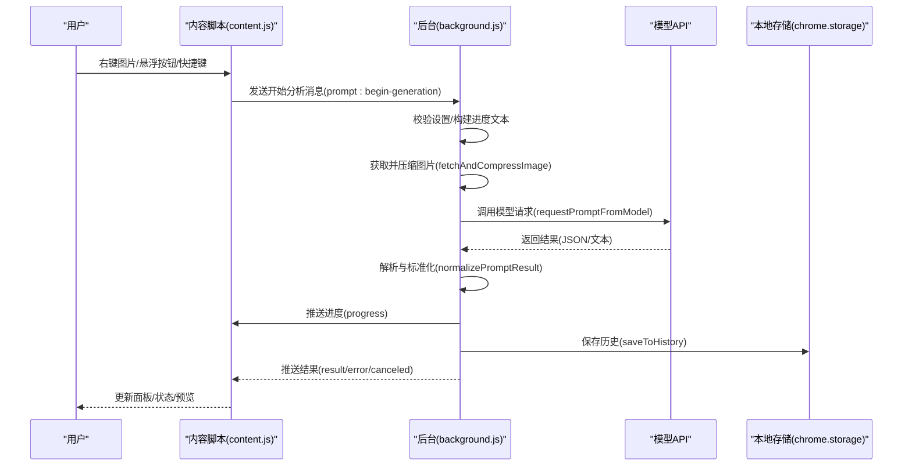
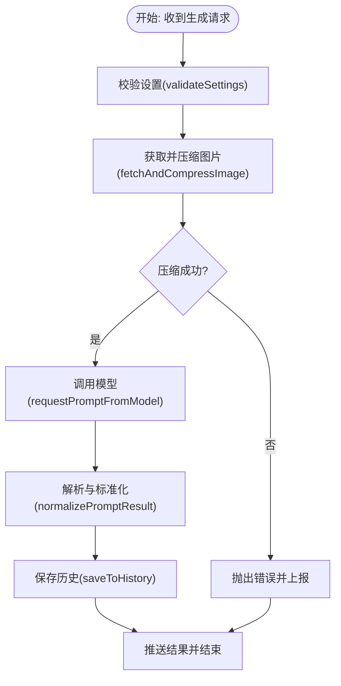
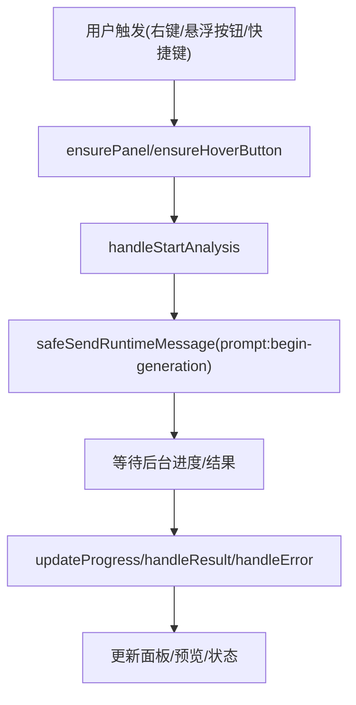
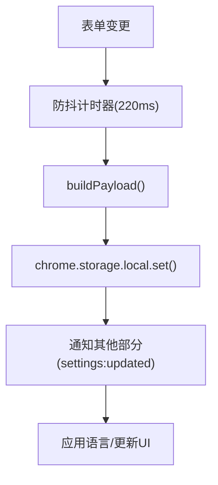

# 性能优化

<cite>
**本文引用的文件列表**
- [manifest.json](file://manifest.json)
- [config.js](file://config.js)
- [background.js](file://background.js)
- [content.js](file://content.js)
- [options.html](file://options.html)
- [options.js](file://options.js)
- [_locales\en\messages.json](file://_locales\en\messages.json)
- [_locales\zh_CN\messages.json](file://_locales\zh_CN\messages.json)
</cite>

## 目录
1. [简介](#简介)
2. [项目结构与职责划分](#项目结构与职责划分)
3. [核心组件与性能关键点](#核心组件与性能关键点)
4. [架构总览](#架构总览)
5. [详细组件性能分析](#详细组件性能分析)
6. [依赖关系与耦合分析](#依赖关系与耦合分析)
7. [性能优化策略](#性能优化策略)
8. [用户体验优化](#用户体验优化)
9. [缓存与预取机制](#缓存与预取机制)
10. [性能监控与调试](#性能监控与调试)
11. [扩展资源限制与最佳实践](#扩展资源限制与最佳实践)
12. [故障排查与常见问题](#故障排查与常见问题)
13. [结论](#结论)

## 简介
本指南面向 Img2Prompt 扩展的性能优化，聚焦于图片处理、内存管理、网络请求、用户体验与界面流畅度、缓存与预取、性能监控与调试、跨浏览器兼容等维度。通过对服务工作线程、内容脚本、选项页与共享配置的深入分析，提出可落地的优化建议与最佳实践，帮助在不同浏览器环境下稳定保持良好性能。

## 项目结构与职责划分
- manifest.json：声明扩展元信息、权限、后台脚本、内容脚本注入范围与快捷键等。
- config.js：共享配置（默认设置、提示词预设、UI 文案、错误码与消息、分析上报配置）。
- background.js：服务工作线程，负责上下文菜单触发、截图捕获、图像拉取与压缩、调用模型、进度与结果分发、历史记录持久化、分析事件上报。
- content.js：内容脚本，负责悬浮按钮、主面板渲染、用户交互、进度更新、错误展示、与后台通信。
- options.html/js：设置页与逻辑，负责用户设置持久化、预设模板管理、历史记录展示与操作、自动保存与即时生效。
- 国际化文件：扩展名与描述的多语言支持。

```mermaid
graph TB
subgraph "扩展层"
BG["background.js<br/>服务工作线程"]
CT["content.js<br/>内容脚本"]
OPT["options.html/js<br/>设置页"]
end
subgraph "配置与资源"
CFG["config.js<br/>共享配置"]
MAN["manifest.json<br/>清单与权限"]
LOC["locales<br/>多语言文案"]
end
CT <- --> BG
OPT <- --> BG
CT --- CFG
BG --- CFG
OPT --- CFG
MAN --- BG
MAN --- CT
MAN --- OPT
CFG --- LOC
```

图表来源
- [manifest.json:1-45](file://manifest.json#L1-L45)
- [config.js:1-253](file://config.js#L1-L253)
- [background.js:1-945](file://background.js#L1-L945)
- [content.js:1-1578](file://content.js#L1-L1578)
- [options.html:1-687](file://options.html#L1-L687)
- [options.js:1-551](file://options.js#L1-L551)

章节来源
- [manifest.json:1-45](file://manifest.json#L1-L45)
- [config.js:1-253](file://config.js#L1-L253)

## 核心组件与性能关键点
- 服务工作线程（background.js）
  - 图像获取与压缩：统一处理远端 URL 与 dataURL，使用 OffscreenCanvas 压缩，避免主线程阻塞。
  - 模型请求：根据模型前缀自动选择请求格式（OpenAI 兼容或 Anthropic），支持超时与速率限制处理。
  - 进度与错误：通过消息通道向内容脚本推送阶段进度与错误码，便于 UI 反馈。
  - 历史记录：本地存储历史项，限制最大条目数，避免无限增长。
- 内容脚本（content.js）
  - 面板与悬浮按钮：Shadow DOM 渲染，节流指针移动事件，减少重绘与布局抖动。
  - 用户交互：复制、停止生成、语言切换、预览更新等均通过消息与后台解耦。
- 设置页（options.html/js）
  - 自动保存：防抖保存，避免频繁写入存储；即时通知其他部分刷新。
  - 历史记录：懒加载图片缩略图，减少初始渲染压力。
- 共享配置（config.js）
  - 默认设置、提示词预设、UI 文案、错误码映射、分析上报配置集中管理，便于统一优化。

章节来源
- [background.js:170-320](file://background.js#L170-L320)
- [background.js:775-849](file://background.js#L775-L849)
- [background.js:478-666](file://background.js#L478-L666)
- [content.js:5-28](file://content.js#L5-L28)
- [content.js:596-725](file://content.js#L596-L725)
- [options.js:387-405](file://options.js#L387-L405)
- [config.js:4-253](file://config.js#L4-L253)

## 架构总览
下图展示了从用户触发到生成完成的关键流程，以及各模块间的调用关系与数据流向。



图表来源
- [content.js:249-326](file://content.js#L249-L326)
- [background.js:212-320](file://background.js#L212-L320)
- [background.js:478-666](file://background.js#L478-L666)
- [background.js:412-463](file://background.js#L412-L463)

## 详细组件性能分析

### 服务工作线程（background.js）
- 图像获取与压缩
  - 统一入口：优先处理 dataURL，再按需拉取远端 URL；使用 createImageBitmap + OffscreenCanvas + convertToBlob 实现高质量压缩，避免主线程阻塞。
  - 边界处理：空 Blob、非图片类型、压缩失败等异常路径均有明确报错与错误码分类。
- 模型请求
  - 自动格式判定：基于模型名前缀自动选择 OpenAI 兼容或 Anthropic 接口，减少用户配置负担。
  - 错误分类：网络、鉴权、速率限制、超时、JSON 解析、字段缺失等，分别映射到统一错误码，便于 UI 展示与统计。
- 进度与结果
  - 分阶段进度：准备配置、获取图片、调用模型、整理提示词、完成。
  - 取消机制：AbortController + activeRequests 映射，支持中途取消。
- 历史记录
  - 本地持久化：限制最大条目数，避免无限增长导致内存压力。



图表来源
- [background.js:212-320](file://background.js#L212-L320)
- [background.js:775-849](file://background.js#L775-L849)
- [background.js:478-666](file://background.js#L478-L666)
- [background.js:412-463](file://background.js#L412-L463)

章节来源
- [background.js:212-320](file://background.js#L212-L320)
- [background.js:775-849](file://background.js#L775-L849)
- [background.js:478-666](file://background.js#L478-L666)
- [background.js:412-463](file://background.js#L412-L463)

### 内容脚本（content.js）
- 交互与渲染
  - 面板与悬浮按钮：Shadow DOM 渲染，避免样式污染；位置更新节流，减少布局抖动。
  - 语言切换：动态更新静态文案与状态文本，避免全量重绘。
- 消息处理
  - 进度、结果、错误、取消等消息分支清晰，UI 状态切换及时。
- 安全发送
  - safeSendRuntimeMessage 包装消息发送，过滤“扩展上下文失效”类错误，避免异常冒泡。



图表来源
- [content.js:249-326](file://content.js#L249-L326)
- [content.js:596-725](file://content.js#L596-L725)
- [content.js:209-247](file://content.js#L209-L247)

章节来源
- [content.js:5-28](file://content.js#L5-L28)
- [content.js:249-326](file://content.js#L249-L326)
- [content.js:596-725](file://content.js#L596-L725)
- [content.js:209-247](file://content.js#L209-L247)

### 设置页（options.html/js）
- 自动保存与即时生效
  - 防抖保存（约 220ms），合并多次变更；变更后立即通知其他部分刷新，保证 UI 一致性。
- 历史记录展示
  - 懒加载缩略图，减少初始渲染开销；删除与复制操作异步执行，避免阻塞。
- 下拉选择器
  - 自定义下拉，视觉状态与隐藏 select 同步，避免原生样式差异带来的额外重排。



图表来源
- [options.js:387-405](file://options.js#L387-L405)
- [options.js:407-422](file://options.js#L407-L422)
- [options.js:400-404](file://options.js#L400-L404)

章节来源
- [options.html:1-687](file://options.html#L1-L687)
- [options.js:387-405](file://options.js#L387-L405)
- [options.js:407-422](file://options.js#L407-L422)

## 依赖关系与耦合分析
- 模块内聚与解耦
  - content.js 与 background.js 通过消息协议解耦，职责清晰：前者负责 UI 与交互，后者负责业务与 IO。
  - config.js 提供全局配置与常量，避免硬编码，提高可维护性。
- 外部依赖
  - chrome.* API：上下文菜单、存储、消息、侧边栏、命令等。
  - 浏览器特性：OffscreenCanvas、createImageBitmap、AbortController、Shadow DOM。
- 潜在风险
  - 存储写入频率：自动保存可能在高频输入时造成写入压力，可通过合并策略进一步优化。
  - 图像压缩：大图压缩耗时与内存占用较高，应结合分辨率限制与质量参数调优。

章节来源
- [manifest.json:10-26](file://manifest.json#L10-L26)
- [config.js:4-253](file://config.js#L4-L253)
- [background.js:17-17](file://background.js#L17-L17)
- [content.js:1-50](file://content.js#L1-L50)

## 性能优化策略

### 图片处理优化
- 压缩策略
  - 使用 OffscreenCanvas + convertToBlob 进行高质量压缩，避免主线程阻塞。
  - 质量参数与最大边长可配置，默认 1024px、约 0.92 JPEG 质量，兼顾体积与清晰度。
- 数据来源适配
  - dataURL 与远端 URL 统一入口，优先 dataURL 减少网络往返。
  - 对非图片类型进行告警与降级处理，避免后续解析失败。
- 大图与内存
  - 通过 maxImageEdge 限制输入尺寸，防止 OOM；必要时在 UI 提示用户降低分辨率。

章节来源
- [background.js:775-849](file://background.js#L775-L849)
- [background.js:815-840](file://background.js#L815-L840)
- [config.js:13-20](file://config.js#L13-L20)

### 内存管理
- 临时对象释放
  - createImageBitmap 后及时 close，避免残留。
  - OffscreenCanvas 使用后不再复用，避免跨帧状态污染。
- 存储与历史
  - 历史记录限制最大条目数，定期清理，避免无限增长。
- UI 与事件
  - 节流指针移动事件，减少频繁布局与绘制。
  - Shadow DOM 隔离样式与节点，降低全局影响。

章节来源
- [background.js:832-832](file://background.js#L832-L832)
- [background.js:421-421](file://background.js#L421-L421)
- [content.js:99-99](file://content.js#L99-L99)

### 网络请求优化
- 请求格式自动选择
  - 基于模型名前缀自动选择 OpenAI 兼容或 Anthropic 接口，减少配置错误。
- 错误分类与重试
  - 将网络、鉴权、速率限制、超时、JSON 解析、字段缺失等错误分类，便于 UI 与日志区分。
- 超时与取消
  - 使用 AbortController 支持中途取消，避免资源浪费。
- 缓存与预取
  - 当前未实现网络层缓存；可在后台对相同图片/请求做去重与缓存，减少重复网络与模型调用。

章节来源
- [background.js:505-515](file://background.js#L505-L515)
- [background.js:873-939](file://background.js#L873-L939)
- [background.js:219-220](file://background.js#L219-L220)

### 用户体验优化
- 加载速度
  - 面板与悬浮按钮采用 Shadow DOM，减少样式冲突与重排。
  - 自动保存防抖，避免频繁写入导致 UI 卡顿。
- 响应时间
  - 分阶段进度推送，让用户感知处理过程。
  - 错误分类与友好提示，减少用户困惑。
- 界面流畅度
  - 指针移动事件节流，滚动与窗口大小变化时位置更新节流。
  - 懒加载历史记录缩略图，减少初始渲染压力。

章节来源
- [content.js:596-725](file://content.js#L596-L725)
- [content.js:100-101](file://content.js#L100-L101)
- [options.js:387-405](file://options.js#L387-L405)

## 用户体验优化
- 面板与悬浮按钮
  - 采用 Shadow DOM，避免样式污染；位置更新节流，减少布局抖动。
- 语言与文案
  - 动态更新静态文案与状态文本，支持即时切换。
- 历史记录
  - 懒加载缩略图，复制与删除异步执行，避免阻塞。
- 快捷键与截图
  - 截屏工具支持框选区域，设备像素比处理，保证清晰度。

章节来源
- [content.js:165-207](file://content.js#L165-L207)
- [content.js:489-594](file://content.js#L489-L594)
- [options.html:1-687](file://options.html#L1-L687)

## 缓存与预取机制
- 现状
  - 本地历史记录缓存（chrome.storage），限制最大条目数。
  - 未实现网络层缓存与模型结果缓存。
- 建议
  - 图像缓存：对相同 URL 的图片请求结果进行缓存，避免重复下载与压缩。
  - 结果缓存：对相同图片与参数组合的结果进行缓存，命中则直接返回。
  - 预取：在用户浏览图片时，基于可见性与交互概率进行轻量预取，降低首帧延迟。

章节来源
- [background.js:412-463](file://background.js#L412-L463)
- [background.js:775-849](file://background.js#L775-L849)

## 性能监控与调试
- 分析事件
  - 使用 PostHog 上报安装、更新、生成开始/成功/失败、设置保存等事件，便于追踪性能与使用趋势。
- 错误分类
  - 统一错误码与用户友好消息，便于前端展示与日志分析。
- 调试建议
  - 在后台开启详细日志，记录阶段耗时与错误详情。
  - 使用浏览器性能面板观察主线程与合成线程的占用情况，定位卡顿原因。

章节来源
- [config.js:249-252](file://config.js#L249-L252)
- [background.js:359-410](file://background.js#L359-L410)
- [background.js:873-944](file://background.js#L873-L944)

## 扩展资源限制与最佳实践
- Manifest 权限与行为
  - 正确声明 contextMenus、storage、sidePanel、activeTab 等权限，避免过度授权。
  - 侧边栏行为与命令按键在 manifest 中声明，确保跨浏览器一致性。
- 浏览器兼容
  - OffscreenCanvas、createImageBitmap、AbortController 等特性在不同浏览器版本支持度不同，需在 UI 中提供降级提示。
- 资源与内存
  - 严格限制历史记录数量与图片分辨率，避免内存与存储压力。
  - 对大图与高分辨率场景，建议在 UI 提示用户降低分辨率。

章节来源
- [manifest.json:10-26](file://manifest.json#L10-L26)
- [config.js:13-20](file://config.js#L13-L20)
- [background.js:421-421](file://background.js#L421-L421)

## 故障排查与常见问题
- 图片无法获取/处理
  - 检查图片 URL 是否可访问、是否为图片类型；查看后台日志与错误码。
- 模型请求失败
  - 检查 API Endpoint、API Key、模型名称与温度设置；关注 401/403/429/5xx 等状态码。
- 生成被取消
  - 检查是否主动点击停止按钮或标签页关闭导致上下文失效。
- UI 不响应
  - 检查内容脚本与后台通信是否正常，是否存在扩展上下文失效错误。

章节来源
- [background.js:873-944](file://background.js#L873-L944)
- [content.js:56-63](file://content.js#L56-L63)

## 结论
通过将图片处理与网络请求集中在后台、UI 与交互在内容脚本中实现、配置与资源在共享模块中统一管理，Img2Prompt 已具备清晰的职责分离与良好的可维护性。建议在现有基础上进一步引入缓存与预取、优化自动保存策略、完善错误分类与降级提示，并持续监控与迭代，以在不同浏览器环境中保持稳定的高性能表现。