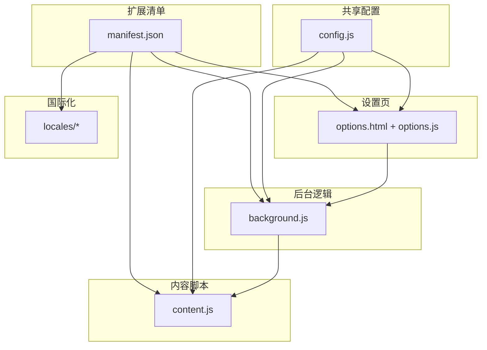
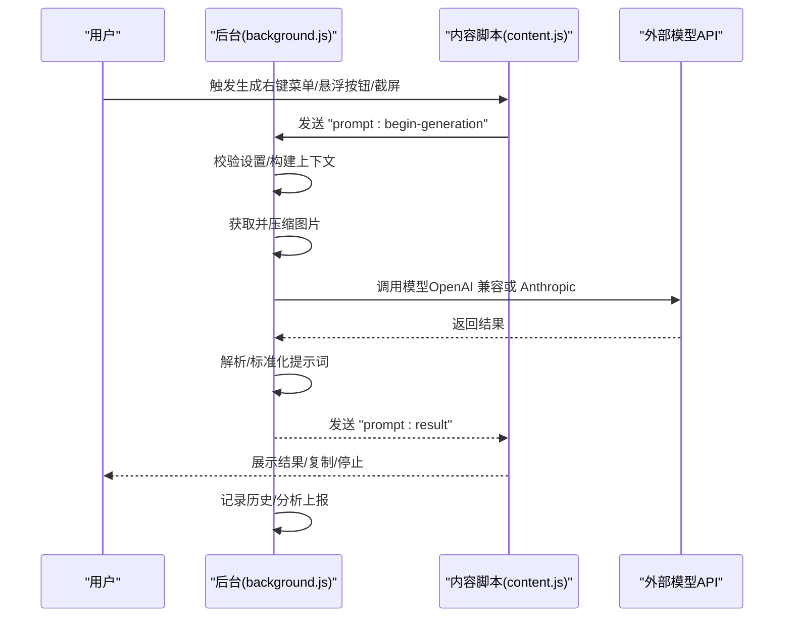
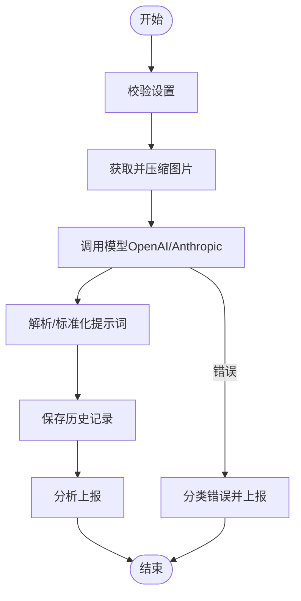
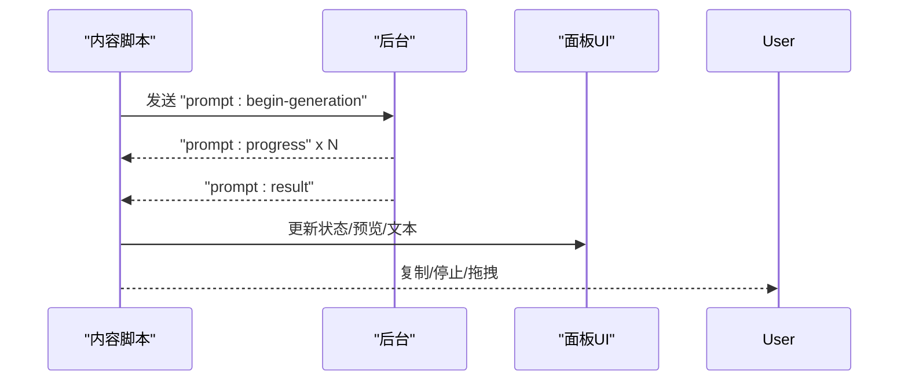
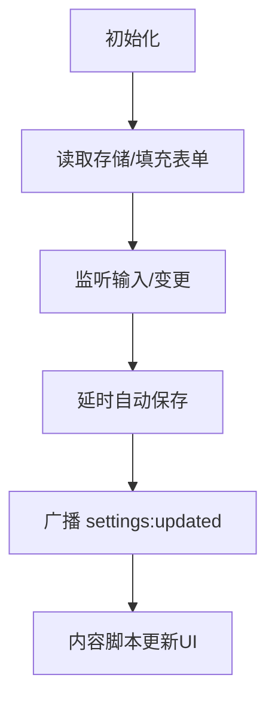

# 最佳实践

<cite>
**本文引用的文件**
- [manifest.json](file://manifest.json)
- [config.js](file://config.js)
- [background.js](file://background.js)
- [content.js](file://content.js)
- [options.js](file://options.js)
- [options.html](file://options.html)
- [_locales/en/messages.json](file://_locales/en/messages.json)
- [_locales/zh_CN/messages.json](file://_locales/zh_CN/messages.json)
</cite>

## 目录
1. [简介](#简介)
2. [项目结构](#项目结构)
3. [核心组件](#核心组件)
4. [架构总览](#架构总览)
5. [详细组件分析](#详细组件分析)
6. [依赖关系分析](#依赖关系分析)
7. [性能优化建议](#性能优化建议)
8. [安全与隐私最佳实践](#安全与隐私最佳实践)
9. [用户体验设计原则](#用户体验设计原则)
10. [提示词优化策略](#提示词优化策略)
11. [图片质量与工作流优化](#图片质量与工作流优化)
12. [扩展开发最佳实践](#扩展开发最佳实践)
13. [故障排查指南](#故障排查指南)
14. [结论](#结论)
15. [附录](#附录)

## 简介
本指南面向 ImgPrompt 扩展的使用者与开发者，系统总结如何高效、安全地使用该扩展，并提供提示词优化、图片质量与工作流、性能与安全、用户体验设计以及扩展开发的最佳实践。文档基于仓库源码进行分析，结合实际实现细节给出可操作的建议与流程图示。

## 项目结构
该扩展采用 Manifest V3 架构，核心由后台脚本、内容脚本、选项页面与共享配置组成：
- manifest.json：声明权限、命令、侧边栏、图标与版本信息
- config.js：共享配置（默认设置、提示词预设、UI 文案、错误码、分析上报配置）
- background.js：服务工作线程，负责消息路由、生成流程编排、历史记录、分析上报、图像压缩与模型请求
- content.js：内容脚本，负责 UI 面板渲染、事件绑定、进度反馈、与后台通信
- options.js / options.html：设置页与历史记录展示，支持多语言、快捷保存、历史复制与删除
- _locales/*：国际化文案



图表来源
- [manifest.json:1-45](file://manifest.json#L1-L45)
- [config.js:1-253](file://config.js#L1-L253)
- [background.js:1-945](file://background.js#L1-L945)
- [content.js:1-1578](file://content.js#L1-L1578)
- [options.js:1-489](file://options.js#L1-L489)
- [options.html:1-572](file://options.html#L1-L572)

章节来源
- [manifest.json:1-45](file://manifest.json#L1-L45)
- [config.js:1-253](file://config.js#L1-L253)

## 核心组件
- 共享配置模块：集中管理默认设置、提示词预设、UI 文案、错误码与分析上报参数
- 后台服务工作线程：统一处理生成流程、图像获取与压缩、模型请求、进度与结果分发、历史记录与分析上报
- 内容脚本：负责 UI 面板、悬浮按钮、进度条、复制与停止等交互
- 设置页：提供连接设置、提示词模板、体验设置、兼容性设置与历史记录管理
- 国际化：支持中英文文案映射

章节来源
- [config.js:1-253](file://config.js#L1-L253)
- [background.js:1-945](file://background.js#L1-L945)
- [content.js:1-1578](file://content.js#L1-L1578)
- [options.js:1-489](file://options.js#L1-L489)
- [options.html:1-572](file://options.html#L1-L572)

## 架构总览
扩展采用“后台服务工作线程 + 内容脚本”的双层架构，通过消息通道进行解耦协作；设置页通过存储与消息通知实现全局状态同步。



图表来源
- [background.js:212-320](file://background.js#L212-L320)
- [content.js:249-326](file://content.js#L249-L326)

## 详细组件分析

### 后台服务工作线程（background.js）
职责与关键点：
- 生命周期与安装初始化：创建上下文菜单、侧边栏行为、默认设置写入、首次安装/更新事件上报
- 命令与消息处理：监听截图命令、上下文菜单点击、分析事件上报、侧边栏打开、历史记录 CRUD、设置变更广播
- 生成流程编排：校验设置、获取并压缩图片、调用模型、解析结果、进度与错误处理、历史记录持久化、分析上报
- 错误分类与用户友好提示：根据状态码与异常类型映射为 UI 友好消息
- 图像处理：支持 dataURL 直传与远端图片拉取，统一压缩以控制体积
- 模型适配：自动识别 Claude/OpenAI 兼容模式，分别构造请求体与头部



图表来源
- [background.js:212-320](file://background.js#L212-L320)
- [background.js:478-666](file://background.js#L478-L666)
- [background.js:775-800](file://background.js#L775-L800)

章节来源
- [background.js:1-945](file://background.js#L1-L945)

### 内容脚本（content.js）
职责与关键点：
- UI 面板与悬浮按钮：动态挂载 Shadow DOM 面板，支持拖拽、复制、停止、预览与语言切换
- 进度与状态管理：接收后台进度消息，更新面板状态文本与 UI
- 事件与交互：键盘快捷键触发截屏、右键菜单触发分析、悬浮按钮快速分析
- 设置同步：监听存储变化，即时更新 UI 语言与偏好
- 容错与降级：对扩展上下文失效等错误进行安全发送与降级处理



图表来源
- [content.js:209-247](file://content.js#L209-L247)
- [content.js:249-326](file://content.js#L249-L326)

章节来源
- [content.js:1-1578](file://content.js#L1-L1578)

### 设置页（options.js + options.html）
职责与关键点：
- 连接设置：API 端点、模型名、API Key 的输入与保存
- 提示词模板：内置多场景预设与自定义模板管理（增删改查）
- 使用体验：悬浮按钮开关、截屏快捷键开关、面板语言切换
- 兼容性设置：最大图片边长下拉选择
- 历史记录：列表展示、复制、删除、清空
- 自动保存与全局通知：变更后自动保存并广播给内容脚本



图表来源
- [options.js:182-213](file://options.js#L182-L213)
- [options.js:384-402](file://options.js#L384-L402)

章节来源
- [options.js:1-489](file://options.js#L1-L489)
- [options.html:1-572](file://options.html#L1-L572)

### 共享配置（config.js）
职责与关键点：
- 默认设置：API 端点、模型、请求格式、Anthropic 版本、最大分辨率、温度、系统/用户提示词
- 提示词预设：多场景模板（通用、摄影、CG、平面设计、UI、3D 资产、电商产品）
- UI 文案：中英文状态文本与界面文案
- 错误码与错误消息：网络、鉴权、速率限制、解析失败等分类
- 分析上报：PostHog 项目键与主机、分析开关键名

章节来源
- [config.js:1-253](file://config.js#L1-L253)

## 依赖关系分析
- manifest.json 声明权限与命令，决定后台与内容脚本的注入时机与能力范围
- config.js 作为共享模块被后台、内容脚本与设置页共同引用
- background.js 与 content.js 通过消息通道通信，实现 UI 与业务逻辑解耦
- options.js 通过存储与消息广播实现全局状态同步

```mermaid
graph LR
M["manifest.json"] --> BG["background.js"]
M --> CT["content.js"]
M --> OPT["options.html + options.js"]
C["config.js"] --> BG
C --> CT
C --> OPT
BG <- --> CT
OPT <- --> BG
```

图表来源
- [manifest.json:1-45](file://manifest.json#L1-L45)
- [config.js:1-253](file://config.js#L1-L253)
- [background.js:1-945](file://background.js#L1-L945)
- [content.js:1-1578](file://content.js#L1-L1578)
- [options.js:1-489](file://options.js#L1-L489)
- [options.html:1-572](file://options.html#L1-L572)

章节来源
- [manifest.json:1-45](file://manifest.json#L1-L45)

## 性能优化建议
- 图像压缩与体积控制
  - 在后台统一执行图像获取与压缩，避免重复下载与大体积传输
  - 通过设置页的“最大图片边长”降低分辨率，减少请求体大小，提高稳定性
  - 对 dataURL 直传场景也进行压缩，确保体积可控
- 并发与超时
  - 使用 AbortController 支持取消请求，避免长时间占用
  - 对模型请求设置合理超时与重试策略（可在扩展层增加指数退避）
- UI 响应与节流
  - 内容脚本对高频事件（如指针移动）进行节流，减少重绘与消息发送频率
  - 进度更新采用定时器与增量推进，避免频繁 DOM 更新
- 存储与历史
  - 历史记录限制最大条目数，避免无限增长导致存储压力
  - 异步写入与错误兜底，保证稳定性

章节来源
- [background.js:775-800](file://background.js#L775-L800)
- [content.js:5-28](file://content.js#L5-L28)
- [background.js:412-463](file://background.js#L412-L463)

## 安全与隐私最佳实践
- API 密钥保护
  - API Key 仅保存在本地存储，不在前端日志或错误中泄露
  - 建议使用只读权限的 API 密钥，限制模型调用范围
- 数据隐私
  - 仅在用户明确同意的情况下启用分析上报；默认开启可通过设置页关闭
  - 上报字段尽量匿名化，避免包含可识别信息
- 最小权限原则
  - manifest 中按需声明权限，避免过度授权
  - 仅在必要时访问页面内容与剪贴板
- 输入校验与错误处理
  - 对模型返回内容进行严格解析与清洗，避免注入风险
  - 将错误映射为用户可理解的消息，避免暴露内部细节

章节来源
- [config.js:206-247](file://config.js#L206-L247)
- [background.js:359-410](file://background.js#L359-L410)
- [manifest.json:29-38](file://manifest.json#L29-L38)

## 用户体验设计原则
- 明确的状态反馈
  - 使用阶段化进度文本与图标，让用户感知处理过程
- 即时可用的入口
  - 悬浮按钮与右键菜单提供快速入口，降低学习成本
- 可编辑与可复制
  - 生成结果可直接编辑，一键复制到剪贴板
- 多语言支持
  - 设置页支持中英文切换，UI 文案与历史记录均随语言切换
- 历史记录与复用
  - 历史记录支持复制与删除，便于复用与清理

章节来源
- [content.js:165-207](file://content.js#L165-L207)
- [options.js:421-451](file://options.js#L421-L451)
- [options.html:379-572](file://options.html#L379-L572)

## 提示词优化策略
- 系统提示词（System Prompt）
  - 明确角色与输出格式，要求严格 JSON，包含中英双语字段
  - 覆盖主题、构图、风格、光线、镜头/镜头线索、色彩、材质、背景、情绪、质量提示与宽高比
- 用户提示词（User Prompt）
  - 针对不同场景选择预设模板，或自定义具体任务描述
  - 保持简洁明确，避免歧义与冗余
- 输出解析与清洗
  - 若模型返回非严格 JSON，尝试清洗与提取 JSON 片段
  - 缺失字段时回退至另一语言，确保可用性

章节来源
- [config.js:15-20](file://config.js#L15-L20)
- [config.js:22-30](file://config.js#L22-L30)
- [background.js:695-726](file://background.js#L695-L726)

## 图片质量与工作流优化
- 图像来源与格式
  - 优先使用 dataURL（已压缩）或可直接上传的 base64，避免跨域与不可读问题
  - 对远端图片进行缓存与校验，确保内容类型为 image/*
- 分辨率与体积
  - 通过设置页调节最大边长，平衡质量与体积
  - 截图工具支持框选区域，提升聚焦度与效率
- 工作流建议
  - 先在设置页配置好 API 端点、模型与密钥
  - 选择合适的提示词模板，必要时微调
  - 使用悬浮按钮或右键菜单快速分析，或使用截屏工具聚焦局部区域

章节来源
- [background.js:775-800](file://background.js#L775-L800)
- [content.js:489-594](file://content.js#L489-L594)
- [options.js:528-539](file://options.js#L528-L539)

## 扩展开发最佳实践
- 代码质量
  - 统一错误分类与消息映射，便于维护与国际化
  - 使用 AbortController 管理异步请求生命周期
  - 对高频事件进行节流与去抖
- 维护策略
  - 将共享配置集中管理，避免分散常量
  - 通过消息通道解耦 UI 与业务逻辑
  - 为新增功能预留扩展点（如新的模型格式、新的提示词模板）
- 测试与可观测性
  - 为关键路径添加单元测试与集成测试
  - 通过分析上报收集关键指标（成功率、耗时、错误类型）

章节来源
- [config.js:206-247](file://config.js#L206-L247)
- [content.js:5-28](file://content.js#L5-L28)
- [background.js:134-147](file://background.js#L134-L147)

## 故障排查指南
- 常见错误与处理
  - 网络错误：检查网络连通性与代理设置
  - 鉴权失败：核对 API Key 是否正确与过期
  - 速率限制：降低调用频率或升级配额
  - 解析失败：调整 System Prompt，确保输出严格 JSON
  - 图像获取失败：确认图片 URL 可访问，或换用 dataURL
- 用户反馈
  - 使用后台错误分类与 UI 友好消息，帮助用户快速定位问题
  - 提供历史记录查看与复制，便于复现与反馈

章节来源
- [background.js:296-317](file://background.js#L296-L317)
- [config.js:220-247](file://config.js#L220-L247)

## 结论
ImgPrompt 通过清晰的后台-内容脚本分层与共享配置，提供了稳定、可扩展的图片转提示词能力。遵循本文的安全、性能、提示词与工作流最佳实践，可显著提升生成质量与用户体验；同时，基于现有架构进行扩展与优化，能够持续满足多样化场景需求。

## 附录
- 实际案例研究与成功应用示例
  - 摄影场景：使用“📸 摄影”模板，提取光线质量、色温、对比度、镜头光学与胶片属性，生成高质量摄影提示词
  - CG 场景：使用“🎨 插画CG”模板，关注笔触动态、色彩理论、光照与材质，辅助数字艺术创作
  - UI 场景：使用“📱 界面 UI”模板，抽取设计系统、组件特征、设计令牌与界面风格，提升设计一致性
  - 电商产品：使用“👕 电商产品”模板，聚焦灯光布置、材质质感与品牌细节，提升商品展示效果
  - 通用场景：使用“通用”模板，进行结构化解析与色彩和谐系统提取，适用于多种图像类型

章节来源
- [config.js:22-30](file://config.js#L22-L30)