# AI 模型集成

<cite>
**本文档引用的文件**
- [background.js](file://background.js)
- [content.js](file://content.js)
- [config.js](file://config.js)
- [manifest.json](file://manifest.json)
- [options.html](file://options.html)
- [options.js](file://options.js)
</cite>

## 目录
1. [简介](#简介)
2. [项目结构](#项目结构)
3. [核心组件](#核心组件)
4. [架构概览](#架构概览)
5. [详细组件分析](#详细组件分析)
6. [依赖关系分析](#依赖关系分析)
7. [性能考虑](#性能考虑)
8. [故障排除指南](#故障排除指南)
9. [结论](#结论)

## 简介

Img2Prompt 是一个 Chrome 扩展程序，专门用于将图像转换为 AI 提示词。该扩展的核心功能是通过 AI 模型分析图像内容，并生成详细的中文和英文提示词，这些提示词可以用于图像生成模型（如 Midjourney、DALL-E 等）。

该扩展支持多种 AI 服务提供商，包括 OpenAI 兼容接口和 Anthropic Claude 接口。它具有智能的模型自动检测机制，能够根据模型名称自动选择合适的请求格式，实现了高度的兼容性和灵活性。

## 项目结构

Img2Prompt 采用典型的 Chrome 扩展程序架构，包含以下主要组件：

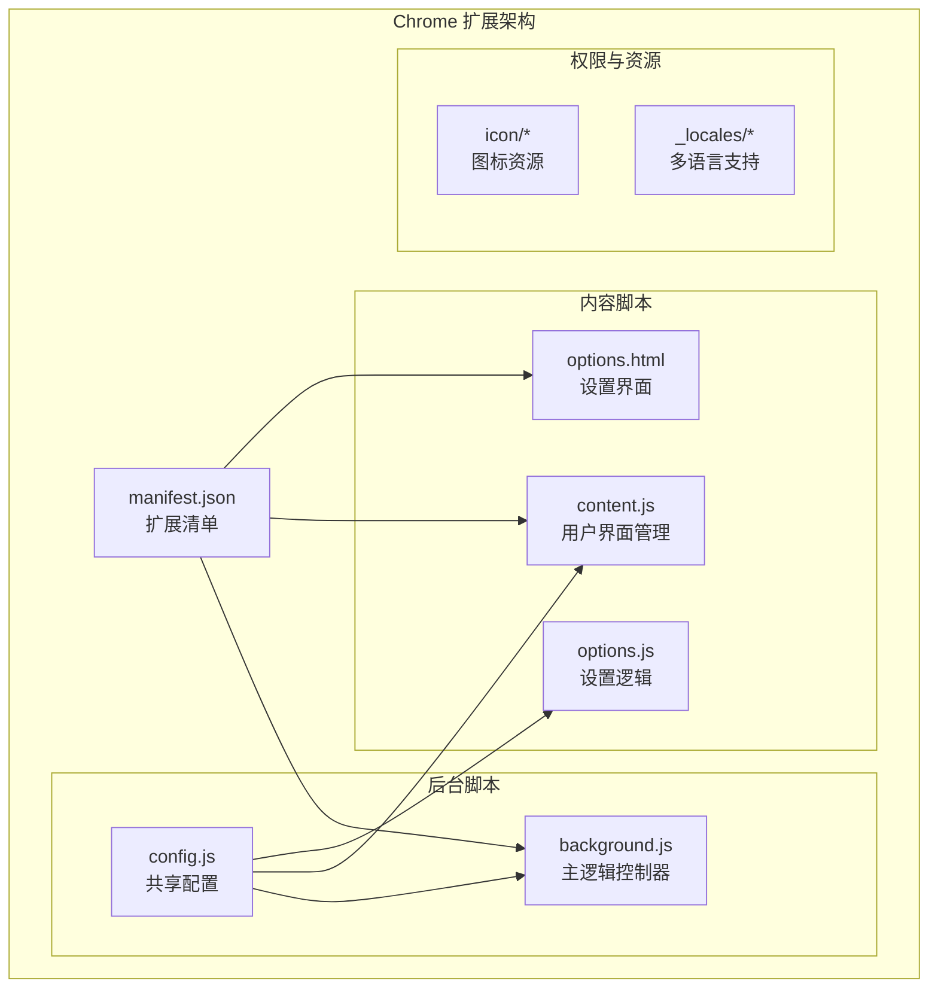

**图表来源**
- [manifest.json:1-45](file://manifest.json#L1-L45)
- [background.js:1-50](file://background.js#L1-L50)
- [content.js:1-50](file://content.js#L1-L50)
- [config.js:1-30](file://config.js#L1-L30)

**章节来源**
- [manifest.json:1-45](file://manifest.json#L1-L45)
- [config.js:1-253](file://config.js#L1-L253)

## 核心组件

### 主要模块概述

Img2Prompt 的 AI 模型集成功能由以下几个核心组件构成：

1. **后台服务工作线程** - 处理核心业务逻辑和 API 调用
2. **内容脚本** - 管理用户界面和用户交互
3. **配置系统** - 提供统一的配置管理和错误处理
4. **设置界面** - 提供用户友好的配置界面

### 数据流架构

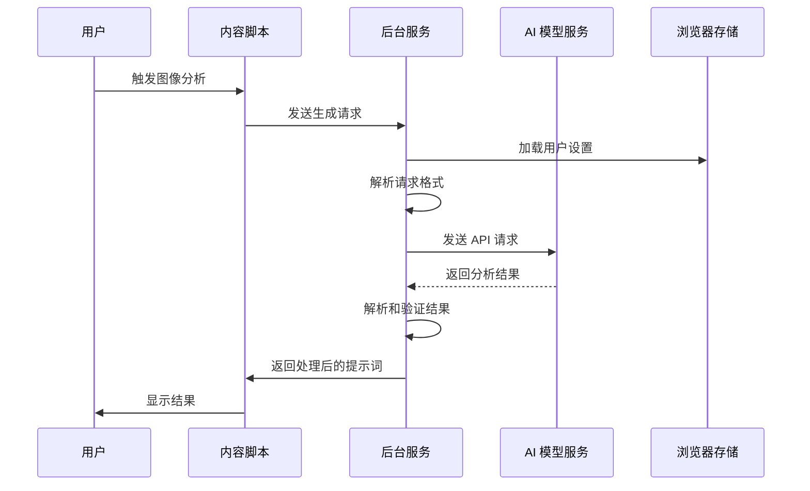

**图表来源**
- [background.js:212-320](file://background.js#L212-L320)
- [content.js:249-326](file://content.js#L249-L326)

**章节来源**
- [background.js:212-320](file://background.js#L212-L320)
- [content.js:249-326](file://content.js#L249-L326)

## 架构概览

### 整体架构设计

Img2Prompt 采用了分层架构设计，将用户界面、业务逻辑和数据访问分离：

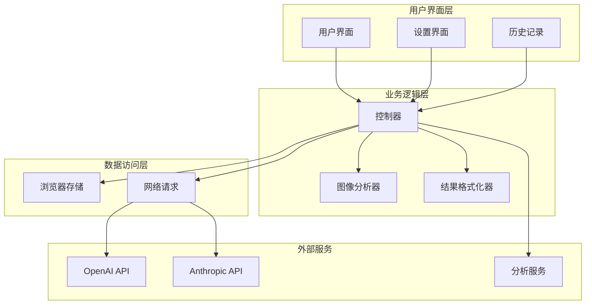

**图表来源**
- [background.js:478-503](file://background.js#L478-L503)
- [content.js:249-326](file://content.js#L249-L326)

### 模型集成架构

扩展支持两种主要的 AI 服务提供商：

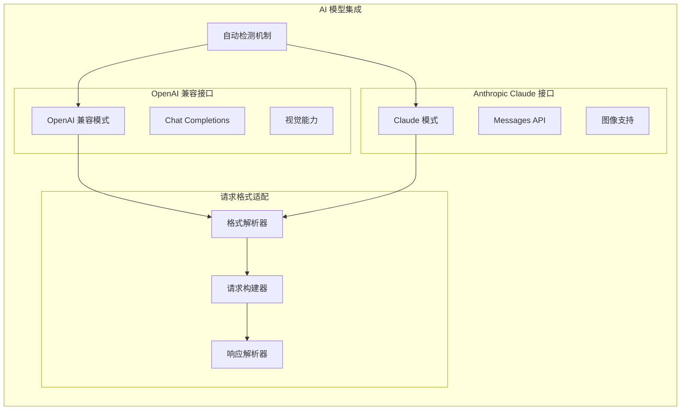

**图表来源**
- [background.js:505-515](file://background.js#L505-L515)
- [background.js:478-503](file://background.js#L478-L503)

## 详细组件分析

### 自动模型检测机制

#### 检测算法实现

扩展实现了智能的模型自动检测机制，能够根据模型名称自动选择合适的请求格式：

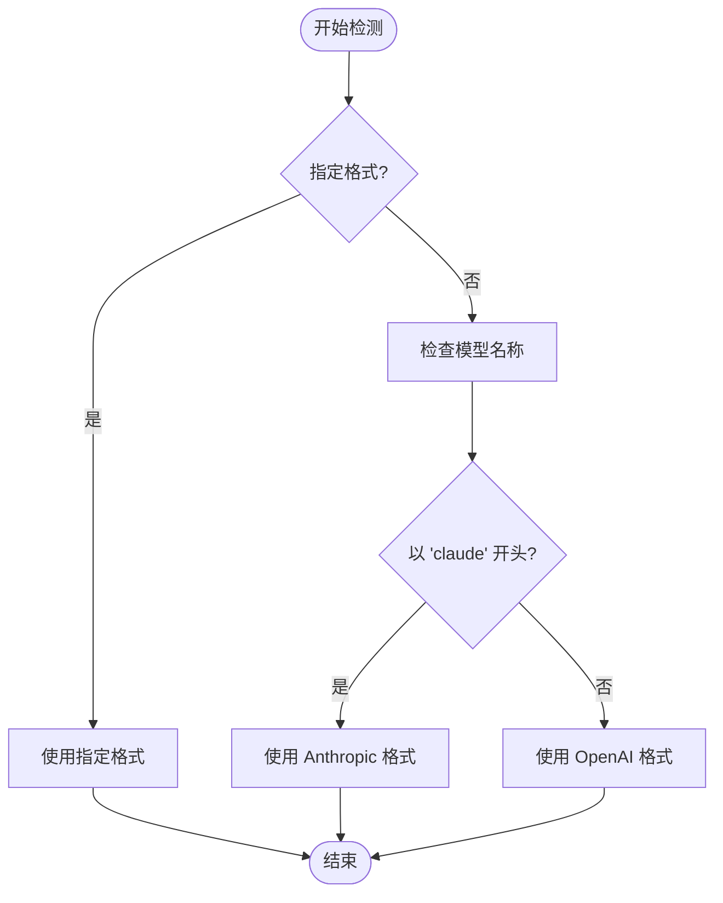

**图表来源**
- [background.js:505-515](file://background.js#L505-L515)

#### 检测规则详解

自动检测机制遵循以下规则：

1. **优先级检查**：如果用户明确指定了请求格式，则直接使用
2. **模型名称匹配**：检查模型名称是否以 "claude" 开头
3. **默认回退**：其他情况下使用 OpenAI 兼容格式

**章节来源**
- [background.js:505-515](file://background.js#L505-L515)

### OpenAI 兼容接口实现

#### 请求格式构建

OpenAI 兼容接口支持多种视觉模型，但对某些模型有特殊限制：

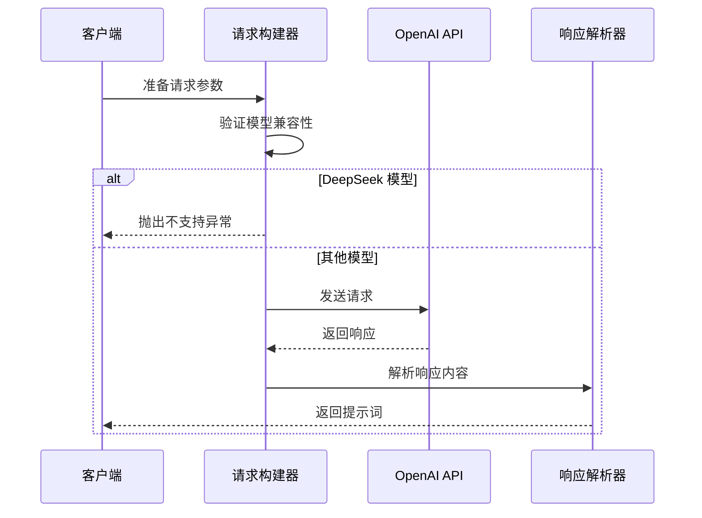

**图表来源**
- [background.js:517-592](file://background.js#L517-L592)

#### 支持的模型类型

OpenAI 兼容接口支持以下类型的模型：
- GPT 系列模型（如 gpt-5-mini）
- Gemini 系列模型（如 gemini-2.5-pro）
- 其他 OpenAI 兼容的视觉模型

**章节来源**
- [background.js:517-592](file://background.js#L517-L592)

### Anthropic Claude 接口实现

#### 图像数据处理

Anthropic Claude 接口对图像数据有特殊要求，需要 base64 编码：

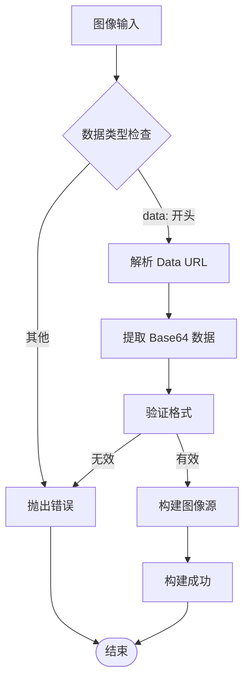

**图表来源**
- [background.js:678-693](file://background.js#L678-L693)

#### API 端点适配

扩展支持多种 Anthropic API 端点格式：

| 原始端点 | 适配后端点 |
|---------|-----------|
| `/v1/chat/completions` | `/v1/messages` |
| `/v1/messages` | `/v1/messages` |

**章节来源**
- [background.js:594-666](file://background.js#L594-L666)
- [background.js:668-676](file://background.js#L668-L676)

### 请求格式解析与适配

#### 格式解析器

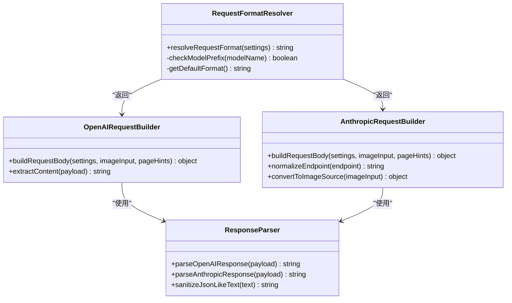

**图表来源**
- [background.js:505-515](file://background.js#L505-L515)
- [background.js:517-592](file://background.js#L517-L592)
- [background.js:594-666](file://background.js#L594-L666)

**章节来源**
- [background.js:505-515](file://background.js#L505-L515)
- [background.js:517-592](file://background.js#L517-L592)
- [background.js:594-666](file://background.js#L594-L666)

### 错误处理与重试机制

#### 错误分类系统

扩展实现了全面的错误分类和处理机制：

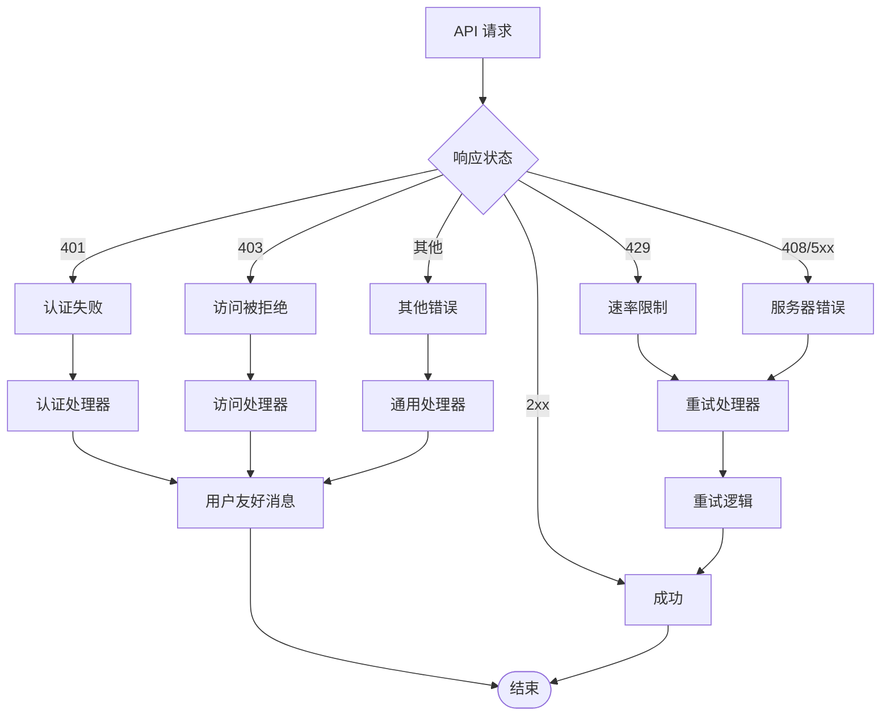

**图表来源**
- [background.js:562-582](file://background.js#L562-L582)
- [background.js:635-654](file://background.js#L635-L654)

#### 重试策略

扩展采用指数退避的重试策略：
- 最多重试 3 次
- 初始延迟 1 秒
- 每次重试延迟翻倍
- 仅对临时性错误进行重试

**章节来源**
- [background.js:562-582](file://background.js#L562-L582)
- [background.js:635-654](file://background.js#L635-L654)

### 超时控制机制

#### 请求超时管理

扩展实现了多层次的超时控制：

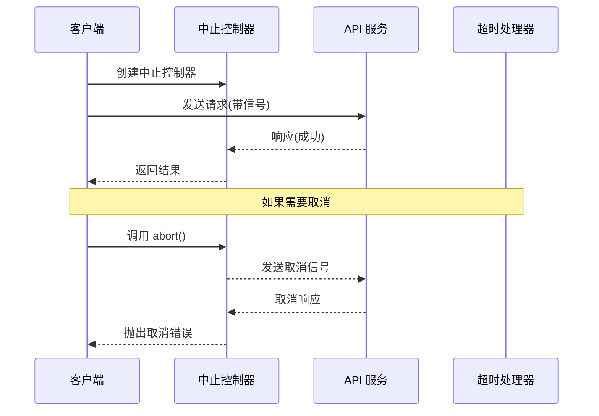

**图表来源**
- [background.js:219-220](file://background.js#L219-L220)
- [background.js:122-132](file://background.js#L122-L132)

**章节来源**
- [background.js:219-220](file://background.js#L219-L220)
- [background.js:122-132](file://background.js#L122-L132)

## 依赖关系分析

### 核心依赖关系

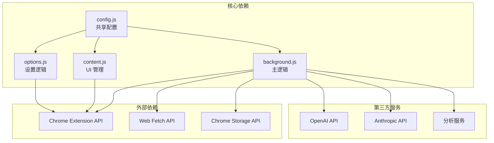

**图表来源**
- [background.js:1-12](file://background.js#L1-L12)
- [content.js:1-5](file://content.js#L1-L5)
- [options.js:1-5](file://options.js#L1-L5)

### 模块间通信

扩展内部采用消息传递机制进行模块间通信：

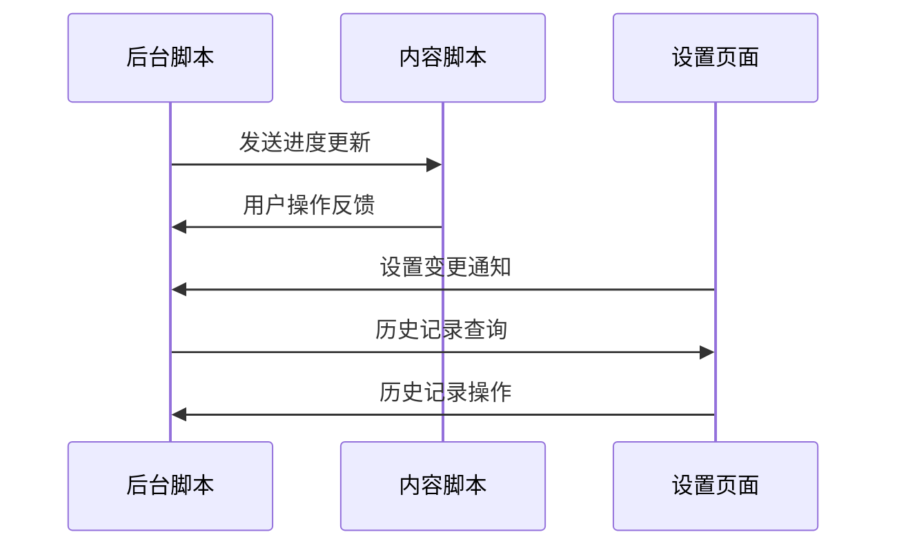

**图表来源**
- [background.js:94-184](file://background.js#L94-L184)
- [content.js:209-247](file://content.js#L209-L247)

**章节来源**
- [background.js:94-184](file://background.js#L94-L184)
- [content.js:209-247](file://content.js#L209-L247)

## 性能考虑

### 图像处理优化

扩展实现了高效的图像处理机制：

1. **智能压缩**：根据最大边缘长度自动压缩图像
2. **缓存机制**：避免重复下载相同图像
3. **内存管理**：及时释放不再使用的图像数据

### 网络请求优化

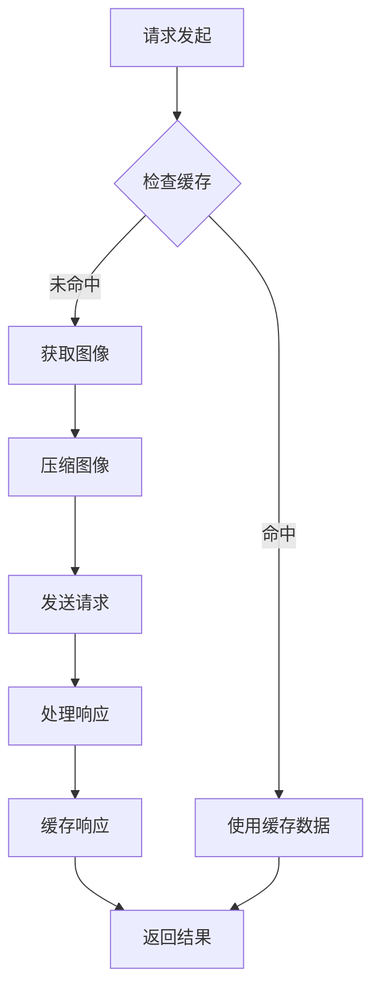

**图表来源**
- [background.js:775-800](file://background.js#L775-L800)

### 内存使用优化

扩展采用以下策略优化内存使用：
- 使用 AbortController 取消长时间运行的请求
- 及时清理 DOM 元素和事件监听器
- 限制历史记录数量（最多 50 项）

## 故障排除指南

### 常见问题诊断

#### API 连接问题

| 错误代码 | 可能原因 | 解决方案 |
|---------|---------|---------|
| 401 | API 密钥无效 | 检查 API 密钥格式和有效期 |
| 403 | 权限不足 | 确认 API 访问权限 |
| 429 | 速率限制 | 等待后重试或升级套餐 |
| 504 | 网关超时 | 检查网络连接稳定性 |

#### 模型兼容性问题

| 模型类型 | 兼容性 | 特殊说明 |
|---------|--------|---------|
| DeepSeek | ❌ 不支持 | 不支持扩展使用的图像格式 |
| GPT 系列 | ✅ 支持 | 完全兼容 OpenAI 格式 |
| Claude 系列 | ✅ 支持 | 需要 base64 图像数据 |
| Gemini 系列 | ✅ 支持 | 完全兼容 OpenAI 格式 |

#### 图像处理问题

**章节来源**
- [background.js:562-582](file://background.js#L562-L582)
- [background.js:635-654](file://background.js#L635-L654)

### 调试技巧

1. **启用详细日志**：检查浏览器控制台输出
2. **验证 API 端点**：确保使用正确的 API 端点格式
3. **测试网络连接**：确认网络稳定性和防火墙设置
4. **检查图像格式**：确保图像可正常加载和解码

## 结论

Img2Prompt 的 AI 模型集成功能展现了现代浏览器扩展的高级架构设计。通过智能的模型检测机制、灵活的请求格式适配和完善的错误处理体系，该扩展为用户提供了强大而可靠的图像分析功能。

### 主要优势

1. **高度兼容性**：支持多种 AI 服务提供商和模型类型
2. **智能适配**：自动检测和适配不同的请求格式
3. **健壮性**：完善的错误处理和重试机制
4. **用户体验**：直观的用户界面和流畅的操作流程

### 技术亮点

- 智能的模型自动检测算法
- 灵活的请求格式解析和构建
- 多层次的超时控制和错误处理
- 高效的图像处理和缓存机制

该扩展为图像到提示词的转换提供了一个完整、可靠且易于使用的解决方案，适用于各种图像生成和创意应用场景。