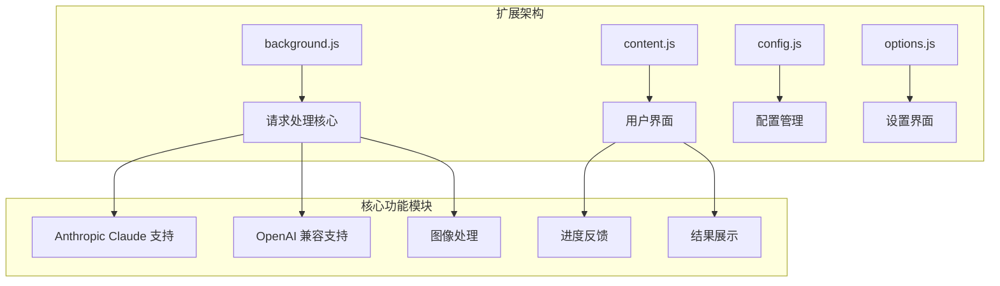
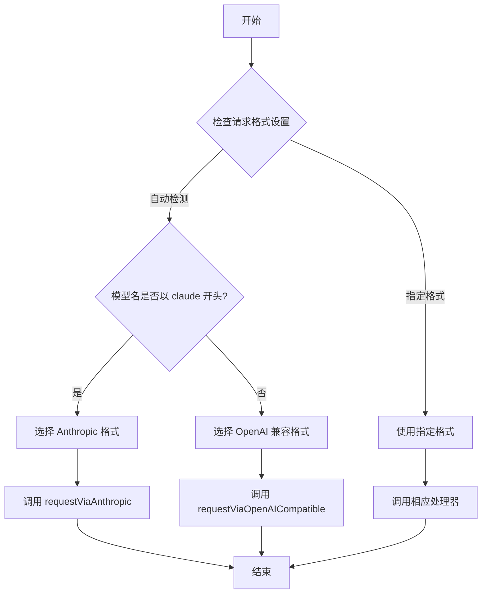
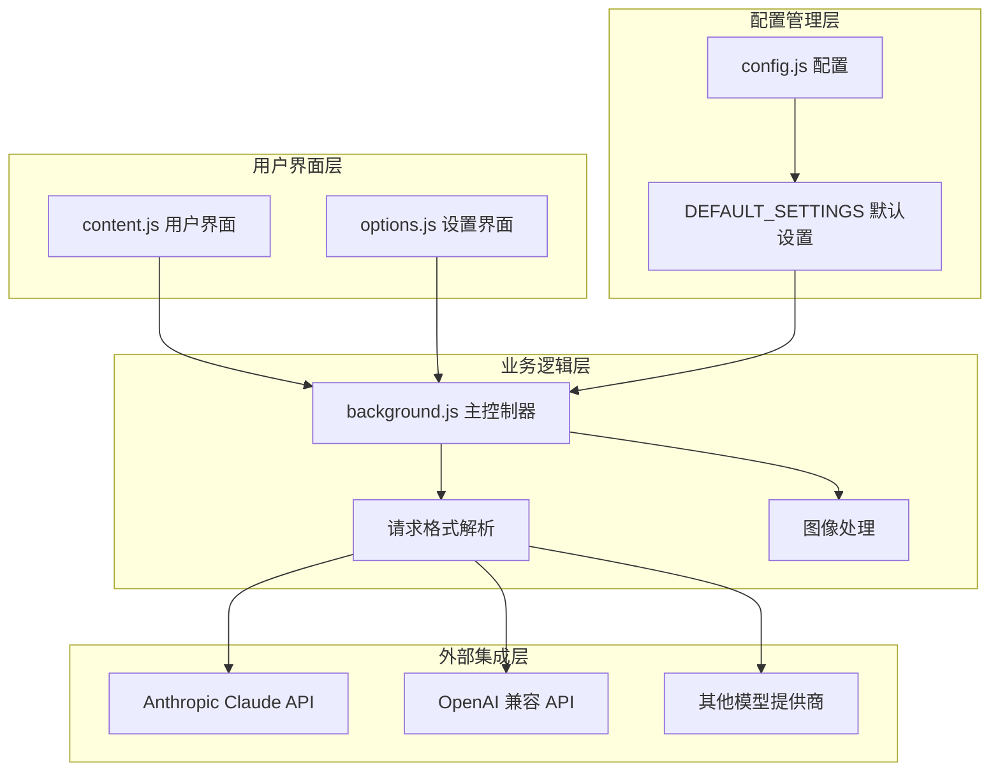
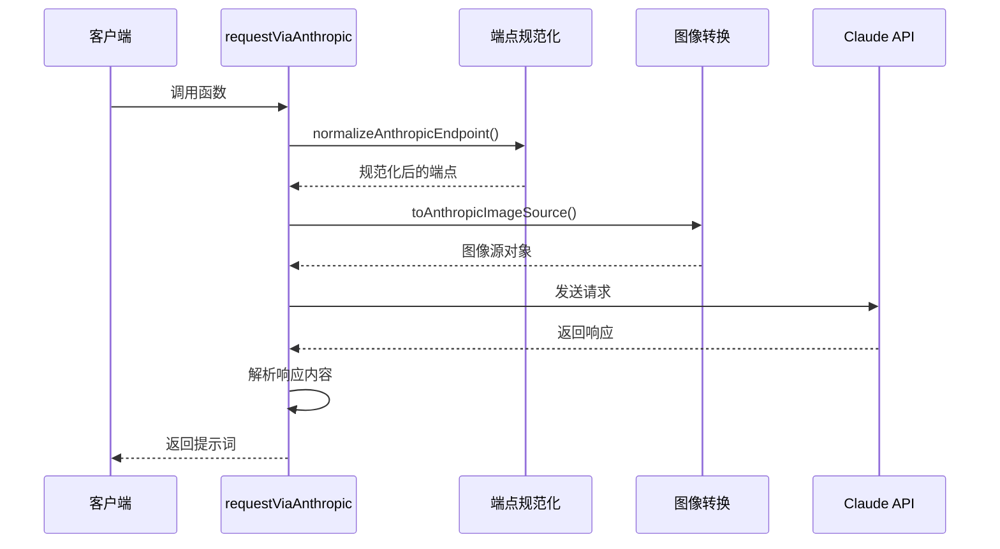
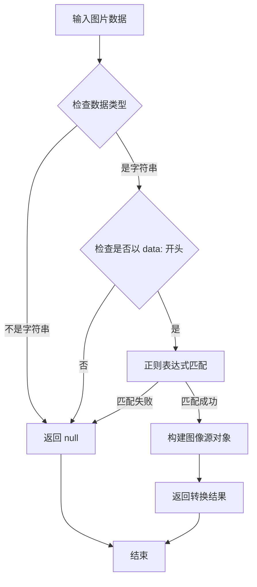
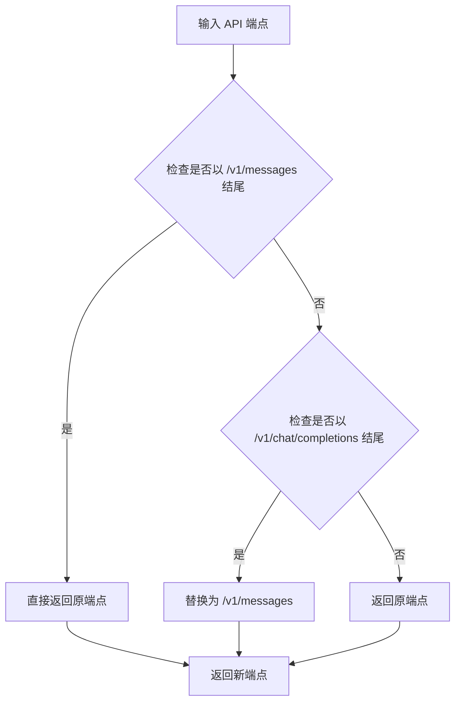
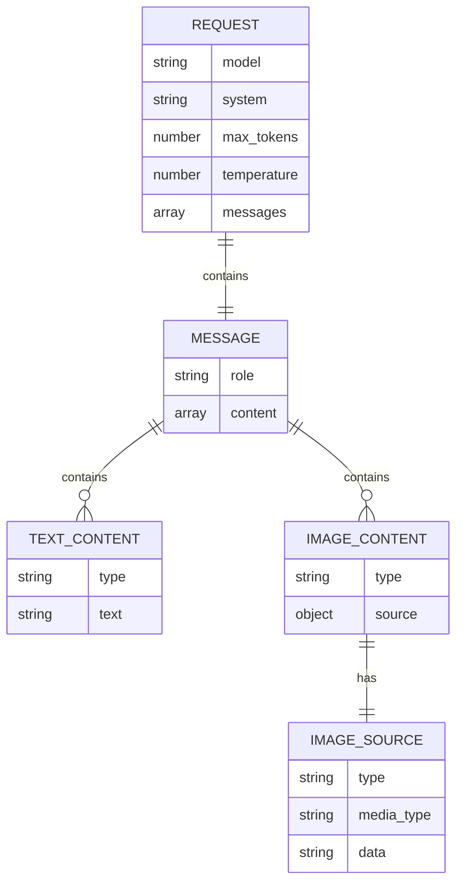
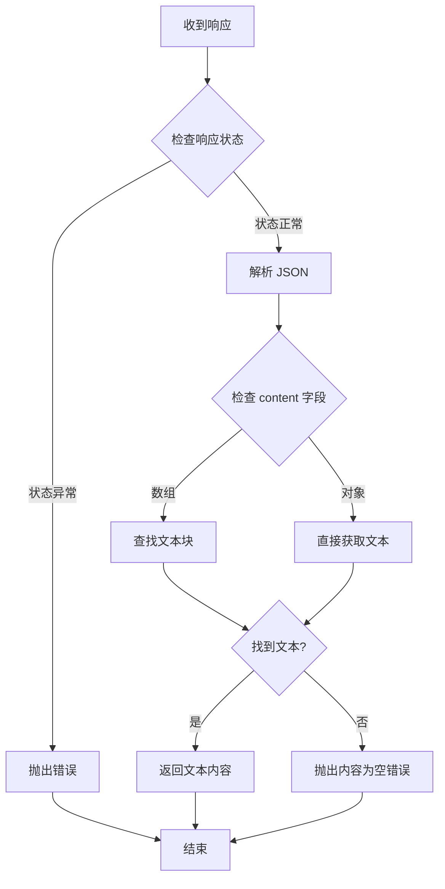
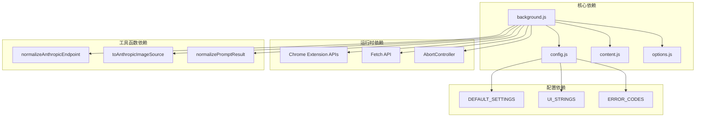

# Anthropic Claude 接口

<cite>
**本文档引用的文件**
- [background.js](file://background.js)
- [config.js](file://config.js)
- [options.js](file://options.js)
- [content.js](file://content.js)
</cite>

## 目录
1. [简介](#简介)
2. [项目结构](#项目结构)
3. [核心组件](#核心组件)
4. [架构概览](#架构概览)
5. [详细组件分析](#详细组件分析)
6. [依赖关系分析](#依赖关系分析)
7. [性能考虑](#性能考虑)
8. [故障排除指南](#故障排除指南)
9. [结论](#结论)

## 简介

Img2Prompt 是一个 Chrome 扩展程序，能够将图片转换为高质量的提示词。该扩展支持多种 AI 模型服务，包括 Anthropic Claude。本文档专注于 Anthropic Claude 接口的实现细节，深入解释 `requestViaAnthropic` 函数的工作机制，包括端点规范化、图像数据转换和请求格式适配。

该扩展通过统一的接口支持多种模型提供商，其中 Anthropic Claude 作为主要的多模态模型之一，能够理解文本和图像输入，生成详细的图片描述和提示词。

## 项目结构

Img2Prompt 项目采用模块化架构，主要由以下几个关键文件组成：

**图表来源**
- [background.js:1-945](file://background.js#L1-L945)
- [content.js:1-1578](file://content.js#L1-L1578)

**章节来源**
- [background.js:1-945](file://background.js#L1-L945)
- [config.js:1-253](file://config.js#L1-L253)

## 核心组件

### 请求格式解析器

扩展根据模型名称自动选择合适的请求格式。对于以 "claude" 开头的模型，系统会自动选择 Anthropic 格式：

**图表来源**
- [background.js:505-515](file://background.js#L505-L515)

### Anthropic Claude 请求处理器

`requestViaAnthropic` 函数是 Anthropic Claude 接口的核心实现，负责处理完整的请求流程：

**章节来源**
- [background.js:594-666](file://background.js#L594-L666)

## 架构概览

扩展的整体架构采用分层设计，确保不同模型提供商的兼容性和可扩展性：

**图表来源**
- [background.js:478-515](file://background.js#L478-L515)
- [config.js:4-20](file://config.js#L4-L20)

## 详细组件分析

### requestViaAnthropic 函数详解

`requestViaAnthropic` 函数实现了 Anthropic Claude API 的完整请求流程：

#### 函数签名和参数
- **函数名**: `requestViaAnthropic`
- **参数**: `{ settings, imageInput, pageHints, signal }`
- **返回值**: Promise<string> - 处理后的提示词内容

#### 核心处理流程

**图表来源**
- [background.js:594-666](file://background.js#L594-L666)

#### 关键处理步骤

1. **端点规范化**: 使用 `normalizeAnthropicEndpoint` 确保使用正确的 API 端点
2. **图像数据转换**: 通过 `toAnthropicImageSource` 将图片数据转换为 Claude 所需格式
3. **请求构建**: 组合系统提示词、用户提示词和图像数据
4. **响应处理**: 解析 Claude API 的响应格式

**章节来源**
- [background.js:594-666](file://background.js#L594-L666)

### toAnthropicImageSource 函数分析

该函数负责将图片数据转换为 Anthropic Claude 所需的 base64 格式：

#### 转换逻辑

**图表来源**
- [background.js:678-693](file://background.js#L678-L693)

#### 数据结构说明

转换后的图像源对象包含以下字段：
- `type`: "base64" - 固定值，指示使用 base64 编码
- `media_type`: 图片的 MIME 类型（如 image/jpeg）
- `data`: 实际的 base64 编码数据

**章节来源**
- [background.js:678-693](file://background.js#L678-L693)

### normalizeAnthropicEndpoint 函数分析

该函数处理 Anthropic API 端点的适配逻辑：

#### 端点适配规则

**图表来源**
- [background.js:668-676](file://background.js#L668-L676)

#### 支持的端点格式

- **标准格式**: `https://api.anthropic.com/v1/messages`
- **兼容格式**: `https://api.anthropic.com/v1/chat/completions`
- **自定义格式**: 任何其他有效的 Anthropic API 端点

**章节来源**
- [background.js:668-676](file://background.js#L668-L676)

### Anthropic 特有请求参数

扩展为 Anthropic Claude 实现了特定的请求参数配置：

#### 必需参数

| 参数名 | 类型 | 默认值 | 说明 |
|--------|------|--------|------|
| `model` | string | 从配置读取 | 指定使用的 Claude 模型 |
| `system` | string | 从配置读取 | 系统提示词，定义模型行为 |
| `max_tokens` | number | 1400 | 最大生成令牌数 |
| `temperature` | number | 1 | 生成随机性参数 |

#### 可选参数

| 参数名 | 类型 | 默认值 | 说明 |
|--------|------|--------|------|
| `anthropic-version` | string | "2023-06-01" | API 版本号 |

**章节来源**
- [background.js:612-632](file://background.js#L612-L632)
- [config.js:10](file://config.js#L10)

### 请求格式组合

扩展将系统提示词、用户提示词和图像数据按照 Anthropic 的要求进行组合：

#### 请求体结构

**图表来源**
- [background.js:612-632](file://background.js#L612-L632)
- [background.js:678-693](file://background.js#L678-L693)

**章节来源**
- [background.js:612-632](file://background.js#L612-L632)

### 响应处理机制

扩展对 Anthropic Claude 的响应进行了专门的处理：

#### 响应解析流程

**图表来源**
- [background.js:655-666](file://background.js#L655-L666)

**章节来源**
- [background.js:655-666](file://background.js#L655-L666)

## 依赖关系分析

### 内部依赖关系

**图表来源**
- [background.js:1-12](file://background.js#L1-L12)
- [config.js:4-11](file://config.js#L4-L11)

### 外部 API 依赖

扩展依赖于以下外部服务：

1. **Anthropic Claude API**: 主要的多模态模型服务
2. **Chrome Extension APIs**: 浏览器扩展功能
3. **PostHog Analytics**: 用户行为分析服务

**章节来源**
- [background.js:1-12](file://background.js#L1-L12)
- [config.js:249-252](file://config.js#L249-L252)

## 性能考虑

### 图像处理优化

扩展在发送请求前对图像进行了压缩处理：

- **最大边长**: 默认 1024 像素
- **质量压缩**: 使用 0.86 的 JPEG 质量
- **内存管理**: 使用 AbortController 处理取消操作

### 网络请求优化

- **超时控制**: 通过 AbortController 实现请求取消
- **错误重试**: 对临时性错误提供重试机制
- **缓存策略**: 避免重复下载相同资源

## 故障排除指南

### 常见错误类型

| 错误代码 | 描述 | 解决方案 |
|----------|------|----------|
| 401 | 认证失败 | 检查 API 密钥有效性 |
| 403 | 访问被拒绝 | 验证 API 权限设置 |
| 429 | 调用次数超限 | 等待配额恢复或升级计划 |
| 5xx | 服务器错误 | 稍后重试或检查服务状态 |

### 图像处理问题

**问题**: 图片无法读取或转换
**原因**: 图片格式不支持或数据损坏
**解决方案**: 
1. 确认图片格式为支持的类型
2. 检查图片数据完整性
3. 尝试重新加载页面

### API 集成问题

**问题**: 请求格式不正确
**原因**: 端点格式或参数配置错误
**解决方案**:
1. 验证 API 端点格式
2. 检查 Anthropic 版本参数
3. 确认模型名称正确

**章节来源**
- [background.js:635-654](file://background.js#L635-L654)

## 结论

Img2Prompt 的 Anthropic Claude 接口实现展现了良好的架构设计和工程实践。通过模块化的函数设计、清晰的错误处理机制和灵活的配置选项，该扩展能够稳定地支持多种模型提供商。

关键优势包括：
- **统一接口设计**: 通过 `requestFormat` 自动选择合适的处理方式
- **健壮的错误处理**: 提供详细的错误信息和用户友好的提示
- **灵活的配置管理**: 支持多种配置选项和自定义设置
- **高效的图像处理**: 在保证质量的同时优化传输效率

未来可以考虑的改进方向：
- 添加更多的模型提供商支持
- 实现更智能的错误重试机制
- 增加更多的配置选项和自定义能力