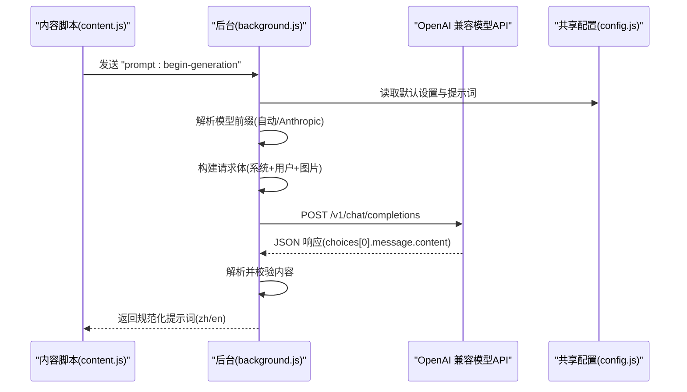
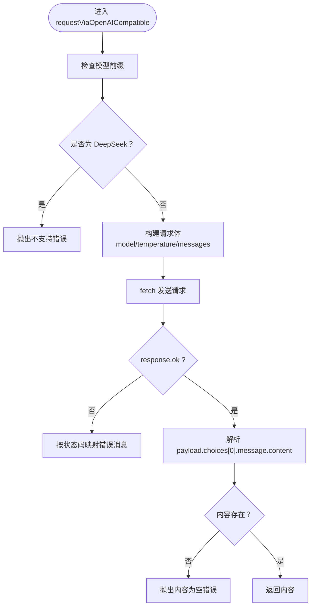
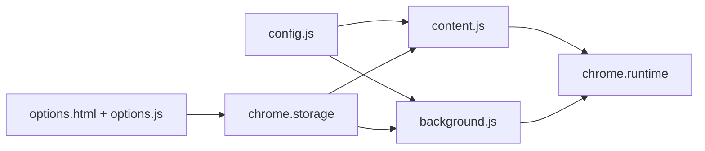

# OpenAI 兼容接口

<cite>
**本文引用的文件列表**
- [background.js](file://background.js)
- [content.js](file://content.js)
- [config.js](file://config.js)
- [manifest.json](file://manifest.json)
- [options.html](file://options.html)
- [options.js](file://options.js)
</cite>

## 目录
1. [简介](#简介)
2. [项目结构](#项目结构)
3. [核心组件](#核心组件)
4. [架构总览](#架构总览)
5. [详细组件分析](#详细组件分析)
6. [依赖关系分析](#依赖关系分析)
7. [性能与超时控制](#性能与超时控制)
8. [故障排查指南](#故障排查指南)
9. [结论](#结论)
10. [附录](#附录)

## 简介
本文件面向 Img2Prompt 扩展的 OpenAI 兼容接口实现，重点围绕 requestViaOpenAICompatible 函数展开，系统阐述其请求体构建、消息格式处理、响应解析流程；明确支持与不支持的模型类型；解释温度参数、系统提示词与用户提示词的组合方式；说明超时控制机制、错误分类与状态码映射；并提供多种 OpenAI 兼容 API 的配置示例与常见问题解决方案。

## 项目结构
扩展采用 Manifest V3 架构，核心由后台脚本、内容脚本、选项页面与共享配置组成：
- 后台脚本负责生成流程编排、图像压缩、向模型发起请求、错误分类与持久化历史。
- 内容脚本负责 UI 面板渲染、进度反馈、与后台通信。
- 选项页面提供设置项与提示词模板管理。
- 共享配置集中定义默认设置、提示词模板、UI 文案与错误码映射。

```mermaid
graph TB
subgraph "扩展"
BG["background.js<br/>后台服务线程"]
CT["content.js<br/>内容脚本"]
OPT["options.html + options.js<br/>设置面板"]
CFG["config.js<br/>共享配置"]
end
subgraph "浏览器"
RT["runtime<br/>消息通道"]
ST["storage<br/>本地存储"]
TP["sidePanel<br/>侧边栏"]
end
CT <- --> RT
BG <- --> RT
BG <- --> ST
CT <- --> ST
OPT <- --> ST
CT <- --> TP
CFG --> BG
CFG --> CT
CFG --> OPT
```

图表来源
- [manifest.json:10-41](file://manifest.json#L10-L41)
- [background.js:13-21](file://background.js#L13-L21)
- [content.js:102-141](file://content.js#L102-L141)
- [options.html:484-519](file://options.html#L484-L519)
- [config.js:4-252](file://config.js#L4-L252)

章节来源
- [manifest.json:1-45](file://manifest.json#L1-L45)
- [background.js:13-21](file://background.js#L13-L21)
- [content.js:102-141](file://content.js#L102-L141)
- [options.html:484-519](file://options.html#L484-L519)
- [config.js:4-252](file://config.js#L4-L252)

## 核心组件
- requestViaOpenAICompatible：封装 OpenAI 兼容接口请求，构建消息体、发送请求、解析响应。
- requestPromptFromModel：根据模型前缀自动选择 OpenAI 兼容或 Anthropic 接口。
- normalizePromptResult / extractOpenAICompatibleContent：将模型返回内容标准化为双语提示词。
- 错误分类与用户提示：classifyError + getUserErrorMessage 将底层错误映射为用户可理解的消息。
- 设置与提示词：DEFAULT_SETTINGS、USER_PROMPT_PRESETS、UI_STRINGS 提供默认配置与文案。

章节来源
- [background.js:478-592](file://background.js#L478-L592)
- [background.js:594-666](file://background.js#L594-L666)
- [background.js:695-753](file://background.js#L695-L753)
- [background.js:872-945](file://background.js#L872-L945)
- [config.js:5-30](file://config.js#L5-L30)
- [config.js:32-113](file://config.js#L32-L113)

## 架构总览
OpenAI 兼容接口的调用链路如下：



图表来源
- [background.js:478-592](file://background.js#L478-L592)
- [background.js:695-753](file://background.js#L695-L753)
- [config.js:5-30](file://config.js#L5-L30)

## 详细组件分析

### requestViaOpenAICompatible 组件
该函数是 OpenAI 兼容接口的核心实现，负责：
- 模型类型判定与不支持模型拦截（如 DeepSeek）。
- 请求体构建：包含 model、temperature、messages（系统提示词、用户提示词+页面上下文、图片 URL）。
- 发送请求并处理非 2xx 响应，映射状态码为用户可读错误。
- 解析响应：从 choices[0].message.content 中提取文本，支持字符串或数组形式。



图表来源
- [background.js:517-592](file://background.js#L517-L592)
- [background.js:728-753](file://background.js#L728-L753)

章节来源
- [background.js:517-592](file://background.js#L517-L592)
- [background.js:728-753](file://background.js#L728-L753)

### 请求体构建与消息格式
- model：来自设置项。
- temperature：来自设置项，默认 1。
- messages：
  - system：固定系统提示词（由 DEFAULT_SETTINGS.systemPrompt 提供）。
  - user：包含两部分：
    - 文本部分：settings.userPrompt 与页面上下文（alt、title、URL）拼接。
    - 图像部分：image_url 类型，url 指向 data URL（经压缩后的图片）。
- 请求头：Content-Type: application/json；Authorization: Bearer {apiKey}。

章节来源
- [background.js:526-550](file://background.js#L526-L550)
- [config.js:15-19](file://config.js#L15-L19)

### 响应解析与结果标准化
- 从 choices[0].message.content 提取内容，支持字符串或数组（数组时拼接文本）。
- 若返回内容为空，抛出“模型返回内容为空”的错误。
- normalizePromptResult 将原始字符串尝试解析为 JSON，若失败则尝试清理为 JSON 片段再解析；最终提取 zh/en 字段并保证至少一个存在。

章节来源
- [background.js:728-753](file://background.js#L728-L753)
- [background.js:695-726](file://background.js#L695-L726)

### 支持与不支持的模型
- 支持的模型类型（基于前缀）：
  - gpt-*：OpenAI 官方模型族。
  - gemini-*：Google Gemini 模型族（兼容 OpenAI 兼容接口）。
  - claude-*：Claude 模型，但走 Anthropic 接口（见下节）。
- 不支持的模型：
  - deepseek-*：当前不支持扩展所用的图片输入格式，会直接报错提示改用 gpt-*、gemini-* 或 claude-*。

章节来源
- [background.js:517-524](file://background.js#L517-L524)
- [background.js:505-515](file://background.js#L505-L515)

### 模型前缀与接口选择
- requestPromptFromModel 会根据 settings.requestFormat 或模型名自动选择：
  - claude 前缀 → Anthropic 接口。
  - 其他 → OpenAI 兼容接口。
- Anthropic 接口有独立的消息体与头部（x-api-key、anthropic-version），且对图片输入格式要求更高（需 base64 数据）。

章节来源
- [background.js:478-503](file://background.js#L478-L503)
- [background.js:505-515](file://background.js#L505-L515)
- [background.js:594-666](file://background.js#L594-L666)

### 温度参数、系统提示词与用户提示词
- 温度：直接透传 settings.temperature 到请求体。
- 系统提示词：固定使用 DEFAULT_SETTINGS.systemPrompt。
- 用户提示词：settings.userPrompt 与页面上下文（alt、title、URL）拼接后作为文本部分。
- 图片：以 image_url 形式附加，指向 data URL（压缩后的 JPEG）。

章节来源
- [background.js:526-550](file://background.js#L526-L550)
- [config.js:15-19](file://config.js#L15-L19)
- [background.js:479-485](file://background.js#L479-L485)

## 依赖关系分析
- 后台脚本依赖共享配置（DEFAULT_SETTINGS、UI_STRINGS、ERROR_CODES、ERROR_MESSAGES）。
- 内容脚本通过 runtime 与后台通信，接收进度、结果、错误消息。
- 选项页面负责写入设置并触发全局更新通知。



图表来源
- [config.js:4-252](file://config.js#L4-L252)
- [background.js:13-21](file://background.js#L13-L21)
- [content.js:102-141](file://content.js#L102-L141)
- [options.html:484-519](file://options.html#L484-L519)

章节来源
- [config.js:4-252](file://config.js#L4-L252)
- [background.js:13-21](file://background.js#L13-L21)
- [content.js:102-141](file://content.js#L102-L141)
- [options.html:484-519](file://options.html#L484-L519)

## 性能与超时控制
- 请求超时控制：通过 AbortController 的 signal 实现，当用户点击“停止生成”或出现网络异常时，可中断 fetch 请求。
- 图像压缩：在后台统一执行，将图片压缩为 JPEG，限制最大边长，减少请求体积，避免超时或被拒绝。
- 重试与退避：扩展未内置自动重试逻辑，建议在外部代理层或上游服务端实现。

章节来源
- [background.js:218-219](file://background.js#L218-L219)
- [background.js:775-849](file://background.js#L775-L849)
- [background.js:280-294](file://background.js#L280-L294)

## 故障排查指南
- 常见错误与映射：
  - 401/403：认证失败（API Key 无效或权限不足）。
  - 429：速率限制。
  - 408/5xx：服务器错误或超时。
  - 其他：请求失败。
- 错误分类依据：
  - 网络错误、图片获取/处理错误、认证失败、速率限制、超时、JSON 解析失败、字段缺失等。
- 用户提示：
  - 根据 ERROR_CODES 映射到 UI_STRINGS.zh 或 UI_STRINGS.en 的对应文案。

章节来源
- [background.js:562-582](file://background.js#L562-L582)
- [background.js:872-945](file://background.js#L872-L945)
- [config.js:206-247](file://config.js#L206-L247)

## 结论
Img2Prompt 的 OpenAI 兼容接口通过统一的请求体构建与响应解析，实现了对 gpt-*、gemini-* 等模型的稳定支持，并对 DeepSeek 等不兼容模型进行了显式拦截。借助 AbortController 的信号机制与图像压缩策略，系统在易用性与稳定性之间取得平衡。建议在生产环境中结合代理层的超时与重试策略，进一步提升鲁棒性。

## 附录

### OpenAI 兼容 API 配置示例
- OpenAI 官方 API
  - 端点：https://api.openai.com/v1/chat/completions
  - 模型：gpt-4o、gpt-4o-mini、gpt-3.5-turbo 等
  - 密钥：sk-...（Bearer）
- 第三方兼容服务（示例）
  - Ollama（本地/私有部署）
    - 端点：http://localhost:11434/v1/chat/completions
    - 模型：llama3、gemma2、qwen 等
    - 密钥：可留空或按服务端要求设置
  - Azure OpenAI
    - 端点：https://{resource}.openai.azure.com/openai/deployments/{deployment}/chat/completions?api-version=2024-02-15
    - 模型：与部署一致
    - 密钥：Azure 认证（通常通过代理或网关处理）
  - 自建代理（如 v1/chat/completions）
    - 端点：https://your-proxy.example.com/v1/chat/completions
    - 模型：与上游一致
    - 密钥：Bearer

章节来源
- [options.html:500-517](file://options.html#L500-L517)
- [config.js:5-19](file://config.js#L5-L19)

### 请求与响应要点
- 请求方法：POST
- Content-Type：application/json
- Authorization：Bearer {apiKey}
- 请求体字段：model、temperature、messages（系统+用户+图片）
- 响应字段：choices[0].message.content（字符串或数组）

章节来源
- [background.js:552-560](file://background.js#L552-L560)
- [background.js:584-591](file://background.js#L584-L591)

### 常见问题与解决
- 400 错误
  - 可能原因：请求体格式不符、图片格式不被支持。
  - 建议：降低图片分辨率（设置面板中的“图片分辨率限制”），确保端点为 /v1/chat/completions。
- 401/403
  - 可能原因：API Key 无效或权限不足。
  - 建议：核对密钥与权限范围。
- 429
  - 可能原因：超出速率限制。
  - 建议：降低并发、增加延迟或升级配额。
- 408/5xx
  - 可能原因：网络不稳定或上游服务异常。
  - 建议：检查网络、重试或切换代理。
- 深度学习模型（DeepSeek）
  - 当前不支持扩展的图片输入格式，建议改用 gpt-*、gemini-* 或 claude-*。

章节来源
- [background.js:517-524](file://background.js#L517-L524)
- [background.js:568-582](file://background.js#L568-L582)
- [options.html:633-654](file://options.html#L633-L654)