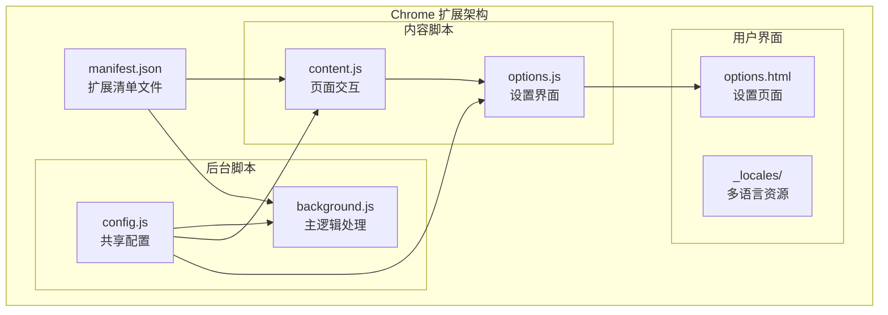
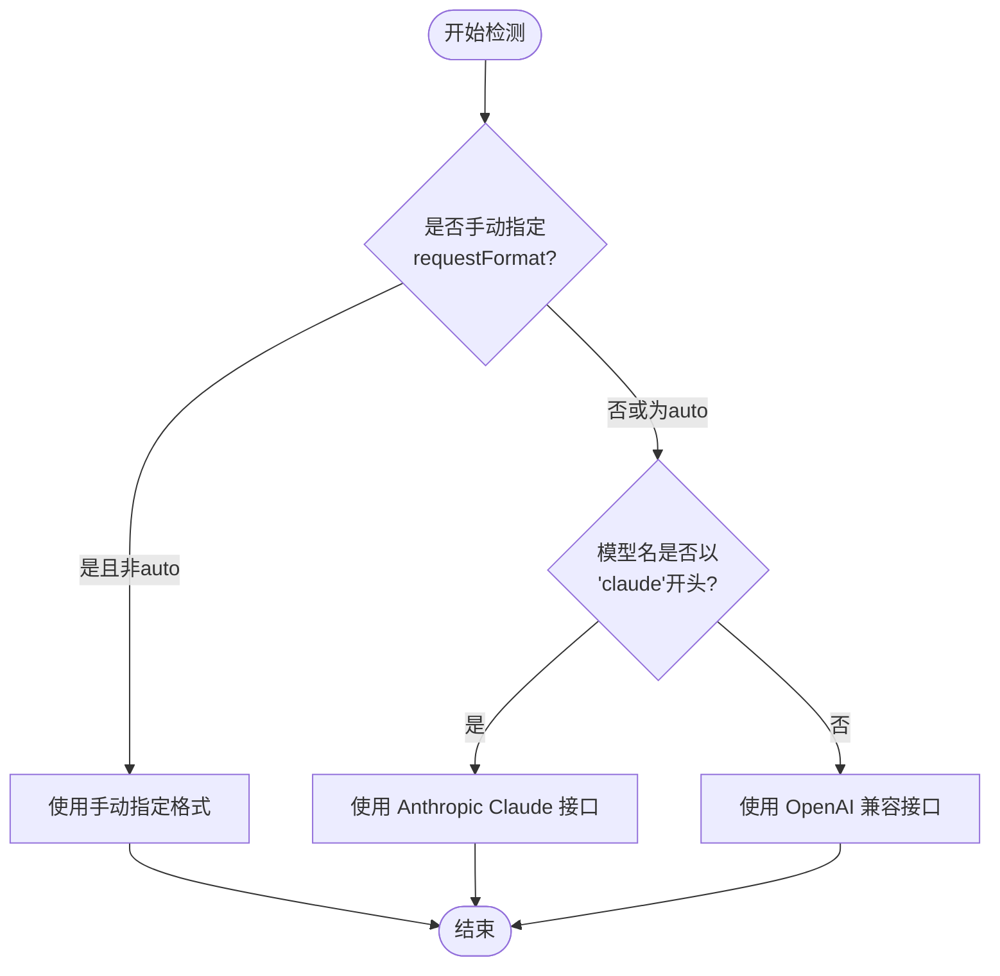
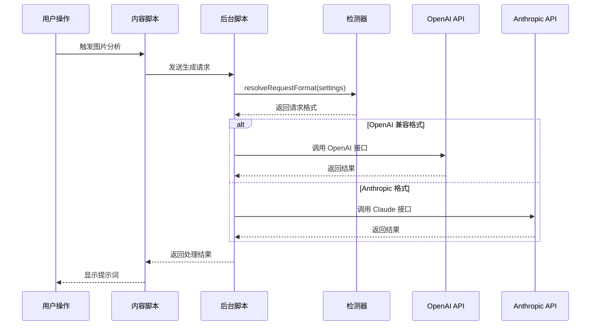
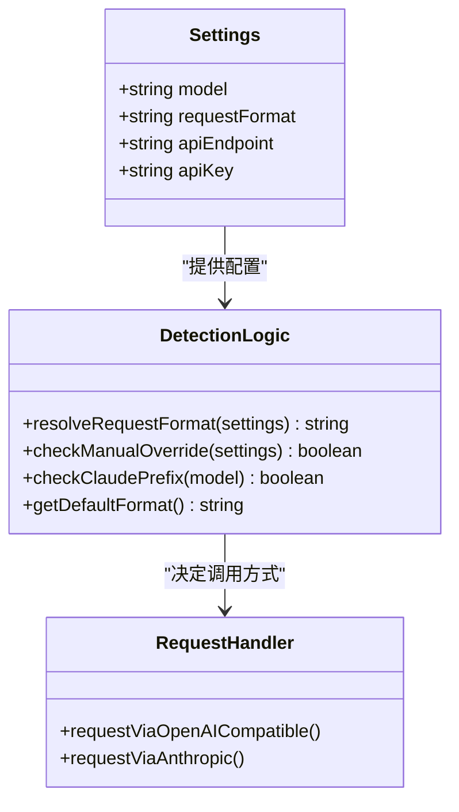
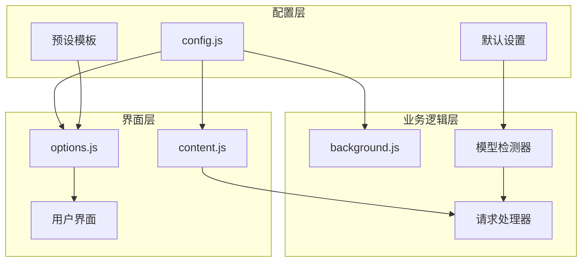
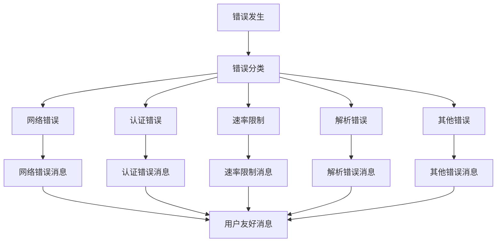

# 模型自动检测机制

<cite>
**本文档引用的文件**
- [background.js](file://background.js)
- [config.js](file://config.js)
- [content.js](file://content.js)
- [options.js](file://options.js)
- [manifest.json](file://manifest.json)
</cite>

## 目录
1. [简介](#简介)
2. [项目结构概览](#项目结构概览)
3. [核心组件分析](#核心组件分析)
4. [架构总览](#架构总览)
5. [详细组件分析](#详细组件分析)
6. [依赖关系分析](#依赖关系分析)
7. [性能考虑](#性能考虑)
8. [故障排除指南](#故障排除指南)
9. [结论](#结论)

## 简介

Img2Prompt 是一个 Chrome 扩展程序，能够自动分析网页中的图片并生成对应的提示词。该扩展的核心功能之一是模型自动检测机制，它能够根据模型名称智能判断应该使用 OpenAI 兼容接口还是 Anthropic Claude 接口。

本文档深入解释了 `resolveRequestFormat` 函数的工作原理，包括：
- 模型名称匹配规则和请求格式选择逻辑
- 如何根据模型名称自动判断是 OpenAI 兼容接口还是 Anthropic Claude 接口
- 手动指定请求格式的优先级和覆盖机制
- 支持的模型前缀和命名约定
- 各种模型配置示例和检测结果说明
- 自定义模型名称的处理逻辑和扩展方法
- 检测机制在不同语言环境下的表现

## 项目结构概览

Img2Prompt 采用典型的 Chrome 扩展架构，主要包含以下核心文件：



**图表来源**
- [manifest.json:1-45](file://manifest.json#L1-L45)
- [background.js:1-50](file://background.js#L1-L50)
- [config.js:1-50](file://config.js#L1-L50)

**章节来源**
- [manifest.json:1-45](file://manifest.json#L1-L45)
- [background.js:1-50](file://background.js#L1-L50)
- [config.js:1-50](file://config.js#L1-L50)

## 核心组件分析

### 模型自动检测函数

`resolveRequestFormat` 函数是整个检测机制的核心，位于 `background.js` 文件中第 505-515 行：

```javascript
function resolveRequestFormat(settings) {
  if (settings.requestFormat && settings.requestFormat !== "auto") {
    return settings.requestFormat;
  }

  if (String(settings.model || "").toLowerCase().startsWith("claude")) {
    return "anthropic";
  }

  return "openai";
}
```

该函数遵循以下优先级规则：
1. **手动指定优先**：如果用户明确设置了 `requestFormat` 且不为 "auto"，则直接使用用户的设置
2. **模型名称检测**：如果模型名称以 "claude" 开头，则使用 Anthropic Claude 接口
3. **默认回退**：其他情况下使用 OpenAI 兼容接口

**章节来源**
- [background.js:505-515](file://background.js#L505-L515)

### 请求格式选择流程



**图表来源**
- [background.js:505-515](file://background.js#L505-L515)

**章节来源**
- [background.js:505-515](file://background.js#L505-L515)

## 架构总览

Img2Prompt 的检测机制在整个请求处理流程中发挥关键作用：



**图表来源**
- [background.js:478-503](file://background.js#L478-L503)
- [background.js:505-515](file://background.js#L505-L515)

**章节来源**
- [background.js:478-503](file://background.js#L478-L503)
- [background.js:505-515](file://background.js#L505-L515)

## 详细组件分析

### 模型前缀识别规则

扩展支持多种模型前缀，每种前缀对应不同的处理逻辑：

#### Anthropic Claude 模型识别
- **前缀模式**：以 "claude" 开头的模型名称
- **识别范围**：包括 `claude-3`, `claude-3.5`, `claude-4` 等
- **处理方式**：强制使用 Anthropic Claude 接口

#### OpenAI 兼容模型识别
- **默认行为**：除 "claude" 前缀外的所有模型
- **支持范围**：包括 `gpt-*`, `gemini-*`, `llama-*`, `mistral-*` 等
- **处理方式**：使用统一的 OpenAI 兼容接口

**章节来源**
- [background.js:510-514](file://background.js#L510-L514)

### 手动指定优先级机制

手动指定的优先级高于自动检测：



**图表来源**
- [background.js:505-515](file://background.js#L505-L515)
- [background.js:478-503](file://background.js#L478-L503)

**章节来源**
- [background.js:505-515](file://background.js#L505-L515)
- [background.js:478-503](file://background.js#L478-L503)

### 多语言环境支持

检测机制在不同语言环境下保持一致的行为：

#### 中文环境
- 错误消息使用中文显示
- 用户界面文本为中文
- 默认系统提示词为中文

#### 英文环境  
- 错误消息使用英文显示
- 用户界面文本为英文
- 默认系统提示词为英文

**章节来源**
- [config.js:32-113](file://config.js#L32-L113)

### 配置示例和检测结果

以下是一些常见的配置示例及其检测结果：

| 模型名称 | requestFormat | 检测结果 | 说明 |
|---------|---------------|----------|------|
| `claude-3-opus` | `auto` | Anthropic | 以 claude 开头，强制 Claude |
| `gpt-4-turbo` | `auto` | OpenAI | 默认 OpenAI 兼容 |
| `claude-3-sonnet` | `openai` | OpenAI | 手动覆盖为 OpenAI |
| `gemini-pro` | `auto` | OpenAI | 默认 OpenAI 兼容 |
| `llama-3` | `auto` | OpenAI | 默认 OpenAI 兼容 |

**章节来源**
- [background.js:505-515](file://background.js#L505-L515)

### 自定义模型名称处理

扩展提供了灵活的自定义机制：

#### 自定义提示词模板
用户可以通过设置界面创建自定义提示词模板：
- 支持添加、编辑、删除自定义模板
- 模板以 `custom_` 前缀标识
- 支持多语言显示

#### 动态配置更新
- 设置变更会自动保存到浏览器存储
- 通过 `chrome.storage.onChanged` 监听配置变化
- 实时更新 UI 界面语言

**章节来源**
- [options.js:119-137](file://options.js#L119-L137)
- [options.js:211-216](file://options.js#L211-L216)

## 依赖关系分析

### 组件间依赖关系



**图表来源**
- [config.js:4-20](file://config.js#L4-L20)
- [background.js:1-12](file://background.js#L1-L12)
- [content.js:1-5](file://content.js#L1-L5)

**章节来源**
- [config.js:4-20](file://config.js#L4-L20)
- [background.js:1-12](file://background.js#L1-L12)
- [content.js:1-5](file://content.js#L1-L5)

### 外部依赖和集成点

- **Chrome Extension APIs**：使用 `chrome.storage`、`chrome.runtime`、`chrome.tabs` 等 API
- **HTTP 客户端**：通过 `fetch` API 调用外部模型服务
- **本地存储**：使用浏览器本地存储保存用户设置和历史记录
- **多语言支持**：通过 `_locales` 目录提供国际化支持

**章节来源**
- [manifest.json:38-43](file://manifest.json#L38-L43)
- [background.js:851-870](file://background.js#L851-L870)

## 性能考虑

### 检测性能优化

模型检测机制具有以下性能特点：
- **常量时间复杂度**：检测过程为 O(1)，不依赖于模型名称长度
- **内存效率**：只进行字符串比较，不创建额外对象
- **缓存友好**：检测结果在单次请求中重复使用

### 请求处理优化

- **并发处理**：支持多个并发请求，每个请求独立管理
- **超时控制**：通过 AbortController 支持请求取消
- **错误分类**：详细的错误分类帮助快速诊断问题

**章节来源**
- [background.js:218-220](file://background.js#L218-L220)
- [background.js:872-945](file://background.js#L872-L945)

## 故障排除指南

### 常见检测问题

#### 问题：模型检测结果不符合预期
**可能原因**：
- `requestFormat` 设置被手动覆盖
- 模型名称大小写不正确
- 模型名称包含特殊字符

**解决方法**：
1. 检查设置中的 `requestFormat` 是否为 "auto"
2. 确认模型名称格式正确（如 `claude-3-opus`）
3. 验证模型名称不包含额外空格或特殊字符

#### 问题：Anthropic 模型无法使用
**可能原因**：
- 图片格式不支持 base64 编码
- API 密钥配置错误
- 网络连接问题

**解决方法**：
1. 确认图片可以正确转换为 base64 数据
2. 验证 Anthropic API 密钥有效性
3. 检查网络连接和防火墙设置

**章节来源**
- [background.js:594-666](file://background.js#L594-L666)
- [background.js:872-945](file://background.js#L872-L945)

### 错误分类和处理

扩展提供了详细的错误分类机制：



**图表来源**
- [background.js:872-945](file://background.js#L872-L945)

**章节来源**
- [background.js:872-945](file://background.js#L872-L945)

## 结论

Img2Prompt 的模型自动检测机制通过简洁而高效的算法实现了智能化的模型选择。其核心优势包括：

1. **智能检测**：基于模型名称前缀的自动识别，无需用户手动配置
2. **灵活覆盖**：支持手动指定请求格式，满足特殊需求
3. **多语言支持**：完整的中英文界面和错误消息支持
4. **性能优化**：常量时间复杂度的检测算法，确保响应速度
5. **错误处理**：完善的错误分类和用户友好提示

该机制为用户提供了无缝的使用体验，既保证了易用性，又提供了足够的灵活性来适应不同的使用场景和模型配置需求。