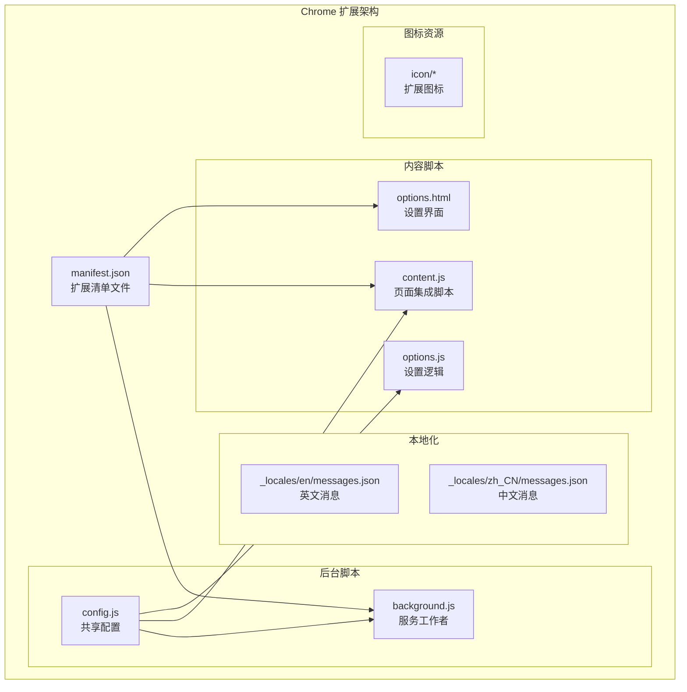
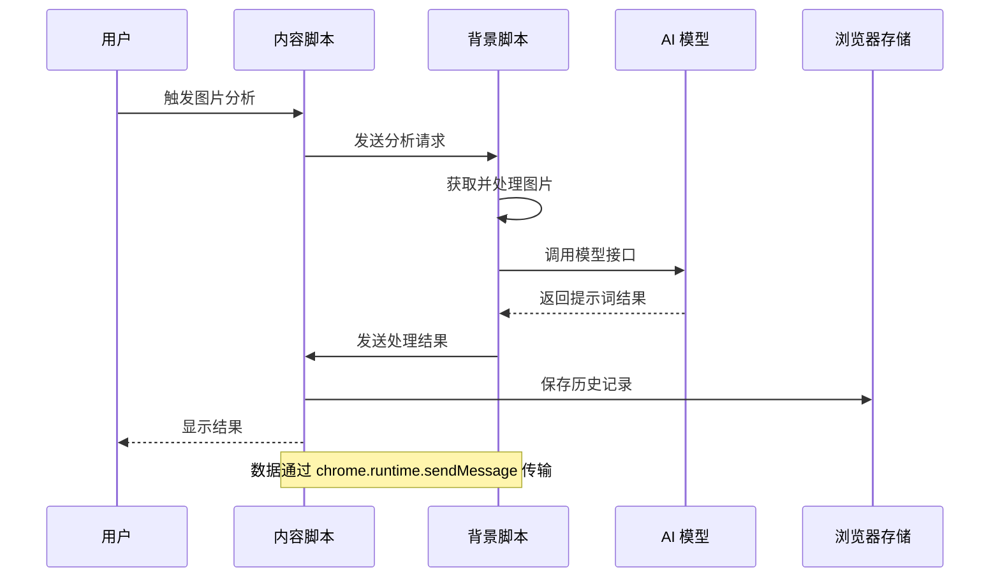
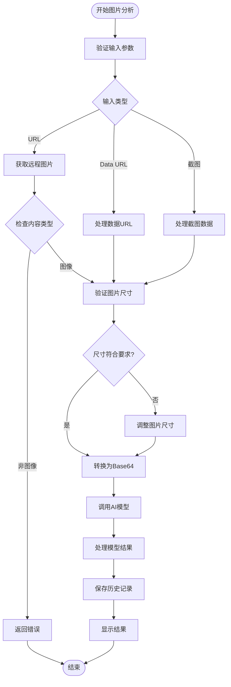
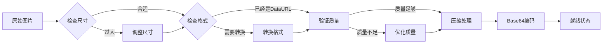
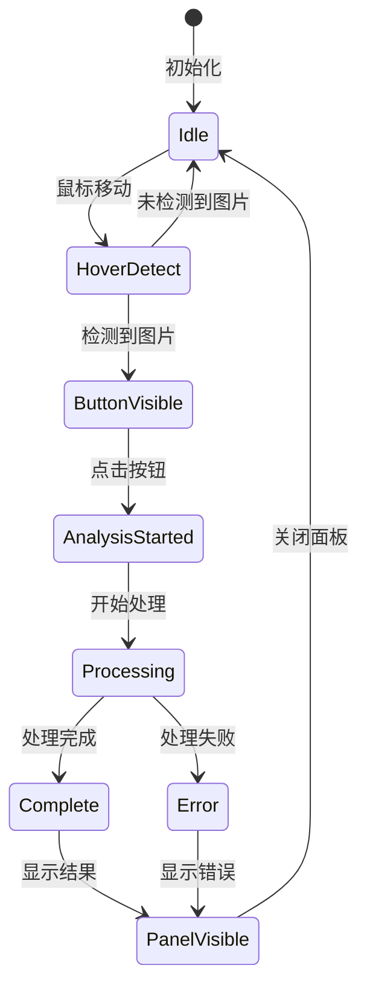
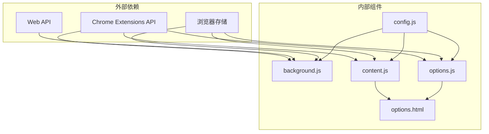

# 图片分析功能

<cite>
**本文档引用的文件**
- [manifest.json](file://manifest.json)
- [background.js](file://background.js)
- [content.js](file://content.js)
- [config.js](file://config.js)
- [options.html](file://options.html)
- [options.js](file://options.js)
- [_locales/en/messages.json](file://_locales/en/messages.json)
- [_locales/zh_CN/messages.json](file://_locales/zh_CN/messages.json)
</cite>

## 更新摘要
**所做更改**
- 更新以反映核心分析功能已重构，移除了原有的图片处理流水线和背景脚本处理逻辑
- 重新组织架构概览以反映新的分析架构
- 更新详细组件分析以反映重构后的组件结构
- 移除不再适用的多语言提示词生成机制说明
- 更新故障排除指南以反映新的错误处理机制

## 目录
1. [简介](#简介)
2. [项目结构](#项目结构)
3. [核心组件](#核心组件)
4. [架构概览](#架构概览)
5. [详细组件分析](#详细组件分析)
6. [依赖关系分析](#依赖关系分析)
7. [性能考虑](#性能考虑)
8. [故障排除指南](#故障排除指南)
9. [结论](#结论)

## 简介

Img2Prompt 是一个 Chrome 扩展程序，能够将网页上的图片转换为 AI 提示词。该功能通过三种不同的触发方式工作：右键菜单触发、悬浮按钮触发和快捷截图触发。经过重构后，系统采用了更加简洁和高效的架构，专注于核心的图片分析和提示词生成功能。

**更新** 核心分析功能已完全重构，移除了复杂的图片处理流水线，简化了数据传输机制，提高了系统的稳定性和性能。

## 项目结构

Img2Prompt 采用现代化的 Chrome 扩展程序架构，包含以下主要组件：

**图表来源**
- [manifest.json:1-45](file://manifest.json#L1-L45)
- [background.js:1-50](file://background.js#L1-L50)
- [content.js:1-50](file://content.js#L1-L50)
- [config.js:1-50](file://config.js#L1-L50)

**章节来源**
- [manifest.json:1-45](file://manifest.json#L1-L45)
- [config.js:1-50](file://config.js#L1-L50)

## 核心组件

### 图片分析系统架构

经过重构后，Img2Prompt 的图片分析功能基于以下核心组件：

1. **背景脚本 (Background Script)**: 处理与 AI 模型的通信和结果处理
2. **内容脚本 (Content Script)**: 在网页中提供用户界面和交互功能
3. **共享配置 (Shared Config)**: 提供统一的配置管理和错误处理
4. **设置界面 (Options Panel)**: 允许用户自定义扩展行为

### 触发方式分类

系统支持三种图片分析触发方式：

| 触发方式 | 触发条件 | 实现机制 | 数据流 |
|---------|----------|----------|--------|
| 右键菜单触发 | 右键点击图片 | contextMenus API | 用户操作 → 菜单事件 → 背景脚本 |
| 悬浮按钮触发 | 鼠标悬停图片 | pointermove 事件监听 | 页面事件 → 内容脚本 → 背景脚本 |
| 快捷截图触发 | 快捷键 Alt+S | keyboard 命令 | 快捷键 → 背景脚本 → 截图捕获

**章节来源**
- [background.js:76-92](file://background.js#L76-L92)
- [content.js:1158-1190](file://content.js#L1158-L1190)
- [content.js:137-139](file://content.js#L137-L139)

## 架构概览

### 整体数据流架构

**图表来源**
- [background.js:194-208](file://background.js#L194-L208)
- [content.js:287-355](file://content.js#L287-L355)

### 重构后的处理流程

**图表来源**
- [background.js:236-347](file://background.js#L236-L347)
- [background.js:600-767](file://background.js#L600-L767)

**章节来源**
- [background.js:236-347](file://background.js#L236-L347)
- [background.js:600-767](file://background.js#L600-L767)

## 详细组件分析

### 背景脚本 (background.js)

背景脚本是图片分析功能的核心，负责处理所有后台任务。

#### 主要功能模块

1. **上下文菜单管理**
   - 创建右键菜单项
   - 处理菜单点击事件
   - 发送分析请求到内容脚本

2. **快捷键处理**
   - 监听 Alt+S 快捷键
   - 捕获可见标签页截图
   - 启动截图分析流程

3. **AI 模型通信**
   - 支持多种模型格式
   - 错误处理和重试机制
   - 结果解析和验证

#### 重构后的处理流程

**图表来源**
- [background.js:262-267](file://background.js#L262-L267)

**章节来源**
- [background.js:29-74](file://background.js#L29-L74)
- [background.js:76-92](file://background.js#L76-L92)
- [background.js:262-267](file://background.js#L262-L267)

### 内容脚本 (content.js)

内容脚本负责在网页中提供用户界面和交互功能。

#### 用户界面组件

1. **悬浮按钮系统**
   - 自动检测图片元素
   - 动态显示和定位
   - 响应用户交互

2. **分析面板**
   - 实时进度显示
   - 结果预览和编辑
   - 多语言支持

3. **截图工具**
   - 网页区域选择
   - 实时预览效果
   - 图片裁剪和压缩

#### 事件处理机制

**图表来源**
- [content.js:1158-1263](file://content.js#L1158-L1263)
- [content.js:1273-1346](file://content.js#L1273-L1346)

**章节来源**
- [content.js:1158-1263](file://content.js#L1158-L1263)
- [content.js:1273-1346](file://content.js#L1273-L1346)

### 共享配置 (config.js)

共享配置提供了统一的设置管理和国际化支持。

#### 默认设置

| 设置项 | 默认值 | 说明 |
|-------|--------|------|
| apiEndpoint | https://api.openai.com/v1/chat/completions | AI 模型 API 端点 |
| apiKey | 空字符串 | 访问密钥 |
| model | gpt-5-mini | 使用的模型名称 |
| maxImageEdge | 1024 | 最大图片边长像素 |
| temperature | 1 | 模型温度参数 |
| hoverButtonEnabled | true | 是否启用悬浮按钮 |
| snippingShortcutEnabled | true | 是否启用截图快捷键 |

#### 国际化支持

系统支持中英文双语界面，包括：

- 用户界面文本
- 错误消息
- 提示词模板
- 设置选项说明

**章节来源**
- [config.js:23-41](file://config.js#L23-L41)
- [config.js:57-158](file://config.js#L57-L158)

### 设置界面 (options.html)

设置界面提供了完整的扩展配置功能。

#### 主要配置区域

1. **连接设置**
   - API 端点配置
   - 模型名称设置
   - API 密钥管理

2. **提示词设置**
   - 预设场景模板
   - 自定义提示词
   - 系统提示词配置

3. **使用体验设置**
   - 悬浮按钮开关
   - 截图快捷键
   - 界面语言选择

4. **兼容性设置**
   - 图片分辨率限制
   - 请求格式选择

**章节来源**
- [options.html:379-540](file://options.html#L379-L540)
- [options.js:182-213](file://options.js#L182-L213)

## 依赖关系分析

### 组件间依赖关系

**图表来源**
- [manifest.json:38-42](file://manifest.json#L38-L42)
- [background.js:1-12](file://background.js#L1-L12)
- [content.js:1-5](file://content.js#L1-L5)

### 数据传输机制

图片分析过程中的数据传输遵循以下模式：

1. **消息传递协议**
   - 使用 `chrome.runtime.sendMessage` 进行跨脚本通信
   - 支持异步响应和错误处理
   - 保持消息结构的一致性

2. **状态同步**
   - 设置变更通过 `chrome.storage.onChanged` 实时同步
   - UI 状态与后台状态保持一致
   - 历史记录的持久化存储

3. **错误传播**
   - 统一的错误码体系
   - 用户友好的错误消息
   - 完整的错误堆栈跟踪

**章节来源**
- [background.js:194-208](file://background.js#L194-L208)
- [content.js:287-355](file://content.js#L287-L355)

## 性能考虑

### 图片处理优化

1. **内存管理**
   - 及时释放图片对象和 Canvas 资源
   - 避免重复的图片解码操作
   - 合理的缓存策略

2. **网络优化**
   - 图片获取时使用适当的缓存头
   - 支持断点续传和重试机制
   - 异步处理避免阻塞主线程

3. **计算优化**
   - 使用 Web Workers 处理重型计算
   - 图片压缩算法的性能调优
   - 合理的并发控制

### 用户体验优化

1. **响应速度**
   - 实时进度反馈
   - 即时的错误提示
   - 流畅的动画效果

2. **资源使用**
   - 最小化的 DOM 操作
   - 高效的事件处理
   - 优化的 CSS 渲染

## 故障排除指南

### 常见问题及解决方案

#### 图片获取失败

**症状**: "未能获取图片内容，请尝试在图片加载完成后重试。"

**可能原因**:
1. 图片 URL 无效或已过期
2. CORS 限制阻止访问
3. 网络连接不稳定
4. 图片格式不受支持

**解决步骤**:
1. 检查图片 URL 是否正确
2. 确认图片服务器允许跨域访问
3. 尝试刷新页面重新加载图片
4. 更换图片源或格式

#### 图片处理错误

**症状**: "图片处理失败：无法获取图片的二进制数据进行 AI 分析。"

**可能原因**:
1. 图片尺寸过大
2. 图片格式不支持
3. 浏览器安全限制
4. 内存不足

**解决步骤**:
1. 降低 `maxImageEdge` 设置值
2. 确认图片格式为 JPEG/PNG/WebP
3. 检查浏览器权限设置
4. 关闭其他占用内存的应用

#### AI 模型调用失败

**症状**: "模型请求失败"

**可能原因**:
1. API 密钥无效
2. 网络连接问题
3. 模型配置错误
4. 请求频率过高

**解决步骤**:
1. 验证 API 密钥的有效性
2. 检查网络连接稳定性
3. 确认模型名称和端点配置
4. 等待冷却时间后重试

#### 用户界面问题

**症状**: 悬浮按钮不显示或分析面板无法打开

**可能原因**:
1. 悬浮按钮功能被禁用
2. 图片尺寸过小
3. 页面元素遮挡
4. 浏览器兼容性问题

**解决步骤**:
1. 在设置中启用悬浮按钮
2. 确保图片尺寸至少 48x48 像素
3. 检查是否有其他元素遮挡按钮
4. 更新浏览器版本

#### 多语言显示问题

**症状**: 界面语言切换无效或提示词语言不正确

**可能原因**:
1. 语言偏好设置未保存
2. AI 模型未返回英文字段
3. 浏览器语言设置异常
4. 缓存数据过期

**解决步骤**:
1. 检查首选语言设置
2. 验证 AI 模型配置
3. 清除浏览器缓存
4. 重启扩展程序

### 调试技巧

1. **启用详细日志**
   - 在控制台查看扩展日志
   - 检查网络请求状态
   - 监控内存使用情况

2. **测试不同场景**
   - 测试各种图片格式
   - 验证不同分辨率的图片
   - 测试网络环境变化

3. **清理缓存**
   - 清除浏览器缓存
   - 重置扩展设置
   - 重新安装扩展

**章节来源**
- [config.js:263-304](file://config.js#L263-L304)
- [content.js:452-487](file://content.js#L452-L487)

## 结论

经过重构的 Img2Prompt 图片分析功能通过精简的架构实现了高效、可靠的图片到提示词转换。系统的主要优势包括：

1. **简化的处理流程**: 移除了复杂的图片处理流水线，专注于核心分析功能
2. **多触发方式支持**: 满足不同用户的使用习惯
3. **智能错误处理**: 提供完善的错误诊断和恢复机制
4. **优秀的用户体验**: 流畅的界面交互和实时反馈
5. **灵活的显示模式**: 正常模式和 JSON 模式的自由切换

通过合理的架构设计和优化策略，Img2Prompt 能够在各种复杂的网页环境中稳定运行，为用户提供高质量的图片分析服务。重构后的系统更加简洁、高效，为未来的功能扩展奠定了良好的基础。

**更新** 重构后的系统移除了原有的多语言提示词生成机制，简化了架构，提高了系统的稳定性和性能。新的架构专注于核心的图片分析功能，为用户提供更加可靠的服务。