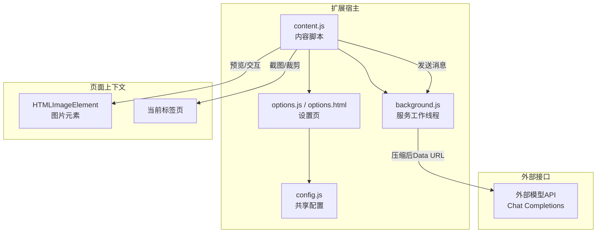
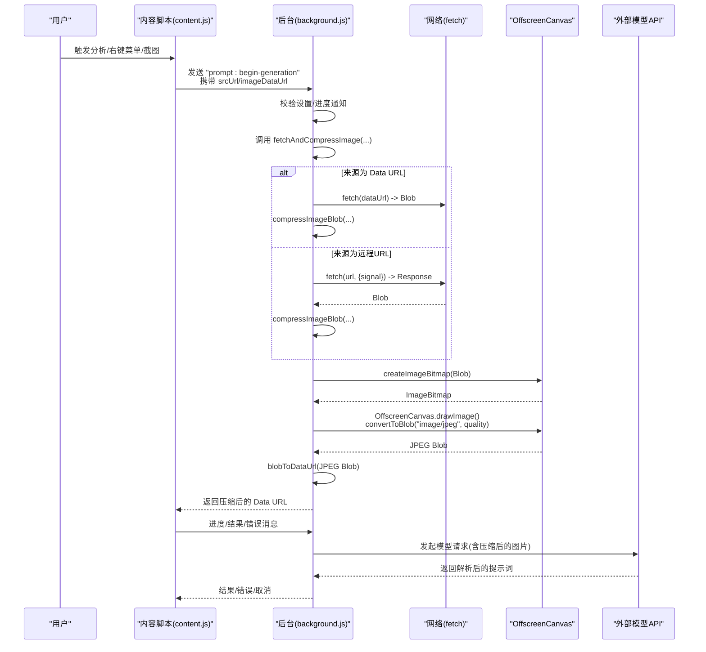
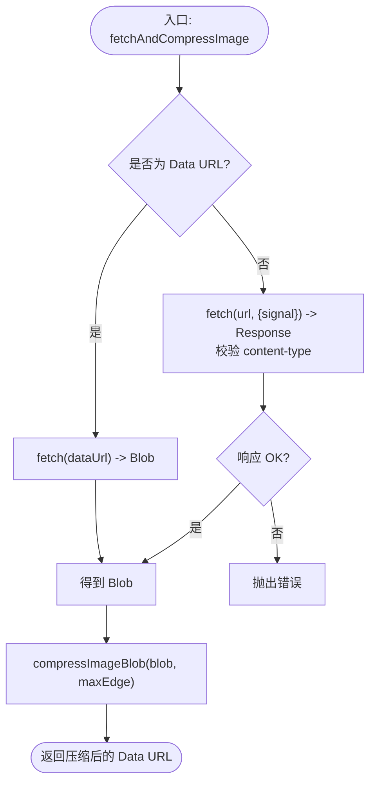
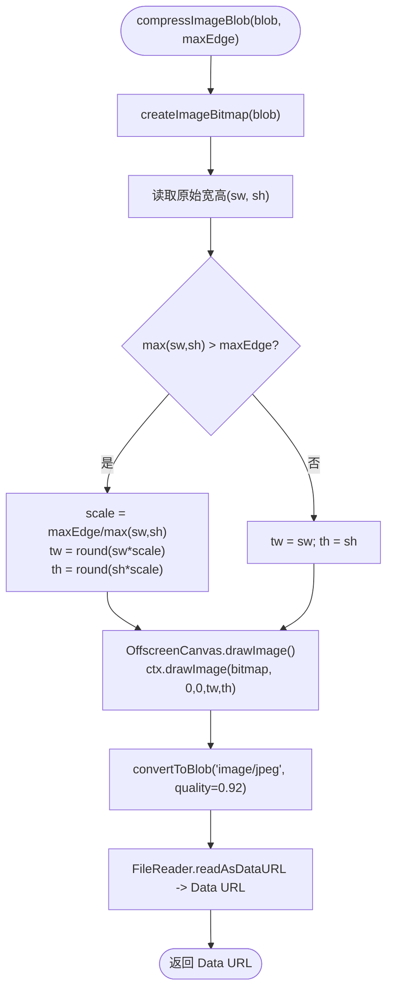
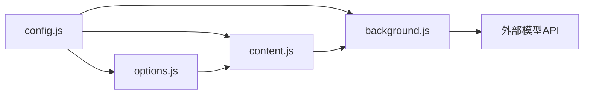
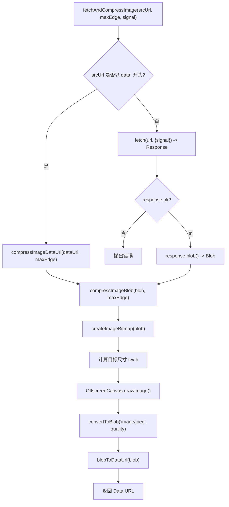

# 图片处理与压缩

<cite>
**本文引用的文件列表**
- [background.js](file://background.js)
- [content.js](file://content.js)
- [config.js](file://config.js)
- [manifest.json](file://manifest.json)
- [options.js](file://options.js)
- [options.html](file://options.html)
- [_locales\zh_CN\messages.json](file://_locales\zh_CN\messages.json)
- [_locales\en\messages.json](file://_locales\en\messages.json)
</cite>

## 目录
1. [简介](#简介)
2. [项目结构](#项目结构)
3. [核心组件](#核心组件)
4. [架构总览](#架构总览)
5. [详细组件分析](#详细组件分析)
6. [依赖关系分析](#依赖关系分析)
7. [性能考量](#性能考量)
8. [故障排查指南](#故障排查指南)
9. [结论](#结论)
10. [附录](#附录)

## 简介
本技术文档聚焦于 Img2Prompt 扩展的“图片处理与压缩”能力，围绕图片获取后的处理流程展开，包括：
- 图片来源类型识别与统一处理（URL、Data URL）
- 格式验证与尺寸检测
- 压缩算法实现（最大边长限制、质量控制、OffscreenCanvas 转码）
- Base64 编码转换与数据安全校验
- 性能优化与内存监控建议

目标是帮助开发者理解从页面触发到后台压缩、再到模型请求的整体链路，并掌握可调参数与优化策略。

## 项目结构
该扩展采用 Manifest V3 架构，主要由以下模块组成：
- 配置共享：全局配置对象集中于 config.js，供后台脚本与选项页复用
- 内容脚本：负责 UI 交互、消息转发、截图裁剪与预览展示
- 后台脚本：负责图片抓取、压缩、错误分类与模型请求
- 选项页：提供设置项、历史记录与自定义提示词模板
- 国际化资源：多语言文案与扩展元信息

图表来源
- [background.js:1-184](file://background.js#L1-L184)
- [content.js:1-163](file://content.js#L1-L163)
- [config.js:1-253](file://config.js#L1-L253)
- [options.js:1-551](file://options.js#L1-L551)
- [options.html:1-687](file://options.html#L1-L687)

章节来源
- [manifest.json:1-45](file://manifest.json#L1-L45)
- [config.js:1-253](file://config.js#L1-L253)

## 核心组件
- 图片处理管线（后台）：统一入口函数负责来源识别、抓取、尺寸与格式校验、压缩与编码
- 压缩算法（后台）：基于 OffscreenCanvas 的高质量重采样与 JPEG 转码
- 设置与 UI（内容脚本/选项页）：分辨率上限、语言、悬停按钮、截图工具等
- 错误分类与用户提示（后台）：将底层异常映射为用户可理解的消息

章节来源
- [background.js:775-849](file://background.js#L775-L849)
- [content.js:30-51](file://content.js#L30-L51)
- [options.js:407-422](file://options.js#L407-L422)

## 架构总览
图片处理与压缩的端到端流程如下：

图表来源
- [background.js:212-320](file://background.js#L212-L320)
- [background.js:775-849](file://background.js#L775-L849)
- [content.js:249-326](file://content.js#L249-L326)

## 详细组件分析

### 组件一：fetchAndCompressImage 统一入口
职责与流程
- 输入：图片 URL 或 Data URL
- 输出：压缩后的 Data URL（JPEG）
- 关键步骤：
  - 判断是否为 Data URL；若是则直接进入压缩流程
  - 否则发起网络请求抓取图片，校验响应头类型（非 image/* 时发出警告）
  - 将响应体转为 Blob，交由 compressImageBlob 处理
- 取消信号：支持 AbortSignal，便于在用户取消时中断网络请求

图表来源
- [background.js:775-807](file://background.js#L775-L807)

章节来源
- [background.js:775-807](file://background.js#L775-L807)

### 组件二：compressImageBlob 与 OffscreenCanvas 压缩
职责与流程
- 输入：Blob
- 输出：JPEG Blob（Data URL）
- 关键步骤：
  - 使用 createImageBitmap 将 Blob 解码为位图
  - 计算目标宽高：若最大边超过阈值，则按比例缩放
  - 创建 OffscreenCanvas，绘制缩放后的图像
  - convertToBlob 转换为 JPEG，质量参数固定
  - FileReader 读取为 Data URL 返回

图表来源
- [background.js:815-839](file://background.js#L815-L839)

章节来源
- [background.js:815-839](file://background.js#L815-L839)

### 组件三：compressImageDataUrl 与 blobToDataUrl
- compressImageDataUrl：当输入已是 Data URL 时，先通过 fetch 解析为 Blob，再走统一压缩流程
- blobToDataUrl：将 Blob 读取为 Data URL，作为最终输出

章节来源
- [background.js:809-813](file://background.js#L809-L813)
- [background.js:842-849](file://background.js#L842-L849)

### 组件四：内容脚本中的分辨率与质量常量
- 内容脚本中定义了默认最大边长与 JPEG 质量常量，用于 UI 展示与截图裁剪（不同用途）
- 实际运行时以后台脚本的设置为准（来自存储与配置）

章节来源
- [content.js:30-35](file://content.js#L30-L35)
- [config.js:14](file://config.js#L14)

### 组件五：选项页与设置联动
- 选项页提供分辨率下拉选择（512/768/1024/1280），写入存储并在变更时通知内容脚本
- 自动保存与语言切换均通过存储事件同步到各模块

章节来源
- [options.html:638-654](file://options.html#L638-L654)
- [options.js:407-422](file://options.js#L407-L422)
- [options.js:504-531](file://options.js#L504-L531)

## 依赖关系分析
- 配置共享：config.js 提供 DEFAULT_SETTINGS、UI_STRINGS、错误码与消息、PostHog 配置，被 background.js 与 options.js 引用
- 内容脚本依赖：content.js 依赖 config.js 中的 UI 文案与默认设置
- 后台脚本依赖：background.js 依赖 config.js 的默认值与错误映射
- 选项页依赖：options.js 依赖 config.js 的翻译与默认设置

图表来源
- [config.js:1-253](file://config.js#L1-L253)
- [background.js:1-12](file://background.js#L1-L12)
- [options.js:1-7](file://options.js#L1-L7)
- [content.js:1-4](file://content.js#L1-L4)

章节来源
- [config.js:1-253](file://config.js#L1-L253)
- [background.js:1-12](file://background.js#L1-L12)
- [options.js:1-7](file://options.js#L1-L7)
- [content.js:1-4](file://content.js#L1-L4)

## 性能考量
- 最大边长限制
  - 默认值来自配置，可在选项页调整（512/768/1024/1280）
  - 后台脚本在压缩前按比例缩放，显著降低像素数量与后续传输体积
- JPEG 质量控制
  - OffscreenCanvas 转码时使用固定质量参数，兼顾体积与视觉质量
  - 若网络环境较差，建议进一步降低最大边长
- 内存优化策略
  - 使用 OffscreenCanvas 在主线程外执行绘制与转码，避免阻塞 UI
  - ImageBitmap 释放：在绘制完成后及时关闭，减少内存占用
  - 数据流：Blob -> ImageBitmap -> OffscreenCanvas -> Blob -> Data URL，尽量避免中间态驻留
- 取消与超时
  - 支持 AbortSignal，用户取消时立即中断网络请求与后续处理
  - 后台脚本对网络错误、超时、429 等进行分类，避免重复尝试

章节来源
- [background.js:815-839](file://background.js#L815-L839)
- [background.js:872-939](file://background.js#L872-L939)
- [options.js:504-531](file://options.js#L504-L531)

## 故障排查指南
- 常见错误与分类
  - 网络错误：无法抓取图片、连接失败
  - 图片获取失败：URL 无效、404、跨域限制
  - 图片处理失败：解码失败、空 Blob、Base64 转换失败
  - API 认证失败：401/403
  - 速率限制：429
  - 超时：408 或服务端超时
  - JSON 解析失败：模型返回非预期内容
  - 缺失字段：返回缺少 zh/en
- 用户提示映射
  - 后台根据错误码映射到 UI_STRINGS 中的用户友好消息
  - 选项页与内容脚本显示对应状态与错误信息
- 定位建议
  - 检查 API 端点、密钥与模型名称
  - 降低最大边长或切换模型
  - 确认图片 URL 可访问且为图片类型
  - 查看后台日志与进度消息，确认是否被取消

章节来源
- [background.js:872-939](file://background.js#L872-L939)
- [config.js:206-247](file://config.js#L206-L247)
- [content.js:452-487](file://content.js#L452-L487)

## 结论
Img2Prompt 的图片处理与压缩以“统一入口 + OffscreenCanvas + JPEG 转码”为核心，结合设置项与错误分类，实现了稳定、可调、可扩展的图片输入管线。通过合理设置最大边长与质量参数，可在保证视觉质量的同时显著降低体积与延迟。建议在复杂场景下优先使用较低分辨率与合适的模型，配合取消机制提升用户体验。

## 附录

### 支持的图片格式与处理差异
- 输入来源
  - Data URL：直接解码为 Blob，走统一压缩流程
  - 远程 URL：抓取后校验 content-type，随后解码与压缩
- 格式处理
  - 统一转码为 JPEG（质量固定），确保后续模型兼容性
  - 非 image/* 类型会发出警告，但不影响压缩流程
- Base64 编码
  - 通过 FileReader 将 JPEG Blob 转为 Data URL，供模型请求使用

章节来源
- [background.js:775-807](file://background.js#L775-L807)
- [background.js:842-849](file://background.js#L842-L849)

### 关键流程与数据流图（代码级）

图表来源
- [background.js:775-849](file://background.js#L775-L849)